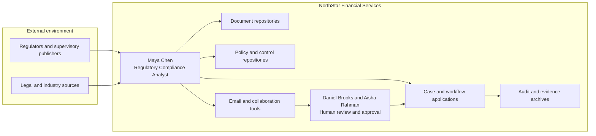
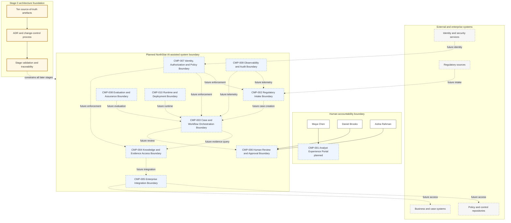

# 03 - Architecture Baseline

| Field | Value |
|---|---|
| Architecture version | 0.1.0 |
| Baseline date | 2026-07-31 |
| Maturity | M0 - manual process plus accepted architecture constitution |
| Runtime implementation | None |
| Status | Baseline candidate |

## 1. Architecture state at Stage 0

NorthStar currently operates a manual, fragmented regulatory-change process. Stage 0 adds no AI runtime capability. It establishes the authoritative architecture boundaries, principles, identifiers and planned responsibility model that later stages must refine progressively.

The planned components below are conceptual boundaries, not deployed services. A later stage may split or consolidate them only through an ADR and impact analysis.

## 2. Architecture before the change - current manual state

The current state preserves human accountability but provides weak consistency, traceability and reuse. Information is copied between systems and evidence is assembled manually.

## 3. Cumulative logical architecture baseline

The only implemented Stage 0 capability is the governance foundation represented by the source-of-truth artefacts, ADR process and validation. Runtime components remain planned.

## 4. Planned responsibility boundaries

| Component | Responsibility boundary | Stage first expected to become active |
|---|---|---|
| CMP-001 | User experience, evidence display, review actions and status | S01 |
| CMP-002 | Publication upload/intake, source preservation and metadata validation | S01 |
| CMP-003 | Case lifecycle, workflow/agent control and structured outputs | S01, then evolves S03-S06 |
| CMP-004 | Retrieval, knowledge access, citation and evidence assembly | S02 |
| CMP-005 | Typed adapters to policies, controls, business and external systems | S02-S03 |
| CMP-006 | Review queues, approval, override, escalation and separation of duties | S04 |
| CMP-007 | Identity, authorization, policy decision and enforcement | Initial controls S03; full design S09 |
| CMP-008 | Datasets, tests, evaluations, deployment gates and model-risk evidence | Initial tests S01; full design S08 |
| CMP-009 | Correlated telemetry, evidence ledger and audit package | Initial logs S01; full design S10 |
| CMP-010 | Runtime, persistence, deployment, resilience and operational controls | Local runtime S01; full production S10 |

## 5. Architecture layers

The cumulative architecture will maintain these layers, even when implemented by few components in early stages:

1. Experience and interaction.
2. Intake and API.
3. Workflow and agent orchestration.
4. Cognition and model routing.
5. Tools and enterprise integration.
6. Knowledge and retrieval.
7. State and memory.
8. Identity, authorization and policy.
9. Evaluation and assurance.
10. Observability and audit.
11. Runtime, inference and infrastructure.
12. Governance and management/control plane.

## 6. Security boundaries

| Boundary | Rule |
|---|---|
| Human accountability | High-risk or irreversible outcomes require named human action. |
| NorthStar system boundary | All external content, models and tools are treated as untrusted or partially trusted inputs. |
| Data access boundary | Retrieval and tool access are filtered by identity, purpose, case and data classification. |
| Execution boundary | Model output cannot directly produce an external side effect without validation and authorization. |
| Audit boundary | Material events are attributable and protected from alteration. |
| Development boundary | Early labs use synthetic or approved sample data, not production confidential data. |

## 7. Deployment assumptions

- Stage 0 and early stages target a local development machine with modest resources.
- Paid model access is optional; local or mock alternatives are supplied when the stage requires execution.
- Production deployment is not selected in Stage 0.
- NorthStar may ultimately require hybrid, sovereign or regional processing; data-residency requirements must remain portable.
- Network, model and enterprise services are considered fallible dependencies.

## 8. Architecture invariants

1. The case is the principal business unit of state and audit.
2. Source evidence is immutable or content-addressed once attached to a case.
3. AI-generated content is never confused with human approval.
4. Critical policies are enforced outside the model.
5. Every side effect is attributable to a human or workload identity and a scoped authorization decision.
6. Later agents cannot bypass the case, policy, evidence or audit boundaries.
7. A multi-agent design is not assumed and must be justified by measured need.
8. The control plane must govern without centralizing every latency-sensitive runtime decision.
9. Hidden model chain-of-thought is not an architecture dependency or audit requirement.

## 9. Stage 0 architecture change

- **Before:** Manual process with no stable architecture constitution or cumulative repository baseline.
- **New requirement:** Preserve continuity across a long, multi-stage technical book and implementation.
- **Change:** Establish authoritative artefacts, identifiers, planned boundaries, repository conventions and validation.
- **After:** Runtime remains manual, but future changes are governed by a stable baseline.
- **Trade-off:** More documentation and change discipline at the beginning in exchange for reduced contradiction, rework and architecture drift.

## 10. Unresolved architecture problem for Stage 1

NorthStar still has no working assistance for Maya's urgent publication. Stage 1 must evaluate the simplest viable improvement and implement a limited LLM-based summarizer without falsely treating it as an agent or grounded decision system.
