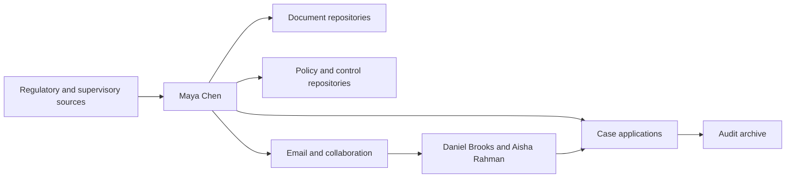
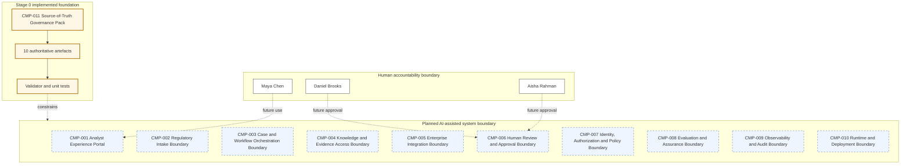

# Stage 0 - Constitution, Story Baseline, Requirements and Architecture Conventions

| Field | Value |
|---|---|
| Stage identifier | S00 |
| Architecture version | 0.1.0 |
| Repository version | 0.1.0 |
| Handoff version | 0.1.0 |
| Execution date | 2026-07-31 |
| Status | Completed as baseline candidate; Stage 1 not started |

## 1. Context Carried Forward

No prior accepted architecture or repository baseline existed. The supplied narrative master defines a coherent NorthStar Financial Services story and a progressive implementation from a manual regulatory process to a production architecture. The execution controller adds a required Stage 0 and makes ten cumulative Markdown artefacts authoritative.

A source-order conflict existed because the narrative master says to begin with its Stage 1, while the controller says Stage 0 must be executed first. The safest consistent interpretation is recorded in `ADR-001`: the controller governs sequence, the narrative master governs scope, and the continuation prompt is used only after Stage 0 acceptance.

Current architecture maturity is **M0: manual process plus constitution**. No assistant, RAG, agent, tool, graph or production runtime has been implemented. This stage modifies the repository baseline and creates all ten source-of-truth artefacts.

## 2. Narrative Development

Maya Chen's problem begins before any model is selected. NorthStar's regulatory analysts manually monitor publications, interpret obligations, search internal policies and controls, estimate impact, assemble evidence and route findings for review. Daniel Brooks remains accountable for high-risk compliance decisions, while Aisha Rahman owns the affected business processes and controls.

Priya Raman sees a larger risk than choosing the wrong model: a long architecture tutorial can quietly change names, requirements, schemas and assumptions from one chapter to the next. Before NorthStar builds even a summarizer, she establishes an architecture constitution so every later capability must trace to an accepted business need and preserve human accountability.

## 3. Problem Being Solved

Stage 0 solves project-level architecture drift, not the regulatory workflow itself.

Without a constitution, the playbook could:

- Restart the NorthStar story in each stage.
- Renumber or rename requirements and components.
- Present planned capabilities as implemented.
- Build disconnected repositories and diagrams.
- Select frameworks before requirements are known.
- Lose the distinction between AI inference and human decision.
- Contradict earlier security, data or evaluation choices.

The stage therefore creates a stable, testable foundation that later stages must reconstruct and update.

## 4. Requirements Introduced or Updated

Stage 0 accepts:

- `US-001` through `US-012` for the NorthStar regulatory-change journey.
- `FR-001` through `FR-020` for intake, analysis, evidence, workflow, approval, remediation, audit, authorization, evaluation and change control.
- `NFR-001` through `NFR-022` for accountability, evidence, security, privacy, isolation, resilience, performance, cost, portability and assurance.
- `POL-001` through `POL-008` and `CTL-001` through `CTL-008` as foundational policy-control pairs.

These requirements are accepted but not implemented, except for project-governance requirements realized by `CMP-011 Source-of-Truth Governance Pack`.

## 5. Conceptual Explanation

An **architecture constitution** is a compact set of accepted rules that governs how a system may evolve. It is not a detailed target architecture. It establishes authority, vocabulary, invariants, identifiers, boundaries, traceability and change control.

For this playbook, the constitution has three roles:

1. **Narrative control:** Preserve NorthStar, the personas, the user story and the unresolved problem across stages.
2. **Architecture control:** Preserve requirements, component responsibilities, schemas, interfaces, decisions and security boundaries.
3. **Delivery control:** Preserve one repository, compatible code, executable tests, citation quality and a reusable handoff.

The ten source-of-truth artefacts are deliberately separated by concern so a later stage can reconstruct the current state without rereading the entire book.

## 6. When This Capability Is Required

A formal foundation is required when:

- A book or system evolves over many stages or teams.
- Requirements, diagrams and code must remain traceable.
- Regulated or high-impact decisions require attributable change control.
- Multiple implementation options will be compared over time.
- Schemas and interfaces must remain compatible while architecture matures.
- A later contributor must resume work from artefacts rather than conversational memory.

## 7. When It Is Not Required

This level of constitution is unnecessary for a disposable one-file experiment, a short conceptual explanation or a demonstration with no continuity requirement. Applying all ten artefacts to a tiny prototype can create documentation overhead without reducing meaningful risk.

NorthStar does require it because the planned work spans business architecture, agent engineering, security, evaluation, performance and production operations.

## 8. Architecture Options

### Option A - Conversation-only continuity

Use prior chat messages as the project record.

- Lowest initial effort.
- High risk of omissions, contradictions and inaccessible context.
- Not suitable for a cumulative technical book.

### Option B - One monolithic master document

Keep all requirements, decisions, diagrams and handoff in a single file.

- Easy to locate.
- Difficult to update safely and prone to duplicated facts.
- Weak for automated checks and targeted reconstruction.

### Option C - Ten authoritative artefacts in one evolving repository

Separate constitution, story, requirements, architecture, catalogues, schemas, ADRs, manifest, risks and handoff.

- More initial discipline.
- Strong traceability, compatibility and resumability.
- Supports automated structural validation.

### Option D - External architecture-management platform from the beginning

Use a commercial repository, requirements tool or enterprise architecture suite.

- Strong workflows and governance potential.
- Adds platform dependency and setup before the tutorial has implementation needs.

## 9. Decision Matrix

| Criterion | Conversation only | One document | Ten artefacts in repository | External platform |
|---|---:|---:|---:|---:|
| Continuity | Low | Medium | High | High |
| Change traceability | Low | Medium | High | High |
| Local portability | High | High | High | Medium/Low |
| Automated validation | Low | Medium | High | High |
| Initial effort | Very low | Low | Medium | High |
| Vendor neutrality | High | High | High | Variable |
| Fit for staged tutorial | Low | Medium | **High** | Medium |

## 10. Selected Architecture and Rationale

**Selected:** Option C, recorded in `ADR-004`.

The canonical repository is `northstar-agentic-compliance`; the ten artefacts live in `docs/source-of-truth/`. Markdown keeps them portable, reviewable and version-control friendly. A small standard-library validator checks existence, required sections, identifier format, catalogue references and repository paths.

The design deliberately avoids an external framework in Stage 0. Framework, model, vector store, workflow engine and deployment decisions are deferred under `ADR-006` until a stage provides concrete requirements.

## 11. Architecture Before the Change



The manual architecture has human accountability but no stable AI-project baseline, no cumulative repository and no accepted component or schema vocabulary.

## 12. Architecture After the Change



The runtime has not changed. The architecture after Stage 0 is a governed development baseline with planned responsibility boundaries.

## 13. Detailed Component Design

`CMP-011 Source-of-Truth Governance Pack` is the only implemented component.

Responsibilities:

- Maintain the ten accepted artefacts.
- Record stable identifiers and current versions.
- Define source precedence and change control.
- Provide the cumulative architecture baseline.
- Maintain requirements traceability and repository state.
- Provide the exact next-stage reconstruction input.
- Validate structural consistency without external dependencies.

It does not make regulatory decisions, run models, retrieve evidence or execute tools.

The planned components `CMP-001` through `CMP-010` are logical responsibility boundaries. They are not mandatory microservices. During early stages, several may run in one local process; later separation requires a demonstrated scaling, trust, resilience or ownership need.

## 14. Data, State and Interface Design

Stage 0 defines conceptual data objects `DATA-001` through `DATA-014`. Only `DATA-014 ArchitectureArtefact` exists physically as Markdown files.

The principal future state object is `DATA-002 RegulatoryCase`. It will own lifecycle, status and references while preserving a strict distinction among:

- Source facts.
- System inferences.
- Human review decisions.
- Unresolved uncertainty.

Conceptual interfaces `INT-001` through `INT-008` define intake, evidence query, enterprise adapters, approval, policy decision, evaluation, audit and runtime health. They remain protocol neutral.

## 15. Implementation

The implementation is a repository scaffold plus a machine-readable constitution module, a dependency-free validator and standard-library unit tests.

### Machine-readable constants

```python
from pathlib import Path

SOURCE_OF_TRUTH_FILES = (
    "00-Project-Constitution.md",
    "01-Business-and-User-Story-Baseline.md",
    "02-Requirements-Register.md",
    "03-Architecture-Baseline.md",
    "04-Component-and-Agent-Catalogue.md",
    "05-Data-and-Schema-Register.md",
    "06-ADR-Register.md",
    "07-Repository-Manifest.md",
    "08-Risk-Assumption-and-Issue-Register.md",
    "09-Stage-Handoff-Pack.md",
)

REPOSITORY_NAME = "northstar-agentic-compliance"
ARCHITECTURE_VERSION = "0.1.0"
```

### Validation approach

The validator checks:

1. Required artefact existence.
2. Required headings.
3. Stable identifier syntax.
4. Conflicting duplicate definitions.
5. Component IDs used by the architecture baseline are catalogued.
6. No Stage 0 agent is falsely claimed as implemented.
7. Manifest-required paths exist.
8. Mermaid fences have matching delimiters and known graph declarations.

Full Mermaid rendering is not claimed; this is recorded as `ISS-004`.

## 16. Code and Repository Changes

### Files added

- Repository metadata: `README.md`, `pyproject.toml`, `.env.example`.
- Ten canonical source-of-truth artefacts.
- This Stage 0 chapter.
- `src/northstar_agentic_compliance/constitution.py`.
- `scripts/validate_source_of_truth.py`.
- `tests/unit/test_source_of_truth.py`.
- Placeholder README files for future architecture, ADR, runbook, data, deployment and notebook directories.

### Files modified

None.

### Files retired

None.

### Migration or compatibility notes

This is repository version 0.1.0. The artefact names, canonical paths and accepted identifiers become compatibility constraints after Stage 0 acceptance.

## 17. Security and Governance Implications

Stage 0 establishes security and governance invariants before model code exists:

- Human accountability is explicit and non-transferable.
- Critical controls are deterministic and external to prompts.
- Identity, authority and delegation must remain distinct.
- Retrieval, memory and telemetry must enforce data classification and case isolation.
- Audit records observable evidence and actions, not hidden chain-of-thought.
- Production data is prohibited in early local labs unless explicitly approved.
- Legal conclusions remain outside system authority.

The immediate governance risk is excessive documentation without implementation. The mitigation is bounded stages and executable validation.

## 18. Performance, Concurrency and Cost Implications

Stage 0 introduces negligible runtime cost because it has no model or external service. Its principal cost is project discipline: maintaining artefacts and traceability.

It avoids inventing production SLOs. `NFR-007` provides only a provisional non-model responsiveness target, while workload-specific model latency, throughput, ISL/OSL distributions and cost are deferred to S07.

No concurrency design is accepted yet.

## 19. Evaluation and Test Cases

The Stage 0 validation suite executed the following:

| ID | Test | Result |
|---|---|---|
| TEST-001 | Ten canonical artefacts exist. | Passed |
| TEST-002 | Required Stage 0 and handoff headings exist. | Passed |
| TEST-003 | Identifier formats and conflicting duplicates are checked. | Passed |
| TEST-004 | Architecture component IDs are catalogued. | Passed |
| TEST-005 | No agent is claimed as implemented. | Passed |
| TEST-006 | Manifest-required repository paths exist. | Passed |
| TEST-007 | Mermaid source receives structural checks. | Passed with recorded exception: not rendered |

The validator and five unit tests passed under Python 3.13.5. Python 3.13 is the accepted project baseline. The full output is included in the generated repository package.

## 20. Failure Scenarios and Recovery

### Failure scenario 1 - Later stage silently renames a component

- Detection: `CMP-003` appears with a different name or responsibility.
- Containment: Stop technical progression.
- Recovery: Identify affected requirements, schemas, diagrams, paths and tests; create a superseding ADR; update every artefact and handoff.

### Failure scenario 2 - A planned capability is described as implemented

- Detection: Handoff or catalogue status conflicts with repository evidence.
- Containment: Mark the stage audit failed.
- Recovery: Correct the claim or add the missing implementation and executed tests before finalization.

### Failure scenario 3 - Source instructions conflict

- Detection: Different documents prescribe incompatible stages or naming.
- Containment: Use the precedence rules and safest consistent interpretation.
- Recovery: Record an issue and resolve through ADR before continuing.

### Failure scenario 4 - Validator cannot fully verify Mermaid

- Detection: Structural checks pass but no renderer is configured.
- Containment: Do not claim visual or parser-level validation.
- Recovery: Record `ISS-004` and introduce an approved renderer later.

## 21. Architecture Decision Records

Stage 0 accepts seven ADRs:

- `ADR-001` Instruction precedence and stage sequence.
- `ADR-002` Progressive simplest-sufficient architecture.
- `ADR-003` Human-accountable bounded autonomy.
- `ADR-004` One cumulative repository and source-of-truth location.
- `ADR-005` Evidence-first audit without hidden chain-of-thought.
- `ADR-006` Vendor-neutral contracts and deferred framework selection.
- `ADR-007` Conceptual component boundaries before runtime decomposition.

Complete records are in `docs/source-of-truth/06-ADR-Register.md`.

## 22. Requirements Traceability Update

The baseline traceability matrix maps each functional requirement to user stories, planned components, controls and future verification stages. Stage 0 directly implements:

| Requirement | Implementation | Verification |
|---|---|---|
| FR-015 | Versioned source-of-truth and change-control artefacts | TEST-001, TEST-002, TEST-006 |
| FR-020 | Stable IDs, repository versions, ADRs and change history | TEST-003, TEST-004 |
| NFR-012 | Vendor-neutral Markdown and protocol-neutral contracts | Review of ADR-006 |
| NFR-014 | Structural validator and unit tests | TEST-001 through TEST-007 |
| NFR-019 | Version and compatibility rules | Manifest and constitution audit |
| NFR-022 | Explicit no-chain-of-thought audit rule | ADR-005 and schema review |

Other requirements remain accepted and planned.

## 23. Stage Outcome

NorthStar now has a stable book and architecture constitution. A later stage can reconstruct the business story, requirements, architecture, component boundaries, schemas, decisions, repository and open risks without depending on chat memory.

The repository can verify its own Stage 0 structure using only Python's standard library.

No AI business capability has been introduced, which is the correct outcome for a foundation stage.

## 24. Known Limitations

1. Maya still has no working assistant.
2. No real or synthetic regulatory fixture has been selected.
3. No model or model adapter exists.
4. No structured summarizer output is implemented.
5. No retrieval, tools, stateful agent, graph, memory or authorization exists.
6. Production SLOs, capacity and cost are unknown.
7. Mermaid diagrams were structurally checked but not rendered.
8. Component and data schemas are conceptual and may require ADR-controlled refinement.
9. Python 3.13 is the accepted baseline; Stage 0 tests passed on Python 3.13.5.

## 25. Narrative Bridge to the Next Stage

Maya receives an urgent publication that may affect lending, payments and customer-data processes. The constitution prevents Priya from jumping directly to an elaborate agent system. She must first examine the manual workflow and compare deterministic automation, search and a basic LLM assistant.

The next stage will implement a useful but deliberately limited regulatory summarizer. Its inability to retrieve NorthStar's policies, preserve durable workflow state, invoke controlled tools or provide verified grounding will create the reason for Stage 2.

## 26. Updated Source-of-Truth Artefacts

Created and baseline-populated:

1. `00-Project-Constitution.md`
2. `01-Business-and-User-Story-Baseline.md`
3. `02-Requirements-Register.md`
4. `03-Architecture-Baseline.md`
5. `04-Component-and-Agent-Catalogue.md`
6. `05-Data-and-Schema-Register.md`
7. `06-ADR-Register.md`
8. `07-Repository-Manifest.md`
9. `08-Risk-Assumption-and-Issue-Register.md`
10. `09-Stage-Handoff-Pack.md`

## 27. Stage Handoff Pack

The complete compact handoff is maintained in `docs/source-of-truth/09-Stage-Handoff-Pack.md`. It records versions, capabilities, ADRs, inventories, tests, limitations, compatibility constraints, required next-stage inputs, the next problem and the exact continuation instruction.

### Stage consistency audit

**Result: Passed with recorded exception.**

- Narrative matches the manual architecture and planned boundaries.
- Diagrams use accepted component names and do not claim runtime implementation.
- Code implements only the governance pack and validation described.
- Components and interfaces match the catalogue.
- Conceptual schemas match their ownership statements.
- Requirements are traceable.
- ADRs reflect actual Stage 0 decisions.
- Security principles match the absence of tool authority.
- Tests match Stage 0 objectives and were executed.
- Repository paths match the manifest.
- No future-stage capability is described as implemented.
- Exception: Mermaid was structurally checked but not rendered (`ISS-004`).
- Exception: None for the Python baseline; tests passed on Python 3.13.5 (`ISS-006` closed by upgrading the baseline to Python 3.13).
