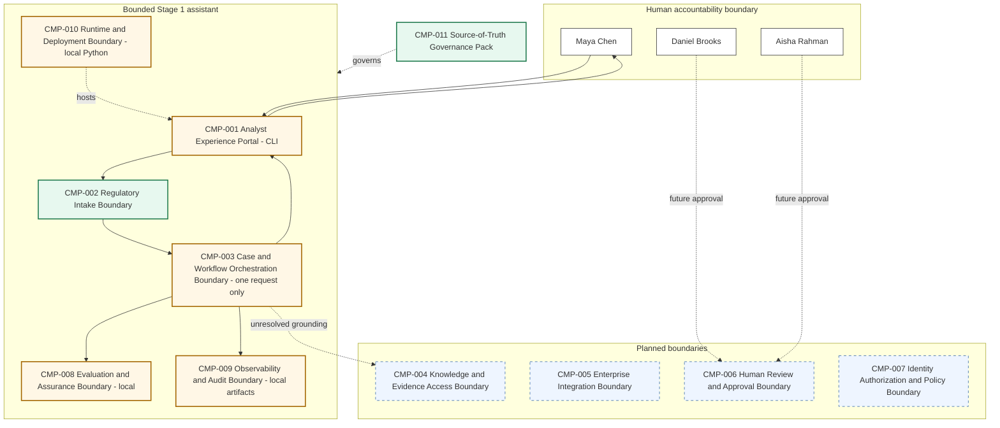

# 03 - Architecture Baseline

**Architecture version:** 0.2.0  
**Maturity:** M1 - bounded single-turn assistant

## Architecture before S01

M0 consisted of the manual regulatory-change process plus `CMP-011 Source-of-Truth Governance Pack`. All runtime boundaries `CMP-001` through `CMP-010` were planned.

## S01 architectural change

- `CMP-001` is partially implemented as a local CLI.
- `CMP-002` is implemented for controlled UTF-8 text/Markdown intake and provenance.
- `CMP-003` is partially implemented as deterministic single-turn application orchestration; it is not an agent loop and does not persist workflow state.
- `CMP-008` is partially implemented through local regression/evaluation tests.
- `CMP-009` is partially implemented through local source, invocation and summary artifacts; it is not a production audit ledger.
- `CMP-010` is partially implemented as a local Python runtime and scripts.
- `CMP-004`, `CMP-005`, `CMP-006` and `CMP-007` remain planned.
- `CMP-011` remains implemented.

## Cumulative logical architecture

## Security boundaries

1. Publication content is untrusted.
2. Model output is untrusted until schema and evidence validation succeed.
3. Disposition and human-review fields are application-owned.
4. No enterprise identity, secrets, retrieval or action capability is exposed to the model.
5. Local artifacts are tutorial evidence, not enterprise records.

## Remaining architectural limitation

The assistant cannot access authorized NorthStar policies, controls, processes or prior assessments. Candidate affected areas are therefore hypotheses. Stage 2 must introduce grounded knowledge access without introducing tool-using agency.
