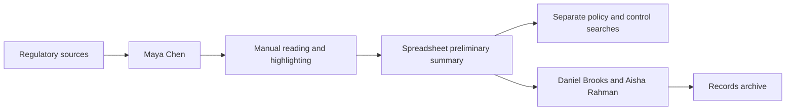
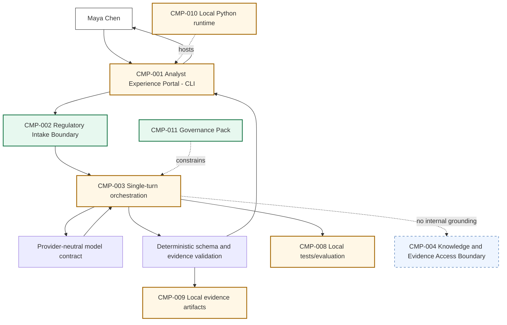

# Stage 1 - Manual Process and Basic LLM Assistant

**Architecture version:** 0.2.0  
**Repository version:** 0.2.0  
**Execution date:** 2026-07-31

## 1. Context Carried Forward

NorthStar enters S01 at maturity M0: a manual regulatory-change process plus the implemented `CMP-011 Source-of-Truth Governance Pack`. All operational AI boundaries are planned, no model runtime exists, and no agent or tool identifier has been allocated.

The accepted constraints are decisive. `ADR-002` requires the simplest sufficient capability. `ADR-003` keeps regulated accountability with named humans. `ADR-004` preserves one cumulative repository, `ADR-005` rejects hidden chain-of-thought as audit evidence, `ADR-006` keeps core contracts vendor-neutral, and `ADR-007` preserves stable responsibility boundaries.

The unresolved problem from the S00 handoff is narrow: Maya has an urgent publication that may affect lending, payments and customer-data processes. She needs a consistent first reading before Daniel's afternoon review, but NorthStar has only a manual workflow. This stage modifies all ten source-of-truth artefacts, the cumulative Mermaid architecture, the repository manifest, the risk register and the ADR collection.

A reconstruction exception is recorded as `ISS-008`: the exact individual S00 register files were not mounted in the execution sandbox. The accepted S00 chapter and the uploaded handoff were used as the safe authoritative reconstruction basis. No accepted identifier was renumbered, and the stage does not reuse an older incompatible Stage 1 package that assigned different meanings to `CMP-001` through `CMP-010`.

## 2. Narrative Development

At 08:15, Maya receives a supervisory notice whose language crosses three NorthStar domains. It requires documentation for automated credit adjudication, a human escalation path for materially adverse decisions, review of payment-screening models after material sanctions-list changes, and documented authority or consent for new customer-data uses. Daniel wants a concise preliminary briefing before the afternoon compliance meeting.

Maya's existing process is not simply slow typing. She must distinguish direct statements from implications, find dates, preserve caveats and avoid accidentally presenting an interpretation as a regulatory fact. Two experienced analysts can produce different structures from the same document. Their reasoning may be sound, but the evidence package is inconsistent and hard to reproduce.

Priya does not start by selecting an agent framework. She asks what the system must do now. The immediate requirement is one bounded transformation: take one supplied publication and produce a source-constrained preliminary summary for Maya to review. The application does not yet need to search an internal repository, save a case, notify a reviewer, update a control or maintain a long-running objective.

That distinction makes the first architecture decision possible.

## 3. Problem Being Solved

### Business problem

NorthStar needs a faster, more consistent first reading of a publication without weakening evidence quality or transferring accountability to AI.

### Technical problem

A language model can compress and reorganize text, but its output is probabilistic. Fluency does not prove that a statement is present in the source, that a date was read correctly or that a candidate business impact applies to NorthStar. The application must therefore surround the model with deterministic boundaries:

1. controlled intake;
2. immutable source identity;
3. line-addressable context;
4. a typed output contract;
5. source-reference validation;
6. application-owned disposition;
7. mandatory human review;
8. invocation/version evidence; and
9. explicit failure rather than silent fallback.

### What this stage does not solve

It does not ingest PDFs, search NorthStar knowledge, normalize accepted obligations, determine legal applicability, create a case, assign risk, route an executable approval, invoke tools or maintain agent state.

## 4. Requirements Introduced or Updated

No requirement is renumbered. `FR-001`, `FR-002`, `FR-007`, `FR-014`, `FR-019` and `FR-020` receive S01 implementations or partial implementations, as recorded in the Requirements Register. The primary control outcomes are source provenance (`CTL-001`), deterministic structured validation (`CTL-002`), human-review semantics (`CTL-006`), local evaluation (`CTL-010`) and version evidence (`CTL-014`).

The completion claim is intentionally constrained. A local test proves that the application rejects malformed input, preserves source identity, validates evidence and prevents the model from setting approval. It does not prove semantic correctness on real regulations or production suitability.

## 5. Conceptual Explanation

### 5.1 Model, application, assistant and agent

A model maps an input context to a probabilistic output. It does not inherently know NorthStar's case lifecycle, preserve evidence, enforce authority or decide what happens next.

An application adds deterministic software around the model. In S01, that software validates files, computes SHA-256, line-numbers the publication, builds the prompt, validates JSON, checks every citation and writes artifacts.

An assistant helps Maya complete a task. The S01 application is an assistant because Maya initiates one request and receives one preliminary result.

An agent would pursue a goal through a loop: observe state, select an action or tool, validate authority, execute, observe the result, update state, replan and determine termination. S01 has no such loop or action authority. Calling it an agent would hide the most important architecture boundary in the chapter.

### 5.2 Probabilistic output and deterministic controls

Structured output constrains shape, not truth. A response may have every required field and still misstate a source. The architecture therefore separates three questions:

- **Syntactic validity:** does the payload match the expected fields and types?
- **Evidence validity:** do the cited hash, line range and excerpt exist in the submitted publication?
- **Semantic/regulatory validity:** does the statement correctly interpret the publication and apply to NorthStar?

S01 enforces the first two at a basic level. The third remains a human responsibility.

### 5.3 Prompt structure

The prompt has a stable instruction section and an explicitly delimited untrusted-data section. The publication is line-numbered. The model is told to use only the source and to return facts, candidate areas, deadlines, missing information and uncertainties.

This improves clarity but is not treated as a security control. The strongest risk reduction is architectural: the model has no enterprise retrieval, credentials, tools or write authority. OWASP's current prompt-injection guidance recommends clear instruction/data separation, validation, least privilege, output checks and human control; it also emphasizes that prompt injection cannot be assumed solved by prompting alone. [S4][S5]

### 5.4 Context windows and tokenization

The model receives tokens rather than pages. Input length affects context availability, latency and provider cost. S01 uses a byte limit because it is deterministic and provider-neutral, but a byte limit is not a guarantee that every document fits every model context. Token-aware decomposition and retrieval are intentionally deferred to S02, where document ingestion and chunking become required capabilities.

### 5.5 Structured output and provider isolation

The application defines a JSON schema for the model-controlled fields. The optional OpenAI adapter sends that schema through the Responses API and sets `store=false`; the local acceptance path uses the deterministic test double. Official OpenAI sources describe Responses API usage and structured-output helpers, but the generated package explicitly records that no credentialed call was executed. [S1][S2][S3]

The provider contract returns only the candidate payload and usage metadata. Application code constructs `DATA-015` and fixes critical status fields. Provider-specific types never enter the source-of-truth schemas.

### 5.6 Evidence-first output

Every source fact contains the source hash, start/end line and exact excerpt. The validator rejects out-of-range lines and excerpts that are not present. This does not prove that the statement is the best interpretation of the excerpt, but it prevents several important forms of fabricated provenance.

### 5.7 Human accountability

NIST's AI RMF emphasizes defined human-AI roles and oversight appropriate to the context. S01 encodes that principle concretely: the application cannot produce an approved result, and Daniel/Aisha review boundaries remain planned rather than simulated. [S6][S7]

## 6. When This Capability Is Required

A bounded basic assistant is appropriate when the task is a reversible preliminary analysis of a supplied source; semantic summarization adds value; evidence can be shown; a reviewer can inspect the result; and no action or persistent goal pursuit is required.

For NorthStar, this is the correct fit for the first-reading problem.

## 7. When It Is Not Required

The assistant is unnecessary when a deterministic parser or template can produce the result reliably. It is unsafe when the output directly triggers a regulated or irreversible action. It is insufficient when the answer depends on internal evidence not supplied to the model. It is also the wrong architecture for large corpora that require access-aware selection, freshness and citation management.

## 8. Architecture Options

| Option | Strength | Limitation for Maya's immediate need |
|---|---|---|
| Manual process | Highest direct human control | Slow, inconsistent structure, hard to reproduce |
| Deterministic rules/template | Cheap, repeatable, exact for known patterns | Cannot robustly summarize varied regulatory language |
| Search | Locates terms/documents | Does not produce the structured first reading |
| RAG assistant | Can ground internal context | Requires ingestion, authorization, chunking, retrieval and evaluation not yet justified by the first request |
| Bounded LLM assistant | Semantic compression with low authority | Residual hallucination; source-only and human-reviewed |
| Tool-using agent | Can act and iterate | Adds authority, state, termination and recovery without a current need |
| Multi-agent system | Can distribute specialties | Adds coordination, latency, cost and failure surfaces prematurely |

## 9. Decision Matrix

Scale: 1 weak, 5 strong. "Restraint" rewards avoiding unnecessary architecture.

| Option | First-reading value | Reproducibility | Source evidence | Local run | Restraint | Authority safety |
|---|---:|---:|---:|---:|---:|---:|
| Manual | 2 | 2 | 5 | 5 | 5 | 5 |
| Rules | 2 | 5 | 5 | 5 | 5 | 5 |
| Search | 2 | 4 | 5 | 4 | 4 | 5 |
| RAG | 5 | 3 | 5 if engineered | 3 | 2 | 4 |
| Bounded assistant | 4 | 4 with schema/tests | 4 with exact citations | 5 | 5 | 5 |
| Agent | 4 | 2 | 3 | 2 | 1 | 2 |
| Multi-agent | 4 | 1 | 3 | 1 | 1 | 1 |

## 10. Selected Architecture and Rationale

`ADR-008` selects the bounded assistant. It is sufficient because the present goal is a preliminary first reading. It preserves a natural reason for the next stage rather than pretending to solve internal impact assessment.

`ADR-009` isolates model providers. The acceptance suite can run without a network or paid service, while the optional adapter demonstrates a real LLM path.

`ADR-010` makes source identity, citations and status deterministic. This is more important than elaborating the prompt because the application must remain safe when the model is wrong.

## 11. Architecture Before the Change



The workflow depends entirely on analyst effort. It preserves human accountability but lacks repeatable machine evidence and a bounded model application.

## 12. Architecture After the Change



The architecture still has a manual human decision boundary. The model cannot cross into approval or enterprise action.

## 13. Detailed Component Design

### CMP-001 Analyst Experience Portal

Implemented as a CLI. It accepts publication metadata and displays a compact result plus an artifact path. A later web UX must make evidence and preliminary status visually prominent; S01 does not claim that level of usability.

### CMP-002 Regulatory Intake Boundary

Accepts `.txt` and `.md`, rejects binary/NUL, invalid UTF-8, empty and oversized input, computes SHA-256 and creates a content-derived publication ID. This is a minimal intake boundary, not malware scanning or document parsing.

### CMP-003 Case and Workflow Orchestration Boundary

Implemented only as a one-shot service function. It invokes the model once, validates once, persists once and returns. It does not create `DATA-002`, checkpoint state, retry, replan or wait for approval.

### CMP-008 Evaluation and Assurance Boundary

Implemented as local tests and four small evaluation behaviors. It is not a dataset registry, online evaluator or promotion gate.

### CMP-009 Observability and Audit Boundary

Persists source, metadata, summary and model invocation. This is evidence for the lab, not tamper-evident audit, WORM records or distributed tracing.

### CMP-010 Runtime and Deployment Boundary

A local Python package with standard-library dependencies. No container, service, secrets manager, queue, autoscaling or production SLO exists.

## 14. Data, State and Interface Design

`DATA-001` becomes executable with `DATA-018` metadata. `DATA-004` becomes an exact line/hash/excerpt reference. `DATA-015`, `DATA-016` and `DATA-017` are added.

The most important distinction is negative: `DATA-015` is not a `DATA-013 ExecutiveSummary`, and no `DATA-002 RegulatoryCase` or `DATA-007 ReviewDecision` is created.

`INT-001` and `INT-002` are implemented locally. `INT-006` remains a future human-review contract even though the summary carries mandatory review semantics.

## 15. Implementation

The runnable implementation is in the cumulative repository. The main flow is:

```text
input file
  -> deterministic intake and SHA-256
  -> line-numbered untrusted data context
  -> one provider-neutral model call
  -> deterministic schema and citation validation
  -> application-owned preliminary disposition
  -> atomic local artifacts
  -> analyst review
```

The optional managed-model adapter uses environment variables and no hard-coded model name. The offline adapter makes tests repeatable and demonstrates the application contract, but it must not be used as evidence of LLM semantic quality.

### Run commands

```bash
python3 -m unittest discover -s tests -v
python3 scripts/validate_stage1.py
./scripts/run_stage1_demo.sh
```

### Managed-model option

```bash
export OPENAI_API_KEY='...'
export OPENAI_MODEL='an-approved-model-id'
PYTHONPATH=src python3 -m northstar_compliance.cli \
  --provider openai \
  --input datasets/stage1/sample-publication.txt \
  --title 'Synthetic Supervisory Notice 2026-NS-17' \
  --source-uri 'synthetic://northstar/2026-NS-17' \
  --jurisdiction CA
```

The provider call is deliberately outside the acceptance result until executed with approved credentials, model, data policy and retention settings.

## 16. Code and Repository Changes

### Files added

Application package, datasets, CLI, optional provider adapter, tests, S01 diagrams, ADR-008 through ADR-010, references, current chapter and demo/validation scripts.

### Files modified

All ten source-of-truth files, README, changelog, package metadata and cumulative architecture.

### Files retired

None.

### Compatibility notes

S01 preserves the S00 root and canonical source-of-truth paths. It does not allocate agent/tool identifiers or import a framework. Schema and prompt versions are fixed at `1.0.0` and `stage1-summary-v1`.

## 17. Security and Governance Implications

The publication is an indirect prompt-injection surface. S01 treats it as untrusted data, but it does not claim injection prevention. The key controls are least authority and deterministic validation: the model has no tools, credentials, retrieval or business write access; critical status fields are not model-controlled.

Local files may contain sensitive material, so the lab uses synthetic data and warns that the artifact directory is not a shared records system. A production deployment needs identity, authorization, provider/data-residency policy, encryption, retention and incident response.

Governance requires a named owner for the prompt, schema and model configuration, regression evidence for changes, and explicit reviewer instructions that distinguish source fact from candidate interpretation.

## 18. Performance, Concurrency and Cost Implications

The local mock path has negligible model cost and is not representative of LLM latency or quality. A managed call has input/output token and request costs, but S01 does not invent a universal cost or SLO. It records bytes, available usage metadata and elapsed invocation timestamps.

The architecture is synchronous and single-request. It has no concurrency control, timeout retry policy, queue or fallback. Those are not needed to prove the first assistant, but they become production requirements later.

The byte limit reduces accidental resource exhaustion but does not optimize context. Long-document decomposition is deliberately deferred to retrieval engineering.

## 19. Evaluation and Test Cases

The executed suite validates intake, provenance, fixed status, evidence integrity, persistence, adversarial content and the absence of agent/tool contracts.

The four S01 evaluation behaviors are:

1. explicit obligation-like sentences are extracted from the synthetic notice;
2. candidate areas are labeled without claiming accepted mappings;
3. human-review and unapproved status are invariant;
4. injected text cannot widen authority.

These cases are small and synthetic. They do not establish factual accuracy across real regulations, languages, document formats or providers.

## 20. Failure Scenarios and Recovery

### Failure 1 - Unsupported document

**Detection:** extension, UTF-8, binary, empty or size validation fails.  
**Containment:** no model call occurs.  
**Recovery:** convert through an approved future ingestion path or use the manual process.

### Failure 2 - Fabricated evidence line

**Detection:** line range or excerpt validation fails.  
**Containment:** no successful summary is persisted.  
**Recovery:** preserve failed invocation evidence where appropriate, inspect prompt/provider and rerun only after correction.

### Failure 3 - Prompt-injection text requests approval

**Detection:** content may appear in the source but cannot modify application-owned status.  
**Containment:** no tools or secrets exist; result remains unapproved.  
**Recovery:** human rejects corrupted content; add the example to the evaluation corpus.

### Failure 4 - Model/network failure

**Detection:** adapter raises an explicit failure.  
**Containment:** no false successful output.  
**Recovery:** S01 falls back to the manual process; automated retry and provider fallback are future capabilities.

### Failure 5 - Local write failure

**Detection:** atomic write raises an error.  
**Containment:** temporary file is removed where possible; success is not reported.  
**Recovery:** correct permissions/disk space and rerun from the preserved source.

## 21. Architecture Decision Records

S01 accepts `ADR-008`, `ADR-009` and `ADR-010`. No prior ADR is superseded.

## 22. Requirements Traceability Update

The Requirements Register maps `FR-001`, `FR-002`, `FR-007`, `FR-014`, `FR-019` and `FR-020` to the implemented modules, data objects and tests. No requirement is claimed production-complete.

## 23. Stage Outcome

NorthStar can now accept one controlled regulatory publication, preserve its identity, produce a structured preliminary summary, attach exact source evidence, expose uncertainty and persist reproducible local artifacts. Maya receives a faster first reading without creating an autonomous actor.

## 24. Known Limitations

The assistant is not grounded in NorthStar's knowledge. It cannot determine actual policy/control/process impact, create a case, route an executable approval, use tools, remember a case or recover a durable workflow. Managed-model semantic quality and production SLOs remain unverified.

## 25. Narrative Bridge to the Next Stage

Daniel reads the preliminary summary and asks the question the architecture cannot answer: "Which NorthStar policies and controls support these candidate impacts?"

The model saw only the publication. Supplying the whole enterprise corpus in every prompt would ignore authorization, freshness, context economics and citation quality. The next capability is therefore not an agent. It is an authorized retrieval layer that can ingest, index, search, rerank and cite internal evidence before generation.

## 26. Updated Source-of-Truth Artefacts

All ten files are updated to version 0.2.0. The detailed changes are recorded in each file and summarized in the handoff.

## 27. Stage Handoff Pack

The authoritative handoff is `docs/source-of-truth/09-Stage-Handoff-Pack.md` and is exported separately as `Stage-1-Handoff-Pack.md`.

## Stage Consistency Audit

**Result: Passed with recorded exceptions.**

Confirmed after execution:

- narrative, architecture, component catalogue and code use the same S00 component taxonomy;
- the assistant makes one call and has no agent/tool identifiers;
- data schemas match persisted JSON;
- critical status fields cannot be widened by model output;
- exact source evidence is validated;
- the repository paths match the manifest;
- all S01 tests pass;
- source-of-truth and Python compilation checks pass;
- the handoff authorizes only retrieval work.

Recorded exceptions: Python 3.12 was unavailable; Python 3.13.5 passed. The optional managed-provider adapter was not live-called. Mermaid was statically inspected but not renderer-validated. `ISS-008` records the reconstruction boundary for the individual S00 register files.

### Sources

- [S1] OpenAI official Python library: https://github.com/openai/openai-python
- [S2] OpenAI structured-output helpers: https://github.com/openai/openai-python/blob/main/helpers.md
- [S3] OpenAI API data controls: https://platform.openai.com/docs/models/default-usage-policies-by-endpoint
- [S4] OWASP LLM Prompt Injection Prevention: https://cheatsheetseries.owasp.org/cheatsheets/LLM_Prompt_Injection_Prevention_Cheat_Sheet.html
- [S5] OWASP LLM01:2025 Prompt Injection: https://genai.owasp.org/llmrisk/llm01-prompt-injection/
- [S6] NIST AI RMF: https://www.nist.gov/itl/ai-risk-management-framework
- [S7] NIST AI RMF Core: https://airc.nist.gov/airmf-resources/airmf/5-sec-core/
