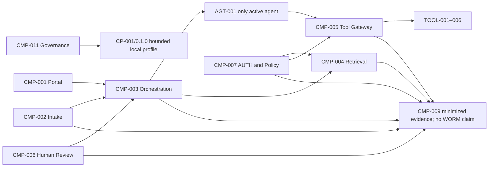
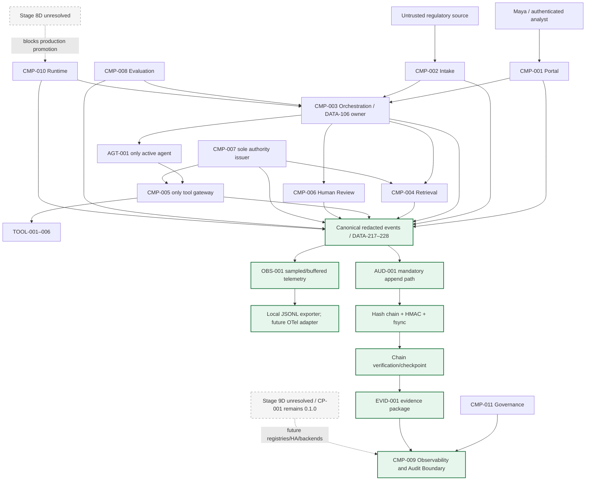
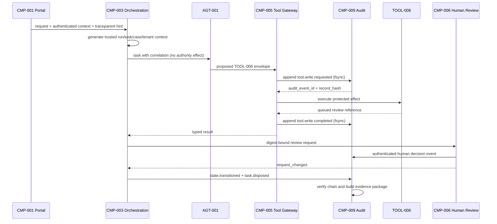

# Stage 10A — Observability and Audit

**Stage identifier:** `S10A`  
**Architecture version:** `1.15.0`  
**Repository version:** `1.15.0`  
**Handoff version:** `1.15.0`  
**Graph version:** `GRAPH-001/1.11.0`  
**Threat-model version:** `TM-001/1.3.0`  
**Observability model:** `OBS-001/1.0.0`  
**Audit model:** `AUD-001/1.0.0`  
**Evidence-package model:** `EVID-001/1.0.0`  
**Execution date:** 2026-08-01  
**Verification boundary:** local/offline Python 3.13.5, pytest 9.0.2 and jsonschema 4.26.0. Provider-neutral canonical telemetry, local JSONL export, deterministic redaction, local append-only hash-chained audit with HMAC-SHA256, and digest-bound evidence packages. No production OpenTelemetry collector/backend, WORM storage, KMS/HSM signing, trusted timestamp authority, multi-region durability, full Stage 9D control plane, Stage 8D promotion eligibility, production route or compliance certification.

> **Production Warning:** A cryptographically chained local ledger is useful for integrity testing and forensic reconstruction, but it is not automatically WORM storage, independent non-repudiation, trusted time, legal admissibility or a production audit system. Those claims require external storage, key, records, legal and operational controls that are deliberately not implemented here.

## 1. Context Carried Forward

NorthStar enters Stage 10A from the accepted Stage 9C `1.14.0` baseline. `AGT-001 Regulatory Impact Assessment Agent`, specification `1.1.0`, remains the only active agent. `CMP-003` remains the sole owner of task lifecycle, routing, protected state, admission, cancellation, aggregation and system termination. `CMP-005` remains the only gateway to `TOOL-001–006`. `CMP-007` remains the sole issuer of `AUTH-001/1.0.0` authority. `CMP-006` and accountable humans retain approval and finalization. `BR-001/1.0.0`, `GR-001/1.0.0`, `GOV-001/1.0.0` and the bounded local `CP-001/0.1.0` remain unchanged.

The architecture already records minimized guardrail/release/exception evidence in `CMP-009`, but Stage 9C explicitly states that it has no WORM audit and no complete enterprise control plane. It also leaves Stage 8D system metrics, regression baselines and deployment gates unresolved. Its formal next step was Stage 9D — Enterprise Agentic AI Control Plane. The current instruction instead requests Stage 10A.

### 1.1 Controlled sequence divergence

`ADR-114` resolves the conflict without silently inventing missing architecture:

1. Execute Stage 10A against the accepted S09C `1.14.0` baseline because the user explicitly selected it.
2. Build observability and audit only for the components, agents, tools, policies, environments and routes that actually exist in S09C.
3. Preserve `CP-001/0.1.0`; do not claim the enterprise registries, signed multi-environment configuration, production distribution, deployment/routing controls or multi-region services that Stage 9D would add.
4. Mark `ISS-170` and `ISS-171` so a later stage can reconcile observability with the enterprise control plane.
5. Keep Stage 8D unresolved and production promotion denied.

This is a controlled divergence, not completion of Stage 9D by implication.

### 1.2 Current maturity and unresolved problem

NorthStar can constrain an action and identify the accepted owner that approved it. Liam O’Connor still cannot reconstruct a complete regulatory assessment across portal, intake, orchestration, model, retrieval, tools, policy, human review, state and evaluation. Existing component-local messages lack a single correlation contract. Operational logs may contain too much sensitive content, too little identity, or identifiers that cannot be joined. Sampling can erase evidence. A mutable log file can be edited. A human reviewer may approve one digest while the final package contains another. The architecture therefore needs two related but distinct capabilities:

- **Observability:** enough logs, metrics, traces and events to understand health, performance and behavior.
- **Audit:** a complete, access-controlled, tamper-evident accountability record for material decisions and effects.

The design must provide those capabilities without recording hidden model chain-of-thought, turning trace IDs into credentials, moving authority into `CMP-009`, or falsely claiming production-grade immutable storage.

### 1.3 Artefacts modified

All ten source-of-truth artefacts advance to compatible `1.15.0` overlays. Stage 10A adds `DATA-217–236`, `INT-177–196`, `ADR-114–124`, `RSK-402–431`, `ASM-127–134`, `ISS-170–181`, `TEST-881–960` and `EVAL-229–252`; advances `GRAPH-001` to `1.11.0` and `TM-001` to `1.3.0`; and introduces `OBS-001`, `AUD-001` and `EVID-001`.

## 2. Narrative Development

Maya Chen opens `CASE-2026-0001` and asks why the draft impact assessment was returned for changes. The portal shows a final status but not the sequence that produced it. Elena Petrov can find one model log and one tool gateway log, yet their request IDs differ. Marcus Green discovers that a developer added the case ID and user email as metric labels, creating both a privacy exposure and an unbounded-cardinality cost risk. Sofia Alvarez asks whether the “approval” shown in a log is an authenticated human decision, a model-generated sentence or a developer message.

Liam follows the request manually. The intake service processed the document; orchestration assembled context; retrieval found four internal sources; `AGT-001` proposed `TOOL-006`; `CMP-007` issued a scoped grant; `CMP-005` created a review request; Aisha Rahman requested changes; and `CMP-003` transitioned the case. The pieces exist, but the system cannot prove that they belong to one run or that none was changed afterward.

A second demonstration exposes the opposite problem. A debug flag records the entire prompt, retrieved policy passages and a bearer token in a JSON log. More logging created less safety.

Priya Raman therefore rejects a single “log everything” solution. Operational engineers need sampled, searchable telemetry. Compliance and forensic reviewers need complete material evidence. The same canonical identifiers and redaction rules can serve both, but their completeness, storage, access and failure semantics must differ.

## 3. Problem Being Solved

### 3.1 Observability and audit are not synonyms

Operational observability asks: Is the system healthy? Where is latency? Which dependency failed? How many tokens or tool calls were consumed? Why did a span retry? These signals may be sampled, aggregated, retained for shorter periods and optimized for diagnosis.

Audit asks: Who initiated the task? Which agent/version acted? Which model/prompt/tool/policy/grant/evidence/human decision applied? What protected state changed? What was the final disposition? Required audit records cannot disappear merely because a head sampler rejected a trace or a metrics backend was unavailable.

A trace can be excellent diagnostic evidence and still be insufficient as an accountability ledger. An audit ledger can be complete and still be a poor high-volume latency dashboard. `ADR-115` therefore separates the planes while preserving common schemas and correlation.

### 3.2 Correlation is not authority

W3C Trace Context standardizes distributed correlation through `traceparent` and `tracestate` [R1]. It does not authenticate the sender or establish tenant, case, user, approval or resource scope. NorthStar accepts a syntactically valid external trace header only as an untrusted correlation hint. Trusted identities and scopes still come from the portal/session, workload identity, `AUTH-001`, case state and receiver-side checks.

Trace IDs, span IDs, session IDs, run IDs, task IDs, tool-call IDs, approval IDs and evaluation IDs have `authority_effect: none`. They are handles, not capabilities.

### 3.3 Complete reconstruction requires a canonical event model

A NorthStar run crosses services and boundaries that use different libraries. The architecture needs stable fields for:

- event name and version;
- observed time and event time;
- trace, span, parent span, session, run, task, case and tenant;
- component, agent/spec, model/prompt, tool/call, grant, policy, approval and evaluation identifiers;
- correlation, causation and idempotency;
- input/output metadata and digests;
- outcome, reason codes, retry and error class;
- cost, token, duration and resource measures;
- redaction and retention classification; and
- `authority_effect: none`.

OpenTelemetry provides a vendor-neutral telemetry architecture, stable logs model and semantic conventions [R2–R7]. Generative-AI conventions are still evolving [R8], so `OBS-001` defines a stable NorthStar canonical contract and treats OpenTelemetry as an adapter target rather than the sole source of business semantics.

### 3.4 Privacy-preserving telemetry must be designed, not added later

Prompts, responses, retrieved passages, tool arguments and model outputs can contain personal information, regulated data, secrets, prompt-injection text and privileged internal material. NorthStar therefore stores metadata, source references, counts, versions and SHA-256 digests by default. Raw content is opt-in and requires purpose, access, retention, redaction and data-residency decisions.

Sensitive values are not placed in W3C baggage, metric labels or resource names. Redaction happens before buffering/export. A digest proves equality to a later supplied artefact; it does not make the underlying content anonymous or safe to disclose.

### 3.5 Sampling and completeness have different rules

Head or tail sampling can control observability volume and cost. It is unacceptable for mandatory accountability events. NorthStar defines a material-event matrix. Events such as authorization decisions, protected tool intent/outcome, human decisions, state transitions, exceptions and final disposition always enter `AUD-001` even when their operational spans are unsampled.

### 3.6 Tamper evidence needs ordered cryptographic binding

An append-only intention is not enough if an administrator can edit a file. The local reference computes:

```text
payload_hash[n] = SHA256(canonical_json(payload[n]))
record_hash[n]  = SHA256(canonical_json(core_record[n] including record_hash[n-1]))
signature[n]    = HMAC-SHA256(local_key, record_hash[n])
```

Sequence, previous hash, record hash and signature allow verification to detect edits, deletion, reordering and incorrect keys under the local threat model. RFC 5848 illustrates signed, sequenced log integrity; RFC 3161 identifies a future trusted-time option [R12–R13]. Stage 10A does not claim conformance to either protocol.

### 3.7 Protected effects need audit-before-effect semantics

For a protected write, writing an audit record only after the tool returns creates an evidence gap if the process crashes. NorthStar writes an `intent` record durably before execution and an `outcome` record afterward. Failure to append required intent blocks execution. If the effect occurs but outcome recording fails, the workflow enters an ambiguous-outcome recovery path; it cannot assume failure and retry blindly.

### 3.8 Audit is not the business source of truth

`DATA-106` remains the authoritative business-state object owned by `CMP-003`. Audit records describe accepted actions and state transitions; they do not replace state ownership or grant a replay process permission to mutate the case. Replay is a read-only forensic reconstruction that can identify divergence for human-controlled remediation.

## 4. Requirements Introduced or Updated

| Requirement | Statement | Implementation | Verification |
|---|---|---|---|
| `S10A-REQ-001` | Execute S10A on S09C without implying S09D completion. | ADR-114, status flags, ISS-170/171 | TEST-957/958; EVAL-229/236/238 |
| `S10A-REQ-002` | Separate operational observability and accountability audit. | OBS-001, AUD-001, ADR-115 | TEST-947–952; EVAL-230/231 |
| `S10A-REQ-003` | Propagate standard trace context across current boundaries. | DATA-217, INT-177–179 | TEST-881–892; EVAL-230 |
| `S10A-REQ-004` | Prevent correlation metadata from establishing authority or tenancy. | parser/trusted local context; ADR-117 | TEST-889–892/957; EVAL-233/251 |
| `S10A-REQ-005` | Trace portal, intake, orchestration, model, retrieval, tool, policy, human review, state, evaluation and disposition. | event taxonomy and component instrumentation contracts | TEST-905–918/947–952; EVAL-230 |
| `S10A-REQ-006` | Provide structured logs/events with stable schema and version. | DATA-218/220, INT-180 | TEST-905–914; EVAL-239/240 |
| `S10A-REQ-007` | Provide low-cardinality metrics and reject unbounded identifier labels. | DATA-221, metric allowlist | TEST-915–918/955; EVAL-241 |
| `S10A-REQ-008` | Record model metadata without hidden reasoning or raw content by default. | DATA-222, ADR-118 | TEST-893–904/944; EVAL-243 |
| `S10A-REQ-009` | Record retrieval provenance, access/freshness and source references. | DATA-223, INT-183 | TEST-947–952 |
| `S10A-REQ-010` | Record tool intent/outcome, grant, budget, idempotency and result metadata. | DATA-224, INT-184, protected action wrapper | TEST-947–952; EVAL-231 |
| `S10A-REQ-011` | Record policy/auth/human/state/evaluation evidence without changing owners. | DATA-225–227, INT-185–187 | TEST-947–958; EVAL-251 |
| `S10A-REQ-012` | Redact secrets and minimize sensitive telemetry before export/persistence. | DATA-228, INT-188, redactor | TEST-893–904/953 |
| `S10A-REQ-013` | Permit bounded sampling/buffering for operational telemetry. | DATA-234, sampling policy, buffered exporter | TEST-905–918/949–950 |
| `S10A-REQ-014` | Never sample mandatory audit events. | material-event matrix, ADR-119 | TEST-929–936/947–952; EVAL-231 |
| `S10A-REQ-015` | Create tamper-evident ordered audit records. | DATA-229–231, hash chain/HMAC | TEST-919–936; EVAL-232 |
| `S10A-REQ-016` | Require durable audit intent/outcome around protected effects. | INT-189 and service wrapper; ADR-121 | TEST-947–952 |
| `S10A-REQ-017` | Keep audit replay read-only and preserve DATA-106 ownership. | ADR-122, no state writer | TEST-946/958 |
| `S10A-REQ-018` | Build and verify digest-bound evidence packages. | DATA-232/233, INT-192/193 | TEST-937–946; EVAL-243 |
| `S10A-REQ-019` | Define retention, access and evidence ownership. | DATA-235, CMP-011 policy overlay | TEST-959 |
| `S10A-REQ-020` | Define fail-open/fail-closed behavior for telemetry and audit outages. | buffered telemetry; mandatory audit exception | TEST-947–952 |
| `S10A-REQ-021` | Preserve all accepted authority/security/agent/tool boundaries. | catalogue, service status and audits | TEST-951/957/958; EVAL-251/252 |
| `S10A-REQ-022` | Provide runnable local code, demo, validation and tests. | repository and scripts | TEST-881–960; EVAL-239–252 |
| `S10A-REQ-023` | Extend threat model for observability/audit attack paths. | TM-001/1.3.0 | security tests and audit |
| `S10A-REQ-024` | State production limitations explicitly. | status report, docs, ADR-120/124 | EVAL-234–247 |

## 5. Conceptual Explanation

### 5.1 Logs, metrics, traces and events

- **Logs** are timestamped structured records describing a specific observation or decision. They are useful for detail and search but expensive at high volume.
- **Metrics** are numeric aggregates over bounded dimensions. They are efficient for alerts and trends but should not carry case IDs, emails, prompt text or other high-cardinality/sensitive values.
- **Traces** represent causal work across distributed components. A trace contains spans; a span describes one operation and its parent/child relationship.
- **Events** are named domain or operational facts. NorthStar uses the same canonical event representation for operational telemetry and as the source for selected mandatory audit records.

The four signal types are complementary. A metric can show a rising tool-error rate; a trace can locate the slow call; a structured event can capture the reason code; the audit ledger can prove which grant and human decision applied.

### 5.2 Identifier hierarchy

`DATA-217 CorrelationContext` contains:

| Identifier | Purpose | Trusted source |
|---|---|---|
| `trace_id`, `span_id`, `parent_span_id` | Distributed diagnostic correlation | Locally generated or format-validated external hint |
| `session_id` | Authenticated interaction session reference | CMP-001/session service |
| `run_id` | One orchestrated execution | CMP-003 |
| `task_id` | Work unit inside a run | CMP-003 |
| `case_id` | Regulatory-case reference | DATA-106/CMP-003 |
| `tenant_id` | Tenant boundary | Authenticated tenancy context, never trace baggage |
| `agent_id` | Acting agent reference | Catalogue/runtime configuration |
| `tool_call_id` | One gateway invocation | CMP-005 |
| `approval_id` | One review transaction | CMP-006 |
| `evaluation_id` | One evaluation result | CMP-008 |
| `correlation_id` | Cross-system grouping when trace propagation is unavailable | Issuing trusted component |
| `causation_id` | Event that caused this event | Event producer |
| `idempotency_key` | Duplicate-effect suppression | Effect owner/gateway |

The architecture intentionally does not overload one identifier for all purposes.

### 5.3 Observability model `OBS-001`

`OBS-001/1.0.0` defines a canonical envelope, redaction contract, sampling policy, metric-label policy and exporter status. It is provider-neutral. A future adapter can map it to OpenTelemetry spans/logs/metrics and an approved collector/backend. The adapter must prove semantic conformance; merely emitting an OpenTelemetry object is insufficient if required NorthStar fields are lost.

### 5.4 Audit model `AUD-001`

`AUD-001/1.0.0` defines material-event completeness, append semantics, sequence, canonicalization, payload/record digests, previous-record link, signer, signature, idempotency, verification and quarantine behavior.

A successful verification means the local record set is internally consistent under the supplied HMAC key. It does not establish that the event was truthful, that every external event was observed, that the key was uncompromised, or that a court/regulator will accept the record.

### 5.5 Evidence model `EVID-001`

An evidence package is a purpose-scoped manifest containing:

- package and run identifiers;
- ordered audit-event references and digests;
- relevant artefact digests;
- agent/spec/model/prompt/tool/policy/grant/approval/evaluation references;
- ledger checkpoint and verification result;
- final disposition;
- access/retention classification; and
- package digest.

It excludes hidden model chain-of-thought. Auditable evidence consists of source references, concise decision summaries, accepted inputs/outputs, policy outcomes, human decisions and state changes.

### 5.6 Mandatory event matrix

The local executable slice treats these as mandatory audit classes:

```text
task.started
authorization.decided
guardrail.decided
tool.write.requested
tool.write.completed
human.approval.requested
human.approval.decided
state.transitioned
exception.applied
task.disposed
```

The architecture catalogue also reserves complete production mappings for context assembly, model invocation, retrieval, policy decisions, output production, evaluation and incident events. Their exact mandatory status depends on risk, action and records policy; Stage 9D and legal/records review must finalize that matrix.

## 6. When This Capability Is Required

Observability is required when a workflow crosses components, uses probabilistic models, invokes tools, has SLO/cost objectives, retries, performs concurrent work or must be diagnosed without reproducing sensitive data.

Tamper-evident audit is required when NorthStar must attribute material decisions and effects; prove which approved versions and grants applied; reconstruct human review; support investigations; distinguish model proposals from human decisions; or preserve evidence for regulated records and internal assurance.

Both become essential before production, but their implementation depth is risk-based. A read-only local prototype may use console telemetry and a local chain. A regulated multi-region deployment needs independent durable storage, key custody, retention, access, legal holds, replication, monitoring and tested recovery.

## 7. When It Is Not Required

A full distributed tracing backend and cryptographic evidence pipeline may be unnecessary for a disposable, offline, synthetic-data experiment with one process and no persistent or external effect. Unit tests and local structured logs can be enough.

It is also harmful to:

- record every prompt and document “just in case”;
- place case/user IDs in metric labels;
- require synchronous remote telemetry export on every low-risk read;
- treat audit as the application database;
- use trace context as authentication;
- store hidden chain-of-thought;
- claim immutability because a file is append-only by convention; or
- select an enterprise observability vendor before residency, scale, retention, S09D integration and S08D SLOs are known.

## 8. Architecture Options

### 8.1 Telemetry topology

1. **Application logs only:** simple, but weak causal correlation and inconsistent schemas.
2. **Direct-to-vendor SDK/export:** fast setup, but couples code to one backend and expands the exfiltration boundary.
3. **OpenTelemetry SDK + Collector:** vendor-neutral and operationally mature, but still needs governance, deployment and backend selection.
4. **Provider-neutral canonical schema + adapters:** selected for the current local slice; preserves semantics and supports OpenTelemetry later.
5. **Event-bus-first telemetry:** scalable for enterprise analytics, but introduces an unimplemented broker/control-plane dependency.

### 8.2 Audit storage

1. Mutable database table.
2. Append-only database/event store.
3. Hash-chained append-only files.
4. Object storage with retention lock/WORM.
5. Dedicated immutable ledger/database.
6. External notarization/trusted timestamping.

Stage 10A selects option 3 for runnable local evidence and defines options 4–6 as production candidates requiring S09D, records, legal, key and deployment decisions.

### 8.3 Integrity/authenticity

- plain checksums detect accidental changes but not a malicious writer;
- HMAC authenticates to holders of a shared secret but does not provide independent non-repudiation;
- asymmetric signatures support stronger signer separation but require KMS/HSM, key lifecycle and verification infrastructure;
- trusted timestamps bind existence to an external time service but add dependency, cost and legal/operational questions.

### 8.4 Capture policy

- capture raw prompts/responses;
- capture redacted content;
- capture metadata, references and digests;
- capture nothing except errors.

NorthStar selects metadata/references/digests by default, with separately governed raw capture for narrowly defined investigations or evaluation datasets.

## 9. Decision Matrix

Scores are 1 (weak) to 5 (strong) for the current S10A need.

| Design | Correlation | Privacy control | Tamper evidence | Local runnable | Vendor neutrality | Runtime cost | Current fit |
|---|---:|---:|---:|---:|---:|---:|---:|
| Plain application logs | 2 | 2 | 1 | 5 | 4 | 5 | 2 |
| Direct vendor instrumentation | 4 | 3 | 2 | 2 | 1 | 3 | 2 |
| OpenTelemetry end-to-end production stack | 5 | 4 | 2 | 3 | 5 | 3 | 4, but premature backend choice |
| **Canonical NorthStar schema + local exporter + local audit chain** | **5** | **5** | **4 local** | **5** | **5** | **4** | **5** |
| Dedicated immutable ledger + KMS/HSM + WORM | 5 | 5 | 5 | 1 | 3 | 2 | Future production candidate |

| Audit option | Detects edits | Independent signer | Trusted time | WORM | S10A selection |
|---|---:|---:|---:|---:|---|
| Plain JSONL | No | No | No | No | Rejected |
| SHA-256 chain | Yes | No | No | No | Insufficient alone |
| **SHA-256 chain + HMAC** | **Yes** | Shared-secret only | No | No | **Selected local reference** |
| Asymmetric KMS/HSM signatures | Yes | Stronger | Optional | No | Deferred |
| WORM + signatures + trusted timestamp | Yes | Stronger | Yes | Yes | Deferred pending production requirements |

## 10. Selected Architecture and Rationale

NorthStar selects a dual-path design owned by the existing `CMP-009 Observability and Audit Boundary`:

1. Components emit a canonical, redacted event envelope with shared correlation.
2. Operational telemetry enters a bounded in-memory pipeline and local JSONL exporter. It may be sampled and can degrade with explicit drop/error status.
3. Material accountability events enter a separate synchronous append path. They are canonicalized, hash-linked, HMAC-authenticated, flushed and `fsync`-ed.
4. Protected effects use audit-intent-before-effect and audit-outcome-after-effect.
5. Evidence packages are built only after ledger verification and bind ordered records plus artefact/release digests.
6. `CMP-009` cannot authorize, approve, finalize, invoke a tool, alter `DATA-106` or activate a route.
7. Production backend, collector, object lock, KMS/HSM, trusted time and multi-region topology are deferred.

**Architect’s Decision:** optimize operational telemetry for diagnosis, and optimize audit for completeness and accountable reconstruction. Share identifiers and redaction, not failure semantics or retention assumptions.

## 11. Architecture Before the Change

At S09C, each PEP emitted minimized evidence, but there was no end-to-end trace contract, no canonical metrics/log schema, no required material-event matrix, no cryptographic chain, no evidence-package verifier and no explicit audit-before-effect behavior.



The evidence arrows did not prove causal continuity or tamper resistance.

## 12. Architecture After the Change



### 12.1 Trace and audit sequence



## 13. Detailed Component Design

### 13.1 `CMP-001 Analyst Experience Portal`

- Accepts or starts trace context but never trusts it for user or tenant identity.
- Propagates session/run/task/case references after authentication.
- Displays a safe trace/evidence reference and reason codes, not secrets or internal bypass details.
- Restricts audit search and evidence download by human role, case scope and purpose.
- Never treats a visible audit event as permission to act.

### 13.2 `CMP-002 Regulatory Intake Boundary`

Emits publication ID, digest, byte count, media type, parser version, malware status, guardrail decision and quarantine reference. Raw hostile text is not a metric label and is not exported by default. Quarantine events are material because they explain why content did not enter the agent context.

### 13.3 `CMP-003 Case and Workflow Orchestration Boundary`

Creates trusted `run_id` and `task_id`, starts the root span and maintains causation. It emits graph node/edge, retry, cancellation, checkpoint, state transition and final disposition events. It remains the only component that can commit `DATA-106`; audit receives a description and digest of the accepted transition.

### 13.4 `AGT-001 Regulatory Impact Assessment Agent`

Emits agent/spec/model/prompt version, input/output token counts, duration, tool proposal metadata, structured-output validity, evidence/source references and uncertainty summary. It does not emit private hidden reasoning. It cannot choose to suppress required audit events because those are emitted by harness/owners around the agent.

### 13.5 `CMP-004 Knowledge and Evidence Access Boundary`

Emits query digest, retrieval strategy, index/version, authorization decision reference, filter/scope digest, result count, source references, freshness, latency and citation coverage. Retrieved text remains untrusted data and is not persisted in operational telemetry by default.

### 13.6 `CMP-005 Enterprise Integration Boundary`

Creates `tool_call_id`, records typed argument digest/schema version, `AUTH-001` grant digest, `BR-001` reservation, approval reference, idempotency key, start/end timestamps, result digest and error class. Protected writes require durable intent and outcome. The audit writer never invokes a tool itself.

### 13.7 `CMP-006 Human Review and Approval Boundary`

Records reviewer identity reference, role, separation-of-duties result, approval ID, artefact/action/resource digest, expiry and typed decision. The ledger records the human decision supplied by `CMP-006`; it does not infer approval from prose. Timeout is recorded as expired/pending, never approved.

### 13.8 `CMP-007 Identity, Authorization and Policy Boundary`

Emits grant/policy decision IDs and digests, subject/workload/agent/tool/operation/resource attributes, outcome, reason codes, policy version and expiry. Secrets and bearer tokens are never recorded. `CMP-007` remains the sole authority issuer; `CMP-009` only records the accepted outcome.

### 13.9 `CMP-008 Evaluation and Assurance Boundary`

Records evaluation ID, dataset/rubric/judge/version, deterministic-validator results, score summaries, confidence and regression status. It can detect evidence gaps but cannot approve a case or production route.

### 13.10 `CMP-009 Observability and Audit Boundary`

Owns:

- canonical schemas and event taxonomy;
- trace-context parsing and generation;
- redaction and sensitive-field hashing;
- sampling/cardinality controls;
- buffered local telemetry export;
- append-only audit writer;
- hash/HMAC verification and checkpoints;
- evidence-package construction and verification;
- status and explicit limitation flags; and
- read-only trace/audit query interfaces.

It does not own business routing, authorization, tool execution, policy release, human decisions, protected state or deployment activation.

### 13.11 `CMP-010 Runtime and Deployment Boundary`

Emits environment, build, graph, agent/spec, configuration, bundle and dependency versions plus health/resource/error signals. It exposes audit and exporter health to admission control. No production route is activated, and S08D/S09D remain blocking dependencies.

### 13.12 `CMP-011 Source-of-Truth Governance Pack`

Owns telemetry/audit policy, capture classes, retention owner, access roles, evidence-package purpose, key/storage change records, incident linkage and conformance requirements. Production retention and legal hold need legal, privacy, records and jurisdiction review; the tutorial does not invent a universal period.

## 14. Data, State and Interface Design

### 14.1 New data objects

| ID | Object | Owner | Key semantics |
|---|---|---|---|
| `DATA-217` | CorrelationContext | CMP-003/CMP-009 | Trace/session/run/task/case/tenant and parentage; no authority. |
| `DATA-218` | TelemetryEvent | CMP-009 | Canonical structured event envelope. |
| `DATA-219` | TraceSpan | CMP-009 | Operation timing, status, parent and bounded attributes. |
| `DATA-220` | StructuredLogRecord | CMP-009 | Severity, body summary, attributes and correlation. |
| `DATA-221` | MetricPoint | CMP-009 | Numeric value with low-cardinality labels. |
| `DATA-222` | ModelInvocationTelemetry | harness/CMP-009 | Provider/model/prompt/version, token/duration/outcome metadata; no hidden reasoning. |
| `DATA-223` | RetrievalTelemetry | CMP-004 | Query digest, index/freshness, result/source/citation metadata. |
| `DATA-224` | ToolInvocationTelemetry | CMP-005 | Tool/call/schema/grant/budget/idempotency/outcome metadata. |
| `DATA-225` | PolicyDecisionTelemetry | CMP-007/PEP | Policy/grant/guardrail references, outcome and reasons. |
| `DATA-226` | HumanApprovalTelemetry | CMP-006 | Reviewer/role/SoD/digest/expiry/decision. |
| `DATA-227` | StateTransitionTelemetry | CMP-003 | State object, from/to version/status, owner and idempotency. |
| `DATA-228` | RedactionResult | CMP-009 | Sanitized value, redacted paths and value digests. |
| `DATA-229` | AuditEvent | CMP-009 | Ordered canonical event, hashes, signature and idempotency. |
| `DATA-230` | AuditChainCheckpoint | CMP-009 | Event count, last hash, signer, algorithm and signature. |
| `DATA-231` | AuditVerificationReport | CMP-009 | Validity, count, last hash and errors. |
| `DATA-232` | EvidencePackageManifest | CMP-009/CMP-011 | Purpose, run, included records, artefacts, releases and access/retention class. |
| `DATA-233` | EvidencePackage | CMP-009 | Manifest, ordered records, verification and package digest. |
| `DATA-234` | TelemetrySamplingPolicy | CMP-011 | Ratio/rules, always-sample errors and material-event exclusion. |
| `DATA-235` | TelemetryRetentionPolicy | CMP-011 | Class, owner, access, raw-content prohibition and review status. |
| `DATA-236` | ObservabilityStatusReport | CMP-009/CMP-010 | Queue/export/audit health and explicit production-limit flags. |

Every schema requires `authority_effect: none`.

### 14.2 New interfaces

| ID | Interface | Caller → owner | Authorization / behavior |
|---|---|---|---|
| `INT-177` | PropagateTraceContext | component → component | Format validation only; cannot carry trusted authority. |
| `INT-178` | StartRunTrace | CMP-001/003 → CMP-009 | Authenticated local context; creates root trace. |
| `INT-179` | StartComponentSpan | component → CMP-009 | Bounded attributes and redaction. |
| `INT-180` | RecordStructuredEvent | component → CMP-009 | Schema and capture policy. |
| `INT-181` | RecordMetric | component → CMP-009 | Low-cardinality label allowlist. |
| `INT-182` | RecordModelInvocation | harness → CMP-009 | Metadata/digests; raw content off by default. |
| `INT-183` | RecordRetrieval | CMP-004 → CMP-009 | Source/freshness/access metadata. |
| `INT-184` | RecordToolInvocation | CMP-005 → CMP-009 | Intent/outcome and grant/budget/idempotency refs. |
| `INT-185` | RecordPolicyDecision | CMP-007/PEP → CMP-009 | Records decision; cannot issue authority. |
| `INT-186` | RecordHumanApproval | CMP-006 → CMP-009 | Authenticated human decision and digest binding. |
| `INT-187` | RecordStateTransition | CMP-003 → CMP-009 | Evidence-only; no state write. |
| `INT-188` | RedactTelemetry | producers/exporter → CMP-009 | Deterministic field/pattern redaction. |
| `INT-189` | AppendAuditEvent | accepted owners → CMP-009 | Mandatory, idempotent and durable for protected effects. |
| `INT-190` | VerifyAuditChain | assurance/auditor → CMP-009 | Read-only integrity verification. |
| `INT-191` | CreateAuditCheckpoint | CMP-009 → evidence storage | Signed local checkpoint; no WORM claim. |
| `INT-192` | BuildEvidencePackage | authorized reviewer → CMP-009 | Purpose/case/run scoped; chain must verify. |
| `INT-193` | VerifyEvidencePackage | reviewer/assurance → CMP-009 | Read-only digest and chain verification. |
| `INT-194` | QueryTrace | operations/reviewer → CMP-009 | Role/purpose/case filtered. |
| `INT-195` | ExportTelemetryBatch | CMP-009 → approved backend | Bounded, redacted, failure accounted. |
| `INT-196` | GetObservabilityStatus | CMP-010/operations → CMP-009 | Health and explicit limitation flags. |

## 15. Implementation

### 15.1 Repository code path

The executable implementation uses only the Python standard library plus `jsonschema` for validation and `pytest` for tests. It is intentionally independent of a paid telemetry backend.

Core modules:

```text
src/northstar_compliance/
├── common/canonical_json.py
├── observability/
│   ├── correlation.py
│   ├── redaction.py
│   ├── models.py
│   ├── tracer.py
│   ├── exporter.py
│   └── service.py
└── audit/
    ├── models.py
    ├── ledger.py
    └── evidence.py
```

### 15.2 Correlation

`CorrelationContext.new_root()` creates random 128-bit trace IDs and 64-bit span IDs. The parser accepts only valid W3C-style lowercase hexadecimal IDs, rejects all-zero IDs and regenerates local context when input is malformed. Trusted `session_id`, `run_id`, `task_id`, `case_id` and `tenant_id` are supplied separately.

### 15.3 Redaction

`TelemetryRedactor` recursively replaces sensitive keys and matching secret patterns. It records redacted paths and SHA-256 digests so investigators can compare a later authorized value without persisting it. Redaction occurs before the telemetry buffer and audit ledger.

### 15.4 Operational tracer and metrics

`InMemoryTracer` supports ratio sampling, spans and structured events. Errors can be retained according to policy. `MetricPoint` rejects unapproved high-cardinality labels. Production adapters should map the canonical fields into stable OpenTelemetry attributes and retain NorthStar extensions under a governed namespace.

### 15.5 Append-only audit ledger

`HashChainedAuditLedger.append()`:

1. requires an idempotency key;
2. returns the existing record for a duplicate key;
3. redacts the payload;
4. assigns a monotonic sequence;
5. hashes the safe payload;
6. binds the previous record hash;
7. hashes the canonical core record;
8. signs the record hash with HMAC-SHA256;
9. appends one JSON line;
10. flushes and calls `fsync`; and
11. updates the in-memory index only after the durable append succeeds.

`verify()` recomputes sequence, links, payload hashes, record hashes, signatures, audit-event uniqueness and idempotency uniqueness.

### 15.6 Protected action wrapper

`record_protected_action()` writes `tool.write.requested` before the protected operation and `tool.write.completed` afterward. The demo simulates `TOOL-006.create_review_request`. In a real adapter, ambiguous outcomes must use the tool’s idempotency/status interface rather than automatic retry.

### 15.7 Evidence package

The builder filters records by `run_id`, requires a valid chain, includes artefact/release digests and creates a package digest. It refuses to present a package as valid if the ledger fails verification. It explicitly excludes hidden reasoning and unrestricted secrets.

### 15.8 Run commands

```bash
cd northstar-agentic-compliance-stage10a-observability-audit
python -m venv .venv
source .venv/bin/activate
pip install -e '.[dev]'
export NORTHSTAR_AUDIT_HMAC_KEY='replace-local-demo-key'
PYTHONPATH=src python scripts/run_stage10a_demo.py
PYTHONPATH=src python scripts/run_stage10a_performance.py
PYTHONPATH=src python scripts/validate_stage10a.py
PYTHONPATH=src python scripts/run_stage10a_evaluation_gates.py
PYTHONPATH=src python scripts/consistency_audit_stage10a.py
pytest -q
```

The local key is a tutorial secret. Production must use controlled key identity, rotation, access separation and an approved KMS/HSM or equivalent.

## 16. Code and Repository Changes

### Files added

- `config/observability/telemetry-policy.json`
- `config/audit/audit-policy.json`
- `schemas/DATA-217.schema.json` through `DATA-236.schema.json`
- `src/northstar_compliance/common/canonical_json.py`
- `src/northstar_compliance/observability/*`
- `src/northstar_compliance/audit/*`
- `tests/unit/*`, `tests/integration/*`, `tests/security/*`, `tests/performance/*`
- `scripts/run_stage10a_demo.py`
- `scripts/run_stage10a_performance.py`
- `scripts/validate_stage10a.py`
- `scripts/run_stage10a_evaluation_gates.py`
- `scripts/consistency_audit_stage10a.py`
- `docs/adr/ADR-114*` through `ADR-124*`
- five Stage 10A Mermaid diagrams
- `docs/threat-model/TM-001-v1.3.0-delta.md`
- `docs/references/stage10a-primary-sources.md`
- all ten `1.15.0` source-of-truth overlays

### Files modified conceptually

The prior S09C repository is represented by compatible overlays rather than a byte-exact merged Git tree. Existing component responsibilities, schemas, interfaces and ADRs are preserved by reference; Stage 10A extends only the observability/audit slice.

### Files retired

None.

### Compatibility notes

- Python target: 3.12–3.13; executed on 3.13.5.
- `pytest==9.0.2`, `jsonschema==4.26.0` in the verified environment.
- No OpenTelemetry dependency is required for the local reference. Future adapters must pass conformance tests.
- JSON Schema Draft 2020-12 is used.
- No deprecated vendor API is required.

## 17. Security and Governance Implications

### 17.1 Security boundaries

- Producers may describe their own operations but cannot write arbitrary human/authorization identities without owner validation.
- External trace headers are untrusted.
- Redaction occurs before export and audit persistence.
- Audit writer access is narrower than telemetry emitter access.
- Evidence-package readers do not automatically receive raw source artefacts.
- The audit key is not recorded in logs or evidence.
- Audit health cannot be spoofed by an operational telemetry success signal.

### 17.2 Principal threats

`TM-001/1.3.0` adds trace spoofing, telemetry exfiltration/injection, event omission, tampering/deletion/reordering, key compromise, audit/export outage, cardinality attacks, clock manipulation, duplicate/replay, evidence overexposure, audit-as-authority misuse, state-mutating replay, retention suppression and hidden-reasoning capture.

### 17.3 Access and separation of duties

A practical production model separates:

- telemetry producer;
- telemetry-platform operator;
- audit writer;
- key custodian;
- audit verifier;
- evidence-package requester/approver;
- case reviewer; and
- records/privacy/legal owner.

The local implementation cannot prove this organizational separation; `GOV-001` records it as a production requirement.

### 17.4 Retention and deletion

NorthStar does not invent a universal retention period. Retention depends on record class, jurisdiction, legal hold, contractual obligations, privacy purpose and incident needs. The architecture supports separate telemetry and audit classes so shorter-lived operational data can expire without silently deleting mandatory records. Deletion, hold and archival actions must themselves be audited.

### 17.5 Chain-of-thought boundary

The audit package stores concise evidence summaries, accepted inputs/outputs, source references, versions, policy/authorization outcomes and human decisions. It does not require hidden model reasoning. This reduces privacy and security exposure and avoids treating unverifiable internal reasoning as the accountable record.

## 18. Performance, Concurrency and Cost Implications

### 18.1 Latency

Operational telemetry is buffered and exported in batches so most low-risk operations do not wait for a remote backend. Mandatory audit appends are synchronous in the local reference because protected effects require durability. `fsync` adds latency and should be measured on the real storage class.

A production architecture may use a local durable journal followed by asynchronous replication, but it must not acknowledge protected-effect audit durability before the accepted failure boundary is met.

### 18.2 Concurrency

The local ledger uses a process-level lock and monotonically increasing sequence. It is not a distributed multi-writer ledger. A production design must choose partitioning and ordering semantics: per run, case, tenant or global ledger. Global serialization would become a bottleneck; independent chains with signed checkpoints can reduce contention but complicate cross-chain evidence.

One concurrent protected write remains the accepted business rule. Telemetry concurrency does not alter it.

### 18.3 Cardinality

Run, case, trace, task, tool-call and approval IDs belong in traces/logs, not metric label sets. Metrics use dimensions such as component, operation class, outcome, environment and error category. This prevents unbounded series growth and avoids sensitive-label leakage.

### 18.4 Storage and cost

Cost drivers include event volume, average record size, indexes, trace retention, metric series, audit retention, replicas, signatures/timestamps, evidence-package generation, legal holds and human review. Controls include:

- metadata/digest capture rather than raw content;
- sampling only for operational telemetry;
- bounded attribute sizes;
- aggregation of metrics;
- tiered storage;
- compressed archival copies;
- purpose-limited evidence packages; and
- avoiding duplicate telemetry/audit payloads when a digest/reference suffices.

### 18.5 Local performance guard

The executable performance script records 10,000 in-memory events and appends/verifies 1,000 audit events. It requires telemetry generation under five seconds and append-plus-verify under ten seconds on the local environment. This is a regression guard, not a production benchmark or SLO.

## 19. Evaluation and Test Cases

### 19.1 Test inventory

| Range | Focus | Expected result |
|---|---|---|
| `TEST-881–892` | Trace/context format, child spans, invalid/all-zero input, trusted local IDs | Invalid external context cannot create trusted identity/authority. |
| `TEST-893–904` | Sensitive keys, bearer tokens, nested structures, digests and non-mutation | Secrets are removed before buffering/persistence. |
| `TEST-905–918` | Spans, events, sampling, error capture, metrics and label limits | Operational signals are typed and cardinality-bounded. |
| `TEST-919–936` | Ledger append/load, HMAC, sequence, hash links, tamper/delete/reorder, duplicate/idempotency | Verification detects integrity failures. |
| `TEST-937–946` | Evidence manifest/package/digests/no hidden reasoning/read-only semantics | Only verified, minimized packages pass. |
| `TEST-947–954` | End-to-end demo, protected intent/outcome, exporter failure, audit failure, status | Audit failure blocks protected effect; telemetry can degrade explicitly. |
| `TEST-955–958` | Cardinality attack, clock/order, authority and DATA-106 boundaries | No telemetry/audit path gains authority or state-write ownership. |
| `TEST-959–960` | Local telemetry and audit throughput guards | Local regression thresholds pass. |

### 19.2 Evaluation gates

`EVAL-229–252` verify stage scope, telemetry/audit presence, chain validity, non-authority, explicit absence of WORM/KMS/HSM/full control plane/Stage 8D/9D, schema validity, performance guard, evidence digest, exporter health, production denial, model versions, graph version and no new agent/tool.

### 19.3 Executed results

- 80 pytest cases passed.
- 20 Stage 10A schemas and two policy configurations validated.
- Demo produced structured telemetry, mandatory audit, protected-action intent/outcome, a valid ledger and evidence package.
- Evaluation gates passed 24/24.
- Python compilation passed.
- Stage consistency audit passed with recorded exceptions.

## 20. Failure Scenarios and Recovery

### Failure 1 — Forged trace context

An external caller supplies a trace ID copied from another tenant. The parser accepts the format but `CMP-003` creates trusted tenant/case/run context from authenticated state. The foreign trace cannot grant access. Security telemetry records the external parent as untrusted. If policy disallows external continuation, a new root is created.

### Failure 2 — Telemetry exporter outage

The JSONL/collector exporter fails. The bounded pipeline retains events until its limit, records the error and counts drops after exhaustion. Operational diagnostics degrade. Mandatory audit continues through its independent path. The status report must not say “audit complete” merely because telemetry export succeeded or failed.

### Failure 3 — Mandatory audit storage unavailable

Before `TOOL-006` is invoked, the audit-intent append fails. `CMP-005` blocks the protected write and returns a typed `AUDIT_UNAVAILABLE` failure. It does not execute first and hope to record later.

### Failure 4 — Outcome append fails after effect

The tool may have queued the review request, but the outcome record fails. The workflow enters `ambiguous_effect`; it checks the idempotency/status endpoint or queues manual reconciliation. It must not retry blindly and create a duplicate review request.

### Failure 5 — Secret appears in a tool payload

A bearer token is present in the payload. Redaction replaces it before telemetry and audit, stores a digest and path and leaves the tool’s actual secure execution channel unchanged. If a canary appears after export, the pipeline is quarantined and credentials are rotated.

### Failure 6 — Ledger line is edited, deleted or reordered

Verification recomputes payload/record hashes, signatures, sequence and previous links. It marks the chain invalid, blocks evidence-package generation and opens an incident. The local ledger cannot heal itself; recovery uses a trusted backup/checkpoint and an explicit incident record.

### Failure 7 — HMAC key is wrong or compromised

A wrong key causes signature failures. A compromised shared key could allow a malicious holder to forge records, which is why HMAC is not represented as independent non-repudiation. Production migration requires key identity, rotation, custody and preferably asymmetric KMS/HSM signing.

### Failure 8 — Clock skew

A host clock moves backward. Ordering is based on sequence and hash links, not timestamp alone. Records retain both event and observed timestamps, and the package marks time uncertainty. Future production may use trusted timestamps after architecture/legal review.

### Failure 9 — Metric cardinality explosion

A developer adds `case_id` as a metric label. The metric API rejects the label and increments a diagnostic counter. The case ID remains available on the trace/log event for scoped investigation.

### Failure 10 — Sampling hides a useful span

A healthy operational trace is not sampled, but its material authorization/tool/human/state events still appear in audit. Tail/error sampling may improve diagnostics later; it cannot replace the audit matrix.

### Failure 11 — Evidence package includes too much data

The builder detects prohibited hidden-reasoning/secret fields or an invalid ledger, refuses to produce a valid package and records the rejection. Authorized investigators retrieve original artefacts separately under their source-system permissions.

### Failure 12 — Privileged administrator deletes records

The local chain detects deletion if a later checkpoint or surviving records are available, but local filesystem administration remains a high residual risk. Production requires independent storage administration, object lock/WORM where appropriate, external checkpoints and monitored privileged access.

## 21. Architecture Decision Records

### `ADR-114` — Execute S10A on S09C without implying S09D completion

**Decision:** honor the explicit S10A request while preserving `CP-001/0.1.0` and recording the sequence divergence.  
**Alternatives:** refuse progression; silently assume S09D; implement S09D inside S10A.  
**Rationale:** user stage selection is authoritative, but accepted architecture cannot be fabricated.  
**Review trigger:** before production-control-plane integration or Stage 11 consolidation.

### `ADR-115` — Separate observability and audit

**Decision:** shared schemas/correlation, separate completeness, storage and failure semantics.  
**Consequence:** two paths and policies, but no diagnostic sampling can erase required accountability evidence.

### `ADR-116` — Canonical schema with OpenTelemetry adapters

**Decision:** NorthStar semantic contract first; OpenTelemetry mapping second.  
**Consequence:** more explicit adapter work, less vendor/framework lock-in and better semantic stability.

### `ADR-117` — Trace context is correlation, not authority

**Decision:** validate/propagate trace context but source trust attributes elsewhere.  
**Consequence:** cross-system traces remain useful without creating a confused-deputy path.

### `ADR-118` — Metadata/digests by default

**Decision:** raw GenAI content is disabled unless separately approved.  
**Consequence:** lower forensic convenience but materially reduced privacy/security exposure.

### `ADR-119` — Sample telemetry, never mandatory audit

**Decision:** ratio/rule sampling applies only to operational signals.  
**Consequence:** audit volume is predictable from material actions rather than trace sampling.

### `ADR-120` — Local SHA-256/HMAC chain

**Decision:** implement bounded tamper evidence locally and explicitly defer WORM/asymmetric/trusted-time claims.  
**Consequence:** runnable verification, but shared-key/admin risks remain.

### `ADR-121` — Audit intent/outcome around protected effects

**Decision:** durable intent before effect; outcome/reconciliation after.  
**Consequence:** added write latency and availability coupling for protected operations.

### `ADR-122` — DATA-106 remains source of truth

**Decision:** audit replay is evidence-only.  
**Consequence:** remediation must use accepted business APIs and authority, not ledger replay.

### `ADR-123` — Digest-bound evidence packages, no hidden reasoning

**Decision:** package accepted evidence and concise summaries.  
**Consequence:** investigators may need separately authorized source retrieval.

### `ADR-124` — Defer production backend selection

**Decision:** no universal observability/WORM vendor is selected in S10A.  
**Consequence:** production design remains incomplete until S09D/S08D, residency, scale and records requirements are known.

## 22. Requirements Traceability Update

| Requirement group | Components | Data/interfaces | ADRs | Tests/evaluations |
|---|---|---|---|---|
| Correlation and distributed tracing | CMP-001–010, especially CMP-003/009 | DATA-217–220, INT-177–180 | ADR-116/117 | TEST-881–918, EVAL-230 |
| Privacy and content minimization | CMP-002–009/011 | DATA-222–228, INT-182–188 | ADR-118 | TEST-893–904/953 |
| Metrics/sampling/cost | CMP-009/010/011 | DATA-221/234/236, INT-181/195/196 | ADR-119/124 | TEST-905–918/949/955/959 |
| Material accountability | CMP-003/005/006/007/009 | DATA-224–231, INT-184–191 | ADR-115/120/121 | TEST-919–936/947–952, EVAL-231/232 |
| Evidence/replay | CMP-009/011 | DATA-232/233, INT-192–194 | ADR-122/123 | TEST-937–946/958, EVAL-243 |
| Authority and stage boundaries | CMP-003/005/006/007/009/010 | all S10A objects require none | ADR-114/117/122/124 | TEST-951/957/958, EVAL-233/234–252 |
| Threat and governance | CMP-009/011 | DATA-235/236 | ADR-118–124; TM-001/1.3.0 | TEST-953–960; consistency audit |

## 23. Stage Outcome

NorthStar can now follow one regulatory assessment across its currently implemented boundaries, diagnose operational behavior, retain required material events independently of trace sampling, detect local audit tampering, prove which approved versions and human decision applied, and produce a digest-bound evidence package.

Stage 8D remains unresolved. Stage 9D remains unresolved. The system still does not become autonomous or production-ready. Exactly one `AGT-001` remains active. `CMP-003`, `CMP-005`, `CMP-006` and `CMP-007` retain their accepted authority boundaries. `CMP-009` observes and records; it does not decide or act.

## 24. Known Limitations

1. Compatible `1.15.0` overlay; no byte-exact merged historical Git tree.
2. Stage 9D enterprise control plane remains unresolved; `CP-001` remains `0.1.0`.
3. Stage 8D system metrics/regression/deployment gates remain unresolved.
4. Local Python instrumentation, not a production OpenTelemetry SDK/Collector/backend.
5. No live managed/proprietary model, retrieval, tool, identity, policy or human-review backend.
6. Local JSONL telemetry/export and file ledger only.
7. HMAC shared secret; no asymmetric signer identity, KMS/HSM, rotation service or external verifier.
8. No WORM/object lock, legal hold, trusted timestamp authority or independent notarization.
9. No multi-region replication, consensus, disaster recovery, restore proof or availability SLO.
10. Single-process lock and sequence; no distributed multi-writer ordering.
11. No production sampling, cardinality, volume, cost or retention baseline.
12. No enterprise legal/privacy/records determination or certification.
13. No active MCP/A2A/multi-agent trace semantics.
14. Evidence package access is local reference logic, not a production reviewer portal/workflow.
15. Hash-chain validity cannot prove that an emitter told the truth or that a compromised key did not forge history.
16. Local performance result is not a production benchmark/SLO.
17. Mermaid sources are syntax-reviewed by local checks; no external renderer certification is claimed.
18. Production promotion remains denied.

## 25. Narrative Bridge to the Next Stage

Liam can now see a complete chain when the workflow succeeds or fails cleanly. The new evidence also reveals a harder class of incidents: a model times out after consuming budget; a retrieval index is unavailable; a tool write commits but its response is lost; an authorization token expires during a retry; a review queue backs up; an audit disk fills; or corrupted state cannot resume from a checkpoint.

Observability makes those failures visible, but visibility does not contain or recover them. NorthStar now needs failure classification, retry/backoff/jitter rules, circuit breakers, bulkheads, dead-letter handling, checkpoint recovery, compensation, graceful degradation, manual reconciliation, chaos tests and disaster-recovery boundaries. Recovery must preserve audit completeness and cannot bypass `AUTH-001`, `BR-001`, guardrails, human accountability or `DATA-106` ownership. That motivates Stage 10B — Reliability and Failure Engineering.

## 26. Updated Source-of-Truth Artefacts

All ten controlled artefacts advance to `1.15.0` compatible overlays:

1. `00-Project-Constitution.md` — observability/audit/non-authority/privacy/integrity invariants.
2. `01-Business-and-User-Story-Baseline.md` — Maya/Liam/Sofia/Marcus forensic reconstruction narrative.
3. `02-Requirements-Register.md` — `S10A-REQ-001–024` and traceability.
4. `03-Architecture-Baseline.md` — `GRAPH-001/1.11.0`, `OBS-001`, `AUD-001`, `EVID-001` and diagrams.
5. `04-Component-and-Agent-Catalogue.md` — unchanged IDs and exactly one active `AGT-001`; observability responsibilities extended.
6. `05-Data-and-Schema-Register.md` — `DATA-217–236`, `INT-177–196`.
7. `06-ADR-Register.md` — `ADR-114–124`.
8. `07-Repository-Manifest.md` — repository `1.15.0`, files, dependencies and commands.
9. `08-Risk-Assumption-and-Issue-Register.md` — `RSK-402–431`, `ASM-127–134`, `ISS-170–181`.
10. `09-Stage-Handoff-Pack.md` — complete S10A reconstruction baseline and exact S10B instruction.

## 27. Stage Handoff Pack

# Stage Handoff Pack

## A. Stage completed

- Stage identifier: `S10A`
- Stage title: Observability and Audit
- Architecture version: `1.15.0`
- Repository version: `1.15.0`
- Handoff version: `1.15.0`
- Graph version: `GRAPH-001/1.11.0`
- Threat-model version: `TM-001/1.3.0`
- Authorization-model version: `AUTH-001/1.0.0` unchanged
- Blast-radius-model version: `BR-001/1.0.0` unchanged
- Guardrail-model version: `GR-001/1.0.0` unchanged
- Governance-model version: `GOV-001/1.0.0` unchanged
- Control-plane profile: `CP-001/0.1.0` unchanged; Stage 9D remains unresolved
- Observability model: `OBS-001/1.0.0`
- Audit model: `AUD-001/1.0.0`
- Evidence-package model: `EVID-001/1.0.0`
- Completion date: 2026-08-01
- Status: completed as a provider-neutral architecture and executable local reference. No production collector/backend, WORM storage, KMS/HSM-backed signing, trusted timestamp authority, multi-region durability, enterprise retention determination, Stage 9D control plane, Stage 8D promotion eligibility, production route, certification or legal-admissibility claim.
- Consistency audit: passed with recorded exceptions.

## B. Capabilities now available

1. `CMP-009` distinguishes operational observability from accountability audit while keeping both non-authorizing.
2. Correlation spans user request, orchestration, `AGT-001`, model calls, retrieval, tools, policy decisions, human approvals, state transitions, evaluation and final disposition.
3. W3C-compatible trace context is accepted only as untrusted correlation input; identity, tenancy and authority are supplied by accepted NorthStar sources.
4. Structured logs, events, traces and low-cardinality metrics use a provider-neutral canonical schema suitable for future OpenTelemetry adapters.
5. Raw prompts, responses, documents, tool arguments, credentials and secrets are excluded by default; metadata, counts, references, versions and digests are preferred.
6. Operational telemetry may be sampled or buffered. Mandatory accountability events are never sampled.
7. Protected effects require a durable audit intent before execution and a durable outcome after execution. A mandatory append failure blocks the protected effect.
8. `AUD-001/1.0.0` provides canonical JSON, monotonic sequence, payload hash, previous-record hash and HMAC-SHA256 authenticity in a local append-only file.
9. Chain verification detects payload changes, record changes, reordering, deletion, duplicate event IDs, duplicate idempotency keys and signature mismatch within the bounded local threat model.
10. Evidence packages bind ordered audit records, artefact digests and accepted release references without collecting hidden chain-of-thought.
11. Audit replay is read-only evidence reconstruction and cannot mutate `DATA-106`.
12. Status reports explicitly deny WORM, KMS/HSM, full control-plane, Stage 8D/9D and production-readiness claims.

## C. Accepted architecture decisions

`ADR-001`–`113` remain. New:

- `ADR-114`: execute S10A on the accepted S09C baseline while recording, not hiding, the unresolved S09D sequencing gap.
- `ADR-115`: separate sampled operational observability from complete accountability audit.
- `ADR-116`: use a provider-neutral canonical telemetry schema with OpenTelemetry adapters rather than binding core semantics to one backend.
- `ADR-117`: use W3C trace context for correlation only, never identity, tenancy or authority.
- `ADR-118`: capture metadata and digests by default; raw generative-AI content is opt-in, purpose-limited and separately governed.
- `ADR-119`: sample operational telemetry but never sample mandatory audit events.
- `ADR-120`: use a local SHA-256 hash chain with HMAC authenticity; defer WORM storage, trusted time and asymmetric KMS/HSM signing.
- `ADR-121`: require durable audit intent and outcome records around protected effects.
- `ADR-122`: retain `DATA-106` as the business source of truth; audit replay is read-only.
- `ADR-123`: build digest-bound evidence packages without hidden chain-of-thought.
- `ADR-124`: defer production observability-backend selection until S09D, S08D, residency, scale and retention requirements are resolved.

## D. Current component inventory

| ID | Name | Current Stage 10A responsibility |
|---|---|---|
| `CMP-001` | Analyst Experience Portal | Propagates bounded correlation and presents trace/evidence references without exposing secrets or treating audit as authority. |
| `CMP-002` | Regulatory Intake Boundary | Emits input/quarantine events with content digest, media type, size and guardrail references; no raw hostile text by default. |
| `CMP-003` | Case and Workflow Orchestration Boundary | Sole route/protected-state/admission/cancellation/aggregation/termination owner; creates run/task spans and mandatory state/disposition audit events. |
| `CMP-004` | Knowledge and Evidence Access Boundary | Emits permission-aware retrieval metadata, freshness, source references and result counts. |
| `CMP-005` | Enterprise Integration Boundary | Only tool gateway; emits tool intent/outcome, auth/BR references, idempotency and protected-effect audit. |
| `CMP-006` | Human Review and Approval Boundary | Emits digest-bound review requests and authenticated human decisions; timeout never approves. |
| `CMP-007` | Identity, Authorization and Policy Boundary | Emits grant/policy decision evidence; remains sole authority issuer. |
| `CMP-008` | Evaluation and Assurance Boundary | Emits evaluation IDs, dataset/rubric versions and results; remains advisory. |
| `CMP-009` | Observability and Audit Boundary | Owns canonical telemetry, redaction, correlation, local export, audit ledger, verification and evidence packaging. |
| `CMP-010` | Runtime and Deployment Boundary | Emits runtime health, resource and deployment/config version telemetry; no production route. |
| `CMP-011` | Source-of-Truth Governance Pack | Owns telemetry/audit policy, retention owners, access model, ADRs, risk/issues and compatibility. |

## E. Current agent inventory

- `AGT-001 Regulatory Impact Assessment Agent`, spec `1.1.0`, remains the **only active agent**.
- It may emit telemetry and propose evidence, but cannot edit or suppress mandatory audit, issue/enlarge grants, change BR budgets/tiers, approve/finalize, mutate `DATA-106`, activate routes or create agents.
- No tracer, collector, exporter, auditor, ledger, verifier or evidence builder is an agent.
- `WP-008`, MCP/A2A peers and additional agents remain `inactive_future`.

## F. Current data and state objects

- Preserve `DATA-001`–`216`; `DATA-009` remains `1.1.0` and `DATA-106` remains the business source of truth.
- Add `DATA-217`–`236`: CorrelationContext, TelemetryEvent, TraceSpan, StructuredLogRecord, MetricPoint, ModelInvocationTelemetry, RetrievalTelemetry, ToolInvocationTelemetry, PolicyDecisionTelemetry, HumanApprovalTelemetry, StateTransitionTelemetry, RedactionResult, AuditEvent, AuditChainCheckpoint, AuditVerificationReport, EvidencePackageManifest, EvidencePackage, TelemetrySamplingPolicy, TelemetryRetentionPolicy and ObservabilityStatusReport.
- Every S10A schema requires `authority_effect: none`.
- Audit records may prove that an accepted owner made a decision; they do not make that decision.

## G. Current interfaces and tools

- Preserve `INT-001`–`176` and `TOOL-001`–`006`.
- Add `INT-177`–`196`: PropagateTraceContext, StartRunTrace, StartComponentSpan, RecordStructuredEvent, RecordMetric, RecordModelInvocation, RecordRetrieval, RecordToolInvocation, RecordPolicyDecision, RecordHumanApproval, RecordStateTransition, RedactTelemetry, AppendAuditEvent, VerifyAuditChain, CreateAuditCheckpoint, BuildEvidencePackage, VerifyEvidencePackage, QueryTrace, ExportTelemetryBatch and GetObservabilityStatus.
- No interface can issue authority, approve/finalize, invoke tools outside `CMP-005`, mutate `DATA-106` or activate a route.
- No `TOOL-007` is introduced.

## H. Repository state

```text
northstar-agentic-compliance-stage10a-observability-audit/
├── config/{audit,observability}/
├── docs/{adr,architecture/diagrams,references,source-of-truth,stages,threat-model}/
├── reports/
├── schemas/DATA-217..236.schema.json
├── scripts/
├── src/northstar_compliance/{audit,common,observability}/
├── tests/{unit,integration,security,performance}/
├── .env.example
├── README.md
└── pyproject.toml
```

Entry points: `run_stage10a_demo.py`, `run_stage10a_performance.py`, `validate_stage10a.py`, `run_stage10a_evaluation_gates.py`, `consistency_audit_stage10a.py`.

## I. Tests completed

- `TEST-881`–`892`: correlation and W3C trace-context parsing/propagation.
- `TEST-893`–`904`: redaction, hashing, secret and sensitive-field minimization.
- `TEST-905`–`918`: spans, events, metrics, sampling and cardinality controls.
- `TEST-919`–`936`: append-only ledger, sequence, hash, HMAC, idempotency and tamper detection.
- `TEST-937`–`946`: evidence-package construction, verification and no-hidden-reasoning rules.
- `TEST-947`–`954`: end-to-end service, protected intent/outcome, exporter and audit failure semantics.
- `TEST-955`–`958`: security invariants including authority separation and read-only replay.
- `TEST-959`–`960`: local throughput/verification guards.
- `EVAL-229`–`252`: passed through the evaluation wrapper.
- Executed locally: **80 pytest cases passed**; 20 schemas and two policies validated; demo, performance wrapper, evaluation gates, compilation and consistency audit passed.

## J. Known limitations

No byte-exact historical merge; no completed S09D enterprise control plane; no completed S08D metrics/regression/deployment gates; no production OpenTelemetry SDK/Collector/backend; no live model/tool/retrieval instrumentation; no WORM/object-lock storage; no asymmetric KMS/HSM signing; no trusted time-stamp authority; no multi-region ledger or disaster-recovery proof; no enterprise legal/records retention schedule; no production evidence-access workflow; no distributed idempotency ledger; no calibrated production sampling/cardinality/SLO baseline; no active MCP/A2A/multi-agent tracing; no legal admissibility, certification or production promotion.

## K. Open risks, assumptions and issues

- Preserve inherited active items.
- Add `RSK-402`–`431`, `ASM-127`–`134`, `ISS-170`–`181`.
- Highest residual concerns: sensitive telemetry leakage, omitted mandatory events, audit-storage outage, key compromise, tampering by a privileged administrator, exporter backlog, metric-cardinality attack, clock uncertainty, ambiguous protected-effect outcome, overbroad evidence packages and false confidence in a local HMAC chain.
- `ISS-170` records the deliberate S09D/S10A sequence divergence; `ISS-171` records that enterprise-control-plane instrumentation remains incomplete; `ISS-173`/`174` record missing WORM and KMS/HSM/trusted-time guarantees; `ISS-176` records absent multi-region proof; `ISS-180` records the compatible-overlay rather than byte-exact merge.

## L. Compatibility constraints

1. Preserve NorthStar, eight personas, `US-001`–`012`, `CMP-001`–`011` and exactly one active `AGT-001`.
2. Preserve `AGT-001-spec 1.1.0`, `DATA-009 1.1.0`, `AUTH-001/1.0.0`, `BR-001/1.0.0`, `GR-001/1.0.0`, `GOV-001/1.0.0` and bounded `CP-001/0.1.0`.
3. Preserve `DATA-001`–`236`, `INT-001`–`196`, `TOOL-001`–`006`.
4. `CMP-003` remains sole route/protected-state/admission/cancellation/aggregation/termination owner.
5. `CMP-005` remains only tool gateway; `CMP-007` remains sole authority issuer; `CMP-006`/humans own approval/finalization.
6. Correlation identifiers, telemetry, audit records, evidence packages and replay have `authority_effect: none`.
7. Trace headers/baggage cannot supply trusted identity, tenant, case, approval, grant or resource scope.
8. Operational telemetry may be sampled; mandatory audit events cannot be sampled or silently dropped.
9. A protected effect requires durable audit intent before effect and outcome/reconciliation after effect.
10. Audit append failure blocks protected effects; telemetry-export failure may degrade diagnostics but cannot be represented as audit success.
11. `DATA-106` remains the authoritative business-state record; audit replay is read-only.
12. Raw prompts/responses/documents/tool arguments remain off by default and require purpose, access, retention and redaction approval.
13. Human credentials/tokens remain restricted; timeout never approves.
14. Tier 4 has no tools; tier 5 cannot be autonomously granted; one concurrent protected write remains maximum.
15. `WP-008`, MCP/A2A and additional agents remain inactive.
16. Stage 8D and Stage 9D remain unresolved; production promotion stays denied.
17. Local HMAC hash chaining must not be described as WORM, asymmetric non-repudiation, trusted timestamping or legal admissibility.
18. Any production adapter must pass schema, redaction, sampling, event-completeness, hash/verification, outage and authority-separation conformance tests.
19. Resolve historical merge issues before claiming byte-exact completeness.

## M. Required input for the next stage

Use the merged `1.15.0` overlays; `ADR-001`–`124`; `GRAPH-001/1.11.0`; `TM-001/1.3.0`; `AUTH-001/1.0.0`; `BR-001/1.0.0`; `GR-001/1.0.0`; `GOV-001/1.0.0`; `CP-001/0.1.0`; `OBS-001/1.0.0`; `AUD-001/1.0.0`; `EVID-001/1.0.0`; `DATA-217`–`236`; `INT-177`–`196`; all S09 security/guardrail tests; all S10A event-completeness, tamper, failure and evidence-package tests; all active risks/issues; and explicit unresolved S08D/S09D.

## N. Next architectural problem

NorthStar can now correlate a run and construct a tamper-evident local evidence package, but it has not engineered system-wide recovery. Model, retrieval, queue, state, policy, authorization, tool, audit, human-review and infrastructure failures can still cascade or leave ambiguous outcomes. The architecture needs a failure taxonomy, retry/timeout/backoff rules, circuit breakers, bulkheads, dead-letter handling, checkpoint recovery, compensation, degraded modes, chaos tests, incident evidence and disaster-recovery boundaries—without allowing recovery logic to bypass accepted authority or audit requirements.

## O. Exact continuation instruction

> Continue the NorthStar Agentic AI Architecture Playbook by executing only **Stage 10B — Reliability and Failure Engineering**. Reconstruct the `1.15.0` S10A baseline; preserve exactly one active `AGT-001`, `GRAPH-001/1.11.0`, `TM-001/1.3.0`, `AUTH-001/1.0.0`, `BR-001/1.0.0`, `GR-001/1.0.0`, `GOV-001/1.0.0`, bounded `CP-001/0.1.0`, `OBS-001/1.0.0`, `AUD-001/1.0.0`, all current authority owners, gateway-only tools, one concurrent protected write, read-only audit replay, unsampled mandatory audit events, inactive `WP-008`/MCP/A2A/multi-agent routes and unresolved Stages 8D/9D. Design failure detection, containment, recovery, compensation, checkpointing, dead-letter handling, circuit breakers, bulkheads, chaos tests and disaster-recovery boundaries; do not activate new agents, protocols, tools or production routes.


# Stage Consistency Audit

**Result: Passed with recorded exceptions.**

The executed audit confirms that the narrative, diagrams, code, data objects, interfaces, ADRs, tests and repository paths agree on `1.15.0`; exactly one `AGT-001` and `TOOL-001–006` remain; `CMP-003`, `CMP-005`, `CMP-006` and `CMP-007` retain accepted authority; every S10A schema requires `authority_effect: none`; operational sampling cannot suppress mandatory audit; protected-effect audit failure blocks execution; `DATA-106` remains the business source of truth; no WORM/KMS-HSM/full-control-plane/Stage-8D/Stage-9D/production claim is made; and all local tests, validation, evaluation, demo, performance guard and compilation pass. Recorded exceptions include inherited reconstruction issues and `ISS-170–181`.

## References

See `docs/references/stage10a-primary-sources.md`. Principal references are W3C Trace Context, OpenTelemetry core/log/trace/collector/semantic-convention documentation, NIST SP 800-92 and SP 800-53, RFC 5848 and RFC 3161.
