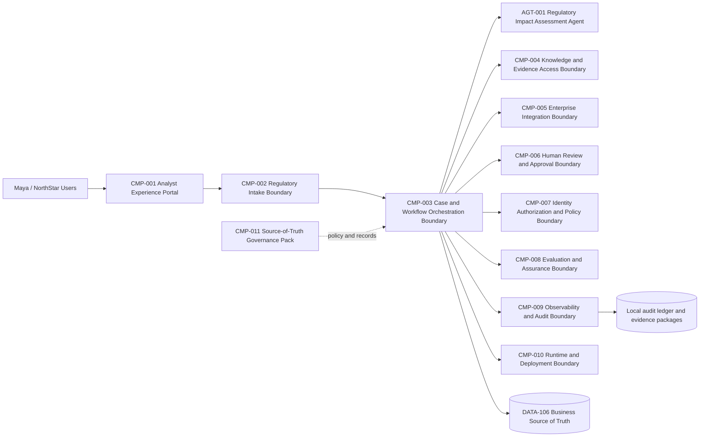
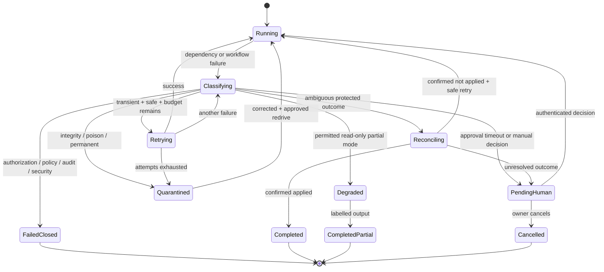
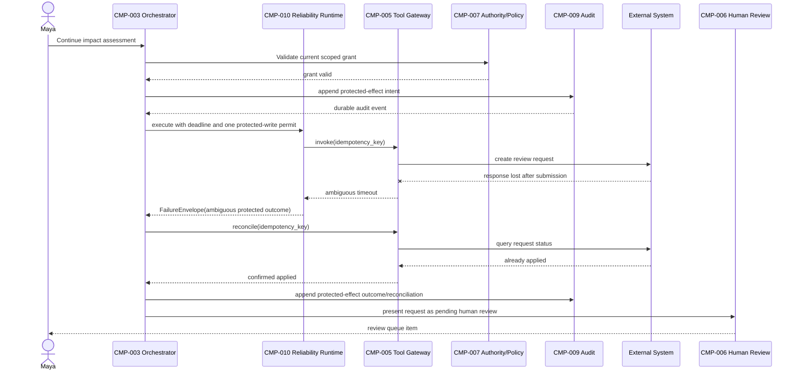

# Stage 10B — Reliability, Deployment and AgentOps

**Architecture version:** `1.16.0`  
**Repository version:** `1.16.0`  
**Graph version:** `GRAPH-001/1.12.0`  
**Reliability model:** `REL-001/1.0.0`  
**AgentOps profile:** `OPS-001/0.1.0`  
**Deployment profile:** `DEP-001/0.1.0`  
**Disaster-recovery profile:** `DR-001/0.1.0`

> **Scope resolution.** The Stage 10A handoff requested “Reliability and Failure Engineering,” while the present execution title adds deployment and AgentOps. `ADR-125` resolves the conflict by delivering complete bounded failure engineering plus the minimum deployment and AgentOps controls required to prove recovery and promotion safety. It does **not** activate production, complete Stage 8D or 9D, introduce FinOps, select enterprise backends or claim multi-region disaster recovery.

---

## 1. Context Carried Forward

NorthStar enters Stage 10B with a single active `AGT-001 Regulatory Impact Assessment Agent` inside a controlled graph. `CMP-003` owns routing and protected workflow state; `CMP-005` is the only tool gateway; `CMP-007` is the only authority issuer; `CMP-006` and authenticated humans own approvals; `CMP-009` records provider-neutral telemetry and a tamper-evident local audit chain. Mandatory audit events are unsampled, and every protected effect requires a durable intent before execution and an outcome or reconciliation record afterward.

The accepted baseline is intentionally bounded. `DATA-106` remains the business source of truth. Audit replay is read-only. Tier 4 has no tools, Tier 5 cannot be autonomously granted, one protected write may be in flight at a time, and `WP-008`, MCP/A2A and additional agents remain inactive. Stage 8D deployment eligibility and Stage 9D enterprise control-plane implementation are unresolved. Production promotion is therefore denied.

The unresolved problem is not visibility. Liam can now reconstruct a run, but reconstruction after failure does not prevent a cascade. A model timeout may trigger a retry storm. A retrieval outage may tempt the system to use stale evidence. A tool timeout may occur after the external system has already applied the change. An expired token may be retried uselessly. A reviewer timeout may be misread as approval. A corrupt checkpoint may cause unsafe replay. A queue may grow without bound. A deployment may pass code tests yet introduce a recovery regression.

**Artefacts modified:** all ten source-of-truth overlays, cumulative architecture, threat model, data/interface registers, ADR register, repository manifest, risk register, runbooks, deployment references, schemas and tests.

---

## 2. Narrative Development

At 09:12, Maya submits a regulatory publication affecting payment-dispute handling. Classification succeeds, but the primary model call times out. The runtime retries immediately. At the same moment, the retrieval index is being rebuilt and begins rejecting requests. The orchestration queue grows. A downstream case-management call returns no response after submission. The review request may or may not have been created.

The Stage 10A dashboards show all of it. That is not enough.

Liam pauses the test. “We can explain the failure,” he tells Priya, “but the system does not yet know which failures are safe to retry, which require reconciliation, which must fail closed and which can degrade. Observability has made the cascade visible; it has not engineered recovery.”

Marcus adds a security constraint: “Recovery logic is privileged software. If it can bypass a denied policy decision, reuse an expired token or repeat an ambiguous external write, it becomes a new path around the controls we just designed.”

Sofia adds the governance constraint: “A deployment that changes retry or fallback behavior changes the effective risk posture. Release evidence must bind graph, configuration, model-routing assumptions, tests and human approval. A rollback must not be described as reversing a payment or compliance action already completed in another system.”

This stage therefore treats reliability as part of the control architecture, not as a generic library wrapper.

---

## 3. Problem Being Solved

NorthStar needs to answer six questions deterministically for every operational failure:

1. **What failed?** Model, retrieval, queue, state, policy, authorization, tool, audit, human review, runtime or infrastructure.
2. **What kind of failure is it?** Transient, permanent, ambiguous, overload, integrity, security or control failure.
3. **What effect was in progress?** Read-only, reversible write or protected write.
4. **What is safe to do automatically?** Retry, fallback, reconcile, degrade, quarantine, shed load, escalate or stop.
5. **What evidence must be recorded?** Attempts, deadlines, policy references, idempotency keys, checkpoints, incident timeline and final disposition.
6. **What release or deployment change is allowed?** Local or non-production validation only until accepted production gates exist.

The design must avoid three common errors:

- treating every exception as transient;
- treating rollback of software as rollback of business effects;
- treating availability as more important than authority, audit or data integrity.

---

## 4. Requirements Introduced or Updated

Stage-qualified requirements are used because the complete historical requirements register was not supplied. They are recorded in `02-Requirements-Register.md` and must be merged without collision later.

### Functional requirements

- `S10B-FR-001`–`004`: failure classification, bounded retry, prohibited retry classes, idempotency and reconciliation.
- `S10B-FR-005`–`008`: circuit breakers, bulkheads, checkpoints, dead-letter quarantine and authenticated redrive.
- `S10B-FR-009`–`011`: controlled compensation, degraded modes and incident evidence.
- `S10B-FR-012`–`016`: release manifests, promotion gates, production denial, non-production deployment references and chaos testing.

### Non-functional requirements

- `S10B-NFR-001`: every reliability artefact has `authority_effect: none`.
- `S10B-NFR-002`: retries, fallbacks and degradation remain within time, token, cost and concurrency budgets.
- `S10B-NFR-003`: one concurrent protected write remains the maximum.
- `S10B-NFR-004`: failure and dead-letter data use references and digests rather than raw sensitive content.
- `S10B-NFR-006`: reference containers run non-root with a read-only filesystem and no automatic service-account token where supported.
- `S10B-NFR-007`: production SLO, RTO and RPO claims are prohibited until approved by accountable owners.
- `S10B-NFR-008`: code/config rollback never silently compensates completed business effects.

---

## 5. Conceptual Explanation

### 5.1 Reliability in an agentic system

Reliability is the ability of the complete socio-technical workflow to produce a safe, known disposition despite component failure. For NorthStar, “known disposition” is more important than “always returned an answer.” A safe outcome may be a partial assessment, a pending approval, a quarantined message or an explicit stop.

An agentic workflow adds failure surfaces beyond a normal API call:

- probabilistic model output may be malformed or inconsistent;
- one user request may contain several model, retrieval and tool calls;
- a graph may resume after hours or days;
- external effects may complete after the caller times out;
- authority and approval may expire while the workflow is paused;
- fallback behavior may change quality, residency or risk;
- retries may multiply token and tool costs;
- human review is a dependency with queueing and timeout behavior.

Reliability therefore requires deterministic mechanisms around the agent, not a prompt asking the model to “try again safely.”

### 5.2 Failure taxonomy

`REL-001/1.0.0` classifies a failure along independent dimensions:

| Dimension | Values | Why it matters |
|---|---|---|
| Source | model, retrieval, queue, state, authorization, policy, tool, audit, human, runtime, infrastructure | identifies owner and likely containment boundary |
| Permanence | transient, permanent | determines whether another attempt can plausibly succeed |
| Outcome certainty | known-failed, known-succeeded, ambiguous | protects against duplicate external effects |
| Effect class | read-only, reversible write, protected write | determines required idempotency, approval and audit behavior |
| Control domain | authentication, authorization, policy, security, integrity, audit | determines fail-closed behavior |
| Load condition | normal, saturated, overloaded | selects backpressure, bulkhead or shedding |
| Recovery eligibility | retry, fallback, reconcile, degrade, quarantine, escalate, stop | produces the deterministic action |

The taxonomy deliberately separates **authentication** from **authorization**. An expired credential may require obtaining a new scoped token from `CMP-007`; an authorization denial is not a transient error and must not be retried in the hope that it disappears.

### 5.3 Retry

A retry repeats an operation because the previous attempt is classified as transient and safe to repeat. Safe retry requires all of the following:

- the operation is read-only, or a write has an idempotency contract;
- the previous outcome is known to have failed, or reconciliation proves no effect occurred;
- the failure class is on the operation’s allowlist;
- the attempt and total-time budgets are not exhausted;
- the caller’s overall deadline still permits another attempt;
- retry is applied at one deliberate layer rather than multiplied across SDK, gateway and orchestration layers.

The reference uses exponential backoff with full jitter. The AWS Builders’ Library explains why timeouts, retries and backoff must be designed together and why jitter reduces correlated retry bursts [R1]. Safe write retries depend on idempotent APIs and client request identifiers [R2]. These are established distributed-systems practices; NorthStar adds authority and audit constraints around them.

### 5.4 Circuit breaker

A circuit breaker stops calls to a dependency after a threshold of relevant failures. It moves through closed, open and half-open states. Its purpose is not to “fix” the dependency; it protects callers and gives the dependency time to recover.

NorthStar scopes circuits by dependency and operation class. A model circuit does not automatically open the policy service circuit. Protected-write and read circuits are not mixed because their failure consequences differ. Half-open probes are bounded and never carry protected writes unless the external contract explicitly supports a harmless status check.

### 5.5 Bulkhead and admission control

A bulkhead partitions concurrency so that one failing dependency or high-volume case cannot consume all workers. NorthStar retains the existing one-concurrent-protected-write maximum and adds separate bounded capacity for model, retrieval, review and non-protected operations.

When capacity is exhausted, the system rejects, delays at the controlled admission point or returns a labelled degraded result. It does not accept unlimited work into memory. Google SRE guidance treats overload handling and degraded service as core reliability practices and warns that overload can become a cascading failure [R3][R4].

### 5.6 Checkpoint recovery

A checkpoint records resumable workflow state at an accepted safe point. It contains graph version, sequence, state digest, references and no authority effect. Loading a checkpoint reconstructs orchestration context only. It does not replay audit events into `DATA-106`, reapply external effects or preserve expired grants.

On resume, NorthStar must:

1. verify the checkpoint digest and schema;
2. confirm graph-version compatibility;
3. query `DATA-106` and external systems for current state;
4. obtain fresh authorization and policy decisions;
5. reconcile any effect whose outcome was ambiguous;
6. continue from a deterministic recovery node.

### 5.7 Dead-letter handling

A dead-letter queue is a quarantine, not an automatic retry backlog. NorthStar sends a message there after a permanent error, poison payload, incompatible schema or exhausted bounded retry. The record stores message ID, reason, payload digest, idempotency reference and attempt count, not raw regulatory documents or secrets.

Redrive requires a corrected cause, an authenticated operator, approval reference where required, current schema compatibility and a new audit event. The agent cannot redrive its own failed work.

### 5.8 Compensation

Compensation is a new business action intended to reduce or reverse the effect of a prior action. It is not database rollback across distributed systems. A compensation may itself be protected, may fail and may require human approval.

Examples:

- cancelling a draft review request may be reversible;
- sending a corrective notice is a new external effect;
- reversing a financial transaction may be high impact and outside the agent’s permitted tool tier.

Every compensation goes through `CMP-005`, a current `CMP-007` grant, applicable policy, audit intent/outcome and human approval. Software rollback does not invoke compensation implicitly.

### 5.9 Degraded modes

A degraded mode delivers a smaller, explicitly labelled service. NorthStar permits degradation only where it cannot be mistaken for an approved impact assessment.

| Failure | Allowed degraded behavior | Prohibited behavior |
|---|---|---|
| primary model unavailable | approved fallback only if quality/risk/residency gates exist; otherwise stop | unapproved model substitution |
| retrieval unavailable | cached or previously approved evidence for a read-only draft if freshness is within policy | final mapping or protected action using stale evidence |
| policy/authorization unavailable | none | cached allow decision for protected action beyond accepted TTL |
| audit unavailable | operational telemetry may queue; protected effect blocks | execute now and “audit later” |
| human approval timeout | remain pending and escalate | auto-approve on timeout |
| queue overload | reject/load-shed low-priority work with retry-after | unbounded queue growth |
| checkpoint corrupt | quarantine and reconstruct from authoritative sources | continue from unverified state |

### 5.10 AgentOps

AgentOps is the controlled lifecycle of agent specification, graph, prompt, model routing, tool contracts, configuration, evaluations, release, deployment, incident response and retirement. In this stage it is deliberately narrower than a full enterprise platform.

The release unit is not only a container image. `DATA-252 ReleaseManifest` binds:

- architecture and repository version;
- `GRAPH-001` version;
- `AGT-001` specification version;
- source digest;
- configuration digest;
- test-report digest;
- environment;
- unresolved gate flags;
- production-route status.

SLSA provenance provides an established model for describing how software artefacts were produced [R5]. NorthStar records a local release manifest compatible with that direction but does not claim a SLSA level, secure builder or verified production attestation.

---

## 6. When This Capability Is Required

Use these controls when any of the following is true:

- one business request spans multiple fallible dependencies;
- an operation may create an external effect;
- execution may continue after a process restart or long human pause;
- dependencies impose rate limits or exhibit intermittent failure;
- a queue may accumulate work faster than it is processed;
- a fallback changes model, data residency or quality characteristics;
- a release changes graph, prompt, policy, retry or tool behavior;
- the workflow has regulatory evidence or accountability obligations;
- operators need a defined incident and recovery procedure.

For NorthStar, all apply.

---

## 7. When It Is Not Required

A simple retry framework, distributed checkpoint store or progressive-delivery controller is unnecessary when:

- the task is a one-shot local calculation with no external dependency;
- a failed read can be safely returned to the user without state;
- the operation is not worth resuming after interruption;
- there is no side effect, queue or long-running workflow;
- a small proof of concept can be restarted manually;
- the organization cannot operate the extra infrastructure or interpret its alerts.

Even in these cases, timeouts and clear errors remain necessary. Overengineering reliability can create more states than the team can test, including incorrect circuit behavior, stale fallbacks and operational complexity.

---

## 8. Architecture Options

### 8.1 Retry placement

1. **SDK-level retries** — easy but often invisible to orchestration and may multiply with other layers.
2. **Gateway retries** — useful for transport-specific transient failures, but lacks full workflow deadline and business context.
3. **Orchestrator-owned retries** — visible, policy-aware and traceable; more implementation work.
4. **Durable workflow engine** — strongest long-running execution semantics; adds infrastructure and operational dependency.

### 8.2 Checkpoint persistence

1. Local atomic files.
2. Relational database with optimistic concurrency.
3. Event store.
4. Durable workflow engine state.
5. Cloud-managed orchestration state.

### 8.3 Deployment strategy

1. Recreate.
2. Rolling update.
3. Blue/green.
4. Canary/progressive delivery.
5. Shadow deployment.

Kubernetes Deployments support declarative rolling updates [R6]. Probes separate startup, readiness and liveness decisions [R7], while PodDisruptionBudgets limit voluntary concurrent disruption but do not prevent all involuntary failures [R8]. Argo Rollouts provides blue/green and canary capabilities as an optional progressive-delivery alternative [R9].

### 8.4 Recovery ownership

1. Model-selected recovery.
2. Agent-loop heuristics.
3. Deterministic policy in `CMP-003`/`CMP-010`.
4. External enterprise control plane.

The fourth option remains unresolved because Stage 9D is incomplete.

---

## 9. Decision Matrix

| Option | Safety | Long-running durability | Operability | Local runnable | Authority separation | Current selection |
|---|---:|---:|---:|---:|---:|---|
| SDK retries only | low–medium | low | medium | high | weak | rejected as primary |
| deterministic orchestrator policy | high | medium | high | high | high | selected |
| durable workflow engine | high | high | medium | medium | high if configured | deferred |
| model-selected recovery | low | low | low | high | poor | rejected |
| local file checkpoints | medium | low–medium | high | high | high | selected for reference |
| database/event-store checkpoints | high | high | medium | medium | high | production candidate, deferred |
| rolling deployment | medium | n/a | high | high | neutral | selected for non-production reference |
| canary/blue-green | high when metrics are mature | n/a | medium | medium | neutral | documented alternative; deferred |
| full enterprise AgentOps platform | high | high | medium | low | high | deferred to S09D and later production work |

---

## 10. Selected Architecture and Rationale

NorthStar selects a provider-neutral reliability layer implemented by deterministic modules inside existing boundaries:

- `CMP-003` owns classification and recovery routing.
- `CMP-010` owns timers, retry execution, circuits, bulkheads, health and deployment mechanics.
- `CMP-005` owns idempotency reconciliation and compensation execution.
- `CMP-007` reissues fresh authority; cached identity from trace or checkpoint is prohibited.
- `CMP-006` owns human escalation, redrive approval and release approval.
- `CMP-009` records incident and recovery evidence.
- `CMP-008` evaluates recovery and chaos invariants.
- `CMP-011` owns policy, release manifests, compatibility and promotion decisions.

The local implementation uses atomic file checkpoints and JSONL dead-letter records because the current task is an executable reference on modest hardware. These are explicitly not enterprise durability mechanisms. A durable workflow engine, managed queue, object-lock backup, multi-region database and progressive-delivery controller remain candidate production technologies rather than accepted components.

---

## 11. Architecture Before the Change



Stage 10A could observe every major interaction and block protected effects when mandatory audit append failed. It had no complete recovery state machine, dependency isolation, checkpoint integrity, dead-letter process or release gating.

---

## 12. Architecture After the Change

```mermaid
flowchart TB
    U[Maya / NorthStar Users] --> C1[CMP-001 Analyst Experience Portal]
    C1 --> C2[CMP-002 Regulatory Intake Boundary]
    C2 --> C3

    subgraph ORCH[CMP-003 Case and Workflow Orchestration Boundary]
      C3[Workflow Owner]
      FC[Failure Classifier]
      RP[Recovery Planner]
      CP[Checkpoint Resume]
      DLQ[Dead-Letter Quarantine]
      ADM[Admission / Cancellation]
      C3 --> FC --> RP
      C3 --> CP
      C3 --> DLQ
      C3 --> ADM
    end

    C3 --> A1[AGT-001 Regulatory Impact Assessment Agent]
    C3 --> C4[CMP-004 Knowledge and Evidence Access Boundary]

    subgraph INT[CMP-005 Enterprise Integration Boundary]
      C5[Tool Gateway]
      IDP[Idempotency Reconciliation]
      COMP[Approved Compensation]
      C5 --> IDP
      C5 --> COMP
    end

    C3 --> C5
    C3 --> C6[CMP-006 Human Review and Approval Boundary]
    C3 --> C7[CMP-007 Identity Authorization and Policy Boundary]
    C3 --> C8[CMP-008 Evaluation and Assurance Boundary]

    subgraph OBS[CMP-009 Observability and Audit Boundary]
      C9[Telemetry / Audit]
      INC[Incident Evidence]
      RELAUD[Recovery and Release Evidence]
      C9 --> INC
      C9 --> RELAUD
    end
    C3 --> C9

    subgraph RUN[CMP-010 Runtime and Deployment Boundary]
      C10[Runtime]
      RET[Timeout / Retry / Jitter]
      CB[Circuit Breakers]
      BH[Bulkheads / Load Shedding]
      HEALTH[Startup / Readiness / Liveness]
      DEP[Non-production Deployment Reference]
      C10 --> RET
      C10 --> CB
      C10 --> BH
      C10 --> HEALTH
      C10 --> DEP
    end
    C3 --> C10

    subgraph GOV[CMP-011 Source-of-Truth Governance Pack]
      C11[Reliability Policy]
      RM[Release Manifest]
      PG[Promotion Gates]
      DR[DR Boundaries / Open RTO-RPO]
      C11 --> RM --> PG
      C11 --> DR
    end

    C11 -. policy .-> C3
    PG -. production denied .-> DEP
    C7 -. fresh grant only .-> C5
    C6 -. approval .-> DLQ
    C6 -. release approval .-> PG
    C9 --> LEDGER[(AUD-001 Local Append-only Ledger)]
    CP -. read-only resume context .-> D106[(DATA-106 Business Source of Truth)]
    IDP -. status query .-> EXT[(External Enterprise Systems)]
    C5 --> EXT

    classDef added fill:#e8f3ff,stroke:#1f5a99,stroke-width:2px;
    class FC,RP,CP,DLQ,RET,CB,BH,HEALTH,DEP,IDP,COMP,INC,RELAUD,RM,PG,DR added;
```



The architecture adds no top-level component and no agent. It expands deterministic responsibilities within accepted boundaries. The crucial control is the separation between recovery decision, authority and external execution.

---

## 13. Detailed Component Design

### 13.1 `CMP-003` recovery state machine



The model may provide a safe summary of the error, but it does not select the state transition.

### 13.2 Retry policy

The local `RetryExecutor`:

- accepts an operation-specific `RetryPolicy`;
- requires an idempotency key for writes;
- retries only `FailureClass.TRANSIENT` on an explicit allowlist;
- refuses ambiguous protected retries;
- applies full jitter to exponential delay;
- stops when attempts or total-time budget is exhausted;
- returns the number of attempts for audit/metrics.

Recommended production policy dimensions include connect timeout, first-byte timeout, total call deadline, workflow deadline, retry-after compliance, per-tenant budget and dependency-specific limits. The sample values are test values, not production recommendations.

### 13.3 Circuit breaker

The local circuit breaker records failures and moves to open at a configured threshold. After the recovery interval it allows a bounded half-open probe. A failed probe reopens the circuit; a successful probe closes it.

Production refinement must distinguish failures that indicate dependency health from caller errors. A policy denial must not open a circuit; a sequence of timeouts may. Metrics must avoid high-cardinality labels such as raw case IDs.

### 13.4 Bulkhead

The local bulkhead uses a bounded semaphore. Production may use worker pools, queue partitions, per-tenant admission tokens or separate compute pools. The key invariant is that capacity for human-review coordination, audit and policy checks cannot be consumed entirely by model retries.

### 13.5 Checkpoint store

`CheckpointStore.save` writes canonical JSON to a temporary file and atomically replaces the target. It records state and record digests. `load` verifies both and rejects any authority effect. This protects the local reference from simple corruption but does not provide replication, consensus, WORM, encryption or enterprise durability.

### 13.6 Dead-letter queue

`DeadLetterQueue.append` stores a payload digest rather than the payload. `authorize_redrive` requires an approver and approval ID. A production implementation must additionally validate current data retention, tenant scope, schema migration, replay destination and cause remediation.

### 13.7 Integration gateway

The local `EnterpriseIntegrationGateway` demonstrates three invariants:

1. a valid scoped grant issued by `CMP-007` is required;
2. audit intent is appended before a protected effect;
3. an idempotency key deduplicates a repeated call and supports reconciliation.

The mock applies an in-memory effect only after audit intent. A production connector would need a durable idempotency ledger or an external API that natively exposes request status.

### 13.8 Release manager

`ReleaseManager.build_manifest` hashes source, configuration and test evidence. `evaluate_promotion` checks gate results and human approval. For `production`, it also checks unresolved Stage 8D, Stage 9D and route status. All remain false or unresolved, so production promotion is denied even when local tests pass.

### 13.9 Deployment planner

`DeploymentPlanner` permits reference plans for local, shared development, test and pre-production. `production` and multi-region requests return a no-route plan. The Kubernetes example uses:

- two replicas;
- rolling update with `maxUnavailable: 0` and `maxSurge: 1`;
- startup, readiness and liveness checks;
- resource requests and limits;
- non-root, no privilege escalation and read-only root filesystem;
- no automatic service-account token;
- a PodDisruptionBudget;
- a default-deny NetworkPolicy reference.

It intentionally uses an invalid image registry name and a reference namespace so it cannot be mistaken for a production deployment.

---

## 14. Data, State and Interface Design

### 14.1 New data objects

`DATA-237`–`256` are listed in the data register. The most important are:

- `DATA-237 FailureEnvelope` — safe diagnostic context.
- `DATA-239 RetryPolicy` — deterministic attempt and budget rules.
- `DATA-243 DeadLetterRecord` — minimized quarantine record.
- `DATA-244 WorkflowCheckpoint` — resumable orchestration state.
- `DATA-245 RecoveryDecision` — selected action with no authority.
- `DATA-246 CompensationPlan` — proposed controlled action.
- `DATA-248 IncidentRecord` — timeline and evidence.
- `DATA-252 ReleaseManifest` — version-bound release unit.
- `DATA-254 PromotionDecision` — gate outcome; not deployment authority.
- `DATA-255 RollbackPlan` — software/config rollback plus separate compensation references.

### 14.2 New interfaces

`INT-197`–`216` cover classification, retry, deadlines, circuits, bulkheads, checkpoints, dead letters, reconciliation, compensation, degraded mode, incidents, chaos, release, promotion, deployment, rollback and status.

Every interface enforces the following contract:

```text
authority_effect = none
cannot_issue_grant = true
cannot_approve = true
cannot_mutate_DATA_106_directly = true
cannot_invoke_tool_outside_CMP_005 = true
cannot_activate_production_route = true
```

### 14.3 Failure-recovery sequence



No blind retry occurs between timeout and reconciliation.

---

## 15. Implementation

### 15.1 Repository modules

- `reliability/models.py` — failure, effect, recovery and release types.
- `reliability/retry.py` — safe bounded retry.
- `reliability/circuit_breaker.py` — closed/open/half-open state.
- `reliability/bulkhead.py` — bounded concurrency.
- `reliability/checkpoint.py` — atomic digest-verified checkpoint.
- `reliability/dlq.py` — metadata-minimized dead letters and controlled redrive evidence.
- `reliability/recovery.py` — deterministic decision table.
- `reliability/chaos.py` — isolated local fault injection.
- `integration/gateway.py` — local `CMP-005` idempotency/audit demonstration.
- `agentops/release.py` — release manifest and promotion decision.
- `deployment/plan.py` — environment-aware route denial.

### 15.2 Representative retry code

```python
result = RetryExecutor(...).execute(
    operation,
    policy=retry_policy,
    effect_class=EffectClass.READ_ONLY,
    idempotency_key=None,
    classify=classify_exception,
)
```

For a write, an idempotency key is mandatory. For an ambiguous protected timeout, the executor raises `UnsafeRetry`, forcing the orchestrator into reconciliation.

### 15.3 Local execution

```bash
cd northstar-agentic-compliance-stage10b-reliability-agentops
export PYTHONPATH=src
python scripts/validate_stage10b.py
pytest
python scripts/run_stage10b_demo.py
python scripts/run_stage10b_chaos.py
python scripts/run_stage10b_evaluation_gates.py
python scripts/consistency_audit_stage10b.py
```

The code targets Python `>=3.12,<3.14` and was executed in this environment with Python `3.13.5`, pytest `9.0.2` and jsonschema `4.26.0`.

### 15.4 Expected demo behavior

The demo:

- performs one protected write with audit intent and outcome;
- repeats the same idempotency key and receives a deduplicated response;
- writes a digest-verified checkpoint;
- quarantines a dead letter without raw payload;
- classifies an ambiguous protected timeout as `reconcile`;
- builds a production-targeted release manifest;
- denies production promotion due to unresolved gates and disabled route;
- prepares a pre-production reference plan with route activation still false.

---

## 16. Code and Repository Changes

### Files added

- reliability and AgentOps modules under `src/northstar_compliance`;
- 20 schemas, `DATA-237`–`256`;
- five JSON policy/configuration files;
- Docker and Kubernetes reference deployment files;
- CI workflow with a permanently disabled production job;
- unit, integration, security, chaos and performance tests;
- source-of-truth overlays, ADRs, runbooks, diagrams and reports.

### Files modified

No earlier repository files were available for direct modification. This is a compatibility overlay.

### Files retired

None.

### Migration note

A later merge must map these modules into the accepted `northstar-agentic-compliance` repository, preserve imports and version contracts, and reconcile stage-qualified requirement IDs with the full requirements register. It must not overwrite newer `DATA`, `INT`, `ADR`, risk or issue identifiers.

---

## 17. Security and Governance Implications

### 17.1 Recovery as an attack surface

Attackers may intentionally trigger retries, circuit opening, fallback, dead-letter accumulation or degraded mode. Controls include:

- classification based on trusted status and contracts rather than model text;
- retry budgets per dependency and tenant;
- no authorization/policy retry bypass;
- no raw hostile content in DLQ records;
- authenticated redrive and release approval;
- audit of state changes and recovery actions;
- fallback allowlists with residency and evaluation evidence;
- isolated chaos environments with abort criteria.

### 17.2 Checkpoint security

A checkpoint may contain case references and workflow state. It requires access control, encryption at rest in production, retention limits, tenant binding and digest verification. It must not store unrestricted credentials. Grants are reacquired after resume.

### 17.3 Deployment security

The reference manifest reduces default privilege but is not a complete production pod-security standard. Image signing, admission policy, SBOM, provenance verification, secret injection, mTLS, runtime policy and cluster hardening remain unresolved.

### 17.4 Governance

Changes to retry, fallback, timeout, circuit threshold, degraded mode or compensation policy are governed changes because they alter risk, cost and user-visible behavior. Release evidence must include configuration digest and evaluation results. Human release approval is necessary but not sufficient; unresolved mandatory gates still deny production.

### 17.5 Disaster recovery governance

NIST contingency-planning guidance emphasizes determining recovery requirements and integrating contingency planning with system lifecycle and business priorities [R10]. NorthStar adopts the structure but does not assign production RTO/RPO values in this stage. Those values require business impact analysis and accountable owner approval.

---

## 18. Performance, Concurrency and Cost Implications

### 18.1 Latency

Retries increase tail latency. A three-attempt policy is not “three times more reliable” if the caller’s deadline has already expired. The total budget must include model, retrieval, tool and queue delay. Full jitter reduces synchronized bursts but introduces deliberate delay.

### 18.2 Concurrency

Bulkheads lower peak utilization in exchange for containment. This is intentional. The protected-write pool remains one. Read-only retrieval may use a larger pool. Half-open probes must be limited to avoid a recovery stampede.

### 18.3 Cost

Reliability controls can increase cost through duplicate model calls, storage, standby capacity, telemetry, chaos tests and human incident response. They can also reduce failed-run cost, duplicate effects and prolonged incidents. FinOps formulas and production capacity are deferred to Stage 10C.

Immediate controls are:

- no retry after budget exhaustion;
- no retry for permanent/control failures;
- no fallback cascade through many models;
- no unbounded queue;
- no duplicate protected effect;
- operational telemetry sampling remains separate from unsampled audit;
- chaos tests are isolated and scheduled, not continuous production load.

### 18.4 Local performance guard

The test executes 10,000 deterministic recovery decisions in under one second on the current environment. This checks accidental algorithmic regression only. It is not a production SLO and says nothing about external dependency latency.

---

## 19. Evaluation and Test Cases

### 19.1 Test inventory

The executed suite contains 56 pytest cases:

- retry safety and prohibited classes;
- circuit states and half-open limits;
- bulkhead rejection and release;
- deterministic recovery table;
- checkpoint round-trip and tamper detection;
- dead-letter minimization and approval requirements;
- protected-effect audit intent/outcome;
- idempotent deduplication and reconciliation;
- audit failure blocks effect;
- release gate and production denial;
- route, agent/tool and authority invariants;
- local chaos outcomes;
- deterministic performance guard.

Twenty JSON schemas and five policy/configuration files are syntactically and meta-schema validated.

### 19.2 Evaluation gates

`EVAL-253`–`260` verify:

1. retries occur only where safe;
2. ambiguous protected outcomes reconcile;
3. audit failure blocks effects;
4. reliability logic has no authority effect;
5. checkpoint corruption is detected;
6. DLQ redrive requires control;
7. production promotion remains denied;
8. chaos injection preserves the protected-effect invariant.

### 19.3 Production evaluation still missing

The following remain mandatory before production:

- dependency-specific failure-rate and latency distributions;
- model fallback quality and safety evaluation;
- retrieval freshness and degraded-mode evaluation;
- queue saturation and recovery under realistic load;
- canary metrics and rollback thresholds;
- multi-hour checkpoint recovery and schema migration;
- backup restore and regional failover exercises;
- on-call incident simulation with human participants;
- cost and error-budget analysis;
- S08D/S09D promotion evidence.

---

## 20. Failure Scenarios and Recovery

| Incident | Detection | Containment | Recovery | Audit evidence | Preventive improvement |
|---|---|---|---|---|---|
| model timeout | call deadline, trace error | retry budget and model circuit | bounded retry; approved fallback only | model ID, attempt, deadline, circuit state | calibrate timeout and routing |
| retrieval index outage | health/error rate | retrieval bulkhead/circuit | cached read-only evidence if fresh; otherwise stop | index version, freshness, degraded flag | redundant index and rebuild procedure |
| duplicate tool execution | repeated idempotency key | `CMP-005` dedupe | return prior outcome | intent/outcome and duplicate reference | durable idempotency ledger |
| expired token | auth error | stop operation | obtain new scoped grant from `CMP-007` | old grant ref, denial, new grant ref | shorter pause-aware workflows |
| ambiguous tool timeout | timeout after submit | no blind retry | reconcile external status | idempotency key and reconciliation | status API and durable request ledger |
| human approval timeout | queue deadline | keep pending | escalate/reassign/cancel | approval ID and timeout disposition | staffing and SLA design |
| queue overload | depth/age/admission metric | load shedding and bulkheads | drain by priority; controlled resubmit | rejection reason and retry-after | capacity and admission tuning |
| infinite loop | iteration/progress budget | cancel graph | checkpoint at last safe node; human review | loop evidence and termination | improved progress invariant |
| corrupted checkpoint | digest/schema mismatch | quarantine | reconstruct from `DATA-106` and external state | checkpoint digest and quarantine event | replicated transactional store |
| prompt injection event | guardrail/security signal | quarantine input; no tool | security review or safe re-ingestion | digest, rule, disposition | source trust and parser hardening |
| incorrect policy mapping | evaluation/human finding | block finalization | correct mapping and rerun affected nodes | versions, reviewer correction | regression dataset update |
| control-plane outage | health and cached-config age | fail closed for protected paths | restore control plane; bounded read-only mode only if approved | config version and outage timeline | highly available control-plane design |
| audit outage | mandatory append failure | block protected effects | restore ledger; resume from checkpoint | failed append and blocked action | durable audit architecture |
| failed deployment | readiness/error metrics | stop rollout | software/config rollback | release/manifest/rollback refs | progressive delivery and analysis |
| regional disaster | regional health and business declaration | isolate region | execute approved DR plan | incident, backup and failover evidence | tested RTO/RPO and multi-region architecture |

### 20.1 Audit-outage chaos example

The local chaos harness marks audit unavailable and verifies that no protected effect executes. This is a narrow deterministic experiment. It does not constitute a full chaos engineering program.

### 20.2 Disaster-recovery boundary

This stage defines the required DR artefacts but does not claim implementation:

- business impact analysis;
- approved RTO/RPO by service and data class;
- backup scope, encryption, immutability and retention;
- restore sequence and dependency order;
- checkpoint/audit/business-state reconciliation;
- failover authority and communication plan;
- regional data-residency constraints;
- periodic restore and failover evidence.

Google SRE data-integrity guidance recommends layered protection including recovery methods and validation [R11]. NorthStar’s local checkpoint is only a development layer, not a backup strategy.

---

## 21. Architecture Decision Records

### `ADR-125` — Stage scope resolution

**Status:** accepted.  
**Context:** the requested title includes reliability, deployment and AgentOps, while the handoff instruction names reliability only.  
**Decision:** implement reliability fully and only the deployment/AgentOps controls needed to prove safe non-production operation and promotion denial. Exclude FinOps and production activation.  
**Alternatives:** ignore the user title; implement all production deployment topics; split the stage.  
**Rationale:** preserves user intent without violating the handoff’s prohibition on production routes.  
**Consequences:** the stage includes release manifests and reference deployment files but not production readiness.  
**Review trigger:** Stage 8D/9D resolution or a revised roadmap.

### `ADR-126` — Failure taxonomy

Use a provider-neutral deterministic taxonomy based on source, permanence, ambiguity, effect class and control domain. Model-generated classifications may be advisory only.

### `ADR-127` — Retry eligibility

Retry only explicitly transient operations. Writes require idempotency. Attempts and total time are bounded.

### `ADR-128` — Backoff and deadline

Use exponential backoff with full jitter and propagate the caller deadline. Configure retries at one deliberate layer.

### `ADR-129` — Failure containment

Use per-dependency circuit breakers, bulkheads, admission control and load shedding rather than unbounded queues.

### `ADR-130` — Checkpoint recovery

Use atomic, digest-verified workflow checkpoints for the local reference. Resume cannot mutate `DATA-106` without normal interfaces and controls.

### `ADR-131` — Dead letters

Use metadata-minimized quarantine. Redrive requires authenticated approval and corrected cause.

### `ADR-132` — Ambiguous outcome and compensation

Reconcile before retry. Compensation is a new controlled action through `CMP-005`, not an implicit rollback.

### `ADR-133` — Degraded modes

Fail closed for authority, policy, audit, security and integrity failures. Permit only labelled read-only partial operation where policy explicitly allows it.

### `ADR-134` — Deployment reference

Use local containers and an illustrative Kubernetes rolling deployment. Do not select or activate a production deployment platform.

### `ADR-135` — Release manifest

Bind source, configuration, graph, agent specification and test evidence with digests.

### `ADR-136` — Promotion gates

Require quality, security, compatibility, recovery and human gates. Production remains denied while S08D/S09D and route activation are unresolved.

### `ADR-137` — DR boundaries

Define required DR decisions and tests now; defer RTO/RPO values, topology and failover claims to accountable owners.

---

## 22. Requirements Traceability Update

| Requirement | Architecture | Implementation | Control | Verification |
|---|---|---|---|---|
| `S10B-FR-001` | `CMP-003` classifier | `models.py`, `recovery.py` | deterministic taxonomy | recovery tests |
| `S10B-FR-002` | `CMP-010` runtime | `retry.py` | attempt/time budget | retry tests |
| `S10B-FR-004` | `CMP-005` gateway | `gateway.py` | idempotency/reconcile | integration tests |
| `S10B-FR-005` | `CMP-010` isolation | circuit/bulkhead modules | threshold/capacity | unit tests |
| `S10B-FR-006` | `CMP-003` recovery | `checkpoint.py` | digest/atomic replace | tamper test |
| `S10B-FR-007` | `CMP-003` quarantine | `dlq.py` | payload digest only | minimization test |
| `S10B-FR-009` | `CMP-005` compensation | architecture contract | current grant/approval | security audit |
| `S10B-FR-010` | `CMP-003`/`007` | degraded-mode config | fail-closed table | evaluation gates |
| `S10B-FR-012` | `CMP-011` AgentOps | `release.py` | digest-bound manifest | release tests |
| `S10B-FR-014` | `CMP-010`/`011` | deployment/promotion logic | route false | denial tests |
| `S10B-FR-016` | `CMP-008`/`010` | `chaos.py` | local-only invariant | chaos tests |

---

## 23. Stage Outcome

NorthStar can now:

- identify whether a failure is safe to retry;
- bound retries by attempts, time and effect semantics;
- contain failing dependencies with circuits and bulkheads;
- reconcile ambiguous protected outcomes;
- resume from a verified workflow checkpoint;
- quarantine poison work and control redrive;
- enter labelled read-only degraded modes while failing closed at authority and audit boundaries;
- record recovery and incident evidence;
- bind a release to versions, configuration and test evidence;
- run local and non-production deployment references;
- prove that production promotion remains denied.

It still cannot claim production reliability.

---

## 24. Known Limitations

1. The complete Stage 10A repository and historical source-of-truth registers were not supplied; this is not a byte-exact merge.
2. Local files are not a distributed workflow engine, enterprise database, managed queue or immutable backup.
3. No live model, retrieval, policy, authorization, audit or enterprise tool adapters are connected.
4. Retry, circuit and bulkhead values are test values, not calibrated production settings.
5. No fallback model/tool is approved or active.
6. No production SLO, error budget, RTO or RPO is accepted.
7. No multi-region failover, backup restore or disaster exercise has been proven.
8. No production image registry, SBOM, signature, admission control or provenance verification exists.
9. No canary or blue/green controller is installed.
10. Stage 8D and Stage 9D remain unresolved.
11. Production route activation and promotion remain disabled.
12. FinOps and capacity economics are deferred.

---

## 25. Narrative Bridge to the Next Stage

The reliability test ends safely. The ambiguous review request is reconciled, not duplicated. The retrieval outage produces a clearly limited draft rather than a final assessment. The approval remains pending. The release manifest proves which graph and policy produced the behavior, and the production gate refuses promotion.

Daniel Brooks asks the next unavoidable question: “What reliability can we afford, and what reliability do we actually need?”

NorthStar still lacks workload-specific SLOs, error budgets, capacity plans, human-review economics, failed-run cost, observability and evaluation cost, retention cost, regional deployment trade-offs and approved RTO/RPO. Until those are quantified—and until Stage 8D and 9D are resolved—production readiness cannot be demonstrated.

---

## 26. Updated Source-of-Truth Artefacts

The repository includes updated overlays for:

1. `00-Project-Constitution.md`
2. `01-Business-and-User-Story-Baseline.md`
3. `02-Requirements-Register.md`
4. `03-Architecture-Baseline.md`
5. `04-Component-and-Agent-Catalogue.md`
6. `05-Data-and-Schema-Register.md`
7. `06-ADR-Register.md`
8. `07-Repository-Manifest.md`
9. `08-Risk-Assumption-and-Issue-Register.md`
10. `09-Stage-Handoff-Pack.md`

---

## 27. Stage Handoff Pack

The complete reusable handoff pack is stored at `docs/source-of-truth/09-Stage-Handoff-Pack.md` and reproduced as a separate top-level deliverable.

---

## Stage Consistency Audit

**Result: passed with recorded exceptions.**

Verified:

- narrative, architecture and code preserve exactly one active `AGT-001`;
- no new top-level component, protocol or tool is activated;
- `CMP-003`, `CMP-005`, `CMP-006` and `CMP-007` retain accepted ownership;
- all new schemas specify `authority_effect: none`;
- protected-effect demo writes audit intent before effect and outcome afterward;
- audit failure blocks the effect;
- checkpoints do not write `DATA-106`;
- production route and promotion remain disabled;
- 56 tests pass;
- 20 schemas and five configuration files validate;
- Mermaid identifiers and repository paths are internally consistent.

Recorded exceptions:

- historical source-of-truth and repository merge is compatible rather than byte-exact (`ISS-183`);
- local Python validation used `3.13.5` while the repository target is `>=3.12,<3.14`;
- no production infrastructure or external adapter was available for validation;
- enterprise RTO/RPO, S08D and S09D remain unresolved.

---

## References

- **[R1]** Amazon Builders’ Library, *Timeouts, retries, and backoff with jitter*, accessed 2026-08-01: https://aws.amazon.com/builders-library/timeouts-retries-and-backoff-with-jitter/
- **[R2]** Amazon Builders’ Library, *Making retries safe with idempotent APIs*, accessed 2026-08-01: https://aws.amazon.com/builders-library/making-retries-safe-with-idempotent-APIs/
- **[R3]** Google SRE Book, *Addressing Cascading Failures*, accessed 2026-08-01: https://sre.google/sre-book/addressing-cascading-failures/
- **[R4]** Google SRE Book, *Handling Overload*, accessed 2026-08-01: https://sre.google/sre-book/handling-overload/
- **[R5]** SLSA, *Provenance v1*, accessed 2026-08-01: https://slsa.dev/provenance/v1
- **[R6]** Kubernetes Documentation, *Deployments*, updated 2026-06-18: https://kubernetes.io/docs/concepts/workloads/controllers/deployment/
- **[R7]** Kubernetes Documentation, *Liveness, Readiness, and Startup Probes*, updated 2026-04-17: https://kubernetes.io/docs/concepts/workloads/pods/probes/
- **[R8]** Kubernetes Documentation, *Specifying a Disruption Budget for your Application*, accessed 2026-08-01: https://kubernetes.io/docs/tasks/run-application/configure-pdb/
- **[R9]** Argo Rollouts Documentation, *Concepts*, accessed 2026-08-01: https://argo-rollouts.readthedocs.io/en/stable/concepts/
- **[R10]** NIST SP 800-34 Rev. 1, *Contingency Planning Guide for Federal Information Systems*, accessed 2026-08-01: https://csrc.nist.gov/pubs/sp/800/34/r1/final
- **[R11]** Google SRE Book, *Data Integrity: What You Read Is What You Wrote*, accessed 2026-08-01: https://sre.google/sre-book/data-integrity/
