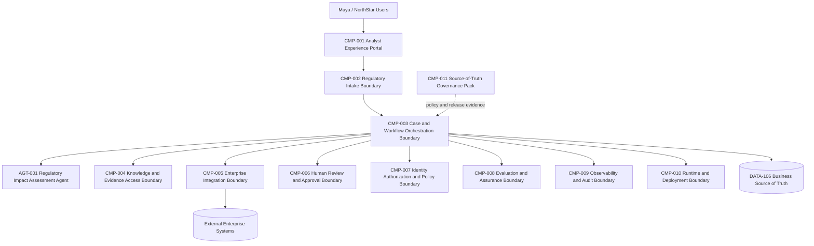

# Stage 10C — FinOps, Capacity and Production Readiness

**Stage identifier:** `S10C`  
**Architecture version:** `1.17.0`  
**Repository version:** `1.17.0`  
**Handoff version:** `1.17.0`  
**Graph version:** `GRAPH-001/1.12.0` unchanged  
**Threat-model version:** `TM-001/1.4.0` unchanged  
**Authorization model:** `AUTH-001/1.0.0` unchanged  
**Blast-radius model:** `BR-001/1.0.0` unchanged  
**Guardrail model:** `GR-001/1.0.0` unchanged  
**Governance model:** `GOV-001/1.0.0` unchanged  
**Control-plane profile:** `CP-001/0.1.0` unchanged; Stage 9D unresolved  
**Observability model:** `OBS-001/1.0.0` unchanged  
**Audit model:** `AUD-001/1.0.0` unchanged  
**Evidence-package model:** `EVID-001/1.0.0` unchanged  
**Reliability model:** `REL-001/1.0.0` unchanged  
**AgentOps profile:** `OPS-001/0.1.0` unchanged  
**Deployment profile:** `DEP-001/0.1.0` unchanged  
**Disaster-recovery profile:** `DR-001/0.2.0` — proposed recovery-objective ownership; not approved or exercised  
**FinOps model:** `FIN-001/1.0.0`  
**Capacity model:** `CAP-001/1.0.0`  
**SLO profile:** `SLO-001/0.1.0` — proposals only  
**Production-readiness profile:** `PRR-001/0.1.0` — evidence and denial only  
**Execution date:** 2026-08-01  
**Illustrative currency:** Canadian dollars (`CAD`)  

> **Production Warning:** Stage 10C produces cost, capacity, SLO, error-budget, recovery-objective and readiness evidence. It does not activate a production route, approve production SLOs or RTO/RPO, complete Stage 8D or 9D, certify the system, select a cloud provider, or prove enterprise disaster recovery.

---

## 1. Context Carried Forward

NorthStar enters Stage 10C from the Stage 10B `1.16.0` baseline. The system has exactly one active `AGT-001 Regulatory Impact Assessment Agent`, specification `1.1.0`, operating inside the accepted controlled graph. `CMP-003` remains the sole route, protected-state, admission, cancellation, aggregation, termination and recovery owner. `CMP-005` remains the only tool, reconciliation and compensation gateway. `CMP-007` remains the only authority issuer. `CMP-006` and authenticated humans retain approval and finalization. `CMP-009` preserves mandatory audit intent and outcome evidence. `CMP-010` contains bounded retry, circuit, bulkhead, checkpoint and degraded-mode behavior. `CMP-011` owns the source-of-truth governance pack, release evidence and promotion-gate definitions.

The Stage 10B controls remain non-negotiable:

- authorization, policy, security, audit, integrity, configuration and permanent failures are not automatically retried;
- an ambiguous protected outcome is reconciled through `CMP-005` before any repeat;
- protected effects require durable audit intent before execution and outcome or reconciliation after execution;
- audit failure blocks protected effects;
- checkpoint load and audit replay are read-only with respect to `DATA-106`;
- a human approval timeout remains pending and escalated, never approved;
- one concurrent protected write remains the maximum;
- Tier 4 has no active tools and Tier 5 cannot be autonomously granted;
- `WP-008`, MCP, A2A and additional-agent routes remain inactive;
- production promotion and route activation remain denied because Stage 8D and Stage 9D are unresolved.

The Stage 10B handoff identified the next problem precisely: NorthStar can now contain bounded failures in a local and non-production reference, but it cannot justify a production decision economically or operationally. It has no accepted capacity targets, no approved production SLOs or error-budget policy, no complete cost model, no cost attribution, no regional economics, no retention or human-review economics, and no approved or exercised RTO/RPO. A release can be technically reproducible and still be unaffordable, under-capacity, operationally unsupported or unable to recover within business tolerance.

### 1.1 Reconstruction boundary

The supplied Stage 10B handoff and Stage 10B narrative establish the accepted `1.16.0` baseline, but the byte-exact Stage 10B repository archive is not mounted as a mergeable Git tree. Stage 10C is therefore a compatible overlay. It preserves all known stable identifiers and adds only new identifiers above the accepted ranges. `ISS-194` records this merge limitation. No byte-exact historical completeness claim is made.

### 1.2 Artefacts modified

This stage updates all ten controlled source-of-truth overlays; adds `DATA-257`–`278`, `INT-217`–`238`, `ADR-138`–`148`, `RSK-462`–`493`, `ASM-143`–`150`, `ISS-194`–`205`, `TEST-1017`–`1055`, and `EVAL-261`–`272`; introduces `FIN-001`, `CAP-001`, `SLO-001` and `PRR-001`; and advances `DR-001` to `0.2.0` as a proposal and ownership model only. `GRAPH-001/1.12.0` is unchanged because Stage 10C does not alter the business workflow or activate a new runtime path.

---

## 2. Narrative Development

After the Stage 10B reliability exercise, Daniel Brooks reviews the release evidence with Priya Raman and Liam O’Connor. The ambiguous review request was reconciled without duplication, the audit boundary failed closed, and the production gate correctly refused promotion.

Daniel asks, “What would it cost to process every regulatory publication across Canada, the United States and Europe, including the human work we still require?”

Elena Petrov presents a token estimate. Priya rejects it as incomplete. Token price does not include retrieval, reranking, tool calls, compute, storage, network transfer, observability, evaluation, security controls, retries, failed runs, human review, recovery exercises or capacity held for resilience. A cheaper model that creates more retries and human escalation can be more expensive per completed regulatory assessment.

Liam raises a second issue. “Even if the average cost is acceptable, can the service absorb the Monday publication surge, a regional outage and a slow review queue without breaking the one-protected-write invariant?”

Sofia Alvarez adds the governance question. “What does ‘reliable enough’ mean? We need SLOs and an error-budget policy, but a security or audit violation cannot be treated as ordinary budgeted downtime.”

Aisha Rahman asks the recovery question. “How much data loss can the business tolerate, and how long may each part of the process be unavailable? Technology cannot choose that alone.”

Stage 10C therefore treats production readiness as a governed evidence decision across value, cost, capacity, reliability, recovery, security, evaluation and operations—not as a successful demo, a passing unit-test count, or a container that can be deployed.

---

## 3. Problem Being Solved

NorthStar must answer eight questions before a production recommendation could even be considered:

1. **Demand:** What workload mix, arrival pattern, document size, loop depth, tool use and human-review rate must the system support?
2. **Capacity:** What worker, queue, token-throughput, storage, review and recovery capacity is required at peak and degraded conditions?
3. **Service level:** Which user-visible outcomes matter, how are their SLIs measured, and which SLO targets are proposed?
4. **Error budget:** How much ordinary unreliability may be tolerated, and which control failures have zero tolerance rather than a burnable budget?
5. **Economics:** What is the full lifecycle cost per request, completed task, regulatory document, business unit, failed workflow and human escalation?
6. **Allocation and forecast:** Who caused the cost, which costs are shared, how are regional and retention choices compared, and how does demand uncertainty affect the forecast?
7. **Recovery:** Who owns business impact classification, RTO and RPO, and what evidence proves recovery objectives are achievable?
8. **Readiness:** Which hard blockers remain, what evidence is missing, and can the system avoid turning an economic recommendation into authority to activate production?

The design must prevent five dangerous shortcuts:

- optimizing list-price tokens while ignoring task success and human rework;
- deriving capacity from average traffic only;
- treating error budgets as permission to violate authorization, audit or integrity controls;
- allowing budget exhaustion to interrupt outcome capture or reconciliation of an in-flight protected effect;
- equating a completed readiness checklist with authorization to activate a production route.

---

## 4. Requirements Introduced or Updated

### 4.1 Functional requirements

| ID | Requirement |
|---|---|
| `S10C-FR-001` | Represent workload-specific arrival, peak, latency, token, concurrency, queue and protected-write assumptions. |
| `S10C-FR-002` | Calculate a deterministic capacity envelope with explicit headroom and the existing one-protected-write limit. |
| `S10C-FR-003` | Define measurable SLIs and proposed SLOs for user journeys and safe known dispositions. |
| `S10C-FR-004` | Calculate error budgets while treating authorization, policy, security, audit and integrity violations as zero-tolerance control-gate failures. |
| `S10C-FR-005` | Record full lifecycle cost events for model, retrieval, reranking, tools, compute, storage, network, observability, evaluation, human review, security and recovery. |
| `S10C-FR-006` | Calculate cost per request, completed task, document, business unit, failed workflow and human escalation. |
| `S10C-FR-007` | Allocate direct and shared costs by business unit, jurisdiction, environment, workload, case and cost centre. |
| `S10C-FR-008` | Evaluate soft and hard budgets without creating authority or bypassing required control work. |
| `S10C-FR-009` | Forecast base, expected and stress scenarios using explicit demand and price assumptions. |
| `S10C-FR-010` | Compare regional deployment economics without automatic placement or residency override. |
| `S10C-FR-011` | Model retention, observability, evaluation and human-review costs separately. |
| `S10C-FR-012` | Propose business-impact tiers and RTO/RPO with named business, technical, security and governance owners. |
| `S10C-FR-013` | Build a production-readiness evidence package linked to architecture, graph, agent, cost, capacity, SLO, DR, security, evaluation and release evidence. |
| `S10C-FR-014` | Evaluate readiness through deterministic hard and soft gates. |
| `S10C-FR-015` | Keep production promotion denied while Stage 8D or Stage 9D is unresolved or the production route is disabled. |
| `S10C-FR-016` | Preserve all Stage 10B reliability and authority invariants. |
| `S10C-FR-017` | Provide local runnable code, schemas, configuration, tests, demo and consistency audit. |
| `S10C-FR-018` | Produce provider-neutral evidence and avoid invented vendor prices or universal performance claims. |

### 4.2 Non-functional requirements

| ID | Requirement |
|---|---|
| `S10C-NFR-001` | Every Stage 10C data object and decision has `authority_effect: none`. |
| `S10C-NFR-002` | All monetary calculations use decimal arithmetic and an explicit currency. |
| `S10C-NFR-003` | Illustrative rates are configuration assumptions, not vendor price claims. |
| `S10C-NFR-004` | Capacity calculations retain workload distribution, peak multiplier, target utilization and headroom as visible assumptions. |
| `S10C-NFR-005` | No cost control may suppress mandatory audit, authorization, policy, integrity, security, reconciliation or outcome capture. |
| `S10C-NFR-006` | Cost attribution uses minimized identifiers and avoids raw prompt, document, secret or tool-argument content. |
| `S10C-NFR-007` | Readiness evidence cannot activate a route, issue authority, approve a case or finalize a business disposition. |
| `S10C-NFR-008` | Recovery objectives remain proposed until business approval and an executed exercise demonstrate them. |
| `S10C-NFR-009` | Regional comparisons cannot override residency, privacy, security, licensing or evaluation constraints. |
| `S10C-NFR-010` | Stage 8D, Stage 9D, enterprise audit durability, production provenance and multi-region DR remain explicit blockers. |

---

## 5. Conceptual Explanation

### 5.1 FinOps for an agentic workflow

FinOps is a cross-functional operating practice for maximizing technology value through timely data, accountability and collaboration among engineering, finance and business teams [R1]. For NorthStar, FinOps is not a monthly cloud-bill exercise. It connects technical consumption to the regulatory business outcome.

The useful economic unit is not “one token.” It is a completed, evidence-backed regulatory task that passes required controls and reaches a known human disposition. The FinOps Foundation’s unit-economics capability similarly frames unit metrics as a way to connect technology cost to customer or business value [R2]. Its recent AI token-economics guidance also emphasizes that reducing token consumption is not valuable when the result becomes unusable [R3].

`FIN-001/1.0.0` therefore records cost at the run and component level, then calculates unit economics at business levels:

- request;
- completed regulatory task;
- regulatory document;
- business unit and jurisdiction;
- failed workflow;
- human escalation;
- recovery event.

### 5.2 Full lifecycle cost

For request `r`, the reference model is:

```text
C_request(r) =
    C_input_tokens
  + C_output_tokens
  + C_reasoning_tokens
  + C_embeddings
  + C_reranking
  + C_tools
  + C_compute
  + C_storage
  + C_network
  + C_observability
  + C_evaluation
  + C_human_review
  + C_security
  + C_recovery
```

Each category is calculated as:

```text
C_category = measured_quantity × configured_unit_rate
```

The total cost of a completed task must include failed attempts and recovery work that were necessary to produce the final outcome:

```text
C_completed_task =
  (cost of all attempts, retries, recovery, evaluation and review linked to the task)
  / number of successfully completed tasks
```

The failed-run cost is not merely the last failed model call:

```text
C_failed_run = direct technical cost
             + allocated shared platform cost
             + incident/recovery cost
             + human diagnosis or rework cost
```

Human escalation is calculated with a loaded labour rate and queue or coordination overhead:

```text
C_human_escalation = review_minutes / 60 × loaded_hourly_rate + queue_overhead + rework_cost
```

All Stage 10C examples use CAD because NorthStar’s primary operating context is Canada. Rates in `rate-card.example.json` are synthetic assumptions for validating formulas, not current provider prices.

### 5.3 Cost allocation

Cost allocation answers who or what caused cost and how shared cost is apportioned. `FIN-001` uses the following dimensions:

- business unit;
- jurisdiction;
- environment;
- workload profile;
- case and run references;
- model route;
- cost centre where available.

FOCUS defines a common technical specification for technology billing datasets and supports consistent allocation, budgeting and forecasting [R4]. Stage 10C includes a FOCUS-aligned internal mapping target but makes no conformance claim because no live provider billing export is ingested.

Direct cost should be allocated directly. Shared platform cost should use an approved method, such as proportional direct cost, measured consumption, reserved capacity share or equal allocation. The method must be visible. Unallocated cost remains in an `unassigned` bucket rather than being silently distributed.

### 5.4 Budget controls

A budget is a planning and control boundary, not authority. `DATA-266 BudgetPolicy` has soft and hard limits. `DATA-267 BudgetDecision` may allow, warn, require review or stop new work before it starts.

Budget evaluation follows these rules:

1. A soft threshold creates an alert or requires review.
2. A hard threshold may stop a new low-risk unit of work before execution.
3. A budget decision never creates authorization or approval.
4. A budget decision cannot convert a security, policy or audit denial into allow.
5. Once a protected effect is in flight, the system must complete mandatory audit outcome capture and reconciliation even if doing so exceeds the budget.
6. Budget exhaustion cannot justify dropping evidence, bypassing human review, using an unapproved fallback or reducing retention below an approved policy.

This avoids the anti-pattern of “saving money” by making the state of an external effect unknowable.

### 5.5 Workload-based capacity

Capacity planning translates business demand into service capacity. Google SRE guidance emphasizes demand forecasting, load testing and empirical resource-to-service correlation rather than relying on tradition or static guesses [R5]. Kubernetes can scale workloads based on observed metrics, but the HPA controller requires correct workload and metric design; resource requests and limits influence scheduling and runtime behavior [R6][R7]. Stage 10C models capacity but does not install or tune a production autoscaler.

`CAP-001/1.0.0` uses a workload profile rather than one fixed request:

- arrival rate;
- peak multiplier;
- P95 service time;
- worker concurrency;
- target utilization;
- input/output token demand;
- maximum queue wait;
- protected-write fraction;
- headroom.

A simplified offered-concurrency estimate uses Little’s Law:

```text
offered_concurrency = peak_arrival_rate × P95_service_time
```

A deterministic worker estimate is:

```text
base_workers = ceil(offered_concurrency / (worker_concurrency × target_utilization))
required_workers = ceil(base_workers × (1 + headroom_fraction))
```

Queue capacity is bounded by the allowed queue wait:

```text
queue_capacity_requests = ceil(peak_arrival_rate × max_queue_wait_seconds)
```

Token-throughput demand is tracked separately:

```text
input_tokens_per_second  = peak_arrival_rate × average_input_tokens
output_tokens_per_second = peak_arrival_rate × average_output_tokens
```

These equations are starting estimates. Production capacity must be validated by load tests using the actual ISL/OSL, loop, retrieval, tool and failure distributions established in earlier stages. Google SRE notes that load tests are difficult to replace with first-principles prediction and are valuable for both reliability and capacity planning [R8].

### 5.6 Capacity is multi-dimensional

A single “requests per second” number hides different bottlenecks:

- model prefill and decode throughput;
- retrieval and reranking latency;
- tool and external-system rate limits;
- CPU and memory for orchestration;
- audit append throughput;
- checkpoint and evidence storage;
- human review queue capacity;
- one-concurrent-protected-write serialization.

NorthStar therefore maintains separate envelopes. A model pool may scale horizontally while protected external writes remain deliberately serialized. This is not a performance bug; it is a blast-radius control. If protected-write demand exceeds the single-write service capacity, the remedy is prioritization, queue transparency and business review—not silently increasing concurrency.

### 5.7 Service-level indicators and objectives

An SLI is a measured property of the service. An SLO is a target for an SLI over a window. Google’s SRE Workbook recommends implementing SLOs around user-relevant behavior and deriving an error budget from the target [R9].

Stage 10C proposes, but does not approve, three SLO families:

1. **Eligible interactive draft completion:** fraction of eligible requests that produce a labelled draft within the stated time.
2. **Protected review-request known disposition:** fraction of protected attempts that reach a known state—confirmed applied, confirmed not applied, reconciled, or explicitly pending human investigation—within the stated time.
3. **Evidence package completeness:** fraction of completed or terminated runs that contain every mandatory evidence event and reference.

“Known disposition” is intentionally different from “successful write.” A fail-closed outcome or pending human investigation may be operationally correct and safer than a blind retry.

### 5.8 Error budgets and control budgets

For an SLO target `T` and `N` eligible events:

```text
allowed_bad_events = N × (1 - T)
remaining_budget = allowed_bad_events - observed_bad_events
```

The error budget manages ordinary service unreliability and the pace of change. Google SRE describes it as a control mechanism for balancing feature delivery with stability [R10]. NorthStar adds an independent zero-tolerance control gate:

- authorization bypass;
- policy bypass;
- audit intent or outcome omission for a protected effect;
- cross-tenant disclosure;
- integrity violation;
- unauthorized tool execution;
- false human approval;
- unapproved route activation.

These events do not consume an ordinary reliability budget. One confirmed event fails the control gate and triggers incident, containment and governance action. A system can remain within its latency error budget and still be unfit for production because its control gate failed.

### 5.9 Regional deployment economics

A regional comparison includes more than compute price:

```text
C_region = compute + managed services + storage + network + observability
         + data transfer + resilience reserve + operations + compliance overhead
         + expected failure and recovery cost
```

The comparison also records non-price constraints:

- data residency and privacy;
- model availability and approved versions;
- tool and enterprise-system proximity;
- audit durability and retention;
- security services and key management;
- staffing and support coverage;
- recovery topology;
- currency and tax assumptions;
- contractual and licensing constraints.

`DATA-268 RegionalCostProfile` is advisory. A cheaper region is ineligible if it violates residency, evaluation, security or governance constraints. No automatic placement is implemented.

### 5.10 Retention, observability and evaluation economics

Observability and evaluation are not free overheads to be removed indiscriminately. OpenTelemetry’s GenAI guidance supports recording token usage and operational metadata for cost and performance analysis [R11]. NorthStar separates:

- mandatory audit events, which are unsampled and subject to approved retention;
- operational telemetry, which may be sampled according to risk and diagnostic need;
- offline evaluation, which may use risk-based sampling and regression sets;
- online assurance, which may be sampled only where it cannot suppress mandatory safety evidence;
- raw sensitive content, which remains off by default.

Retention cost is:

```text
C_retention = stored_gb × storage_rate × retention_months
            + retrieval_or_archive_access_cost
            + replication_or_immutability_overhead
```

Sampling decisions must consider risk, not only storage cost. Reducing observability spend cannot be represented as audit success.

### 5.11 Recovery time and recovery point objectives

RTO is the target time to restore a service or business capability after disruption. RPO is the maximum tolerable data-loss interval. NIST contingency-planning guidance treats recovery objectives as business-impact inputs to recovery strategy rather than arbitrary infrastructure numbers [R12].

`DR-001/0.2.0` proposes three tiers:

| Tier | Scope | Illustrative RTO | Illustrative RPO | Status |
|---|---|---:|---:|---|
| A | authority, policy, mandatory audit, protected-state evidence | 60 minutes | 0 minutes for committed protected intent/outcome records | proposed, not approved/tested |
| B | case workflow, checkpoints, review queue references | 240 minutes | 15 minutes | proposed, not approved/tested |
| C | derived retrieval index and rebuildable caches | 480 minutes | 1,440 minutes | proposed, not approved/tested |

The values are discussion anchors, not accepted targets. Business tolerance is owned by Daniel and Aisha. Liam owns technical recovery design and exercises. Marcus reviews security and integrity. Sofia reviews governance, evidence and retention. Priya ensures architectural feasibility. Elena validates platform capacity and rebuild time.

A target is not credible until the selected architecture, backup, replication, restoration and operational procedures have been exercised and measured.

### 5.12 Production readiness

`PRR-001/0.1.0` treats readiness as an evidence package and deterministic decision. Evidence includes:

- business acceptance and operating model;
- requirements traceability;
- architecture and threat model;
- agent, graph, tool and policy versions;
- evaluation and bias evidence;
- security, authorization, blast-radius and guardrail evidence;
- observability and audit evidence;
- reliability and chaos evidence;
- capacity and load evidence;
- SLO and error-budget approval;
- full cost and forecast evidence;
- RTO/RPO approval and exercise evidence;
- release provenance, signing and admission verification;
- environment, rollback and incident runbooks;
- unresolved risks and exceptions.

Readiness has hard and soft gates. A soft gate may permit a documented risk acceptance for non-production work. A hard gate blocks production. Stage 8D and Stage 9D are hard blockers. The disabled production route is also a hard blocker. `DATA-276 ProductionReadinessDecision` has `authority_effect: none`; it records evidence status but cannot activate a deployment.

---

## 6. When This Capability Is Required

Use this architecture when one or more of the following is true:

- AI consumption is material, variable or difficult to attribute;
- a request spans multiple model, retrieval, tool and human steps;
- retries, failures and evaluation materially change cost per successful outcome;
- demand has peaks, batch windows or regional variation;
- the service has user-visible reliability commitments;
- business owners need explicit downtime and data-loss tolerances;
- deployment choices affect data residency, operations or resilience;
- production promotion requires evidence from multiple control domains;
- an autonomous optimizer might otherwise trade safety or evidence for cost.

All apply to NorthStar.

---

## 7. When It Is Not Required

A full FinOps allocation model, SLO programme and production-readiness review are disproportionate for a short-lived, local, synthetic-data experiment with negligible cost and no external effects. A simple spending cap and execution log may be enough.

It is also harmful to introduce false precision. If demand, token distribution, human-review time and failure rates have not been measured, a six-decimal cost forecast is still an assumption. The correct action is to label the assumption, define a measurement plan and update the model—not to hide uncertainty.

Do not use automated cost optimization when:

- it may change model quality or residency without evaluation;
- it may remove mandatory evidence;
- it may bypass human approval;
- the cost of a wrong regulatory conclusion dominates compute savings;
- demand is too low for the operational complexity to pay back.

---

## 8. Architecture Options

### 8.1 Cost-accounting options

1. **Provider bill only** — authoritative for invoice totals but late, coarse and disconnected from a regulatory task.
2. **Application-estimated cost only** — immediate and task-aware but depends on current rates and complete instrumentation.
3. **Hybrid usage ledger plus provider reconciliation** — selected; supports near-real-time unit economics and later invoice reconciliation.
4. **Full enterprise FinOps platform** — potentially appropriate later, but unnecessary for the local reference.

### 8.2 Capacity-planning options

1. **Average-load sizing** — simple and unsafe for peaks.
2. **Static worst-case sizing** — safe but often wasteful and can still miss workload shape.
3. **Workload-profile envelope plus empirical load tests** — selected.
4. **Fully automated predictive autoscaling** — future option after production metrics and controls exist.

### 8.3 SLO options

1. Component uptime only.
2. End-to-end user-journey SLOs.
3. Business-outcome SLOs.
4. Hybrid user journey plus control-gate model — selected.

### 8.4 Budget-enforcement options

1. Alert only.
2. Hard stop at the model gateway.
3. Orchestrator preflight plus protected-effect completion exception — selected.
4. Model-directed budget optimization — rejected for hard controls.

### 8.5 RTO/RPO options

1. Technology-selected defaults.
2. One system-wide objective.
3. Business-impact tiers with joint ownership — selected.
4. “Zero loss, zero downtime” everywhere — rejected as unproven and economically unconstrained.

### 8.6 Readiness options

1. Checklist self-attestation.
2. CI tests only.
3. Independent review board without machine-readable evidence.
4. Machine-readable evidence plus independent human decision and hard blockers — selected.

---

## 9. Decision Matrix

| Criterion | Provider bill only | App ledger only | Hybrid ledger + reconciliation | Full FinOps platform |
|---|---:|---:|---:|---:|
| Task-level attribution | Low | High | High | High |
| Invoice accuracy | High | Medium | High after reconciliation | High |
| Timeliness | Low | High | High | High |
| Local runnable reference | Low | High | High | Low |
| Operational complexity | Low | Medium | Medium | High |
| Selected | No | No | **Yes** | No |

| Criterion | Average sizing | Worst-case static | Profile + load test | Predictive autoscaling |
|---|---:|---:|---:|---:|
| Peak realism | Low | Medium | High | High after training |
| Cost efficiency | Medium | Low | High | Potentially high |
| Evidence quality | Low | Medium | High | Unknown before production |
| Control transparency | High | High | High | Medium |
| Selected | No | No | **Yes** | Future |

| Criterion | Uptime-only SLO | Journey SLO | Business outcome | Journey + control gate |
|---|---:|---:|---:|---:|
| User relevance | Low | High | High | High |
| Detects control violation | No | Not necessarily | Not necessarily | **Yes** |
| Measurability now | High | High | Medium | High |
| Selected | No | No | No | **Yes** |

---

## 10. Selected Architecture and Rationale

`ADR-138`–`148` select the following design:

1. Extend the accepted components; add no top-level component, agent, tool or protocol.
2. Place runtime usage and cost-event capture in `CMP-009`, with cost calculation and policy definitions governed by `CMP-011`.
3. Keep capacity admission and runtime budget enforcement in `CMP-003` and `CMP-010`, preserving the one-protected-write limit.
4. Use `CMP-008` for SLI, SLO, error-budget and production-readiness evaluation evidence; it does not approve deployment.
5. Use a hybrid internal usage ledger designed for later provider-bill reconciliation.
6. Use workload-profile capacity estimates plus empirical load-test evidence.
7. Use user-journey SLO proposals plus a zero-tolerance control gate.
8. Use staged budget action: allow, warn, require review, stop before new work, or continue mandatory reconciliation.
9. Keep regional placement advisory and subordinate to residency, security, evaluation and governance.
10. Use business-impact tiers and joint RTO/RPO ownership.
11. Keep readiness decisions non-authorizing and production denied while any hard blocker remains.

**Architect’s Decision:** Optimize cost per safe completed regulatory outcome, not raw tokens, calls or infrastructure utilization.

---

## 11. Architecture Before the Change



Stage 10B could recover safely and deny production promotion. It did not provide full cost attribution, workload capacity, approved SLOs, error budgets, recovery-objective ownership or a comprehensive readiness evidence decision.

---

## 12. Architecture After the Change

```mermaid
flowchart TB
    U[Maya / NorthStar Users] --> C1[CMP-001 Analyst Experience Portal]
    C1 --> C2[CMP-002 Regulatory Intake Boundary]
    C2 --> C3

    subgraph ORCH[CMP-003 Case and Workflow Orchestration Boundary]
      C3[Workflow / Admission Owner]
      BPRE[Budget Preflight]
      CAPADM[Capacity and Queue Admission]
      PROT[One Protected Write Maximum]
      C3 --> BPRE
      C3 --> CAPADM
      C3 --> PROT
    end

    C3 --> A1[AGT-001 Regulatory Impact Assessment Agent]
    C3 --> C4[CMP-004 Knowledge and Evidence Access Boundary]
    C3 --> C5[CMP-005 Enterprise Integration Boundary]
    C3 --> C6[CMP-006 Human Review and Approval Boundary]
    C3 --> C7[CMP-007 Identity Authorization and Policy Boundary]

    subgraph ASSURE[CMP-008 Evaluation and Assurance Boundary]
      C8[Evaluation Owner]
      SLI[SLI Measurements]
      SLO[SLO Proposals and Error Budgets]
      PRR[Production Readiness Evaluation]
      C8 --> SLI --> SLO
      C8 --> PRR
    end
    C3 --> C8

    subgraph OBS[CMP-009 Observability and Audit Boundary]
      C9[Telemetry / Mandatory Audit]
      CE[Cost Event Capture]
      UE[Usage and Unit-Economics Evidence]
      C9 --> CE --> UE
    end
    C3 --> C9

    subgraph RUN[CMP-010 Runtime and Deployment Boundary]
      C10[Runtime / Non-production Deployment]
      CAP[CAP-001 Capacity Envelope]
      LOAD[Load and Stress Evidence]
      DENY[Production Route Disabled]
      C10 --> CAP --> LOAD
      C10 --> DENY
    end
    C3 --> C10

    subgraph GOV[CMP-011 Source-of-Truth Governance Pack]
      C11[Governance Pack]
      FIN[FIN-001 Rate / Allocation / Budget Policy]
      DR[DR-001 Proposed BIA and RTO/RPO]
      READ[PRR-001 Readiness Evidence Manifest]
      C11 --> FIN
      C11 --> DR
      C11 --> READ
    end

    CE -. minimized usage references .-> FIN
    CAP -. assumptions and results .-> READ
    SLO -. proposed, not approved .-> READ
    DR -. proposed, not exercised .-> READ
    PRR --> BLOCK[Hard blockers: S08D, S09D, route disabled, production evidence gaps]
    BLOCK -. production promotion remains denied .-> DENY
    C7 -. authority only .-> C5
    C6 -. human approval only .-> C5
    C5 --> EXT[(External Enterprise Systems)]
    C3 --> D106[(DATA-106 Business Source of Truth)]

    classDef added fill:#e8f3ff,stroke:#1f5a99,stroke-width:2px;
    class BPRE,CAPADM,SLI,SLO,PRR,CE,UE,CAP,LOAD,DENY,FIN,DR,READ,BLOCK added;
```



The architecture adds deterministic FinOps and readiness responsibilities inside accepted component boundaries. Cost, capacity and readiness decisions have no authority effect. `CMP-007` still issues authority, `CMP-006` still owns human approval, `CMP-005` still executes tools, and `CMP-003` still owns routing and protected state.

---

## 13. Detailed Component Design

### 13.1 `CMP-003` — budget and capacity preflight

Before starting a new unit of work, `CMP-003` obtains:

- workload profile;
- current queue and capacity state;
- projected cost increment;
- case and tenant budget state;
- risk tier and deadline.

The deterministic result is one of:

- admit;
- delay with a bounded retry time;
- reject before start;
- require human/owner review;
- continue mandatory reconciliation for an in-flight protected effect.

It cannot use cost to bypass a mandatory control. It cannot increase the protected-write concurrency above one.

### 13.2 `CMP-008` — SLO and readiness evaluator

`CMP-008` calculates:

- SLI ratio;
- ordinary reliability error budget;
- zero-tolerance control-gate status;
- evidence completeness;
- readiness hard blockers.

It emits evidence, not approval. The final production release decision remains a separate accountable human and governance process, and the route remains technically disabled.

### 13.3 `CMP-009` — cost event capture

`CMP-009` records minimized cost events linked by run, request, case, workload and business dimensions. A cost event records quantity and category, not raw prompt text or regulated content.

Mandatory audit events remain unsampled. Cost telemetry may be aggregated, but aggregation cannot erase the audit evidence required to reconstruct protected effects.

### 13.4 `CMP-010` — capacity and load evidence

`CMP-010` contains the capacity envelope and load-test result. A future production adapter may map the envelope to Kubernetes requests, limits, autoscaling and queue settings. Stage 10C does not install a live autoscaler or claim that the illustrative worker count is production capacity.

### 13.5 `CMP-011` — FinOps and readiness governance

`CMP-011` stores immutable versions of:

- rate-card assumptions;
- allocation policy;
- budget policy;
- workload profiles;
- SLO proposals;
- recovery-objective proposals;
- readiness gate definitions;
- evidence digests and review status.

A rate-card update is a governed configuration change because it can alter budget decisions and forecasts. It does not change authority.

---

## 14. Data, State and Interface Design

### 14.1 Data objects

| ID | Object | Owner | Purpose |
|---|---|---|---|
| `DATA-257` | WorkloadDemandProfile | `CMP-010` / `CMP-011` | workload assumptions |
| `DATA-258` | CapacityEnvelope | `CMP-010` | deterministic capacity estimate |
| `DATA-259` | ServiceLevelIndicator | `CMP-008` | measured user-journey indicator |
| `DATA-260` | ServiceLevelObjectiveProposal | `CMP-008` / humans | unapproved target proposal |
| `DATA-261` | ErrorBudgetPolicy | `CMP-008` / `CMP-011` | ordinary error-budget and control-gate rules |
| `DATA-262` | CostRateCard | `CMP-011` | versioned rate assumptions |
| `DATA-263` | CostEvent | `CMP-009` | minimized measured usage |
| `DATA-264` | CostAllocationRecord | `CMP-011` | attributed cost |
| `DATA-265` | UnitEconomicsReport | `CMP-008` | cost per outcome |
| `DATA-266` | BudgetPolicy | `CMP-011` | soft/hard limits |
| `DATA-267` | BudgetDecision | `CMP-003` | non-authorizing action recommendation |
| `DATA-268` | RegionalCostProfile | `CMP-011` | comparative regional economics |
| `DATA-269` | RetentionCostProfile | `CMP-011` | storage/retention economics |
| `DATA-270` | HumanReviewCostProfile | `CMP-006` / `CMP-011` | review labour assumptions |
| `DATA-271` | EvaluationCostProfile | `CMP-008` | evaluation cost and sampling assumptions |
| `DATA-272` | ObservabilityCostProfile | `CMP-009` | telemetry and audit-cost separation |
| `DATA-273` | RecoveryObjectiveProposal | `CMP-011` / business owners | proposed RTO/RPO and owners |
| `DATA-274` | BusinessImpactTier | business owners | business criticality classification |
| `DATA-275` | ProductionReadinessEvidence | `CMP-008` / `CMP-011` | linked evidence status |
| `DATA-276` | ProductionReadinessDecision | accountable review body | non-authorizing readiness disposition |
| `DATA-277` | ForecastScenario | `CMP-011` | base/expected/stress forecast |
| `DATA-278` | CapacityTestResult | `CMP-010` / `CMP-008` | measured load-test evidence |

Every object requires `authority_effect: none`.

### 14.2 Interfaces

| ID | Interface | Owner | Result |
|---|---|---|---|
| `INT-217` | ProfileWorkloadDemand | `CMP-010` | `DATA-257` |
| `INT-218` | EstimateCapacity | `CMP-010` | `DATA-258` |
| `INT-219` | RecordSLI | `CMP-008` | `DATA-259` |
| `INT-220` | EvaluateSLOProposal | `CMP-008` | proposal evidence |
| `INT-221` | ComputeErrorBudget | `CMP-008` | control-aware budget result |
| `INT-222` | RecordCostEvent | `CMP-009` | `DATA-263` |
| `INT-223` | AllocateCost | `CMP-011` | `DATA-264` |
| `INT-224` | ComputeUnitEconomics | `CMP-008` | `DATA-265` |
| `INT-225` | EvaluateBudget | `CMP-003` | `DATA-267` |
| `INT-226` | ForecastCost | `CMP-011` | `DATA-277` |
| `INT-227` | CompareRegionalEconomics | `CMP-011` | `DATA-268` |
| `INT-228` | EstimateRetentionCost | `CMP-011` | `DATA-269` |
| `INT-229` | EstimateHumanReviewCost | `CMP-006` / `CMP-011` | `DATA-270` |
| `INT-230` | EstimateEvaluationCost | `CMP-008` | `DATA-271` |
| `INT-231` | EstimateObservabilityCost | `CMP-009` | `DATA-272` |
| `INT-232` | ProposeRecoveryObjectives | `CMP-011` | `DATA-273` |
| `INT-233` | AssessBusinessImpactTier | business owners | `DATA-274` |
| `INT-234` | RecordCapacityTest | `CMP-010` | `DATA-278` |
| `INT-235` | BuildProductionReadinessEvidence | `CMP-011` | `DATA-275` |
| `INT-236` | EvaluateProductionReadiness | `CMP-008` | `DATA-276` |
| `INT-237` | GetFinOpsAndCapacityStatus | `CMP-011` | read-only status |
| `INT-238` | GetReadinessStatus | `CMP-011` | read-only status |

No interface may issue authority, approve/finalize a case, invoke a tool outside `CMP-005`, mutate `DATA-106`, change the one-write limit or activate production. `TOOL-007 is not introduced`.

### 14.3 Cost-event schema principles

A cost event contains:

- run and request references;
- optional case reference;
- category, quantity and unit;
- workload, business unit, jurisdiction and environment;
- success, retry and recovery flags;
- minimized dimensions;
- rate-card version reference;
- `authority_effect: none`.

It excludes raw prompts, retrieved documents, secrets, full tool arguments and hidden model reasoning.

---

## 15. Implementation

### 15.1 Repository modules

- `finops/models.py` — cost categories, rate card, event and report types.
- `finops/costing.py` — decimal pricing, unit economics, failed-run and retry cost.
- `finops/allocation.py` — deterministic dimension allocation.
- `finops/budget.py` — soft/hard budget actions and protected-effect exception.
- `capacity/models.py` — workload and envelope models.
- `capacity/planner.py` — peak, concurrency, worker, token and queue calculations.
- `capacity/slo.py` — SLO proposals and control-aware error budgets.
- `readiness/models.py` — gate, evidence and decision types.
- `readiness/evaluator.py` — hard-blocker evaluation and permanent route denial.
- `readiness/recovery.py` — impact tiers and proposed RTO/RPO ownership.

### 15.2 Representative cost calculation

```python
report = calculator.report(
    cost_events,
    completed_task_ids=completed_runs,
    document_ids=documents,
    human_escalation_ids=review_cases,
)

print(report.cost_per_completed_task)
```

The calculation uses `Decimal`, explicit units and CAD. It raises on missing rates or unit mismatches.

### 15.3 Representative capacity calculation

```python
profile = WorkloadDemandProfile(
    profile_id="WP-001-interactive-regulatory-draft",
    arrival_rate_rps=Decimal("0.20"),
    peak_multiplier=Decimal("3.0"),
    p95_service_time_seconds=Decimal("45"),
    worker_concurrency=4,
    target_utilization=Decimal("0.65"),
    average_input_tokens=16000,
    average_output_tokens=2200,
    protected_write_fraction=Decimal("0.05"),
)

envelope = CapacityPlanner().estimate(profile)
```

The result preserves `protected_write_concurrency_limit=1`.

### 15.4 Representative error-budget evaluation

```python
proposal = SLOProposal(
    slo_id="SLO-PROP-002",
    name="protected review request known disposition",
    sli_kind=SLIKind.KNOWN_DISPOSITION,
    target=Decimal("0.999"),
    window_days=30,
)

result = evaluate_error_budget(
    proposal,
    SLIObservation(eligible_events=10_000, good_events=9_992, control_violation_events=0),
)
```

The ordinary error budget may remain positive while `control_gate_passed` becomes false after one control violation.

### 15.5 Representative readiness decision

```python
decision = ProductionReadinessEvaluator().evaluate(evidence)
assert decision.decision == "denied"
assert decision.production_route_enabled is False
```

The evaluator explicitly checks Stage 8D, Stage 9D and route activation in addition to configured readiness gates.

### 15.6 Execution

```bash
cd northstar-agentic-compliance-stage10c-finops-readiness
python -m pip install -e '.[dev]'
python scripts/validate_stage10c.py
pytest
python scripts/run_stage10c_demo.py
python scripts/run_stage10c_evaluation_gates.py
python scripts/consistency_audit_stage10c.py
```

The implementation targets Python `>=3.12,<3.14` and was executed in the current environment with Python `3.13.5`, pytest `9.0.2` and jsonschema `4.26.0`.

---

## 16. Code and Repository Changes

### Files added

```text
northstar-agentic-compliance-stage10c-finops-readiness/
├── .github/workflows/stage10c.yml
├── config/
│   ├── capacity/{slo-proposals,workload-profiles}.json
│   ├── finops/{allocation-policy,budget-policy,rate-card.example}.json
│   └── readiness/{production-readiness-gates,recovery-objectives-proposed}.json
├── docs/
│   ├── adr/ADR-138..148.md
│   ├── architecture/diagrams/*.mmd
│   ├── references/stage10c-primary-sources.md
│   ├── runbooks/{budget-anomaly,capacity-saturation,production-readiness-review,recovery-objective-review}.md
│   ├── source-of-truth/00..09-*.md
│   └── stages/NorthStar-Stage-10C-FinOps-Capacity-and-Production-Readiness.md
├── reports/
├── schemas/DATA-257..278.schema.json
├── scripts/{run_stage10c_demo,validate_stage10c,run_stage10c_evaluation_gates,consistency_audit_stage10c}.py
├── src/northstar_compliance/{capacity,finops,readiness}/
├── tests/{integration,performance,security,unit}/
├── .env.example
├── README.md
└── pyproject.toml
```

### Files modified

No byte-exact Stage 10B source tree was mounted. Stage 10C supplies merge-compatible overlays and new modules only.

### Files retired

None.

### Compatibility note

A later repository merge must preserve Stage 10B implementations and import paths, merge these new modules into the accepted `northstar-agentic-compliance` tree, reconcile stage-qualified requirements with the complete register, and retain all new identifiers. It must not overwrite newer identifiers or convert the readiness evaluator into a deployment authority.

---

## 17. Security and Governance Implications

### 17.1 Cost telemetry as sensitive metadata

Cost events can reveal case volume, model choice, jurisdiction, incident frequency and business activity. They require tenant and case scoping, access control, retention limits and aggregation for broad reporting. Raw content is unnecessary.

### 17.2 Cost attacks

An attacker may attempt to:

- inflate context and output length;
- trigger retries or evaluation loops;
- create duplicate work;
- force expensive model routes;
- exploit human-review queues;
- poison allocation tags;
- suppress cost events to hide abuse.

Controls include token/turn/tool budgets, deduplication, admission limits, signed or trusted rate-card versions, immutable cost-event references, anomaly detection and separation between model proposals and deterministic budget decisions.

### 17.3 Budget bypass and unsafe optimization

A compromised optimizer must not select an unapproved model, disable audit, reduce security checks, shorten mandated retention, bypass evaluation or approve a case. Budget decisions have no authority and are enforced only at accepted control points.

### 17.4 Readiness evidence integrity

Readiness evidence can become a target for tampering. The release manifest must bind evidence digests, source and configuration versions. Future production use requires enterprise signing, provenance and admission verification, which remain absent and blocking.

### 17.5 Human accountability

SLO, budget, RTO/RPO and production decisions are cross-functional:

- Daniel and Aisha own business tolerance and value;
- Priya owns architecture coherence;
- Elena owns platform and capacity evidence;
- Marcus owns security constraints;
- Sofia owns governance and model-risk evidence;
- Liam owns operational SLO implementation, load tests, recovery design and exercises;
- Maya validates analyst experience and operational usefulness.

No agent owns these approvals.

---

## 18. Performance, Concurrency and Cost Implications

### 18.1 Capacity versus cost

More headroom increases cost and resilience. Higher target utilization lowers reserved capacity but reduces burst tolerance and can worsen tail latency. The selected reference exposes both assumptions rather than optimizing automatically.

### 18.2 Human review as a queue

Human review capacity is measured in arrivals, service time and eligible reviewers. If review demand exceeds reviewer capacity, the system must show queue age and prioritize risk. It must not auto-approve to meet an SLO.

### 18.3 One protected write

The one-write maximum may become the throughput bottleneck for `WP-003`. This is an intentional safety boundary. Capacity evidence must show whether the resulting queue meets business tolerance. Changing the limit requires a blast-radius and authorization review; Stage 10C does not change it.

### 18.4 Evaluation and observability cost

Evaluation sampling should be risk-based. High-risk or changed routes need denser evaluation. Mandatory audit remains complete. The system records evaluation and observability cost separately so cost pressure is visible without allowing silent evidence loss.

### 18.5 Forecast uncertainty

Forecasts must include:

- document volume uncertainty;
- ISL/OSL distributions;
- model route mix;
- retry and failure rates;
- cache hit assumptions;
- human-review rate and duration;
- retention growth;
- regional and currency variation;
- reserved versus on-demand capacity;
- stress and incident scenarios.

A forecast is versioned and compared with actuals. Material variance triggers assumption review rather than automatic budget expansion.

---

## 19. Evaluation and Test Cases

### 19.1 Executed tests

- `TEST-1017`–`1025`: decimal pricing, unit validation, complete report, failed-run/retry/human cost and non-authority events.
- `TEST-1026`–`1030`: allow, warning, soft review, hard stop and protected-effect reconciliation budget behavior.
- `TEST-1031`–`1036`: concurrency, headroom, token rates, zero-demand and validation behavior.
- `TEST-1037`–`1040`: error-budget calculation, exhaustion, zero-tolerance control gate and unapproved SLO state.
- `TEST-1041`–`1042`: allocation and invalid dimension rejection.
- `TEST-1043`–`1048`: Stage 8D/9D, route and hard-gate denial; evaluator cannot enable production.
- `TEST-1049`–`1052`: schema authority, no new tool, route disabled and unresolved stages.
- `TEST-1053`: deterministic capacity performance guard.
- `TEST-1054`–`1055`: proposed recovery objectives and invalid RPO rejection.

### 19.2 Evaluation gates

- `EVAL-261`: cost completeness across all required categories.
- `EVAL-262`: task-success unit economics rather than token-only optimization.
- `EVAL-263`: allocation traceability and unallocated-cost visibility.
- `EVAL-264`: budget non-authority and protected-effect completion rule.
- `EVAL-265`: workload distribution and peak/headroom transparency.
- `EVAL-266`: one-protected-write invariant under capacity pressure.
- `EVAL-267`: user-journey SLO and known-disposition semantics.
- `EVAL-268`: zero-tolerance control gate independent of reliability error budget.
- `EVAL-269`: regional economics subordinate to residency/security/evaluation.
- `EVAL-270`: RTO/RPO owner, approval and exercise status.
- `EVAL-271`: readiness hard-blocker completeness.
- `EVAL-272`: production route remains disabled and decision remains non-authorizing.

### 19.3 Validation results

The executed local validation checked all 22 Stage 10C schemas, seven configuration files, source-of-truth references, stable identifier ranges and explicit production denial. **39 pytest cases passed**; the demo, evaluation-gate script, consistency audit and Python compilation also passed. Reports are included in `reports/`.

---

## 20. Failure Scenarios and Recovery

### 20.1 Token price doubles

**Detection:** rate-card variance or provider invoice reconciliation shows a material change.  
**Containment:** mark the old forecast stale; warn budget owners; do not silently alter active decisions.  
**Recovery:** publish a new approved rate-card version; rerun forecasts and unit economics.  
**Evidence:** old/new version, variance, affected workloads and owner approval.  
**Prohibited:** switching to an unapproved model route solely because it is cheaper.

### 20.2 Cost-event export fails

**Detection:** missing sequence or exporter health alert.  
**Containment:** buffer minimized usage events within a bounded queue.  
**Recovery:** replay cost telemetry if safe. Mandatory audit is separate and remains fail-closed for protected effects.  
**Evidence:** gap, replay range and reconciliation.  
**Prohibited:** representing missing cost telemetry as missing mandatory audit or vice versa.

### 20.3 Publication surge saturates capacity

**Detection:** queue age, rejected admission, worker utilization and token-throughput saturation.  
**Containment:** bounded queue, prioritization by regulatory urgency, low-risk load shedding and clear retry-after response.  
**Recovery:** scale eligible read-only capacity in non-production tests; revise forecast and load profile.  
**Evidence:** workload profile, queue and SLO impact.  
**Prohibited:** increasing protected-write concurrency beyond one.

### 20.4 Human review queue exceeds SLO

**Detection:** queue age and reviewer utilization.  
**Containment:** prioritize high-risk cases and notify owners.  
**Recovery:** adjust staffing, workflow design or target after business review.  
**Evidence:** review demand, service time and impact.  
**Prohibited:** auto-approval or removing required review to restore the SLO.

### 20.5 Error budget remains positive but an audit violation occurs

**Detection:** control-gate event.  
**Containment:** stop protected work and invoke incident response.  
**Recovery:** correct the defect, reconstruct evidence and rerun assurance gates.  
**Evidence:** control event and remediation.  
**Prohibited:** arguing that spare availability budget permits the control failure.

### 20.6 Budget exceeded during ambiguous protected outcome

**Detection:** projected cost exceeds the hard limit while reconciliation is required.  
**Containment:** prevent new discretionary work.  
**Recovery:** complete reconciliation and mandatory audit, then stop or escalate.  
**Evidence:** budget decision `continue_reconciliation`.  
**Prohibited:** abandoning the outcome because the cost cap was reached.

### 20.7 Recovery exercise misses proposed RTO

**Detection:** measured restore time exceeds the proposal.  
**Containment:** keep production blocked.  
**Recovery:** redesign recovery, adjust business tolerance through accountable approval, or add capacity.  
**Evidence:** exercise timeline and gaps.  
**Prohibited:** marking the target approved based on the written runbook alone.

### 20.8 Readiness package shows all Stage 10C evidence green

**Detection:** Stage 8D, Stage 9D or route status remains unresolved.  
**Containment:** `PRR-001` returns `denied`.  
**Recovery:** complete missing stages and independent review in a later stage.  
**Evidence:** failed hard gates.  
**Prohibited:** enabling production through the readiness evaluator.

---

## 21. Architecture Decision Records

### `ADR-138` — Bound Stage 10C to evidence and permanent production denial

**Decision:** Implement FinOps, capacity, proposed SLO/RTO/RPO and readiness evidence without production activation.  
**Rationale:** S08D and S09D remain unresolved; current enterprise backends and provenance do not exist.  
**Consequence:** readiness can be evaluated, but deployment remains non-production.  
**Review trigger:** accepted S08D/S09D completion and enterprise deployment evidence.

### `ADR-139` — Use workload profiles and empirical tests for capacity

**Decision:** Reject average-only sizing; use workload distributions, peaks, headroom and load evidence.  
**Risk:** assumptions may be wrong.  
**Mitigation:** version profiles and compare forecasts with measurements.

### `ADR-140` — Use user-journey SLO proposals and known disposition

**Decision:** Measure outcomes meaningful to Maya and protected-effect safety.  
**Consequence:** a safe pending or reconciled state may count as known disposition, not business success.

### `ADR-141` — Separate reliability error budget from zero-tolerance control gate

**Decision:** Authorization, policy, security, audit and integrity violations are not budgetable downtime.  
**Consequence:** one confirmed violation blocks readiness even when ordinary SLOs pass.

### `ADR-142` — Optimize cost per safe completed task

**Decision:** Full lifecycle unit economics, not cheapest token rate, is the primary economic metric.  
**Consequence:** failed attempts, recovery and human review are included.

### `ADR-143` — Use hybrid usage ledger and later provider reconciliation

**Decision:** Capture task-aware events now; reconcile to provider billing later.  
**Consequence:** rate assumptions are versioned and provisional.

### `ADR-144` — Keep budget controls non-authorizing

**Decision:** Budget may stop new work but cannot suppress mandatory controls or in-flight reconciliation.  
**Consequence:** final safety evidence may exceed the hard budget.

### `ADR-145` — Keep regional economics advisory

**Decision:** Cost cannot override residency, security, licensing, evaluation or governance constraints.  
**Consequence:** no automatic region placement.

### `ADR-146` — Use business-impact tiers for RTO/RPO

**Decision:** Business owners define tolerance; technical and control owners prove feasibility.  
**Consequence:** all values remain proposed until approved and exercised.

### `ADR-147` — Use machine-readable readiness evidence with hard blockers

**Decision:** A deterministic evaluator identifies missing evidence but cannot deploy.  
**Consequence:** Stage 8D, Stage 9D and route-disabled status always deny production.

### `ADR-148` — Preserve graph and agent inventory

**Decision:** `GRAPH-001/1.12.0`, exactly one active `AGT-001`, `TOOL-001`–`006` and existing authority owners remain unchanged.  
**Consequence:** Stage 10C is an assurance and operating-economics overlay, not a new execution architecture.

---

## 22. Requirements Traceability Update

| Requirement | Architecture | Implementation | Control | Verification |
|---|---|---|---|---|
| `S10C-FR-001` | `CMP-010`, `DATA-257` | capacity models/config | versioned assumptions | `TEST-1031`–`1036` |
| `S10C-FR-002` | `CAP-001` | `CapacityPlanner` | headroom/target utilization | `EVAL-265` |
| `S10C-FR-003` | `CMP-008`, `DATA-259/260` | `slo.py` | proposed status | `TEST-1037`–`1040` |
| `S10C-FR-004` | `DATA-261` | `evaluate_error_budget` | zero-tolerance control gate | `EVAL-268` |
| `S10C-FR-005` | `CMP-009`, `DATA-263` | FinOps models | minimized fields | `EVAL-261` |
| `S10C-FR-006` | `DATA-265` | `CostCalculator` | completed-task denominator | `EVAL-262` |
| `S10C-FR-007` | `DATA-264` | `allocation.py` | visible unallocated bucket | `EVAL-263` |
| `S10C-FR-008` | `CMP-003`, `DATA-267` | `BudgetEvaluator` | no control suppression | `TEST-1026`–`1030` |
| `S10C-FR-010` | `DATA-268` | governed profile | advisory only | `EVAL-269` |
| `S10C-FR-012` | `DR-001/0.2.0` | `recovery.py` | approval/test flags | `TEST-1054`–`1055` |
| `S10C-FR-013/14` | `PRR-001` | readiness evaluator | hard blockers | `TEST-1043`–`1048` |
| `S10C-FR-015` | deployment boundary | route false | S08D/S09D blockers | `EVAL-272` |
| `S10C-FR-016` | accepted control boundaries | invariant tests | no new authority/tool | `TEST-1049`–`1052` |

---

## 23. Stage Outcome

NorthStar can now:

- represent workload demand and estimate bounded capacity;
- preserve the one-protected-write limit under capacity planning;
- propose user-journey SLOs and calculate ordinary error budgets;
- fail a separate zero-tolerance control gate after any confirmed control violation;
- capture full lifecycle cost in CAD using versioned assumptions;
- calculate cost per request, completed task, document, failed run and human escalation;
- allocate costs by business and technical dimensions;
- apply soft and hard budget decisions without creating authority;
- compare regional, retention, observability, evaluation and human-review economics;
- propose BIA-based RTO/RPO ownership;
- assemble machine-readable production-readiness evidence;
- prove that production remains denied.

It still cannot claim production readiness.

---

## 24. Known Limitations

1. The byte-exact Stage 10B repository is not mounted; this is a compatible overlay.
2. No live provider billing, FOCUS export or invoice reconciliation is connected.
3. All rates and demand values are illustrative assumptions.
4. No production load test, benchmark or capacity calibration has been executed.
5. SLOs and error-budget policy are proposed, not approved.
6. RTO/RPO values are proposed, not approved or exercised.
7. No enterprise backup, multi-region failover or restore platform is implemented.
8. No production provenance, signing, SBOM admission or registry verification exists.
9. No enterprise WORM, KMS/HSM or trusted-time audit durability exists.
10. No full enterprise control plane is implemented; Stage 9D remains unresolved.
11. Stage 8D deployment metrics, regression baselines and eligibility remain unresolved.
12. No production route, canary controller or live autoscaler is active.
13. No legal, regulatory, accounting or certification conclusion is provided.
14. Regional economics do not include real contracts, taxes or negotiated discounts.
15. Human-review cost assumptions require Finance and workforce validation.

---

## 25. Narrative Bridge to the Next Stage

Daniel now has a better answer than a token estimate. He can see the projected cost per completed regulatory assessment, the cost of retries and human review, the capacity needed for different workload profiles, the proposed SLOs, the error-budget logic and the recovery-objective owners. More importantly, the readiness decision lists exactly why production remains blocked.

Priya points to the result: Stage 10C has made the gaps measurable; it has not removed them. The unresolved Stage 8D work still needs system-level metrics, regression baselines and deployment eligibility. Stage 9D still needs the enterprise control-plane implementation. Production provenance, audit durability, real load evidence, approved SLOs and exercised RTO/RPO also remain absent.

The next architectural problem is therefore consolidation and closure: NorthStar needs the final capstone package to reconcile all cumulative artefacts, resolve or explicitly carry every remaining blocker, compare the implemented single-agent architecture with the still-inactive multi-agent alternative, and issue a final production-readiness assessment without hiding unresolved evidence.

Stage 10C stops here and does not execute that capstone.

---

## 26. Updated Source-of-Truth Artefacts

All ten controlled overlays advance to `1.17.0`:

1. `00-Project-Constitution.md` — FinOps, capacity, SLO, recovery and readiness invariants.
2. `01-Business-and-User-Story-Baseline.md` — Daniel/Priya/Liam/Aisha economic and operational decision narrative.
3. `02-Requirements-Register.md` — `S10C-FR-001`–`018`, `S10C-NFR-001`–`010` and traceability.
4. `03-Architecture-Baseline.md` — `FIN-001`, `CAP-001`, `SLO-001`, `PRR-001`, `DR-001/0.2.0`; graph unchanged.
5. `04-Component-and-Agent-Catalogue.md` — unchanged IDs; Stage 10C responsibilities added; exactly one active agent.
6. `05-Data-and-Schema-Register.md` — `DATA-257`–`278`, `INT-217`–`238`.
7. `06-ADR-Register.md` — `ADR-138`–`148`.
8. `07-Repository-Manifest.md` — repository `1.17.0`, files and commands.
9. `08-Risk-Assumption-and-Issue-Register.md` — `RSK-462`–`493`, `ASM-143`–`150`, `ISS-194`–`205`.
10. `09-Stage-Handoff-Pack.md` — complete Stage 10C reconstruction baseline and exact next-stage instruction.

---

## 27. Stage Handoff Pack

The complete handoff pack is reproduced in `docs/source-of-truth/09-Stage-Handoff-Pack.md` and exported separately as `NorthStar-Stage-10C-Handoff-Pack.md`.

---

## Stage Consistency Audit

**Result: Passed with recorded exceptions.**

Validated:

- the narrative begins with the Stage 10B economic and operational-readiness problem;
- architecture and repository versions are `1.17.0`;
- `GRAPH-001/1.12.0` remains unchanged;
- exactly one active `AGT-001` remains;
- `CMP-003`, `CMP-005`, `CMP-006` and `CMP-007` retain accepted authority boundaries;
- `TOOL-001`–`006` remain and `TOOL-007 is not introduced`;
- all 22 new schemas require `authority_effect: none`;
- budget decisions cannot suppress protected-effect reconciliation or mandatory evidence;
- one protected write remains the maximum;
- Stage 8D and Stage 9D remain unresolved;
- production route activation and production promotion remain denied;
- SLO and RTO/RPO values are labelled proposed and unapproved;
- rate-card values are labelled illustrative assumptions in CAD;
- code, tests, configs, data/interface identifiers, ADRs and repository paths agree;
- local schema validation, tests, demo, evaluation gate and consistency audit execute successfully.

Recorded exceptions: inherited reconstruction issues `ISS-096`, `ISS-131`, `ISS-141`, `ISS-147`; new merge exception `ISS-194`; no byte-exact historical repository merge; no production calibration or enterprise control-plane evidence.

---

## References

See `docs/references/stage10c-primary-sources.md`. Primary references verified 2026-08-01 include the FinOps Framework and unit-economics capability, FOCUS Specification v1.4, FinOps AI token-economics guidance, Google SRE material on SLOs, error budgets, capacity and load testing, Kubernetes autoscaling and resource-management documentation, OpenTelemetry GenAI usage guidance, and NIST SP 800-34 Rev. 1 contingency planning guidance.
