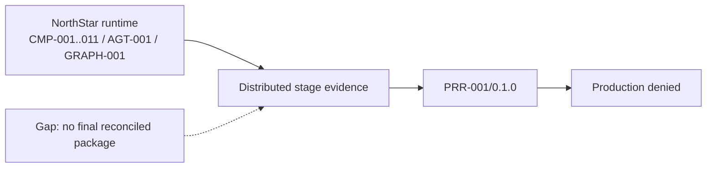
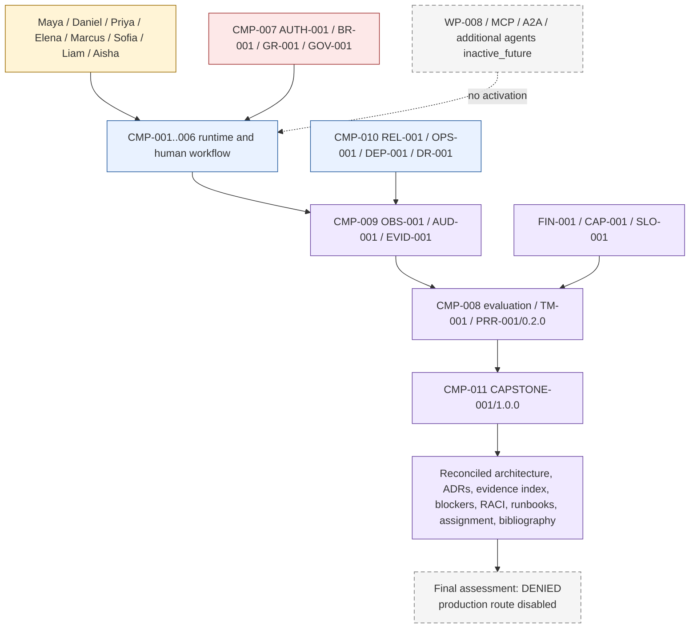

# Stage 11 — Final Capstone, Consolidated Architecture and Production-Readiness Assessment

**Stage identifier:** `S11`  
**Architecture version:** `1.18.0`  
**Repository version:** `1.18.0`  
**Handoff version:** `1.18.0`  
**Graph version:** `GRAPH-001/1.12.0` unchanged  
**Threat-model version:** `TM-001/1.4.0` retained; final consolidated summary added  
**Authorization model:** `AUTH-001/1.0.0` unchanged  
**Blast-radius model:** `BR-001/1.0.0` unchanged  
**Guardrail model:** `GR-001/1.0.0` unchanged  
**Governance model:** `GOV-001/1.0.0` unchanged  
**Control-plane profile:** `CP-001/0.1.0` unchanged; Stage 9D unresolved  
**Observability model:** `OBS-001/1.0.0` unchanged  
**Audit model:** `AUD-001/1.0.0` unchanged  
**Evidence-package model:** `EVID-001/1.0.0` unchanged  
**Reliability model:** `REL-001/1.0.0` unchanged  
**AgentOps profile:** `OPS-001/0.1.0` unchanged  
**Deployment profile:** `DEP-001/0.1.0` unchanged  
**Disaster-recovery profile:** `DR-001/0.2.0` proposed only  
**FinOps model:** `FIN-001/1.0.0` unchanged  
**Capacity model:** `CAP-001/1.0.0` unchanged  
**SLO profile:** `SLO-001/0.1.0` proposed only  
**Production-readiness profile:** `PRR-001/0.2.0` consolidated evidence and denial only  
**Capstone package:** `CAPSTONE-001/1.0.0`  
**Execution date:** 2026-08-01

> **Production Warning:** Stage 11 completes the tutorial capstone and consolidates the architecture package. It does not activate a production route, resolve missing enterprise evidence by declaration, certify NorthStar, or provide a legal conclusion. The final production-readiness decision is **DENIED**.

---

## 1. Context Carried Forward

NorthStar enters the final stage with an unusually complete local reference architecture and an intentionally incomplete production case. The accepted Stage 10C baseline is `1.17.0`. Exactly one active `AGT-001 Regulatory Impact Assessment Agent/1.1.0` operates inside `GRAPH-001/1.12.0`. It can propose bounded analysis, retrieval and tool actions, but it cannot issue authority, activate routes, mutate protected state directly, approve or finalize a regulatory disposition, create agents, or transfer unrestricted user credentials.

The stable ownership boundaries remain decisive:

- `CMP-003` is the sole owner of workflow routes, protected-state mutation, admission, cancellation, aggregation, termination and recovery.
- `CMP-005` is the only gateway to `TOOL-001`–`006`, including reconciliation and compensation.
- `CMP-006` and authenticated humans own review, approval and finalization.
- `CMP-007` is the sole authority issuer; receiver-side enforcement remains mandatory.
- `CMP-008` produces evaluation, threat and readiness evidence with no authority effect.
- `CMP-009` records minimized observability and audit evidence; the local chain is not enterprise WORM evidence.
- `CMP-010` hosts bounded runtime, reliability, deployment and recovery profiles; it has no production route.
- `CMP-011` governs the ten source-of-truth artefacts, versions, ADRs, risks, compatibility and this capstone package.

The architecture already contains grounded retrieval, typed tools, a bounded agent loop, a controlled graph, durable local checkpoints, a harness, specifications, case-scoped memory rules, human approval, formal single-versus-multi-agent analysis, interoperability profiles, bounded concurrency, workload and inference planning, deterministic and model-assisted evaluation, judge-bias testing, threat modelling, tokenized authorization, blast-radius controls, guardrails, governance, observability, audit, reliability, deployment overlays, FinOps, capacity and readiness evidence.

That breadth does not erase the unresolved handoff problem. Stage 8D and Stage 9D remain unexecuted. No byte-exact cumulative repository is mounted. Production load, live model quality, human calibration, approved SLOs, exercised RTO/RPO, enterprise audit durability, production provenance, provider billing reconciliation, multi-region recovery and jurisdiction-specific accountable approval remain absent. The Stage 10C handoff therefore requires a final package that makes the architecture coherent **without converting missing evidence into a positive claim**.

### 1.1 Reconstruction boundary

The supplied Stage 10C handoff is the authoritative current baseline. Prior stage packages and validation reports are used as supporting evidence, but the complete historical Git tree and all byte-exact registers are not available in one mounted repository. `ADR-151` preserves the safe interpretation: Stage 11 is a compatible `1.18.0` overlay. It reconciles known ranges and decisions, records unresolved merge provenance, and refuses to invent missing historical content.

### 1.2 Artefacts modified

Stage 11 updates all ten source-of-truth artefacts; adds `DATA-279`–`290`, `INT-239`–`250`, `ADR-149`–`156`, `RSK-494`–`510`, `ASM-151`–`155`, `ISS-206`–`214`, `TEST-1056`–`1088`, and `EVAL-273`–`284`; advances `PRR-001` to `0.2.0`; introduces `CAPSTONE-001/1.0.0`; adds the final diagrams, threat/evaluation summaries, RACI, runbook index, certification assignment, annotated bibliography and final release manifest. No new top-level component, agent, tool, protocol or runtime route is introduced.

---

## 2. Narrative Development

Priya Raman schedules the final architecture review. Maya Chen brings a completed local regulatory-assessment trace. It includes the source publication, authorized evidence, draft obligations, policy and control mappings, the agent’s bounded proposals, tool receipts, the human review request, the final human decision, cost events, capacity assumptions and the local audit chain.

Daniel Brooks asks the question that has been deferred through every demonstration: “Can I authorize production?”

Priya does not answer with a maturity score. She asks each owner to present evidence.

Sofia Alvarez shows that the evaluation architecture can detect deterministic failures and synthetic judge bias, but there is no live-model, representative human-calibration or Stage 8D deployment-gate evidence. Marcus Green shows a complete threat model and local authorization reference, but not enterprise identity, signed policy distribution, production secrets, KMS/HSM signing or a full control plane. Liam O’Connor shows retries, reconciliation, checkpoints, dead-letter handling, incident evidence and proposed recovery objectives, but no exercised multi-region recovery. Elena Petrov shows workload envelopes and unit-economics formulas, but not calibrated production demand or reconciled provider billing. Aisha Rahman confirms that RTO and RPO have owners but have not been approved or exercised.

Maya summarizes the operational truth: “The system can assist me safely in a controlled local workflow. It cannot yet prove that NorthStar can operate it in production.”

Daniel accepts a distinction that becomes the capstone’s central lesson:

1. **Architecture completeness** means the system’s responsibilities, boundaries, interfaces, state, controls and evidence are coherently designed.
2. **Reference implementation completeness** means important behaviour can be executed and tested locally.
3. **Production readiness** means accountable owners have approved and exercised the architecture against representative production evidence.

NorthStar has achieved the first, meaningful portions of the second, and not the third.

---

## 3. Problem Being Solved

The final stage solves six consolidation problems.

### 3.1 Architectural reconciliation

The playbook contains hundreds of stable identifiers and many cumulative overlays. The capstone must show that the final component, agent, graph, tool, data, interface, security, assurance and operations views still describe one system.

### 3.2 Evidence indexing

A final review needs more than a list of documents. It needs an index that states what each artefact proves, its version and digest, its owner, whether it is local, proposed, approved, exercised or missing, and whether it has any authority effect.

### 3.3 Blocker discipline

A weighted score can hide unacceptable gaps. NorthStar therefore needs conjunctive hard blockers: one unresolved authorization, audit, integrity, Stage 8D/9D, provenance, approved-SLO or exercised-DR blocker is sufficient to deny production.

### 3.4 Final topology decision

The architecture must not end with an ambiguous “multi-agent may be better.” It must compare the active one-agent design against the inactive alternative using the accepted evidence and state the selected topology.

### 3.5 Operating accountability

The capstone needs a RACI and runbook index showing that people—not the agent—own business decisions, security, governance, model risk, cost, reliability, incident response and recovery.

### 3.6 Educational closure

The final learning package must include a certification-style assignment and annotated bibliography while avoiding a false claim that completion of the assignment certifies a person, architecture or organization.

---

## 4. Requirements Introduced or Updated

| ID | Requirement | Primary implementation | Verification |
|---|---|---|---|
| `S11-FR-001` | Reconcile the `1.17.0` baseline into one final architecture package without renaming accepted identifiers. | `CAPSTONE-001`, `DATA-279/280`, `INT-239/240` | `TEST-1056`–`1063`, `EVAL-273` |
| `S11-FR-002` | Build a machine-readable decision-evidence index with explicit status and ownership. | `DATA-281`, `INT-241` | `TEST-1056`–`1063`, `EVAL-274` |
| `S11-FR-003` | Model production blockers independently of an aggregate score. | `DATA-282`, `INT-242`, `ADR-152` | `TEST-1064`–`1071`, `EVAL-275` |
| `S11-FR-004` | Produce a final readiness assessment that cannot activate production. | `DATA-283`, `INT-243`, `PRR-001/0.2.0` | `TEST-1064`–`1071`, `EVAL-276` |
| `S11-FR-005` | Preserve exactly one active `AGT-001` and compare it with the inactive multi-agent alternative. | `DATA-284`, `INT-244`, `ADR-150` | `TEST-1072`–`1078`, `EVAL-277` |
| `S11-FR-006` | Consolidate the final cumulative, trust-boundary, plane and readiness-sequence diagrams. | Mermaid sources | `TEST-1081`, `EVAL-279` |
| `S11-FR-007` | Produce a final component and agent catalogue without adding a top-level component or tool. | source-of-truth artefacts | `TEST-1080`–`1083` |
| `S11-FR-008` | Consolidate the threat model and explicitly separate current from inactive-future attack surfaces. | final threat summary | `EVAL-280` |
| `S11-FR-009` | Consolidate evaluation evidence and state which results are synthetic, local, advisory or production-insufficient. | final evaluation summary | `EVAL-281` |
| `S11-FR-010` | Define human accountability with a RACI in which no agent is accountable. | `DATA-285`, `INT-245` | `TEST-1086`, `EVAL-278` |
| `S11-FR-011` | Index the operating, incident, audit, reliability, capacity, budget and recovery runbooks. | `DATA-286`, `INT-246` | `EVAL-282` |
| `S11-FR-012` | Bind a local final release manifest and checksums without claiming enterprise signing. | `DATA-287`, `INT-247`, `ADR-155` | `TEST-1084`–`1085` |
| `S11-FR-013` | Provide a certification-style architecture assignment and grading rubric. | `DATA-288/289`, `INT-248` | `EVAL-283` |
| `S11-FR-014` | Provide an annotated bibliography based primarily on current official sources. | `DATA-290`, `INT-249` | `EVAL-284` |
| `S11-FR-015` | Preserve all Stage 10B reliability, audit, authority, reconciliation and protected-write invariants. | validators/tests | `TEST-1079`–`1088` |
| `S11-FR-016` | Keep Stage 8D and Stage 9D explicit and unresolved. | blockers and issues | `TEST-1088`, `EVAL-275` |
| `S11-FR-017` | Stop after Stage 11 and convert unresolved work into an implementation backlog. | `ADR-156`, final handoff | consistency audit |
| `S11-FR-018` | Provide a runnable, provider-neutral local capstone validator and final assessment demo. | Python package and scripts | 33 Stage 11 tests, 12 gates |

### Non-functional requirements

- Every new object and interface has `authority_effect: none`.
- The final evaluator never sets `production_route_enabled=true`.
- Hard blockers are conjunctive and non-compensable.
- The capstone does not mutate `DATA-106` or any protected business state.
- The capstone does not invoke `TOOL-001`–`006` and `TOOL-007` is not introduced.
- The architecture remains provider-neutral and does not invent production benchmarks, vendor prices, certification or legal conclusions.
- Local SHA-256 checksums detect package drift only; they are not signatures or trusted timestamps.

---

## 5. Conceptual Explanation

### 5.1 What a capstone architecture package is

In plain language, a capstone package is the final organized proof of what was designed, why it was designed, how it was tested, who owns it and what still prevents deployment.

Technically, `CAPSTONE-001/1.0.0` is a versioned, immutable-at-release collection of references to architecture views, schemas, interfaces, ADRs, threat records, evaluation results, cost and capacity evidence, operational runbooks, RACI records, risks, assumptions, issues, blockers and checksums. It does not duplicate all source content into a single giant object. It provides a controlled index and consistency result over the source-of-truth artefacts.

### 5.2 Architecture evidence versus production evidence

Architecture evidence answers questions such as:

- Are responsibilities unambiguous?
- Are state owners and security boundaries defined?
- Are tools typed and gateway-controlled?
- Are human decisions external to the agent?
- Are failures, retries, audit and recovery designed?
- Are evaluation and cost formulas defined?

Production evidence answers different questions:

- Does the chosen model meet representative quality thresholds?
- Does the service meet approved SLOs under real load and failure?
- Are RTO/RPO approved and demonstrated?
- Can audit evidence survive the required retention period and adversarial conditions?
- Are identity, policy distribution, keys, provenance and deployment admission implemented in the enterprise environment?
- Are costs reconciled to provider invoices and business outcomes?
- Have accountable legal, compliance, security and business owners approved the deployment?

The first cannot substitute for the second.

### 5.3 Final readiness as a safety case

The final assessment is closer to a safety case than a checklist. Each material claim must link to evidence. Missing evidence is not interpreted as success. Proposed and local-only evidence remains insufficient for a production claim. The final decision is explainable because each blocker records its owner, rationale and required evidence.

### 5.4 Why a single score is rejected

A score of 92/100 can still hide a missing authorization boundary. A positive cost forecast can still hide an unexercised recovery plan. High average accuracy can still hide a critical permission leak. NorthStar therefore uses two layers:

1. **Hard blockers:** authorization, policy, security, audit, integrity, provenance, Stage 8D/9D, approved service/recovery targets and required accountable approval.
2. **Soft gaps:** optimization or completeness items that may shape a remediation plan but cannot override a hard failure.

### 5.5 Final single-agent versus multi-agent conclusion

A multi-agent design is justified when a specialist is an independently governed actor with a distinct identity, authority, lifecycle, fault domain, data boundary or independently measured value. NorthStar’s current tasks remain one regulated case workflow with shared state, shared authority, one tool gateway, one human-approval boundary and primarily controlled graph transitions.

The selected design is therefore not “one broad prompt.” It is one bounded agent operating through specialized graph nodes, task profiles, deterministic validators and external human authority. This preserves specialization without introducing delegation and handoff risk that has not shown representative value.

---

## 6. When This Capability Is Required

A consolidated capstone is required before an architecture board, model-risk committee, security review, SRE production review, financial approval or regulated change process must decide whether a system may advance. It is especially necessary when:

- the system has accumulated many stages, versions and overlays;
- multiple assurance disciplines own different evidence;
- some evidence is local, proposed or synthetic;
- production activation must remain separate from assessment;
- a multi-agent alternative has been discussed but not justified;
- reviewers need a reproducible blocker and remediation view;
- the organization needs a final teaching and handoff package.

---

## 7. When It Is Not Required

A large capstone package is unnecessary for a disposable, non-sensitive experiment that has no external action, retained data, human dependency or production ambition. A small prototype may use a concise design note and test report.

The capstone is also harmful when it becomes ceremonial documentation assembled after decisions have already been made. Evidence must be produced by the architecture and operating process, not retrofitted to justify deployment.

---

## 8. Architecture Options

### Option A — Narrative-only final chapter

Summarize the architecture in prose and diagrams. This is readable but cannot deterministically reconcile versions, evidence, blockers or invariants.

### Option B — Weighted production-readiness score

Assign points across security, quality, operations and cost. This is easy to present but can hide a catastrophic hard failure and encourages false precision.

### Option C — Evidence-indexed, blocker-based capstone overlay

Create a machine-readable evidence index, explicit blocker catalogue, final non-authorizing assessment, RACI, runbook index, checksums and human-readable stage chapter. Preserve unresolved evidence and deny production. **Selected.**

### Option D — Implement missing Stage 8D/9D and production systems inside the capstone

Attempt to close all gaps by adding a full control plane, deployment gates and enterprise infrastructure now. This violates the stage boundary, invents unavailable enterprise evidence and would make the final stage unbounded.

### Option E — Activate the multi-agent architecture to make the capstone appear complete

Add specialist agents because the master playbook discusses multi-agent systems. This would confuse tutorial coverage with architectural need and expand attack, identity, communication and operational surfaces without representative evidence.

---

## 9. Decision Matrix

| Criterion | A Narrative only | B Weighted score | C Evidence/blocker overlay | D Implement all missing systems | E Activate multi-agent |
|---|---:|---:|---:|---:|---:|
| Preserves accepted boundaries | 4 | 3 | **5** | 1 | 1 |
| Machine-verifiable reconciliation | 1 | 3 | **5** | 4 | 2 |
| Prevents hard-gap masking | 2 | 1 | **5** | 3 | 2 |
| Fits final-stage scope | 4 | 4 | **5** | 1 | 1 |
| Honest about missing evidence | 3 | 2 | **5** | 1 | 2 |
| Supports accountable review | 3 | 3 | **5** | 4 | 3 |
| Security and authority clarity | 3 | 2 | **5** | 3 | 1 |
| Local runnable reference | 1 | 3 | **5** | 2 | 2 |
| Maintains one-agent decision | 5 | 5 | **5** | 4 | 0 |
| Overall | 26 | 26 | **45** | 23 | 14 |

**Architect’s Decision:** select Option C and record it in `ADR-149`, `ADR-151` and `ADR-152`.

---

## 10. Selected Architecture and Rationale

Stage 11 introduces no runtime business capability. It adds a governed assurance overlay implemented inside the existing responsibilities of `CMP-008` and `CMP-011`:

- `CMP-011` builds and versions the final package, reconciliation record, release manifest, RACI, runbook index and source-of-truth updates.
- `CMP-008` evaluates evidence status, topology alternatives and final blockers.
- `CMP-009` supplies observability and audit evidence references.
- `CMP-010` supplies reliability, deployment, capacity, SLO and DR evidence references.
- Humans retain all approval, risk acceptance and deployment authority.

`CAPSTONE-001` is not `CMP-012`; it is a governed artefact package. `PRR-001/0.2.0` remains an assessor, not an actuator.

The final assessment is:

```json
{
  "assessment_id": "PRA-FINAL-001",
  "decision": "denied",
  "production_route_enabled": false,
  "active_agent_count": 1,
  "selected_topology": "one_agent_specialized_graph_profiles",
  "authority_effect": "none"
}
```

The denial is the only evidence-supported result. It leaves NorthStar with a useful next action: a sequenced pre-production remediation backlog owned by accountable people.

---

## 11. Architecture Before the Change

Before Stage 11, version `1.17.0` contains the complete bounded runtime and the Stage 10C FinOps/capacity/readiness modules. The architecture can generate readiness evidence and deny production, but the evidence is distributed across stage packages and there is no final reconciled architecture, topology conclusion, RACI, runbook index, assignment or bibliography package.



---

## 12. Architecture After the Change



The runtime path is unchanged. The change is a final assurance and governance view that makes the absence of production evidence explicit.

---

## 13. Detailed Component Design

### 13.1 `CAPSTONE-001/1.0.0`

The package contains:

1. `DATA-279 ArtefactReconciliationRecord` — required, present, missing, duplicate and invalid-authority identifiers.
2. `DATA-280 ConsolidatedArchitecturePackage` — version references, diagrams and package scope.
3. `DATA-281 DecisionEvidenceIndex` — evidence title, status, source, owner and digest.
4. `DATA-282 ProductionBlocker` — severity, required evidence, owner and rationale.
5. `DATA-283 FinalProductionReadinessAssessment` — decision, hard blockers, soft gaps and permanent route-disabled flag.
6. `DATA-284 SingleVsMultiAgentComparison` — evidence status, topology scores and selected architecture.
7. `DATA-285 RACIRecord` — human ownership with no agent accountability.
8. `DATA-286 RunbookIndex` — operational scenario, owner and inherited/new path.
9. `DATA-287 FinalReleaseManifest` — package files and local SHA-256 digests.
10. `DATA-288 CertificationAssignment` and `DATA-289 CertificationRubric` — educational assessment.
11. `DATA-290 AnnotatedReferenceEntry` — source type, status, verification date and relevance.

### 13.2 Evidence status model

The final package uses six statuses:

- `present` — evidence is available and production-sufficient for the stated claim.
- `local_only` — useful executable reference, but not representative enterprise evidence.
- `proposed` — designed but not accountably approved.
- `unapproved` — measured or documented but awaiting accountable decision.
- `unexercised` — approved or proposed objective without successful recovery exercise.
- `missing` — no acceptable evidence is available.

Only `present` satisfies a production blocker.

### 13.3 Final blocker catalogue

| Blocker | Evidence status | Owner | Result |
|---|---|---|---|
| Stage 8D deployment metrics, regression baselines and promotion gates | Missing | Sofia | Hard deny |
| Stage 9D full enterprise control plane | Missing | Priya | Hard deny |
| Byte-exact historical merge and signed provenance | Missing | Priya | Hard deny |
| Representative production load and capacity test | Local only | Liam | Hard deny |
| Approved SLO and error-budget policy | Proposed | Daniel | Hard deny |
| Approved and exercised RTO/RPO | Unexercised | Aisha | Hard deny |
| Enterprise WORM/KMS/HSM/trusted-time audit durability | Local only | Liam | Hard deny |
| Signed production provenance and deployment admission | Missing | Elena | Hard deny |
| Live-model and human-calibration quality evidence | Missing | Sofia | Hard deny |
| Live provider billing/FOCUS reconciliation | Missing | Elena | Soft gap; required for financial approval |
| Enterprise backup and multi-region failover exercise | Missing | Liam | Hard deny |
| Jurisdiction-specific legal/compliance approval | Missing | Daniel | Hard deny |

### 13.4 Final component responsibilities

| Component | Final responsibility |
|---|---|
| `CMP-001 Analyst Experience Portal` | Presents source, evidence, uncertainty, agent drafts and human-review status; never presents AI output as final authority. |
| `CMP-002 Regulatory Intake Boundary` | Validates source envelopes and keeps external content untrusted. |
| `CMP-003 Case and Workflow Orchestration Boundary` | Sole route, protected-state, admission, cancellation, aggregation, termination and recovery owner. |
| `CMP-004 Knowledge and Evidence Access Boundary` | Access-aware retrieval, provenance, citation and freshness. |
| `CMP-005 Enterprise Integration Boundary` | Only gateway to `TOOL-001`–`006`; typed validation, authorization, idempotency, reconciliation and compensation. |
| `CMP-006 Human Review and Approval Boundary` | Transaction-bound human review, separation of duties, approval and finalization. |
| `CMP-007 Identity, Authorization and Policy Boundary` | Sole authority issuer; receiver-side policy, blast radius and guardrail decisions. |
| `CMP-008 Evaluation and Assurance Boundary` | Evaluation, judge-bias, threat, topology and readiness evidence; no authority. |
| `CMP-009 Observability and Audit Boundary` | Correlated telemetry, mandatory protected-effect audit and evidence packages. |
| `CMP-010 Runtime and Deployment Boundary` | Bounded runtime, reliability, release, environment, capacity, SLO and DR profiles; production disabled. |
| `CMP-011 Source-of-Truth Governance Pack` | Versions, ADRs, traceability, risks, compatibility and `CAPSTONE-001`. |

### 13.5 Agent catalogue conclusion

`AGT-001 Regulatory Impact Assessment Agent/1.1.0` remains the only active agent. It is a bounded probabilistic worker inside a deterministic and human-governed workflow. No evaluator, judge, threat model, guardrail engine, readiness evaluator, FinOps calculator, capacity planner or control-plane process is an agent.

---

## 14. Data, State and Interface Design

### 14.1 New interfaces

| Interface | Contract |
|---|---|
| `INT-239 ReconcileArchitectureArtefacts` | Compare required and supplied artefact/evidence IDs; report missing, duplicates and invalid authority. |
| `INT-240 BuildConsolidatedArchitecturePackage` | Bind accepted versions, diagrams and scope into `DATA-280`. |
| `INT-241 BuildDecisionEvidenceIndex` | Normalize evidence status and source references. |
| `INT-242 EvaluateProductionBlockers` | Resolve blocker status without a weighted override. |
| `INT-243 AssessFinalProductionReadiness` | Emit `denied` or `conditional_preproduction_only`; always keep route disabled. |
| `INT-244 CompareAgentTopologies` | Compare active single-agent design with inactive future alternative. |
| `INT-245 BuildRACI` | Produce human accountability records. |
| `INT-246 BuildRunbookIndex` | Index operating scenarios and owners. |
| `INT-247 BuildFinalReleaseManifest` | Hash package files locally. |
| `INT-248 BuildCertificationAssignment` | Produce educational assignment and rubric. |
| `INT-249 BuildAnnotatedBibliography` | Record current primary references and status. |
| `INT-250 GetCapstoneStatus` | Return package version, final decision, blocker count, agent count and route-disabled status. |

None of these interfaces is an agent tool. None can issue or widen authority, call `TOOL-001`–`006`, mutate `DATA-106`, approve/finalize, change the one-protected-write limit or activate production.

### 14.2 State ownership

The capstone stores no new business-case state. It reads references and creates governance artefacts. `DATA-106` remains owned by `CMP-003`. Human decisions remain in the human-review domain. Authorization use/replay state remains a security-control concern. The final assessment is advisory evidence.

---

## 15. Implementation

The implementation is a standard-library Python package with JSON configuration and JSON Schemas.

### 15.1 Reconciliation

```python
result = reconcile_evidence(items, required_ids)
assert result.invalid_authority_ids == ()
assert result.duplicate_ids == ()
```

Reconciliation distinguishes “the evidence record exists” from “the evidence is production-sufficient.” An item with `status=proposed` is present in the index but does not close a blocker.

### 15.2 Final readiness assessment

```python
assessment = FinalReadinessAssessor().evaluate(items, blockers)
assert assessment.decision == "denied"
assert assessment.production_route_enabled is False
assert assessment.active_agent_count == 1
```

The evaluator contains no route writer. Even a hypothetical evidence-complete result is `conditional_preproduction_only`; a separately implemented and authorized deployment control is still required.

### 15.3 Topology comparison

```python
comparison = compare_topologies(
    measured_quality_gain=None,
    handoff_error_rate=None,
    representative_evidence=False,
    independent_authority_boundary=False,
    independent_fault_domain=False,
)
assert comparison.selected_topology == "one_agent_specialized_graph_profiles"
```

The comparison can identify future review triggers but cannot allocate or activate another agent.

### 15.4 Execution

```bash
cd northstar-agentic-compliance-stage11-capstone
python -m pip install -e '.[dev]'
pytest -q
python scripts/run_stage11_demo.py
python scripts/validate_stage11.py
python scripts/run_stage11_evaluation_gates.py
python scripts/consistency_audit_stage11.py
```

Target: Python `>=3.12,<3.14`. The delivered package was executed with the available Python environment and no network dependency.

---

## 16. Code and Repository Changes

### Files added

```text
northstar-agentic-compliance-stage11-capstone/
├── .github/workflows/stage11.yml
├── config/capstone/
│   ├── evidence-index.json
│   ├── final-assessment.json
│   ├── raci.json
│   └── topology-comparison.json
├── docs/
│   ├── adr/ADR-149-156.md
│   ├── architecture/diagrams/*.mmd
│   ├── references/stage11-annotated-bibliography.md
│   ├── runbooks/final-operating-runbook-index.md
│   ├── source-of-truth/00..09-*.md
│   ├── stages/NorthStar-Stage-11-Final-Capstone.md
│   ├── certification-assignment.md
│   ├── evaluation-final-summary.md
│   └── threat-model-final-summary.md
├── reports/
│   └── stage11-release-manifest.json
├── schemas/DATA-279..290.schema.json
├── scripts/
│   ├── run_stage11_demo.py
│   ├── validate_stage11.py
│   ├── run_stage11_evaluation_gates.py
│   └── consistency_audit_stage11.py
├── src/northstar_compliance/capstone/
│   ├── models.py
│   ├── reconcile.py
│   ├── assessor.py
│   └── topology.py
├── tests/{unit,integration,security}/
├── .env.example
├── Stage11-SHA256SUMS.txt
├── README.md
└── pyproject.toml
```

### Files modified

The package supplies `1.18.0` overlays for all ten source-of-truth files. A byte-exact merge into the historical repository remains open.

### Files retired

None. `WP-008`, MCP/A2A peers and additional-agent designs remain inactive, not deleted.

### Compatibility notes

A future enterprise merge must retain all accepted identifiers, imports, graph/state owners, tool contracts, security and audit invariants. It must not treat `CAPSTONE-001` as a route controller or change `production_route_enabled=false` without a new accountable programme and ADR.

---

## 17. Security and Governance Implications

### 17.1 Security benefits

- The final package makes trust boundaries and authority owners inspectable.
- Missing enterprise security evidence remains visible rather than hidden in prose.
- The topology decision avoids adding unneeded identities, delegation tokens, handoff channels and message attack surfaces.
- Final evidence objects are metadata-minimized and contain no raw prompts, documents, secrets or hidden chain-of-thought.
- Human review remains bound to authenticated actors, exact artefacts and separation-of-duties rules.

### 17.2 Residual security gaps

The final package does not supply enterprise IAM, workload federation, production KMS/HSM, signed policy bundles, trusted timestamps, WORM storage, hardened admission, multi-region key recovery, production secret rotation or adaptive red-team evidence. These are hard blockers, not “future enhancements.”

### 17.3 Governance interpretation

`CAPSTONE-001` supports governance but does not establish compliance with NIST, ISO, SOC 2, privacy law or AI regulation. The mappings are design aids. Legal and compliance owners must determine applicability and evidence sufficiency for each jurisdiction.

### 17.4 Current external guidance

The final package aligns conceptually with NIST AI RMF’s Govern–Map–Measure–Manage structure, NIST’s Generative AI Profile, ISO/IEC 42001 management-system principles, ISO/IEC 23894 AI risk guidance, OWASP agentic-security guidance, OAuth 2.0 security BCP, OpenTelemetry semantic conventions and FinOps FOCUS. These sources do not certify NorthStar and several technical conventions continue to evolve.

---

## 18. Performance, Concurrency and Cost Implications

Stage 11 adds no model or tool calls to the business workflow. Its local deterministic checks are off the critical path and suitable for build/review gates.

The selected one-agent topology avoids per-agent instruction context, delegation envelopes, identity and token issuance, message storage, handoff validation, supervisor aggregation, distributed termination and duplicated evaluation. That does not prove one agent is universally faster or cheaper. It means the current NorthStar evidence does not justify paying those costs.

The production cost case remains incomplete because illustrative CAD rate cards are not reconciled provider bills, and workload profiles are not calibrated production demand. The final FinOps recommendation is to preserve cost per successful completed task—including retries, failed runs and human review—not optimize tokens in isolation.

The one concurrent protected-write limit remains. Read-only retrieval and evaluation work may use bounded concurrency, but no capstone output changes concurrency policy.

---

## 19. Evaluation and Test Cases

### 19.1 Stage 11 executable tests

- `TEST-1056`–`1063`: evidence reconciliation, missing/duplicate detection and no-authority invariants.
- `TEST-1064`–`1071`: hard/soft blocker semantics, permanent route denial and one-agent preservation.
- `TEST-1072`–`1078`: topology comparison, evidence triggers, handoff penalty and non-activation.
- `TEST-1079`–`1088`: schema, RACI, tool/route, Stage 8D/9D, package and compatibility invariants.

The delivered overlay executes **33 pytest cases**. It also runs the demo, 12 evaluation gates, structural validation, compilation and the consistency audit.

### 19.2 Inherited evidence interpretation

Prior local stages reported successful deterministic tests, synthetic evaluations, bias probes, threat cases, authorization checks, guardrail checks, observability/audit checks, reliability experiments and FinOps/capacity checks. Stage 11 references those reports; it does not claim to have re-executed every historical test because the byte-exact cumulative repository is not mounted.

### 19.3 Final evaluation conclusion

The architecture has strong local evidence for boundary preservation and failure denial. It lacks representative evidence for live model quality, human calibration, production latency and throughput, provider cost, enterprise identity/control-plane operation, long-term audit durability and disaster recovery. Consequently, local pass counts cannot support a production claim.

---

## 20. Failure Scenarios and Recovery

### Failure 1 — A reviewer changes `production_route_enabled` in configuration

**Detection:** security test and validator require `false`; release digest changes.  
**Containment:** validation fails; no deployment interface exists.  
**Recovery:** revert the unauthorized change, create an incident record and review repository permissions.  
**Evidence:** manifest diff, test failure, actor identity and incident record.

### Failure 2 — A weighted score is introduced and masks a hard blocker

**Detection:** schema and code review identify a score-based override; `ADR-152` conformance fails.  
**Containment:** assessment remains denied.  
**Recovery:** restore conjunctive blocker evaluation and add a regression test.  
**Governance:** Sofia owns evaluation policy; Daniel cannot waive security or audit blockers through a business score.

### Failure 3 — The package lists two active agents

**Detection:** inventory and topology tests fail.  
**Containment:** no additional agent route or identity exists.  
**Recovery:** classify the change as a proposed architecture revision requiring a new requirement, threat/privacy review, ADR, schemas, implementation and representative evaluation.

### Failure 4 — Evidence is present but only proposed

**Detection:** the index status is `proposed`; the blocker remains unresolved.  
**Containment:** production stays denied.  
**Recovery:** obtain accountable approval and, where required, exercise evidence; create a new immutable evidence version.

### Failure 5 — Historical artefacts cannot be reconciled byte-exactly

**Detection:** `DATA-279` records the missing cumulative merge and `ISS-206` remains open.  
**Containment:** no “complete repository history” claim is made.  
**Recovery:** restore the authoritative Git history, verify hashes and rerun the full cumulative suite.

### Failure 6 — Multi-agent enthusiasm overrides current evidence

**Detection:** `INT-244` shows no hard independent boundary or representative measured value.  
**Containment:** `WP-008` stays `inactive_future`.  
**Recovery:** define a matched, repeated-trial experiment and independent authority/fault-domain requirements before reconsideration.

### Failure 7 — A legal stakeholder interprets the package as certification

**Detection:** review identifies prohibited language.  
**Containment:** the stage, assignment and bibliography carry explicit non-certification statements.  
**Recovery:** correct the claim, involve legal/compliance reviewers and record the communication incident.

---

## 21. Architecture Decision Records

`ADR-001`–`148` remain accepted. Stage 11 adds:

- `ADR-149`: capstone is a non-authorizing evidence package.
- `ADR-150`: retain one active agent with specialized graph work units.
- `ADR-151`: reconcile through an explicit compatible overlay; keep historical-merge blocker open.
- `ADR-152`: use conjunctive hard blockers rather than a weighted readiness score.
- `ADR-153`: certification assignment is educational only.
- `ADR-154`: use current primary sources and mark evolving guidance.
- `ADR-155`: bind local checksums without claiming enterprise provenance.
- `ADR-156`: close the tutorial and carry unresolved work into an implementation backlog.

---

## 22. Requirements Traceability Update

| Requirement family | Components | Data/interfaces | Controls/ADRs | Tests/evaluations |
|---|---|---|---|---|
| Capstone reconciliation | `CMP-008`, `CMP-011` | `DATA-279`–`281`, `INT-239`–`241` | `ADR-149`, `151` | `TEST-1056`–`1063`, `EVAL-273/274` |
| Final readiness/blockers | `CMP-008`, `CMP-010`, `CMP-011` | `DATA-282/283`, `INT-242/243` | `ADR-152` | `TEST-1064`–`1071`, `EVAL-275/276` |
| Topology conclusion | `CMP-003`, `CMP-007`, `CMP-008` | `DATA-284`, `INT-244` | `ADR-150` | `TEST-1072`–`1078`, `EVAL-277` |
| Accountability/runbooks | `CMP-006`–`011` | `DATA-285/286`, `INT-245/246` | human authority invariants | `TEST-1086`, `EVAL-278/282` |
| Release/package integrity | `CMP-011` | `DATA-287`, `INT-247` | `ADR-155` | `TEST-1084/1085` |
| Learning closure | `CMP-011` | `DATA-288`–`290`, `INT-248/249` | `ADR-153/154/156` | `EVAL-283/284` |

All inherited requirements retain their accepted mappings. No Stage 11 requirement alters the ownership of a protected effect.

---

## 23. Stage Outcome

NorthStar now has a final, coherent architecture package that:

- shows the complete cumulative logical architecture and trust boundaries;
- preserves all accepted component, agent, tool, state and authority ownership;
- indexes the available evidence and its production sufficiency;
- makes unresolved blockers explicit and owner-assigned;
- provides a deterministic final readiness assessment;
- concludes that the one-agent specialized-graph architecture remains the correct active design;
- consolidates the threat, evaluation, operating and governance views;
- provides a final RACI, runbook index, certification-style assignment and annotated bibliography;
- includes runnable code and tests proving that the capstone cannot enable production.

The final assessment is:

> **Architecture package:** complete as a tutorial and compatible consolidation overlay.  
> **Local reference implementation:** materially demonstrated across stages, with historical re-execution limitations.  
> **Production readiness:** **DENIED**.  
> **Production route:** disabled.  
> **Active topology:** exactly one `AGT-001` with specialized `GRAPH-001` work units.  
> **Certification:** not claimed.

### 23.1 Final single-agent versus multi-agent comparison

| Dimension | Active single-agent graph | Inactive multi-agent alternative | Final conclusion |
|---|---|---|---|
| Business state | One case state and owner | Requires distributed or mediated state | Single fits current workflow |
| Authority | One agent execution under one attenuated grant model | Multiple identities and delegated scopes | Added surface not justified |
| Human approval | One external review boundary | Same boundary plus agent handoffs | No benefit demonstrated |
| Tool access | One gateway, profile-narrowed tools | Per-agent scopes and more token exchanges | Single simpler and safer |
| Quality evidence | Local/synthetic stage evidence | No representative multi-agent gain | No promotion basis |
| Handoffs | None between agents | At least six candidate handoff edges | Additional failure modes |
| Latency/cost | No coordination layer | Delegation, context, messages, aggregation | Added cost without measured value |
| Fault isolation | Graph nodes and bulkheads | Potential independent workers | No independent fault-domain need shown |
| Audit/debugging | One run/graph trace | Distributed traces and causation chains | Single easier now |
| Future option | Formal profiles and promotion gate | Can be implemented when triggers pass | Keep inactive, not discarded |

**Conclusion:** NorthStar should deploy neither topology to production yet. For continued controlled development and pre-production evidence gathering, retain the single-agent specialized-graph architecture. Reconsider multi-agent only after a hard independent boundary or representative repeated-trial benefit is demonstrated and all new security, reliability and governance controls are implemented.

### 23.2 Certification-style assignment

The final assignment asks the learner to review a changed NorthStar scenario, produce a complete evidence-backed architecture package, defend a single-versus-multi-agent decision, define threats and controls, design evaluation and production-readiness gates, and issue a justified readiness decision. The 100-point rubric grades architecture reasoning, traceability, security, evaluation, operations, economics and communication. It is an educational assessment, not an accredited certification.

---

## 24. Known Limitations

1. No byte-exact historical repository and register merge.
2. No full re-execution of every inherited test in one environment.
3. Stage 8D metrics, regression baselines, champion–challenger and deployment-gate work remains unresolved.
4. Stage 9D full enterprise control plane remains unresolved.
5. No selected and approved production model/provider/route.
6. No live model or independent human calibration evidence.
7. No representative production workload, load, latency, throughput or saturation test.
8. No approved production SLO or error-budget policy.
9. No approved and exercised RTO/RPO, enterprise backup or multi-region failover.
10. No enterprise WORM, KMS/HSM, trusted timestamp or legal-admissibility proof.
11. No signed production provenance, admission or software-supply-chain attestation.
12. No live provider billing, invoice reconciliation or FOCUS adapter.
13. No jurisdiction-specific legal, privacy or regulatory approval.
14. No production security red team, penetration test or adaptive agentic attack exercise.
15. No certification or production-readiness claim.
16. Mermaid source is structurally validated in the local package; rendered publication review remains an editorial step.

---

## 25. Narrative Closure and Implementation Backlog

There is no next tutorial stage. The architectural story closes with an accountable refusal to confuse a well-designed reference with a production service.

Daniel authorizes a pre-production remediation programme—not production. Sofia owns Stage 8D evidence and model-risk thresholds. Priya owns the enterprise control-plane and repository reconciliation architecture. Marcus owns production identity, signing, secrets and security testing. Liam owns representative load, operational SLO measurement, audit durability and recovery exercises. Elena owns provider integration, deployment provenance and billing reconciliation. Aisha and Daniel own business impact, SLO/RTO/RPO approval and final risk acceptance. Maya remains the primary user and supplies representative workflow and human-effort evidence.

The agent owns none of those decisions.

The playbook’s final architectural lesson is therefore not “add more autonomy.” It is: use the least autonomous design that can produce useful evidence, keep authority external, and promote only when representative evidence and accountable owners support the claim.

---

## 26. Updated Source-of-Truth Artefacts

All ten controlled overlays advance to `1.18.0`:

1. `00-Project-Constitution.md` — final-stage scope, capstone and non-certification invariants.
2. `01-Business-and-User-Story-Baseline.md` — final review narrative and denied production outcome.
3. `02-Requirements-Register.md` — `S11-FR-001`–`018` and final traceability.
4. `03-Architecture-Baseline.md` — cumulative architecture and `CAPSTONE-001/1.0.0`; runtime graph unchanged.
5. `04-Component-and-Agent-Catalogue.md` — final `CMP-001`–`011` responsibilities and exactly one active `AGT-001`.
6. `05-Data-and-Schema-Register.md` — `DATA-279`–`290`, `INT-239`–`250`; every new object is non-authorizing.
7. `06-ADR-Register.md` — `ADR-149`–`156`.
8. `07-Repository-Manifest.md` — final overlay tree, commands and compatibility.
9. `08-Risk-Assumption-and-Issue-Register.md` — `RSK-494`–`510`, `ASM-151`–`155`, `ISS-206`–`214`.
10. `09-Stage-Handoff-Pack.md` — final reusable state and implementation backlog; no continuation stage.

---

# 27. Stage Handoff Pack

## A. Stage completed

- Stage identifier: `S11`
- Stage title: Final Capstone, Consolidated Architecture and Production-Readiness Assessment
- Architecture version: `1.18.0`
- Repository version: `1.18.0`
- Handoff version: `1.18.0`
- Graph version: `GRAPH-001/1.12.0` unchanged
- Threat model: `TM-001/1.4.0` retained with consolidated summary
- `AUTH-001/1.0.0`, `BR-001/1.0.0`, `GR-001/1.0.0`, `GOV-001/1.0.0` unchanged
- `CP-001/0.1.0` unchanged; Stage 9D unresolved
- `OBS-001/1.0.0`, `AUD-001/1.0.0`, `EVID-001/1.0.0`, `REL-001/1.0.0` unchanged
- `OPS-001/0.1.0`, `DEP-001/0.1.0`, `DR-001/0.2.0` unchanged
- `FIN-001/1.0.0`, `CAP-001/1.0.0`, `SLO-001/0.1.0` unchanged
- `PRR-001/0.2.0`; `CAPSTONE-001/1.0.0`
- Completion date: 2026-08-01
- Final status: tutorial capstone complete; compatible consolidation overlay delivered; production-readiness decision denied; production route disabled; no certification claim.

## B. Capabilities now available

1. Final reconciled architecture and evidence index.
2. Deterministic blocker-based production-readiness assessment.
3. Final single-versus-multi-agent comparison and selected topology.
4. Consolidated threat, evaluation, RACI and runbook views.
5. Local final release manifest and checksums.
6. Certification-style educational assignment and rubric.
7. Annotated primary-source bibliography.
8. Machine-verifiable proof that the capstone cannot activate production.

## C. Accepted architecture decisions

Preserve `ADR-001`–`148`. Add `ADR-149`–`156` as summarized in Section 21.

## D. Current component inventory

Preserve `CMP-001`–`011`; no new top-level component. `CMP-008` and `CMP-011` own final assurance and package assembly within their existing boundaries.

## E. Current agent inventory

- `AGT-001 Regulatory Impact Assessment Agent/1.1.0` is the only active agent.
- Selected topology: `one_agent_specialized_graph_profiles`.
- `WP-008`, MCP/A2A peers and additional agents remain `inactive_future`.
- No capstone, evaluation, threat, policy, FinOps, capacity or readiness module is an agent.

## F. Current data and state objects

- Preserve `DATA-001`–`278`.
- Add `DATA-279`–`290`: ArtefactReconciliationRecord, ConsolidatedArchitecturePackage, DecisionEvidenceIndex, ProductionBlocker, FinalProductionReadinessAssessment, SingleVsMultiAgentComparison, RACIRecord, RunbookIndex, FinalReleaseManifest, CertificationAssignment, CertificationRubric and AnnotatedReferenceEntry.
- Every new schema requires `authority_effect: none`.

## G. Current interfaces and tools

- Preserve `INT-001`–`238` and `TOOL-001`–`006`.
- Add `INT-239`–`250` as listed in Section 14.
- `TOOL-007` is not introduced.
- New interfaces cannot issue authority, approve/finalize, invoke business tools, mutate `DATA-106`, change protected-write concurrency, allocate an agent or activate production.

## H. Repository state

```text
northstar-agentic-compliance-stage11-capstone/
├── .github/workflows/stage11.yml
├── config/capstone/
├── docs/{adr,architecture/diagrams,references,runbooks,source-of-truth,stages}/
├── reports/
│   └── stage11-release-manifest.json
├── schemas/DATA-279..290.schema.json
├── scripts/
├── src/northstar_compliance/capstone/
├── tests/{unit,integration,security}/
├── README.md
└── pyproject.toml
```

Important entry points: `run_stage11_demo.py`, `validate_stage11.py`, `run_stage11_evaluation_gates.py`, `consistency_audit_stage11.py`.

## I. Tests completed

- `TEST-1056`–`1088`: 33 Stage 11 pytest cases passed.
- `EVAL-273`–`284`: 12/12 capstone gates passed.
- Demo, structural validation, Python compilation and consistency audit passed.
- Historical test results are referenced but not all re-executed in one cumulative tree.

## J. Known limitations

All limitations in Section 24 remain. The most material are unresolved Stage 8D/9D, historical merge, live quality/load/cost evidence, approved SLO and exercised DR, enterprise audit/provenance and legal/compliance approval.

## K. Open risks, assumptions and issues

Preserve inherited active items. Add `RSK-494`–`510`, `ASM-151`–`155`, `ISS-206`–`214` as recorded in the final risk register.

## L. Compatibility constraints

1. Preserve NorthStar, all eight personas, `US-001`–`012`, `CMP-001`–`011`, exactly one active `AGT-001`, `GRAPH-001/1.12.0`, `DATA-001`–`290`, `INT-001`–`250`, `TOOL-001`–`006` and `ADR-001`–`156`.
2. Preserve all authority, human approval, gateway, protected-state, retry, reconciliation, audit, checkpoint, DLQ, compensation, degraded-mode, cost, capacity and control-gate invariants.
3. All capstone and readiness outputs remain `authority_effect: none`.
4. Production route remains disabled until a separate accountable implementation programme resolves every hard blocker and supplies deployment authority.
5. A multi-agent route requires a new requirement, ADR, threat/privacy review, identities, delegation/handoff contracts, implementation and representative evaluation.
6. Do not claim certification, legal compliance, byte-exact historical completeness or production readiness from this package.

## M. Required input for implementation remediation

Use the `1.18.0` overlays, all accepted model versions and ADRs, the final blocker catalogue, RACI, runbook index, evidence index and checksums. Restore the byte-exact historical repository before claiming cumulative execution. Resolve Stage 8D and Stage 9D as separately chartered work. Obtain representative production, human and enterprise evidence.

## N. Final architectural problem statement

The tutorial is complete. The remaining problem is organizational implementation and evidence: NorthStar must build and operate the missing enterprise controls, run representative tests, obtain accountable approvals and then perform a new production-readiness review. Documentation alone cannot close those blockers.

## O. Final instruction

> Stop. Do not generate a later playbook stage. Use the Stage 11 blocker catalogue as the controlled pre-production remediation backlog. Any future production or multi-agent proposal must begin with a new charter, change-impact analysis and ADR; it must not reinterpret this capstone denial as approval.

---

## Stage Consistency Audit

**Result: Passed with recorded exceptions.**

Validated in the delivered overlay:

- narrative begins with the Stage 10C consolidation and readiness gap;
- architecture, repository and handoff versions are `1.18.0`;
- `GRAPH-001/1.12.0` and all accepted model versions are preserved;
- exactly one active `AGT-001` remains;
- `CMP-003`, `CMP-005`, `CMP-006` and `CMP-007` authority boundaries remain;
- `DATA-279`–`290`, `INT-239`–`250`, code, schemas, diagrams, ADRs and tests agree;
- every new schema and result has `authority_effect: none`;
- production route remains disabled and cannot be activated by the evaluator;
- `TOOL-007` is not introduced;
- Stage 8D and Stage 9D remain explicit hard blockers;
- `WP-008`, MCP/A2A and additional agents remain inactive;
- final single-agent selection matches the accepted evidence;
- 33 Stage 11 tests, 12 evaluation gates, demo, validation, compilation and consistency audit execute successfully;
- no certification, legal compliance, enterprise audit durability, exercised DR or production-readiness claim is made.

Recorded exceptions: no byte-exact cumulative repository/history, no complete historical re-execution, no representative production or enterprise evidence, and publication rendering remains separate from static Mermaid validation.
