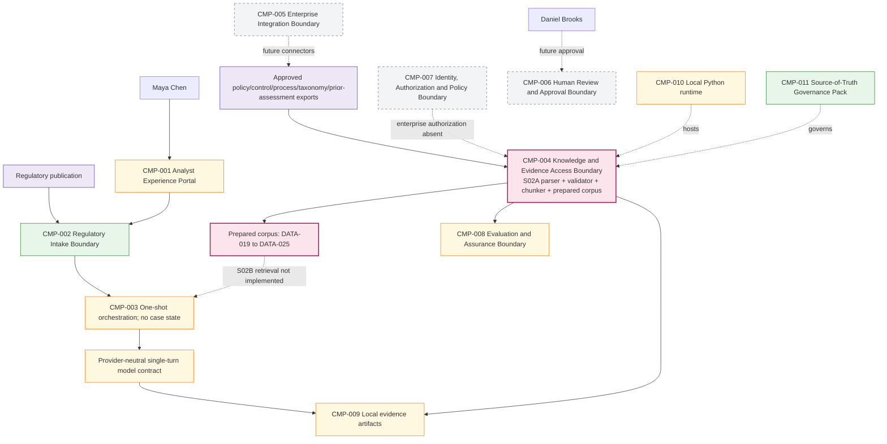

# 03 — Architecture Baseline

**Architecture version:** `0.3.0`  
**Maturity:** bounded assistant plus prepared knowledge corpus; non-agentic.

## 1. Preserved S01 architecture

- `CMP-001 Analyst Experience Portal`: partial local CLI.
- `CMP-002 Regulatory Intake Boundary`: implemented for bounded Stage 1 publication input.
- `CMP-003 Case and Workflow Orchestration Boundary`: partial one-shot flow; no case state.
- Provider-neutral single-turn model contract inside the existing application boundary.
- `CMP-008`: partial local tests/evaluations.
- `CMP-009`: partial local evidence artifacts.
- `CMP-010`: partial local Python runtime.
- `CMP-011`: implemented governance pack.

No RAG, agent, graph, tool, memory, case state, approval service, enterprise authorization or production audit runtime exists.

## 2. S02A change

`CMP-004 Knowledge and Evidence Access Boundary` changes from **planned** to **partial — preparation only**. It accepts approved local exports and creates an immutable prepared corpus. It has no query endpoint and is not connected to Stage 1 context assembly.

## 3. Cumulative logical architecture

The canonical Mermaid source is `docs/architecture/diagrams/cumulative-logical-architecture.mmd`.

## 4. Trust boundaries

1. **Untrusted content:** source document text, even when from an internal repository.
2. **Approved staging metadata:** source owners provide manifest metadata through a controlled process.
3. **Deterministic preparation boundary:** path, type, encoding, size, hash, access and chunk validation.
4. **Prepared corpus:** immutable tutorial artifact, not an enterprise record.
5. **Planned enterprise authorization:** `CMP-007` remains absent; local group strings are not authenticated claims.
6. **Planned retrieval boundary:** S02B must filter before exposing candidates or assembling model context.

## 5. Deployment view

S02A runs in one local Python process using the standard library. Source exports and output artifacts are local directories. There is no container, queue, shared service, object store, KMS, policy engine or multi-tenant isolation.

## 6. Architecture invariants

- Stage 1 summary/disposition semantics remain unchanged.
- Document content cannot set status, access, approval or execution.
- Missing access scope fails ingestion.
- Every chunk belongs to one immutable source version and carries exact source coordinates.
- Parser/chunker changes produce a new technical version.
- No prepared chunk is queryable in S02A.
