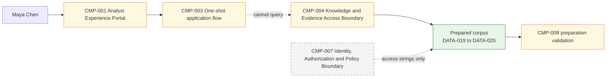
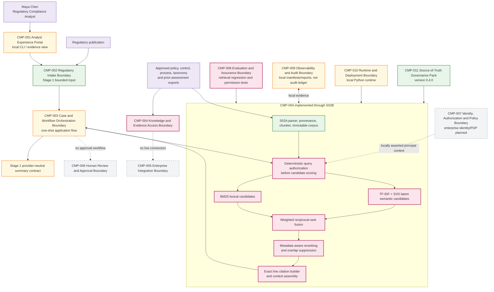
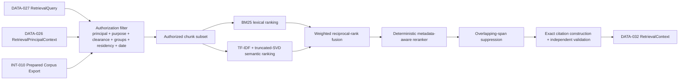
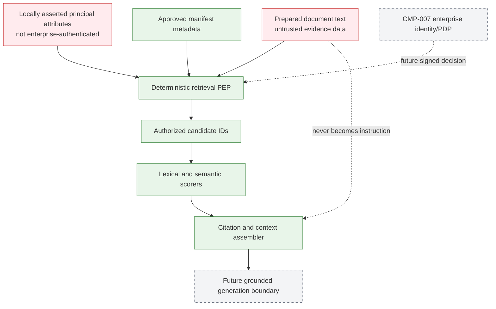

# 03 — Architecture Baseline

## Version and maturity

- Architecture version: `0.4.0`.
- Maturity: bounded local RAG **retrieval/context layer**, not a generated-answer service and not an agent.
- `CMP-004` advances from preparation-only to preparation plus authorized retrieval, ranking, citation and context assembly.
- `CMP-008` advances with retrieval evaluation and permission-boundary regression.
- `CMP-007` remains planned; principal attributes are local test claims.

## Architecture before S02B

## New requirement

Maya needs the best authorized evidence without opening every chunk. Exact terms, paraphrases, overlapping passages and restricted sources make a single search method or post-filtering unsafe.

## Selected architecture

## Retrieval flow

## Trust boundary

## Architecture invariants

1. `INT-010` is the only S02B input for prepared chunks; raw documents are not independently rechunked.
2. Authorization and metadata filtering precede lexical/semantic scorer construction.
3. Index identity binds corpus hash, source versions and retrieval configuration.
4. Fusion and reranking never widen the authorized candidate set.
5. Citations are application-built from immutable coordinates, not model-authored.
6. Retrieval context remains untrusted evidence and cannot alter application authority or disposition.
7. `CMP-008` evaluates retrieval independently from any future generator.
8. No agent, model-selectable tool, graph, memory, case state, approval or production audit capability exists.

## Deployment boundary

All components run in one local Python process over synthetic files. Logical boundaries are not claimed as microservices. Production decomposition requires an ADR based on identity, scaling, resilience, tenancy, ownership and data-residency needs.
