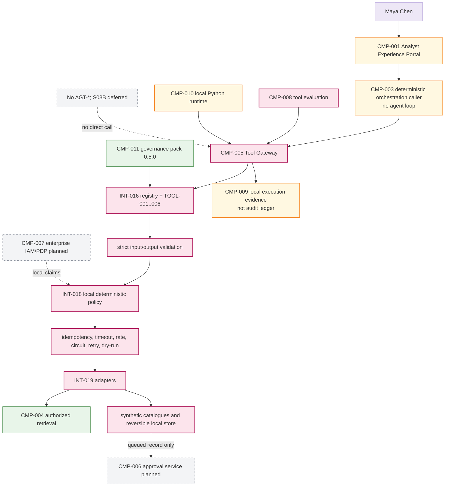

# 03 — Architecture Baseline

**Architecture version:** `0.5.0`

## Before S03A

S02B is a bounded retrieval/context application. `CMP-003` can initiate a fixed one-shot flow and `CMP-004` can return authorized cited evidence, but `CMP-005` has no implemented capability boundary. No `TOOL-*` or `AGT-*` exists.

See `docs/architecture/diagrams/stage-3a-architecture-before.mmd`.

## S03A architectural change

`CMP-005 Enterprise Integration Boundary` becomes partial through an application-owned tool gateway and six local adapters. The gateway is a policy-enforcement point, not an agent. It implements `INT-016`–`INT-020` and accepts `DATA-034`–`DATA-040`.

The call order is invariant:

```text
resolve exact tool/version
  -> validate input
  -> idempotency pre-check
  -> deterministic policy decision
  -> rate/circuit controls
  -> dry-run or bounded adapter invocation
  -> validate output and size
  -> idempotency commit for successful writes
  -> redacted execution event
  -> typed result envelope
```

## Cumulative architecture



## Trust and deployment boundaries

- Descriptors are trusted change-controlled configuration for the local stage.
- Caller principal attributes are constrained but unauthenticated.
- Evidence returned by `TOOL-003` remains untrusted data and retains S02B filtering.
- Adapters are inside the local process; no remote server authentication, network policy or service identity is proven.
- Local store and event log are tutorial artefacts, not enterprise systems of record or audit.

## Deferred architecture

`DATA-009 AgentRunState`, `DATA-010 AuthorizationGrant`, accepted `DATA-002 RegulatoryCase`, human approval processing, durable checkpoints, model action selection, graph execution, MCP/A2A, memory and multi-agent behavior remain unimplemented.
