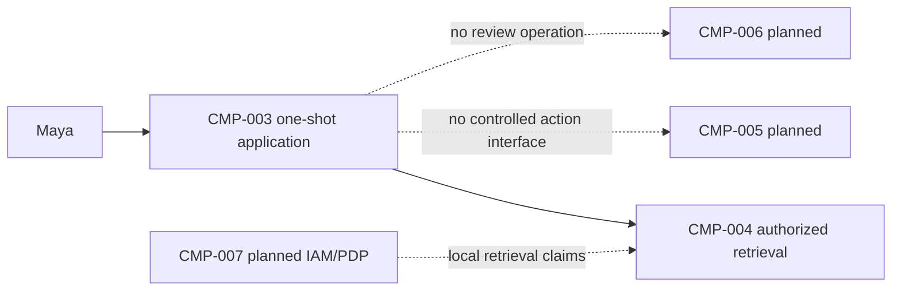
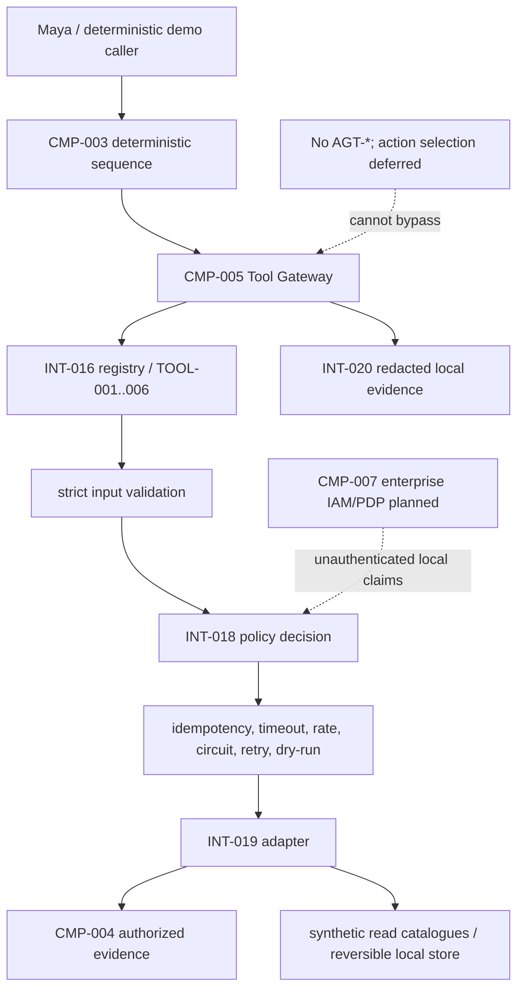

# Stage 3A — Tool Contracts and Tool Gateway

**Stage identifier:** `S03A`  
**Architecture/repository/handoff version:** `0.5.0`  
**Execution date:** 2026-07-31  
**Verification boundary:** local/offline Python, strict JSON schemas, synthetic catalogues and local reversible writes; no live enterprise systems or model-selected agent.

## 1. Context Carried Forward

NorthStar enters S03A as a bounded RAG application. S02B can authorize before scoring, combine lexical and latent-semantic retrieval, rerank, suppress overlap and build exact `CIT-*` citations in `DATA-032 RetrievalContext`. The architecture still has no executable capability, case state, approval service or agent. The supplied S02B handoff reports architecture/repository `0.4.0`, no `AGT-*` and no `TOOL-*`.

The constraints are decisive: preserve `CMP-001`–`CMP-011`; preserve S01 preliminary/unapproved human-accountability semantics; preserve `KSV-*`, `CHK-*`, `CIT-*` and S02B authorization-before-text-exposure; keep provider types behind contracts; and do not add graph, memory or multi-agent behavior.

The unresolved problem is operational. Maya can locate evidence, but she must manually search regulatory catalogues, query controls, create a draft case, save a candidate mapping and ask a reviewer. Retrieval cannot perform those actions. S03A modifies all ten registers, `CMP-005`, `CMP-008`, the cumulative architecture, repository, ADRs, tests and handoff.

> **Reconstruction note:** the byte-exact S02B repository was not attached to this execution. The supplied handoff is preserved, and this package is a compatible runnable overlay (`ISS-021`).

## 2. Narrative Development

Maya finds exact evidence that a lending publication may affect ability-to-repay recordkeeping. She then opens a regulatory catalogue in another browser, searches the control repository, copies identifiers into a spreadsheet, creates a case shell and emails a review team. The RAG result is grounded, but the process remains fragmented.

Elena proposes exposing each operation as a callable function. Marcus objects to direct model access: a plausible argument is not an authorization decision, retries can duplicate writes and a tool description can be wrong or malicious. Sofia requires observable tests for both normal behavior and denied behavior. Priya therefore splits the next maturity step into two boundaries:

1. **S03A:** define controlled capabilities and prove the gateway.
2. **S03B:** only then allow one bounded agent to select among those capabilities.

This substage intentionally stops before the first `AGT-*`.

## 3. Problem Being Solved

The architecture must make a capability safe and testable before a model can request it:

1. identify exactly which capability and version is requested;
2. reject malformed or undeclared arguments;
3. classify side effects;
4. bind execution to a principal, purpose and residency;
5. enforce policy before adapter execution;
6. make reversible writes replay-safe;
7. bound timeout, attempts, rate and result size;
8. validate tool output rather than trusting it;
9. return consistent observed results/errors; and
10. preserve evidence without calling it an audit ledger.

A tool contract solves *what can be invoked and under which deterministic conditions*. It does not solve *which action should be selected next*. That distinction is the Stage 3A boundary.

## 4. Requirements Introduced or Updated

S03A adds `FR-049`–`FR-060`, `NFR-038`–`NFR-046` and `CTL-019`–`CTL-026`. The most important requirements are strict versioned contracts, pre-adapter authorization, impact classification, mandatory write idempotency, bounded failure controls, preservation of S02B access, fixed unapproved write semantics and prohibition of direct model/adapter execution.

No previous requirement is renamed or renumbered. Full traceability appears in `02-Requirements-Register.md`.

## 5. Conceptual Explanation

### 5.1 What is a tool?

In plain language, a tool is a named capability the application can ask software to perform. Technically, it is not merely a Python function. A production-oriented tool definition needs identity, version, typed input/output, side-effect class, authorization metadata, timeout, result limit, retry/idempotency semantics and an executable adapter.

Model vendors commonly describe callable functions with JSON schemas, and MCP standardizes how hosts, clients and servers expose tools and other context. JSON Schema's current published specification is Draft 2020-12 [S1]; OpenAPI can describe network APIs [S2]; OpenAI and Anthropic provide vendor function/tool-calling representations [S3][S4]; MCP defines a JSON-RPC host/client/server protocol and explicitly warns that tools can represent arbitrary code execution and require consent and access controls [S5].

NorthStar uses these as adapter targets, not as the source of authority. `DATA-035 ToolDescriptor` is application-owned.

### 5.2 Contract versus implementation

The descriptor answers *what callers may request*. The adapter answers *how the operation is performed*. Separating them allows a local fixture, REST adapter or MCP server client to implement the same logical contract after conformance testing.

The descriptor contains:

- stable `TOOL-*` identity and semantic version;
- human-readable but non-authoritative description;
- impact class;
- Draft 2020-12 input and output schemas;
- allowed groups, purposes and residencies;
- timeout and maximum result bytes;
- idempotency and approval requirements;
- retry policy and sensitive input fields;
- SHA-256 of the descriptor.

### 5.3 Tool gateway

The gateway is an application policy-enforcement point. It centralizes controls that must not depend on a prompt or tool adapter:

```text
registry -> input validation -> idempotency lookup -> policy decision
         -> rate/circuit/dry-run -> bounded adapter execution
         -> output validation/size -> idempotency commit -> event/result
```

A future model can propose a tool call, but it cannot grant itself permission, change the schema or bypass the gateway.

### 5.4 Side-effect classes

NIST has described useful tool-access distinctions such as read-only, constrained write and write [S6]. NorthStar uses four internal classes:

1. read-only;
2. reversible write;
3. irreversible write;
4. privileged or regulated action.

S03A registers only classes 1 and 2. OWASP's agentic-risk work emphasizes excessive agency and tool misuse as material risks [S7]; refusing high-impact registration is therefore a stronger boundary than telling a model not to use a dangerous function.

### 5.5 Validation is necessary but insufficient

A valid JSON object can still request the wrong business action. Schema validation proves structure, not authorization, truth or appropriateness. The gateway separately evaluates policy and adapter output. OpenAPI itself notes that schemas cannot catch every specification violation [S2].

### 5.6 Idempotency and retries

Read-only calls may be retried for explicitly classified transient errors. A write is different: a timeout can occur after the remote system commits. Blind retry can create duplicate cases or notifications. S03A therefore requires a key for every reversible write, binds it to principal/tool/version and argument hash, returns the prior result for an identical replay and rejects a changed payload using the same key. Writes receive one attempt.

The local idempotency store is not production durable. It demonstrates semantics rather than exactly-once execution.

### 5.7 Result and error envelope

`DATA-038` gives callers one application-owned vocabulary for success, dry-run, replay, denial, validation, rate, circuit, timeout, execution, output and size errors. A transport adapter may later map these to HTTP or JSON-RPC, but it cannot erase whether a call was denied or replayed.

## 6. When This Capability Is Required

A tool gateway is justified when one or more operations cross a trust or side-effect boundary, multiple callers must obey the same controls, tool versions evolve, model-generated arguments are possible, retries can change business state, or tool outcomes must be evaluated independently.

NorthStar meets all of these conditions because evidence search, case drafts, mappings and review requests have different authority and failure consequences.

## 7. When It Is Not Required

Do not create a tool abstraction when a deterministic local function is private to one small workflow, has no external side effect, carries no independent permission boundary and will not be selected dynamically. A fixed SQL query behind an ordinary service can remain an API. A model should not be added merely to call a known sequence.

MCP is unnecessary at this point because all adapters are in-process. A remote protocol would add server trust, transport, authentication, consent, discovery and lifecycle complexity before NorthStar has an agent or remote tool server. MCP remains a future interoperability option, not a universal requirement [S5].

## 8. Architecture Options

| Option | Advantages | Risks/limitations | Decision |
|---|---|---|---|
| Direct Python calls | Minimal code and latency. | Controls scattered; easy bypass; no stable contract. | Rejected. |
| Model-vendor function schemas as canonical | Fast model integration. | Vendor coupling; schema subset differences; model-facing descriptions become authoritative. | Rejected as source of truth. |
| OpenAPI-first network services | Mature API tooling and gateways. | Premature networking; API spec alone does not enforce business authority. | Future adapter. |
| MCP server now | Standard discovery and tool protocol. | Remote-server trust, consent, auth and protocol lifecycle before need. | Deferred by `ADR-021`. |
| Workflow-engine activities | Durable execution and retries. | S03A has no durable workflow requirement yet. | Deferred. |
| **Application-owned gateway + in-process adapters** | Central control ordering, local runnable proof, protocol neutral. | Single-process scale and synthetic integration. | **Selected.** |

## 9. Decision Matrix

Scores: 1 weak, 5 strong for S03A.

| Criterion | Direct calls | OpenAPI now | MCP now | Application gateway |
|---|---:|---:|---:|---:|
| Deterministic control ordering | 2 | 4 | 3 | **5** |
| Local/offline execution | 5 | 3 | 3 | **5** |
| Provider neutrality | 3 | 4 | 4 | **5** |
| Dynamic discovery | 1 | 4 | 5 | 3 |
| Remote interoperability | 1 | 5 | 5 | 2 |
| Security surface appropriate now | 4 | 3 | 2 | **5** |
| Fit before agent loop | 3 | 3 | 2 | **5** |
| Implementation clarity | 4 | 3 | 2 | **5** |

The selected design is recorded in `ADR-018`–`ADR-021`.

## 10. Selected Architecture and Rationale

NorthStar adds an in-process `ToolGateway` to `CMP-005`, a file-backed `INT-016` registry and six adapters. JSON Schema Draft 2020-12 is canonical because the local validator can enforce it directly [S1]. All fields are explicit and unknown properties fail. Vendor/OpenAPI/MCP exporters are future translation layers.

The gateway, not a model, owns authorization and side-effect policy. Read-only tools may retry once for named transient failures. Reversible writes require keys, support dry-run and never auto-retry. High-impact classes cannot be registered.

This selection intentionally optimizes inspectability and control proof, not network scale.

## 11. Architecture Before the Change



S02B can answer an evidence query but cannot define or execute a business capability.

## 12. Architecture After the Change



The change adds a capability plane, not an autonomy plane.

## 13. Detailed Component Design

### 13.1 Registry

`ToolRegistry.load()` validates each `TOOL-*.json` against `tool-descriptor.schema.json`, computes a canonical SHA-256 and resolves only an exact ID/version pair. Unknown tools and version mismatches return different statuses. Registration rejects irreversible and privileged tools.

### 13.2 Policy decision

`LocalToolPolicyEngine` checks principal identity/correlation presence, group intersection, purpose, residency, approval reference and impact class. It returns a structured `DATA-037` with obligations. It deliberately marks unauthenticated claims; production authorization is not claimed.

### 13.3 Runtime controls

- per-principal/tool sliding-window rate limit;
- per-tool circuit breaker;
- thread-bounded local timeout;
- read-only retry only for named transient errors;
- write idempotency and argument conflict detection;
- dry-run for reversible writes;
- output schema and result-byte validation.

A Python thread timeout cannot guarantee that arbitrary code has stopped. Production remote calls need transport cancellation, deadlines and reconciliation.

### 13.4 Adapters

`TOOL-001` and `TOOL-002` use synthetic catalogues. `TOOL-003` applies the same group/clearance/purpose/residency ordering as S02B and returns the untrusted-evidence notice. `TOOL-004`–`006` write only local unapproved artefacts using write-once atomic files.

### 13.5 Execution evidence

`DATA-040` records identifiers, status, argument SHA-256, selected redacted fields, decision ID, attempts, duration and descriptor hash. It excludes hidden chain-of-thought. It is not hash-chained, signed or WORM.

## 14. Data, State and Interface Design

S03A adds `DATA-034`–`DATA-040` and `INT-016`–`INT-020`. The canonical sequence is:

```text
DATA-036 invocation
  + DATA-035 descriptor
  + DATA-034 principal
  -> DATA-037 policy decision
  -> INT-019 adapter
  -> DATA-038 result
  -> DATA-039 replay record (writes)
  -> DATA-040 event evidence
```

Tool-specific fields remain in schemas to avoid prematurely treating local JSON as accepted enterprise case state. The full definitions and error taxonomy appear in `05-Data-and-Schema-Register.md`.

## 15. Implementation

### 15.1 Repository modules

```text
src/northstar_compliance/tools/
├── models.py          # DATA-034..040 logical types
├── registry.py        # INT-016
├── policy.py          # INT-018 local PDP
├── gateway.py         # INT-017 enforcement pipeline
├── adapters.py        # INT-019 implementations
├── controls.py        # rate/circuit
├── idempotency.py     # local replay record
├── storage.py         # atomic reversible local writes
├── events.py          # INT-020 local evidence
├── factory.py
└── utils.py / errors.py
```

### 15.2 Central gateway excerpt

```python
descriptor = registry.resolve(request.tool_id, request.tool_version)
validate(descriptor.input_schema, request.arguments)
existing = idempotency_lookup(request, descriptor)
decision = policy.decide(request, descriptor)
require(decision.allowed)
rate_limiter.check(principal, descriptor.tool_id)
circuit_breaker.before_call(descriptor.tool_id)
data = execute_with_timeout(adapter, descriptor.timeout_ms)
validate(descriptor.output_schema, data)
require(encoded_size(data) <= descriptor.max_result_bytes)
commit_idempotency_if_write(request, data)
emit_redacted_event(request, decision, data)
return ToolResultEnvelope(...)
```

### 15.3 Local run

```bash
python -m venv .venv
source .venv/bin/activate
pip install -e '.[dev]'
python -m pytest -q
python scripts/run_stage3a_demo.py
python scripts/run_stage3a_evaluation.py
python scripts/benchmark_stage3a_gateway.py
python scripts/validate_stage3a.py
python scripts/consistency_audit_stage3a.py
```

The demo deterministically calls `TOOL-001`, `TOOL-003`, `TOOL-004`, `TOOL-005`, `TOOL-006` and replays `TOOL-004`. It never asks a model what to do next.

## 16. Code and Repository Changes

### Files added

Six descriptors, descriptor meta-schema, tool modules, four test groups, evaluation dataset/scripts, benchmark, validation/audit scripts, four ADRs, five Mermaid files, technical references, this chapter and all ten `0.5.0` registers.

### Files modified

Package version, dependencies, README, changelog and cumulative architecture.

### Files retired

None.

### Compatibility note

The package preserves the supplied S02B handoff and implements a compatible local retrieval adapter. It does not claim byte identity with the unavailable previous repository.

## 17. Security and Governance Implications

### 17.1 Strong controls added

- allowlist and exact version resolution;
- pre-adapter schema and policy enforcement;
- impact-class prohibition;
- no unrestricted user credential passed to adapters;
- no automatic write retry;
- fixed unapproved application-owned status;
- restricted evidence negative test;
- argument hashing/redaction and output validation.

### 17.2 Residual risks

Local principal fields can be forged. Descriptor files are not signed. Tool descriptions remain untrusted from a security perspective; MCP likewise warns that tool behavior annotations from an untrusted server must not be blindly trusted [S5]. NIST's agent red-team findings reinforce that tool-connected agents require dedicated hijacking and security evaluation [S8].

### 17.3 Governance

Sofia requires a descriptor version/hash, policy decision, observed result and evaluation case for every capability claim. No local write becomes an accepted mapping or review decision. Legal and compliance interpretations remain with accountable humans.

## 18. Performance, Concurrency and Cost Implications

The local gateway adds schema validation, policy checks and evidence serialization to every call. These are appropriate overheads because they prevent unsafe work rather than merely optimize tokens.

Conceptual per-call latency is:

```text
L_tool = L_registry + L_input_validation + L_policy + L_runtime_controls
       + L_adapter + L_output_validation + L_event
```

For local synthetic reads, the benchmark reports P50/P95/P99 but explicitly labels them non-production. Network adapters will dominate latency and require asynchronous connection pooling, backpressure and distributed deadlines later.

No managed API or model cost is incurred. Future cost includes adapter/API charges, retry/reconciliation, policy decisions, secrets, telemetry, durable idempotency and human review. The gateway can reduce failed-run cost by rejecting bad calls before external execution.

Concurrency is deliberately limited. The timeout executor is per call, and shared in-memory rate/idempotency/circuit state is not distributed. S03A does not make a production throughput claim.

## 19. Evaluation and Test Cases

### 19.1 Executed tests

| IDs | Coverage |
|---|---|
| `TEST-047`–`051` | descriptor count/hash, Draft 2020-12 schemas, exact version, impact classes and change detection. |
| `TEST-052`–`056` | typed reads, draft/mapping/review chain, dry-run, idempotent replay and conflict. |
| `TEST-057`–`062` | malformed/extra arguments, pre-adapter denial, S02B permission boundary, required key, redaction and unauthenticated warning. |
| `TEST-063`–`069` | bounded read retry, no write retry, timeout, invalid output, result size, rate and circuit. |
| `TEST-070`–`073` | contract, draft, permission and no-agent evaluation invariants. |

### 19.2 Evaluations

- `EVAL-014`: descriptor contract validity.
- `EVAL-015`: unapproved idempotent draft flow.
- `EVAL-016`: permission boundary—Maya receives zero restricted Borealis hits; Sofia receives one when her purpose/clearance/group match.
- `EVAL-017`: authority boundary—zero irreversible tools and no agent identifier.

The results prove local contract behavior, not semantic quality, enterprise identity or production reliability.

## 20. Failure Scenarios and Recovery

### Scenario 1 — Model-like payload adds `admin=true`

Input validation rejects the undeclared property before the adapter runs. Recovery is to construct a contract-valid request; the gateway does not ignore the suspicious field.

### Scenario 2 — Wrong group or purpose

The policy engine returns `denied`; the spy adapter call count remains zero. Production recovery requires an authorized user/workload or a formal approval path, not prompt persuasion.

### Scenario 3 — Duplicate case request

The first key writes once. The same key and arguments return `replayed`; changed arguments return `idempotency_conflict`. Recovery is to use the original result or a genuinely new business key.

### Scenario 4 — Read-only transient outage

A named `TransientToolError` may receive one bounded retry. After repeated failure the circuit opens. The caller receives a structured partial failure; no infinite loop exists.

### Scenario 5 — Write timeout or transient failure

The gateway performs one attempt and returns an error. It does not guess whether a remote side effect committed. Production requires status lookup/reconciliation or compensation before retry.

### Scenario 6 — Adapter returns malformed or oversized data

Output validation/size checks reject it and count a circuit failure. Untrusted output never becomes a successful observed result.

### Scenario 7 — Restricted evidence query

Maya receives no Borealis candidate; Sofia can retrieve it only with the matching model-risk purpose, restricted clearance and governance group. The wrapper does not convert retrieval into a broader tool entitlement.

## 21. Architecture Decision Records

- `ADR-018`: canonical application-owned versioned tool contracts.
- `ADR-019`: single application-owned tool gateway.
- `ADR-020`: impact classification, write idempotency and retry rules.
- `ADR-021`: defer MCP and model-selected agent execution.

## 22. Requirements Traceability Update

Every S03A requirement traces to `CMP-005` or an adjacent retained boundary, a versioned data/interface contract, a deterministic control and one or more tests. The complete matrix is in `02-Requirements-Register.md`. No requirement is declared production-complete.

## 23. Stage Outcome

NorthStar can now invoke six controlled local capabilities through one gateway. It can validate/authorize arguments, preserve S02B evidence permissions, create only unapproved reversible artefacts, suppress duplicate writes, return observed structured results and fail safely on common contract/runtime defects.

It still cannot pursue a goal. There is no planner, tool-selection model, `DATA-009 AgentRunState`, progress check, iteration budget, replanning, termination or escalation loop. That is why S03A is a tool-using application boundary, not yet a tool-using agent.

## 24. Known Limitations

1. Synthetic/local adapters and data only.
2. Unauthenticated principal claims and unsigned local policy decisions.
3. Process-local idempotency, rate and circuit state.
4. Thread timeout is not guaranteed process/network cancellation.
5. No live connector freshness, reconciliation or service SLO.
6. Local stores/events are not records or audit ledger.
7. No DLP, secret manager, workload identity, mTLS or network segmentation.
8. No OpenAPI/function-calling/MCP exporter execution.
9. No production load/concurrency/cost benchmark.
10. No agent loop, graph, memory, approval processing or multi-agent behavior.

## 25. Narrative Bridge to the Next Stage

Maya's demonstration now completes a draft sequence without bypassing controls. Liam then asks what decides the sequence when a publication has no lending match but does have a privacy match, or when one tool fails and another source could still complete the investigation. Today the answer is hard-coded Python.

Priya refuses to bury those choices in the gateway. The gateway should enforce capabilities, not pursue goals. NorthStar now needs exactly one low-authority agent that receives a goal, sees bounded state, selects only registered tools, observes results, measures progress and terminates on completion, escalation, repetition, budget or failure. That is the unresolved problem for S03B.

## 26. Updated Source-of-Truth Artefacts

All ten files are updated to `0.5.0`: constitution, business baseline, requirements, architecture, component/tool catalogue, data/interfaces, ADR register, repository manifest, risk/issues register and handoff. The supplied S02B handoff remains under `docs/baseline/`.

## 27. Stage Handoff Pack

The complete reusable handoff is `docs/source-of-truth/09-Stage-Handoff-Pack.md`. Its exact continuation is **S03B — Bounded Single-Agent Loop, Run State and Safe Termination**; this response stops after S03A.

## Stage Consistency Audit

**Result: Passed with recorded exceptions.**

Validated: unchanged personas/component names; no `AGT-*`; all six tools are read-only/reversible; descriptor IDs match the catalogue; gateway ordering matches diagrams/code; S02B access and S01 disposition invariants are tested; repository paths and versions agree; tests, demo, evaluation, benchmark, compilation, validator and audit are recorded in the validation report.

Recorded exceptions: no Mermaid CLI rendering, no direct Python 3.12 execution, no byte-exact S02B repository, no enterprise identity/PDP/live connectors and no protocol-export conformance.

## References

See `docs/references/Stage-3A-Technical-Sources.md` for [S1]–[S8].
