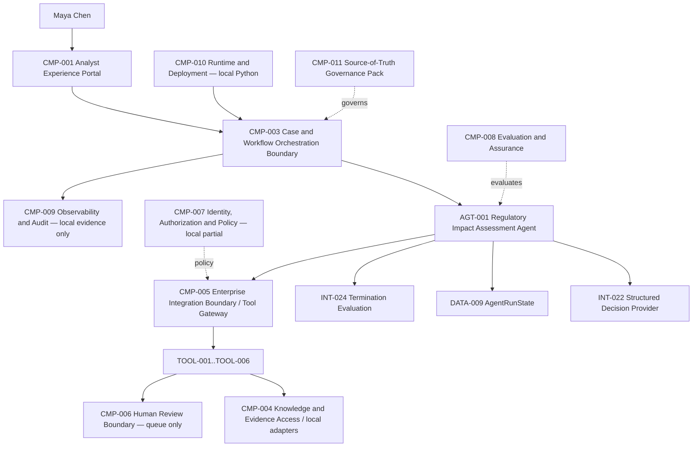

# 03 — Architecture Baseline

**Architecture version:** `0.6.0`

## Architecture before S03B

`CMP-003` contained a deterministic call sequence over the `0.5.0` tool gateway. The gateway correctly enforced contracts, policy, idempotency and local evidence, but no component owned a goal, observation-action state or termination semantics.

## Architecture decision

S03B introduces one low-authority `AGT-001 Regulatory Impact Assessment Agent` within the existing `CMP-003 Case and Workflow Orchestration Boundary`. It uses a provider-neutral structured decision contract and application-owned `DATA-009 AgentRunState`. It does not introduce a new service boundary or framework.

## Cumulative logical architecture

The repository version of this diagram is `docs/architecture/diagrams/cumulative-logical-architecture.mmd` and visually distinguishes new S03B elements.

## Execution flow

1. `INT-021` creates a run from `DATA-041 AgentGoal` and trusted `DATA-034 ToolPrincipalContext`.
2. `INT-022` returns one `DATA-042 AgentDecision`.
3. Terminal decisions are validated by `INT-024`; a model cannot self-certify success.
4. Tool decisions are checked against the agent allowlist and invoked through `INT-017`.
5. A validated `DATA-038` result becomes `DATA-043 AgentObservation` and may add a milestone.
6. Iteration, repetition and no-progress guards are evaluated.
7. A final `DATA-044 AgentRunOutcome` is persisted locally through `INT-025`.

## Security boundaries

- Probabilistic boundary: decision proposal only.
- Deterministic application boundary: identity context, authorization, state projection, progress, completion and disposition.
- Tool/integration boundary: six pre-existing read-only/reversible local capabilities.
- Human accountability boundary: review is queued, not decided.

## Explicitly deferred architecture

No graph nodes/edges, durable checkpoint store, memory system, sub-agent, distributed worker, MCP server, A2A protocol or production control plane is implemented.
