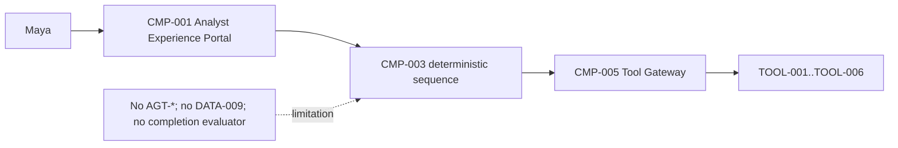
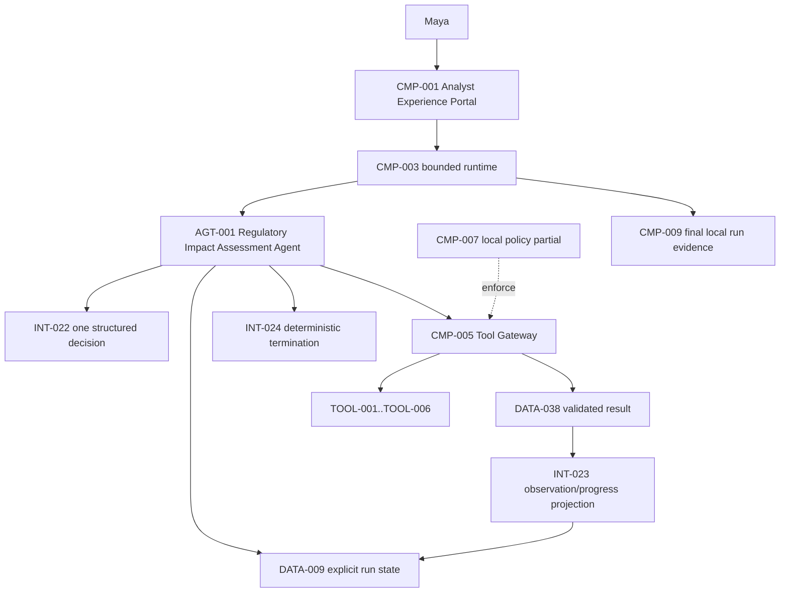
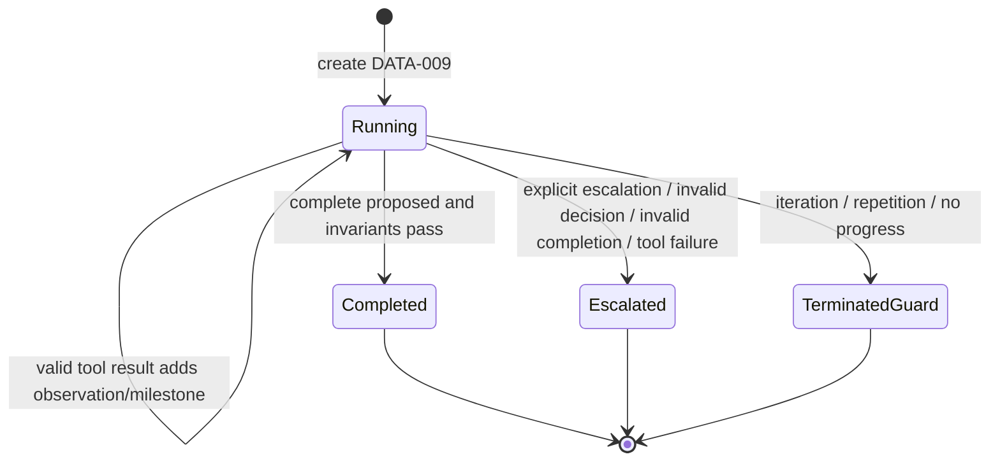

# Stage 3B — Single-Agent Loop and Termination

**Stage identifier:** `S03B`  
**Architecture/repository/handoff version:** `0.6.0`  
**Execution date:** 2026-07-31  
**Verification boundary:** local/offline Python, synthetic/public-safe data, six pre-existing S03A tool contracts and reversible local writes; no live decision model, enterprise systems or durable workflow runtime.

## 1. Context Carried Forward

NorthStar enters S03B with a bounded RAG layer and six executable capabilities behind one deterministic tool gateway. S03A established exact tool/version resolution, strict JSON Schema validation, impact classification, pre-adapter authorization, idempotency for reversible writes, bounded read retry, timeout/result controls and local execution evidence. It intentionally allocated no `AGT-*` identifier and left the call order in deterministic application code.

The accepted constraints are decisive:

- preserve `CMP-001`–`CMP-011`, `TOOL-001`–`TOOL-006`, `DATA-034`–`DATA-040` and `INT-016`–`INT-020`;
- preserve S01 preliminary/unapproved and mandatory human-review semantics;
- preserve S02A/S02B `KSV-*`, `CHK-*`, `CIT-*`, `DATA-032` and authorization-before-scoring/text exposure;
- preserve S03A write idempotency and prohibition on automatic write retry;
- keep identity, authority, completion and final disposition outside probabilistic reasoning; and
- do not introduce graph, memory, MCP/A2A, multi-agent or production control-plane behavior.

The unresolved problem is no longer tool safety. Maya's application can call controlled capabilities, but only in a fixed sequence. It cannot accept a goal, choose the next allowed action from current progress, observe a result, re-evaluate the goal and stop safely. Putting that behavior into the gateway would mix policy enforcement with goal pursuit.

This stage modifies all ten source-of-truth artefacts, `CMP-003`, `CMP-008`, `CMP-009`, the cumulative architecture, repository, tests and ADRs. It allocates exactly one justified agent.

> **Reconstruction note:** the complete S03A chapter and handoff were available, but the exact S03A ZIP and individual `0.5.0` registers were not mounted. `ISS-025` records that this is a compatible `0.6.0` overlay rather than a byte-exact repository continuation.

## 2. Narrative Development

Maya demonstrates S03A by running a Python script that searches the regulatory catalogue, retrieves evidence, creates a draft, saves a candidate mapping and queues a review. The controls work, but Liam asks why the application searches lending evidence when a notice might instead concern customer-data residency. Elena answers that the sequence is hard-coded.

Priya separates two responsibilities. The gateway must continue to answer, “Is this exact capability call allowed and safe to execute?” A new agent may answer, “Given this goal and the observations so far, which allowed action should be proposed next?” The agent does not receive a credential, an approval right or direct adapter access.

Marcus adds a second condition: the model cannot decide that the work is complete merely by returning a polished final sentence. Sofia adds a testable definition of success: a run is complete only when it has authorized evidence, candidate controls, an unapproved draft case, an unapproved candidate mapping and a queued human review request, all linked consistently.

The team therefore introduces one low-authority agent and an application-owned termination evaluator. The first accepted provider is deterministic so the loop mechanics can be tested without confusing runtime correctness with model quality.

## 3. Problem Being Solved

### 3.1 Business problem

A fixed workflow can execute one known happy path. Maya's real investigation varies by publication, jurisdiction, available evidence and affected business domain. She needs the system to choose among existing safe capabilities without turning the system into an unrestricted autonomous actor.

### 3.2 Technical problem

The architecture must:

1. represent one goal and one run explicitly;
2. expose a bounded, non-sensitive view of current progress;
3. obtain one typed next-action proposal;
4. reject malformed, non-allowlisted or authority-widening decisions;
5. invoke tools only through the S03A gateway;
6. convert validated results into state and progress;
7. distinguish successful completion from escalation or guard exhaustion;
8. reject premature completion;
9. stop repeated or non-progressing execution; and
10. persist a concise final outcome without pretending to provide durable recovery or audit.

### 3.3 Deliberate non-goals

S03B does not implement token/time/cost/tool-call budgets, sophisticated recovery, cancellation, checkpoint/resume, compensation, graph execution, human approval processing, memory, multiple agents or live model quality evaluation. These omissions are intentional stage boundaries, not hidden claims.

## 4. Requirements Introduced or Updated

S03B adds `FR-061`–`FR-070`, `NFR-047`–`NFR-054` and `CTL-027`–`CTL-032`. No accepted identifier is renamed or renumbered.

The central requirements are:

- one `DATA-041 AgentGoal` creates executable `DATA-009 AgentRunState`;
- one structured `DATA-042 AgentDecision` is permitted per iteration;
- `AGT-001` may propose only `TOOL-001`–`TOOL-006`;
- trusted `DATA-034` is injected by the application, never generated by the agent;
- progress is derived only from validated `DATA-038` results;
- `complete` is a proposal, not authority;
- `INT-024` validates business completion and safety/resource guards; and
- every terminal run returns `DATA-044` with fixed unapproved disposition.

The authoritative definitions and traceability matrix are in `02-Requirements-Register.md`.

## 5. Conceptual Explanation

### 5.1 What makes this an agent?

In plain language, an agent receives a goal, chooses actions, observes what happened and continues or stops. In technical terms, S03B adds a stateful control loop around a structured decision provider and deterministic tool gateway:

```text
goal -> state -> propose one decision -> validate -> act through gateway
     -> observe validated result -> update state/progress -> terminate or repeat
```

This differs from the S03A script because the next action is selected from the current state rather than hard-coded at the call site.

### 5.2 Agency, autonomy and authority remain separate

- **Agency:** `AGT-001` can pursue a bounded goal through multiple observations and actions.
- **Autonomy:** it may choose the next proposal within one run, subject to iteration and progress guards.
- **Authority:** it has none independently. The gateway and trusted principal decide whether a proposal can execute.

This separation prevents a more capable decision provider from automatically acquiring broader permissions.

### 5.3 Observation-action loop and ReAct

The ReAct paper describes interleaving reasoning and actions so new observations can influence later steps [S1]. NorthStar adopts the observation-action structure, not a requirement to persist private reasoning. `DATA-042.reason_summary` is a concise, auditable explanation of the proposed action, while hidden chain-of-thought remains neither required nor stored.

### 5.4 Run state

`DATA-009` is application state, not conversation history. It contains:

- stable run and agent identity;
- goal;
- iteration and guard counters;
- ordered structured decisions and observations;
- milestones derived from validated outputs;
- references to local artifacts; and
- terminal status/reason.

The model does not directly mutate this object. The runtime applies a fixed projection from each successful tool result.

### 5.5 Progress

Progress is represented by six domain-specific milestones:

1. `regulatory_sources_found`;
2. `authorized_evidence_retrieved`;
3. `control_candidates_found`;
4. `draft_case_created`;
5. `candidate_mapping_saved`; and
6. `human_review_queued`.

Milestones are monotonic within a run. Calling a tool successfully does not automatically mean progress; the result must contain the expected valid business artifact.

### 5.6 Termination is layered

A safe loop needs more than a magic word. Vendor frameworks expose maximum-turn/message and other termination conditions [S2][S3], but NorthStar distinguishes four questions:

1. **Did the provider propose completion or escalation?**
2. **Are business completion invariants actually satisfied?**
3. **Did a tool fail or policy deny the action?**
4. **Did a safety/resource guard require the loop to stop?**

The terminal states are:

| State | Meaning |
|---|---|
| `completed` | Required unapproved artifacts and queued review exist; no legal approval is implied. |
| `escalated` | Human judgment or intervention is required because of ambiguity, invalid completion/decision or tool failure. |
| `terminated_guard` | Iteration, repetition or no-progress guard stopped the run. |

A maximum iteration limit prevents endless execution, but reaching it is never reported as success.

### 5.7 Completion invariants

The runtime accepts completion only if:

- all six milestones exist;
- draft status equals `draft_unapproved` and requires review;
- mapping status equals `candidate_unapproved`;
- review status equals `queued_for_human_review` and requires review; and
- case identifiers agree across draft, mapping and review request.

The fixed final disposition remains `preliminary_grounded_unapproved`.

### 5.8 Termination versus recovery

Termination answers when the current loop must stop. Recovery answers how it may safely continue after failure, timeout, cancellation or restart. S03B implements safe stopping. It deliberately leaves advanced recovery and multi-dimensional budgets to S03C.

## 6. When This Capability Is Required

A single-agent loop is justified when:

- the task has a goal rather than one known function call;
- the next action depends on prior observations;
- all candidate actions can be safely bounded behind contracts;
- one role can still own the entire task coherently;
- the task remains reversible/advisory; and
- explicit termination and human escalation can be defined.

NorthStar now meets these conditions because the same publication may require different combinations of regulatory search, evidence retrieval and control lookup before a draft can be prepared.

## 7. When It Is Not Required

Do not use an agent loop when:

- the sequence is known and deterministic;
- a normal service or workflow rule produces the correct result;
- the task is a single read/query;
- tool side effects cannot be bounded or approved;
- no reliable completion criteria exist;
- latency/cost of iterative model calls outweighs branching value; or
- a human must make each step and the system only needs decision support.

A fixed workflow remains preferable for highly regulated transitions whose routing can be fully specified. Multiple agents are unnecessary here because the work has one goal, one authority envelope and no independently accountable specialist role.

## 8. Architecture Options

| Option | Benefits | Limitations for S03B | Decision |
|---|---|---|---|
| Retain fixed sequence | Deterministic, lowest latency and easiest to test. | Cannot adapt action order or safely stop early from observations. | Rejected for this new requirement. |
| Open-ended ReAct loop | Flexible and simple conceptually. | Unbounded turns, prompt-dependent completion and weak authority separation if implemented naively. | Rejected. |
| Plan-and-execute | Makes a plan explicit and separates planning/execution. | Plan can become stale; adds extra model calls and a second control abstraction before need. | Deferred. |
| Planner/executor/critic roles | Stronger decomposition and verification potential. | Multiple roles are not yet justified; more cost and failure paths. | Deferred. |
| Graph/workflow engine | Explicit branches, checkpoints, waiting and recovery. | Premature for this bounded in-memory stage; belongs after loop limitations are demonstrated. | Deferred. |
| **Application-owned bounded single loop** | Minimum genuine agency; framework-neutral; deterministic authority/state/termination. | In-memory, sequential, limited recovery. | **Selected.** |

## 9. Decision Matrix

Scores: 1 weak, 5 strong for the current need.

| Criterion | Fixed sequence | Open loop | Plan/execute | Graph now | Bounded single loop |
|---|---:|---:|---:|---:|---:|
| Observation-dependent action | 1 | 5 | 5 | 5 | **5** |
| Visible deterministic control | 5 | 2 | 3 | 5 | **5** |
| Local/offline implementation | 5 | 4 | 3 | 3 | **5** |
| Authority containment | 5 | 2 | 3 | 5 | **5** |
| Termination testability | 4 | 2 | 3 | 5 | **5** |
| Current complexity fit | 5 | 4 | 2 | 2 | **5** |
| Durable recovery | 1 | 1 | 1 | 5 | 1 |
| Multi-role scaling | 1 | 2 | 3 | 4 | 2 |

The selected design is recorded in `ADR-022` and `ADR-023`.

## 10. Selected Architecture and Rationale

NorthStar adds `AGT-001 Regulatory Impact Assessment Agent` inside `CMP-003`. The agent is not a new network service. It is a logical actor whose decision provider is separated from the runtime contract.

The runtime owns:

- run identity and explicit state;
- model-visible tool descriptions;
- agent-level allowlist;
- trusted principal injection;
- action signatures;
- gateway invocation;
- observation projection;
- progress counters;
- completion invariants; and
- terminal outcome persistence.

The decision provider owns only one proposal at a time. A deterministic rule provider is used for executable acceptance. A future model adapter can replace it behind `INT-022` only after schema, security and semantic evaluation.

This design is selected because it introduces the smallest genuine agency while retaining every S03A enforcement boundary.

## 11. Architecture Before the Change



The gateway can execute safely, but the caller has no goal-driven state transition.

## 12. Architecture After the Change



Only `AGT-001`, agent contracts/state and termination are new. Existing tools and security boundaries are preserved.

## 13. Detailed Component Design

### 13.1 `AGT-001 Regulatory Impact Assessment Agent`

**Goal:** prepare an evidence-backed unapproved impact package and queue human review for one accepted publication.

**Allowed decisions:**

- `call_tool` for one exact version of `TOOL-001`–`TOOL-006`;
- `complete`; or
- `escalate`.

**Authority:** none independent of `DATA-034` and `CMP-005`.

**Non-goals:** final legal interpretation, approval, accepted mapping, control change, remediation assignment, external notification, code execution, delegation and sub-agent creation.

### 13.2 `INT-022 Structured Decision Provider`

The provider receives:

- typed goal;
- bounded application state/progress;
- application-generated model view of the six tool descriptors.

It returns exactly one `DATA-042` decision. Unknown fields and contradictory terminal/tool fields fail validation.

A representative decision is:

```json
{
  "kind": "call_tool",
  "tool_id": "TOOL-003",
  "tool_version": "1.0.0",
  "arguments": {
    "query": "automated credit decision evidence retention",
    "top_k": 5
  },
  "reason_summary": "Authorized internal evidence is not yet present.",
  "expected_progress": "Populate exact cited evidence without widening access."
}
```

### 13.3 `CMP-003` runtime

The runtime performs one loop iteration as an atomic control sequence at the application level:

1. evaluate pre-iteration guard;
2. request and validate one decision;
3. process terminal proposal or validate agent tool allowlist;
4. calculate action signature;
5. construct trusted `ToolInvocationRequest`;
6. add an application-generated idempotency key for writes;
7. invoke `CMP-005`;
8. project the validated result into state;
9. evaluate failure/repetition/progress; and
10. continue or terminate.

### 13.4 State projection

The provider cannot claim a milestone. The runtime maps known outputs:

| Tool | Required output condition | Milestone/artifact |
|---|---|---|
| `TOOL-001` | nonempty `records` | `regulatory_sources_found` |
| `TOOL-003` | nonempty authorized `citations` | `authorized_evidence_retrieved` |
| `TOOL-002` | nonempty `controls` | `control_candidates_found` |
| `TOOL-004` | `draft_unapproved` | `draft_case_created` |
| `TOOL-005` | `candidate_unapproved` | `candidate_mapping_saved` |
| `TOOL-006` | `queued_for_human_review` | `human_review_queued` |

### 13.5 Action signatures

A signature binds tool ID, version and canonical argument SHA-256. Consecutive repetition detects a provider that keeps proposing the identical call. This is distinct from tool idempotency:

- repetition guard protects loop progress;
- idempotency protects duplicate side effects.

### 13.6 Termination evaluator

`INT-024` has four entry points:

- pre-iteration limit;
- decision validation and terminal proposal;
- action-signature repetition;
- post-observation progress.

The evaluator is deterministic and unit-tested. It never inspects hidden model reasoning.

## 14. Data, State and Interface Design

### 14.1 State-transition model



### 14.2 Ownership

| Object | Owner | Mutability |
|---|---|---|
| `DATA-041 AgentGoal` | `CMP-003` | immutable per run |
| `DATA-042 AgentDecision` | proposed by `AGT-001`, validated by `CMP-003` | append-only sequence |
| `DATA-043 AgentObservation` | `CMP-003` | append-only sequence |
| `DATA-009 AgentRunState` | `CMP-003` | mutable in memory, monotonic milestones |
| `DATA-044 AgentRunOutcome` | `CMP-003`/`CMP-009` | immutable terminal evidence |

### 14.3 Final outcome semantics

Every terminal result sets:

```json
{
  "human_review_required": true,
  "final_disposition": "preliminary_grounded_unapproved"
}
```

This is true even for partial/guard outcomes so a caller cannot mistake termination for approval.

## 15. Implementation

### 15.1 Repository modules

```text
src/northstar_compliance/agent/
├── models.py       # DATA-009, DATA-041..044
├── decision.py     # INT-022 protocol and deterministic oracle
├── termination.py  # INT-024 completion and guard rules
├── runtime.py      # INT-021 loop and INT-023 projection
└── factory.py
```

The S03A-compatible tool gateway remains under `src/northstar_compliance/tools/`.

### 15.2 Framework-independent pseudocode

```python
state = create_run(goal, trusted_principal, limits)

while state.running:
    if iteration_limit_reached(state):
        terminate_guard(state, "iteration_limit")
        break

    decision = validate(decision_provider.decide(goal, bounded_state, tool_view))

    if decision.is_escalation:
        escalate(state, decision.reason)
        break

    if decision.is_completion:
        if completion_invariants(state):
            complete_unapproved(state)
        else:
            escalate(state, "invalid_completion")
        break

    require(decision.tool in AGENT_TOOL_ALLOWLIST)
    require(not_repeated(decision.signature))

    request = bind_trusted_principal_and_idempotency(decision)
    result = tool_gateway.invoke(request)
    observation = project_validated_result(result)
    update_state_and_progress(state, observation)

    if result.failed:
        escalate(state, "tool_failure")
    elif no_progress_limit_reached(state):
        terminate_guard(state, "no_progress")

persist_final_state_and_outcome(state)
```

### 15.3 Central runtime excerpt

```python
decision = self.decision_provider.decide(goal, state, self.gateway.registry.model_view())
state.decisions.append(decision)
state.iteration += 1

if self.termination.evaluate_decision(state, decision):
    break

if decision.tool_id not in self.ALLOWED_TOOLS:
    terminate_invalid_decision(...)
    break

request = ToolInvocationRequest(
    tool_id=decision.tool_id,
    tool_version=decision.tool_version,
    arguments=decision.arguments,
    principal=principal,  # injected by application
    idempotency_key=write_key_if_required(...),
)
result = self.gateway.invoke(request)
self._apply_observation(state, result)
```

### 15.4 Deterministic accepted provider

The local provider chooses the first missing milestone in the order regulatory source, evidence, controls, draft, mapping and review. It returns `complete` only after all six are present. This provider proves the loop and contracts; it does not prove an LLM can choose correctly.

### 15.5 Local execution

```bash
python -m venv .venv
source .venv/bin/activate
pip install -e '.[dev]'
python -m pytest -q
python scripts/run_stage3b_demo.py
python scripts/run_stage3b_evaluation.py
python scripts/validate_stage3b.py
python scripts/consistency_audit_stage3b.py
```

Expected happy-path shape:

```text
status=completed
termination_reason=goal_complete
iterations=7
observations=6
final_disposition=preliminary_grounded_unapproved
human_review_required=true
```

## 16. Code and Repository Changes

### Files added

- `src/northstar_compliance/agent/` modules;
- S03B tests across unit/integration/security/evaluation groups;
- demo/evaluation/validation/audit scripts;
- decision scenario dataset;
- two ADRs;
- five focused Mermaid diagrams plus cumulative update;
- technical references;
- S03B chapter;
- updated ten source-of-truth files.

### Files modified/reconstructed

- package metadata to `0.6.0`;
- S03A-compatible tool descriptors and gateway modules included in the overlay;
- README/changelog/manifest and cumulative architecture.

### Files retired

None.

### Compatibility note

Because the exact S03A archive was unavailable, this package recreates the S03A contract surface required by S03B and preserves the complete S03A handoff semantics. It does not claim byte identity with the prior package.

## 17. Security and Governance Implications

### 17.1 Strong controls retained or added

- tool ID/version and input/output schema validation;
- pre-adapter authorization and write scope;
- agent-level allowlist before gateway invocation;
- application-injected principal context;
- no identity/authority fields in the decision contract;
- no high-impact tools;
- write idempotency and no automatic write retry;
- completion invariants outside the decision provider;
- fixed unapproved disposition and human-review requirement;
- restricted-evidence negative test;
- no hidden reasoning storage.

### 17.2 Prompt and tool hijacking

A tool-connected agent can be redirected by untrusted content if instructions and evidence are not separated or if tool access is too broad. NIST's agent-hijacking evaluation work motivates dedicated adversarial testing [S5]. S03B limits impact by treating retrieved text as evidence data, exposing only pre-registered tools and preventing the provider from creating authority. This reduces blast radius; it does not prove the provider cannot choose a poor allowed action.

### 17.3 Governance claims

A completed S03B run means the technical preparation package is structurally ready for human review. It does not establish regulatory correctness, policy applicability, control-gap acceptance or reviewer approval. Daniel and Aisha remain accountable.

### 17.4 Residual security gaps

- local principal claims can be forged;
- tool descriptors and policy decisions are unsigned;
- process-local state has no integrity chain;
- final artifacts are not records/audit;
- no DLP, secret manager, mTLS, workload identity or sandbox;
- managed provider security is untested.

## 18. Performance, Concurrency and Cost Implications

### 18.1 Latency model

For `n` action iterations and one terminal decision:

```text
L_run = Σ(L_decision_i + L_validation_i + L_gateway_i + L_projection_i)
        + L_terminal_decision + L_final_persistence
```

In the local accepted path, the deterministic decision provider is negligible and synthetic adapters dominate little. A managed model would add one inference call per decision, making loop length a direct latency and cost multiplier.

### 18.2 Loop efficiency

The happy path uses seven decisions and six tools. This is an architectural observation, not a universal optimum. A provider that repeatedly re-evaluates unchanged context would increase tokens and latency without business progress.

### 18.3 Concurrency

S03B is single-run and sequential. It does not parallelize independent reads or support concurrent mutations to the same case. Process-local idempotency and state are not distributed. No concurrency/throughput SLO is claimed.

### 18.4 Cost

The accepted offline path has no model/API charge. Future run cost is approximately:

```text
C_run = Σ(C_decision_model_i + C_tool_i) + C_storage + C_evaluation + C_human_review
```

Iteration-only control is insufficient for production FinOps because input context, output length and model choice can vary. Token, time, tool-call and monetary budgets are reserved for S03C.

## 19. Evaluation and Test Cases

### 19.1 Test inventory

| IDs | Objective |
|---|---|
| `TEST-074`–`075` | Fail closed on malformed/contradictory decisions. |
| `TEST-076`–`077` | Iteration guard and completion invariant. |
| `TEST-078` | Complete run creates linked unapproved artifacts and final evidence. |
| `TEST-079` | Reject provider-declared early completion. |
| `TEST-080` | Stop partial run at iteration limit without false success. |
| `TEST-081` | Stop repeated identical action. |
| `TEST-082` | Preserve explicit human escalation. |
| `TEST-083` | Never invoke a non-allowlisted tool. |
| `TEST-084` | Model arguments cannot grant write scope. |
| `TEST-085` | Preserve Maya's restricted-evidence boundary. |
| `TEST-086` | Measure happy-path termination accuracy and loop efficiency. |
| `TEST-087` | Exactly one agent and no graph/memory/multi-agent modules. |

### 19.2 Evaluation metrics

For this stage:

- **task success:** all six milestones and completion invariants;
- **termination accuracy:** correct terminal state/reason for each scenario;
- **tool-selection sequence accuracy:** expected next tool for the deterministic oracle;
- **redundant-action rate:** repeated identical action guard behavior;
- **permission leakage:** forbidden citation count;
- **authority violation:** non-allowlisted/unauthorized write executions;
- **loop efficiency:** decisions and tool observations per completed task.

### 19.3 Executed synthetic results

| Evaluation | Result |
|---|---|
| `EVAL-018` | Happy path: 7 decisions, 6 observations, 6 milestones, `goal_complete`. |
| `EVAL-019` | Premature completion, explicit escalation and iteration limit each produced the expected non-success reason. |
| `EVAL-020` | Privileged tool executions `0`; unauthorized write artifacts `0`. |
| `EVAL-021` | Maya restricted citations `0`; agents `1`; graph/memory modules `0`. |

These tests validate control semantics, not legal interpretation or managed-model planning quality.

## 20. Failure Scenarios and Recovery

### Scenario 1 — Premature completion

**Event:** provider returns `complete` after only evidence retrieval.  
**Detection:** required milestone set is incomplete.  
**Containment:** no success result; state becomes `escalated/invalid_completion`.  
**Recovery:** Maya reviews partial evidence; add the case to provider evaluation.  
**Evidence:** decision, missing milestones and final reason.

### Scenario 2 — Repeated identical search

**Event:** provider proposes the same regulatory search repeatedly.  
**Detection:** canonical action signature repeats past the configured limit.  
**Containment:** `terminated_guard/repeated_action`; subsequent invocation is not executed.  
**Recovery:** inspect provider/context; S03C will add bounded replanning/dead-end handling.

### Scenario 3 — No progress

**Event:** successful calls return no new valid milestone.  
**Detection:** progress set remains unchanged across the configured window.  
**Containment:** `terminated_guard/no_progress`.  
**Recovery:** return partial result to Maya; revise query/provider or use a fallback in S03C.

### Scenario 4 — Non-allowlisted privileged tool

**Event:** provider proposes `TOOL-999` or a future high-impact action.  
**Detection:** agent allowlist check before gateway.  
**Containment:** no tool event or adapter call; `escalated/invalid_decision`.  
**Recovery:** security review and adversarial test update.

### Scenario 5 — Authority-like argument

**Event:** provider inserts `write_scope` or an `admin` field into arguments.  
**Detection:** strict tool schema rejects unknown properties; trusted principal still has no write scope.  
**Containment:** no write artifact; tool failure escalates.  
**Recovery:** investigate potential injection; do not relax schema.

### Scenario 6 — Tool denial or failure

**Event:** gateway denies a call or adapter fails.  
**Detection:** typed `DATA-038` non-success status.  
**Containment:** current S03B runtime escalates immediately.  
**Recovery:** human/manual process. Advanced retry/fallback is deliberately deferred to S03C.

### Scenario 7 — Process crash

**Event:** process stops before terminal persistence.  
**Detection:** no final run artifact exists; tool artifacts may be partially present.  
**Containment:** idempotent writes reduce duplicate effects, but in-flight state is lost.  
**Recovery:** manual reconciliation/restart from source. Durable checkpoints are not claimed.

## 21. Architecture Decision Records

- `ADR-022`: one application-owned bounded single-agent loop; plain Python and provider-neutral decision contract; no graph/multiple agents.
- `ADR-023`: executable explicit state and layered deterministic termination.

No prior ADR is superseded. The new decisions extend `ADR-021`, which had intentionally deferred model-selected action until the gateway was proven.

## 22. Requirements Traceability Update

Every new functional requirement maps to:

- `CMP-003` or the retained `CMP-005` boundary;
- executable `DATA-009`/`DATA-041`–`044` and `INT-021`–`025`;
- one or more deterministic controls `CTL-027`–`032`; and
- an executed `TEST-074`–`087` and/or `EVAL-018`–`021`.

No requirement is claimed production-complete. The full matrix is in `02-Requirements-Register.md`.

## 23. Stage Outcome

NorthStar now has one genuine bounded agent. It can receive a regulatory impact goal, inspect explicit application state, select among six pre-authorized capabilities, observe validated results, update progress and terminate with a correct distinction between successful unapproved package preparation, escalation and safety/resource guard exhaustion.

The system still does not approve or finalize anything. It produces a local evidence-backed draft, candidate mapping and queued human-review request while preserving the human-accountability boundary.

## 24. Known Limitations

1. Deterministic rule provider; no live model action-selection quality.
2. Iteration-only broad resource control; no time/token/cost/tool/failure budgets.
3. Tool denial/failure immediately escalates; no replan/fallback.
4. No cancellation, ambiguous-write reconciliation or compensation.
5. In-flight state is not checkpointed or resumable.
6. Local state/tool events are not tamper-evident audit or records.
7. Synthetic catalogues/evidence/local artifacts only.
8. Unauthenticated principal claims and unsigned local policy.
9. No production concurrency, load, tail-latency or cost evidence.
10. No graph, harness consolidation, memory, human approval execution, MCP/A2A or multi-agent behavior.

## 25. Narrative Bridge to the Next Stage

The demonstration succeeds. Liam then disconnects the regulatory catalogue on the third run. The agent safely escalates, but Maya asks whether a transient read failure should really end the whole investigation. Elena notes that a model call may consume thousands of tokens even when the iteration count is low. Marcus asks what happens when a write times out after committing, and Maya presses Cancel while a tool is still running.

The minimal loop has correct boundaries but only blunt failure behavior. It needs independent iteration, time, token, cost, tool-call and failure budgets; retry classification; bounded replanning; model/tool fallbacks; cancellation; partial completion; dead-end handling; and explicit treatment of ambiguous writes. These concerns must be engineered before converting the loop into a graph.

That unresolved problem motivates **Stage 3C — Loop Failure Handling, Recovery and Runtime Budgets**.

## 26. Updated Source-of-Truth Artefacts

All ten files are updated to `0.6.0`:

1. `00-Project-Constitution.md` — S03B invariants, version and definition of done.
2. `01-Business-and-User-Story-Baseline.md` — one-agent narrative state and business acceptance criteria.
3. `02-Requirements-Register.md` — `FR-061`–`070`, `NFR-047`–`054`, `CTL-027`–`032`, traceability.
4. `03-Architecture-Baseline.md` — agent loop, state, termination and cumulative architecture.
5. `04-Component-and-Agent-Catalogue.md` — `AGT-001` and preserved tool/component inventory.
6. `05-Data-and-Schema-Register.md` — executable `DATA-009`, `DATA-041`–`044`, `INT-021`–`025`.
7. `06-ADR-Register.md` — `ADR-022` and `ADR-023`.
8. `07-Repository-Manifest.md` — repository `0.6.0`, files, dependencies and commands.
9. `08-Risk-Assumption-and-Issue-Register.md` — `RSK-049`–`056`, `ASM-020`–`021`, `ISS-025`–`028`.
10. `09-Stage-Handoff-Pack.md` — complete reconstruction baseline and exact S03C instruction.

## Stage Consistency Audit

**Result: Passed with recorded exceptions.**

Validated:

- narrative begins with the S03A hard-coded-sequence limitation;
- component names `CMP-001`–`CMP-011` are unchanged;
- exactly one agent, `AGT-001`, is allocated;
- all six existing tool IDs/versions and gateway enforcement are preserved;
- code, diagrams, catalogue and schemas use `DATA-009`, `DATA-041`–`044` and `INT-021`–`025` consistently;
- model/provider output cannot grant authority or set final disposition;
- completion requires linked unapproved artifacts and queued human review;
- iteration/repetition/no-progress guards are distinct from business success;
- Maya receives no restricted Borealis citation;
- 14 S03B tests, demo, evaluation script, compilation, structural validator and consistency audit pass;
- repository paths/version are synchronized; and
- no graph, memory, durable checkpoint, multiple agents or later-stage capability is falsely claimed.

Recorded exceptions:

- `ISS-014`: Mermaid CLI rendering not executed; source diagrams received structural review.
- `ISS-015`: the exact previously preferred Python minor version was not separately provisioned; installed Python passed.
- `ISS-025`: exact S03A archive/registers unavailable; compatible reconstruction used.
- `ISS-026`: no managed decision provider live call/evaluation.
- `ISS-027`: advanced budgets/recovery deferred to S03C.
- `ISS-028`: no durable checkpoint/audit integrity.
- inherited enterprise identity, live connector, records, production performance and legal-review gaps remain.

## References

See `docs/references/Stage-3B-Technical-Sources.md` for [S1]–[S6].

## 27. Stage Handoff Pack

# Stage Handoff Pack

## A. Stage completed

- **Stage identifier:** `S03B`
- **Stage title:** Single-Agent Loop and Termination
- **Architecture version:** `0.6.0`
- **Repository version:** `0.6.0`
- **Handoff version:** `0.6.0`
- **Completion date:** 2026-07-31
- **Status:** Completed within the local/offline synthetic verification boundary.
- **Consistency audit:** Passed with recorded exceptions `ISS-014`, `ISS-015`, `ISS-021`–`ISS-028` and inherited production gaps.

## B. Capabilities now available

1. Exactly one accepted agent: `AGT-001 Regulatory Impact Assessment Agent`.
2. Typed `DATA-041 AgentGoal`, executable `DATA-009 AgentRunState`, structured `DATA-042 AgentDecision`, application-owned `DATA-043 AgentObservation` and `DATA-044 AgentRunOutcome`.
3. One application-owned observation-action loop with exactly one `call_tool`, `complete` or `escalate` proposal per iteration.
4. Provider-neutral `INT-022` decision contract with a deterministic local rule provider used as the accepted test oracle.
5. Agent-level allowlist limited to `TOOL-001`–`TOOL-006`; all calls continue through the S03A `CMP-005` gateway.
6. Trusted principal/write scope injected outside model reasoning; agent arguments cannot create authority.
7. Monotonic progress milestones derived only from validated `DATA-038` gateway results.
8. Deterministic completion invariants requiring regulatory source, authorized evidence, control candidates, `draft_unapproved` case, `candidate_unapproved` mapping and queued human review.
9. Explicit terminal states: `completed`, `escalated`, `terminated_guard`.
10. Explicit termination reasons for goal completion, human escalation, invalid completion/decision, tool failure, iteration limit, repeated action and no progress.
11. Finite iteration, repeated-action and no-progress guards.
12. Atomic local final run state/outcome evidence with fixed `preliminary_grounded_unapproved` disposition.
13. Fourteen S03B tests covering schemas, state, happy path, termination accuracy, authority, permission preservation and scope boundary.
14. Four S03B evaluations and updated cumulative architecture, repository, ADRs and all ten source-of-truth artefacts.

Not implemented: time/token/cost/tool-call/failure budgets; sophisticated retry/fallback; ambiguous-write reconciliation; external cancellation; checkpoint/resume; compensation; graph; memory; multi-agent; enterprise identity/PDP; live connectors; actual human review; accepted case/mapping; MCP/A2A; production telemetry/audit/records; production concurrency or deployment.

## C. Accepted architecture decisions

`ADR-001`–`ADR-021` remain accepted. New decisions:

- `ADR-022`: use one application-owned bounded single-agent loop with a provider-neutral structured decision contract; defer graph/framework and multiple agents.
- `ADR-023`: instantiate explicit run state and use layered deterministic completion, escalation and guard termination.

## D. Current component inventory

| ID | Name | Current status |
|---|---|---|
| `CMP-001` | Analyst Experience Portal | Partial local goal caller/outcome viewer. |
| `CMP-002` | Regulatory Intake Boundary | Retained S01. |
| `CMP-003` | Case and Workflow Orchestration Boundary | Partial bounded single-agent runtime; no graph/durable state. |
| `CMP-004` | Knowledge and Evidence Access Boundary | S02B capability retained through `TOOL-003`. |
| `CMP-005` | Enterprise Integration Boundary | S03A gateway/registry/policy/adapters retained; all agent calls enforced here. |
| `CMP-006` | Human Review and Approval Boundary | Planned service; local queued request only. |
| `CMP-007` | Identity, Authorization and Policy Boundary | Planned enterprise service; local unauthenticated PDP remains partial. |
| `CMP-008` | Evaluation and Assurance Boundary | Extended with loop, termination and authority evaluation. |
| `CMP-009` | Observability and Audit Boundary | Final local run/tool evidence; not audit. |
| `CMP-010` | Runtime and Deployment Boundary | Local single-process Python runtime. |
| `CMP-011` | Source-of-Truth Governance Pack | Implemented at `0.6.0`. |

## E. Current agent inventory

| ID | Name | Authority | Status |
|---|---|---|---|
| `AGT-001` | Regulatory Impact Assessment Agent | May propose only `TOOL-001`–`TOOL-006`; may create only gateway-authorized idempotent reversible unapproved local artifacts. Cannot approve, finalize, alter controls, assign remediation, notify externally, delegate, create agents, execute code or handle unrestricted credentials. | Implemented and locally verified. |

## F. Current data and state objects

- `DATA-001`–`DATA-040` remain accepted.
- `DATA-009 AgentRunState` is now executable at schema `1.0.0`.
- `DATA-041 AgentGoal` — immutable goal envelope; owner `CMP-003`.
- `DATA-042 AgentDecision` — one structured decision; owner/proposer `AGT-001`, validated by `CMP-003`.
- `DATA-043 AgentObservation` — application projection of a validated tool result; owner `CMP-003`.
- `DATA-044 AgentRunOutcome` — typed terminal evidence and fixed unapproved disposition; owner `CMP-003`/`CMP-009`.

No `DATA-007 ReviewDecision` or enterprise `DATA-002 RegulatoryCase` is instantiated. Local draft objects remain tool-specific reversible artifacts.

## G. Current interfaces and tools

- `INT-001`–`INT-020` retained.
- `INT-021` Agent Run Contract.
- `INT-022` Structured Decision Provider Contract.
- `INT-023` State Projection and Observation Contract.
- `INT-024` Termination Evaluation Contract.
- `INT-025` Agent Run Evidence Contract.
- `TOOL-001`–`TOOL-003` remain read-only; `TOOL-004`–`TOOL-006` remain reversible writes.

Every agent action must use `INT-017`. Provider/framework schemas remain adapters, not authority.

## H. Repository state

Repository `northstar-agentic-compliance` version `0.6.0`. Important entry points:

```text
src/northstar_compliance/agent/models.py
src/northstar_compliance/agent/decision.py
src/northstar_compliance/agent/termination.py
src/northstar_compliance/agent/runtime.py
src/northstar_compliance/agent/factory.py
src/northstar_compliance/tools/gateway.py
config/tools/TOOL-001.json ... TOOL-006.json
scripts/run_stage3b_demo.py
scripts/run_stage3b_evaluation.py
scripts/validate_stage3b.py
scripts/consistency_audit_stage3b.py
tests/unit/
tests/integration/
tests/security/
tests/evaluation/
docs/stages/Stage-3B-Single-Agent-Loop-and-Termination.md
```

The complete tree and compatibility notes are in `07-Repository-Manifest.md` and the packaged ZIP.

## I. Tests completed

Inherited S03A evidence `TEST-047`–`TEST-073` and `EVAL-014`–`EVAL-017` remains the supplied baseline. Executed S03B tests:

- `TEST-074`–`TEST-075`: decision schema fail-closed behavior — passed.
- `TEST-076`–`TEST-077`: iteration guard and completion invariant — passed.
- `TEST-078`: complete six-tool path and local final-state persistence — passed.
- `TEST-079`: premature completion escalates — passed.
- `TEST-080`: iteration exhaustion terminates with partial unapproved outcome — passed.
- `TEST-081`: repeated action terminates — passed.
- `TEST-082`: explicit escalation returns control — passed.
- `TEST-083`: non-allowlisted tool is not invoked — passed.
- `TEST-084`: model argument cannot grant write scope — passed.
- `TEST-085`: restricted Borealis evidence absent for Maya — passed.
- `TEST-086`: happy-path termination accuracy and loop efficiency — passed.
- `TEST-087`: exactly one agent; no graph/memory/multi-agent modules — passed.

Executed result: **14 tests passed**. Demo, evaluation script, compilation, structural validator and consistency audit passed.

Synthetic evaluation results:

| ID | Result |
|---|---|
| `EVAL-018` | Happy path completed after 7 decisions, 6 tool observations and 6 required milestones. |
| `EVAL-019` | Early completion → `invalid_completion`; explicit escalation → `human_escalation`; iteration guard → `iteration_limit`. |
| `EVAL-020` | Privileged/non-allowlisted tool invocations `0`; unauthorized write artifacts `0`. |
| `EVAL-021` | Maya restricted hits `0`; agent count `1`; graph/memory modules `0`. |

These results prove local control behavior, not managed-model regulatory reasoning quality or production reliability.

## J. Known limitations

1. The decision provider is deterministic; no managed model action-selection quality is measured.
2. Iteration is bounded, but time, tokens, cost, tool calls and failures are not separate run budgets.
3. Any failed/denied tool call immediately escalates; no bounded replan, fallback or dead-end recovery is implemented.
4. No cancellation propagation, ambiguous-write reconciliation, compensation or partial retry strategy.
5. State is in memory until final write; process death loses in-flight progress.
6. Final files/events are not signed, hash-chained, WORM or enterprise retained.
7. Synthetic catalogues, evidence and local writes only.
8. Principal claims and policy decisions are unauthenticated/unsigned.
9. No production load, concurrency, tail-latency or cost benchmark.
10. No graph, human approval processing, memory, MCP/A2A or multi-agent behavior.

## K. Open risks, assumptions and issues

- New active risks: `RSK-049`–`RSK-056`.
- New assumptions: `ASM-020`–`ASM-021`.
- New issues: `ISS-025`–`ISS-028`.
- Inherited active S03A risks/issues remain.

## L. Compatibility constraints

1. Preserve NorthStar, all eight personas, `US-001`–`US-012`, `CMP-001`–`CMP-011` and accepted meanings.
2. Preserve S01 preliminary/unapproved and human-accountability semantics.
3. Preserve S02A/S02B `KSV-*`, `CHK-*`, `CIT-*`, `DATA-032` and authorization-before-scoring/text exposure.
4. Preserve S03A `DATA-034`–`DATA-040`, `INT-016`–`INT-020`, `TOOL-001`–`TOOL-006`, impact/idempotency/retry rules and gateway-only execution.
5. Preserve `AGT-001` as the only agent and its low-authority non-goals.
6. Preserve `DATA-009`, `DATA-041`–`DATA-044` and `INT-021`–`INT-025` schemas/ownership.
7. A `complete` proposal never bypasses `INT-024` completion invariants.
8. Writes remain idempotent and receive no automatic write retry unless a new ADR defines reconciliation.
9. Do not treat local artifacts as enterprise cases, accepted mappings, review decisions, records or audit events.
10. S03C may add loop budgets/recovery but must not introduce graph, memory or multiple agents.

## M. Required input for the next stage

Reconstruct all ten `0.6.0` artefacts, `ADR-001`–`ADR-023`, `DATA-009`, `DATA-019`–`DATA-044`, `INT-009`–`INT-025`, `TOOL-001`–`TOOL-006`, `AGT-001`, cumulative/focused diagrams, S03B code/tests/evaluations, S01 disposition invariants, S02B permission boundary, S03A gateway invariants and active risks/issues.

## N. Next architectural problem

The agent can choose a safe next action and stop correctly under simple conditions. It cannot continue intelligently after transient failures, distinguish retryable from terminal run failures, manage independent token/time/cost/tool-call budgets, cancel in-flight work, use model/tool fallbacks, recover from dead ends, reconcile ambiguous writes or preserve an in-flight run after process failure. Treating every error as immediate escalation is safe but operationally weak; adding ad hoc branches to the minimal loop would make behavior inconsistent.

## O. Exact continuation instruction

> Continue the NorthStar Agentic AI Architecture Playbook by executing only **Stage 3C — Loop Failure Handling, Recovery and Runtime Budgets**. Reconstruct the `0.6.0` baseline, preserve `AGT-001`, `DATA-009`, `TOOL-001`–`TOOL-006`, gateway-only enforcement, deterministic completion and all unapproved/human-review invariants. Add layered iteration, time, token, cost, tool-call and failure budgets; retry classification; dead-end recovery; bounded replanning; model/tool fallback; timeout/cancellation handling; partial completion; safe write reconciliation/compensation boundaries and final recovery evidence. Update all artefacts, tests and handoff, perform the consistency audit and stop before graph, harness, memory or multi-agent engineering.
