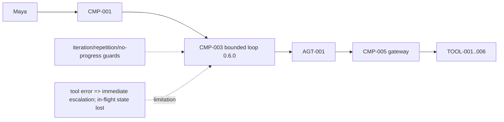
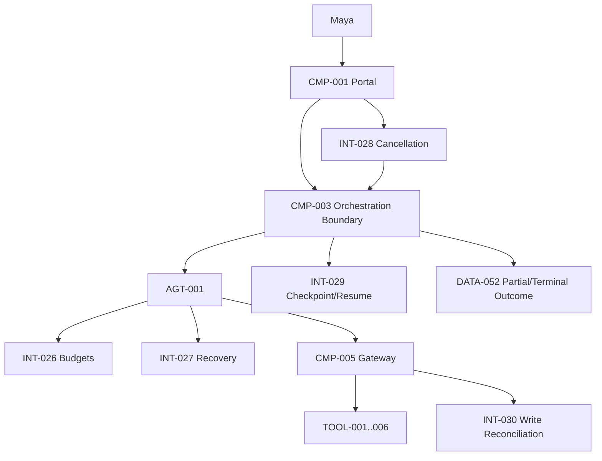
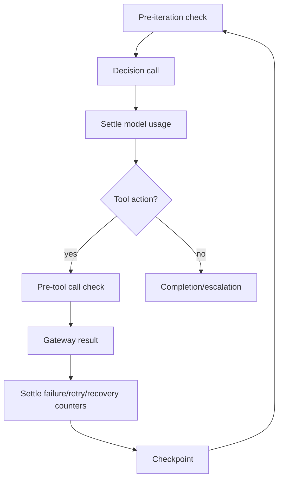

# Stage 3C — Loop Failures, Recovery and Budgets

**Stage identifier:** `S03C`  
**Architecture/repository/handoff version:** `0.7.0`  
**Execution date:** 2026-07-31  
**Verification boundary:** local/offline Python 3.13.5, deterministic and scripted providers, synthetic/public-safe data, six retained tools and reversible local writes. No live model, enterprise IAM/PDP, live connector, workflow engine, graph, memory, multiple agents, production audit or production deployment.

## 1. Context Carried Forward

NorthStar enters S03C with one accepted low-authority agent, `AGT-001 Regulatory Impact Assessment Agent`, and six executable capabilities behind `CMP-005`. S03B established an application-owned observation–action loop, explicit `DATA-009 AgentRunState`, structured `DATA-042 AgentDecision`, validated `DATA-043 AgentObservation`, deterministic completion invariants and three terminal categories. It also proved that provider output cannot grant authority, widen evidence permissions, set final disposition or bypass mandatory human review. The supplied S03B handoff identifies the precise unresolved problem: every tool failure immediately escalates, iteration count is the only resource budget, in-flight progress is lost on process failure, and ambiguous writes cannot be safely reconciled.

The constraints governing this stage are therefore strict:

- preserve `CMP-001`–`CMP-011`, `AGT-001`, `TOOL-001`–`TOOL-006`, `DATA-009`, `DATA-041`–`044`, `INT-021`–`025` and `ADR-001`–`023`;
- preserve the S01/S02 preliminary, evidence-backed, unapproved disposition and mandatory human review;
- preserve S02 authorization-before-scoring/text exposure and S03A gateway-only execution;
- preserve write idempotency and prohibit blind retries of writes whose commit status is unknown;
- keep all critical controls outside probabilistic reasoning; and
- stop before graph, harness, memory, MCP/A2A, multi-agent or production control-plane engineering.

This stage modifies `CMP-003`, `CMP-005`, `CMP-008`, `CMP-009`, `CMP-010`, all ten source-of-truth artefacts, the cumulative architecture and the existing repository. It allocates no new agent and no new tool.

> **Recorded reconstruction exception:** the byte-exact `0.6.0` archive and nine detailed registers were not mounted. The complete S03B handoff and chapter were used as the accepted reconstruction baseline. `ISS-029` records that this is a compatible `0.7.0` overlay, not a byte-identical continuation.

## 2. Narrative Development

Maya runs three investigations during Liam’s resilience review. In the first, the synthetic regulatory catalogue returns a temporary error. S03B escalates to Maya although a second registered read source is healthy. In the second, the draft-case tool times out after dispatch. The local case exists, but the caller never received a response. Retrying could create a duplicate; simply escalating leaves Maya uncertain about what happened. In the third, Maya presses Cancel after realizing that the wrong publication was selected. The loop has no cancellation signal, and a process stop would discard the progress already made.

Elena adds a fourth concern. A provider might use few iterations but thousands of input and output tokens, making an iteration limit a poor proxy for latency and cost. Sofia adds that retrying a denied request is not recovery—it is repeated policy violation. Marcus insists that fallback cannot mean “let the model pick another endpoint”; fallback must be pre-registered, authority-preserving and limited by side-effect class.

Priya reframes the problem. The agent should still pursue the goal, but it must do so inside an application-owned **runtime envelope**:

1. independent budgets define how much work may be attempted;
2. typed failure semantics determine whether recovery is even eligible;
3. retry, fallback and replan are finite, recorded and side-effect aware;
4. cancellation stops new work and produces a non-success outcome;
5. an ambiguous write is reconciled, not guessed;
6. every accepted transition is checkpointed; and
7. partial completion remains useful evidence, never an approval.

## 3. Problem Being Solved

### 3.1 Business problem

Immediate escalation on every transient failure increases analyst workload and makes the system brittle. Unbounded retry would be worse: it can multiply latency/cost and duplicate side effects. NorthStar needs enough resilience to continue safely when recovery is justified, while returning control to a human when correctness or commit status cannot be established.

### 3.2 Technical problem

The runtime must distinguish five questions that S03B treated as one:

1. **May the run spend more resources?**
2. **What kind of failure occurred and at what execution stage?**
3. **Is a retry/fallback/replan safe for this tool impact class?**
4. **Did an ambiguous write already commit?**
5. **Can the same run continue after cancellation or process failure without repeating completed work?**

### 3.3 Non-goals

S03C does not implement distributed durable execution, workflow leases, concurrent branches, graph routing, event sourcing, compensation execution, human-review processing, long-term memory, a second agent, circuit breakers across processes or disaster recovery. A local checkpoint demonstrates continuation but is not a workflow engine.

## 4. Requirements Introduced or Updated

S03C adds `FR-071`–`FR-083`, `NFR-055`–`NFR-064` and `CTL-033`–`CTL-042`. The requirements register provides the complete traceability matrix. The most important invariants are:

- every budget is deterministic and independently enforceable;
- model token/cost usage is accounted after each decision call;
- failure classification is application data, not model prose;
- read and write recovery policies differ;
- retries, failures and replans consume their own budgets;
- an unresolved ambiguous write never triggers a blind retry;
- cancellation never maps to completion;
- checkpoint resume preserves the same run/goal/agent/authority;
- partial outcomes enumerate missing milestones; and
- all terminal outcomes retain `preliminary_grounded_unapproved` and `human_review_required=true`.

## 5. Conceptual Explanation

### 5.1 Failure handling is a control system, not an exception handler

In plain language, failure handling decides whether to try again, try a registered alternative, change the approach, stop or ask a human. Technically, it combines four pieces of state:

```text
failure semantics + operation impact + remaining budgets + current progress
```

A generic `except Exception: retry()` block lacks all four. A model instruction such as “retry if useful” is worse because it delegates a side-effect and resource decision to probabilistic reasoning.

### 5.2 Independent runtime budgets

S03C treats each resource as independent:

| Budget | What it limits | Why iteration count is insufficient |
|---|---|---|
| Iteration | Agent decisions | One decision can be cheap or extremely expensive. |
| Wall time | End-to-end elapsed time | A few calls can hang or wait on slow dependencies. |
| Input tokens | Context/prompt consumption | Context size can grow while steps stay constant. |
| Output tokens | Model generation | A provider can be verbose in one step. |
| Total tokens | Combined model volume | Prevents shifting consumption between input/output. |
| Cost | Monetary exposure | Different providers/models have different tariffs. |
| Tool calls | Dependency/side-effect pressure | One iteration could call multiple tools in later designs. |
| Model calls | Provider pressure | Fallback attempts are additional calls. |
| Failures | Unhealthy-run tolerance | Prevents endless churn across different dependencies. |
| Retries | Repeated attempt pressure | Separates first attempts from repeats. |
| Replans | Dead-end search breadth | Prevents semantic thrashing. |

`DATA-045` contains limits; `DATA-046` contains monotonic usage. Time uses a monotonic clock so wall-clock adjustments do not create negative elapsed time. Provider-reported token usage is settled after a response. A production implementation should reserve conservative capacity before an in-flight request and reconcile actual usage afterward; this local implementation checks capacity before a call and settles exact synthetic usage after it.

The local cost ledger uses **micro-CAD** and an explicit tutorial tariff of 2 micro-CAD per input token and 6 micro-CAD per output token. This is not a vendor price or benchmark. It exists to prove deterministic cost-budget mechanics.

### 5.3 Failure taxonomy

`DATA-047 FailureEnvelope` separates:

- `transient`: temporary dependency/network condition;
- `rate_limited`: capacity/quota response that may succeed later;
- `timeout`: deadline exceeded before or during execution;
- `authorization`: identity/policy denied the operation;
- `validation`: malformed arguments or output;
- `permanent`: known non-recoverable business/dependency failure;
- `dependency`: no adapter or required service;
- `ambiguous_write`: call was dispatched and the intended side effect may or may not have committed;
- `cancelled`: run owner/runtime requested stop.

It also records execution stage (`before_dispatch`, `after_dispatch`, `response_validation`, `unknown`) and, where knowable, `committed=true/false/null`. Those fields—not the human-readable error message—drive recovery.

### 5.4 Retry, fallback and replan are different

- **Retry** repeats the same operation, usually with the same arguments and identity.
- **Tool fallback** invokes a pre-registered semantically equivalent adapter for the same read-only capability.
- **Model fallback** asks a second registered decision provider for the same bounded decision contract.
- **Replan** changes the next proposed action/arguments after a dead end while preserving the goal and authority.
- **Reconciliation** asks an authoritative status source whether an ambiguous write committed.
- **Compensation** applies an explicit inverse business action; it is not the same as retry or deletion.

NorthStar records each as `DATA-048 RecoveryRecord` so Liam can distinguish actual resilience from silent repeated calls.

### 5.5 Safe retry depends on failure and side effect

AWS and Google engineering guidance emphasize that retries need timeouts/backoff and must account for idempotency [S2]–[S4]. RFC 9110’s formal definition is useful: an idempotent operation has the same intended effect when repeated, although logs/history can still differ [S5]. NorthStar applies that principle to tool contracts.

The selected matrix is deliberately conservative:

| Failure | Read-only tool | Reversible write |
|---|---|---|
| Transient/rate-limit/pre-dispatch timeout | Retry or one registered fallback within budgets | Retry only when `committed=false` and `stage=before_dispatch`, with same idempotency key |
| Authorization/validation/permanent | No retry; escalate | No retry; escalate |
| Post-dispatch timeout/unknown commit | Retry may be safe if the read is idempotent and dependency permits | Reconcile by idempotency key; committed → use artifact, unknown → escalate |
| Cancellation | Stop new work | Stop; preserve/reconcile partial state |

Backoff is capped and budgeted. The local fixture skips real sleeping to keep tests fast but records retry/fallback decisions. Production should add jitter to avoid synchronized retry storms [S2].

### 5.6 Ambiguous writes

An ambiguous write is the hardest local failure. Suppose `TOOL-004` creates `CASE-001`, but the response is lost. Three unsafe responses are common:

1. assume failure and retry with a new key → possible duplicate case;
2. assume success and continue → possible missing case;
3. ask the model what probably happened → no evidence.

S03C instead calls `INT-030` with the exact tool and application-generated idempotency key. If the authoritative store returns the artifact, the runtime creates a reconciled success observation. If it says not committed, a later policy may permit one same-key retry. If status is unknown, the run escalates as `ambiguous_write_unresolved`. The model cannot choose this rule.

### 5.7 Dead-end recovery

A dead end occurs when valid actions produce no new validated milestone or repeat an already blocked action. S03B stopped immediately. S03C permits up to `max_replans` bounded replans. The current action signature is blocklisted, a recovery hint is added, and the provider must produce a materially different canonical action or eventually hit the guard. This is not tree search; it is a small finite escape hatch.

### 5.8 Cancellation

Cancellation is cooperative. `DATA-049` is checked before a new decision, tool call and retry. The local synchronous adapter cannot forcibly interrupt arbitrary blocking native/network code; production adapters should expose cancellation/deadline semantics. Python’s asynchronous task documentation similarly treats cancellation as a request delivered at cooperative suspension points [S1].

A cancelled run returns `status=cancelled`, its exact reason, completed/missing milestones, artifacts and recovery ledger. It never reports success.

### 5.9 Checkpoint and resume

`INT-029` writes `DATA-050` after accepted decisions, observations, recovery actions and terminal transitions. The local store serializes `DATA-009`, computes SHA-256, writes a temporary file, calls `fsync` and replaces the target. Python documents `fsync` and replacement primitives used here [S6].

On resume, the runtime validates checkpoint schema and checksum, retains the same `run_id`, marks `resumed_from_checkpoint=true` and continues from missing milestones. Completed tool work is not reissued. This is current-state checkpointing, not event sourcing or distributed durable execution. Temporal and similar workflow systems provide much broader replay/resumption guarantees [S8]; those belong to the next architectural stage.

### 5.10 Partial completion

A resource or recovery stop may still produce valuable authorized evidence. `DATA-052` therefore includes:

- terminal/partial status and exact reason;
- completed and missing milestones;
- linked local artifacts;
- complete budget ledger;
- concise recovery records;
- mandatory human-review flag; and
- fixed unapproved disposition.

Partial completion is not “best-effort success.” It is structured evidence for Maya to decide whether to resume, adjust scope or continue manually.

## 6. When This Capability Is Required

Use this runtime envelope when a bounded agent:

- calls remote or failure-prone dependencies;
- can spend variable tokens/time/cost;
- has reversible side effects protected by idempotency;
- benefits from recovering transient read failures;
- needs a safe response to cancellation;
- may run long enough for process failure to matter;
- has deterministic progress/completion criteria; and
- must explain why it retried, fell back, stopped or resumed.

NorthStar meets all these conditions even in its synthetic local stage.

## 7. When It Is Not Required

Do not build this recovery layer when:

- a single deterministic function call is sufficient;
- all work is local, fast and side-effect free;
- the caller can cheaply retry the whole operation idempotently;
- no authoritative reconciliation exists for writes;
- a workflow engine already provides accepted organization-wide retry/checkpoint semantics; or
- recovery complexity exceeds the business value and immediate human control is preferable.

A retry policy should also be disabled for authorization and validation errors until the request or policy changes.

## 8. Architecture Options

| Option | Strengths | Weaknesses for NorthStar | Decision |
|---|---|---|---|
| Immediate escalation | Safest and simplest | Operationally brittle; wastes recoverable progress | Rejected as sole policy |
| Retry every exception | Easy to implement | Duplicate writes, retry storms, policy violations | Rejected |
| Provider/framework defaults | Fast adoption | Provider-specific, weak business semantics, may hide authority | Deferred |
| Durable workflow engine now | Strong persistence/retry/timers | Premature; introduces graph/workflow semantics beyond S03C | Deferred |
| Application-owned typed recovery + local checkpoint | Explicit, provider-neutral, testable, preserves gateway | More code; local durability only | **Selected** |

## 9. Decision Matrix

Scores: 1 weak, 5 strong for the present stage.

| Criterion | Immediate escalation | Retry-all | Framework defaults | Durable engine now | Typed local envelope |
|---|---:|---:|---:|---:|---:|
| Side-effect safety | 5 | 1 | 3 | 5 | **5** |
| Failure-semantic visibility | 3 | 1 | 3 | 5 | **5** |
| Provider neutrality | 5 | 5 | 2 | 4 | **5** |
| Local/offline testability | 5 | 5 | 2 | 2 | **5** |
| Independent budgets | 1 | 2 | 3 | 5 | **5** |
| Crash continuation | 1 | 1 | 2 | 5 | 3 |
| Current complexity fit | 5 | 4 | 3 | 1 | **5** |
| Production durability | 1 | 1 | 2 | 5 | 1 |

The selection is recorded in `ADR-024`–`ADR-026`.

## 10. Selected Architecture and Rationale

NorthStar extends the same application-owned single loop rather than replacing it. Four modules are added under `CMP-003`:

- `budgets.py` implements `INT-026`;
- `recovery.py` implements `INT-027`;
- `cancellation.py` implements `INT-028`;
- `checkpoint.py` implements `INT-029`.

`CMP-005` keeps tool execution and adds an application-owned reconciliation path. The decision provider receives only bounded state and recovery hints; it does not receive budget setters, credentials, adapter names or reconciliation functions.

This design is chosen because it addresses the exact failure exposed by S03B while preserving the smallest architecture that can be executed and reasoned about locally.

## 11. Architecture Before the Change



## 12. Architecture After the Change



The cumulative source is `docs/architecture/diagrams/stage-3c-cumulative-logical-architecture.mmd`.

## 13. Detailed Component Design

### 13.1 Budget manager

The manager owns all counters and exact stop reasons. It checks wall time before each decision/tool call, increments tool calls before dispatch, settles tokens/cost after provider response, and increments failures/retries/replans only when those events occur. A budget exception terminates the run as `terminated_guard/<exact_reason>`.

Important ordering rule: the runtime persists the decision before execution, then persists the observation/recovery result. This creates enough evidence to know what was proposed and what was observed without claiming transactional atomicity across an external tool and local checkpoint.

### 13.2 Provider fallback chain

Providers are tried in configured order only when a typed `DecisionProviderError` says the failure is retryable and the failure/retry/model-call/time budgets remain. Every provider implements the same `INT-022` contract. The fallback cannot return a broader decision schema or tool set.

### 13.3 Recovery manager

The recovery manager receives a validated `ToolInvocationRequest`, tool impact class and `DATA-047`. It chooses one of:

- return success;
- schedule bounded retry;
- switch once to a configured read fallback;
- reconcile ambiguous write;
- return non-retryable failure; or
- allow a budget exception to stop the run.

It never changes trusted principal or arguments except using the same application idempotency key for a safe retry.

### 13.4 Checkpoint store

The local checkpoint store is append-overwrite current state, not an append-only log. It provides:

- one file per run;
- temp-file write and replacement;
- SHA-256 checksum of canonical state JSON;
- schema checks on load;
- `checkpoint_sequence` for diagnostics; and
- resume marker in state.

It does not provide concurrent writer arbitration or external side-effect atomicity.

### 13.5 Compensation boundary

NorthStar does not automatically delete a draft merely because later work failed. That artifact may be required for investigation and reconciliation. S03C can record a compensation plan in future, but execution requires an authoritative inverse tool, explicit approval, separation of duties and evidence retention. `AGT-001` has no compensation authority.

## 14. Data, State and Interface Design

### 14.1 `DATA-009` schema evolution

`DATA-009` advances to `1.1.0`, adding:

- `DATA-045 budget`;
- `DATA-046 ledger`;
- recovery records;
- blocked action signatures;
- no-progress/repetition counters;
- checkpoint sequence; and
- resumed flag.

The original goal, decision, observation, milestone, artifact, status, termination and disposition fields remain.

### 14.2 Budget lifecycle



### 14.3 Failure envelope example

```json
{
  "kind": "ambiguous_write",
  "code": "timeout_after_dispatch",
  "message": "timeout after dispatch",
  "retryable": false,
  "stage": "after_dispatch",
  "committed": null,
  "tool_id": "TOOL-004",
  "idempotency_key": "<application-generated-sha256>"
}
```

### 14.4 Recovery evidence example

```json
{
  "action": "reconcile_write",
  "reason": "artifact_found",
  "attempt": 1,
  "tool_id": "TOOL-004",
  "outcome": "committed"
}
```

This is concise evidence, not hidden chain-of-thought.

## 15. Implementation

### 15.1 Framework-independent production loop

```python
state = load_checkpoint_or_create(goal, trusted_principal, runtime_budget)

while state.running:
    cancellation.raise_if_cancelled()
    budgets.check_before_iteration(state)

    decision, usage = decision_provider_chain.decide(bounded_state(state))
    budgets.settle_model_usage(usage)
    checkpoint(state.with_decision(decision))

    if decision.is_terminal:
        evaluate_application_owned_completion_or_escalation()
        break

    validate_agent_allowlist_and_tool_contract(decision)
    if repeated_or_dead_end(decision, state):
        bounded_replan_or_guard_stop()
        continue

    budgets.check_before_tool_call()
    result = gateway.invoke(bind_trusted_principal_and_idempotency(decision))

    if result.failed:
        failure = classify(result)
        budgets.record_failure()
        result = recover_by_failure_and_impact(failure, result)

    observation = project_validated_result(result)
    update_monotonic_state(state, observation)
    checkpoint(state)

persist_partial_or_terminal_outcome(state)
```

### 15.2 Executable budget code

```python
class BudgetManager:
    def before_iteration(self) -> None:
        self.check_wall_time()
        if ledger.iterations >= limits.max_iterations:
            raise BudgetExceeded("iteration_budget_exhausted")
        if ledger.model_calls >= limits.max_model_calls:
            raise BudgetExceeded("model_call_budget_exhausted")

    def settle_model_usage(self, usage: ModelUsage) -> None:
        ledger.input_tokens += usage.input_tokens
        ledger.output_tokens += usage.output_tokens
        ledger.cost_micro_cad += input_rate * usage.input_tokens + output_rate * usage.output_tokens
        enforce_all_token_and_cost_limits()
```

### 15.3 Executable ambiguous-write path

```python
if failure.kind == "ambiguous_write":
    found = reconciler(tool_id, idempotency_key)
    if found is None:
        return unresolved_failure  # no blind retry
    return ToolResult(status="success", payload=found | {"_reconciled": True})
```

### 15.4 Checkpoint path

```python
body_bytes = canonical_json(state)
envelope = {"checkpoint_schema": "1.0.0", "sha256": sha256(body_bytes), "state": state}
write_temp(envelope)
os.fsync(temp_fd)
os.replace(temp_path, checkpoint_path)
```

### 15.5 Local execution

```bash
python -m venv .venv
source .venv/bin/activate
pip install -e '.[dev]'
pytest -q
python scripts/run_stage3c_demo.py
python scripts/run_stage3c_evaluation.py
python scripts/validate_stage3c.py
python scripts/consistency_audit_stage3c.py
```

Expected happy path:

```text
status=completed
termination_reason=goal_complete
iterations=7
model_calls=7
tool_calls=6
input_tokens=635
output_tokens=156
cost_micro_cad=2206
final_disposition=preliminary_grounded_unapproved
human_review_required=true
```

These are deterministic local fixture measurements, not production benchmarks.

## 16. Code and Repository Changes

### Files added

- `agent/budgets.py`, `agent/cancellation.py`, `agent/recovery.py`;
- `state/checkpoint.py`;
- `DATA-045`–`DATA-052` JSON Schemas;
- runtime budget configuration;
- three ADRs;
- six focused/cumulative Mermaid diagrams;
- Stage 3C tests/evaluation/validation scripts;
- technical references and this chapter.

### Files modified/reconstructed

- `agent/models.py`, `agent/decision.py`, `agent/runtime.py`, `agent/factory.py`;
- `tools/gateway.py`, `tools/local_tools.py`;
- package metadata, README, changelog;
- all ten source-of-truth artefacts.

### Files retired

None.

### Compatibility note

This package reconstructs the accepted S03B contract surface because the byte-exact archive was unavailable. It preserves IDs, authority, tools, completion invariants and unapproved semantics but does not claim line-for-line compatibility with the prior package.

## 17. Security and Governance Implications

### 17.1 Controls strengthened

- resource limits cannot be altered by the provider;
- provider/tool fallback is configuration-controlled;
- authorization and validation failures are non-retryable;
- write reconciliation uses the original idempotency key;
- no fallback is permitted for write tools;
- cancellation and partial outcomes remain non-success;
- checkpoint checksum/schema are validated before resume;
- authority-like model arguments remain rejected;
- restricted evidence remains absent for Maya;
- final disposition remains fixed and human review mandatory.

### 17.2 New attack and misuse cases

**Cost-exhaustion attack:** malicious content causes long model outputs or repeated tools. Mitigation: token/cost/tool/failure/replan budgets and action blocking.

**Retry storm:** dependency outage causes synchronized retries. Mitigation: bounded attempts, time/failure budgets; production requires backoff+jitter and circuit breakers.

**Fallback downgrade:** attacker induces primary failure to force a weaker/staler fallback. Mitigation: read-only registered equivalence, evidence validation, fallback telemetry and no authority change.

**Checkpoint tampering:** local actor edits state to add milestones or broaden agent identity. Mitigation: checksum/schema validation; residual risk remains because checksum is not a keyed signature.

**Reconciliation spoofing:** compromised adapter claims a write committed. Mitigation: authoritative connector status, same audience/identity and future signed evidence; local fixture cannot prove this.

### 17.3 Governance meaning

Recovery success means the technical loop safely continued; it does not increase confidence in regulatory interpretation. A reconciled draft remains `draft_unapproved`. Daniel, Sofia and Aisha remain accountable for review and acceptance.

## 18. Performance, Concurrency and Cost Implications

### 18.1 Latency model

```text
L_run = Σ(model_call + validation + tool_call + projection + checkpoint)
      + Σ(backoff + fallback + reconciliation)
```

Recovery increases successful completion probability but adds tail latency. The relevant metric is not only mean latency; NorthStar must later measure P95/P99 by failure class.

### 18.2 Cost model

```text
C_run = C_model_tokens + C_tool_calls + C_retries + C_fallbacks
      + C_checkpoint + C_evaluation + C_human_review
```

```text
Cost per completed task = total cost of completed + failed + escalated runs
                          / number of correctly completed tasks
```

A cheap run that produces an incorrect or duplicate case is not cost-efficient. S03C therefore budgets cost together with failure and side-effect safety.

### 18.3 Concurrency

The runtime remains single-run and sequential. The cancellation token is thread-safe, but the checkpoint store has no multi-process lock or lease. There is no safe concurrent resume of the same run. Parallel branches and distributed cancellation are deferred.

### 18.4 Local measured result

The deterministic happy path completed with seven model decisions, six tool calls, 635 input tokens, 156 output tokens and 2,206 synthetic micro-CAD. The number is useful only to verify ledger arithmetic.

## 19. Evaluation and Test Cases

### 19.1 Executed test inventory

| Test | Purpose | Result |
|---|---|---|
| `TEST-088` | Total-token budget | Passed |
| `TEST-089` | Cost budget | Passed |
| `TEST-090` | Tool-call budget | Passed |
| `TEST-091` | Checkpoint round trip | Passed |
| `TEST-092` | Tamper/checksum detection | Passed |
| `TEST-093` | Happy path and unapproved semantics | Passed |
| `TEST-094` | Transient read fallback | Passed |
| `TEST-095` | Ambiguous write reconciliation/no duplicate | Passed |
| `TEST-096` | Model fallback | Passed |
| `TEST-097` | Tool budget partial outcome | Passed |
| `TEST-098` | Failure budget | Passed |
| `TEST-099` | Resume without repeated completed work | Passed |
| `TEST-100` | External cancellation | Passed |
| `TEST-101` | No-progress bounded replan | Passed |
| `TEST-102` | Authority-like argument rejection | Passed |
| `TEST-103` | Non-allowlisted tool blocked | Passed |
| `TEST-104` | Restricted Borealis evidence absent | Passed |
| `TEST-105` | Write-scope denial | Passed |
| `TEST-106` | Recovery/efficiency metrics | Passed |
| `TEST-107` | Exactly one agent boundary | Passed |
| `TEST-108` | Wall-time budget | Passed |
| `TEST-109` | Retry budget | Passed |

Executed result: **22 tests passed**.

### 19.2 Evaluation scenarios

| Evaluation | Scenario | Result |
|---|---|---|
| `EVAL-022` | Normal run | `completed/goal_complete` |
| `EVAL-023` | Primary read transient failure | Fallback used; completed |
| `EVAL-024` | `TOOL-004` timeout after commit | Reconciled one draft; completed |
| `EVAL-025` | Primary decision-provider timeout | Secondary provider used; completed |
| `EVAL-026` | Tool-call budget of two | `terminated_guard/tool_call_budget_exhausted`, partial milestones preserved |

### 19.3 Metrics

- recovery success rate by failure class;
- retries/fallbacks/replans per completed task;
- duplicate side effects after ambiguous writes;
- budget termination accuracy;
- checkpoint resume accuracy;
- cancellation responsiveness at cooperative boundaries;
- token/cost ledger accuracy;
- partial-outcome usefulness;
- permission leakage and authority violations;
- loop efficiency before/after recovery.

The local evaluation proves control behavior, not legal interpretation, provider planning quality, distributed reliability or production SLOs.

## 20. Failure Scenarios and Recovery

### Scenario 1 — Transient regulatory catalogue outage

**Detection:** `DATA-047 kind=transient`, pre-dispatch, retryable.  
**Containment:** failure and retry budgets increment.  
**Recovery:** switch once to registered read fallback; validate result through the same tool contract.  
**Evidence:** `tool_fallback` recovery record, adapter name and resulting milestone.  
**Residual risk:** fallback freshness/semantic drift.

### Scenario 2 — Authorization denial

**Detection:** `kind=authorization`.  
**Containment:** no retry or fallback; no adapter side effect.  
**Recovery:** escalate for identity/policy correction.  
**Evidence:** exact denial and zero retry count.  
**Reason:** repeated denial is not transient recovery.

### Scenario 3 — Model-provider timeout

**Detection:** typed retryable `DecisionProviderError`.  
**Containment:** failure/model-call/retry budgets apply.  
**Recovery:** one configured provider fallback returning the same `INT-022` schema.  
**Residual risk:** fallback model quality differs; future evaluation required.

### Scenario 4 — Ambiguous draft-case write

**Detection:** timeout after dispatch with `committed=null`.  
**Containment:** no automatic write retry.  
**Recovery:** status lookup by tool and idempotency key finds one draft; convert to reconciled success.  
**Evidence:** reconciliation records and one stored draft.  
**Unknown status:** escalate `ambiguous_write_unresolved`.

### Scenario 5 — Tool-call budget exhaustion

**Detection:** pre-call ledger check after two calls.  
**Containment:** no third call.  
**Recovery:** return partial evidence, completed/missing milestones and exact budget ledger.  
**Disposition:** still unapproved and human-reviewed.

### Scenario 6 — Dead end

**Detection:** successful calls add no new milestone or repeat a blocked signature.  
**Containment:** block canonical action signature.  
**Recovery:** consume one replan budget and provide a recovery hint; guard-stop when exhausted.  
**Risk:** replan can still produce semantically equivalent work with different arguments; later graph/evaluation needed.

### Scenario 7 — External cancellation

**Detection:** token observed before next work unit.  
**Containment:** no new decision/tool/retry begins.  
**Recovery:** checkpoint and return `cancelled/<reason>`.  
**Limitation:** cannot forcibly interrupt arbitrary blocking synchronous code.

### Scenario 8 — Process stop and resume

**Detection:** caller sees a running checkpoint without terminal outcome.  
**Containment:** checksum/schema validation.  
**Recovery:** resume same run from missing milestones; completed reads are not repeated in the local test.  
**Limitation:** concurrent resumers and distributed side effects are unsupported.

### Scenario 9 — Checkpoint tampering

**Detection:** SHA-256 mismatch.  
**Containment:** fail load; do not run altered state.  
**Recovery:** manual investigation and source reconstruction.  
**Limitation:** unauthenticated checksum cannot defend against an attacker who can rewrite both state and checksum.

### Scenario 10 — Retry budget exhaustion

**Detection:** next safe retry would exceed `max_retries`.  
**Containment:** no retry dispatch.  
**Recovery:** terminate guard with exact reason; preserve partial state.  
**Operational response:** investigate dependency health rather than raising limits blindly.

## 21. Architecture Decision Records

- `ADR-024`: application-owned independent runtime budgets and monotonic ledger.
- `ADR-025`: typed recovery combining failure class and tool impact; bounded fallback/replan; reconcile ambiguous writes.
- `ADR-026`: atomic local checkpoint/resume without claiming distributed durable execution or audit.

No previous ADR is superseded.

## 22. Requirements Traceability Update

Every new requirement traces to an application component/interface, executable data object, deterministic control, one or more tests and an ADR. The mapping is in `02-Requirements-Register.md`. The most important closed local traces are:

- `FR-071` → budget manager → `TEST-088/089/090/108/109`;
- `FR-076` → registered read fallback → `TEST-094`;
- `FR-080` → same-key reconciliation → `TEST-095`;
- `FR-081` → atomic checkpoint/resume → `TEST-091/092/099`;
- `FR-078` → cancellation token → `TEST-100`;
- `NFR-064` → no graph/memory/second agent → structural validator and `TEST-107`.

## 23. Stage Outcome

NorthStar’s single agent can now survive selected transient failures without losing its security boundaries. It can enforce independent resource budgets, account token/cost usage, classify failures, retry or fall back only when safe, escape a bounded dead end, reconcile an ambiguous reversible write, stop cooperatively on cancellation, return partial evidence and resume a validated local checkpoint. It still produces only an unapproved package for human review.

## 24. Known Limitations

1. Decision and token usage are deterministic/scripted; no managed model is live-tested.
2. Tool data and adapters are synthetic/local.
3. Cost tariff is a tutorial assumption, not actual provider billing.
4. No reservation for worst-case in-flight model/tool cost; production must add it.
5. Backoff is not slept/jittered in tests; no circuit breaker or shared retry quota.
6. Cancellation is cooperative and cannot kill arbitrary blocking calls.
7. Checkpoint is local current state, not event sourcing, audit, distributed durable execution or DR.
8. No multi-process lease or concurrent resume protection.
9. Reconciliation is authoritative only within the local fixture.
10. Compensation execution is deliberately absent.
11. Principal claims/policy decisions/checkpoints are unsigned and unauthenticated.
12. No production concurrency, tail-latency, throughput, failure-rate or cost benchmark.
13. Mermaid was statically reviewed but not rendered by Mermaid CLI.
14. The exact S03B archive/registers were unavailable (`ISS-029`).

## 25. Narrative Bridge to the Next Stage

Maya’s resumed run now finishes without duplicating the draft, and Liam can explain each retry, fallback, budget decision and checkpoint. The improvement exposes a different limitation: the loop’s control logic has become a growing nest of conditional branches. Deterministic intake, evidence retrieval, policy mapping, risk checks, human waiting, recovery and termination paths are now mixed in one imperative loop. Some steps should never be model-selected; some can run only after specific prerequisites; some need explicit error edges, checkpoint ownership and human-approval states.

The next architectural problem is therefore not more recovery policy. NorthStar needs an explicit typed execution graph that separates deterministic nodes, model nodes, tool nodes, policy nodes, recovery paths and human gates while preserving the S03C budgets and failure semantics.

That unresolved problem motivates **Stage 4A — Graph Foundations and Typed Execution State**. S03C stops here and does not implement that graph.

## 26. Updated Source-of-Truth Artefacts

All ten artefacts are updated to `0.7.0`:

1. Constitution — S03C invariants and definition of done.
2. Business/User Story — resilience narrative and acceptance criteria.
3. Requirements — `FR-071`–`083`, `NFR-055`–`064`, `CTL-033`–`042` and traceability.
4. Architecture — before/after, recovery, budget, state and trust boundaries.
5. Component/Agent Catalogue — no new agent/tool; component responsibilities extended.
6. Data/Schema Register — `DATA-045`–`052`, `INT-026`–`030`, `DATA-009` schema `1.1.0`.
7. ADR Register — `ADR-024`–`026`.
8. Repository Manifest — repository `0.7.0`, commands and compatibility.
9. Risk/Assumption/Issue Register — `RSK-057`–`066`, `ASM-022`–`024`, `ISS-029`–`031`.
10. Stage Handoff Pack — complete `S03C` reconstruction and exact next-stage instruction.

## Stage Consistency Audit

**Result: Passed with recorded exceptions.**

Validated by executed scripts and inspection:

- narrative begins with the exact S03B failure/budget limitation;
- `CMP-001`–`CMP-011`, `AGT-001` and `TOOL-001`–`006` names/authority remain unchanged;
- code, diagrams, schemas and registers agree on `DATA-045`–`052` and `INT-026`–`030`;
- exactly one agent exists and no graph/memory/multi-agent package is present;
- all agent actions continue through `CMP-005`;
- model output cannot alter principal, write scope, budgets, retry safety, completion or final disposition;
- authorization/validation errors are not retried;
- ambiguous write recovery performs reconciliation and creates one draft;
- checkpoint corruption fails before resume;
- resumed execution does not repeat completed local reads in the executed test;
- all partial/terminal outcomes remain human-reviewed and unapproved;
- 22 pytest tests, compilation, demo, evaluation, structural validation and consistency audit pass; and
- repository/version/path references are synchronized.

Recorded exceptions: `ISS-014`, `ISS-015`, `ISS-021`–`ISS-031` and inherited production gaps. Mermaid CLI rendering, live provider/connectors, enterprise identity/PDP, distributed durability and production benchmarks remain unverified.

## References

See `docs/references/Stage-3C-Technical-Sources.md` for [S1]–[S8].

## 27. Stage Handoff Pack

The authoritative handoff is `docs/source-of-truth/09-Stage-Handoff-Pack.md` and is reproduced below in the exported Stage 3C handoff file.


# Stage Handoff Pack

## A. Stage completed

- **Stage identifier:** `S03C`
- **Stage title:** Loop Failures, Recovery and Budgets
- **Architecture version:** `0.7.0`
- **Repository version:** `0.7.0`
- **Handoff version:** `0.7.0`
- **Completion date:** 2026-07-31
- **Status:** Completed within the local/offline synthetic verification boundary.
- **Consistency audit:** Passed with recorded exceptions `ISS-014`, `ISS-015`, `ISS-021`–`ISS-031` and inherited production gaps.

## B. Capabilities now available

1. All S03B one-agent, gateway-only, deterministic-completion and unapproved/human-review capabilities remain.
2. `DATA-045 RuntimeBudget` and `DATA-046 BudgetLedger` enforce independent iteration, wall-time, input/output/total token, synthetic CAD cost, tool-call, model-call, failure, retry and replan limits.
3. `DATA-047 FailureEnvelope` and `INT-027` classify failures by kind, execution stage, retryability and known commit state.
4. Bounded provider fallback preserves `INT-022` and agent authority.
5. Read-only `TOOL-001`–`TOOL-003` may use one configured fallback adapter; write-tool fallback is prohibited.
6. Reversible writes may retry only after definite pre-dispatch non-commit with the same idempotency key.
7. Ambiguous write failures use `INT-030` reconciliation by tool and idempotency key; unresolved status escalates without blind retry.
8. Repetition/no-progress can trigger finite replanning with blocked canonical action signatures.
9. `INT-028` cooperative cancellation stops new work and returns a non-success partial outcome.
10. `INT-029` persists checksummed atomic local checkpoints and resumes the same run from missing milestones.
11. `DATA-052` records partial/terminal milestones, artifacts, budget ledger and concise recovery evidence.
12. Compensation boundaries are defined; autonomous compensation execution is not implemented.
13. Twenty-two S03C tests and five evaluations passed locally.

Not implemented: graph/workflow engine, durable distributed execution, event sourcing, concurrent branches, memory, multiple agents, live model/connectors, enterprise identity/PDP, actual human review, accepted mapping/case, production telemetry/audit/records, compensation execution, production concurrency/deployment/DR.

## C. Accepted architecture decisions

`ADR-001`–`ADR-023` remain accepted.

- `ADR-024`: application-owned independent budgets and monotonic usage ledger.
- `ADR-025`: typed failure recovery combining failure class and operation impact; bounded model/read fallback; no blind ambiguous-write retry.
- `ADR-026`: atomic checksummed local checkpoint/resume without claiming graph, event sourcing, audit or distributed durable execution.

## D. Current component inventory

| ID | Name | Current responsibility/status |
|---|---|---|
| `CMP-001` | Analyst Experience Portal | Local run/cancel/resume caller and partial-outcome viewer. |
| `CMP-002` | Regulatory Intake Boundary | Retained. |
| `CMP-003` | Case and Workflow Orchestration Boundary | One-agent runtime with budgets, recovery, cancellation, checkpoint and deterministic termination. |
| `CMP-004` | Knowledge and Evidence Access Boundary | Retained synthetic authorized evidence. |
| `CMP-005` | Enterprise Integration Boundary | Gateway, registered read fallback and write reconciliation. |
| `CMP-006` | Human Review and Approval Boundary | Local queued request only; no decision service. |
| `CMP-007` | Identity, Authorization and Policy Boundary | Partial unauthenticated local principal/write-scope enforcement. |
| `CMP-008` | Evaluation and Assurance Boundary | Budget/recovery/cancellation/resume tests and evaluations. |
| `CMP-009` | Observability and Audit Boundary | Local checkpoints/outcomes only; not audit. |
| `CMP-010` | Runtime and Deployment Boundary | Python 3.13.5 single-process local runtime. |
| `CMP-011` | Source-of-Truth Governance Pack | Implemented at `0.7.0`. |

## E. Current agent inventory

| ID | Name | Authority | Status |
|---|---|---|---|
| `AGT-001` | Regulatory Impact Assessment Agent | May propose one of `TOOL-001`–`006`, complete or escalate. Cannot set budgets/retries/fallbacks/reconciliation, approve/finalize, compensate, delegate, create agents, execute code or handle unrestricted credentials. | Implemented and locally verified. |

## F. Current data and state objects

- `DATA-001`–`DATA-044` retained.
- `DATA-009 AgentRunState` schema `1.1.0` adds budget/recovery/checkpoint fields compatibly.
- New: `DATA-045 RuntimeBudget`, `DATA-046 BudgetLedger`, `DATA-047 FailureEnvelope`, `DATA-048 RecoveryRecord`, `DATA-049 CancellationSignal`, `DATA-050 RunCheckpoint`, `DATA-051 ReconciliationRecord`, `DATA-052 RecoveryOutcome`.
- No enterprise `DATA-002 RegulatoryCase` or `DATA-007 ReviewDecision` is instantiated. Local drafts/mappings/review requests remain reversible unapproved artifacts.

## G. Current interfaces and tools

- `INT-001`–`INT-025` retained.
- `INT-026` Budget Enforcement Contract.
- `INT-027` Failure Classification and Recovery Contract.
- `INT-028` Cancellation Contract.
- `INT-029` Checkpoint and Resume Contract.
- `INT-030` Ambiguous Write Reconciliation Contract.
- `TOOL-001`–`003` read-only; `TOOL-004`–`006` reversible unapproved writes.
- Every action continues through `INT-017`/`CMP-005`; provider/fallback schemas are adapters, not authority.

## H. Repository state

Repository `northstar-agentic-compliance` version `0.7.0`. Important entry points:

```text
src/northstar_compliance/agent/{models,budgets,cancellation,decision,recovery,termination,runtime,factory}.py
src/northstar_compliance/tools/{gateway,local_tools}.py
src/northstar_compliance/state/checkpoint.py
config/runtime/stage3c-budget.json
schemas/DATA-045...DATA-052*.schema.json
scripts/run_stage3c_demo.py
scripts/run_stage3c_evaluation.py
scripts/validate_stage3c.py
scripts/consistency_audit_stage3c.py
tests/{unit,integration,security,evaluation}/
docs/stages/Stage-3C-Loop-Failures-Recovery-and-Budgets.md
```

## I. Tests completed

- `TEST-088`–`090`: token, cost and tool-call budgets — passed.
- `TEST-091`–`092`: checkpoint round trip and tamper detection — passed.
- `TEST-093`: happy path/unapproved semantics — passed.
- `TEST-094`: transient read fallback — passed.
- `TEST-095`: ambiguous write reconciliation/no duplicate — passed.
- `TEST-096`: model fallback — passed.
- `TEST-097`–`098`: partial outcome and failure budget — passed.
- `TEST-099`: checkpoint resume without repeated completed work — passed.
- `TEST-100`: external cancellation — passed.
- `TEST-101`: bounded dead-end replan — passed.
- `TEST-102`–`105`: authority, allowlist, evidence and write-scope boundaries — passed.
- `TEST-106`: recovery/efficiency metrics — passed.
- `TEST-107`: exactly one agent/no future-stage modules — passed.
- `TEST-108`–`109`: wall-time and retry budgets — passed.

Executed result: **22 tests passed**. Compilation, demo, evaluation, structural validator and consistency audit passed.

Evaluations:

| ID | Result |
|---|---|
| `EVAL-022` | Normal run completed. |
| `EVAL-023` | Transient primary read used fallback and completed. |
| `EVAL-024` | Draft timeout after commit reconciled one artifact and completed. |
| `EVAL-025` | Primary provider timeout used secondary provider and completed. |
| `EVAL-026` | Tool-call budget stopped with exact reason and partial milestones. |

## J. Known limitations

1. Deterministic/scripted decision providers and synthetic token usage only.
2. Synthetic/local tools and status stores only.
3. Synthetic CAD tariff; no live provider billing.
4. No worst-case in-flight budget reservation.
5. No real backoff/jitter, circuit breaker or shared retry quota in local tests.
6. Cooperative cancellation only.
7. Local current-state checkpoint, not event sourcing/audit/distributed workflow/DR.
8. No multi-process lease or concurrent resume.
9. Reconciliation not live-connector verified.
10. Compensation execution absent.
11. Unsigned local identity/policy/checkpoint evidence.
12. No production latency/concurrency/throughput/failure/cost benchmark.
13. Mermaid not rendered by CLI.
14. Compatible overlay rather than byte-exact `0.6.0` continuation (`ISS-029`).

## K. Open risks, assumptions and issues

- New risks: `RSK-057`–`RSK-066`.
- New assumptions: `ASM-022`–`ASM-024`.
- New issues: `ISS-029`–`ISS-031`.
- Inherited active risks/issues remain.

## L. Compatibility constraints

1. Preserve NorthStar, all eight personas, `US-001`–`US-012`, `CMP-001`–`CMP-011` and accepted meanings.
2. Preserve S01/S02 unapproved/human-accountability and authorization-before-context semantics.
3. Preserve S03A `TOOL-001`–`006`, gateway-only execution, impact classes and idempotency.
4. Preserve `AGT-001` as the only agent and its low authority.
5. Preserve `DATA-009` `1.1.0`, `DATA-041`–`052`, `INT-021`–`030` ownership and semantics.
6. Budgets, failure classification, fallback selection, retry safety, reconciliation, completion and final disposition remain application-owned.
7. Never blindly retry an ambiguous write; reconcile by the same idempotency key or escalate.
8. Partial/guard/cancel outcomes remain `preliminary_grounded_unapproved` and require human review.
9. Checkpoints are not memory, audit, event sourcing or exactly-once guarantees.
10. The next stage may introduce a graph but must preserve S03C budget/recovery contracts and must not add multiple agents or memory unless separately justified.

## M. Required input for the next stage

Reconstruct all ten `0.7.0` artefacts, `ADR-001`–`026`, `DATA-009` `1.1.0`, `DATA-019`–`052`, `INT-009`–`030`, `TOOL-001`–`006`, `AGT-001`, cumulative/focused diagrams, S03C code/tests/evaluations, S01 disposition invariants, S02 permission boundary, S03A gateway invariants and active risks/issues.

## N. Next architectural problem

Budget and recovery logic now works, but the imperative loop contains increasingly complex branches for deterministic prerequisites, model decisions, tool calls, recovery, waiting and termination. NorthStar needs an explicit typed execution graph so node/edge ownership, error routes, checkpoints and future human approval can be reviewed and tested independently. The graph must reuse S03C budgets/recovery rather than replacing them.

## O. Exact continuation instruction

> Continue the NorthStar Agentic AI Architecture Playbook by executing only **Stage 4A — Graph Foundations and Typed Execution State**. Reconstruct the `0.7.0` baseline; preserve `AGT-001`, `TOOL-001`–`TOOL-006`, gateway-only authority, `DATA-045`–`052`, `INT-026`–`030`, deterministic completion, unapproved/human-review semantics and no blind ambiguous-write retry. Convert the increasingly branched single loop into an explicit typed graph with deterministic/model/tool/policy/recovery nodes and conditional/error/termination edges, while stopping before harness, memory or multi-agent engineering. Update all artefacts, tests and handoff, perform the consistency audit and stop after this stage.
