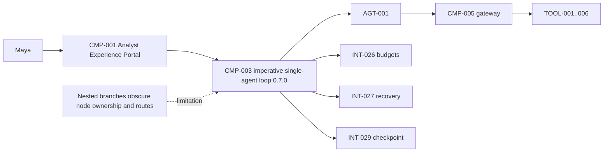
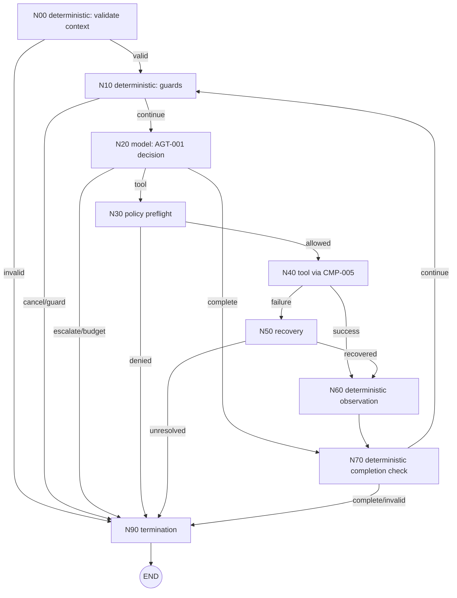
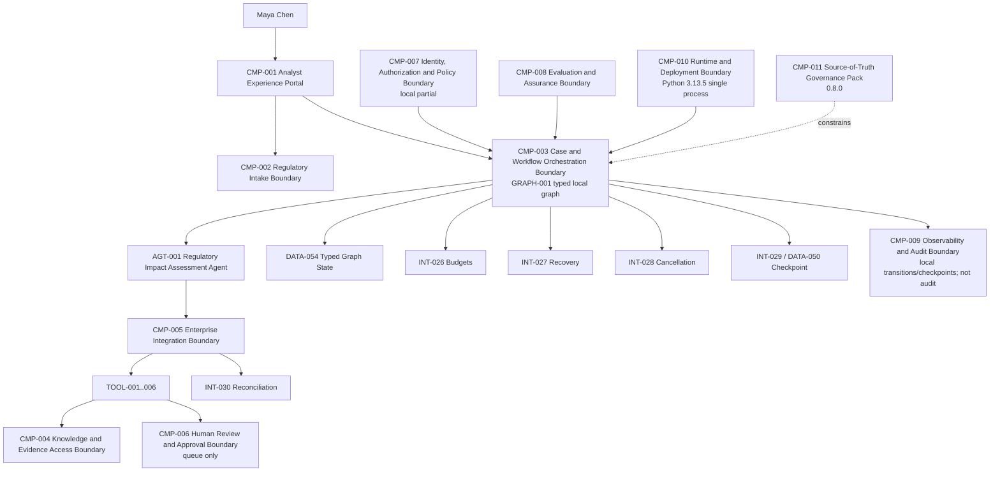
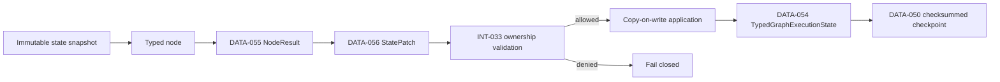

# Stage 4A — Graph Foundations and Typed State

**Stage identifier:** `S04A`  
**Architecture/repository/handoff version:** `0.8.0`  
**Execution date:** 2026-07-31  
**Verification boundary:** local/offline Python 3.13.5, one deterministic decision provider, synthetic/public-safe data, six retained gateway tools, sequential single-process execution and checksummed local current-state checkpoints. No live model, enterprise IAM/PDP, live connector, actual human review decision, distributed durable workflow, event sourcing, memory, harness, concurrency or multiple agents.

## 1. Context Carried Forward

NorthStar enters Stage 4A at architecture version `0.7.0`. The system has one accepted low-authority agent, `AGT-001 Regulatory Impact Assessment Agent`, six controlled capabilities (`TOOL-001`–`TOOL-006`) behind `CMP-005 Enterprise Integration Boundary`, application-owned completion, independent budgets, typed recovery, cooperative cancellation, ambiguous-write reconciliation and checksummed local checkpoint/resume. The successful S03C run can recover a transient read, reconcile a timed-out draft write, stop on exact budget reasons and return a partial or terminal `preliminary_grounded_unapproved` outcome requiring human review.

Those controls are preserved without reinterpretation:

- `CMP-001`–`CMP-011` and their accepted names remain unchanged;
- `AGT-001` remains the only agent and cannot set route, budget, recovery, authorization, approval or final disposition;
- every action continues through `INT-017` and `CMP-005`;
- `DATA-009 AgentRunState` remains schema `1.1.0`;
- `DATA-045`–`DATA-052` and `INT-026`–`INT-030` retain S03C ownership and semantics;
- authorization remains deterministic and precedes evidence exposure/tool execution;
- an ambiguous write is reconciled with the same idempotency key or escalated, never blindly retried; and
- all outputs remain preliminary, grounded, unapproved and human-review-bound.

The unresolved problem is structural rather than functional. The S03C runtime works, but deterministic prerequisites, model decisions, policy checks, tool dispatch, failure recovery, milestone projection, completion validation and termination are now nested branches inside an imperative loop. Priya Raman cannot review one route without mentally executing the whole function. Sofia Alvarez cannot measure path coverage independently. Liam O’Connor cannot point to a stable control state when diagnosing a checkpoint. Marcus Green cannot prove from the orchestration structure that a model cannot jump directly to a write or terminal state.

S04A therefore modifies `CMP-003`, `CMP-008`, `CMP-009`, `CMP-010`, all ten source-of-truth artefacts, the cumulative architecture, repository, schemas, ADRs, tests and handoff. It allocates no new agent and no new tool.

> **Reconstruction exception:** the authoritative S03C handoff and prior exported Stage 3C records were available, but the byte-exact `0.7.0` repository and nine individual registers were not mounted. `ISS-032` records this package as a compatible `0.8.0` overlay, not a line-for-line continuation.

## 2. Narrative Development

Maya resumes a regulatory assessment after a synthetic draft timeout. The run safely reconciles the draft and finishes. Liam shows the recovery evidence to Priya, but the explanation depends on walking through many `if` branches:

1. Was cancellation requested?
2. Is there budget left?
3. Did the model propose a tool, completion or escalation?
4. Is the tool allowed?
5. Did the gateway succeed?
6. Is the failure recoverable?
7. Did recovery produce a valid observation?
8. Did the observation create progress?
9. Are all completion invariants satisfied?
10. Should execution continue, escalate or terminate?

Elena notes that each question belongs to a different engineering concern. A model decision should not be implemented beside authorization. A recovery rule should not share mutation logic with business milestone projection. A terminal state should not be a string set from several unrelated branches.

Marcus adds a security requirement: a node may update only the state it owns. The model node may append a structured proposal and model usage, but it may not alter principal claims, allowed tools, budgets, final disposition or human-review requirements. The tool node may record a gateway result, but it may not convert that result into an accepted milestone. The recovery node may reconcile a write, but it may not approve the resulting draft.

Sofia adds an assurance requirement: every possible route must be named, reachable, bounded and testable. A missing route should fail closed before a run begins or immediately at runtime; it must not fall through to an accidental default.

Priya selects the smallest capability that satisfies those concerns: an explicit, versioned, typed execution graph owned by the application. The graph makes control flow visible. It does not increase `AGT-001` authority, add another agent or claim production workflow durability.

## 3. Problem Being Solved

### 3.1 Business problem

NorthStar must demonstrate that AI-assisted regulatory work follows reviewable controls. The S03C loop can produce the right result, but its control structure is difficult to inspect, explain and independently test as branches grow. That increases change risk and makes future human approval placement ambiguous.

### 3.2 Technical problem

The runtime needs first-class answers to six questions:

1. **Which execution states exist?**
2. **Who owns each state transition and mutation?**
3. **Which routes are possible from each node?**
4. **Which routes represent success, policy denial, failure, recovery, cancellation and termination?**
5. **What exact state is checkpointed and resumed?**
6. **How is graph compatibility enforced when definitions change?**

### 3.3 Non-goals

S04A does not implement:

- a live human approval decision or long-running wait;
- durable timers, leases, queues or distributed workers;
- event sourcing, deterministic workflow replay or exactly-once execution;
- concurrent branches, fan-out/fan-in or parallel tool calls;
- graph migration for running workflows;
- compensation execution;
- memory or context engineering;
- an agent harness;
- multiple agents, delegation, MCP or A2A; or
- production observability, audit, deployment or disaster recovery.

These exclusions are deliberate. A graph is introduced because current control flow needs explicit structure—not because every production workflow feature is required now.

## 4. Requirements Introduced or Updated

S04A adds `FR-084`–`FR-095`, `NFR-065`–`NFR-074` and `CTL-043`–`CTL-050`. The complete register and traceability table are in `02-Requirements-Register.md`.

The central requirements are:

- define a versioned graph with deterministic, model, policy, tool, recovery and termination nodes;
- validate graph structure before execution;
- wrap, not replace, `DATA-009 AgentRunState`;
- give every node an explicit owned-state allowlist;
- require typed node results and state patches;
- keep routing application-owned and independent of free-form model output;
- preserve gateway-only tool execution and S03C recovery;
- checkpoint after every accepted transition;
- bind resume to graph ID and version;
- bound graph transitions independently of model/tool budgets; and
- preserve the six-milestone unapproved completion invariant.

No prior identifier is renamed or renumbered.

## 5. Conceptual Explanation

### 5.1 What is an execution graph?

In plain language, an execution graph is a map of the states a process may visit and the allowed routes between them. Each node performs one bounded responsibility. Each edge says what may happen next.

Technically, NorthStar defines a directed cyclic state graph:

```text
G = (V, E, S, R, T)
```

where:

- `V` is the set of typed nodes;
- `E` is the set of named directed routes;
- `S` is the typed execution state;
- `R` is the application-owned routing relation `(source_node, route) -> target_node`; and
- `T` is the set of terminal nodes.

The graph is cyclic because a successful observation can return to the guard and model-decision nodes until all required milestones exist. It is not an unrestricted cycle: S03C iteration/model/tool/failure/retry budgets still apply, and S04A adds an independent graph-transition limit.

### 5.2 Graph versus agent

The graph and the agent solve different problems:

- `AGT-001` proposes what capability may advance the goal.
- `GRAPH-001` controls where that proposal is validated, authorized, executed, observed, recovered and terminated.

A graph node containing a model call is not a new agent. A deterministic node is not an agent. A tool node is not an agent. NorthStar still has one goal-owning agent with one authority envelope.

### 5.3 Graph versus workflow engine

A graph is a control-flow model. A workflow engine is an operational system that may add persistence, timers, workers, retries, leases, queues, history and replay. S04A implements the model and a small local executor. It does not claim the guarantees of Temporal, AWS Step Functions or another managed/durable engine.

### 5.4 Node types

NorthStar uses six node types in this stage:

| Type | Purpose | NorthStar node(s) |
|---|---|---|
| Deterministic | Validate invariants, check guards, project results and evaluate completion. | `N00`, `N10`, `N60`, `N70` |
| Model | Ask `AGT-001` for one structured proposal. | `N20` |
| Policy | Preflight allowlist/scope invariants before gateway dispatch. | `N30` |
| Tool | Invoke an accepted capability only through `CMP-005`. | `N40` |
| Recovery | Apply S03C failure-class/impact recovery, fallback or reconciliation. | `N50` |
| Termination | Convert the accepted run state into a terminal graph state. | `N90` |

The policy node does not replace the gateway policy decision. It makes orchestration prerequisites visible; `CMP-005` remains authoritative and rechecks the call.

### 5.5 Edge types

The graph uses named routes rather than implicit truthy/falsy fall-through:

- deterministic routes: `valid`, `continue`, `observed`, `end`;
- model routes: `tool`, `complete`, `escalate`, `budget_stop`;
- policy routes: `allowed`, `denied`;
- tool routes: `success`, `failure`, `budget_stop`;
- recovery routes: `recovered`, `unresolved`;
- guard routes: `cancelled`, `guard_stop`; and
- completion routes: `complete`, `invalid_completion`, `continue`.

Each `(source, route)` pair has exactly one target. Unknown routes fail closed.

### 5.6 Typed state

`DATA-054 TypedGraphExecutionState` contains:

- graph ID/version and current node;
- the unchanged `DATA-009 AgentRunState` `1.1.0`;
- ordered `DATA-057` transition records;
- one pending decision;
- one pending tool result;
- one pending failure; and
- local graph status.

The graph state is not conversation memory. It contains structured runtime facts needed to continue the current run.

### 5.7 State ownership and patches

Each node receives a snapshot and returns `DATA-055 GraphNodeResult`:

```json
{
  "route": "success",
  "patch": {
    "operations": {
      "pending_result": {"status": "success", "payload": {}},
      "run_state.ledger": {"tool_calls": 1}
    }
  },
  "evidence": {"tool_id": "TOOL-001"}
}
```

The runtime—not the node—applies the patch. `INT-033` checks the node's exact owned paths. Protected fields such as principal, allowed tools, budgets, goal, agent ID, final disposition and human-review flag cannot be patched by any node in S04A.

This is copy-on-write current-state mutation, not event sourcing. The previous state snapshot remains unchanged in the executing function, but the runtime does not persist every field-level event as an authoritative append-only history.

### 5.8 Transition records

Every accepted node result produces `DATA-057`:

```json
{
  "sequence": 17,
  "source_node": "N40_TOOL_EXECUTE",
  "node_type": "tool",
  "route": "failure",
  "target_node": "N50_RECOVERY",
  "evidence_summary": {
    "tool_id": "TOOL-004",
    "failure_kind": "ambiguous_write"
  }
}
```

The evidence summary is concise and auditable without requiring hidden chain-of-thought. It is local execution evidence, not a production audit record.

### 5.9 Checkpoint and graph version

After each accepted transition, `DATA-050` stores the complete `DATA-054` payload with:

- checkpoint schema;
- graph ID/version;
- SHA-256 of canonical state JSON; and
- atomic temp-write/`fsync`/replace semantics.

Resume fails if the checksum, graph ID or graph version differs. This prevents silently loading a checkpoint into a changed route topology. S04A does not migrate an in-flight state to a new graph version.

## 6. When This Capability Is Required

Use an explicit graph when:

- control flow contains multiple deterministic/model/tool/policy concerns;
- the same node can produce materially different routes;
- loops need explicit bounds and reviewable exits;
- failures need dedicated routes rather than generic exception handling;
- checkpoint position must be meaningful;
- human approval or waiting states will be introduced later;
- path coverage and forbidden transitions must be evaluated; or
- operators need to know exactly where execution stopped.

NorthStar meets these conditions. The imperative loop has already accumulated budgets, recovery, cancellation, reconciliation, completion and partial outcomes.

## 7. When It Is Not Required

Do not add a graph merely because the application calls an LLM. A normal function or short deterministic sequence remains preferable when:

- there is one request and one response;
- all steps are fixed and have no meaningful branching;
- a single transaction already provides clear control flow;
- checkpoint/resume is unnecessary;
- the business process is too unstable to specify even coarse states; or
- a mature workflow platform already expresses the accepted process and adding a second graph would duplicate control.

A graph can be harmful when every trivial line becomes a node, state mutation remains hidden, route names are vague, cycles are unbounded or the diagram is treated as a substitute for authorization and tool controls.

## 8. Architecture Options

### Option A — Keep the imperative loop

**Strengths:** minimum code, direct debugging, no new abstraction.  
**Weaknesses:** branch ownership and path coverage remain implicit; future waits and migrations become harder.

### Option B — Add only a finite-state enum

**Strengths:** names major states with little code.  
**Weaknesses:** does not define node contracts, state ownership, edge routes or patch semantics.

### Option C — Adopt a graph framework now

A graph framework such as LangGraph provides shared state, nodes, fixed/conditional edges and execution utilities. This is a credible later option. Adopting it now would add framework reducers, checkpoint abstractions and version compatibility before NorthStar has established its own control semantics.

### Option D — Adopt a managed state machine now

AWS Step Functions or a comparable service provides declarative states, choices, waits, retries and managed operation. It would immediately impose cloud/runtime/deployment choices and would not by itself define NorthStar's agent authority, gateway or unapproved disposition.

### Option E — Adopt a durable workflow engine now

Temporal or a comparable platform offers strong long-running workflow resumption and operational features. It is attractive when durable timers, workers, failures across infrastructure and long waits become requirements. S04A has not yet implemented those needs.

### Option F — Application-owned typed local graph kernel

**Strengths:** explicit, inspectable, framework-neutral, local/offline and directly aligned to existing S03C controls.  
**Weaknesses:** NorthStar owns the executor; no production durability, timers, workers or tooling.

**Selected for S04A.**

## 9. Decision Matrix

Scores are 1 (weak) to 5 (strong) for the current stage, not universal product rankings.

| Criterion | Imperative loop | State enum | Graph framework now | Managed state machine | Durable workflow engine | Typed local graph |
|---|---:|---:|---:|---:|---:|---:|
| Explicit node/edge ownership | 1 | 2 | 5 | 5 | 5 | **5** |
| Preserve current app-owned controls | 5 | 5 | 3 | 3 | 4 | **5** |
| Local/offline execution | 5 | 5 | 4 | 1 | 2 | **5** |
| Dependency/operational simplicity | 5 | 5 | 3 | 2 | 2 | **4** |
| Path-level testing | 2 | 2 | 5 | 5 | 5 | **5** |
| Durable long-running execution | 1 | 1 | 3 | 5 | 5 | 1 |
| Human wait/timer support | 1 | 1 | 3 | 5 | 5 | 1 |
| Current teaching fit | 2 | 3 | 4 | 2 | 2 | **5** |
| Vendor/framework neutrality | 5 | 5 | 2 | 1 | 2 | **5** |
| Production operational maturity | 1 | 1 | 3 | 5 | 5 | 1 |

The decision is recorded in `ADR-027`–`ADR-029`.

## 10. Selected Architecture and Rationale

NorthStar implements `GRAPH-001 Regulatory Impact Assessment Execution Graph` inside `CMP-003`. The graph is loaded from versioned JSON, validated before execution and run by a small standard-library Python kernel.

The selection has four defining rules:

1. **The graph owns orchestration, not authority.** `AGT-001`, budgets, recovery, gateway authorization, completion and disposition retain their existing owners.
2. **Nodes return proposals for state mutation.** The runtime validates and applies patches; nodes do not share an unrestricted mutable dictionary.
3. **Edges are application-owned.** The model may return `kind=tool|complete|escalate`; it cannot name the next node.
4. **Checkpoint compatibility is explicit.** Resume requires the same graph ID/version.

A framework is deliberately deferred. This lets NorthStar first prove which semantics must survive any future framework mapping.

## 11. Architecture Before the Change



The architecture has the required controls, but their ordering is encoded inside one loop rather than a reviewable graph definition.

## 12. Architecture After the Change

### 12.1 Focused execution graph



### 12.2 Cumulative logical architecture



The change is confined to orchestration structure and graph state. Existing capability, identity, policy, evidence and human-accountability boundaries remain.

## 13. Detailed Component Design

### 13.1 `GRAPH-001` definition validator

`INT-031` validates before runtime creation:

- unique node IDs;
- existing entry and terminal nodes;
- known edge sources/targets;
- unique `(source, route)` pairs;
- reachability of every node from the entry; and
- an explicit `end -> __END__` route for every terminal node.

A malformed deployment artifact fails before a business run begins.

### 13.2 Node registry

The executor maps accepted node IDs to code. The JSON definition cannot import arbitrary code or name a dynamic Python function. This keeps the graph configuration declarative and allowlisted in the local stage.

### 13.3 Graph runtime

For each transition, the runtime:

1. loads the current node definition;
2. calls the registered node with the current snapshot and bounded context;
3. validates the returned state patch against node-owned paths;
4. resolves `(source_node, route)` in the static edge table;
5. records `DATA-057`;
6. updates `current_node`; and
7. persists `DATA-050` when checkpointing is configured.

If no route exists, execution raises `GraphRoutingError`; it does not infer a target.

### 13.4 Node context

The node context supplies only application services required by nodes:

- `ToolGateway`;
- the provider implementing `INT-022`;
- cooperative cancellation signal; and
- run-scoped monotonic start time for wall-time budgets.

It does not expose credentials, direct adapters, approval decisions or arbitrary storage.

### 13.5 Model node

`N20_MODEL_DECIDE` performs exactly one bounded provider call. It settles synthetic model usage through `INT-026` and stores a structured `AgentDecision`. Its owned paths are limited to:

- pending decision;
- decision history;
- budget ledger; and
- guard termination if a budget is exhausted.

It cannot mutate milestones, artifacts, principal, tool allowlist or final disposition.

### 13.6 Policy node

`N30_POLICY_GATE` makes the route to tool execution explicit. It checks the agent tool allowlist, write scope and authority-like arguments. The gateway repeats authoritative validation and policy. This is defense in depth, not duplicated ownership.

### 13.7 Tool node

`N40_TOOL_EXECUTE` increments the tool budget before dispatch and calls only `CMP-005`. It stores either a typed result or `DATA-047 FailureEnvelope`. It does not project a successful payload into business milestones.

### 13.8 Recovery node

`N50_RECOVERY` reuses S03C rules:

- one registered fallback for eligible read-only transient failure;
- no fallback for writes;
- ambiguous write reconciliation by exact tool and original idempotency key;
- no retry for authorization, validation or permanent failure; and
- unresolved recovery terminates as escalation/non-success.

The model neither selects nor configures the recovery action.

### 13.9 Observation node

`N60_OBSERVE` is the only node that projects a validated tool payload into monotonic milestones and linked local artifacts. A successful transport response without the expected artifact does not automatically create progress.

### 13.10 Completion node

`N70_COMPLETION_CHECK` applies the S03B/S03C invariant:

- all six milestones exist;
- case is `draft_unapproved` and requires review;
- mapping is `candidate_unapproved`;
- review request is `queued_for_human_review` and requires review; and
- case identifiers match.

A provider's `complete` proposal without those facts routes to `invalid_completion` and escalation.

### 13.11 Termination node

`N90_TERMINATE` produces a terminal graph state while retaining the fixed disposition and human-review requirement. It does not approve or finalize a compliance assessment.

## 14. Data, State and Interface Design

### 14.1 New data objects

| ID | Name | Purpose |
|---|---|---|
| `DATA-053` | ExecutionGraphDefinition | Versioned nodes, node types, owned paths, entry/terminal nodes and route table. |
| `DATA-054` | TypedGraphExecutionState | Graph metadata plus unchanged `DATA-009`, pending values and transitions. |
| `DATA-055` | GraphNodeResult | Route, typed patch and concise evidence. |
| `DATA-056` | GraphStatePatch | Exact path/value operations proposed by a node. |
| `DATA-057` | GraphTransitionRecord | Ordered source/type/route/target/evidence record. |

### 14.2 New interfaces

| ID | Contract | Owner |
|---|---|---|
| `INT-031` | Graph Definition Validation | `CMP-003` |
| `INT-032` | Node Execution | Node/runtime boundary |
| `INT-033` | State Patch Application | `CMP-003` runtime |
| `INT-034` | Transition Routing | `CMP-003` route table |
| `INT-035` | Graph Run and Resume | `CMP-001` → `CMP-003` |

### 14.3 State ownership matrix

| Node | Permitted mutation examples | Explicitly prohibited examples |
|---|---|---|
| `N00` | terminal status/reason on invalid baseline | principal, budget, artifacts |
| `N10` | cancel/guard status/reason | decisions, tool result, authority |
| `N20` | pending decision, decision list, ledger | milestones, artifacts, routes, principal |
| `N30` | denial status/reason | gateway result, write scope |
| `N40` | pending result/failure, ledger | milestone acceptance, recovery selection |
| `N50` | recovery records, reconciled result, ledger | approval, direct business milestone |
| `N60` | observations, milestones, artifacts | authority, budget limits, route table |
| `N70` | completion status/reason | artifacts, principal, final disposition |
| `N90` | graph/run terminal status/reason | approval, evidence, authority |

### 14.4 Protected paths

`INT-033` rejects mutation of:

```text
run_state.principal
run_state.allowed_tools
run_state.budget
run_state.agent_id
run_state.goal
run_state.final_disposition
run_state.human_review_required
graph_id
graph_version
```

Future stages may add carefully governed owners, but S04A has no node authorized to change them.

### 14.5 Typed-state flow



## 15. Implementation

### 15.1 Framework-independent graph executor

The complete implementation is in `src/northstar_compliance/graph/`. The core runtime is intentionally small:

```python
class GraphRuntime:
    def run(self, state, *, stop_after_transitions=None):
        if state.graph_id != self.graph.graph_id \
                or state.graph_version != self.graph.graph_version:
            raise GraphRoutingError("state_graph_version_mismatch")

        while state.current_node != "__END__":
            if stop_after_transitions is not None \
                    and len(state.transitions) >= stop_after_transitions:
                break

            node = self.nodes[state.current_node]
            result = NODE_FUNCTIONS[node.node_id](state, self.context)
            next_state = apply_patch(state, node, result.patch)

            target = self.edges.get((node.node_id, result.route))
            if target is None:
                raise GraphRoutingError(
                    f"unroutable_result:{node.node_id}:{result.route}"
                )

            next_state.transitions.append(
                transition_record(node, result, target)
            )
            next_state.current_node = target
            state = next_state

            if self.checkpoint_store:
                self.checkpoint_store.save(state)

        return state
```

### 15.2 Patch enforcement

```python
PROTECTED_PATHS = {
    "run_state.principal",
    "run_state.allowed_tools",
    "run_state.budget",
    "run_state.agent_id",
    "run_state.goal",
    "run_state.final_disposition",
    "run_state.human_review_required",
    "graph_id",
    "graph_version",
}


def apply_patch(state, node, patch):
    new_state = copy.deepcopy(state)
    allowed = set(node.owned_paths)
    for path, value in patch.operations.items():
        if path in PROTECTED_PATHS or path not in allowed:
            raise PatchOwnershipError(
                f"node {node.node_id} cannot mutate {path}"
            )
        set_typed_path(new_state, path, value)
    return new_state
```

Python type annotations improve tooling and readability but are not runtime validation by themselves. NorthStar therefore combines typed dataclasses with explicit runtime path checks and JSON schemas.

### 15.3 Graph configuration excerpt

```json
{
  "graph_id": "GRAPH-001",
  "graph_version": "1.0.0",
  "entry_node": "N00_VALIDATE_CONTEXT",
  "terminal_nodes": ["N90_TERMINATE"],
  "edges": [
    {
      "source": "N40_TOOL_EXECUTE",
      "route": "failure",
      "target": "N50_RECOVERY"
    },
    {
      "source": "N50_RECOVERY",
      "route": "recovered",
      "target": "N60_OBSERVE"
    },
    {
      "source": "N50_RECOVERY",
      "route": "unresolved",
      "target": "N90_TERMINATE"
    }
  ]
}
```

### 15.4 Checkpoint compatibility

```python
if envelope["graph_id"] != graph_id:
    raise CheckpointError("graph_id_mismatch")
if envelope["graph_version"] != graph_version:
    raise CheckpointError("graph_version_mismatch")
if sha256(canonical(envelope["state"])) != envelope["sha256"]:
    raise CheckpointError("checkpoint_checksum_mismatch")
```

### 15.5 Local execution

```bash
python -m venv .venv
source .venv/bin/activate
pip install -e '.[dev]'
pytest -q
python scripts/run_stage4a_demo.py
python scripts/run_stage4a_evaluation.py
python scripts/validate_stage4a.py
python scripts/consistency_audit_stage4a.py
```

### 15.6 Executed happy-path result

```text
status=completed
termination_reason=goal_complete
graph_id=GRAPH-001
graph_version=1.0.0
transitions=41
model_calls=7
tool_calls=6
milestones=6
artifacts=case,mapping,review
final_disposition=preliminary_grounded_unapproved
human_review_required=true
```

These are deterministic fixture measurements, not production performance or quality benchmarks.

## 16. Code and Repository Changes

### Files added

```text
config/graph/stage4a-regulatory-impact-graph.json
src/northstar_compliance/graph/
  models.py
  definition.py
  state.py
  nodes.py
  runtime.py
  factory.py
schemas/DATA-053...DATA-057*.schema.json
docs/adr/ADR-027...ADR-029*.md
docs/architecture/diagrams/stage-4a-*.mmd
docs/references/Stage-4A-Technical-Sources.md
scripts/run_stage4a_demo.py
scripts/run_stage4a_evaluation.py
scripts/validate_stage4a.py
scripts/consistency_audit_stage4a.py
tests/unit/test_graph_definition.py
tests/unit/test_typed_state.py
tests/integration/test_graph_runtime.py
tests/integration/test_checkpoint_resume.py
tests/security/test_boundaries.py
tests/evaluation/test_graph_evaluation.py
```

### Files modified or reconstructed

- agent models, budgets, deterministic provider and termination evaluator;
- gateway and local synthetic write/reconciliation stores;
- local checkpoint store;
- cumulative architecture;
- README, package metadata and changelog; and
- all ten source-of-truth artefacts.

### Files retired

No accepted identifier or capability is retired. The imperative runtime implementation is superseded by the graph runtime; the S03C semantics it owned are preserved in graph nodes and application services.

### Compatibility notes

- Package target remains Python `>=3.11,<3.15`; executed on `3.13.5`.
- Runtime code uses the standard library only; pytest `9.0.2` is the test dependency.
- `DATA-009` remains `1.1.0`.
- `DATA-050` retains current-state checkpoint semantics.
- A running `GRAPH-001` checkpoint cannot be migrated to another graph version in S04A.
- The package is a compatible overlay due `ISS-032`.

## 17. Security and Governance Implications

### 17.1 Security controls strengthened

**Route control:** the model returns a decision kind, not a node name. Static application routing prevents arbitrary jumps.

**State mutation control:** node-owned path allowlists and protected paths prevent authority or disposition changes.

**Gateway preservation:** even after policy preflight, `CMP-005` performs authoritative validation, policy and idempotency.

**Recovery preservation:** model output cannot choose fallback, reconciliation or retry safety.

**Completion preservation:** a polished completion claim cannot bypass deterministic milestone/linkage checks.

**Version-bound resume:** a checkpoint cannot silently resume under a changed graph definition.

### 17.2 New threats

| Threat | Example | Control | Residual risk |
|---|---|---|---|
| Graph tampering | Deployment edits an edge to skip policy. | Trusted config assumption, validation, versioning, source control; signing deferred. | Local files unsigned. |
| Patch escalation | Model node patches `allow_writes`. | Protected path rejection. | New fields require allowlist maintenance. |
| Route injection | Provider returns `goto=N40`. | Provider schema has no arbitrary target; route table maps decision kind. | Parser bugs remain possible. |
| Cycle exhaustion | Repeated valid route never completes. | Graph transitions plus S03C budgets/stall logic. | Semantic dead ends still need evaluations. |
| Checkpoint downgrade | Old state loaded into changed graph. | Exact graph version match. | No migration strategy. |
| Policy-node confusion | Developers assume preflight is authoritative. | Gateway recheck and tests. | Documentation/operational drift. |

### 17.3 Governance implications

Graph definitions become governed artifacts with owner, version, review and test evidence. A future change to nodes, edges, owned paths, completion or approval placement must update:

- `DATA-053` version;
- ADRs where architectural meaning changes;
- path/security/evaluation tests;
- checkpoint migration/compatibility decision;
- cumulative diagrams; and
- source-of-truth registers.

Graph transition evidence is useful for assurance, but it is not yet an approved audit ledger or regulatory record.

## 18. Performance, Concurrency and Cost Implications

### 18.1 Latency

The graph kernel adds local overhead for:

- node lookup;
- patch copy/validation;
- route lookup;
- transition serialization; and
- checkpoint write after each transition.

For the local fixture, model/tool/checkpoint behavior dominates architectural meaning; no production latency claim is made. The happy path uses 41 graph transitions for seven model decisions and six tool calls.

### 18.2 Token and monetary cost

The graph does not inherently add model calls. `N00`, `N10`, `N30`, `N60`, `N70` and `N90` are deterministic. The happy path remains seven model calls. The synthetic micro-CAD tariff remains a tutorial mechanism, not provider pricing.

### 18.3 State-copy cost

Copy-on-write currently deep-copies the small local state. This favors clarity over scale. Large evidence payloads should remain referenced rather than embedded, and production implementations may need persistent structures, database transactions or framework reducers.

### 18.4 Checkpoint I/O

Checkpointing every transition improves local restart precision but increases write count. Production architects should select checkpoint frequency according to side-effect boundaries, recovery-point objectives, storage cost and workflow-engine guarantees. S04A keeps every-transition persistence for inspectability.

### 18.5 Concurrency

Execution is sequential. No two nodes mutate state concurrently, so race conditions, fan-out/fan-in and merge reducers are intentionally absent. This avoids claiming a concurrency model before Stage M/later substages.

### 18.6 Cost/performance controls retained

- independent model/tool/token/cost/failure/retry budgets;
- graph transition budget;
- early deterministic policy denial;
- no model call for routing after tool/recovery results;
- no duplicate ambiguous write; and
- resume from current node rather than replaying completed reads.

## 19. Evaluation and Test Cases

### 19.1 Executed test suite

`TEST-110`–`TEST-133` executed successfully: **24 tests passed**.

| Tests | Coverage | Result |
|---|---|---|
| `TEST-110`–`114` | Valid graph, duplicate node, unknown target, unreachable node, duplicate route. | Passed |
| `TEST-115`–`117` | Unauthorized patch, copy-on-write, final-disposition protection. | Passed |
| `TEST-118`–`119` | Happy path, completion invariants and node-type path. | Passed |
| `TEST-120` | Policy denial before any write gateway call. | Passed |
| `TEST-121` | Transient read uses registered fallback. | Passed |
| `TEST-122` | Ambiguous write reconciles one committed case. | Passed |
| `TEST-123` | Cancellation remains non-success/unapproved. | Passed |
| `TEST-124` | Graph transition budget. | Passed |
| `TEST-125`–`128` | Checkpoint round trip, no repeated completed work, graph-version mismatch, checksum tamper. | Passed |
| `TEST-129`–`131` | One agent/no future modules, gateway-only calls, restricted evidence absent. | Passed |
| `TEST-132` | Full recovery-path coverage and efficiency metrics. | Passed |
| `TEST-133` | Run-scoped wall-time budget. | Passed |

### 19.2 Evaluations

| ID | Scenario | Executed result |
|---|---|---|
| `EVAL-027` | Normal graph run/path. | Completed in 41 transitions; eight normal-path node IDs observed. |
| `EVAL-028` | Transient `TOOL-003` primary failure. | Registered fallback used; run completed. |
| `EVAL-029` | `TOOL-004` timeout after commit. | Reconciled; exactly one case record; run completed. |
| `EVAL-030` | Stop/checkpoint/resume. | Same run resumed; completed work was not repeated. |
| `EVAL-031` | Write scope denied. | Escalated at policy node after three read calls; no write call. |
| `EVAL-032` | Architectural boundary. | Nine nodes, one agent, zero harness/memory/multi-agent modules. |

### 19.3 Graph metrics introduced

- path completion rate;
- node and edge coverage;
- forbidden transition count;
- transition count per completed task;
- recovery-edge usage;
- invalid patch count;
- graph-version resume rejection count;
- checkpoint-to-resume success; and
- repeated completed-tool count after resume.

These supplement, not replace, S03C task success, budget, recovery and termination metrics.

## 20. Failure Scenarios and Recovery

### Scenario A — Invalid graph target

A deployment changes an edge target to `N99_UNKNOWN`.

- **Detection:** `INT-031` rejects the graph before runtime creation.
- **Containment:** no business run begins.
- **Recovery:** correct configuration, increment version if semantics changed and rerun graph/path tests.

### Scenario B — Model tries to grant itself write scope

The model result includes `allow_writes=true` in tool arguments or attempts a state patch.

- **Detection:** policy preflight rejects authority-like arguments; `INT-033` rejects protected paths.
- **Containment:** no write gateway call.
- **Recovery:** terminate/escalate and retain concise evidence.

### Scenario C — Missing route

A node implementation returns a route not declared for that node.

- **Detection:** runtime raises `unroutable_result`.
- **Containment:** no inferred/default target.
- **Recovery:** treat as implementation defect; add an explicit route only after design review and tests.

### Scenario D — Ambiguous draft write

`TOOL-004` commits but response times out.

```mermaid
sequenceDiagram
    participant G as CMP-003 Graph Runtime
    participant T as N40 Tool Node
    participant W as CMP-005 Gateway
    participant R as N50 Recovery Node
    participant C as INT-030 Reconciliation
    G->>T: Execute typed decision
    T->>W: Invoke TOOL-004 with same idempotency key
    W-->>T: ambiguous_write / after_dispatch
    T-->>G: route=failure
    G->>R: DATA-047 FailureEnvelope
    R->>C: reconcile(tool_id, idempotency_key)
    C-->>R: committed artifact
    R-->>G: route=recovered + DATA-048 record
    G->>G: Observe milestone; checkpoint transition
```

No blind retry occurs. If reconciliation returns unknown, the graph follows `unresolved -> N90`.

### Scenario E — Graph version changes after checkpoint

- **Detection:** load rejects `graph_version_mismatch`.
- **Containment:** state is not run through a topology with different semantics.
- **Recovery:** continue with the original deployment or perform a future explicit migration. S04A does not invent one.

### Scenario F — Graph cycle exhausts transition budget

- **Detection:** `N10` compares recorded transitions with `max_graph_transitions`.
- **Containment:** routes to `N90` with `terminated_guard/graph_transition_budget_exhausted`.
- **Recovery:** inspect path, decision/recovery records and adjust defect or scope; do not report success.

### Scenario G — Checkpoint tampering

- **Detection:** SHA-256 mismatch before state deserialization/resume.
- **Containment:** no node executes.
- **Recovery:** restore trusted checkpoint or restart manually; signed/WORM evidence is deferred.

## 21. Architecture Decision Records

S04A accepts three decisions. No earlier ADR is superseded.

- `ADR-027`: replace implicit imperative control flow with `GRAPH-001`, preserving one agent and existing authority.
- `ADR-028`: use a framework-neutral application-owned local graph kernel before selecting a framework or managed durable engine.
- `ADR-029`: use node-owned copy-on-write state patches and graph-version-bound current-state checkpoints.

The full records include context, alternatives, consequences, risks, mitigations and review triggers under `docs/adr/`.

## 22. Requirements Traceability Update

| Requirement | Components | Data/interfaces | Controls | Implementation | Tests/evaluations |
|---|---|---|---|---|---|
| `FR-084`–`086` | `CMP-003` | `DATA-053`, `INT-031`, `INT-034` | `CTL-043`, `045` | graph JSON, `definition.py`, `runtime.py` | `TEST-110`–`114`, `EVAL-027` |
| `FR-087`–`089` | `CMP-003` | `DATA-054`–`056`, `INT-032`–`033` | `CTL-044` | `models.py`, `state.py` | `TEST-115`–`117` |
| `FR-090` | `CMP-003`, `CMP-005`, `CMP-007` | `INT-017`, `INT-034` | `CTL-046` | `N30`, `N40`, gateway | `TEST-120`, `130`, `131`, `EVAL-031` |
| `FR-091` | `CMP-003`, `CMP-005` | `DATA-045`–`052`, `INT-026`–`030` | `CTL-047`, `048` | `N10`, `N20`, `N40`, `N50` | `TEST-121`–`124`, `133`, `EVAL-028`–`029` |
| `FR-092`–`094` | `CMP-003`, `CMP-009` | `DATA-050`, `DATA-057`, `INT-035` | `CTL-049` | `checkpoint.py`, `runtime.py` | `TEST-125`–`128`, `132`, `EVAL-030` |
| `FR-095` | `CMP-003`, `CMP-006` | `DATA-009`, `DATA-052` | `CTL-050` | `N70`, `N90`, `termination.py` | `TEST-118`, `123`, `129`, `EVAL-027`, `031` |

No requirement is declared production-complete beyond the local/offline verification boundary.

## 23. Stage Outcome

NorthStar can now:

1. express the single-agent runtime as a versioned typed execution graph;
2. validate graph structure before execution;
3. separate deterministic, model, policy, tool, recovery and termination ownership;
4. restrict every node to explicit state paths;
5. prevent the model from selecting arbitrary routes or changing authority;
6. route all tools through the existing gateway;
7. reuse S03C budgets, fallback and ambiguous-write reconciliation;
8. record each accepted graph transition;
9. checkpoint and resume the exact local graph position under the same version; and
10. preserve the same six-milestone, unapproved, human-review-required completion outcome.

It still cannot pause for and consume a real human decision, survive distributed infrastructure failures with durable timers/workers, migrate running workflows, run branches concurrently, or provide a reusable harness.

## 24. Known Limitations

1. Deterministic/scripted decision provider and synthetic token usage only.
2. Local synthetic tools and unauthenticated principal claims.
3. Sequential single-process graph; no parallel branches or workers.
4. Local current-state checkpoint, not event sourcing, audit, durable replay or DR.
5. No in-flight graph-version migration.
6. No actual human approval wait/decision; `TOOL-006` only queues a local request.
7. No durable timer, queue, lease, distributed lock or concurrent resume protection.
8. No compensation execution.
9. Graph configuration and checkpoints are unsigned local files.
10. Copy-on-write deep-copies small state and is not benchmarked at enterprise scale.
11. No live LangGraph, Step Functions, Temporal or other framework conformance test.
12. No production latency, throughput, concurrency, reliability or cost benchmark.
13. Mermaid sources were structurally reviewed but not rendered by Mermaid CLI.
14. Compatible overlay rather than byte-exact `0.7.0` continuation (`ISS-032`).
15. No harness, memory, multi-agent, MCP/A2A or production control plane.

## 25. Narrative Bridge to the Next Stage

Maya's graph now finishes and the team can inspect every route. Priya deliberately stops the implementation at the point where `TOOL-006` has queued a human review request. The graph does not yet enter a durable `waiting_for_human_review` state, release compute, enforce reviewer identity/separation of duties, handle approval expiry, consume a signed decision or resume through an approved/rejected branch.

Liam points out that a local checkpoint can preserve a node position, but it is not sufficient for a review that may take hours or days. A production-oriented wait requires durable correlation, a review contract, timeout/escalation policy, single-use decision handling and safe resumption. It must also preserve the existing unapproved semantics until an authorized human decision is actually received.

That unresolved problem motivates **Stage 4B — Human Approval, Waiting States and Durable Graph Resumption**. S04A stops here and does not implement the wait, approval decision, distributed workflow engine or harness.

## 26. Updated Source-of-Truth Artefacts

All ten artefacts are updated to `0.8.0`:

1. `00-Project-Constitution.md` — graph/state constitutional invariants and definition of done.
2. `01-Business-and-User-Story-Baseline.md` — graph narrative and acceptance criteria.
3. `02-Requirements-Register.md` — `FR-084`–`095`, `NFR-065`–`074`, `CTL-043`–`050` and traceability.
4. `03-Architecture-Baseline.md` — before/after architecture, graph ownership and cumulative diagram.
5. `04-Component-and-Agent-Catalogue.md` — component responsibilities extended; still one agent.
6. `05-Data-and-Schema-Register.md` — `DATA-053`–`057`, `INT-031`–`035`; prior semantics retained.
7. `06-ADR-Register.md` — `ADR-027`–`029`.
8. `07-Repository-Manifest.md` — repository `0.8.0`, files, commands and compatibility.
9. `08-Risk-Assumption-and-Issue-Register.md` — `RSK-067`–`076`, `ASM-025`–`027`, `ISS-032`–`035`.
10. `09-Stage-Handoff-Pack.md` — complete reconstruction and exact next-stage instruction.

### Stage consistency audit

**Result: Passed with recorded exceptions.**

Executed and inspected:

- narrative begins from the exact S03C branched-loop limitation;
- `CMP-001`–`CMP-011`, `AGT-001` and `TOOL-001`–`006` names/authority are preserved;
- `DATA-009` remains `1.1.0`; `DATA-045`–`057` and `INT-026`–`035` align across code, schemas, registers and diagrams;
- graph definitions, node functions and route table agree;
- every model-selected tool still passes policy preflight and the authoritative gateway;
- protected state paths reject model/node escalation;
- ambiguous write follows recovery/reconciliation and creates one case;
- cancellation and guard outcomes remain non-success and unapproved;
- checkpoint checksum and graph-version mismatches fail before resume;
- resume does not repeat completed `TOOL-001` work in the executed test;
- exactly one agent exists; no harness, memory or multi-agent package exists;
- 24 pytest tests, package compilation, demo, evaluation, structural validation and consistency audit pass; and
- repository/version/path references are synchronized.

Recorded exceptions: inherited `ISS-014`, `ISS-015`, `ISS-021`–`ISS-031`; new `ISS-032`–`ISS-035`; and inherited production identity, connector, records, legal-review, performance and deployment gaps.

## 27. Stage Handoff Pack

The authoritative reusable handoff is `docs/source-of-truth/09-Stage-Handoff-Pack.md` and is exported separately as `Stage-4A-Handoff-Pack.md`.

## References

See `docs/references/Stage-4A-Technical-Sources.md`. Current primary documentation was used only to compare implementation options. NorthStar's selected contracts remain application-owned and vendor-neutral.
