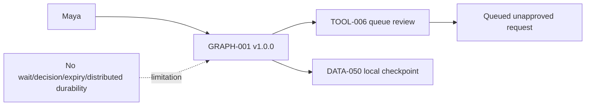
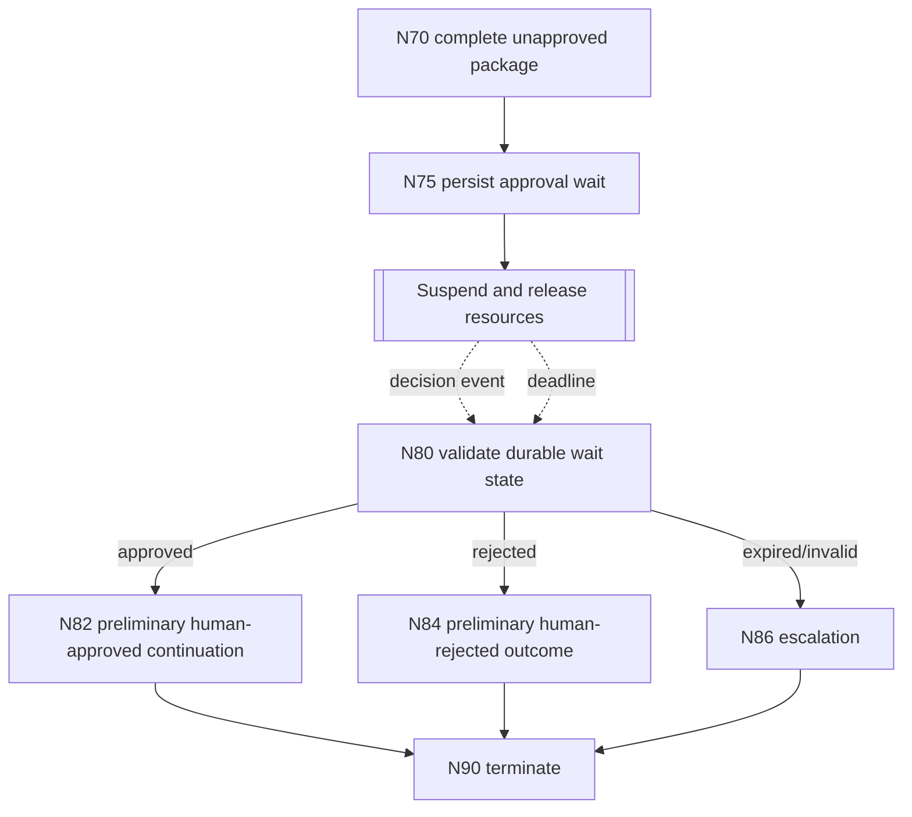

# Stage 4B — Checkpointing, Durable Execution and Human Approval

**Stage identifier:** `S04B`  
**Architecture/repository/handoff version:** `0.9.0`  
**Execution date:** 2026-07-31  
**Verification boundary:** local/offline Python 3.13.5, SQLite, one deterministic `AGT-001` proposal, synthetic identities, one sequential graph runner and no live enterprise connector, IAM/PDP, distributed workflow platform, harness, memory, concurrent graph branches or multiple agents.

## 1. Context Carried Forward

NorthStar enters Stage 4B with `GRAPH-001` version `1.0.0`, typed current state, node-owned copy-on-write patches, application-owned routes, gateway-only tool execution, S03C budgets/recovery/reconciliation and checksummed graph-version-bound local checkpoints. `TOOL-006` can queue a review request, but `CMP-006` cannot yet represent an actual decision. The graph finishes with a queued, reversible, unapproved artifact because it cannot persist an hours- or days-long wait, release compute, validate a reviewer, enforce expiry or resume through approved/rejected branches.

The constraints are unchanged: `AGT-001` remains the only low-authority agent; it cannot select graph nodes, approve, reject, set timeout, set budgets or mutate authority. `DATA-009` remains `1.1.0`; `TOOL-001`–`006` and `INT-017` remain gateway-only; ambiguous writes are reconciled by original idempotency key; checkpoints are not memory, event sourcing or audit; and no harness, memory, concurrent branch or second agent may appear.

The Stage 4A package was reconstructed from its accepted handoff rather than a mounted byte-exact repository. `ISS-036` preserves that limitation. The Stage 4A handoff explicitly identifies durable human waiting as the next unresolved problem. 

## 2. Narrative Development

Maya sees a complete evidence-backed package and a queued review request. She closes her laptop. Daniel opens the request two hours later. In the Stage 4A implementation, no live process remains to receive his answer, and restarting the graph either repeats work or merely reloads a position with no decision contract.

Liam rejects a process-blocking sleep: it consumes runtime capacity, disappears on restart and cannot reliably distinguish a late decision from a timer. Marcus rejects an unsigned callback containing only `approved=true`: anyone who obtains the URL could attempt to approve, a token could be replayed, and Maya could approve her own package. Sofia requires the reviewer decision to be evidence in its own right: reviewer identity, role, decision, reason where applicable, time, correlation and single-use status must be validated before the graph sees it.

Priya therefore introduces a durable wait as an application state, not as a sleeping thread. The graph persists the run and wait, returns control to the caller and later resumes from one of two external facts: a validated decision event or expiry. The model has no role in interpreting either fact.

## 3. Problem Being Solved

The architecture must answer:

1. What exactly is persisted before execution resources are released?
2. How is the review request correlated to one run and one graph version?
3. Who may approve or reject, and how is separation of duties enforced?
4. How are duplicate, conflicting, expired or tampered decisions rejected?
5. What happens if no person responds?
6. How does a restarted process continue without repeating completed `TOOL-006`?
7. How is duplicate resume prevented without introducing general concurrent graph execution?

### Non-goals

No dual approval, delegation, reviewer workload balancing, browser UI, enterprise authentication, production callback gateway, distributed queue, multi-region replication, event sourcing, workflow-history replay, graph migration, compensation, memory, harness, concurrent branches or multi-agent behavior is implemented.

## 4. Requirements Introduced or Updated

Stage 4B adds `FR-096`–`105`, `NFR-075`–`083` and `CTL-051`–`059`. The most important invariants are:

- the wait appears only after all six unapproved milestones and the queued review artifact exist;
- the worker releases control after persisting run, wait, correlation, expiry and graph version;
- decisions are restricted to approved/rejected and validated outside the model;
- signature, active-token digest, expiry, reviewer role, initiator/reviewer separation and single use are mandatory;
- expiry routes to escalation, never approval;
- resume starts at the decision gate and cannot repeat `TOOL-006`; and
- a short lease prevents two resume workers from advancing the same run at once.

## 5. Conceptual Explanation

### 5.1 Checkpointing versus durable execution

A checkpoint is a saved state snapshot. Durable execution is the larger operating contract that makes a long-running workflow survive process failure and continue from external events or timers without losing control semantics. A checksum-protected JSON checkpoint can restore data but does not by itself provide an inbox, timer, atomic decision handling, duplicate suppression or worker ownership.

NorthStar retains the Stage 4A typed state and transition model, but persists active runs in `DATA-058 DurableWorkflowRecord` with a revision and checksum. `DATA-059 HumanApprovalWait` carries correlation and expiry. `DATA-007 ReviewDecision` becomes an executable local object. A resume lease (`DATA-062`) is operational metadata, not a graph branch.

### 5.2 Human-in-the-loop placement

Approval is placed after the deterministic completion check and before a human-accepted continuation. Placing it earlier would ask reviewers to inspect incomplete packages; placing it after an irreversible action would make the approval cosmetic. The approval is for controlled continuation of the preliminary package. It is not a legal conclusion or case closure.

### 5.3 Waiting without a sleeping process

`N75_CREATE_REVIEW_WAIT` persists the wait and moves the graph to `N80_REVIEW_DECISION_GATE`. The runtime returns `waiting_for_human_review`. No loop polls the database and no thread sleeps. A later caller invokes resume, or an external scheduler can invoke resume after a decision or deadline in a production mapping.

### 5.4 External decision event

The reviewer sends a signed token plus a typed decision. `CMP-006` verifies:

- HMAC signature;
- token expiry;
- run/wait/review-request/graph correlation;
- that the token is the currently active token for the wait;
- allowed decision value;
- required reviewer role;
- reviewer differs from initiator;
- rejection includes a reason; and
- no decision already exists.

Only after those checks does an atomic transaction persist `DATA-007` and mark the wait decided. The graph later reads the accepted decision; it never parses a free-form approval message.

### 5.5 Timeout and escalation

If the wait is still pending at or after `expires_at`, `N80` marks it expired and routes to `N86_EXPIRED_ESCALATION`. Timeout does not imply rejection and never implies approval. The outcome remains `preliminary_grounded_unapproved` and identifies `approval_timeout` for operational escalation.

### 5.6 At-least-once and idempotency

A process can fail after `TOOL-006` commits but before state persistence. The local gateway therefore retains the original idempotency key in `tool_effects`. Re-execution returns the same review request rather than creating another. Normal resumption begins at `N80`, so the tool is not called again at all. This is not an exactly-once guarantee; it is at-least-once-safe behavior at the side-effect boundary.

### 5.7 Resume lease

Before reading and advancing a run, a worker atomically acquires a short lease if no unexpired lease exists. The lease prevents simultaneous duplicate resume in this local adapter. It does not add concurrent branches, worker pools or a distributed scheduler. A production engine may replace this mechanism with its own task ownership semantics.

## 6. When This Capability Is Required

Use durable waits when a workflow may outlive a process, human response time is materially longer than a request, an external event controls the next route, timeout needs an explicit business meaning, completed effects cannot be repeated casually, or operators need to inspect waiting/expired/decided state independently.

## 7. When It Is Not Required

A durable workflow layer is unnecessary for an immediate synchronous confirmation inside one transaction, a purely informational output with no approval gate, a process that can safely restart from the beginning without side effects, or a short fixed sequence already governed by an existing workflow platform. It is harmful when introduced without idempotency, correlation, versioning, decision validation or operational ownership.

## 8. Architecture Options

| Option | Strength | Limitation for NorthStar now |
|---|---|---|
| Blocking thread/process | Simple mental model | Loses resources and state on restart; unsuitable for long waits. |
| Poll database from graph loop | Easy local implementation | Wastes executions, adds latency/load and blurs timer/event semantics. |
| Framework interrupt/checkpointer | Natural graph integration | Framework semantics and production checkpointer become dependencies before NorthStar fixes its own contract. |
| Managed cloud state machine | Managed callbacks, waits and operations | Introduces cloud/runtime lock-in and service-specific limits. |
| Durable workflow engine | Strong long-running execution, timers/signals and operational tooling | Adds service/worker/event-history operational model beyond the current local stage. |
| Application-owned durable adapter | Exact NorthStar contracts, local/offline, testable | NorthStar owns persistence and lacks distributed/managed guarantees. |

Official platforms demonstrate the same broad pattern in different forms: Temporal uses durable workflows with signals/updates and timers; Step Functions callback tasks pause until a task token is returned; Azure Durable Task races an external event against a durable timer; Google Workflows can await callbacks; and LangGraph interrupts require persistent checkpointing for production. Those are option mappings, not claims that the local SQLite adapter has equivalent service guarantees.

## 9. Decision Matrix

Scores are 1–5 for this stage.

| Criterion | Blocking | Polling | Framework interrupt | Managed state machine | Durable engine | SQLite adapter |
|---|---:|---:|---:|---:|---:|---:|
| Releases runtime resources | 1 | 3 | 5 | 5 | 5 | **5** |
| Local/offline | 5 | 5 | 4 | 1 | 2 | **5** |
| Preserves app-owned contracts | 4 | 4 | 3 | 3 | 4 | **5** |
| External event + timeout | 1 | 3 | 4 | 5 | 5 | **4** |
| Production distributed maturity | 1 | 1 | 3 | 5 | 5 | 2 |
| Dependency/operations simplicity | 4 | 3 | 3 | 2 | 2 | **4** |
| Current teaching fit | 2 | 2 | 4 | 3 | 3 | **5** |

`ADR-030`–`032` record the selection.

## 10. Selected Architecture and Rationale

NorthStar keeps the framework-neutral graph and adds an `INT-036`–`040` durable adapter. SQLite is chosen only for the runnable local stage because Python includes the driver, transactions and uniqueness constraints can be tested offline, and the adapter makes the production replacement boundary explicit.

The selected design does not claim event sourcing, deterministic history replay, exactly-once execution, distributed timers, automatic failover or disaster recovery. A production migration should evaluate Temporal, a managed cloud state machine or a durable graph platform against NorthStar's established contracts.

## 11. Architecture Before the Change



## 12. Architecture After the Change



The cumulative architecture is in `cumulative-logical-architecture.mmd` and keeps all existing component names.

## 13. Detailed Component Design

### `CMP-003`

Loads `GRAPH-001` `1.1.0`, writes every accepted transition, suspends at `N80`, acquires a resume lease, reads only accepted decision state and routes deterministically.

### `CMP-005`

`TOOL-006` remains the only side effect in the focused Stage 4B path and keeps a stable idempotency key. The approval service cannot call tools directly.

### `CMP-006`

Owns wait creation, active token rotation, decision validation, decision persistence and expiry status. It does not decide on behalf of a human and does not interpret regulatory substance.

### `CMP-007`

The local implementation receives synthetic role claims. This exercises the policy contract but is not authentication. Production requires verified human identity, strong session/callback protection and a real PDP.

### `CMP-010`

Owns SQLite schema, transaction boundaries, checksums, optimistic revision and resume lease. WAL is enabled for local reliability/reader behavior; enterprise durability is not inferred from that setting.

## 14. Data, State and Interface Design

`DATA-007 ReviewDecision` is now executable locally. New objects are `DATA-058` through `DATA-062`; new interfaces are `INT-036` through `INT-040`. Schemas are supplied under `schemas/`.

The callback token contains only correlation, required role, graph version, expiry and nonce. It contains no evidence text, no unrestricted credential and no decision. The database stores only its SHA-256 digest and active nonce, not the raw token.

The workflow record stores canonical JSON and SHA-256. The decision payload is also canonicalized and checksummed. These checks detect local tampering/corruption; they are not digital signatures or a tamper-evident audit chain.

## 15. Implementation

The implementation is standard-library Python. The key execution boundary is:

```python
waiting = runtime.start(now=t0)
# process may exit here
runtime.approvals.submit(
    token=waiting.approval_token,
    reviewer_id="daniel.brooks",
    reviewer_roles=["compliance_approver"],
    decision="approved",
    reason="Evidence package is sufficient",
    now=t1,
)
final = runtime.resume(waiting.run_id, worker_id="resumer", now=t1)
```

`start` reaches `N80` and returns. `submit` stores the accepted external event but does not execute the graph. `resume` acquires a lease, loads checksummed state, validates graph ID/version, reads the durable wait and follows the accepted route.

### Executed local result

```text
status=waiting_for_human_review
wait_id=WAIT-...
tool006_effects=1
final_status=completed
review_outcome=approved
final_disposition=preliminary_grounded_human_approved
tool006_effects_after_resume=1
```

The measurements prove local control behavior only. They are not production availability, throughput, latency or human-review quality benchmarks.

## 16. Code and Repository Changes

Added approval token/service modules, SQLite durable store, durable graph runtime/factory, graph/config schemas, diagrams, ADRs, scripts and tests. All ten source-of-truth files are updated to `0.9.0`. No accepted identifier is retired. `GRAPH-001` advances to `1.1.0` because new nodes/routes change checkpoint compatibility.

## 17. Security and Governance Implications

| Threat | Control | Residual gap |
|---|---|---|
| Token tampering | HMAC-SHA-256 and constant-time comparison | Local shared secret, no KMS/rotation service. |
| Token theft/replay | Short expiry, active digest, nonce uniqueness, one decision per wait | No production browser/session binding or proof-of-possession. |
| Self-approval | Initiator/reviewer inequality | Synthetic identity claims. |
| Wrong approver | Required role | No enterprise directory/PDP. |
| Conflicting decisions | Unique wait and decision constraints | No dual-control policy. |
| Timeout treated as approval | Explicit expired route to escalation | Operational escalation integration absent. |
| Duplicate resume | Lease and optimistic revision | Single SQLite host, no distributed consensus. |
| Approval interpreted as legal conclusion | Preliminary disposition and explicit non-goal | Human training/governance still required. |

The decision record is concise evidence, not private model reasoning. The stage stores no hidden chain-of-thought.

## 18. Performance, Concurrency and Cost Implications

Waiting consumes storage rather than a continuously running Python process. Resume adds SQLite reads, a lease update and state/decision validation. There are no additional model calls after the wait; tests hold model/tool counts at one and one. Human latency dominates elapsed workflow time and must be measured separately from compute latency.

SQLite serializes writes and is selected for the local single-process boundary. The resume lease is a safety control, not general concurrency engineering. Throughput, queue depth, reviewer load, multi-worker contention, multi-region replication and managed-service charges remain unmeasured.

Cost now includes human review effort and durable storage. No provider price is invented. Production FinOps should measure approval volume, median/P95 wait age, expired percentage, rework after rejection, duplicate submission attempts and cost per human-reviewed case.

## 19. Evaluation and Test Cases

`TEST-134`–`158` cover graph validity, database schema, state checksum, raw-token non-persistence, tampering, expiry, role, separation of duties, rejection reason, invalid decision, single use, suspension, no-event resume, approved/rejected/timeout routes, process restart, no repeated `TOOL-006`, lease conflict/takeover, graph-version mismatch, model/tool replay, transition evidence, one-agent boundary and non-final disposition.

Executed result: **25 pytest tests passed**. Demo, evaluation script, package compilation, structural validator and consistency audit passed.

Evaluations:

- `EVAL-033`: approved event resumed to `preliminary_grounded_human_approved`, one `TOOL-006` effect.
- `EVAL-034`: rejected event resumed to `preliminary_grounded_human_rejected`, one `TOOL-006` effect.
- `EVAL-035`: missing event expired to `approval_timeout` escalation, still unapproved.
- `EVAL-036`: exactly one agent and no harness, memory or multi-agent package.

## 20. Failure Scenarios and Recovery

### Process stops while waiting

State and wait remain in SQLite. A new runtime loads the same run, accepts the decision and resumes from `N80`. Completed `TOOL-006` is not repeated.

### Callback token is modified

Signature verification fails before wait or evidence state is changed. The run remains pending.

### Maya tries to approve her own package

The decision transaction rejects the initiator/reviewer match. The wait remains pending.

### Daniel responds after expiry

Token verification or wait validation rejects the late decision. On resume, the graph follows the expired route and escalates.

### Two workers resume together

Only one obtains the active lease. The other fails with `resume_lease_unavailable`. An expired lease can be taken over.

### Crash after `TOOL-006` commit

The gateway's original idempotency key returns the same review request on re-execution. Normal resume does not execute the tool at all.

## 21. Architecture Decision Records

`ADR-030` approval placement, `ADR-031` external-event wait and expiry, and `ADR-032` local SQLite durable adapter are accepted. `ADR-001`–`029` remain.

## 22. Requirements Traceability Update

Every new functional requirement maps to a graph node/interface, deterministic control and at least one test. No capability is represented as production-complete. The traceability table is in `02-Requirements-Register.md`.

## 23. Stage Outcome

NorthStar can now queue a review, persist and expose an explicit wait, stop consuming execution resources, accept one validated human approve/reject decision, expire and escalate unanswered reviews, restart the process, acquire a safe resume lease and continue through deterministic branches without repeating completed `TOOL-006`.

## 24. Known Limitations

Synthetic identity/roles; local shared HMAC secret; one SQLite host; no distributed scheduler or automatic callback-triggered resume; no production callback gateway/rate limit; no dual approval, delegation, override or reviewer workload management; no graph migration; no event sourcing/audit ledger/WORM; no backup/DR; no live connector/model; no production performance/cost benchmark; no harness, memory, concurrency branches or multiple agents; Mermaid not CLI-rendered.

## 25. Narrative Bridge to the Next Stage

Priya can now point to explicit graph state, durable waits and validated human decisions. Yet the growing application still distributes cross-cutting behavior across graph nodes, factory wiring, token service, state store, tool gateway, configuration and tests. System instructions, context assembly, registries, session/workspace policy, validation hooks, tracing and common runtime controls have no single surrounding software boundary.

The next architectural problem is not another agent or memory. It is how to package the existing model, graph, tools, state, approval, budgets, policy hooks and evaluation hooks into a repeatable agent harness without moving critical authority back into prompts.

## 26. Updated Source-of-Truth Artefacts

All ten artefacts are updated to `0.9.0`: constitution, business baseline, requirements, architecture, catalogue, data/interface register, ADR register, repository manifest, risk/assumption/issue register and handoff pack.

## Stage Consistency Audit

**Result: Passed with recorded exceptions.**

Executed and inspected: names and IDs preserved; `GRAPH-001` definition/routes match runtime; `AGT-001` remains one agent; `TOOL-006` executes only through `CMP-005`; no raw token is stored; decision validation precedes graph branching; timeout cannot approve; restart does not repeat `TOOL-006`; graph version mismatch and state tampering fail; one resume lease is enforced; schemas/registers/code/diagrams use `DATA-007`, `DATA-058`–`062`, `INT-036`–`040`, `ADR-030`–`032`, `TEST-134`–`158` and `EVAL-033`–`036` consistently; 25 tests, demo, evaluation, validation, compilation and audit pass; no harness, memory, concurrent branches or multiple agents are claimed.

Recorded exceptions: `ISS-036` reconstruction overlay, `ISS-037`–`042`, inherited production identity/connectors/legal review/records/performance/deployment gaps and Mermaid rendering exception.
