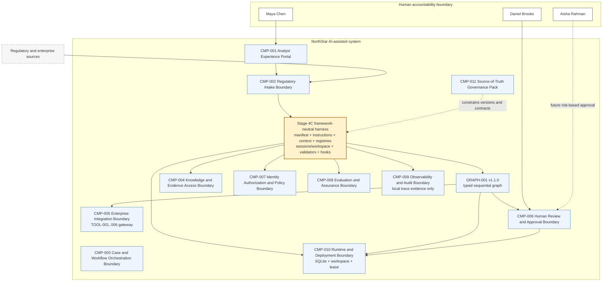
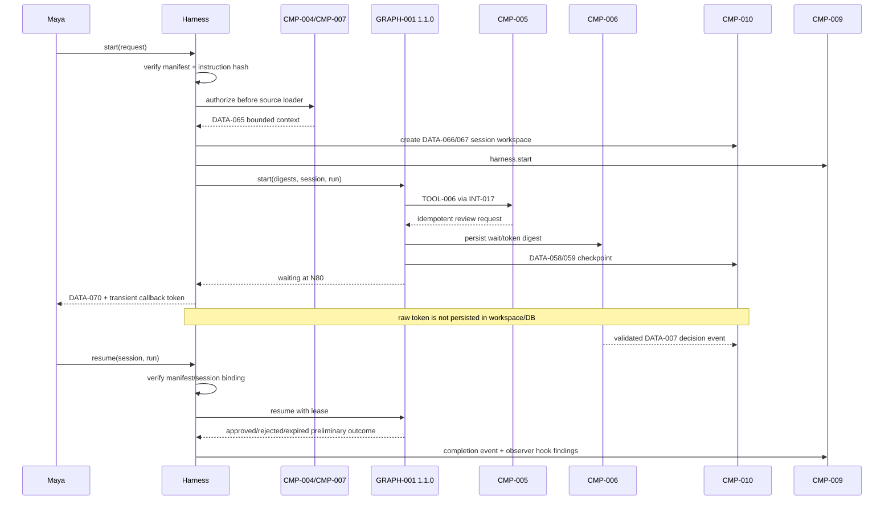

# 03 — Architecture Baseline

**Architecture version:** `1.0.0`  
**Graph compatibility:** `GRAPH-001` `1.1.0` unchanged.

## 1. Maturity before S04C

The 0.9.0 system is a bounded single-agent, typed, sequential graph with gateway-only tools, budgets/recovery/reconciliation, durable SQLite workflow state, external human decision events, expiry and lease-protected resume. Cross-cutting assembly and lifecycle responsibilities remain scattered across factories, modules, configuration and tests.

## 2. Architectural change

S04C adds a framework-neutral compositional harness *inside the existing `CMP-003` orchestration and `CMP-010` runtime responsibilities*. It is not a new top-level component. The harness owns bootstrap, version binding, instruction/context assembly, immutable registries, session/workspace lifecycle, cross-cutting validation, observer hooks and trace correlation. It delegates rather than absorbs:

- graph route/state ownership to `CMP-003`/`GRAPH-001`;
- tool authority and effects to `CMP-005`;
- human decision validation to `CMP-006`/`CMP-007`;
- durable state/lease to `CMP-010`;
- evaluation findings to `CMP-008`;
- trace evidence to `CMP-009`.

## 3. Cumulative logical architecture

The new yellow boundary packages existing runtime responsibilities. It does not add a new agent, graph branch or authority path.

## 4. Harness lifecycle

## 5. Trust boundaries

- Instruction and model output are untrusted for authority.
- Context content is data, not executable instruction; authorization precedes loading.
- Registries and manifest are trusted configuration only after integrity validation.
- Approval token is transient; only digest/nonce/correlation are durable.
- Workspace and trace are local operational artefacts, not records or audit.
- Hooks receive summaries and return findings; they are outside control flow.

## 6. Deployment boundary

One Python process composes the harness and sequential graph. SQLite and local files remain the only persistence. Enterprise production mapping may replace adapters with managed registries, policy engines, secret stores, durable workflow engines, sandboxed workspace services and OpenTelemetry exporters while preserving `INT-041`–`046`.
