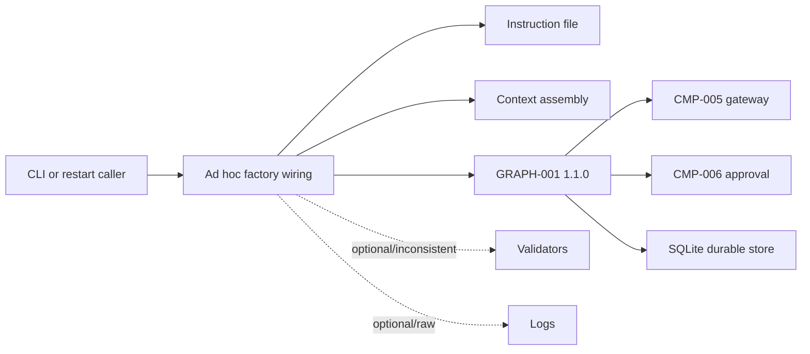
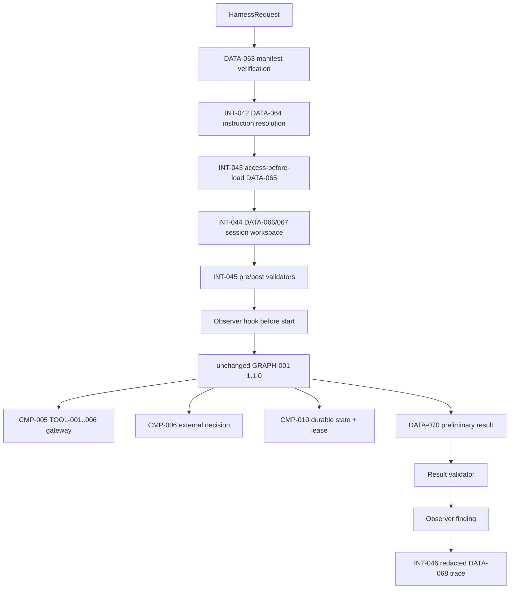

# Stage 4C — Agent Harness Engineering

**Stage identifier:** `S04C`  
**Architecture/repository/handoff version:** `1.0.0`  
**Execution date:** 2026-07-31  
**Verification boundary:** local/offline Python 3.13.5, SQLite, local JSON/JSONL workspace, deterministic fixtures, synthetic identity, one sequential `GRAPH-001` runner and exactly one `AGT-001`. No live enterprise connector/model, IAM/PDP, distributed workflow platform, production sandbox, memory, concurrent graph branch or multiple agent.

## 1. Context Carried Forward

NorthStar enters S04C with the accepted S04B `0.9.0` architecture: a typed `GRAPH-001` `1.1.0`, `DATA-009` `1.1.0`, gateway-only `TOOL-001`–`006`, independent budgets and recovery/reconciliation, checksummed durable SQLite workflow state, a persisted external-event human wait, signed expiring callback claims, role/separation-of-duties/single-use decision validation, timeout-to-escalation and a short resume lease. Approved and rejected routes remain preliminary human-reviewed dispositions; timeout never approves; normal resume does not repeat `TOOL-006`.

The accepted handoff also identifies the exact unresolved problem: system instructions, context assembly, registries, validation, sessions/workspace, approvals, checkpoints, evaluation hooks and tracing are scattered across modules and factory wiring. Nothing consistently proves which versions and context surrounded a run. A developer can omit a validator, load restricted text before checking access, use a different instruction, persist a callback token or attach a hook that changes behavior.

S04C changes none of the accepted graph or authority semantics. It adds only the framework-neutral harness needed to assemble and surround them consistently. The supplied S04B handoff, not a mounted byte-exact repository, is the reconstruction baseline; `ISS-043` records this constraint.

Artefacts modified: all ten source-of-truth files, cumulative/focused diagrams, repository manifest, three ADRs, schemas `DATA-063`–`070`, interfaces `INT-041`–`046`, code under `src/northstar_compliance/harness/`, tests `TEST-159`–`182` and evaluations `EVAL-037`–`041`.

## 2. Narrative Development

Elena reproduces the approved S04B path on a clean laptop. She loads the instruction, builds context, wires the gateway, approval service, durable store and graph, and adds a few logging callbacks. The workflow works, but Priya notices that Elena's script is the only place that knows the correct assembly order. Another caller could invoke the graph with a stale instruction, load evidence before authorization, forget the workspace quota or omit the result validator.

Marcus asks whether the system prompt can simply say, “Never access restricted content and never call an unauthorized tool.” Priya rejects the proposal. The model does not control which loader executes, which registry is installed, which credentials a tool receives, where files are written, how a signature is verified or which route the graph takes. A prompt can shape a proposal; it cannot enforce the boundary.

Sofia then examines a proposed evaluation callback. It has a direct reference to the graph state and can rewrite the disposition after the run. That makes an “evaluation hook” an undeclared policy engine. Liam finds a second problem: start and resume generate disconnected logs, making it hard to reconstruct one human-wait lifecycle without storing the callback token.

Priya introduces a harness as the software envelope around the accepted agent runtime. The harness is deliberately smaller than a framework, workflow engine or control plane. It loads immutable configuration, assembles authorized context, creates a bounded session workspace, invokes deterministic validators, calls the existing graph, emits redacted trace evidence and exposes observer-only evaluation hooks.

## 3. Problem Being Solved

The stage must answer:

1. Which exact agent, graph, tools, instructions, validators and hooks constitute a run?
2. How is context selected, authorized, bounded, ordered and attributed before model/graph use?
3. How are sessions and workspaces isolated without introducing memory?
4. How are start, wait, decision, restart and resume tied to one lifecycle?
5. Where do validation and evaluation hooks run, and what are they forbidden to change?
6. How can tracing help diagnosis without leaking tokens/context or pretending to be audit?
7. How does the harness preserve existing graph/gateway/approval ownership rather than duplicating it?
8. How can NorthStar remain framework-neutral while still providing runnable code?

### Non-goals

No formal full agent specification, memory manager, long-term memory, context compaction across long histories, concurrent graph branches, multiple agents, dynamic plugins, production code execution sandbox, distributed registry, control plane, OpenTelemetry backend, audit/WORM, live provider/connector or production benchmark is introduced.

## 4. Requirements Introduced or Updated

S04C adds `FR-106`–`119`, `NFR-084`–`095` and `CTL-060`–`071`. The critical invariants are:

- one immutable manifest binds the accepted runtime;
- instruction integrity is checked before execution;
- authorization precedes context loader invocation;
- context is typed/bounded/hashed and cannot include memory;
- registries freeze before runtime;
- workspace paths, suffixes, file size and total size are bounded;
- callback token/credentials/authorization/hidden reasoning are not persisted;
- validators fail closed at lifecycle points;
- hooks observe but cannot mutate, authorize or route;
- harness delegates to unchanged graph/gateway/approval/store contracts;
- trace evidence is redacted/correlated and explicitly non-audit; and
- future-stage flags for memory/concurrency/multiple agents fail closed.

The complete traceability matrix is in `02-Requirements-Register.md`.

## 5. Conceptual Explanation

### 5.1 Plain-language definition

An agent harness is the controlled software environment that prepares an agent run and surrounds it while it executes. It decides which approved instructions and capabilities are installed, which authorized context is supplied, which lifecycle checks run, where bounded work artefacts go and which diagnostic/evaluation evidence is emitted.

It is analogous to a test harness plus a runtime envelope: the agent's model makes probabilistic proposals, while the harness makes the conditions of execution repeatable.

### 5.2 Technical definition

For NorthStar, the harness is a framework-neutral composition root and lifecycle facade over existing contracts. It maps:

```text
(versioned manifest, instruction, authorized context sources, initiator)
    -> validated DATA-064/DATA-065
    -> isolated DATA-066/DATA-067
    -> existing GRAPH-001 start/wait/resume
    -> DATA-069 evaluation findings + DATA-068 traces
    -> typed DATA-070 result
```

It owns cross-cutting assembly and lifecycle validation. It does not own graph routing, tool authorization/effects, reviewer decisions or durable workflow semantics.

### 5.3 Model, prompt, agent, loop, harness, runtime, framework, workflow engine and control plane

| Term | What it is | NorthStar owner/example | What it is not |
|---|---|---|---|
| Model | Probabilistic predictor/generator. | Provider behind the existing decision contract. | Authority, workflow or database. |
| Prompt/instruction | Context that guides model behavior. | `DATA-064 AGT-001-system`. | Security control or capability grant. |
| Agent | Goal-directed software role that proposes actions and observes results. | `AGT-001`. | Every model call or every graph node. |
| Agent loop | Repeated propose/validate/act/observe/terminate behavior. | Preserved inside the accepted graph behavior. | Durable infrastructure by itself. |
| Harness | Software envelope for versions, context, registries, sessions, validation, hooks and traces. | New S04C package under `CMP-003`/`CMP-010`. | Another agent, graph or control plane. |
| Runtime | Process/storage/execution environment. | Python, SQLite, filesystem and lease in `CMP-010`. | The harness contract alone. |
| Agent framework | Library/SDK with abstractions for agents, tools, handoffs, tracing and/or graphs. | Option mapping only; none required locally. | Proof of production correctness. |
| Workflow engine | Operational system for durable tasks, timers, signals, retries and workers. | Future replacement option for local adapter. | Model reasoning or agent policy. |
| Control plane | Cross-system governance of agents, models, prompts, tools, policy, evaluation and deployment. | Future stage. | Per-run harness hot path. |

### 5.4 Why a strong harness reduces prompt complexity

Without a harness, prompts accrete instructions such as “use only these tools,” “do not read restricted files,” “remember the budget,” “wait for approval,” “do not leak secrets,” and “log every step.” These statements are useful behavioral guidance but weak enforcement. S04C moves enforceable concerns into code:

- tool set -> frozen registry and gateway;
- data access -> access-before-loader;
- context size -> deterministic quotas;
- instruction identity -> SHA-256 binding;
- workspace scope -> path and suffix checks;
- approval -> signed typed external contract;
- routing -> graph-owned named routes;
- traces -> redaction and structured events;
- evaluation -> observer-only hooks.

The instruction becomes shorter and more honest: it tells `AGT-001` its purpose and limitations and explicitly says it grants no authority.

### 5.5 Long-running-agent concerns addressed and deferred

Addressed now: session identity, persistent bounded workspace, versioned artefacts, resumable graph session, context regeneration from explicit source descriptors, start/resume verification, intermediate result validation and crash-safe continuation through S04B state.

Deferred: task ledger spanning many work units, progress-file convention for months-long autonomous work, model/deployment migration of in-flight runs, context compaction, semantic/episodic/procedural memory, distributed workers, long-term workspace retention and version-controlled generated artefacts. These require specification/memory/AgentOps stages.

## 6. When This Capability Is Required

A harness is justified when a system has more than one model/tool call, repeated runs, multiple lifecycle entry points, durable resume, nontrivial context, regulated data, versioned instructions, tool registries, budgets, approvals, evaluation hooks or trace requirements. It is especially valuable when the same graph may be invoked by CLI, API, worker and restart paths and each must enforce identical pre/postconditions.

NorthStar now meets all of these triggers.

## 7. When It Is Not Required

A dedicated harness is unnecessary for a one-shot deterministic function, a small synchronous assistant with no tools/state, a workflow already fully encapsulated by a trusted platform and one stable entry point, or a disposable experiment where no persistence/authority exists. It can be harmful if it becomes a “god object,” duplicates business rules, hides framework behavior, permits arbitrary plugins, stores excessive context or creates a second policy/approval path.

The simplest viable design is a narrow composition boundary, not a general platform.

## 8. Architecture Options

| Option | Strengths | Weaknesses for NorthStar now | Decision |
|---|---|---|---|
| Continue ad hoc factory/caller wiring | No new abstraction. | Drift, omitted controls, inconsistent traces/restarts. | Rejected. |
| Put all concerns in one system prompt | Easy to edit and provider-portable. | Probabilistic; cannot enforce access, files, signatures, routes or quotas. | Prohibited for critical controls. |
| Framework-native harness | Faster feature adoption; integrated tools/traces/checkpoints. | Couples contracts and version lifecycle to one framework before selection criteria are proven. | Deferred mapping. |
| Separate harness microservice | Central deployment and policy integration. | Network/operations/single-point risks and premature service boundary. | Deferred. |
| Control-plane-managed runtime | Enterprise registry/policy/deployment potential. | Much broader than one-agent local need; future stage. | Deferred. |
| Application-owned compositional harness | Exact NorthStar contracts, local/offline, testable, framework-neutral. | NorthStar owns code and lacks managed operations. | **Selected.** |

### Important implementation choices inside the selected option

| Concern | Options | Selected |
|---|---|---|
| Configuration | mutable dictionaries; environment-only; versioned manifest | Versioned `DATA-063` plus digest. |
| Instructions | inline string; template service; versioned file/hash | Versioned file + SHA-256 `DATA-064`. |
| Context | concatenate all; post-filter; access-before-load bounded envelope | Access-before-load `DATA-065`. |
| Registries | dynamic runtime mutation; startup freeze | Duplicate-rejecting frozen registry. |
| Workspace | shared temp directory; per-run isolated root; remote sandbox | Per-session local root with quotas; remote sandbox deferred. |
| Validation | prompt checks; model judge; deterministic lifecycle pipeline | Deterministic validators, with model evaluation deferred/secondary. |
| Hooks | full runtime/plugin handles; observer summaries | Observer-only immutable summaries. |
| Tracing | raw logs; no logs; structured redacted local events | `DATA-068` JSONL, non-audit. |

### 8.1 Representative technology mapping (verified 2026-07-31)

This stage remains vendor-neutral, but current primary documentation confirms that modern agent stacks expose overlapping harness concerns in different packages. The OpenAI Agents SDK documents agent loops, tools, context, guardrails, tracing and human-in-the-loop facilities [1]. LangGraph documents runtime context and persistence/checkpointing for stateful graphs [2]. Microsoft Agent Framework documents an agent/workflow SDK and migration guidance, with the overview updated April 6, 2026 and migration material updated July 10, 2026 [3]. OpenTelemetry publishes versioned semantic conventions, including GenAI observability work, but telemetry conventions do not by themselves create a tamper-evident audit ledger [4].

These mappings support the option analysis; they do not imply that NorthStar's local implementation has the same distributed, hosted or operational guarantees.

## 9. Decision Matrix

Scores: 1 weak, 5 strong for this local stage.

| Criterion | Ad hoc | Prompt-centric | Framework-native | Separate service | App-owned harness |
|---|---:|---:|---:|---:|---:|
| Repeatability | 2 | 2 | 4 | 5 | **5** |
| Deterministic security boundary | 2 | 1 | 4 | 5 | **5** |
| Preserve accepted contracts | 3 | 2 | 3 | 4 | **5** |
| Local/offline runnable | 5 | 5 | 3 | 2 | **5** |
| Framework neutrality | 4 | 5 | 1 | 4 | **5** |
| Operational maturity | 1 | 1 | 3 | 4 | 2 |
| Current complexity | 5 | 5 | 3 | 1 | **4** |
| Teaching transparency | 2 | 2 | 3 | 2 | **5** |

`ADR-033`–`035` record the selected architecture and its boundaries.

## 10. Selected Architecture and Rationale

NorthStar selects an application-owned, framework-neutral harness composed through explicit modules. It is instantiated from a manifest and uses constructor injection rather than global mutable state. It surrounds the existing runtime, which means `GRAPH-001` does not advance from `1.1.0`; no checkpoint migration is introduced.

The selection is intentionally not a universal recommendation. In production, NorthStar may map `INT-041`–`046` to a mature framework, durable engine, sandbox service and telemetry stack. The architecture first fixes the application semantics those technologies must preserve.

**Architect's Decision:** the harness is part of existing `CMP-003`/`CMP-010`, not `CMP-012` or `AGT-002`.

**Security Boundary:** the harness verifies and delegates; it cannot grant more authority than the gateway, graph, approval or policy contracts already allow.

## 11. Architecture Before the Change



The graph is controlled, but the surrounding lifecycle has no single versioned contract.

## 12. Architecture After the Change



The full cumulative architecture is maintained in `stage-4c-cumulative-logical-architecture.mmd` and `03-Architecture-Baseline.md`.

## 13. Detailed Component Design

### 13.1 `HarnessManifest` and bootstrap

`DATA-063` binds architecture/repository version, `AGT-001`, `GRAPH-001` 1.1.0, all six tool versions, instruction identity/hash, validators, hooks and three explicit disabled flags. Its canonical digest is stored in `DATA-066` and checked at start/resume.

A boolean such as `memory_enabled=true` fails before a run. This is a local guard against accidental stage leakage; it is not a substitute for signed deployment configuration.

### 13.2 Instruction store

`InstructionStore` loads one approved file, rejects empty content and verifies SHA-256 against the manifest. The content says what the agent should propose and what it must not claim. It also states that the instruction does not grant authority.

```python
instruction = self.instructions.load()
if instruction.content_sha256 != self.manifest.instruction_sha256:
    raise RuntimeError("instruction_manifest_mismatch")
```

### 13.3 Context assembler

A `ContextSource` contains identity, kind, classification, purpose, an external authorization result, priority and a loader. The assembler checks authorization before calling `loader()`. Unauthorized text is therefore never loaded, scored, cached or written by the harness.

```python
if not source.authorized:
    omitted.append(source.source_id)
    continue
content = source.loader()  # invoked only after access decision
```

Allowed kinds are publication, evidence, run_state and policy_context. `memory` fails explicitly. Items are sorted deterministically, capped by item/character budgets, truncated when necessary, individually hashed and included in one aggregate envelope digest.

### 13.4 Registries

`FrozenRegistry` rejects duplicate IDs and mutation after `freeze()`. The local focused path uses the already fixed gateway registration, but the harness test demonstrates that neither prompt text nor tool arguments can install a new capability.

A production registry may be remote and signed, but runtime resolution must still yield an immutable snapshot bound to the run.

### 13.5 Session and workspace

A session owns one workspace under `runtime_root/workspace/sessions/SESSION-*`. Only `.json` and `.jsonl` paths are accepted. Resolved paths must remain under the root. Per-file and total byte quotas are enforced. Sensitive key names are rejected unless the value is the explicit redaction marker.

The workspace stores:

- `workspace-manifest.json`;
- `session.json`;
- instruction metadata/hash, not a second authoritative instruction;
- the bounded context envelope;
- `start-result.json` and `resume-result.json` without the callback token; and
- `trace.jsonl`.

It is not a production code sandbox, memory system or records repository.

### 13.6 Validation pipeline

The pipeline has named lifecycle points:

1. pre-start: manifest identity, digest, disabled future flags and external-control invariant;
2. post-context: agent ID, no memory, aggregate checksum;
3. post-start: allowed preliminary disposition and wait contract;
4. pre-resume: manifest binding;
5. post-resume: allowed status/disposition and non-final semantics.

Graph, gateway, approval and durable-store validation remain in their own owners. The harness checks composition invariants instead of copying every business rule.

### 13.7 Observer-only evaluation hooks

Hooks receive a copied summary such as agent IDs, disabled flags and disposition. They return `DATA-069 HookResult`. They receive no graph state object, store, gateway, token or callback. The included `InvariantEvaluationHook` proves one agent/no memory/no multi-agent constraints.

**Evaluation Risk:** a hook with mutation access becomes a hidden control plane and can invalidate traceability. Such a plugin is outside `INT-045`.

### 13.8 Tracing

`JsonlTracer` emits `DATA-068` with trace/span/session/run IDs. Sensitive attribute keys are replaced with `[REDACTED]`; long strings are bounded. Start, accepted decision and resume use the trace ID stored in the durable session, so one lifecycle can be correlated across process recreation.

The trace does not store private chain-of-thought. It is local diagnostics, not the Stage 10 tamper-evident black-box audit.

### 13.9 Runtime facade

`AgentHarness.start()` performs bootstrap, creates session/workspace, emits hooks/traces and calls `DurableGraphRuntime.start()`. The raw callback token is returned transiently because the reviewer channel needs it, but `HarnessRunResult.to_dict(include_transient=False)` removes it before persistence.

`submit_decision()` resolves the initiator from the durable session, not reviewer input, then delegates to `ApprovalService`.

`resume()` verifies the manifest/session binding and delegates to the graph's lease-protected resume. It does not replay context loaders or `TOOL-006`.

## 14. Data, State and Interface Design

New data objects are `DATA-063`–`070`; interfaces are `INT-041`–`046`. JSON schemas are included under `schemas/`. The canonical data/owner table is in `05-Data-and-Schema-Register.md`.

### Lifecycle state separation

- `DATA-009`/`058`: business/graph run state.
- `DATA-059`/`007`: wait and human decision.
- `DATA-063`–`065`: execution composition inputs.
- `DATA-066`/`067`: session/workspace operational state.
- `DATA-068`/`069`: diagnostic/evaluation evidence.
- `DATA-070`: caller-facing harness result.

This separation prevents a trace, hook or workspace file from becoming authoritative graph or approval state.

### Versioning rule

A manifest/instruction/context change creates a new run binding. S04C does not migrate an in-flight `GRAPH-001` run. Resume verifies the accepted manifest and graph version; incompatible continuation fails closed and requires an explicit future migration ADR.

## 15. Implementation

The implementation remains standard-library Python. The public use is:

```python
harness = build_harness(
    repository_root=repo,
    runtime_root=runtime_dir,
    approval_secret=secret,
    approval_ttl_seconds=60,
)
waiting = harness.start(request, now=t0)
# process can stop here
harness.submit_decision(
    session_id=waiting.session_id,
    token=waiting.approval_token,
    reviewer_id="daniel.brooks",
    reviewer_roles=["compliance_approver"],
    decision="approved",
    reason="Evidence package is sufficient",
    now=t1,
)
final = harness.resume(
    session_id=waiting.session_id,
    run_id=waiting.run_id,
    worker_id="resumer",
    now=t1,
)
```

Executed local result:

```text
waiting_status=waiting_for_human_review
final_status=completed
review_outcome=approved
final_disposition=preliminary_grounded_human_approved
tool006_effects=1
trace_events=5
memory_enabled=false
agent_count=1
```

These results verify control behavior. They are not a production availability, performance, legal-quality or human-review benchmark.

## 16. Code and Repository Changes

### Files added

- `config/harness/harness-manifest.json` and versioned instruction.
- `src/northstar_compliance/harness/` modules for models, bootstrap, instructions, context, registries, workspace, validation, hooks, tracing and lifecycle facade.
- `DATA-063`–`070` schemas.
- `ADR-033`–`035`.
- four focused/cumulative Mermaid diagrams.
- tests `TEST-159`–`182` and evaluation script `EVAL-037`–`041`.
- S04C chapter, technical references and all ten updated artefacts.

### Files modified/reconstructed

- existing graph, durable store, gateway and approval modules are carried forward in a compatible local overlay;
- session persistence is extended with the stable trace ID;
- README and package version advance to `1.0.0`.

### Files retired

None.

### Run commands

```bash
python -m pip install -e . --no-deps --no-build-isolation
python -m pytest -q
python -m compileall -q src scripts tests
python scripts/run_stage4c_demo.py
python scripts/run_stage4c_evaluation.py
python scripts/validate_stage4c.py
python scripts/consistency_audit_stage4c.py
```

## 17. Security and Governance Implications

| Threat/failure | Deterministic control | Residual gap |
|---|---|---|
| Stale/modified harness configuration | Manifest digest and exact accepted IDs/versions. | No signed config service or deployment attestation. |
| Modified instruction | File hash bound to manifest. | Repository access/change governance still required. |
| Unauthorized context | Authorization checked before loader; unsupported/memory kinds rejected. | Synthetic boolean claim, not enterprise PDP; poisoning remains. |
| Dynamic capability injection | Frozen registry, duplicate rejection, gateway allowlist. | No distributed registry/signing. |
| Path traversal/data sprawl | Per-session root, suffix allowlist, quotas. | Local filesystem is not hardened sandbox/DLP. |
| Secret/token leakage | Token transient, sensitive fields rejected/redacted, no raw token in DB/workspace. | Process memory/browser/callback controls remain. |
| Self-approval/tampered/late decision | Existing HMAC, role, SoD, expiry, nonce and single-use checks. | Synthetic identity/local secret. |
| Hook changes result | Observer-only summary/result API and tests. | Future plugin execution isolation absent. |
| Prompt treated as policy | Explicit external-control invariant and gateway/graph/approval ownership. | Human developers can still misconfigure code outside reviewed release. |
| Trace treated as audit | Non-audit label, no legal/final disposition. | Production audit/WORM not built. |

**Governance Requirement:** changes to manifest, instruction, validators, hooks, schemas or tool versions are controlled architecture changes and must update the source-of-truth pack and regression suite.

## 18. Performance, Concurrency and Cost Implications

### Performance

The harness adds deterministic hashing, sorting, bounded file I/O, SQLite session writes, validation and five small trace events. It adds no model call and no tool effect beyond the existing graph. Context size is capped at eight items/12,000 characters in the local configuration.

The design is sequential. It does not introduce parallel loaders, concurrent branches, background hooks or asynchronous trace exporters. This preserves determinism and avoids race/cancellation/backpressure semantics before Stage 6/7 requirements.

Production benchmarks must separate:

- harness bootstrap latency;
- context authorization and loader latency;
- context bytes/items and hashing cost;
- workspace/trace I/O;
- model/tool/approval wait time; and
- resume latency/contention.

### Cost

Local cost is CPU, SQLite/filesystem storage and human review time. No provider price is invented. The harness reduces avoidable failed-run cost by detecting incompatible config/context before model/tool execution. It can increase storage through reproducibility artefacts, so retention and sampling will matter in production.

### Concurrency

A short resume lease still protects one run. Workspace roots isolate sessions, but shared SQLite write throughput, multi-process registry initialization and distributed trace ordering are unmeasured. No claim of concurrent branch safety is made.

## 19. Evaluation and Test Cases

Executed: **24 pytest tests passed**.

| Range | Coverage |
|---|---|
| `TEST-159`–`164` | Manifest binding, future-stage deny, instruction hash, access-before-loader, memory rejection, deterministic context budget. |
| `TEST-165`–`169` | Frozen registries, workspace escape/sensitive fields, trace redaction, observer hook, no dynamic tool registration. |
| `TEST-170`–`177` | Harness start/wait, raw-token exclusion, approve/reject/timeout, restart, session and graph-version mismatch. |
| `TEST-178`–`182` | Self-approval, tampered token, trace privacy/correlation, no memory/multi-agent/concurrent module. |

Evaluations:

- `EVAL-037` approved path;
- `EVAL-038` rejected path;
- `EVAL-039` timeout/escalation path;
- `EVAL-040` manifest/instruction/context/future-stage invariants;
- `EVAL-041` trace/workspace privacy and non-audit boundary.

The evaluation hooks intentionally do not score regulatory correctness. S04C evaluates harness behavior; domain quality remains covered by prior retrieval/agent/graph datasets and future formal specification/evaluation stages.

## 20. Failure Scenarios and Recovery

### Failure 1 — Instruction file changes after approval

- **Detection:** SHA-256 differs from `DATA-063`.
- **Containment:** `INT-042` fails before context or graph execution.
- **Recovery:** review/version the instruction, update manifest/ADR/tests, deploy as a new compatible release.

### Failure 2 — Restricted source has a dangerous loader

- **Detection:** source authorization is false.
- **Containment:** loader is never invoked; source ID is recorded as omitted.
- **Recovery:** resolve entitlement outside the harness; do not prompt the model to bypass it.

### Failure 3 — Prompt asks to register `TOOL-999`

- **Detection:** prompt is only content; frozen registry/gateway contains `TOOL-001`–`006`.
- **Containment:** no registration or gateway event occurs.
- **Recovery:** new capability requires specification, tool contract, authorization, ADR and deployment change.

### Failure 4 — Workspace write attempts `../../secret.json`

- **Detection:** resolved path escapes session root.
- **Containment:** write fails before filesystem modification.
- **Recovery:** fix the caller; investigate malicious/buggy path generation.

### Failure 5 — Evaluation hook tries to change disposition

- **Detection:** hook receives no mutable state/runtime handle and can only return `DATA-069`.
- **Containment:** graph result remains authoritative.
- **Recovery:** keep policy/guardrail decisions in named deterministic components; reject the plugin design.

### Failure 6 — Process restarts while waiting

- **Detection:** durable session and workflow are reloaded.
- **Containment:** manifest/session/graph bindings are checked before resume.
- **Recovery:** new harness instance resumes at N80 with the same trace ID; `TOOL-006` remains one effect.

### Failure 7 — Trace attributes include approval token

- **Detection:** tracer recognizes sensitive key.
- **Containment:** value becomes `[REDACTED]`; workspace rejects unredacted sensitive fields.
- **Recovery:** investigate producer and expand classification/redaction policy as needed.

### Failure 8 — Resume uses a changed graph version

- **Detection:** manifest/session/workflow graph mismatch.
- **Containment:** fail closed before advancing the workflow.
- **Recovery:** deploy compatible code or perform a future explicit graph migration; never silently coerce state.

## 21. Architecture Decision Records

- `ADR-033`: framework-neutral compositional harness in existing boundaries.
- `ADR-034`: versioned instructions/context/frozen registries/deterministic validation.
- `ADR-035`: observer-only hooks and privacy-preserving non-audit tracing.

`ADR-001`–`032` remain accepted. The full records are under `docs/adr/` and summarized in `06-ADR-Register.md`.

## 22. Requirements Traceability Update

Every new `FR-106`–`119` maps to one or more `DATA-063`–`070`, `INT-041`–`046`, `CTL-060`–`071`, code modules and `TEST-159`–`182`. Evaluations `EVAL-037`–`041` verify lifecycle outcomes and boundary invariants. No requirement or test asserts memory, multiple agents, concurrent branches, final legal conclusions, enterprise identity or production audit.

## 23. Stage Outcome

NorthStar can now instantiate one version-bound harness; verify instructions; assemble only authorized bounded context; freeze capabilities; create an isolated session/workspace; invoke unchanged durable graph start/wait/decision/resume; run deterministic validators and observer hooks; emit correlated redacted traces; and return a typed preliminary result without persisting the callback token or duplicating `TOOL-006`.

The architecture is more repeatable, secure and testable than ad hoc wiring. The harness does not make the agent more autonomous or authoritative.

## 24. Known Limitations

1. Compatible reconstruction overlay rather than byte-exact S04B patch (`ISS-043`).
2. Synthetic identity/role/access claims and local HMAC secret.
3. One SQLite host and local filesystem; no distributed workers/timers/scheduler/DR.
4. Workspace containment, not a hardened code/browser/file sandbox or DLP service.
5. No prompt template registry service, signed configuration or deployment attestation.
6. No dynamic plugin sandbox or distributed immutable registry.
7. JSONL traces are not OpenTelemetry export, audit/WORM, event sourcing or records management.
8. Context is bounded but not compressed/compacted; no memory or long-history regeneration.
9. No live model/provider, connector, framework SDK or workflow-engine conformance.
10. No production concurrency, tail-latency, throughput, storage-volume, reliability or cost benchmark.
11. No formal machine-readable full agent specification or deployment gate.
12. No concurrent branches, multiple agents, MCP/A2A or control plane.
13. Mermaid source was structurally inspected but not CLI-rendered.

## 25. Narrative Bridge to the Next Stage

Elena can now reproduce the run and Liam can correlate its lifecycle. Marcus can point to deterministic boundaries that the prompt cannot override. Sofia can attach evaluation hooks without changing the result. Yet Priya finds that `AGT-001` still has no single formal specification. Its purpose is in the instruction, its authority in the catalogue, its completion invariants in graph code, its data access in context configuration, its failure semantics in tests and its human-accountability constraints in ADRs.

Before NorthStar adds context compaction or any memory, it needs one machine-readable specification that states goals, non-goals, preconditions, postconditions, invariants, tools, data access, authority/autonomy tier, approval, termination, errors, SLOs, evaluation and retirement. The harness can then enforce that specification rather than merely a collection of conventions.

That unresolved problem motivates **Stage 5A — Agent Specification Engineering**. S04C stops here and does not implement memory, concurrent graph branches or multiple agents.

## 26. Updated Source-of-Truth Artefacts

All ten artefacts advance to `1.0.0`:

1. Constitution — harness invariants, technology boundary and definition of done.
2. Business/User Story — reproducibility and role-specific narrative outcome.
3. Requirements — `FR-106`–`119`, `NFR-084`–`095`, `CTL-060`–`071` and traceability.
4. Architecture — compositional harness and updated cumulative/lifecycle/trust diagrams.
5. Component/Agent Catalogue — unchanged component/one-agent inventory and harness submodules.
6. Data/Schema Register — `DATA-063`–`070`, `INT-041`–`046`.
7. ADR Register — `ADR-033`–`035`.
8. Repository Manifest — version 1.0.0 tree, compatibility and commands.
9. Risk/Assumption/Issue Register — `RSK-087`–`098`, `ASM-031`–`034`, `ISS-043`–`049`.
10. Handoff Pack — exact S05A reconstruction baseline and continuation instruction.

## 27. Stage Handoff Pack

The authoritative reusable handoff is `docs/source-of-truth/09-Stage-Handoff-Pack.md` and is exported separately as `Stage-4C-Handoff-Pack.md`.


## Technical References

1. OpenAI, *OpenAI Agents SDK documentation* — overview, context, tools, guardrails, tracing and human-in-the-loop: https://openai.github.io/openai-agents-python/
2. LangChain, *LangGraph documentation* — runtime context, persistence and checkpointers: https://docs.langchain.com/oss/python/langgraph/
3. Microsoft, *Microsoft Agent Framework overview* and migration guidance: https://learn.microsoft.com/en-us/agent-framework/overview/
4. OpenTelemetry, *Semantic Conventions 1.43.0*: https://opentelemetry.io/docs/specs/semconv/

## Stage Consistency Audit

**Result: Passed with recorded reconstruction and production exceptions.**

Executed and inspected:

- narrative starts from the exact S04B scattered-runtime limitation;
- NorthStar, eight personas, `CMP-001`–`011`, `AGT-001` and `TOOL-001`–`006` remain unchanged;
- `GRAPH-001` and config stay `1.1.0`; `DATA-009` stays `1.1.0`;
- harness code, schemas, diagrams and registers agree on `DATA-063`–`070`, `INT-041`–`046`, `ADR-033`–`035`, `TEST-159`–`182` and `EVAL-037`–`041`;
- instructions cannot grant authority; context access precedes loader invocation; memory context fails closed;
- tool registration cannot be changed by prompt/arguments and every focused effect remains through `CMP-005`;
- human decisions remain external, signed/typed/role/SoD/expiry/single-use; timeout never approves;
- persisted workspace/results/traces contain no raw callback token; trace uses one lifecycle trace ID and is not called audit;
- restart resumes without repeating `TOOL-006`; graph/session mismatch fails closed;
- exactly one agent exists and no memory, concurrent branch or multi-agent module exists;
- 24 tests, demo, five evaluations, package compilation, structural validation and consistency audit pass.

Recorded exceptions: `ISS-043` reconstruction overlay; `ISS-044`–`049`; inherited enterprise identity/connectors/legal review/records/performance/deployment/DR gaps; and Mermaid rendering exception.
