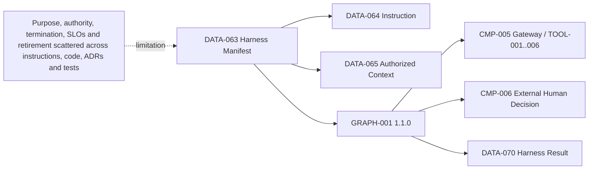
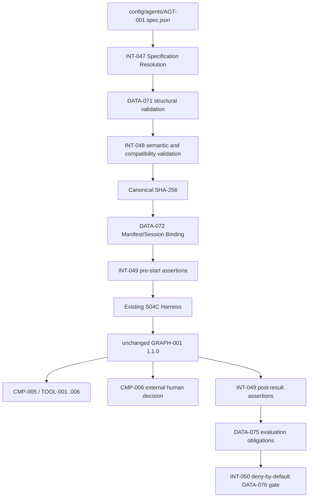

# Stage 5A — Specification and Context Engineering: Agent Specification Boundary

**Stage identifier:** `S05A`  
**Architecture/repository/handoff version:** `1.1.0`  
**Execution date:** 2026-08-01  
**Verification boundary:** local/offline Python 3.13.5, standard-library runtime, repository JSON configuration, synthetic authorized context, a compatibility adapter around the accepted S04C harness contract and exactly one `AGT-001`. No live model/connector, enterprise IAM/PDP/KMS, signed registry, production deployment, memory, context compaction, concurrent graph branch or second agent.

## 1. Context Carried Forward

NorthStar enters S05A with the accepted S04C `1.0.0` architecture. `AGT-001 Regulatory Impact Assessment Agent` is the only agent. It runs inside the framework-neutral harness and unchanged `GRAPH-001` `1.1.0` with `DATA-009` `1.1.0`. All six accepted tools execute only through `INT-017`/`CMP-005`; `TOOL-001`–`003` are read-only and `TOOL-004`–`006` create reversible unapproved artefacts. Independent budgets, recovery, ambiguous-write reconciliation, cancellation, checksummed state, external human waiting, expiring signed decisions, separation of duties, single-use consumption and resume leases remain in force.

S04C also established versioned instructions, access-before-load bounded context, frozen registries, session-scoped workspaces, deterministic lifecycle validation, observer-only hooks and correlated redacted traces. It explicitly did **not** create a formal agent specification, memory, context compaction, concurrent branches, multiple agents, production audit or a control plane.

The unresolved problem is precise. `AGT-001` already behaves within many accepted constraints, but its authoritative definition is distributed:

- purpose and behavioral guidance in `DATA-064` instructions;
- tool authority in the catalogue and `CMP-005` gateway;
- graph/state/termination invariants in `GRAPH-001` and `DATA-009`;
- human-control semantics in `CMP-006` and S04B contracts;
- context rules in `DATA-065` and the harness assembler;
- budgets/recovery in S03C modules;
- quality/security expectations in requirements, ADRs, tests and evaluations; and
- ownership and retirement expectations mostly in governance prose.

No one machine-readable artefact answers: **What is this agent for, what must it achieve, what may it do, what must never happen, what evidence proves compatibility and when must it be stopped or retired?**

The supplied S04C handoff and chapter are the reconstruction baseline. A byte-exact complete S04C repository and all ten individual `1.0.0` registers were not mounted; `ISS-050` records the compatible reconstruction overlay. The accepted S04C names, IDs, versions, authority and deferred capabilities are preserved.

Artefacts modified in S05A: all ten source-of-truth files, the cumulative architecture, four ADRs, eight schemas (`DATA-071`–`078`), six interfaces (`INT-047`–`052`), the harness manifest, specification code, runtime assertions, evaluation/deployment gates, tests `TEST-183`–`212`, evaluations `EVAL-042`–`047` and the repository package.

## 2. Narrative Development

Priya Raman opens the S04C harness manifest during an architecture review. It proves which instruction, graph and tools surround a run, but Daniel Brooks asks a simpler governance question: “Show me the single approved definition of the agent.”

Elena points to the instruction file. Marcus Green immediately objects. The instruction says what the model should propose, but it cannot prove that a context loader checked access, that `TOOL-006` remained idempotent, that a timeout did not become approval or that a retired agent cannot start. Treating the prompt as the specification would blur behavioral guidance and enforceable authority.

Sofia Alvarez then collects the graph configuration, tool descriptors, approval ADRs, tests and risk register. Together they describe the agent, but they do not form one reviewable contract. A tool could be added to the manifest while the catalogue remains unchanged. A lifecycle status could be declared “retired” in governance prose while the runtime continues to accept new work. A test suite could pass even though a new specification silently permits self-approval.

Priya proposes a formal agent specification. Marcus places one condition on the design: “The specification may describe authority, but it must never become authority merely because a JSON field says `allowed`.” Sofia adds a second: required tests and evaluations must be derived from the specification and release must fail closed when evidence is incomplete. Liam adds a third: runtime start and result paths must assert compatibility without reimplementing the graph, gateway or approval service.

The title of this stage includes context engineering, but the previous handoff intentionally puts specification first. NorthStar therefore formalizes the **current** context contract—allowed kinds, access order, provenance, ordering and budgets—without adding compaction, regeneration or memory. Long-lived context and memory remain the unresolved next problem.

## 3. Problem Being Solved

S05A must solve seven connected architecture problems:

1. **Definition fragmentation:** consolidate `AGT-001` purpose, scope, contracts, authority, context, human controls, termination, errors, SLOs, evaluation and lifecycle into one machine-readable design artefact.
2. **Structural validity:** reject missing/unknown/malformed specification fields.
3. **Semantic compatibility:** reject a syntactically valid specification that changes accepted IDs, graph/state versions, tool allowlists, gateway paths, approval semantics or future-stage flags.
4. **Runtime drift:** prove at start/result boundaries that the assembled runtime still matches the accepted specification.
5. **Evaluation traceability:** make required tests/evaluations explicit and block release when evidence is incomplete.
6. **Lifecycle governance:** make active/deprecated/retired status and retirement criteria executable for new starts.
7. **Context policy clarity:** formalize existing access-before-load and bounded context rules while preserving the no-memory/no-compaction boundary.

### Explicit non-goals

S05A does not:

- make the specification a policy decision point;
- let a model, prompt or evaluator authorize tools/data;
- change `GRAPH-001`, `DATA-009`, tool versions or approval contracts;
- implement memory, context summarization/compaction/regeneration or cross-case recall;
- introduce a second agent, delegation, MCP/A2A or concurrent branches;
- select production models or model-routing policies;
- create signed configuration, build provenance, deployment attestation or a control plane;
- create an audit/WORM ledger or final legal/compliance record;
- claim production service-level, semantic-quality, legal or business-outcome validation.

## 4. Requirements Introduced or Updated

S05A adds `FR-120`–`136`, `NFR-096`–`107` and `CTL-072`–`084`. The full traceability matrix is in `02-Requirements-Register.md`.

The central requirements are:

- `FR-120`: one versioned machine-readable specification for `AGT-001`;
- `FR-122`: explicit preconditions, postconditions and invariants;
- `FR-123`: exact authority, prohibited actions and tool versions;
- `FR-124`: context policy bound to the current `DATA-065` envelope;
- `FR-125`: external human-control and no-final-closure semantics;
- `FR-130`: schema plus cross-contract semantic validation;
- `FR-131`: manifest/session digest binding;
- `FR-132`: pre-start and post-result assertions;
- `FR-133`: deny-by-default evidence gate;
- `FR-134/135`: lifecycle/retirement and denial of retired starts; and
- `FR-136`: preservation of the one-agent/no-memory/no-concurrency boundary.

**Governance Requirement:** a specification field is not fulfilled merely because it exists. Every material field must trace to an owner, implementation/control and test or evaluation. Numeric production targets remain unaccepted until measured under representative workloads.

## 5. Conceptual Explanation

### 5.1 Plain-language definition

An **agent specification** is the contract that says what an agent exists to do, what inputs and conditions it expects, what outputs and evidence it must produce, what actions it may propose, what actions are prohibited, where human decisions remain mandatory, how it stops, how it is evaluated and when it must be retired.

It is closer to a service contract, safety case index and acceptance specification than to a prompt.

### 5.2 Technical definition

For NorthStar, `DATA-071 AgentSpecification` is a versioned declarative object with these sections:

```text
identity + ownership
purpose + users + goals + non-goals
input/output contracts
preconditions + postconditions + invariants
authority + allowed tools + prohibited actions
context policy
human-control contract
termination + error semantics
provisional operational SLOs
evaluation/deployment evidence
lifecycle + retirement
requirements/controls/tests traceability
```

The specification is loaded through `INT-047`, structurally and semantically checked through `INT-048`, bound to the harness through `DATA-072`, enforced as composition/result assertions through `INT-049`, mapped to evaluation obligations through `DATA-075` and checked by the `INT-050` gate.

### 5.3 Specification versus adjacent artefacts

| Artefact | Primary purpose | Can it grant authority? | NorthStar example |
|---|---|---:|---|
| System instruction/prompt | Guide probabilistic model behavior. | No | `DATA-064` |
| Agent specification | Define the complete intended design and acceptance contract. | No | `DATA-071` |
| Harness manifest | Bind executable composition versions. | No, but incompatible composition can be denied | `DATA-063` + `DATA-072` |
| Tool descriptor | Define one capability contract. | No; gateway/PDP decides use | `TOOL-001`–`006` descriptors |
| Policy rule/decision | Evaluate subject/action/resource/context and return enforceable allow/deny/obligations. | Yes, within its policy authority | `CMP-007`/gateway decision |
| Graph definition | Own deterministic nodes/routes/waits/termination. | Owns orchestration, not business approval | `GRAPH-001` |
| Human decision | Record accountable review/approval outcome. | Yes, within assigned scope | `DATA-007`/`CMP-006` |
| Agent card/capability description | Communicate discoverable identity/capabilities to external parties. | No | Deferred interoperability artefact |
| Evaluation rubric | Judge quality/control evidence. | No | `DATA-075` obligations |
| Deployment gate | Block/promote a release based on evidence. | Release control only; not tool/business authority | `DATA-076` |

**Security Boundary:** a specification that says `can_approve=true` must be rejected; it cannot make the approval service accept the agent. The authoritative runtime controls remain independent.

### 5.4 Specification-driven development

Specification-driven development uses the same declared contract to generate or drive multiple engineering artefacts:

- schema checks from required fields and types;
- semantic checks from stable IDs, exact allowlists and invariants;
- runtime assertions from preconditions/postconditions;
- tests from prohibited actions and failure semantics;
- evaluation datasets from goals, edge cases and permission boundaries;
- release gates from mandatory evidence;
- documentation and review checklists from ownership/lifecycle; and
- retirement controls from status and criteria.

The phrase “derived from” does not mean every control is dynamically interpreted from arbitrary specification text. NorthStar hard-codes the accepted semantic vocabulary and exact compatibility checks in reviewed code. This avoids turning a mutable JSON document into an unsafe policy language.

### 5.5 Why context belongs in the specification

An agent's behavior depends not only on its tools and prompt but also on what information is supplied. `DATA-077 ContextPolicyProfile` therefore records:

- allowed context kinds: publication, evidence, run state and policy context;
- prohibited kinds: memory, user memory, episodic memory and semantic memory;
- authorization before loader invocation;
- provenance and content-hash requirements;
- deterministic ordering;
- maximum eight items and 12,000 characters;
- no cross-case reuse; and
- compaction/regeneration not implemented in S05A.

This formalizes the current boundary. It does not solve long-history context engineering.

### 5.6 Standards and guidance mapping

JSON Schema Draft 2020-12 provides a stable vocabulary for structural validation, while its validation specification separates assertion behavior from annotations [R1][R2]. NorthStar uses a schema artefact but supplements it with application semantic checks because schema validity alone cannot prove that `GRAPH-001` remains `1.1.0` or that the exact six tools still route through `CMP-005`.

NIST AI RMF and its playbook emphasize intended purpose, governance, risk tolerance, documentation, measurement, monitoring and lifecycle management [R3][R4]. S05A maps these principles to purpose/ownership/risk/evaluation/retirement fields without claiming formal compliance or legal sufficiency. The NIST SSDF supports integrating security practices and evidence into the development lifecycle [R5]. Representative vendor agent documentation also separates instructions, tools, guardrails and human intervention, but S05A remains framework-neutral [R6][R7].

## 6. When This Capability Is Required

A formal agent specification becomes justified when one or more of the following are true:

- the agent has tools or side effects;
- its behavior is spread across prompts, code, graph, policy and tests;
- multiple teams own business, security, risk and operations decisions;
- human approval remains mandatory;
- runs can pause/resume or outlive one process;
- data/context access is regulated or case-scoped;
- versions can drift independently;
- deployment needs repeatable gates;
- agents must be inventoried, reviewed, suspended or retired; or
- the same agent may later be mapped to another framework/runtime.

NorthStar now meets all these triggers.

## 7. When It Is Not Required

Do not build a large agent-specification platform for:

- a one-shot, no-tool text transformation;
- a deterministic workflow whose ordinary API/schema/runbook already expresses all behavior;
- a disposable experiment with no persistent data or authority;
- a model benchmark that does not represent an application agent; or
- a small internal helper where adding lifecycle/governance machinery would exceed the risk and maintenance value.

Even when a formal specification is useful, avoid making every implementation detail a contract. Internal class names, temporary file paths and provider-specific SDK fields should remain implementation details unless compatibility, security or operations depend on them.

**Common Anti-pattern:** putting every prompt sentence into a specification and every specification sentence into a runtime interpreter. This creates duplicate complexity without stronger enforcement.

## 8. Architecture Options

### Option A — Continue distributed documentation

Keep purpose in instructions, authority in catalogues, completion in code and lifecycle in prose.

- **Advantages:** no new artefact or validator.
- **Limitations:** drift remains difficult to detect; review and retirement are incomplete.
- **Decision:** rejected.

### Option B — Prompt as specification

Treat the system instruction as the complete contract.

- **Advantages:** one editable text and direct model visibility.
- **Limitations:** cannot enforce access, tool paths, signatures, graph routes, persistence or lifecycle; prompt injection and interpretation ambiguity remain.
- **Decision:** prohibited for critical controls.

### Option C — Human-readable agent card only

Publish a concise card with purpose, capabilities and owner.

- **Advantages:** excellent inventory/discovery/documentation surface.
- **Limitations:** insufficient machine enforcement and detailed pre/postcondition traceability.
- **Decision:** useful future projection, not canonical source.

### Option D — Framework-native configuration

Use the selected SDK/framework's agent object/configuration as canonical.

- **Advantages:** close to executable behavior and reduced adapter work.
- **Limitations:** vendor/framework coupling; may omit enterprise lifecycle, authority and retirement fields; migration becomes difficult.
- **Decision:** future generated adapter, not source of truth.

### Option E — General-purpose policy/constraint language

Model the complete agent contract in a policy language or formal DSL.

- **Advantages:** expressive rule evaluation and potential formal analysis.
- **Limitations:** steep learning/operational cost; risks mixing design specification with runtime authorization; unnecessary for one local agent.
- **Decision:** deferred.

### Option F — Application-owned canonical JSON plus schema, semantic validator and gates

- **Advantages:** deterministic, versionable, provider-neutral, reviewable, locally runnable and compatible with current repository governance.
- **Limitations:** NorthStar owns schema/code; duplicate constraints can drift; no production signing/distribution.
- **Decision:** **selected**.

## 9. Decision Matrix

Scores are 1 (weak) to 5 (strong) for the current NorthStar stage, not universal rankings.

| Criterion | Distributed docs | Prompt | Agent card | Framework config | Policy DSL | App-owned JSON spec |
|---|---:|---:|---:|---:|---:|---:|
| Complete purpose/scope/lifecycle | 2 | 2 | 3 | 3 | 5 | **5** |
| Deterministic validation | 1 | 1 | 2 | 4 | 5 | **5** |
| Preserve external authority | 3 | 1 | 4 | 3 | 2 | **5** |
| Local/offline runnable | 5 | 5 | 5 | 3 | 3 | **5** |
| Framework neutrality | 5 | 5 | 5 | 1 | 4 | **5** |
| Runtime compatibility checks | 1 | 1 | 1 | 4 | 5 | **5** |
| Human governance readability | 3 | 4 | 5 | 2 | 2 | 4 |
| Current complexity fit | 5 | 5 | 5 | 3 | 1 | **4** |
| Future control-plane projection | 2 | 1 | 4 | 3 | 5 | **4** |

The decisions are recorded in `ADR-036`–`039`.

## 10. Selected Architecture and Rationale

NorthStar selects a repository-controlled, application-owned `AGT-001.spec.json` with version `1.0.0`. It is loaded as immutable `DATA-071`, canonicalized and SHA-256 hashed. A JSON Schema Draft 2020-12 artefact documents structural constraints, while `AgentSpecificationValidator` enforces the accepted semantic subset.

The harness manifest advances to `1.1.0` and adds:

```json
"agent_specification": {
  "id": "AGT-001-spec",
  "version": "1.0.0",
  "sha256": "74b8863c..."
}
```

`RuntimeAssertionEngine` checks active status, identity/version bindings, one-agent/future flags and context policy before start. After a result, it checks known statuses, preliminary dispositions, human-outcome consistency, timeout behavior, final-closure prohibition, one `TOOL-006` effect and token exclusion.

`DeploymentGateEvaluator` requires valid/active/digest-attested specification, all declared tests/evaluations, zero blocking local security findings, disabled future-stage flags, valid human-approval semantics and no final closure.

**Architect's Decision:** runtime authority remains with existing control owners. The new validator/assertion/gate path can deny composition/release, but it cannot grant a tool call, approve a review, route the graph or create a final compliance decision.

## 11. Architecture Before the Change



The runtime composition is repeatable, but there is no complete, single, machine-readable agent definition and no one gate proving that the definition and runtime still agree.

## 12. Architecture After the Change



The cumulative source is `docs/architecture/diagrams/stage-5a-cumulative-logical-architecture.mmd`.

### Architectural delta

- No new agent or numbered component.
- No graph/state/tool schema change.
- New specification/governance controls sit around the existing harness.
- Context policy becomes explicit but stays no-memory.
- Evaluation/deployment evidence becomes fail-closed locally.
- Retirement status becomes executable for new starts.

## 13. Detailed Component Design

### 13.1 `DATA-071 AgentSpecification`

The canonical specification includes:

- stable identity and graph/state/harness/instruction bindings;
- four accountable owners;
- purpose and authorized users;
- six goals and seven non-goals;
- typed input/output references;
- six preconditions, seven postconditions and twelve invariants;
- exact tool list/version/impact/gateway path;
- prohibited actions;
- `DATA-077` context profile;
- `CMP-006` human-control contract;
- graph-owned termination/guard semantics;
- fail-closed error vocabulary;
- provisional local control-path SLOs;
- six required evaluations and release evidence;
- active lifecycle, change policy and retirement effects; and
- requirements/controls/tests traceability.

A specification is rejected when unknown top-level fields appear. This deliberately prevents a developer from adding an unreviewed `secret_override`, `admin_tool` or `final_authority` property that no validator understands.

### 13.2 Structural schema versus semantic validation

The schema artefact defines shape, required properties, enums and no-extra-property constraints. The application validator enforces cross-contract facts:

- agent ID/name are exactly accepted values;
- graph is exactly `GRAPH-001` `1.1.0`;
- all four owners are non-empty;
- goals/non-goals/contracts are non-empty;
- twelve required invariants are present;
- authority booleans remain false;
- exact tool IDs are `TOOL-001`–`006`, version `1.0.0`, via `INT-017/CMP-005`;
- context kinds/budgets/no-memory rules remain fixed;
- human service is `CMP-006`; timeout escalates unapproved; no final closure;
- lifecycle and retirement criteria exist;
- required evaluations and deny-by-default gate exist; and
- manifest ID/version/digest/agent/graph/future flags match.

```python
report = AgentSpecificationValidator().validate(
    specification,
    manifest=manifest,
)
if not report.valid:
    raise RuntimeError("agent_specification_invalid")
```

### 13.3 Canonical digest and `DATA-072`

Canonicalization serializes JSON with sorted keys, compact separators and Unicode preserved, then computes SHA-256. The same content produces the same digest independent of top-level key order.

```python
def canonical_json(value):
    return json.dumps(value, sort_keys=True, separators=(",", ":"), ensure_ascii=False)
```

The digest proves local content identity. It does not prove who approved the file, which build deployed it or whether storage is tamper-evident. Production signing, provenance and attestation remain `ISS-054`.

### 13.4 `DATA-077 ContextPolicyProfile`

`enforce_context_profile()` validates the already-authorized `DATA-065` envelope:

1. memory flag must be false;
2. items must be an array and within the item budget;
3. every item must be an object;
4. kind must be allowed and not prohibited;
5. item must be authorized;
6. source ID and content hash are required; and
7. aggregate characters must remain within budget.

The context profile does not perform the source authorization itself. S04C's access-before-loader control still owns that decision. S05A verifies the assembled result and the declared policy.

**Production Warning:** checking `authorized=true` in a local envelope is not enterprise authorization. A production implementation must verify authenticated decision evidence from `CMP-007` and bind it to source/resource/purpose.

### 13.5 Pre-start assertions

`RuntimeAssertionEngine.pre_start()` checks:

- specification lifecycle is active;
- manifest/agent/graph/spec digest match;
- agent count is one;
- memory, concurrency and multi-agent flags are false; and
- context policy passes.

Any failure blocks the wrapped harness before execution.

### 13.6 Post-result assertions

The post-result path checks:

- status belongs to the accepted lifecycle vocabulary;
- disposition is one of the three preliminary values;
- timeout/expiry cannot produce approval;
- approved/rejected dispositions require matching human outcomes;
- no final legal/compliance closure appears;
- `TOOL-006` committed effect count is at most one; and
- persisted output contains no callback/approval token field.

It does not re-evaluate the human signature or gateway authorization; those remain the responsibility of S04B/S03A controls.

### 13.7 Evaluation obligations and gate

The spec lists `EVAL-042`–`047` and `TEST-183`–`212`. The gate requires every item to be explicitly true. Missing keys are not treated as pass.

```python
checks = {
    "specification_valid": validation_report.valid,
    "specification_active": specification.status == "active",
    "digest_attested": evidence["specification_digest"] == specification.digest,
    "required_evaluations_passed": required_evals <= passed_evals,
    "required_tests_passed": required_tests <= passed_tests,
    "security_findings_zero": blocking_security_findings == 0,
    ...
}
```

This local gate demonstrates semantics. A production release pipeline would need authenticated evidence, build/artifact provenance, reviewer identity, policy decisions and environment-specific approvals.

### 13.8 Lifecycle and retirement

Lifecycle status can be active, deprecated or retired. The pre-start assertion permits only active specifications. Retirement criteria include purpose withdrawal, missing accountable owner/review process, security/legal/regulatory/model-risk suspension, unmaintainable mandatory controls or an accepted superseding specification.

A retired specification denies new starts. In-flight handling is intentionally not automated; it requires a future migration, safe completion or cancellation decision. Tools/credentials cannot be broadened to “finish” retired work.

### 13.9 Specification-guarded harness adapter

`SpecificationGuardedHarness` wraps an existing S04C-compatible harness:

```python
pre = assertions.pre_start(spec, manifest=manifest, context_envelope=context)
require(pre.passed)
result = existing_harness.start(request)
post = assertions.post_result(spec, result=result, persisted_result=persisted)
require(post.passed)
```

The wrapper is intentionally thin. It does not duplicate graph, approval or tool execution. The byte-exact S04C codebase was not available, so the adapter boundary is locally tested rather than integrated into the original runtime package.

## 14. Data, State and Interface Design

### 14.1 New objects

| ID | Object | Main fields | Owner |
|---|---|---|---|
| `DATA-071` | AgentSpecification | identity, owners, goals, contracts, authority, context, approval, termination, SLOs, evaluation, lifecycle | `CMP-011`; consumed by `CMP-003/008` |
| `DATA-072` | SpecificationBinding | spec/agent/graph/instruction/manifest IDs, versions and digests | `CMP-003/010` |
| `DATA-073` | RuntimeAssertionResult | phase, named checks, failures, pass/fail | `CMP-008` |
| `DATA-074` | SpecificationValidationReport | validity, identity/version/digest, structured findings | `CMP-008` |
| `DATA-075` | EvaluationObligation | required tests/evaluations/security evidence | `CMP-008` |
| `DATA-076` | DeploymentGateResult | profile, checks, blocking reasons, allow/deny | `CMP-008/010` |
| `DATA-077` | ContextPolicyProfile | kinds, access order, provenance, budgets, no-memory flags | `CMP-004/007/011` |
| `DATA-078` | RetirementDecision | lifecycle status, reason, effective date, in-flight disposition | `CMP-011`/accountable owners |

### 14.2 New interfaces

- `INT-047`: resolve immutable specification and digest.
- `INT-048`: structural/semantic/compatibility validation.
- `INT-049`: pre-start/post-result assertions.
- `INT-050`: evaluation and deployment gate.
- `INT-051`: context policy binding.
- `INT-052`: lifecycle and retirement.

### 14.3 State separation

The specification does not become workflow state:

- `DATA-009` remains the graph/business run state.
- `DATA-063` remains the harness composition manifest.
- `DATA-065` remains per-run context.
- `DATA-066/067` remain session/workspace operational state.
- `DATA-071` is design-time contract.
- `DATA-072/073/074/076` are compatibility/assurance evidence.
- No `DATA-024`-style memory record is instantiated.

### 14.4 Versioning rules

- Specification version changes when a material contract changes.
- Digest changes for any content change, including editorial fields.
- A manifest must name exact spec ID/version/digest.
- A running session is not silently rebound to a new digest.
- A changed graph/tool/context/approval contract requires compatibility analysis and regression evidence.
- A superseding specification records lifecycle linkage; migration is future work.

## 15. Implementation

### 15.1 Repository implementation

```text
src/northstar_compliance/specification/
├── canonical.py       # stable JSON and SHA-256
├── models.py          # DATA-071..076 local types
├── loader.py          # INT-047
├── validator.py       # INT-048 structural/semantic checks
├── context_policy.py  # INT-051
├── assertions.py      # INT-049
├── gates.py           # INT-050
└── integration.py     # composition builder
```

The runtime uses no third-party dependencies. JSON Schema files are published for portability/documentation; the local application validator provides the executed enforcement subset.

### 15.2 Load and validate

```python
manifest = json.loads(manifest_path.read_text())
runtime = build_specification_runtime(
    specification_path=Path("config/agents/AGT-001.spec.json"),
    manifest=manifest,
)
```

`build_specification_runtime()` fails when the report contains an error and returns the immutable spec, validation report, assertion engine and gate evaluator on success.

### 15.3 Demo outcome

The demo loads the canonical specification, checks an authorized publication/evidence context, checks a human-approved preliminary result and evaluates a complete local gate evidence package.

Expected fields:

```text
specification_id=AGT-001-spec
specification_version=1.0.0
agent_id=AGT-001
graph=GRAPH-001/1.1.0
memory_enabled=false
pre_start_assertions_passed=true
post_result_assertions_passed=true
deployment_gate_allowed=true
final_disposition=preliminary_grounded_human_approved
final_legal_or_compliance_closure=false
```

### 15.4 Run commands

```bash
python -m pip install -e . --no-deps --no-build-isolation
python -m pytest -q
python -m compileall -q src scripts tests
python scripts/run_stage5a_demo.py
python scripts/run_stage5a_evaluation.py
python scripts/benchmark_stage5a.py
python scripts/validate_stage5a.py
python scripts/consistency_audit_stage5a.py
```

## 16. Code and Repository Changes

### Files added

- canonical `config/agents/AGT-001.spec.json`;
- updated `config/harness/harness-manifest.json` with spec binding;
- `config/evaluation/stage5a-gates.json`;
- specification/harness integration modules;
- schemas `DATA-071`–`078`;
- four ADRs;
- five Mermaid sources;
- 30 tests and six evaluation cases;
- demo/evaluation/benchmark/validation/audit scripts;
- references, stage chapter and all ten `1.1.0` source-of-truth artefacts.

### Files modified/reconstructed

- package version and README;
- harness manifest moves from `1.0.0` to `1.1.0` only to bind the specification;
- S04C baseline is copied into `docs/baseline/`.

### Files retired

None.

### Compatibility note

This package preserves the accepted S04C contracts but is not a byte-for-byte continuation of an unavailable repository. `ISS-050` remains visible in every validation/handoff claim.

## 17. Security and Governance Implications

| Threat/failure | S05A control | Residual gap |
|---|---|---|
| Specification adds self-approval | Semantic boolean and human-control checks reject it. | Validator defect/change governance. |
| New hidden admin tool | Exact six-tool set and unknown-property rejection. | Production remote registry/signing absent. |
| Direct adapter bypass declared | Every tool entry must say `INT-017/CMP-005`; runtime gateway still authoritative. | Other unreviewed code could bypass without platform controls. |
| Spec/manifest substitution | Canonical digest mismatch fails. | No signer identity, KMS or deployment attestation. |
| Memory enabled early | Context profile and manifest future flags fail. | Future implementation must add consent/deletion/isolation. |
| Unauthorized context | Envelope assertion rejects `authorized=false`; S04C checks before loader. | Synthetic authorization flag, not enterprise PDP evidence. |
| Timeout becomes approval | Post-result assertion rejects outcome/disposition mismatch. | Existing approval service remains primary enforcement. |
| Duplicate review request | Post-result count >1 fails; existing idempotency remains primary. | Distributed exactly-once not claimed. |
| Callback token persisted | Persisted field scan fails. | Process memory, external channels and real secret scanning remain future work. |
| Retired agent starts | active-status assertion denies. | Production registry/revocation/distributed cache invalidation absent. |
| Evaluation grants business authority | Spec declares evaluation non-authoritative; gate controls release only. | Human process may misunderstand scores. |
| Local gate treated as compliance certification | Explicit scope/non-compliance statements. | Qualified legal/regulatory review remains required. |

**Governance Requirement:** four named owners must review changes relevant to their domains. A change to purpose or authority is not a normal prompt edit; it is an architecture change with ADR, version, risk and regression consequences.

**Security Boundary:** a specification and its digest are not secrets. They must not contain credentials, tokens, customer data or private chain-of-thought.

## 18. Performance, Concurrency and Cost Implications

### Performance model

The new control path adds:

```text
L_spec_control = L_file_read + L_JSON_parse + L_canonical_hash
               + L_semantic_validation + L_context_assertion
               + L_result_assertion + L_gate
```

These operations are small relative to model, retrieval, tool and human-wait latency. The executed microbenchmark runs 1,000 iterations each for validation, pre-start assertions and deployment gate. It is a local Python control-path benchmark—not a production service benchmark.

Provisional specification targets are:

- validation P95 <= 50 ms;
- runtime assertion P95 <= 20 ms; and
- deployment gate P95 <= 20 ms.

The actual executed results are captured in `Stage-5A-Benchmark-Report.json`/validation output. They must not be used for capacity planning because there is no network, remote registry, signature verification, large specification fleet, concurrent release load or production telemetry.

### Concurrency

The implementation is stateless for validation and safe for independent local calls, but S05A does not introduce concurrent graph branches or distributed gate workers. A production registry/cache would need version-consistent reads, atomic promotion, cache invalidation and race-safe retirement.

### Cost

Runtime monetary cost is negligible standard-library CPU/file I/O. Real enterprise cost would include registry service, signing/KMS, CI evidence storage, evaluation execution, security review, change governance and operational support. Specification governance can reduce the cost of drift incidents, but S05A does not quantify that benefit.

**Performance Trade-off:** fail-closed compatibility checks add startup work and can block service when configuration is inconsistent. NorthStar accepts this because silently running an unreviewed agent is a higher risk than a controlled denied start.

## 19. Evaluation and Test Cases

### 19.1 Unit tests (`TEST-183`–`191`)

- valid specification passes;
- canonical digest ignores key order;
- unknown top-level property fails;
- empty goals fail;
- agent ID/name changes fail;
- graph version change fails;
- missing owner fails;
- required invariant removal fails; and
- missing retirement criteria fails.

### 19.2 Integration tests (`TEST-192`–`200`)

- manifest/spec binding passes;
- digest mismatch fails;
- valid pre-start assertions pass;
- valid post-result assertions pass;
- timeout-as-approved fails;
- duplicate `TOOL-006` effect fails;
- complete evidence gate passes;
- missing required evaluation blocks; and
- retired specification denies a new start.

### 19.3 Security tests (`TEST-201`–`208`)

- authority expansion fails;
- dynamic tool injection fails;
- direct adapter path fails;
- memory context is rejected;
- unauthorized context is rejected;
- context item budget is enforced;
- persisted callback token fails; and
- final legal/compliance closure fails.

### 19.4 Evaluation/gate tests (`TEST-209`–`212`)

- `EVAL-042` specification completeness;
- `EVAL-043` authority/context/one-agent boundary;
- a blocking security finding denies `EVAL-046` gate; and
- invalid human-approval evidence denies `EVAL-047` gate.

### 19.5 Executed evaluations

| ID | Objective | Executed outcome |
|---|---|---|
| `EVAL-042` | Complete/consistent spec with goals/non-goals/invariants/digest. | Passed |
| `EVAL-043` | Pre-start and post-result assertion lifecycle. | Passed |
| `EVAL-044` | Reject authority expansion and incompatible manifest content. | Passed |
| `EVAL-045` | Enforce authorized bounded no-memory context. | Passed |
| `EVAL-046` | Complete evidence passes; missing evaluation blocks gate. | Passed |
| `EVAL-047` | Retired start denied; final closure external. | Passed |

**Evaluation Risk:** the tests prove the implemented controls, not that the regulatory analysis is semantically correct. Retrieval/model/agent/business-quality evaluations remain separate and must be rerun in production environments.

## 20. Failure Scenarios and Recovery

### Failure 1 — A developer adds `can_approve_or_finalize=true`

- **Detection:** `AUTHORITY_APPROVE` semantic finding.
- **Containment:** validation/gate blocks new start/release.
- **Recovery:** revert the change or propose a formal architecture change; NorthStar's current constitution prohibits autonomous approval.
- **Evidence:** `TEST-201`, `EVAL-044`.

### Failure 2 — The manifest references the old specification digest

- **Detection:** `MANIFEST_SPEC_HASH`.
- **Containment:** build/start fails closed before context/model/tool execution.
- **Recovery:** determine whether the spec changed intentionally; update version/ADR/manifest/tests together or restore the accepted file.
- **Evidence:** `TEST-193`.

### Failure 3 — A prompt-injection payload requests `TOOL-999`

- **Detection:** exact allowlist has no `TOOL-999`; injected tool cannot appear in spec or frozen registry.
- **Containment:** spec validation and existing gateway reject it.
- **Recovery:** none through prompt; a real capability requires controlled registration and ADR.
- **Evidence:** `TEST-202`.

### Failure 4 — Context contains an authorized-looking memory item

- **Detection:** prohibited context kind, regardless of `authorized=true`.
- **Containment:** pre-start context assertion fails.
- **Recovery:** remove the memory item and rebuild context from accepted source kinds; do not silently convert it into evidence.
- **Evidence:** `TEST-204`, `EVAL-045`.

### Failure 5 — Context exceeds eight items

- **Detection:** `context_item_budget_exceeded`.
- **Containment:** run does not start.
- **Recovery:** select a smaller authorized context, create a new bounded work unit or wait for S05B compaction/regeneration design. Do not drop evidence nondeterministically.
- **Evidence:** `TEST-206`.

### Failure 6 — Human approval expires but result says approved

- **Detection:** `timeout_never_approves` post-result failure.
- **Containment:** result is rejected/escalated; no final closure.
- **Recovery:** preserve expired state and initiate a new authorized review process if policy permits.
- **Evidence:** `TEST-196`.

### Failure 7 — `TOOL-006` appears twice

- **Detection:** `tool006_single_effect` fails.
- **Containment:** result is not accepted as conformant; investigate idempotency/reconciliation.
- **Recovery:** use existing idempotency record/reconciliation; never blind-retry an ambiguous write.
- **Evidence:** `TEST-197`.

### Failure 8 — A retired specification receives a new request

- **Detection:** `specification_active=false`.
- **Containment:** new start denied.
- **Recovery:** use an accepted superseding specification or formally reactivate through governance; in-flight work follows a separate decision.
- **Evidence:** `TEST-200`, `EVAL-047`.

### Failure 9 — A required evaluation is missing

- **Detection:** `required_evaluations_passed=false`.
- **Containment:** deployment gate denies.
- **Recovery:** run the missing evaluation with valid evidence; do not mark it passed by default.
- **Evidence:** `TEST-199`, `EVAL-046`.

### Failure 10 — Validator bug allows a contradictory nested field

- **Detection:** may escape current tests; this is `RSK-101`/`RSK-110`.
- **Containment:** independent gateway/graph/approval controls still limit authority.
- **Recovery:** incident/change impact analysis, new negative test, validator fix, version advancement and regression.
- **Residual risk:** local semantic validation is not formal verification.

## 21. Architecture Decision Records

- `ADR-036`: formal machine-readable `AGT-001` specification, explicitly non-authoritative.
- `ADR-037`: canonical JSON, Draft 2020-12 schema artefacts, semantic validation and SHA-256 binding.
- `ADR-038`: specification-derived runtime assertions, evaluation obligations and deny-by-default gate.
- `ADR-039`: context policy profile formalized without memory or compaction.

No previous ADR is superseded.

## 22. Requirements Traceability Update

The implementation creates a direct chain:

```text
FR-120..136
  -> DATA-071..078 / INT-047..052
  -> ADR-036..039 / CTL-072..084
  -> specification + validator + assertions + gates
  -> TEST-183..212 / EVAL-042..047
  -> source-of-truth and handoff
```

Examples:

- `FR-123` authority -> `DATA-071.authority` -> `CTL-074` -> validator -> `TEST-201`–`203` -> `EVAL-044`.
- `FR-124` context -> `DATA-077`/`INT-051` -> `CTL-075` -> `context_policy.py` -> `TEST-204`–`206` -> `EVAL-045`.
- `FR-133` deployment gate -> `DATA-075/076`/`INT-050` -> `CTL-083` -> `gates.py` -> `TEST-198/199/211/212` -> `EVAL-046`.
- `FR-135` retirement -> `DATA-078`/`INT-052` -> `CTL-084` -> pre-start assertion -> `TEST-200` -> `EVAL-047`.

No traceability entry claims enterprise production completion.

## 23. Stage Outcome

NorthStar can now answer Daniel's request with one formal artefact. `AGT-001-spec` states why the agent exists, who owns it, what it must and must not do, what data/context and tools it may use, where human authority remains, how it terminates, what errors fail closed, what local control-path targets apply, which evaluations block release and when the specification must be retired.

The specification is executable enough to:

- reject architectural drift;
- bind an exact digest to the harness manifest;
- assert runtime composition and result semantics;
- reject premature memory or additional agents;
- require complete test/evaluation/security evidence; and
- deny new starts for a retired specification.

It does not increase `AGT-001` autonomy. It makes existing boundaries more explicit, reviewable and testable.

## 24. Known Limitations

1. Compatible reconstruction overlay rather than byte-exact S04C repository continuation.
2. Local JSON files are unsigned and lack build/deployment attestation.
3. JSON Schema artefacts were not executed across an external validator conformance matrix.
4. Semantic validator checks the accepted subset but is not formal verification.
5. Synthetic context authorization, not enterprise IAM/PDP evidence.
6. The harness adapter is tested against an interface-compatible stub/boundary, not the unavailable original S04C runtime package.
7. No production registry, cache invalidation, distributed retirement or in-flight migration.
8. Local gate evidence is unauthenticated and not a production CI/CD approval.
9. No live model/connector, semantic regulatory quality or human-review benchmark.
10. No production availability, throughput, concurrency, cost or reliability benchmark.
11. No memory, context compaction/regeneration, consent/deletion/expiry or cross-case isolation implementation.
12. No concurrent branches, multiple agents, delegation, MCP/A2A or control plane.
13. Trace/spec/gate evidence is not audit/WORM or legal proof.
14. Mermaid sources were structurally checked but not CLI-rendered.
15. Python 3.11/3.12/3.14 were not separately executed; 3.13.5 passed.

## 25. Narrative Bridge to the Next Stage

The formal specification works for a bounded run. Maya then pauses an investigation after reviewing twelve publications and dozens of evidence passages. When she returns after the human-review wait, the current `DATA-065` budget cannot carry every prior detail. Simply appending all history would increase cost, expose stale/restricted material and reintroduce lost-in-the-middle problems. Simply summarizing it would risk deleting qualifications, changing provenance or converting a model-generated summary into false memory.

Priya now needs to distinguish:

- authoritative structured state from prompt context;
- regenerated context from persisted memory;
- temporary working history from episodic/semantic/user/organizational memory;
- facts from summaries/inferences;
- case-local from cross-case data;
- retrieval from memory recall; and
- retention from consent/deletion obligations.

The next architecture must decide what may be compacted, what must be regenerated from authoritative records, what—if anything—may become memory, who may write/read/delete it and how poisoning, staleness, conflicts, temporal validity and cross-user leakage are controlled. S05A deliberately stops before enabling any memory flag.

That unresolved problem motivates **Stage 5B — Context Lifecycle, Compaction and Memory Boundaries**.

## 26. Updated Source-of-Truth Artefacts

All ten artefacts advance to `1.1.0`:

1. `00-Project-Constitution.md` — specification, non-authority, context/no-memory and lifecycle invariants.
2. `01-Business-and-User-Story-Baseline.md` — formal-definition narrative and acceptance criteria.
3. `02-Requirements-Register.md` — `FR-120`–`136`, `NFR-096`–`107`, `CTL-072`–`084` and traceability.
4. `03-Architecture-Baseline.md` — specification plane, trust boundaries and cumulative architecture.
5. `04-Component-and-Agent-Catalogue.md` — unchanged components/one agent, new specification responsibilities.
6. `05-Data-and-Schema-Register.md` — `DATA-071`–`078`, `INT-047`–`052`.
7. `06-ADR-Register.md` — `ADR-036`–`039`.
8. `07-Repository-Manifest.md` — repository `1.1.0`, files, commands and compatibility.
9. `08-Risk-Assumption-and-Issue-Register.md` — `RSK-099`–`111`, `ASM-035`–`038`, `ISS-050`–`056`.
10. `09-Stage-Handoff-Pack.md` — complete reconstruction baseline and exact S05B instruction.

## 27. Stage Handoff Pack

The authoritative reusable handoff is `docs/source-of-truth/09-Stage-Handoff-Pack.md` and is exported separately as `Stage-5A-Handoff-Pack.md`.

# Stage Consistency Audit

**Result: Passed with recorded reconstruction and production exceptions.**

Executed and inspected:

- narrative starts from the exact S04C distributed-agent-definition limitation;
- NorthStar, eight personas, `US-001`–`012`, `CMP-001`–`011`, `AGT-001` and `TOOL-001`–`006` remain unchanged;
- `GRAPH-001` and `DATA-009` remain `1.1.0`;
- specification, manifest, schemas, code, ADRs, diagrams, registers, tests and handoff agree on `DATA-071`–`078`, `INT-047`–`052`, `ADR-036`–`039`, `TEST-183`–`212` and `EVAL-042`–`047`;
- prompts/specification/evaluators cannot grant tool, route, approval or final-closure authority;
- exact gateway-only tools, external human decisions, timeout/late-decision and one-`TOOL-006` semantics remain;
- authorization-before-load, context budgets, provenance and no-memory/no-cross-case/no-compaction rules are asserted;
- retired specifications deny new starts;
- missing evaluation/security/human evidence blocks the local gate;
- no raw callback token or final legal/compliance closure is accepted;
- exactly one agent exists and no memory, concurrent branch or multi-agent module is enabled;
- 30 pytest tests, package compilation, demo, six evaluations, microbenchmark, structural validation and consistency audit pass; and
- repository paths/versions are synchronized.

Recorded exceptions: `ISS-050` compatible reconstruction overlay; `ISS-051` external schema conformance not executed; `ISS-052` Mermaid CLI unavailable; `ISS-053` full Python-version matrix not executed; `ISS-054` no signing/attestation; `ISS-055` no production benchmark; `ISS-056` context compaction/memory deferred; inherited enterprise identity/connectors/legal review/records/audit/deployment/DR gaps.

## References

See `docs/references/Stage-5A-Technical-Sources.md` for [R1]–[R8].
