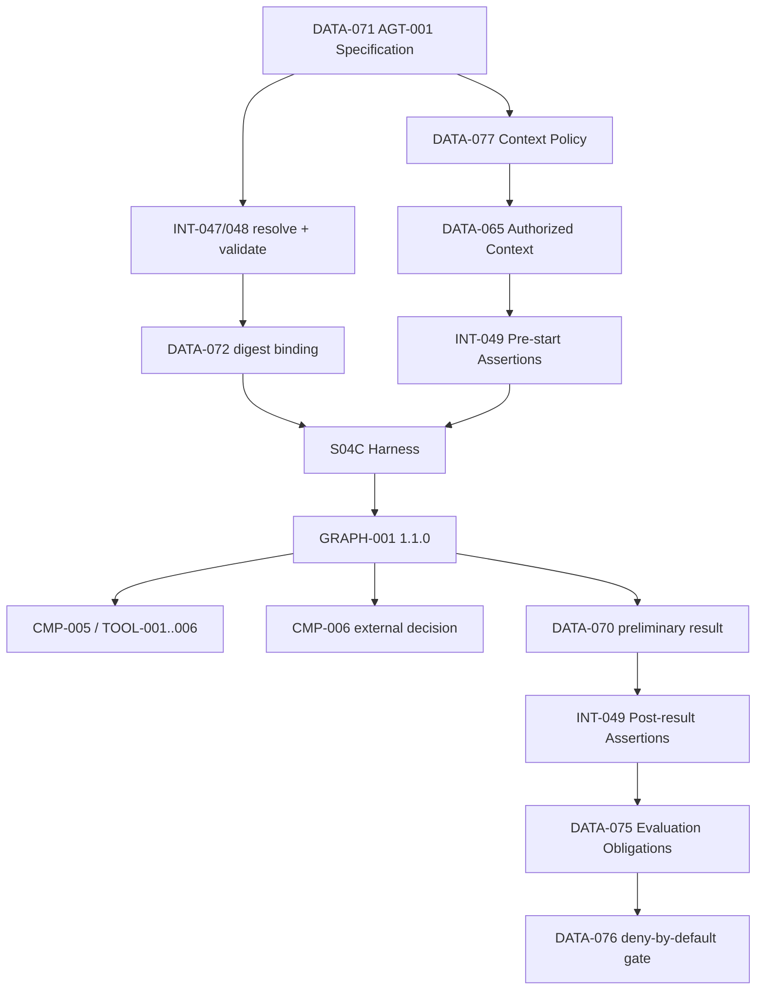

# 03 — Architecture Baseline

**Architecture version:** `1.1.0`

## Preserved baseline

- Organization/personas/components: unchanged.
- One agent: `AGT-001 Regulatory Impact Assessment Agent`.
- Graph/state: `GRAPH-001` `1.1.0`, `DATA-009` `1.1.0`.
- Harness: S04C framework-neutral composition inside `CMP-003`/`CMP-010`.
- Tools: exact `TOOL-001`–`006`, all through `INT-017`/`CMP-005`.
- Human decision: external `CMP-006`; signed/typed/role/SoD/expiry/single-use.
- Context: `DATA-065`, authorization-before-load, bounded/provenance-preserving, no memory.
- Result semantics: preliminary only; timeout never approves; late decision fails closed.

## Architectural change

S05A adds a design-time specification plane integrated with the harness composition path:

- `DATA-071 AgentSpecification`
- `DATA-072 SpecificationBinding`
- `DATA-073 RuntimeAssertionResult`
- `DATA-074 SpecificationValidationReport`
- `DATA-075 EvaluationObligation`
- `DATA-076 DeploymentGateResult`
- `DATA-077 ContextPolicyProfile`
- `DATA-078 RetirementDecision`
- `INT-047`–`052`

The specification does not become a policy decision point or runtime authority. It expresses expected constraints; validators/assertions compare composition/outcomes against them. Existing enforcement points remain authoritative.

## Architecture before

See `docs/architecture/diagrams/stage-5a-architecture-before.mmd`.

## Architecture after

See `docs/architecture/diagrams/stage-5a-cumulative-logical-architecture.mmd`.

## Trust and ownership boundaries

1. `CMP-011` governs specification source and change history.
2. `CMP-003` resolves/binds specification and blocks incompatible starts.
3. `CMP-004`/`CMP-007` still authorize context before loading.
4. `CMP-005` still authorizes and executes tools.
5. `CMP-006` still validates/owns human decisions.
6. `GRAPH-001` still owns routes and termination.
7. `CMP-008` validates specification, assertions and gate evidence but cannot authorize operations.
8. `CMP-010` hosts local files/processes and does not provide production signing/attestation.

## Version and migration rule

A changed specification digest creates a new run binding. An in-flight S04C session is not silently rebound. Compatibility mismatch fails closed; future in-flight migration requires an explicit ADR and migration contract.
