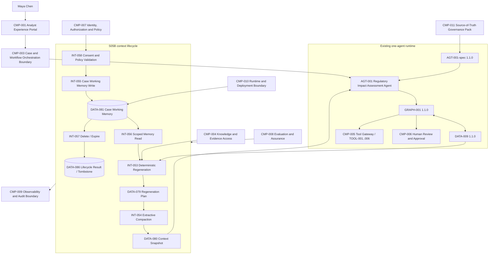

# 03 — Architecture Baseline

**Architecture version:** `1.2.0`

## 1. Preserved baseline

The S05A architecture remains: `AGT-001` inside the specification-guarded S04C harness; unchanged `GRAPH-001 1.1.0` and `DATA-009 1.1.0`; gateway-only `TOOL-001`–`006`; external typed human decisions through `CMP-006`; budgets, recovery, leases, digests and deny-by-default evaluation gates.

## 2. Problem before S05B

`DATA-065` is bounded to eight items/12,000 characters and had no regeneration, compaction or memory lifecycle. Long cases could either overflow the envelope or rely on unsafe transcript accumulation/model summarization.

## 3. Selected architecture

S05B adds a context-lifecycle path within existing component boundaries:

1. `INT-053` reads authorized `DATA-009` state and current source metadata.
2. `DATA-079` defines the deterministic regeneration plan.
3. `ContextRegenerator` emits typed `ContextItem` and `MemoryFact` values.
4. `INT-054` performs complete-item extractive compaction into `DATA-080` and records omissions.
5. The workflow may proceed with `DATA-080` alone.
6. With valid `DATA-082` consent, `INT-055` writes one `DATA-081` case-local continuity record.
7. `INT-056` reads only same-tenant/same-case/authorized-user active, non-stale records.
8. `INT-057` deletes or expires content and returns `DATA-086`.
9. `INT-058` binds consent/purpose/policy checks to every memory operation.

## 4. Cumulative logical architecture

## 5. State/context/memory ownership

| Category | Owner/source | Durability | Authority |
|---|---|---|---|
| Authoritative case state | `DATA-009`, graph/state owners | Durable checkpoint/state | Current operational truth; route mutation only through accepted graph controls |
| Source repositories | `CMP-002/004/005` | Authoritative external systems | Current publication/evidence/tool truth |
| Human decision | `CMP-006`, `DATA-007` | Durable typed decision | Human approval/rejection within assigned scope |
| Context plan/snapshot | `CMP-003`, `DATA-079/080` | Disposable/short-lived evidence | No authority; invocation projection only |
| Case working memory | `CMP-003/010`, `DATA-081` | Short-lived, consented | No authority; continuity hint subordinate to current state |
| Lifecycle tombstone | `CMP-010`, `DATA-086` | Minimal local evidence | Proves lifecycle action locally; not audit/WORM |

## 6. Trust boundaries

- Context/memory receives only content that already passed source authorization.
- Consent validation belongs to `CMP-007`, not to the model.
- Storage path and retention belong to `CMP-010`.
- Semantic/freshness verification relies on source bindings and current versions from `CMP-004`.
- The model has no direct write interface to memory.
- Memory cannot be passed across tenants or cases.

## 7. Architecture changes and non-changes

### Added

`DATA-079`–`086`, `INT-053`–`058`, `ADR-040`–`043`, `MEM-POL-001`, memory lifecycle modules, schemas, tests and evaluations.

### Unchanged

No new component ID, agent ID or tool ID; no graph route change; no tool-authority change; no approval-semantic change; no concurrent branch, delegation, MCP, A2A or control plane.

## 8. Production mapping

The local file store is a tutorial adapter. A production design would map `DATA-081` to encrypted tenant-partitioned storage with authenticated workload identity, policy decisions, key management, deletion propagation, retention holds where legally required, distributed idempotency and tamper-evident audit evidence. None is claimed implemented here.
