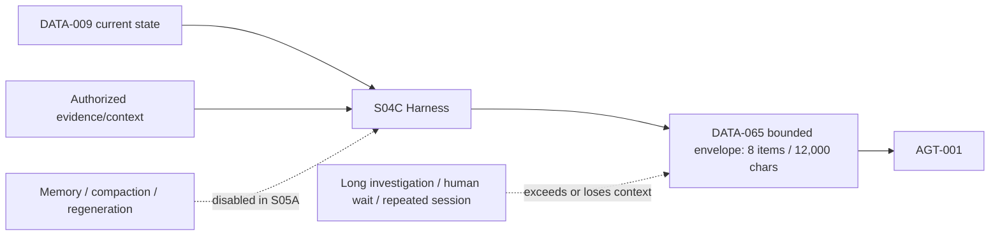
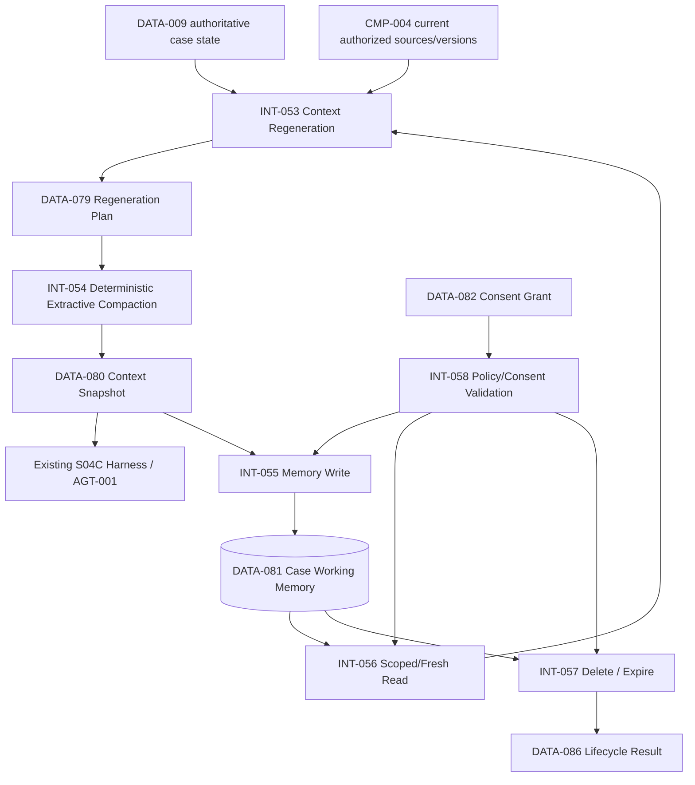

# Stage 5B — Context Lifecycle, Compaction and Memory Boundaries

**Stage identifier:** `S05B`  
**Architecture/repository/handoff version:** `1.2.0`  
**Execution date:** 2026-08-01  
**Verification boundary:** local/offline Python 3.13.5, standard-library runtime, synthetic identity/consent, deterministic state/context fixtures and an atomic case-partitioned JSON store. No live model or connector, enterprise IAM/PDP/KMS, production database, distributed concurrency, audit/WORM, broader memory category, second agent or concurrent graph branch.

## 1. Context Carried Forward

NorthStar enters S05B with the accepted S05A `1.1.0` architecture. `AGT-001 Regulatory Impact Assessment Agent` is the only agent. It runs in the specification-guarded S04C harness and unchanged `GRAPH-001 1.1.0` with `DATA-009 1.1.0`. `TOOL-001`–`006` remain gateway-only; human decisions remain external, typed, expiring, separation-of-duties controlled and single-use; timeout never approves; approved/rejected remain preliminary rather than final legal/compliance closure.

S05A established `DATA-071 AgentSpecification`, canonical binding, runtime assertions, evaluation obligations and `DATA-077 ContextPolicyProfile`. The context boundary authorized before loading, preserved source hashes/order and limited an envelope to eight items and 12,000 characters. Memory, cross-case reuse, compaction and regeneration were deliberately disabled. The handoff identified the exact problem: a long investigation can exceed the envelope after many documents, human waits and repeated sessions. fileciteturn3file1

The supplied handoff and S05A chapter are the reconstruction baseline. The byte-exact S05A repository and ten detailed `1.1.0` registers were not mounted, so `ISS-057` records a compatible reconstruction overlay. No accepted name, identifier, authority, graph/state version, tool contract or human-control semantic is changed.

Artefacts modified in S05B: all ten source-of-truth files; `AGT-001-spec`; harness/context policy; four ADRs; eight data schemas (`DATA-079`–`086`); six interfaces (`INT-053`–`058`); memory lifecycle code; six Mermaid diagrams; tests `TEST-213`–`242`; evaluations `EVAL-048`–`054`; benchmark, validation and consistency-audit outputs.

## 2. Narrative Development

Maya Chen returns after a human-review wait. The case now refers to twelve publications, many policy passages, unresolved questions and a preliminary risk assessment. Re-inserting the full history would exceed `DATA-065`, increase cost and revive the risk that important content is lost in the middle of a long prompt. Research has repeatedly shown that long-context models may use information less reliably when it appears away from prompt boundaries, so more context is not equivalent to better context [S1].

Priya Raman separates three things that had been discussed as though they were the same:

1. **State** — the authoritative current case and approval status.
2. **Context** — a bounded projection assembled for the next work unit.
3. **Memory** — optional retained continuity information that may help reconstruct context later but must never become authority.

Elena Petrov proposes deterministic regeneration from `DATA-009`, then complete-item extractive compaction. Marcus Green rejects direct model memory writes and cross-case recall. Sofia Alvarez requires explicit opt-in, purpose limitation, provenance, expiry and deletion. Liam O'Connor requires idempotent writes, stale-source checks, content removal and tamper detection.

The team does **not** build a general memory platform. It enables the smallest capability that solves Maya's continuity problem: one short-lived, case-local working-memory record for one opted-in user.

## 3. Problem Being Solved

S05B addresses ten connected problems:

1. Reconstruct context after process/session boundaries without relying on conversational history.
2. Keep current authoritative state distinct from any prompt projection or stored memory.
3. Compact the context without silently rewriting or inventing facts.
4. Preserve critical case and human-review semantics when the budget is tight.
5. Decide which memory categories are genuinely required.
6. Prevent cross-tenant, cross-case and cross-user leakage.
7. Control who may write/read/delete memory and for what purpose.
8. Track provenance, temporal validity, staleness and supersession.
9. Implement expiry and deletion without pretending local files satisfy enterprise records obligations.
10. Prove no new tool authority, graph authority, approval authority, second agent or concurrency has appeared.

### Explicit non-goals

S05B does not implement model-generated durable summaries, full conversation-history storage, semantic/vector memory, episodic memory, user profiles, organizational memory, shared-agent memory, cross-case learning, autonomous conflict resolution, multi-agent coordination, event sourcing, audit/WORM, production privacy compliance or production storage.

## 4. Requirements Introduced or Updated

S05B adds `FR-137`–`154`, `NFR-108`–`121` and `CTL-085`–`099`. The full mapping is in `02-Requirements-Register.md`.

The central requirements are:

- `FR-137/138`: deterministic regeneration and explicit state/context/memory separation;
- `FR-139`–`141`: extractive compaction, pinned required items and unchanged hard budget;
- `FR-142`–`145`: minimum case-working memory, opt-in consent, authoritative provenance and tenant/case/user isolation;
- `FR-146/147`: idempotent writes and one active record per case;
- `FR-148`–`150`: staleness, expiry and deletion;
- `FR-151/152`: poisoning/authority-field rejection and tamper detection;
- `FR-153`: no-memory resume remains valid; and
- `FR-154`: preserve one agent, sequential graph execution and all external control owners.

**Governance Requirement:** default 14-day and maximum 30-day retention are tutorial parameters, not NorthStar legal/records policy. Qualified privacy, legal and records owners must approve the production schedule.

## 5. Conceptual Explanation

### 5.1 State, context and memory

**Authoritative state** is the structured current truth used to control a workflow. For NorthStar, `DATA-009` owns status, revision, graph progress, references and preliminary disposition. State is written only through accepted graph/state controls.

**Context** is a purpose-specific view provided to a model or deterministic node. It is assembled for a particular invocation, constrained by authorization and budget, and disposable. A context snapshot may prove what was supplied, but it is not a business record or a new fact source.

**Memory** is retained information that can be recalled in a later session. Memory can improve continuity, but it introduces privacy, staleness, poisoning, conflict, deletion and isolation obligations. It must be treated as a subordinate cache/projection, never as a substitute for current state.

### 5.2 Memory taxonomy and NorthStar's choices

| Type | Meaning | Example | S05B decision |
|---|---|---|---|
| Conversation history | Prior turns/messages | Full analyst chat | Not persisted as memory. |
| Working memory | Short-lived task continuity | Current facts and unresolved questions | **Enabled, case-local only.** |
| Episodic memory | Past events/experiences | “Last assessment used…” | Disabled. |
| Semantic memory | Generalized learned facts | “Control X usually maps to…” | Disabled. |
| Procedural memory | Learned execution methods | Workflow technique | Remains reviewed code/specification, not learned memory. |
| User-profile memory | Preferences/attributes across tasks | Maya's preferred report style | Disabled. |
| Organizational memory | Shared enterprise knowledge | Cross-case precedents | Remains authorized retrieval repositories, not agent memory. |
| Shared-agent memory | Common multi-agent workspace | Blackboard | Disabled; no second agent. |

The literature includes architectures that manage different memory tiers or long-running agent history [S2][S3]. These demonstrate useful patterns but do not make broad memory necessary for NorthStar. The architectural principle is minimum justified persistence.

### 5.3 Context lifecycle

The lifecycle is:

```text
authorize sources
      ↓
read current DATA-009 and source versions
      ↓
regenerate typed items and facts
      ↓
remove unauthorized items
      ↓
compact complete items under target/hard budgets
      ↓
use DATA-080 for the work unit
      ↓
(optional) persist approved fact projection with consent
      ↓
read later only if same scope, active, unexpired and current
      ↓
supersede, expire or delete
```

Long-running-agent guidance increasingly recommends external progress/state artefacts and session-start reconstruction rather than assuming a single context window contains all history [S4]. NorthStar implements that principle with typed state and deterministic projections.

### 5.4 Regeneration versus replay

Regeneration asks: “Given current authoritative state and source metadata, what context is needed now?” It is not a replay of every prior prompt/tool call. Replay would be larger, may expose superseded data and may reproduce earlier mistakes. Regeneration intentionally projects the current case.

### 5.5 Compaction versus summarization

Model summarization can be valuable for low-risk narrative text, but a durable regulatory memory path must not turn a probabilistic paraphrase into truth. S05B therefore uses **extractive compaction**:

- sort typed items by priority;
- retain required case and approval state;
- include only complete items that fit;
- preserve their exact source ID/version/hash;
- collect only facts attached to included items; and
- record every omitted item as unauthorized or budget-excluded.

A future stage may evaluate model-assisted summaries, but any such summary would need explicit “derived inference” labeling, verification and non-authoritative handling.

### 5.6 Freshness and conflicts

A memory fact binds to a source version. When the current source version differs, the record is stale. S05B excludes it by default rather than merging or choosing between conflicting values. The current `DATA-009`/source system always wins. Conflict resolution remains an explicit state/source reconciliation task.

### 5.7 Consent, retention and deletion

Privacy engineering requires clear purpose, limited collection, appropriate retention, accuracy and safeguards. Canadian privacy guidance emphasizes limiting use/retention and maintaining accuracy/safeguards; NIST privacy guidance treats data processing across its lifecycle [S5][S6][S7]. S05B applies those principles architecturally without claiming a legal conclusion:

- purpose is fixed to `case_session_continuity`;
- consent is operation-specific and expiring;
- data is minimized to typed facts;
- retention is bounded;
- deletion removes content; and
- broader reuse is disabled.

## 6. When This Capability Is Required

Context lifecycle engineering is justified when:

- a run can pause and resume across processes or human waits;
- authoritative state and source references already exist;
- a bounded context cannot carry the whole history;
- repeated regeneration is cheaper/safer than transcript replay;
- analysts need continuity across sessions;
- case isolation and deletion are material requirements; or
- stale/conflicting data must be detected explicitly.

A persistent memory record is justified only when regeneration from state alone omits useful continuity information that is still authoritative, scoped, consented and time-limited.

## 7. When It Is Not Required

Do not add memory when:

- the task finishes in one short request;
- all needed information is already in structured state/retrieval systems;
- continuity can be regenerated without retaining additional content;
- consent, purpose, expiry or deletion cannot be enforced;
- the data is highly sensitive and no production security boundary exists;
- the proposed memory is only a convenience profile; or
- the organization cannot distinguish memory from authoritative records.

**Common Anti-pattern:** storing every conversation turn “for future intelligence.” This creates a shadow data lake, magnifies injection/poisoning risk and makes deletion/freshness nearly impossible.

## 8. Architecture Options

### Option A — Replay complete conversation/tool history

Simple but unbounded, expensive, stale and prone to context-position effects. Rejected.

### Option B — Model-authored rolling summary

Compact and flexible, but can drop qualifications or invent stable facts. Rejected for the durable S05B path.

### Option C — Regenerate entirely from structured state and retrieval, no memory

Safest and remains the default. It may omit useful unresolved-work continuity that is not worth adding to the authoritative state.

### Option D — Persist case-local extractive working memory

Stores a minimal projection with source bindings, consent, expiry and deletion. Selected as the only enabled memory category.

### Option E — Cross-case semantic/vector memory

Could discover precedents but creates significant permission, purpose, poisoning, temporal and legal risks. Deferred.

### Option F — Event-sourced history

Excellent for replay/audit when justified, but this stage lacks an event-store requirement and must not confuse memory with audit. Deferred.

## 9. Decision Matrix

Scores are 1 (weak) to 5 (strong) for the current NorthStar problem.

| Criterion | Full replay | Model summary | State-only regeneration | Case-local extractive memory | Cross-case semantic memory | Event history |
|---|---:|---:|---:|---:|---:|---:|
| Preserves authority boundary | 3 | 2 | **5** | **5** | 2 | 5 |
| Bounded context/cost | 1 | 5 | 4 | **5** | 4 | 2 |
| Provenance fidelity | 3 | 2 | **5** | **5** | 3 | 5 |
| Privacy/isolation simplicity | 2 | 3 | **5** | 4 | 1 | 2 |
| Session continuity | 5 | 4 | 3 | **5** | 5 | 5 |
| Freshness/conflict control | 1 | 2 | **5** | 4 | 2 | 4 |
| Local/offline fit | 5 | 4 | **5** | **5** | 2 | 3 |
| Current complexity fit | 3 | 3 | **5** | 4 | 1 | 2 |

NorthStar combines Option C as the default with Option D as an explicit opt-in enhancement.

## 10. Selected Architecture and Rationale

NorthStar selects:

1. **Authoritative regeneration first.** `ContextRegenerator` creates `DATA-079` and typed items from `DATA-009` and authorized source bindings.
2. **Deterministic extractive compaction.** `ContextCompactor` creates `DATA-080`, preserving required state, provenance and omissions.
3. **Optional minimum memory.** `CaseWorkingMemoryService` persists one `DATA-081` record only with valid `DATA-082` consent.
4. **Exact isolation and freshness.** Reads require the same tenant/case/user and reject expired/superseded/stale content by default.
5. **Lifecycle disposal.** New writes supersede old; expiry/deletion removes content and writes a minimal tombstone.
6. **No model memory authority.** Memory operations are internal harness/service calls, not tools exposed to `AGT-001`.

The selected design is recorded in `ADR-040`–`043`.

## 11. Architecture Before the Change



S05A could validate a bounded context but could not reconstruct or compact it across long sessions.

## 12. Architecture After the Change



### Change summary

- No new agent, tool or component ID.
- `AGT-001-spec` advances to `1.1.0` only to describe the memory boundary.
- Harness manifest advances to `1.2.0`; graph/state bindings do not change.
- `DATA-077` continues the same hard budget.
- Broader memory and concurrency remain disabled.

## 13. Detailed Component Design

### 13.1 `ContextRegenerator`

The regenerator validates the tenant/case/principal against the case state. It produces:

- critical case facts: ID, status, revision, publication, jurisdictions, risk and preliminary disposition;
- sanitized human-review references with callback/approval tokens/signatures removed;
- unresolved questions;
- evidence references with source IDs, versions, hashes and authorization flags; and
- optionally, authorized active case-working records.

It performs no model call. Identical inputs produce identical items/facts and plan ID, apart from the generated timestamp.

### 13.2 `ContextCompactor`

The compactor sorts by priority, removes unauthorized items, requires case and approval state, checks complete rendered item size, selects items until target limits and records each omission. It does not truncate a fact or passage mid-item.

```python
snapshot = ContextCompactor(policy).compact(
    ContextRegenerator(policy).regenerate(
        scope=scope,
        case_state=case_state,
        state_version="1.1.0",
    )
)
```

If a required item cannot fit, it raises `required_context_item_exceeds_budget`. This is safer than silently dropping approval status.

### 13.3 `MemoryConsentGrant`

`DATA-082` binds:

- tenant, case and user;
- purpose `case_session_continuity`;
- permitted operations: write/read/delete;
- issue/expiry; and
- optional revocation.

The local grant is an unsigned test object. Production must bind it to authenticated principal and policy evidence.

### 13.4 `CaseWorkingMemoryService`

The write path:

1. validates consent/scope/purpose;
2. accepts only `deterministic_extractive_v1` snapshots;
3. enforces TTL/fact/value limits;
4. accepts only `authoritative_state` and `human_decision_reference` origins;
5. requires provenance;
6. rejects authority fields, tokens, hidden reasoning and instruction-like content;
7. enforces idempotency; and
8. supersedes the prior active record.

The read path returns only same-scope, authorized, active, unexpired and non-stale records by default. The delete/expiry path removes the `.record.json` content and creates a fact-free tombstone.

### 13.5 `LocalCaseMemoryStore`

The store uses safe identifiers, root containment, atomic temporary-file replacement and record digests. This demonstrates deterministic lifecycle behavior. It lacks encryption, authenticated signatures, transactions, distributed locks, replica control and backup deletion.

### 13.6 `ContextLifecycleEngine`

The engine supports four modes:

- regenerate/compact with no memory;
- read valid memory then regenerate/compact;
- regenerate/compact then write memory;
- read and later refresh/supersede memory.

Memory is never mandatory for resumption.

## 14. Data, State and Interface Design

### 14.1 Fact provenance

Each memory fact contains:

```json
{
  "fact_id": "FACT-...",
  "field_name": "risk_level",
  "value": "high",
  "origin": "authoritative_state",
  "source": {
    "source_ref": "DATA-009:CASE-2026-001",
    "source_version": "1.1.0",
    "source_sha256": "..."
  }
}
```

No field can be promoted merely because it appears in memory. The harness presents it as continuity context with provenance.

### 14.2 Supersession model

The local implementation maintains at most one active record per case. A new record marks the old one `superseded` and identifies it through `supersedes_record_id`. This avoids consolidation into an unbounded profile.

### 14.3 Temporal validity

- Consent has its own expiry/revocation.
- The memory record has its own expiry.
- Every fact/source binding has a source version.
- Any material source-version mismatch marks the record stale.

These clocks are independent; all must be valid.

### 14.4 Interface failure semantics

| Interface | Representative failure | Required behavior |
|---|---|---|
| `INT-053` | tenant/case/user mismatch | Deny before assembly. |
| `INT-054` | required item cannot fit | Fail closed; do not build incomplete context. |
| `INT-055` | invalid consent/origin/provenance/idempotency conflict | No write. |
| `INT-056` | stale/expired/unauthorized record | Exclude and classify; no implicit override. |
| `INT-057` | missing record/unauthorized delete | Fail; retain current content for investigation. |
| `INT-058` | no/expired/revoked/wrong-purpose grant | Deny operation. |

## 15. Implementation

### 15.1 Repository modules

- `models.py` — immutable typed data models.
- `policy.py` — `MEM-POL-001` loading and future-capability denial.
- `regeneration.py` — state/source projection.
- `compaction.py` — deterministic selection and omission ledger.
- `store.py` — local atomic partitioned persistence and digest verification.
- `service.py` — consented write/read/delete/expiry behavior.
- `lifecycle.py` — start/resume orchestration.
- `canonical.py` — deterministic JSON and SHA-256.

### 15.2 Configuration

`config/memory/policy.json` sets:

```json
{
  "allowed_memory_kinds": ["case_working"],
  "requires_opt_in": true,
  "default_ttl_days": 14,
  "max_ttl_days": 30,
  "context_target_items": 6,
  "context_target_chars": 8000,
  "hard_max_items": 8,
  "hard_max_chars": 12000,
  "allow_cross_case_recall": false,
  "allow_user_profile_memory": false,
  "allow_semantic_memory": false,
  "allow_episodic_memory": false,
  "allow_organizational_memory": false,
  "allow_shared_agent_memory": false
}
```

### 15.3 Running locally

```bash
python -m venv .venv
. .venv/bin/activate
pip install -e '.[test]'
python scripts/run_stage5b_demo.py
pytest -q
python scripts/run_stage5b_evaluation.py
python scripts/benchmark_stage5b.py
python scripts/validate_stage5b.py
python scripts/consistency_audit_stage5b.py
```

No network, API key or paid service is needed.

## 16. Code and Repository Changes

### Files added

- Four ADRs.
- Six focused/cumulative Mermaid diagrams.
- Eight JSON schemas.
- `config/memory/policy.json` and S05B evaluation config.
- Nine memory-package files.
- Five execution/verification scripts.
- Unit, integration, security and evaluation tests.
- Stage chapter, technical sources and ten updated source-of-truth artefacts.

### Files modified

- `AGT-001.spec.json` → `1.1.0` memory declaration.
- harness manifest → `1.2.0` with unchanged graph/state and future flags disabled.
- `README.md` and `pyproject.toml` → `1.2.0`.

### Files retired

None.

### Compatibility note

The implementation is a compatible overlay around the accepted S05A/S04C boundaries because the complete prior repository was unavailable. It does not claim live integration into the original runtime package.

## 17. Security and Governance Implications

### 17.1 Threats added by memory

Memory creates additional attack surfaces: poisoning, privilege/case leakage, prompt injection persistence, stale values, data exfiltration, retention violations and deletion failure. OWASP's current agentic/LLM security guidance highlights risks associated with poisoned memory/context, excessive agency and sensitive information handling [S8][S9].

### 17.2 Preventive controls

- no direct model write API;
- authoritative origin allowlist;
- exact tenant/case/user scope;
- purpose and operation-specific consent;
- strict field/value limits;
- instruction-like and authority-field rejection;
- source version/hash binding;
- expiry/deletion;
- safe filesystem identifiers/root containment; and
- future-memory flags fail validation.

### 17.3 Detective controls

- omission list;
- stale/denied/returned record lists;
- digest verification;
- lifecycle results/tombstones;
- numbered security tests; and
- evaluation gate requiring all seven S05B evaluations.

### 17.4 Residual governance obligations

Production requires privacy/legal/records classification, legal basis and consent design, encryption and tenant keys, IAM/PDP, access review, deletion propagation, legal holds, incident handling, audit evidence, third-party risk and data-residency review. S05B does not decide these legal questions.

### 17.5 Hidden reasoning

The architecture stores typed facts, source references, omissions and lifecycle outcomes. It explicitly rejects `hidden_chain_of_thought`; concise auditable evidence is sufficient.

## 18. Performance, Concurrency and Cost Implications

### 18.1 Latency

Regeneration and compaction are local deterministic operations over a small item set. Their cost scales approximately with the number and rendered length of candidate items. File reads/writes add filesystem latency. The benchmark reports local values only and is not a production SLO.

### 18.2 Token/context economics

The target falls from the hard 12,000-character ceiling to a typical 8,000-character snapshot. This can lower input-token cost and reduce irrelevant material, but the real effect depends on tokenizer, model, evidence density and task quality. Context should be evaluated by task success, not compression ratio alone.

### 18.3 Storage cost

One active, bounded, short-lived record per case limits storage. Tombstones are much smaller and contain no fact values. A production cost model must include encrypted storage, replicas, backup deletion, audit, policy calls and operational review.

### 18.4 Concurrency

S05B remains single-process/sequential. Atomic file replacement protects against partial writes, not concurrent writers. Distributed optimistic concurrency, locks/transactions and duplicate suppression remain future production work.

### 18.5 Quality trade-off

Aggressive compaction can omit useful evidence. Required state is pinned, all omissions are visible, and unresolved/source evidence competes by priority. Domain evaluation must tune target budgets rather than lowering them purely for cost.

## 19. Evaluation and Test Cases

### 19.1 Test suite

| Range | Coverage | Result |
|---|---|---|
| `TEST-213`–`222` | deterministic authoritative regeneration; budget/required/omission-aware compaction; unauthorized exclusion; token removal; scope and hard-limit denial | Passed |
| `TEST-223`–`232` | consent, expiry, write/read, idempotency/conflict, supersession, delete, retention expiry, stale filtering, no-memory resume | Passed |
| `TEST-233`–`242` | tenant/case/user isolation, unapproved origin and injection/authority rejection, digest tamper, path traversal and future-capability denial | Passed |

Executed result: **31 pytest checks passed**, including 30 numbered tests and one evaluation-config test.

### 19.2 Evaluations

- `EVAL-048` — regeneration is deterministic, authoritative and works without memory.
- `EVAL-049` — compaction preserves required state, respects budgets, records omissions and excludes unauthorized evidence.
- `EVAL-050` — consented memory lifecycle, idempotency and one-active-record semantics.
- `EVAL-051` — tenant/case/user isolation and consent enforcement.
- `EVAL-052` — provenance/freshness/poisoning/tamper resistance.
- `EVAL-053` — deletion/expiry removes content and leaves minimal evidence.
- `EVAL-054` — local benchmark plus one-agent/no-concurrency/no-broader-memory gate.

### 19.3 Evaluation limitations

Fixtures are synthetic and small. There is no managed model, semantic-quality benchmark, real analyst study, multilingual/large-document dataset, production identity or enterprise source-version feed.

## 20. Failure Scenarios and Recovery

### Scenario 1 — Context overflow

**Detection:** a required item exceeds the char budget.  
**Containment:** no incomplete snapshot is emitted.  
**Recovery:** revise structured-state projection or increase only after approved evaluation/ADR; do not silently remove approval state.

### Scenario 2 — Unauthorized evidence reference

**Detection:** `authorized=false`.  
**Containment:** excluded before rendering and recorded as `unauthorized:<item>`.  
**Recovery:** resolve source authorization through `CMP-007/CMP-004`; do not bypass locally.

### Scenario 3 — Expired or absent consent

**Detection:** grant missing/expired/revoked/wrong operation.  
**Containment:** memory operation denied.  
**Recovery:** continue by state-only regeneration or obtain a valid explicit grant.

### Scenario 4 — Cross-case request

**Detection:** consent/query/record case IDs differ.  
**Containment:** fail closed before storage access or return.  
**Recovery:** issue a correctly scoped request; never clone memory into the new case.

### Scenario 5 — Model-generated/poisoned memory

**Detection:** origin not allowed, instruction marker, forbidden authority/sensitive field.  
**Containment:** no write.  
**Recovery:** reconstruct the fact from an authoritative source or human-decision reference.

### Scenario 6 — Stale source version

**Detection:** current version differs from stored binding.  
**Containment:** record classified stale and excluded by default.  
**Recovery:** regenerate from current state/source and write a new consented snapshot.

### Scenario 7 — Reused idempotency key with different content

**Detection:** write fingerprint differs.  
**Containment:** reject request; do not overwrite.  
**Recovery:** investigate caller and issue a new request ID only for a distinct intended write.

### Scenario 8 — Record tampering

**Detection:** SHA-256 mismatch on load.  
**Containment:** reject record.  
**Recovery:** quarantine local files, regenerate from authoritative state and investigate; production requires authenticated integrity/audit.

### Scenario 9 — Retention expiry or user deletion

**Detection:** TTL elapsed or authorized request received.  
**Containment:** record content removed.  
**Recovery:** none from memory; future context regenerates from authoritative sources. Minimal tombstone records the action locally.

### Scenario 10 — Storage failure during write

**Detection:** filesystem exception before atomic replacement completes.  
**Containment:** temporary file is removed; prior record remains.  
**Recovery:** retry safely with the same idempotency key after storage health is restored.

## 21. Architecture Decision Records

- `ADR-040` — separate authoritative state, context and memory.
- `ADR-041` — deterministic regeneration and extractive compaction.
- `ADR-042` — minimum case-local working memory only.
- `ADR-043` — consent, provenance, expiry, deletion and isolation.

No prior ADR is superseded.

## 22. Requirements Traceability Update

Every new requirement maps to an existing component, one of `INT-053`–`058`, a typed object in `DATA-079`–`086`, a deterministic control in `CTL-085`–`099`, one or more tests and an evaluation. Critical examples:

- `FR-137` → `ContextRegenerator` → `TEST-213/214/220` → `EVAL-048`;
- `FR-139` → `ContextCompactor` → `TEST-215`–`218/222` → `EVAL-049`;
- `FR-143/145` → grant/scope checks → `TEST-223/224/233`–`235` → `EVAL-051`;
- `FR-148` → source-version check → `TEST-231` → `EVAL-052`;
- `FR-149/150` → lifecycle service → `TEST-229/230` → `EVAL-053`;
- `FR-154` → manifest/policy flags → `TEST-241/242` → `EVAL-054`.

## 23. Stage Outcome

NorthStar can now regenerate bounded invocation context from current authoritative state, preserve exact provenance, compact complete items without model-authored durable summaries and record every omission. A case can resume with no memory. With explicit opt-in, one short-lived, isolated case-working record can support continuity across sessions. It is idempotent, stale-aware, expiring, deletable, poisoning-resistant and subordinate to current state.

The architecture still has one agent, one sequential graph, the same six gateway tools and the same external human accountability boundary.

## 24. Known Limitations

1. Compatible reconstruction overlay rather than byte-exact S05A continuation.
2. Synthetic local consent and identity; no enterprise IAM/PDP evidence.
3. Unencrypted unsigned JSON; SHA-256 is not authenticated integrity.
4. No distributed concurrency, database transactions, replicas, backups or DR.
5. Deletion is local only; no backup/replica/log propagation or legal hold.
6. Retention values are provisional and not approved legal/records policy.
7. Source versions and case data are synthetic; no live connectors/change feeds.
8. No semantic memory, vector recall, cross-case reuse or model-assisted summary evaluation.
9. No production latency/throughput/cost/quality or human-analyst benchmark.
10. No audit/WORM or evidence-admissibility claim.
11. Mermaid sources structurally checked but not CLI-rendered.
12. Python 3.11/3.12/3.14 and external schema validators not separately executed.
13. No concurrent branches, second agent, delegation, MCP/A2A or control plane.

## 25. Narrative Bridge to the Next Stage

Maya can now leave and resume a case without asking the model to remember an unbounded history. That removes one reason to split the workflow into several agents merely to manage context. Yet `AGT-001` still carries a broad cognitive role: research, extraction, mapping, risk assessment, verification and reporting.

Priya now needs an evidence-based architecture decision. Specialized graph nodes may remain sufficient; multiple prompts might improve task focus without introducing new identities; bounded agents might add independent verification but also create handoff, authority, private/shared state, memory, termination, latency, cost and error-propagation problems. The next stage must compare these designs before any new agent is allocated.

## 26. Updated Source-of-Truth Artefacts

All ten artefacts advance to `1.2.0`:

1. `00-Project-Constitution.md` — state/context/memory and minimum-memory invariants.
2. `01-Business-and-User-Story-Baseline.md` — long-investigation continuity narrative and acceptance criteria.
3. `02-Requirements-Register.md` — `FR-137`–`154`, `NFR-108`–`121`, `CTL-085`–`099` and traceability.
4. `03-Architecture-Baseline.md` — context lifecycle, memory boundary and cumulative diagram.
5. `04-Component-and-Agent-Catalogue.md` — unchanged component/one-agent IDs with memory responsibilities.
6. `05-Data-and-Schema-Register.md` — `DATA-079`–`086`, `INT-053`–`058` and schema artefacts.
7. `06-ADR-Register.md` — `ADR-040`–`043`.
8. `07-Repository-Manifest.md` — repository `1.2.0`, files, commands and compatibility.
9. `08-Risk-Assumption-and-Issue-Register.md` — `RSK-112`–`128`, `ASM-039`–`043`, `ISS-057`–`064`.
10. `09-Stage-Handoff-Pack.md` — complete reconstruction baseline and exact next-stage instruction.

## 27. Stage Handoff Pack

The authoritative reusable handoff is `docs/source-of-truth/09-Stage-Handoff-Pack.md` and is exported separately as `Stage-5B-Handoff-Pack.md`.

# Stage Consistency Audit

**Result: Passed with recorded reconstruction and production exceptions.**

Executed and inspected:

- narrative starts from the exact S05A bounded-context/no-memory limitation;
- NorthStar, eight personas, `US-001`–`012`, `CMP-001`–`011`, exactly one `AGT-001` and `TOOL-001`–`006` are unchanged;
- `GRAPH-001` and `DATA-009` remain `1.1.0`;
- `AGT-001-spec 1.1.0` enables only harness-managed `case_working` memory and grants no authority;
- hard context limits remain 8/12,000 and required state cannot be evicted;
- schemas, code, diagrams, ADRs, registers and tests align on `DATA-079`–`086`, `INT-053`–`058`, `ADR-040`–`043`, `TEST-213`–`242` and `EVAL-048`–`054`;
- memory can be omitted entirely; when used it requires exact opt-in/scope/provenance/expiry/deletion;
- model-generated, instruction-like, token/signature, final-closure and hidden-reasoning content is rejected;
- stale/tampered/deleted/expired records cannot silently enter context;
- one-agent/no-concurrency/no-MCP/no-A2A and broader-memory flags remain false;
- 31 pytest checks, compilation, demo, seven evaluations, local benchmark, validation and consistency audit pass; and
- no production identity, audit, storage, legal or deployment capability is falsely claimed.

Recorded exceptions are `ISS-057`–`064` plus all inherited active production gaps.

## References

- **[S1]** Liu et al., “Lost in the Middle: How Language Models Use Long Contexts,” 2023/2024.
- **[S2]** Packer et al., “MemGPT: Towards LLMs as Operating Systems,” 2023.
- **[S3]** Park et al., “Generative Agents: Interactive Simulacra of Human Behavior,” 2023.
- **[S4]** Anthropic, “Effective harnesses for long-running agents,” 2025.
- **[S5]** Office of the Privacy Commissioner of Canada, PIPEDA fair information principles: limiting use, disclosure and retention; accuracy.
- **[S6]** Office of the Privacy Commissioner of Canada, PIPEDA safeguards guidance.
- **[S7]** NIST Privacy Framework and AI RMF lifecycle/provenance guidance.
- **[S8]** OWASP, Agent Memory Poisoning / Agentic security guidance.
- **[S9]** OWASP Top 10 for LLM Applications 2026.

Full annotated links and verification notes are in `docs/references/Stage-5B-Technical-Sources.md`.
