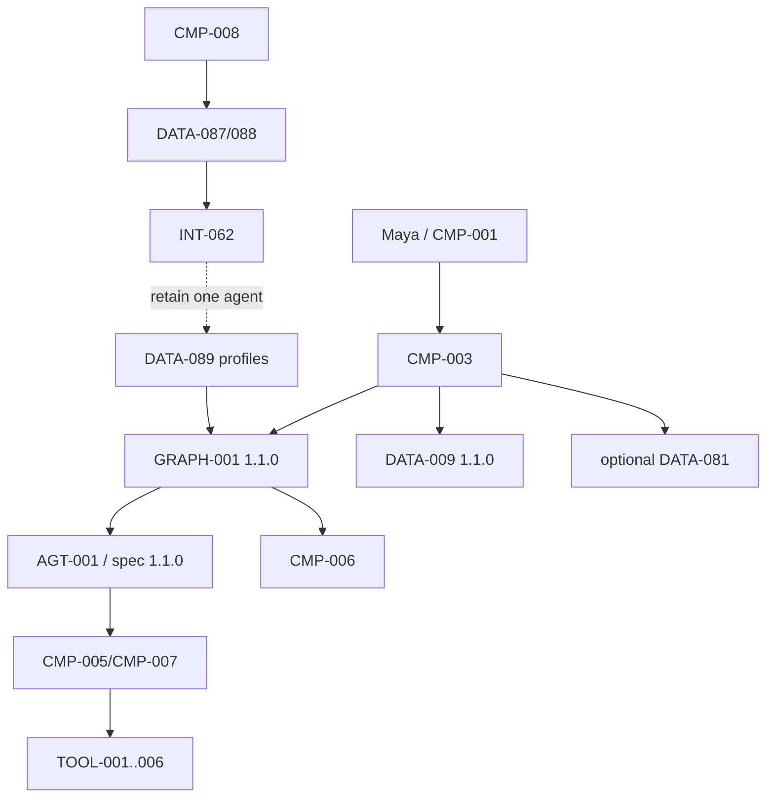

# 03 — Architecture Baseline
**Version:** `1.3.0`

### Preserved runtime
- `CMP-001`–`011` unchanged.
- Exactly one `AGT-001`; `AGT-001-spec 1.1.0`.
- `GRAPH-001 1.1.0`; `DATA-009 1.1.0`.
- Application-owned routes/state/budgets/recovery/termination/disposition.
- Gateway-only `TOOL-001`–`006`.
- External typed SoD/expiring/single-use human decisions; timeout never approves.
- Optional case-local harness-owned working memory.

### S06A change
`INT-059` evaluates `DATA-087` into `DATA-088`; `INT-060` validates `DATA-089`; `INT-061` binds one profile to one existing graph work unit as `DATA-090`; `INT-062` denies or requests future architecture review but has no allocation/runtime authority.

**Selected:** one agent + specialized graph nodes + bounded task profiles + deterministic verification and promotion gate.

No new runtime trust boundary, agent communication edge or concurrent worker is added.
