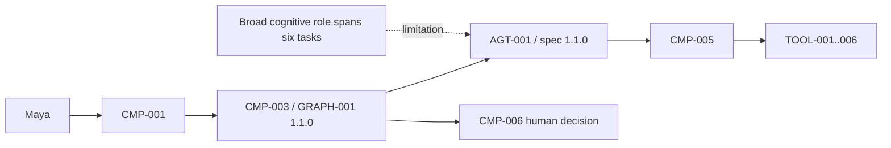
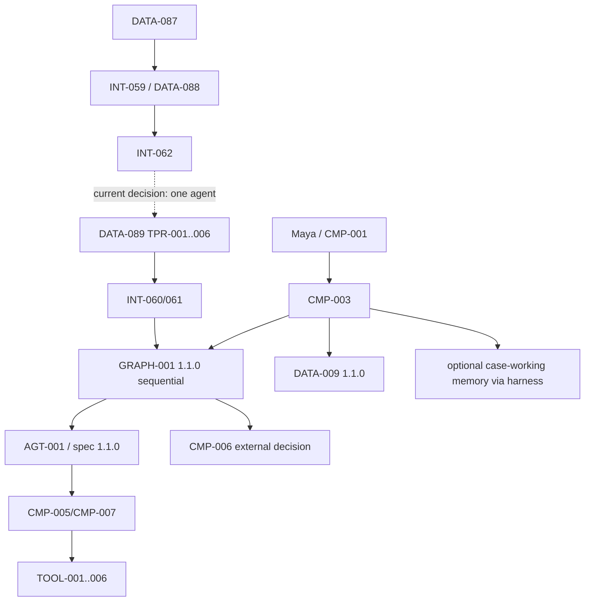

# Stage 6A — Single-Agent versus Multi-Agent Architecture Decision and Agent Boundary Analysis

**Stage identifier:** `S06A`  
**Architecture/repository/handoff version:** `1.3.0`  
**Execution date:** 2026-08-01  
**Verification boundary:** local/offline Python 3.13.5, standard-library runtime, deterministic architecture-decision fixtures, repository JSON profiles and synthetic counterfactuals. No live model/connector, second agent, delegation, handoff, shared-agent memory, concurrent branch, MCP/A2A, production IAM/PDP/KMS/database, audit/WORM, deployment or DR.

## 1. Context Carried Forward

NorthStar enters S06A with the accepted S05B `1.2.0` architecture. `AGT-001 Regulatory Impact Assessment Agent` is the only agent and remains bound to `AGT-001-spec 1.1.0`. It executes in the specification-guarded harness and unchanged `GRAPH-001 1.1.0`; routes, node ownership, protected state mutation and termination are application-owned. `DATA-009 1.1.0` remains authoritative. `TOOL-001`–`003` remain read-only, `TOOL-004`–`006` reversible unapproved writes, and every call remains gateway-only.

Human decisions remain external, typed, role/SoD controlled, expiring and single-use. Timeout never approves; late decisions fail closed; approved/rejected remain preliminary human-reviewed dispositions, not final legal/compliance closure. The accepted `TOOL-006` effect/idempotency, revision/lease controls, S03C budgets/recovery/reconciliation, S04B durable wait and S04C harness digests remain.

S05B separated authoritative state, disposable bounded context and subordinate memory. Context can be deterministically regenerated and extractively compacted; the case can resume with memory disabled. Only explicitly opted-in `DATA-081 case_working` memory is enabled, isolated by tenant/case/authorized user and accessible only through the harness. Cross-case, profile, semantic, episodic, organizational and shared-agent memory remain disabled.

The unresolved problem is precise: `AGT-001` now spans regulatory research, obligation extraction, policy/control mapping, preliminary risk assessment, evidence verification and report assembly. NorthStar must determine whether these are different **work units** in one governed case or independent **agent boundaries**. Premature agents would create identities, delegation, handoffs, state/memory, termination, observability, latency, cost and error-propagation surfaces.

The supplied S05B handoff and available full chapter are the reconstruction baseline. The byte-exact repository and ten detailed `1.2.0` registers were not mounted; `ISS-065` records a compatible reconstruction overlay. No accepted identifier, authority, tool contract, graph/state version, memory rule or human-control semantic changes.

Artefacts modified: all ten source-of-truth files; `ADR-044`–`046`; `DATA-087`–`090`; `INT-059`–`062`; six task profiles; code; five Mermaid diagrams; `TEST-243`–`270`; `EVAL-055`–`061`; demo, evaluation, benchmark, validation and consistency-audit reports.

## 2. Narrative Development

Maya Chen reviews a resumed case with a clean bounded context. Daniel Brooks asks why NorthStar still has one agent when the work resembles six professional roles. Priya Raman writes the roles on a whiteboard. Marcus Green circles them and asks which requires a different identity, authority or fault domain. Today, none does: each acts for the same analyst, case, gateway and approval path.

Elena Petrov proposes six specialist agents because each could have a focused prompt. Liam O'Connor notes that focused prompts do not require six runtime identities. `GRAPH-001` already provides explicit work units, checkpoints and deterministic routes. A profile can narrow instructions, context and tool exposure for a node without a message bus, handoff protocol or distributed termination problem.

Sofia Alvarez focuses on verification. It needs a separate rubric, context projection, output contract and evaluation, but does not yet need independent authority, deployment or lifecycle. Human review remains accountable.

Priya separates three questions:

1. **Task specialization:** Does a work unit need focused instructions/context/output? **Yes.**
2. **Agent boundary:** Does it need independent identity, authority, state, lifecycle, fault or termination? **Not yet.**
3. **Promotion evidence:** Is there representative evidence that another agent adds value after simpler remedies? **No.**

NorthStar therefore selects the smallest sufficient architecture: one agent, specialized graph work units, six bounded profiles, explicit verification and a deterministic future-promotion gate.

## 3. Problem Being Solved

S06A must:

1. Define agent boundaries so role labels/prompts are not misclassified as agents.
2. Compare a general agent, profiled agent, specialized graph, manager-specialists, peer handoffs and distributed agents.
3. Improve task focus without multiplying identities/authority.
4. Isolate verification for evaluation without granting approval.
5. Make future promotion evidence-based.
6. Preserve graph/state/gateway/approval/memory ownership.
7. Make coordination and failure surfaces visible before implementation.
8. Prove no hidden `AGT-002`, delegation, handoff, shared memory or concurrency is enabled.
9. Stop before interoperability or concurrent multi-agent execution.

### Non-goals

No supervisor, specialist agent, agent message, task/handoff envelope, delegated credential, shared/private agent state, parallel branch, MCP/A2A choice, model router, tool change, graph/state version change, control plane or multi-agent quality claim is introduced.

## 4. Requirements Introduced or Updated

S06A adds `FR-155`–`169`, `NFR-122`–`133`, and `CTL-100`–`112`.

The pivotal requirements are deterministic option assessment; an exact agent-boundary definition; one-agent default; six bounded profiles; exact agent/graph/tool bindings; capability denial; recorded candidate evidence; a hard-boundary or representative-measurement promotion trigger; unchanged human/memory semantics; counterfactual tests; honest local benchmarking; and an explicit stop before communication/concurrency.

**Governance Requirement:** design scores are architecture-review aids—not production benchmarks, risk acceptance, authorization decisions or automatic allocators.

## 5. Conceptual Explanation

### 5.1 Agent boundary

An agent boundary exists when a goal-directed software actor must be governed as its own operational subject. For NorthStar, an independent agent would require a stable identity/version, independent goal/non-goals, input/output/termination contract, scoped tool/data authority, state/context and perhaps memory boundary, failure/cancellation behavior, deployment/lifecycle owner, observability/evaluation identity and interaction contract.

A prompt, model call, graph node, tool invocation, classifier, verifier pass or professional role label is not automatically an agent.

### 5.2 Decomposition spectrum

1. **One generalist agent:** one broad instruction and all tools.
2. **One profiled agent:** one identity with task-specific instructions/context/outputs.
3. **One agent with specialized graph nodes and profiles:** graph owns sequence/state/routes; one agent performs bounded probabilistic work.
4. **Manager with specialists:** manager delegates multi-step tasks and aggregates.
5. **Peer handoff agents:** specialists transfer responsibility/artefacts.
6. **Distributed autonomous agents:** independent runtimes coordinate across services/organizations.

These are alternatives, not maturity levels.

### 5.3 Model calls are not agent count

One workflow may invoke one or several models many times while retaining one governed agent boundary. Multiple agents may use the same model. Agent count concerns runtime responsibility and governance—not model count.

S06A profiles constrain purpose, instruction reference, authorized context kinds, an existing-tool subset, structured output and memory visibility through the harness. They cannot modify authority, state ownership, routes, approval, memory lifecycle or termination.

### 5.4 Graph specialization versus delegation

A graph work unit receives bounded input and returns a proposal/candidate; `CMP-003` remains responsible for the next route. A delegated sub-agent would receive a task envelope, pursue it independently over multiple steps, maintain status and terminate/return. That would require identity, authority attenuation, correlation, timeout/cancellation, handoff schemas and distributed tracing. The current task-focus problem does not require them.

### 5.5 Verification without false independence

Verification can use separate instructions/rubric, separate context, deterministic validators, a different model, a separate agent, or human review. NorthStar chooses separate profile/context/output/evaluation plus deterministic checks and human accountability. `TPR-005` is not a second agent and cannot approve.

### 5.6 Reliability and economics

Extra agents add trajectories and communication edges. Potential benefits include exploration, parallelism and fault isolation; costs include duplicated context/tokens, serialization/validation, authorization decisions, message/state storage, termination conditions, propagated upstream errors, broader tracing/testing and additional operational ownership.

A simple illustrative chain with six required agents each succeeding with probability `p` has naive upper-bound `p^6`; this is not a production estimate because errors are correlated and non-identical, but it shows why decomposition cannot be presumed to increase end-to-end success.

### 5.7 Promotion evidence

`INT-062` accepts two review-trigger classes:

- **Hard boundary:** independently governed identity, authority, lifecycle, fault, termination or verifier boundary.
- **Measured value:** representative repeated-trial evaluation shows material benefit after prompt/node/profile remedies are exhausted, with acceptable handoff error, latency, cost and security impact.

A trigger permits review only. New requirements, ADR, schemas, threat/privacy review, implementation and tests remain mandatory.

## 6. When This Capability Is Required

Perform this decision analysis when an agent specification contains materially different tasks, tool confusion persists, specialist/supervisor roles are proposed, verification independence is discussed, parallelism/fault isolation is claimed, credentials/data domains might diverge, a task needs a separate lifecycle owner, work may be independently delegated/cancelled, or multi-agent cost/quality claims need a controlled baseline.

A multi-agent architecture is plausible when a task has a real independent boundary or representative evidence demonstrates enough value after simpler remedies fail.

## 7. When It Is Not Required

Do not add an agent merely because a task has a role name, another prompt/model call is useful, the graph has many nodes, a verifier pass is useful, a large tool list can be narrowed, context is long but regenerable/compactable, the framework makes agent creation easy, or “multi-agent” sounds advanced.

Keep one agent when tasks share state, authority, lifecycle, case scope, memory, termination and mainly sequential dependencies—as NorthStar does now.

**Common Anti-pattern:** replacing explicit workflow nodes with conversational agents, then adding a supervisor to recreate structure already supplied by the graph.

## 8. Architecture Options

### A — One broad agent
Lowest overhead, but instructions/tool exposure/evaluation become diffuse.

### B — One agent with informal prompt switching
Better focus, but weak governance and binding.

### C — One agent, specialized graph nodes and formal profiles
Uses current deterministic orchestration and bounded probabilistic work; narrows context/tools/outputs without new identity. **Selected.**

### D — Manager with bounded specialists
Useful for independent multi-step/fault-domain work. Currently unjustified; requires identities, delegation and aggregation contracts.

### E — Peer handoff agents
Useful for genuine ownership transfer. Adds cycles, deadlocks, status reconciliation and authority-transfer risk. Rejected now.

### F — Distributed autonomous agents
Potentially useful across federated organizations, but outside this case-centric human-accountable boundary.

## 9. Decision Matrix

Scores 1–5 apply to the current NorthStar problem, not universally.

| Criterion | Broad agent | Profiled agent | Graph + profiles | Manager + specialists | Peer handoffs | Distributed |
|---|---:|---:|---:|---:|---:|---:|
| Preserve accepted state/routes | 5 | 5 | **5** | 3 | 2 | 1 |
| Task focus | 2 | 4 | **5** | 5 | 5 | 5 |
| Minimal identity/authority surface | **5** | **5** | **5** | 2 | 1 | 1 |
| Handoff/provenance simplicity | **5** | **5** | **5** | 2 | 1 | 1 |
| Sequential-workflow fit | 4 | 4 | **5** | 2 | 1 | 1 |
| Fault isolation | 2 | 2 | 3 | **5** | 4 | 5 |
| Independent lifecycle support | 1 | 1 | 1 | **5** | 5 | 5 |
| Local/offline testability | **5** | **5** | **5** | 3 | 2 | 1 |
| Latency/cost efficiency | **5** | 4 | **4** | 2 | 1 | 1 |
| Debuggability/auditability | 4 | 4 | **5** | 3 | 2 | 1 |
| Existing requirements evidence | 3 | 4 | **5** | 1 | 1 | 1 |
| Current architecture fit | 3 | 4 | **5** | 2 | 1 | 1 |

The executable assessor selects `one_agent_specialized_graph_profiles`, agent count `1`, with no current promotion eligibility.

## 10. Selected Architecture and Rationale

NorthStar selects **one `AGT-001` with specialized `GRAPH-001` work units, six bounded profiles and a deterministic multi-agent promotion gate**.

Rules:

1. all profiles bind only to `AGT-001`;
2. `DATA-009` remains authoritative;
3. `GRAPH-001/CMP-003` owns routes;
4. tools and human decisions remain externally authorized;
5. profiles receive memory only through harness context and never write it;
6. `TPR-005` has a distinct rubric/output/evaluation but no new authority; and
7. future review needs a hard boundary or representative measured value; S06A allocates no agents.

**Architect's Decision:** a specialist becomes an agent only when it must be governed and operated as an independent actor. These six roles are currently bounded cognitive modes inside one case workflow.

## 11. Architecture Before the Change



## 12. Architecture After the Change



New objects are decision/profile controls, not runtime agents. There is no agent-to-agent communication edge.

## 13. Detailed Component Design

### 13.1 AgentBoundaryAssessor

Consumes `DATA-087` plus immutable `ABP-001`; validates accepted versions, detects hard boundaries, checks representative evidence completeness, scores six options and returns `DATA-088`. It penalizes multi-agent options when evidence is unmeasured, dependencies are sequential, parallelism is unproven, and state/gateway/approval/memory are shared. A review-eligible counterfactual still does not allocate an agent.

### 13.2 AgentBoundaryPolicy

Records only `AGT-001`, exact tools, prohibited capabilities, hard triggers and illustrative measured-value thresholds. The 10% quality-gain/≤2% handoff-error values are tutorial review parameters—not production acceptance thresholds.

### 13.3 Task profiles

| ID | Work unit | Context | Exposed tools | Output |
|---|---|---|---|---|
| `TPR-001` | Research | publication/evidence/state | `TOOL-001`–`003` | `CandidateResearchEvidence.v1` |
| `TPR-002` | Obligation extraction | publication/evidence/state | `TOOL-001`,`003` | `CandidateObligationSet.v1` |
| `TPR-003` | Policy/control mapping | evidence/state/policy | `TOOL-002`,`003`,`005` | `CandidatePolicyControlMapping.v1` |
| `TPR-004` | Risk assessment | evidence/state/policy | `TOOL-002`,`003` | `PreliminaryRiskRecommendation.v1` |
| `TPR-005` | Evidence verification | publication/evidence/state/policy | `TOOL-001`–`003` | `EvidenceVerificationFinding.v1` |
| `TPR-006` | Report package | evidence/state/policy | `TOOL-004`–`006` | `PreliminaryAssessmentPackage.v1` |

Exposure narrows what the model sees; gateway authorization still decides whether a call executes.

### 13.4 Validator and binding

The validator rejects wrong profile count, duplicate IDs/node keys, non-`AGT-001`, incompatible graph, unknown tools, capability flags, invalid memory modes, missing contracts and authority-like language. `INT-061` creates `DATA-090` with run/profile/spec/graph/control-owner references and a canonical SHA-256 digest. The digest detects local drift but is not a signature or audit record.

### 13.5 Verification profile

`TPR-005` returns findings on citation, provenance, freshness and consistency. Deterministic validators remain primary for schema/hash/version rules. Human review remains mandatory.

### 13.6 Promotion gate

Possible results are deny, hard-boundary review eligibility, measured-value review eligibility or incomplete/unrepresentative evidence. Even eligibility requires a later controlled stage.

## 14. Data, State and Interface Design

- `DATA-087` captures shared/independent boundaries, task dependency, parallelism/remediation status and nullable measurement evidence. `null` means unmeasured, not zero.
- `DATA-088` records every candidate's score, eligibility, reasons, new-agent count, coordination edges, authority surfaces, selected option, limitations, policy and digest.
- `DATA-089` is immutable configuration, not state/memory.
- `DATA-090` binds one existing agent to one existing graph work unit and explicitly records external control owners.
- `INT-059` assesses, `INT-060` validates, `INT-061` binds, and `INT-062` gates future review. None is exposed as an agent tool.

## 15. Implementation

```python
policy = AgentBoundaryPolicy.from_path("config/architecture/agent-boundary-policy.json")
questionnaire = AgentBoundaryQuestionnaire(
    assessment_id="ABA-NORTHSTAR-S06A-001",
    case_family="regulatory-impact-assessment",
    task_dependency="mostly_sequential",
    evidence_status="not_measured",
)
assessment = AgentBoundaryAssessor(policy).assess(questionnaire)
assert assessment.selected_option == "one_agent_specialized_graph_profiles"
assert assessment.selected_agent_count == 1
profiles = load_task_profiles("config/agents/AGT-001-task-profiles.json", policy)
binding = bind_task_profile(run_id="RUN-001", profile=profiles[0])
```

```bash
PYTHONPATH=src python3 -m pytest -q
PYTHONPATH=src python3 scripts/run_stage6a_demo.py
PYTHONPATH=src python3 scripts/run_stage6a_evaluation.py
PYTHONPATH=src python3 scripts/benchmark_stage6a.py
PYTHONPATH=src python3 scripts/validate_stage6a.py
PYTHONPATH=src python3 scripts/consistency_audit_stage6a.py
```

## 16. Code and Repository Changes

Added architecture-decision code/policy, profile configuration/instructions, `DATA-087`–`090` schemas, ADRs, Mermaid diagrams, tests/evaluations/scripts, references and this chapter. All ten source-of-truth artefacts and root metadata are updated. No prior runtime file is retired; the overlay preserves `AGT-001-spec`, `GRAPH-001`, `DATA-009`, `DATA-077`, `MEM-POL-001`, `TOOL-001`–`006` and `INT-053`–`058`.

## 17. Security and Governance Implications

Benefits: no additional credential/identity/PDP surface; smaller per-work-unit tool exposure; explicit denial of delegation/handoff/direct memory writes; exact agent/graph/tool checks; deterministic digests; unchanged external approval/gateway enforcement.

Residual risk: a structurally valid profile can still bias behavior; injection remains possible; SHA-256 is unauthenticated; local config is unsigned; same-model generation/verification can correlate errors. Production needs signed registries, enterprise identity/PDP, supply-chain controls and continuous evaluation.

The inventory remains one agent. Profiles become governed sub-artefacts with owners, versions, tests and retirement rules. Neither an ADR nor profile can make `CMP-005`, `CMP-006` or `CMP-007` authorize an action.

## 18. Performance, Concurrency and Cost Implications

Profile validation adds small deterministic overhead and may reduce irrelevant context or failed calls; no model latency benchmark was run. A verification pass adds model cost when enabled. The chosen design avoids per-agent system prompts, task envelopes, messages and supervisor aggregation.

```text
profiled workflow = Σ(model + retrieval + tool) + optional verification + human review
multi-agent workflow = above + delegation/manager + per-agent context + communication/aggregation + duplicate/recovery work + broader telemetry/evaluation
```

No currency amount is invented because no provider/model/workload is selected.

S06A remains sequential. Future parallelism requires its own bounded concurrency, cancellation, duplicate suppression and shared-state controls. Agent decomposition is not required for parallel reads or graph branches.

## 19. Evaluation and Test Cases

- `TEST-243`–`255`: compatibility, deterministic selection, promotion counterfactuals and candidate evidence.
- `TEST-256`–`269`: six profiles, one identity, unique nodes, tool subsets, capability denial, digests, malicious-profile rejection and binding compatibility.
- `TEST-270`: evaluation IDs and one-agent gate.
- Additional configuration security test.

Evaluations `EVAL-055`–`061` cover deterministic selection, profile coverage, authority invariants, counterfactual triggers, coordination evidence, digest reproducibility and current promotion denial.

Before future promotion, compare matched model/token budgets on the same cases/tools/evidence/rubric with repeated trials. Measure task success, factuality/citations, tool accuracy, handoff loss, duplicate work, error propagation, P50/P95/P99 latency, tokens/cost per successful task, recovery/termination, permission violations and analyst correction time. A candidate must not win merely by consuming more model calls unless business value justifies it.

## 20. Failure Scenarios and Recovery

1. **Role label becomes `AGT-002`:** allowlist/config scan rejects; represent it as a profile or open an ADR for a real boundary.
2. **Unknown tool:** exact allowlist rejects before binding/model use.
3. **Profile claims approval/finalization:** capability/semantic checks fail closed; `CMP-006` remains owner.
4. **Direct memory write:** profile rejected; only consented harness lifecycle may persist permitted projections.
5. **Unmeasured multi-agent claim:** `null/not_measured` denies promotion; run representative comparison.
6. **Independent authority emerges:** gate returns review-eligible only; create requirements, threat/privacy analysis, authorization design and ADR.
7. **Digest mismatch on resume:** fail compatibility; resume original profile or use explicit migration/restart.
8. **Verifier repeats generator error:** deterministic checks/human review contain; improve rubric/context, test cross-model separation before new identity.
9. **Framework secretly creates children:** trace/inventory count blocks release; map profiles to node-scoped calls or perform controlled change.
10. **Profile store unavailable:** fail closed; never fall back to an unversioned broad prompt.

## 21. Architecture Decision Records

- `ADR-044`: retain one agent and specialize the graph.
- `ADR-045`: verification is a separately evaluated profile/node, not a second agent.
- `ADR-046`: evidence-gated future multi-agent promotion review.

No prior ADR is superseded.

## 22. Requirements Traceability Update

- `FR-155/156` → assessor → `TEST-243`–`255` → `EVAL-055/059`.
- `FR-158`–`161` → profile validator/binder → `TEST-256`–`269` → `EVAL-056/057/060`.
- `FR-163/164/167` → policy/`INT-062` → `TEST-248`–`253` → `EVAL-058/061`.
- `FR-165/166/169` → invariants/stage validator → `TEST-260/270` and consistency audit.

## 23. Stage Outcome

NorthStar now has an executable answer: keep one `AGT-001`; use six task profiles; preserve graph/state/gateway/approval/memory owners; evaluate verification separately without false authority; compare candidate topologies transparently; and gate future promotion without implementing delegation, handoff, shared-agent memory or concurrency.

This is not rejection of multi-agent systems; it is rejection of **unearned agent boundaries**.

## 24. Known Limitations

Compatible overlay; no live model profile comparison; no implemented multi-agent comparison; design scores/thresholds are tutorial parameters; synthetic identity/tools; same-agent verification correlation; unsigned configuration/digests; no production SLO/cost/workload/human benchmark; Mermaid not CLI-rendered; no delegation/messages/shared state/distributed termination/MCP/A2A/control plane/deployment/audit/DR or legal sufficiency claim.

## 25. Narrative Bridge to the Next Stage

Maya receives better task-specific outputs without artificial handoffs. Priya can defend one agent and show evidence needed to reopen the choice.

If a future independent boundary or representative evaluation justifies specialists, NorthStar must define typed task delegation/handoff, attenuated authority, agent/task identity, shared-versus-private state/context, artefact authenticity, timeout/cancellation/error propagation and system-level termination before selecting MCP/A2A or enabling concurrency. This motivates **Stage 6B — Bounded Agent Handoff, Communication and Authority Contracts**. S06A stops before any second agent or communication runtime.

## 26. Updated Source-of-Truth Artefacts

All ten artefacts advance to `1.3.0`; new ranges are `FR-155`–`169`, `NFR-122`–`133`, `CTL-100`–`112`, `DATA-087`–`090`, `INT-059`–`062`, `ADR-044`–`046`, `RSK-129`–`143`, `ASM-044`–`047`, and `ISS-065`–`071`.

# Stage Consistency Audit

**Passed with recorded reconstruction and production exceptions.**

Narrative, diagrams, configuration, code, schemas, ADRs, requirements and handoff align. NorthStar/eight personas, `US-001`–`012`, `CMP-001`–`011`, exactly one `AGT-001`, `TOOL-001`–`006`, `AGT-001-spec 1.1.0`, `GRAPH-001 1.1.0`, and `DATA-009 1.1.0` are preserved. Routes/state/termination, gateway authorization, human decisions and memory lifecycle retain accepted owners. Six profiles bind only to `AGT-001`; no profile can delegate, hand off, approve/finalize, write memory, create concurrency or allocate an agent. Promotion eligibility remains non-authoritative.

Executed: **29 pytest checks passed**, compilation, demo, seven evaluations, local microbenchmark, structural validation and consistency audit. No future-stage runtime capability is falsely claimed. Exceptions: `ISS-065`–`071` and inherited production gaps.

## Technical References

See `docs/references/Stage-6A-Technical-Sources.md`. Sources `[S1]`–`[S4]` support deliberate escalation from simple workflows/single-agent patterns; sources `[S5]`–`[S7]` describe multi-agent failure, task/topology dependence and compounding trajectory errors. NorthStar's exact choice is an inference from its accepted state, authority, memory and workflow constraints—not a vendor rule.


## 27. Stage Handoff Pack

## A. Stage completed
- **Stage identifier:** `S06A`
- **Stage title:** Single-Agent versus Multi-Agent Architecture Decision and Agent Boundary Analysis
- **Architecture version:** `1.3.0`
- **Repository version:** `1.3.0`
- **Handoff version:** `1.3.0`
- **Completion date:** 2026-08-01
- **Status:** Completed within local/offline deterministic architecture-decision and profile-validation boundaries.
- **Consistency audit:** Passed with recorded reconstruction and production exceptions.

## B. Capabilities now available

1. All accepted S05B one-agent/specification/graph/harness/gateway/budget/recovery/durable-wait/external-approval/context/memory controls remain.
2. `INT-059` deterministically compares six architecture options.
3. `DATA-088` records selection, eligibility, reasons, coordination/authority surfaces, limitations and digest.
4. NorthStar selects one `AGT-001` with specialized `GRAPH-001` work units and six bounded profiles.
5. `INT-060` rejects unknown agents/graphs/tools and prohibited future capabilities.
6. `INT-061` binds profile/node/run/spec/graph with hashes and unchanged control owners.
7. `INT-062` is a deny-by-default future architecture-review gate; it cannot allocate or authorize an agent.
8. Verification is a separate profile/evaluation surface, not a second agent or approver.
9. Multi-agent review requires an independent boundary or representative measured gain after single-agent remedies.
10. `TEST-243`–`270` and `EVAL-055`–`061` pass locally.

Not implemented: second agent, delegation, handoff, task/message envelope, attenuated agent identity/token, private/shared agent state, shared-agent memory, concurrent branches/workers, MCP/A2A, live model/connectors, production IAM/PDP/KMS/database/audit/WORM/control plane/deployment/DR.

## C. Accepted architecture decisions
`ADR-001`–`043` remain accepted.
- `ADR-044`: retain one agent and specialize the graph through bounded profiles.
- `ADR-045`: evidence verification is a separately evaluated profile/node, not a second agent.
- `ADR-046`: independent-boundary or representative measured-value evidence is required before controlled promotion review.

## D. Current component inventory
| ID | Name | Current S06A responsibility/status |
|---|---|---|
| `CMP-001` | Analyst Experience Portal | Starts/resumes cases and surfaces decision/profile evidence. |
| `CMP-002` | Regulatory Intake Boundary | Unchanged provenance boundary. |
| `CMP-003` | Case and Workflow Orchestration Boundary | Owns graph/state/routes/termination and profile validation/binding. |
| `CMP-004` | Knowledge and Evidence Access Boundary | Unchanged authorized evidence. |
| `CMP-005` | Enterprise Integration Boundary | Unchanged gateway-only `TOOL-001`–`006`. |
| `CMP-006` | Human Review and Approval Boundary | Unchanged external typed decision authority. |
| `CMP-007` | Identity, Authorization and Policy Boundary | Unchanged runtime authority owner. |
| `CMP-008` | Evaluation and Assurance Boundary | Boundary/profile/counterfactual evaluations. |
| `CMP-009` | Observability and Audit Boundary | Local assessment/binding evidence; not audit/WORM. |
| `CMP-010` | Runtime and Deployment Boundary | Local sequential Python. |
| `CMP-011` | Source-of-Truth Governance Pack | Governance at `1.3.0`. |

## E. Current agent inventory
| ID | Name | Authority | Status |
|---|---|---|---|
| `AGT-001` | Regulatory Impact Assessment Agent | May propose exact `TOOL-001`–`006` through `CMP-005`, complete or escalate. Cannot route, mutate protected state, approve/finalize, grant consent, write memory, delegate, hand off, create agents, run concurrent branches or recall across cases. | **Only agent**; `AGT-001-spec 1.1.0`; six profiles. |

## F. Current data and state objects
- `DATA-001`–`086` retained; `DATA-009` remains `1.1.0`.
- New: `DATA-087 AgentBoundaryQuestionnaire`, `DATA-088 AgentBoundaryAssessment`, `DATA-089 TaskProfileSet`, `DATA-090 TaskProfileBinding`.
- `DATA-081 case_working` remains the only optional memory; profiles see it only through harness context.
- No delegated task, message, handoff, agent card, private/shared agent state or shared-agent memory object exists.

## G. Current interfaces and tools
- `INT-001`–`058` retained.
- `INT-059` Agent Boundary Assessment.
- `INT-060` Task Profile Load/Validation.
- `INT-061` Task Profile Runtime Binding.
- `INT-062` Future Multi-Agent Capability Gate.
- `TOOL-001`–`003` remain read-only; `TOOL-004`–`006` remain reversible unapproved writes; all gateway-only.

## H. Repository state
```text
northstar-agentic-compliance/
├── config/{agents,architecture,evaluation,prompts}/
├── docs/{adr,architecture/diagrams,baseline,references,source-of-truth,stages}/
├── schemas/DATA-087...DATA-090*.schema.json
├── scripts/{run_stage6a_demo,run_stage6a_evaluation,benchmark_stage6a,validate_stage6a,consistency_audit_stage6a}.py
├── src/northstar_compliance/architecture_decision/{canonical,models,policy,assessment,profiles,binding,report}.py
├── tests/{unit,evaluation}/
├── README.md
└── pyproject.toml
```
Python target `>=3.11,<3.15`; executed `3.13.5`; standard-library runtime; pytest `9.0.2`.

## I. Tests completed
- `TEST-243`–`255`: compatibility, deterministic selection and promotion counterfactuals — passed.
- `TEST-256`–`269`: profile identity/tools/capability denial/digests/bindings and malicious-profile rejection — passed.
- `TEST-270`: evaluation IDs and one-agent gate — passed.
- Additional configuration security check — passed.

Executed result: **29 pytest checks passed**. Compilation, demo, seven evaluations, local microbenchmark, structural validation and consistency audit passed.

- `EVAL-055`: deterministic one-agent/profile selection.
- `EVAL-056`: six-profile coverage and one-agent inventory.
- `EVAL-057`: authority/delegation/handoff/memory/concurrency invariants.
- `EVAL-058`: hard-boundary and representative-measured counterfactual triggers.
- `EVAL-059`: coordination/failure-surface evidence.
- `EVAL-060`: deterministic digests.
- `EVAL-061`: current promotion denied and agent count one.

## J. Known limitations
Compatible reconstruction overlay; no live model/profile quality benchmark; no multi-agent implementation/comparison; design scores/thresholds are tutorial parameters; synthetic local identity/tools; same-agent verification may correlate errors; unsigned config/digests; no production SLO/cost/workload/human benchmark; Mermaid not CLI-rendered; no interoperability, production control plane, deployment, audit/WORM or DR.

## K. Open risks, assumptions and issues
- New risks: `RSK-129`–`143`.
- New assumptions: `ASM-044`–`047`.
- New issues: `ISS-065`–`071`.
- All inherited active production gaps remain.

## L. Compatibility constraints
1. Preserve NorthStar, eight personas, `US-001`–`012`, `CMP-001`–`011` and exactly one `AGT-001`.
2. Preserve `AGT-001-spec 1.1.0`, `GRAPH-001 1.1.0`, `DATA-009 1.1.0`, application-owned routes/state/termination and sequential branches.
3. Preserve gateway-only `TOOL-001`–`006`, access-before-load, budgets/recovery/reconciliation and `TOOL-006` effect/idempotency.
4. Preserve external human role/SoD/expiry/single-use decisions; timeout never approves and late decisions fail closed.
5. Approved/rejected remain preliminary human-reviewed dispositions, not final closure.
6. Preserve manifest/instruction/context/session/specification/profile digests and fail closed on incompatibility.
7. Profiles cannot grant authority, route/mutate state, approve/finalize, write memory, delegate, hand off or create concurrency.
8. Memory remains optional, case-local, consented, provenance-bound, expiring/deletable and harness-owned.
9. `INT-062` is a design-review gate, not allocator/PDP.
10. Do not add `AGT-002`, delegation, handoff, shared-agent memory, MCP/A2A or concurrent branches without new requirements, threat/privacy review, ADRs, schemas, implementation and evaluation.

## M. Required input for the next stage
Use all ten `1.3.0` artefacts; `ADR-001`–`046`; `AGT-001-spec 1.1.0`; `GRAPH-001 1.1.0`; `DATA-007`, `DATA-009`, `DATA-041`–`090`; `INT-009`–`062`; `TOOL-001`–`006`; S04C harness contracts; `DATA-077`; `MEM-POL-001`; S05B context/memory code; S06A code/tests/evaluations/benchmark; diagrams; and active risks/issues.

## N. Next architectural problem
If a future independent boundary or representative evaluation justifies specialists, NorthStar lacks typed delegation/handoff, attenuated authority, agent/task identity, shared-versus-private state/context rules, artefact authenticity, timeout/cancellation/error propagation and system-level termination. These contracts must precede protocol selection or concurrency.

## O. Exact continuation instruction
> Continue the NorthStar Agentic AI Architecture Playbook by executing only **Stage 6B — Bounded Agent Handoff, Communication and Authority Contracts**. Reconstruct the `1.3.0` S06A baseline; preserve the current one-agent runtime and all gateway/human/memory constraints; design typed future handoff and attenuated-authority contracts without enabling concurrent execution or selecting MCP/A2A prematurely; update all artefacts, execute tests/audit and stop after the stage.
