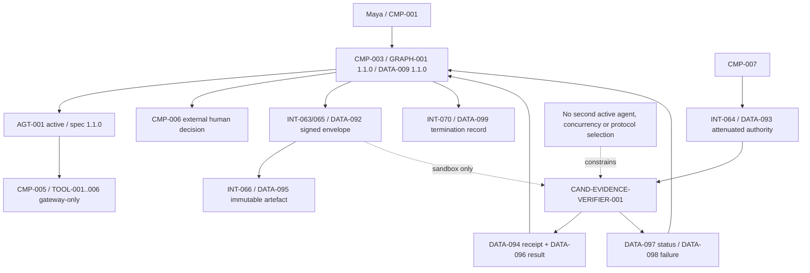

# 03 — Architecture Baseline

**Architecture version:** `1.4.0`

## Preserved baseline

- `CMP-001`–`011` unchanged.
- `AGT-001` only active agent; specification `1.1.0`.
- `GRAPH-001 1.1.0` remains sequential and application-owned.
- `DATA-009 1.1.0` remains authoritative.
- `TOOL-001`–`006` remain gateway-only.
- `CMP-006` remains the external human decision owner.
- `DATA-081` remains optional harness-owned case-working memory.

## S06B architectural change

S06B adds a protocol-neutral handoff contract layer inside existing boundaries:

- `CMP-003`: endpoint validation, envelope creation, lifecycle and termination.
- `CMP-007`: grant mint/attenuate/verify/revoke.
- `CMP-008`: contract and boundary evaluation.
- `CMP-009`: local status/receipt evidence, not audit/WORM.
- `CMP-010`: deterministic sequential sandbox.
- `CMP-011`: endpoint status and disabled-capability governance.

No new `CMP-*` component is needed. No production service boundary is claimed.

## Cumulative architecture

## Trust and state rules

- `CMP-003` is the only protected-state writer and route owner.
- `CMP-007` is the only authority issuer.
- Recipient checks authorization before content load.
- Candidate endpoint is a separate sandbox trust boundary but has no production status.
- Artefact exchange is immutable and case/subject scoped.
- Private scratch is ephemeral; shared mutable state and shared memory are prohibited.

## Runtime/deployment status

Local sequential Python only. No network transport, queue, worker, concurrency or remote identity system.
