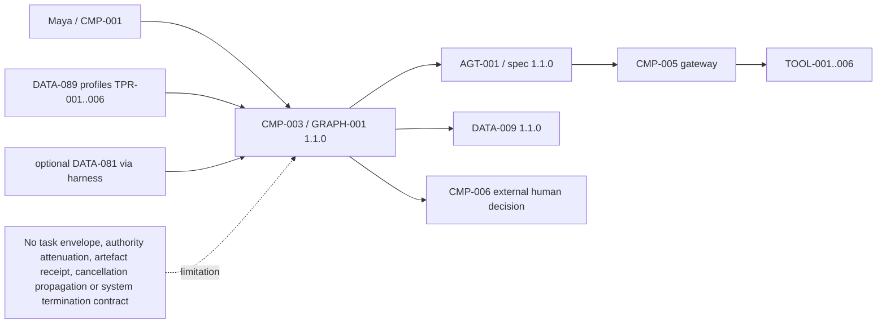
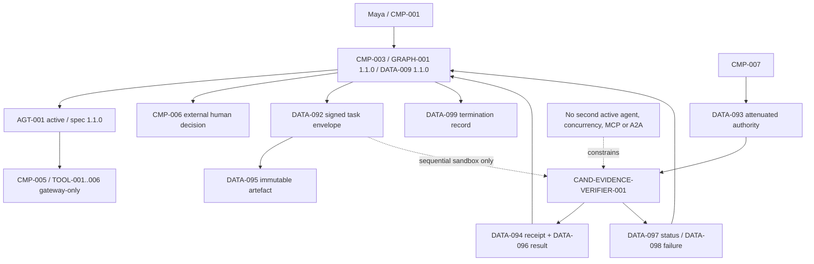

# Stage 6B — Bounded Agent Handoff, Communication and Authority Contracts

**Stage identifier:** `S06B`  
**Architecture/repository/handoff version:** `1.4.0`  
**Execution date:** 2026-08-01  
**Verification boundary:** local/offline Python 3.13.5, standard-library runtime, HMAC/SHA-256 reference signatures, immutable in-memory artefacts, deterministic candidate endpoint and sequential contract sandbox. No second active agent, live model/connector, concurrent execution, MCP/A2A/REST/gRPC/queue selection, production IAM/PDP/KMS, database, audit/WORM, deployment or disaster recovery.

## 1. Context Carried Forward

NorthStar enters S06B with the accepted S06A `1.3.0` architecture. `AGT-001 Regulatory Impact Assessment Agent` remains the only active agent and remains bound to `AGT-001-spec 1.1.0`. It executes through the specification-guarded harness and unchanged `GRAPH-001 1.1.0`; `CMP-003` owns routes, protected state mutation and system termination, and `DATA-009 1.1.0` remains authoritative.

`TOOL-001`–`003` remain read-only; `TOOL-004`–`006` remain reversible unapproved writes; every tool invocation remains through `CMP-005` and its accepted authorization, validation, idempotency, budget, recovery and reconciliation controls. Human decisions remain external to agents, typed, role/separation-of-duties controlled, expiring and single-use. Timeout never approves, late decisions fail closed, and approved/rejected remain preliminary human-reviewed dispositions rather than final legal or compliance closure.

S05B's state/context/memory separation also remains. `DATA-081 case_working` is optional, case-local, consented, provenance-bound, expiring/deletable and harness-owned. It is not automatically included in a handoff. Shared-agent memory, cross-case recall and shared mutable agent state remain disabled.

S06A established six task profiles but selected one agent because NorthStar had no independently governed identity, authority, lifecycle, fault or measured-value boundary. `INT-062` remains a design-review gate, not an allocator or policy decision point. S06B therefore does **not** invent evidence that would supersede `ADR-044`–`046`.

The unresolved problem is still material: if promotion is later justified, NorthStar lacks a typed task envelope, a receiving identity contract, attenuated authority, immutable artefact exchange, acknowledgement/status semantics, timeout/cancellation/error propagation and system-level termination evidence. Those contracts must exist before a transport or interoperability protocol is selected and before concurrency is enabled. The supplied S06A handoff is the reconstruction baseline; the byte-exact `1.3.0` repository and ten registers were not mounted. `ISS-072` records a compatible reconstruction overlay.

Artefacts modified in this stage: all ten source-of-truth files; `ADR-047`–`050`; `DATA-091`–`099`; `INT-063`–`070`; handoff policy and candidate-endpoint configuration; five Mermaid diagrams; protocol-neutral Python modules; `TEST-271`–`306`; `EVAL-062`–`069`; demo, evaluation, benchmark, validation and consistency-audit reports.

## 2. Narrative Development

Maya Chen reviews an assessment whose evidence-verification profile has found a possible inconsistency. Elena Petrov suggests turning the verifier profile into a second agent immediately and letting the two agents “chat.” Priya Raman asks a more operational question: what exactly would be transferred?

A role label is not enough. The receiver would need to know the case, run, task, goal, non-goals, authorized artefacts, expected result schema, deadline and cancellation rules. Marcus Green asks what credential the receiver would use. Passing Maya's token or `AGT-001`'s full gateway authority would turn the verifier into a confused deputy with access it does not need. Sofia Alvarez asks how NorthStar could later prove that the artefact received was the artefact verified, and whether the output was an evidence finding or an approval. Liam O'Connor asks which component decides that the overall workflow can terminate after a recipient times out or returns late.

Priya draws two boundaries. The first is the **contract substrate**: typed identities, task/message envelopes, authority attenuation, immutable artefact manifests, receipts, lifecycle events and termination records. The second is the **execution topology**: which agents are active, which transport carries messages, whether work runs in parallel and how distributed state is operated.

NorthStar needs the first boundary now. It does not yet have evidence to activate the second. The team therefore implements a deterministic two-party **contract sandbox**. `AGT-001` is the only active agent. `CAND-EVIDENCE-VERIFIER-001` is a disabled production endpoint that can participate only in local deterministic tests. It receives no tools, cannot write memory, cannot route the graph, cannot delegate again and cannot approve or finalize anything.

This approach is intentionally conservative. It converts vague future-agent conversations into testable software contracts without falsely claiming a multi-agent production system.

## 3. Problem Being Solved

S06B must answer the following architectural questions:

1. What makes a task offer unambiguous and independently verifiable?
2. How are sender, recipient, case, run, task, correlation and causation identities bound?
3. How does a recipient receive less authority than the sender rather than inheriting it?
4. How are resources, operations, tools, data scopes, use count, expiry and delegation depth constrained?
5. How does the receiving boundary verify authority before loading data or acting?
6. How are artefacts exchanged without sharing mutable case state or memory?
7. How are acceptance, rejection, progress, failure, cancellation, expiry and completion represented?
8. How are late or replayed messages rejected?
9. How does `CMP-003` know all delegated work is terminal and all artefacts are verified?
10. How can these semantics be mapped later to direct calls, REST, gRPC, queues, event buses, MCP or agent-to-agent protocols without redefining business/security rules?

### Explicit non-goals

S06B does not:

- activate `AGT-002` or any second production agent;
- supersede the S06A one-agent decision;
- enable concurrent graph branches, workers or agents;
- select MCP, A2A, REST, gRPC, a queue or event bus;
- permit peer-to-peer delegation or dynamic agent creation;
- pass unrestricted user, workload or tool credentials;
- create shared mutable state, a blackboard or shared-agent memory;
- change `GRAPH-001`, `DATA-009`, tool authority or human-approval semantics;
- claim production cryptographic key management, non-repudiation, audit/WORM or OAuth/DPoP compliance;
- measure live model quality, production latency or business value.

## 4. Requirements Introduced or Updated

S06B adds `FR-170`–`189`, `NFR-134`–`149` and `CTL-113`–`130`.

### Functional requirements

| ID | Requirement |
|---|---|
| `FR-170` | Define a versioned endpoint descriptor for active and candidate agent subjects. |
| `FR-171` | Define a signed, canonical task/message envelope with trace, correlation and causation identity. |
| `FR-172` | Bind every handoff to one tenant/case/run/task/purpose and exact sender/recipient. |
| `FR-173` | Include goal, non-goals, expected output schema, deadlines, attempt and hop limits. |
| `FR-174` | Define an attenuated authority grant issued only by `CMP-007`. |
| `FR-175` | Require child tools/operations/resources/data scopes to be subsets of the parent grant. |
| `FR-176` | Bind authority to audience, case, run, task, purpose, nonce, proof-key reference and expiry. |
| `FR-177` | Enforce use count and delegation depth and support revocation. |
| `FR-178` | Verify recipient authorization before loading artefacts or performing work. |
| `FR-179` | Exchange only immutable, hashed, provenance-bearing, case-scoped artefacts. |
| `FR-180` | Return a signed receipt binding envelope, grant and artefact digests. |
| `FR-181` | Implement explicit offered/accepted/running/terminal lifecycle states. |
| `FR-182` | Propagate cancellation, timeout and typed failure without converting them to success. |
| `FR-183` | Reject late, replayed, duplicate, tampered or scope-mismatched messages. |
| `FR-184` | Keep `CMP-003` as sole owner of routing, task creation, cancellation and system termination. |
| `FR-185` | Keep `DATA-009` authoritative and prohibit recipient mutation of protected state. |
| `FR-186` | Keep private scratch ephemeral and prohibit automatic memory transfer/shared-agent memory. |
| `FR-187` | Provide a deterministic sequential two-party contract sandbox. |
| `FR-188` | Preserve exactly one active agent and represent the verifier only as a candidate endpoint. |
| `FR-189` | Defer transport/interoperability and concurrency decisions to later evidence-backed stages. |

### Non-functional requirements

`NFR-134`–`149` require deterministic canonicalization, schema versioning, fail-closed validation, digest/signature integrity, least privilege, bounded TTL/deadline/hops/attempts, replay protection, stable correlation, local reproducibility, privacy-minimized envelopes, transport neutrality, deterministic status transitions, explicit production limitations, microbenchmark transparency and backward compatibility with `1.3.0` invariants.

### Controls

`CTL-113`–`130` implement exact endpoint allowlists; issuer restriction; subset attenuation; audience and scope binding; authorization-before-load; one-use nonce ledger; immutable artefact hashes; signed receipts; lifecycle transition allowlist; terminal-state immutability; deadline/cancellation rules; no memory/credential fields; one active agent; disabled protocol/concurrency flags; no shared mutable state; deterministic termination; configuration scan; and release audit.

**Governance Requirement:** a valid handoff contract is not permission to create or activate an agent. Agent activation still requires the evidence gate, requirements, threat/privacy review, ADR-controlled inventory change, deployment approval and production authorization design.

## 5. Conceptual Explanation

### 5.1 Handoff versus delegation versus message

A **message** is any information sent between subjects. It may be informational and may not transfer work.

A **delegation** is an authorization event: one subject requests another to perform a bounded operation on its behalf or for a shared case. Delegation requires identity, scope, time and enforcement semantics.

A **handoff** is a controlled transfer of responsibility for a work unit or artefact. It includes task identity, acceptance/rejection, lifecycle status, expected output, timeout/cancellation and return semantics. A handoff may use delegation, but the two are not synonyms.

NorthStar's S06B task offer contains both: `DATA-092` transfers a bounded work unit; `DATA-093` provides the minimum authority needed to access one artefact and perform one verification operation.

### 5.2 Why a conversational transcript is not a contract

A free-form statement such as “Please verify this evidence and report back” leaves critical questions unanswered:

- Which case and version?
- Which exact artefacts?
- What is the deadline?
- May the receiver call tools or access other data?
- Is it allowed to delegate again?
- What output schema is required?
- What happens when the sender cancels?
- Can a late result be accepted?
- How is tampering or replay detected?
- Is the result an approval?

A structured envelope makes these constraints machine-testable and auditable later. Natural-language goal text remains useful, but it is subordinate to typed fields and policy.

### 5.3 Identity model

S06B distinguishes four identities:

1. **Human initiator identity** — Maya or another authenticated user; not passed as an unrestricted credential.
2. **Active agent identity** — `AGT-001`, bound to its specification/version and current case.
3. **Candidate endpoint identity** — `CAND-EVIDENCE-VERIFIER-001`, a sandbox-only descriptor and not an accepted production agent.
4. **Tool/service identity** — existing gateway/adapters; no direct recipient bypass.

An endpoint descriptor records purpose, accepted schemas, tool/data scope and prohibited powers. It is a governance and validation object, not service discovery or an agent card protocol.

### 5.4 Task and message envelope

`DATA-092` carries:

- envelope, trace, correlation and causation IDs;
- sender and recipient IDs;
- case, run and task IDs;
- attempt, hop count and priority;
- sent, expiry and deadline times;
- purpose, goal and non-goals;
- immutable input artefact manifests;
- expected output schema;
- context-policy identity;
- authority-grant ID and digest;
- canonical digest and signature.

The signature protects local integrity in the tutorial. Production non-repudiation requires managed keys, key rotation, verified workload identity, protected clocks and tamper-evident records; S06B does not claim those properties.

### 5.5 Correlation and causation

A trace identifies an end-to-end execution graph. A correlation identifier groups messages belonging to the same logical handoff. A causation identifier points to the message/event that directly triggered the current message. This distinction prevents a large conversation thread from becoming the only source of ordering information.

W3C Trace Context provides portable tracing concepts, while CloudEvents demonstrates protocol-neutral event metadata. NorthStar borrows the design principles but does not claim compliance with either specification in the local object model [S6][S7].

### 5.6 Attenuated authority

Attenuation means derived authority can become narrower but never broader. NorthStar's child grant must satisfy:

```text
child.tools            ⊆ parent.tools
child.operations       ⊆ parent.operations
child.resources        ⊆ parent.resources
child.data_scopes      ⊆ parent.data_scopes
child.expiry            ≤ parent.expiry
child.risk_tier         ≤ parent.risk_tier
child.max_uses          ≤ parent.max_uses
child.delegation_depth  = parent.depth - 1
```

The grant is also bound to an audience, case, run, task, purpose, nonce and proof-key reference. A parent digest prevents substituting a different parent chain. RFC 8693, RFC 9396 and the macaroon research provide relevant concepts for token exchange, fine-grained authorization and caveat-based attenuation [S1][S2][S8]. The local HMAC dataclass is deliberately **not** an OAuth token, JWT, macaroon or capability-token standard.

### 5.7 Sender-constrained use and replay

A bearer credential can be misused by anyone who obtains it. RFC 9449 defines DPoP for sender-constraining OAuth tokens and detecting token replay [S3]. S06B records a `proof_key_id` and enforces nonce/use limits, but it does not implement DPoP proofs. A production design should map the grant to the enterprise identity/token service, use proof-of-possession or mTLS where appropriate, and validate at the actual resource server/PEP.

### 5.8 Authorization before data load

The recipient verifies issuer, signature, digest, audience, time window, case/run/task/resource/data scope and nonce before reading the artefact. This preserves the existing access-before-load principle. A sender-side check alone is insufficient because the receiving service or tool is the enforcement point that can prevent misuse.

### 5.9 Immutable artefact exchange

S06B does not copy `DATA-009`, raw memory or a mutable shared workspace. It exchanges `DATA-095` manifests containing schema/version, content hash, classification, provenance, authorized subjects, case scope and creator. The recipient can load the exact referenced content only after authorization.

This pattern protects:

- **lineage:** what source contributed to the artefact;
- **integrity:** whether bytes changed;
- **scope:** which case and subjects may use it;
- **ownership:** who created it;
- **isolation:** no direct write access to shared state.

### 5.10 Private versus shared state and memory

`DATA-009` remains the only authoritative workflow state. The recipient may use ephemeral private scratch while processing but cannot persist it as case state or memory. It returns an immutable result artefact and status. `DATA-081` remains under the harness and is not transferred automatically.

Shared mutable state is attractive because it reduces explicit messaging, but it introduces race conditions, hidden coupling, provenance ambiguity, stale reads, access expansion and difficult termination. Those problems become more severe with concurrency, so S06B keeps the state model intentionally asymmetric: one state owner, many immutable artefact readers/writers through explicit contracts.

### 5.11 Lifecycle and termination

The allowed lifecycle is:

```text
offered -> accepted -> running -> completed|failed
offered -> rejected|expired|cancel_requested
accepted|running -> cancel_requested -> cancelled|failed|expired
```

Terminal states cannot transition. A late success after expiry is rejected. Cancellation is a request until acknowledged or terminated by policy; it is not instant proof that execution stopped. `CMP-003` determines system termination only when every tracked handoff is terminal, grants are revoked/exhausted, required artefacts are verified and human-decision ownership remains external.

### 5.12 Error propagation

`DATA-098` carries a safe failure class, retryability, commit state and concise summary. It must not expose credentials, hidden reasoning or raw sensitive exception content. The receiving endpoint cannot decide to retry an operation outside the one-attempt policy. Existing S03C write ambiguity and reconciliation semantics remain with the gateway and orchestration owners.

### 5.13 Transport independence

The contract may later map to:

- in-process function calls;
- HTTP/REST;
- gRPC;
- a message queue or event bus;
- framework-native handoffs;
- an MCP-related tool/resource boundary;
- an agent-to-agent task protocol.

Transport independence does not mean every option is equally suitable. It means NorthStar first fixes the semantics that any transport must preserve: identity, authority, deadlines, artefacts, lifecycle, cancellation and termination.

## 6. When This Capability Is Required

A typed handoff substrate is required when a work unit may cross one of these boundaries:

- process, service, deployment or organization;
- independent workload identity or authorization domain;
- different data residency or privacy boundary;
- independent lifecycle, cancellation or fault domain;
- independent evaluation/operational ownership;
- long-running task with asynchronous status;
- artefact transfer that must be verified and attributed;
- future protocol interoperability.

It is also useful **before** multi-agent activation because it exposes whether the proposed boundary has enough information and controls to be operated safely.

## 7. When It Is Not Required

Do not use an inter-agent handoff when:

- a graph node can call a pure function directly;
- tasks share the same identity, state, lifecycle and fault domain;
- the receiver needs no independent status or authority;
- a single agent profile solves the focus/context problem;
- an immutable function result can be returned synchronously;
- the complexity of receipts, tokens and lifecycle exceeds the business value;
- no representative evidence supports a second agent.

**Common Anti-pattern:** wrapping every graph edge in a “message” and calling each node an agent. This adds serialization and distributed-systems failure modes without creating useful independence.

## 8. Architecture Options

### Option A — Shared prompt/transcript

The sender adds instructions and context to a common transcript. Simple, but untyped, weakly scoped, hard to cancel, easy to poison and unsuitable for authority transfer. Rejected.

### Option B — Shared database or workspace

Participants read/write common records. Efficient for collaboration but creates hidden coupling, race and authorization problems. Rejected until shared-state/concurrency requirements exist.

### Option C — Framework-native handoff

Useful when one framework/runtime is already selected and boundaries are internal. It can hide protocol details, but may make application semantics proprietary or implicit. Deferred as an adapter target.

### Option D — REST/gRPC service contract now

Mature service technologies with clear identity and timeout tooling. Selecting one now would create a service boundary without deployment evidence. Deferred.

### Option E — Queue/event bus now

Good for durability, buffering and asynchronous work. It adds delivery, ordering, deduplication, dead-letter and operational requirements. Deferred until concurrency/distributed execution.

### Option F — MCP or agent-to-agent protocol now

Potential interoperability and capability/task discovery benefits. However, protocols cannot substitute for NorthStar's missing authority, state and termination semantics, and the current architecture has no remote-agent requirement. Deferred.

### Option G — Protocol-neutral canonical contracts plus sequential sandbox

Defines all required semantics, validates them locally, preserves one active agent and permits later transport adapters. **Selected.**

## 9. Decision Matrix

Scores 1–5 reflect the present NorthStar problem.

| Criterion | Transcript | Shared DB/workspace | Framework-native | REST/gRPC | Queue/event | MCP/A2A-first | Canonical contracts + sandbox |
|---|---:|---:|---:|---:|---:|---:|---:|
| Preserve one-agent decision | 5 | 4 | 3 | 3 | 3 | 2 | **5** |
| Explicit authority attenuation | 1 | 2 | 3 | 4 | 4 | 3 | **5** |
| Artefact integrity/provenance | 1 | 3 | 3 | 4 | 4 | 3 | **5** |
| Timeout/cancellation semantics | 1 | 2 | 3 | 4 | 4 | 4 | **5** |
| Transport neutrality | 5 | 2 | 1 | 1 | 1 | 1 | **5** |
| Local/offline testability | 5 | 4 | 4 | 3 | 2 | 2 | **5** |
| Avoid premature operations | 5 | 3 | 3 | 2 | 1 | 2 | **5** |
| Future adapter readiness | 1 | 2 | 3 | 3 | 3 | 3 | **5** |
| Current latency/complexity fit | 5 | 3 | 4 | 2 | 2 | 2 | **4** |
| Security semantics visible | 1 | 2 | 3 | 4 | 4 | 3 | **5** |

## 10. Selected Architecture and Rationale

NorthStar selects a **protocol-neutral, orchestrator-mediated, sequential handoff contract substrate with attenuated authority and immutable artefacts**.

The selected design has seven rules:

1. `CMP-003` remains the only task creator, router, canceller and system-termination owner.
2. `CMP-007` remains the only issuer of delegated authority.
3. A recipient receives an audience/case/run/task/resource/data-scope-bound child grant that cannot exceed the parent.
4. Authorization is verified at the receiving/resource boundary before any artefact is loaded.
5. `DATA-009` is never transferred or mutated by a recipient; immutable artefacts are exchanged instead.
6. The candidate verifier endpoint has no tools, memory write, routing, delegation, approval, finalization or concurrency power.
7. The local two-party sandbox proves contracts only; exactly one agent remains active and no transport/protocol is selected.

**Architect's Decision:** implement the seam before activating the actor. A future second agent must plug into these contracts; it cannot redefine them through framework defaults.

## 11. Architecture Before the Change



S06A can select profiles and evaluate future promotion, but there is no safe contract for an independent recipient.

## 12. Architecture After the Change



The new capability is a contract and evaluation layer around the existing runtime. It does not change the active agent inventory.

## 13. Detailed Component Design

### 13.1 `AgentEndpointDescriptor` — `DATA-091`

The descriptor binds endpoint ID, kind, runtime status, version, allowed purposes, accepted input/output schemas, tool/data scopes and explicit booleans for delegation, memory, routing, approval, finalization and concurrency. Unknown endpoints fail closed.

`AGT-001` is `active_one_agent_runtime`. `CAND-EVIDENCE-VERIFIER-001` is `candidate_sandbox_only`. The candidate descriptor is not added to the accepted `AGT-*` inventory.

### 13.2 `HandoffEnvelope` — `DATA-092`

The envelope is canonicalized with sorted JSON keys and normalized UTC timestamps. SHA-256 produces a stable digest; an HMAC signature protects local fixture integrity. Unknown message types, invalid attempts/hops, excessive TTL/deadline, empty goals, unsupported context policies or mismatched endpoints fail before processing.

### 13.3 `AuthorityGrant` — `DATA-093`

The reference grant contains issuer, subject, parent subject, case/run/task, audience, purpose, exact scopes, risk tier, use/delegation limits, validity window, nonce, proof-key ID, optional approval references and parent digest.

`AuthorityService.attenuate()` rejects any scope, risk, use, expiry or delegation increase. `GrantUseLedger` enforces revocation, max-use and nonce replay checks.

**Production Warning:** HMAC with a process-local secret is only an executable teaching mechanism. Production requires enterprise token issuance/validation, key protection and rotation, trusted clocks, workload identity, revocation strategy and receiver-side enforcement. OAuth token exchange, rich authorization details, DPoP/mTLS or capability credentials are mapping options, not claims of the local code [S1]–[S4].

### 13.4 Artefact manifest and store — `DATA-095`

The manifest binds content hash, schema, classification, provenance, authorized subjects, case and creator. The in-memory store rejects content-hash mismatch and immutable-ID conflicts. A future content-addressed object store can replace it without changing the contract.

### 13.5 Receipt — `DATA-094`

The recipient returns a signed receipt containing envelope and grant digests and the digests of artefacts it verified. This prevents a later claim that a different artefact or authority grant was used.

### 13.6 Lifecycle coordinator — `DATA-097`, `INT-067/068`

`HandoffCoordinator` owns valid transitions, duplicate-envelope rejection, terminal immutability, deadline behavior and system-termination checks. It emits digest-bound status events. Recipient status cannot route `GRAPH-001`; it is input to `CMP-003`.

### 13.7 Failure envelope — `DATA-098`

The schema classifies validation, authorization, timeout, cancellation, artefact integrity, recipient, transport and unknown failures. It carries retryability and commit state. A later transport adapter must preserve these semantics rather than collapsing everything to an exception string.

### 13.8 Termination record — `DATA-099`

System termination requires all delegated tasks terminal, grants revoked/exhausted, artefacts verified and human/final-closure owners unchanged. A completed verifier task is not a case approval.

### 13.9 Sequential contract sandbox

`SequentialHandoffSandbox.execute_verification()` performs:

1. envelope/grant/endpoint verification;
2. registration and acceptance;
3. one-use grant authorization;
4. authorization-before-artefact-load;
5. deterministic verification fixture;
6. immutable result creation;
7. completion event and signed receipt.

The recipient has no model loop, tools or durable memory and cannot become production-active through the sandbox.

## 14. Data, State and Interface Design

### 14.1 New data objects

| ID | Object | Owner | Security/authority meaning |
|---|---|---|---|
| `DATA-091` | AgentEndpointDescriptor | `CMP-003`/`CMP-007` registry governance | Identity/capability declaration; not authorization by itself. |
| `DATA-092` | DelegatedTaskEnvelope | `CMP-003` | Signed task/message contract. |
| `DATA-093` | AttenuatedAuthorityGrant | `CMP-007` | Short-lived bounded authorization reference. |
| `DATA-094` | HandoffReceipt | Recipient + verifier | Acceptance/result binding evidence. |
| `DATA-095` | HandoffArtifactManifest | Artefact owner/store | Immutable hash/provenance/access contract. |
| `DATA-096` | VerificationResultArtifact | Candidate sandbox in S06B | Evidence finding; explicitly not approval. |
| `DATA-097` | HandoffStatusEvent | `CMP-003` | Lifecycle evidence, not graph-route authority. |
| `DATA-098` | HandoffFailureEnvelope | Failure origin / `CMP-003` | Typed safe failure propagation. |
| `DATA-099` | HandoffTerminationRecord | `CMP-003` | System-level terminal evidence. |

### 14.2 New interfaces

| ID | Interface | Contract |
|---|---|---|
| `INT-063` | Endpoint and Handoff Contract Validation | Load exact endpoint/schema/policy versions; reject unknown or prohibited powers. |
| `INT-064` | Authority Mint, Attenuate and Verify | `CMP-007` issues/verifies audience/scoped/expiring grants; no escalation. |
| `INT-065` | Task Offer and Receipt | Signed offer, accept/reject receipt, digest bindings. |
| `INT-066` | Immutable Artefact Exchange | Authorization-before-load; hash/provenance/case/access checks. |
| `INT-067` | Status and Progress | Deterministic lifecycle events with correlation/causation. |
| `INT-068` | Timeout, Cancellation and Failure Propagation | Expire/revoke, cancellation acknowledgement, typed failure. |
| `INT-069` | Sequential Handoff Contract Sandbox | Test-only deterministic two-party execution. |
| `INT-070` | System Termination Decision | All tasks terminal, grants contained, artefacts verified; human owner preserved. |

### 14.3 State ownership

No new shared state owner is introduced. `CMP-003` updates `DATA-009` only through existing graph/state contracts after validating returned artefacts/status. The recipient cannot directly mutate case state.

### 14.4 Context and memory

The envelope references `DATA-077` as the accepted context policy and includes only explicitly authorized artefacts. It excludes raw prompts, full transcripts, credentials, callback tokens, `DATA-081` content and hidden reasoning. A future agent may receive a separately generated bounded context, but memory transfer requires its own explicit policy and is not implied by delegation.

## 15. Implementation

The implementation is under `src/northstar_compliance/handoff/`:

- `canonical.py` — normalized canonical JSON, SHA-256 and HMAC helpers;
- `models.py` — frozen typed descriptors, grants, envelopes, receipts and status events;
- `policy.py` — `HOF-POL-001` boundaries and disabled future flags;
- `authority.py` — mint/verify/attenuate/revoke/use ledger;
- `envelopes.py` — structure, signature, endpoint, grant and artefact validation;
- `artifacts.py` — immutable content-hash store;
- `lifecycle.py` — orchestrator-owned sequential state machine;
- `simulator.py` — deterministic contract sandbox;
- `fixtures.py` — repeatable NorthStar case fixture.

### 15.1 Core attenuation logic

```python
self._assert_subset(child.allowed_tools, parent.allowed_tools, "tool_scope_escalation")
self._assert_subset(child.allowed_operations, parent.allowed_operations, "operation_scope_escalation")
self._assert_subset(child.allowed_resources, parent.allowed_resources, "resource_scope_escalation")
self._assert_subset(child.allowed_data_scopes, parent.allowed_data_scopes, "data_scope_escalation")
if child.expires_at > parent.expires_at:
    raise AuthorityError("expiry_escalation")
if child.delegation_depth_remaining != parent.delegation_depth_remaining - 1:
    raise AuthorityError("delegation_depth_invalid")
```

### 15.2 Recipient verification before artefact load

```python
envelope_service.verify_envelope(
    envelope,
    sender=sender,
    recipient=recipient,
    grant=grant,
    now=now,
)
authority.authorize_use(
    grant,
    audience=recipient.endpoint_id,
    nonce=f"{grant.nonce}:consume",
    operation="verify_artifact",
    resource=envelope.input_artifacts[0].artifact_id,
    data_scope="case_evidence",
    now=now,
)
artifact_store.put(envelope.input_artifacts[0], input_content)
```

### 15.3 Deterministic lifecycle

```python
OFFERED -> ACCEPTED -> RUNNING -> COMPLETED
OFFERED -> REJECTED | EXPIRED | CANCEL_REQUESTED
ACCEPTED/RUNNING -> CANCEL_REQUESTED -> CANCELLED | FAILED | EXPIRED
```

### 15.4 Local execution

```bash
cd northstar-agentic-compliance-stage6b
python -m compileall -q src scripts
pytest
PYTHONPATH=src python scripts/run_stage6b_demo.py
PYTHONPATH=src python scripts/run_stage6b_evaluation.py
PYTHONPATH=src python scripts/benchmark_stage6b.py
PYTHONPATH=src python scripts/validate_stage6b.py
PYTHONPATH=src python scripts/consistency_audit_stage6b.py
```

## 16. Code and Repository Changes

### Files added

```text
config/agents/candidate-endpoints-v1.json
config/architecture/handoff-policy-v1.json
config/evaluation/stage6b-cases.json
docs/adr/ADR-047...ADR-050*.md
docs/architecture/diagrams/stage-6b-*.mmd
docs/references/Stage-6B-Technical-Sources.md
docs/stages/Stage-6B-Bounded-Agent-Handoff-Communication-and-Authority-Contracts.md
schemas/DATA-091...DATA-099*.schema.json
src/northstar_compliance/handoff/*.py
scripts/run_stage6b_demo.py
scripts/run_stage6b_evaluation.py
scripts/benchmark_stage6b.py
scripts/validate_stage6b.py
scripts/consistency_audit_stage6b.py
tests/{unit,integration,security,evaluation}/...
```

### Files modified/reconstructed

All ten `docs/source-of-truth/*.md`, `README.md`, `pyproject.toml` and cumulative architecture source.

### Files retired

None.

### Compatibility notes

- Python target remains `>=3.11,<3.15`; executed on `3.13.5`.
- Runtime uses the standard library only; tests used `pytest 9.0.2`.
- `GRAPH-001`, `DATA-009` and `AGT-001-spec` remain `1.1.0`.
- No existing tool, profile, state, memory or human-decision schema is migrated.
- The Stage 6B package is a compatible reconstruction overlay because the complete Stage 6A repository was not mounted.

## 17. Security and Governance Implications

### 17.1 Security gains

- Authority is explicit and attenuated rather than inherited.
- Recipient and audience are bound.
- Scope is case/run/task/resource/data-specific.
- Use count, depth, expiry, nonce and revocation reduce replay and delegation chains.
- Authorization precedes artefact load.
- Artefacts are immutable, hashed and provenance-bound.
- Receipts bind the exact envelope, grant and artefacts.
- Shared mutable state and shared memory remain disabled.
- Candidate endpoint powers are explicit and mostly false.
- Timeout/cancellation cannot become implicit success.

### 17.2 Remaining security gaps

- HMAC secrets are local constants in fixtures, not KMS-protected keys.
- No authenticated workload identity, mTLS, DPoP proof, token exchange server or policy engine is live.
- No distributed replay cache, revocation feed or trusted clock exists.
- HMAC provides integrity/authenticity only to holders of the shared secret and is not strong non-repudiation.
- No production audit/WORM or evidence retention exists.
- Endpoint descriptors are unsigned configuration.
- Artefacts are in memory and not encrypted at rest.
- The candidate endpoint is deterministic code, not a hostile or compromised remote service.

### 17.3 Threats introduced

New threats include agent/endpoint impersonation, grant escalation, token replay, message/artefact tampering, confused deputy, unauthorized data load, late-result acceptance, cancellation loss, duplicate processing, stale endpoint capability, receipt forgery, shared-state bypass, trace-correlation spoofing and protocol-adapter semantic loss.

### 17.4 Governance controls

`CMP-011` records endpoint status, contract/schema versions and disabled flags. Promotion from candidate to active must update the agent inventory, requirements, threat/privacy assessment, ADRs, deployment controls, evaluations and operational ownership. The candidate label cannot be changed through runtime input.

**Security Boundary:** the model can propose a handoff request, but only `CMP-003` can create the task and only `CMP-007` can mint authority. Neither a prompt nor a candidate endpoint can grant itself access.

## 18. Performance, Concurrency and Cost Implications

S06B adds deterministic serialization, hashing, HMAC validation, policy checks, artefact hash verification, receipt creation and lifecycle events. The local microbenchmark measures only those operations. It does not measure model, network, queue, database, cryptographic HSM, policy-engine or multi-agent latency.

A future end-to-end sequential handoff would approximately add:

```text
sender preparation
+ authorization issuance/verification
+ envelope serialization/transport
+ recipient startup/context load
+ recipient work
+ artefact persistence/verification
+ receipt/status return
+ orchestration aggregation
```

Costs include additional tokens if the recipient is model-based, repeated context, storage, authorization, telemetry, evaluation and operational ownership. Benefits may include better task isolation or independent evaluation, but S06B does not claim them.

Concurrency remains **disabled**. The one-hop/one-attempt limits avoid message storms, cycles and duplicate work. The next concurrency stage must add bounded workers, idempotent delivery, ordering, backpressure, race/lock strategy, cancellation propagation and distributed resumption before parallel execution.

**Performance Trade-off:** an explicit contract is slower than an in-process function call. It is justified only when the boundary creates security, lifecycle, fault, interoperability or measurable quality value.

## 19. Evaluation and Test Cases

### Executed tests

`TEST-271`–`280` cover grant verification, strict attenuation, scope/expiry/depth enforcement, signature/audience checks, replay/use exhaustion and revocation.

`TEST-281`–`290` cover signed envelopes, tamper detection, endpoint binding, expiry, artefact case/access/integrity, immutable conflict and receipt signatures.

`TEST-291`–`297` cover valid lifecycle, invalid/terminal transitions, timeout, cancellation acknowledgement, duplicate envelope and all-terminal system readiness.

`TEST-298`–`300` cover the sequential sandbox, candidate non-activation and absence of tool/memory/route/approval/delegation/concurrency powers.

`TEST-301`–`305` cover exactly one active agent, no protocol/concurrency, no shared state/memory, payload data minimization and grant binding.

`TEST-306` verifies the evaluation registry and deterministic fixture digest.

**Executed result:** `36 passed in 0.14s` on Python 3.13.5 with pytest 9.0.2.

### Evaluations

| ID | Evaluation |
|---|---|
| `EVAL-062` | One active-agent inventory and candidate-only endpoint. |
| `EVAL-063` | Strict authority attenuation and zero recipient tools. |
| `EVAL-064` | Envelope-to-grant digest binding. |
| `EVAL-065` | Immutable artefact requirement. |
| `EVAL-066` | Memory/tool boundary denial. |
| `EVAL-067` | One-hop/one-attempt bounded lifecycle. |
| `EVAL-068` | Contract-sandbox-only runtime mode. |
| `EVAL-069` | No route/approval/finalization/concurrency authority. |

All eight deterministic evaluations passed.

### Future production evaluation

Before activation, NorthStar must test recipient identity compromise, key rotation, clock skew, distributed replay, transport duplication/reordering, queue redelivery, network partition, cancellation races, late results, schema evolution, large artefacts, multi-tenant access, throughput/tail latency, model handoff quality, duplicate work, error propagation, analyst correction time and cost per successful case.

## 20. Failure Scenarios and Recovery

### Scenario 1 — Recipient asks for `TOOL-006`

**Detection:** child tool scope is not a subset of the parent/candidate allowlist.  
**Containment:** grant minting fails with `tool_scope_escalation`.  
**Recovery:** redesign task or keep action with `AGT-001`/gateway.  
**Evidence:** rejected grant request and policy finding.  
**Residual risk:** malicious remote service could still attempt direct access; production PEP/network identity must block it.

### Scenario 2 — Envelope is modified in transit

**Detection:** canonical digest or signature mismatch.  
**Containment:** recipient rejects before loading artefacts.  
**Recovery:** sender issues a new envelope with a new ID/nonce after investigation.  
**Evidence:** `DATA-098` validation failure.  
**Residual risk:** compromised signing key can forge messages.

### Scenario 3 — Stolen grant is replayed

**Detection:** nonce already consumed or max-use exhausted; future production proof-of-possession check.  
**Containment:** deny and revoke.  
**Recovery:** reissue only after identity/incident review.  
**Evidence:** use ledger and authorization failure.  
**Residual risk:** local in-memory ledger is not distributed.

### Scenario 4 — Artefact bytes differ from manifest

**Detection:** SHA-256 mismatch.  
**Containment:** no processing; status fails with artefact-integrity class.  
**Recovery:** retrieve from authoritative store and produce a new manifest.  
**Evidence:** expected and observed digest reference.  
**Residual risk:** hash does not prove source truth; provenance and repository controls remain necessary.

### Scenario 5 — Recipient misses deadline and returns later

**Detection:** envelope/grant expiry and lifecycle deadline.  
**Containment:** mark expired, revoke grant, reject late completion.  
**Recovery:** `CMP-003` may create a new task under policy; never reinterpret timeout as success.  
**Evidence:** expiry event and late-result rejection.  
**Residual risk:** remote execution may continue after timeout without transport/process cancellation.

### Scenario 6 — Maya cancels while recipient is running

**Detection:** `cancel_requested` status.  
**Containment:** stop accepting new work and revoke future authority.  
**Recovery:** wait for cancel acknowledgement or expire; reconcile any side effects through existing gateway semantics.  
**Evidence:** cancellation request/ack events.  
**Residual risk:** cooperative cancellation cannot guarantee an arbitrary remote process stopped.

### Scenario 7 — Recipient returns “approved”

**Detection:** output schema and endpoint powers prohibit approval/finalization.  
**Containment:** reject output or treat only as untrusted text; no graph/approval change.  
**Recovery:** require `DATA-096` evidence verdict and route to `CMP-006` where required.  
**Evidence:** output-schema failure.  
**Residual risk:** automation bias; UI must clearly label evidence findings as non-approval.

### Scenario 8 — Recipient tries to delegate again

**Detection:** child depth is zero, max hops is one and endpoint `may_delegate=false`.  
**Containment:** deny task/grant creation.  
**Recovery:** return a typed `unsupported_scope` failure to `CMP-003`.  
**Evidence:** policy failure.  
**Residual risk:** an unmanaged service could create shadow calls; egress/network policy and telemetry are required in production.

### Scenario 9 — Candidate configuration is changed to active

**Detection:** configuration security test and consistency audit expect exactly one active agent and candidate sandbox status.  
**Containment:** release fails.  
**Recovery:** perform controlled promotion with new evidence, ADR, inventory and deployment review.  
**Evidence:** governance pack diff and failed release gate.

### Scenario 10 — Protocol adapter drops causation or cancellation

**Detection:** conformance tests compare adapter round-trip to canonical contracts.  
**Containment:** adapter cannot be approved.  
**Recovery:** fix mapping or choose another protocol.  
**Evidence:** future interoperability test suite.  
**Residual risk:** semantic mismatch remains a central future-stage concern.

## 21. Architecture Decision Records

- `ADR-047`: define protocol-neutral signed handoff contracts before transport selection.
- `ADR-048`: use attenuated authority issued by `CMP-007` and enforced at the recipient/resource boundary.
- `ADR-049`: retain orchestrator-mediated sequential ownership transfer; no peer delegation or concurrency.
- `ADR-050`: retain private state by default and exchange immutable artefacts rather than shared mutable state or memory.

No prior ADR is superseded. `ADR-044`–`046` continue to govern active agent count and promotion evidence.

## 22. Requirements Traceability Update

Every S06B functional requirement maps to:

- an owner among `CMP-003`, `CMP-007`, `CMP-008`, `CMP-009`, `CMP-010` and `CMP-011`;
- one or more of `DATA-091`–`099` and `INT-063`–`070`;
- deterministic controls `CTL-113`–`130`;
- executable modules under `src/northstar_compliance/handoff/`; and
- at least one `TEST-271`–`306` or `EVAL-062`–`069`.

No requirement is marked production-complete. The detailed matrix is in `02-Requirements-Register.md`.

## 23. Stage Outcome

NorthStar can now describe and validate a future independent handoff without relying on chat text or unrestricted credentials. It has typed identities, task/message envelopes, strict authority attenuation, audience/scope/expiry/use/depth enforcement, authorization-before-load, immutable artefact manifests, signed receipts, deterministic status/cancellation/timeout semantics and system-termination evidence.

The runnable sequential sandbox proves the contracts across two subjects, but it does not activate a second agent. The accepted production/tutorial runtime still has exactly one `AGT-001` with six profiles.

## 24. Known Limitations

1. Compatible reconstruction overlay; the byte-exact S06A repository/registers were not mounted.
2. Candidate endpoint is deterministic sandbox code, not an autonomous model-based agent.
3. No representative evidence has justified `AGT-002` or superseded `ADR-045`.
4. Local HMAC/shared secrets are not production identity, token exchange, DPoP, mTLS, KMS or non-repudiation.
5. Use/replay/revocation ledgers are in memory and not distributed or durable.
6. Artefact store is in memory and lacks encryption, tenancy, retention and records controls.
7. No transport/protocol adapter or interoperability conformance suite exists.
8. No queue, event bus, worker pool, parallel branch or distributed cancellation exists.
9. No live model/tool/connectors or multi-agent quality/cost comparison was executed.
10. No production SLO, workload, tail-latency, scale, cost or human benchmark exists.
11. No production observability, audit/WORM, control plane, deployment or DR exists.
12. Mermaid sources were statically reviewed but not CLI-rendered.
13. Schemas are local Draft 2020-12 artefacts; runtime uses dataclass validation rather than a full JSON Schema library.
14. Endpoint configuration/digests are unsigned.
15. Legal, privacy, records and regulatory sufficiency are not claimed.

## 25. Narrative Bridge to the Next Stage

Priya can now answer what a safe handoff means even though NorthStar still runs one agent. Marcus can see exactly where a delegated grant must be enforced; Sofia can distinguish an evidence artefact from an approval; Liam can test cancellation, expiry and terminal status without a message broker.

The next unresolved problem is no longer the message **semantics**. It is the communication **mechanism**. NorthStar must compare direct in-process calls, REST, gRPC, queues/event buses, framework-native handoffs, MCP and agent-to-agent task protocols against the canonical contracts. It must determine which capabilities belong to tool/resource interoperability versus agent task lifecycle, how authentication and discovery work, how schema/version compatibility is negotiated and how a protocol adapter proves it did not drop authority, cancellation, artefact or tracing semantics. That motivates **Stage 6C — Agent Communication, Interoperability and Protocol Mapping**. S06B stops before selecting or implementing that protocol layer.

## 26. Updated Source-of-Truth Artefacts

All ten artefacts advance to `1.4.0`:

1. `00-Project-Constitution.md` — adds handoff/authority/artefact invariants and preserves one active agent.
2. `01-Business-and-User-Story-Baseline.md` — records Maya's evidence-verification handoff problem and bounded outcome.
3. `02-Requirements-Register.md` — adds `FR-170`–`189`, `NFR-134`–`149`, `CTL-113`–`130` and traceability.
4. `03-Architecture-Baseline.md` — adds the protocol-neutral handoff substrate and cumulative diagram without changing graph/state versions.
5. `04-Component-and-Agent-Catalogue.md` — preserves `CMP-001`–`011` and exactly one active `AGT-001`; records one candidate endpoint.
6. `05-Data-and-Schema-Register.md` — adds `DATA-091`–`099` and `INT-063`–`070`.
7. `06-ADR-Register.md` — adds `ADR-047`–`050`.
8. `07-Repository-Manifest.md` — records repository `1.4.0`, files, commands and compatibility.
9. `08-Risk-Assumption-and-Issue-Register.md` — adds `RSK-144`–`160`, `ASM-048`–`052`, `ISS-072`–`079`.
10. `09-Stage-Handoff-Pack.md` — complete reconstruction baseline and exact S06C instruction.

## Stage Consistency Audit

**Result: Passed with recorded reconstruction and production exceptions.**

Executed and inspected:

- narrative starts from the exact S06A missing-contract limitation;
- NorthStar, eight personas, `US-001`–`012`, `CMP-001`–`011`, `AGT-001`, `AGT-001-spec 1.1.0`, `GRAPH-001 1.1.0`, `DATA-009 1.1.0`, `TOOL-001`–`006`, human-control and memory semantics remain unchanged;
- configuration contains exactly one active agent and one sandbox-only candidate endpoint;
- no candidate capability grants tools, routing, memory write, delegation, approval, finalization or concurrency;
- envelope, grant, artefact, receipt, lifecycle and termination objects agree across code, schemas, diagrams, requirements, ADRs and handoff;
- authority can only narrow scope and is enforced before artefact load;
- message/artefact/grant tamper, replay, expiry, duplicate and invalid transitions fail closed;
- no MCP/A2A/REST/gRPC/queue or concurrent execution is enabled;
- `36` pytest checks passed, compilation passed, eight evaluations passed, demo completed, microbenchmark ran, structural validation passed and consistency audit passed;
- no production identity, non-repudiation, audit, multi-agent quality or protocol claim is falsely made.

Recorded exceptions are `ISS-072`–`079` and all inherited production gaps.

## Technical References

See `docs/references/Stage-6B-Technical-Sources.md`. `[S1]`–`[S4]` inform token exchange, fine-grained authorization, sender-constrained tokens and current OAuth security; `[S5]` informs policy decision/enforcement and least privilege; `[S6]`–`[S7]` inform portable correlation/event metadata; `[S8]` informs attenuation by caveats. NorthStar's exact contract is an application architecture, not a new standard.

## 27. Stage Handoff Pack

The authoritative compact handoff is maintained at `docs/source-of-truth/09-Stage-Handoff-Pack.md` and exported separately as `Stage-6B-Handoff-Pack.md`.
