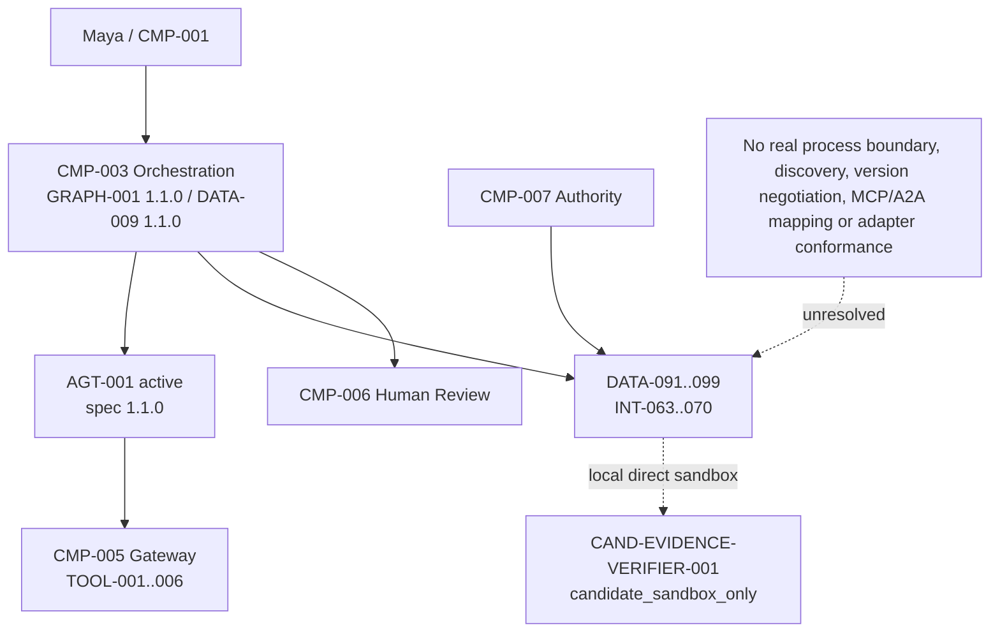
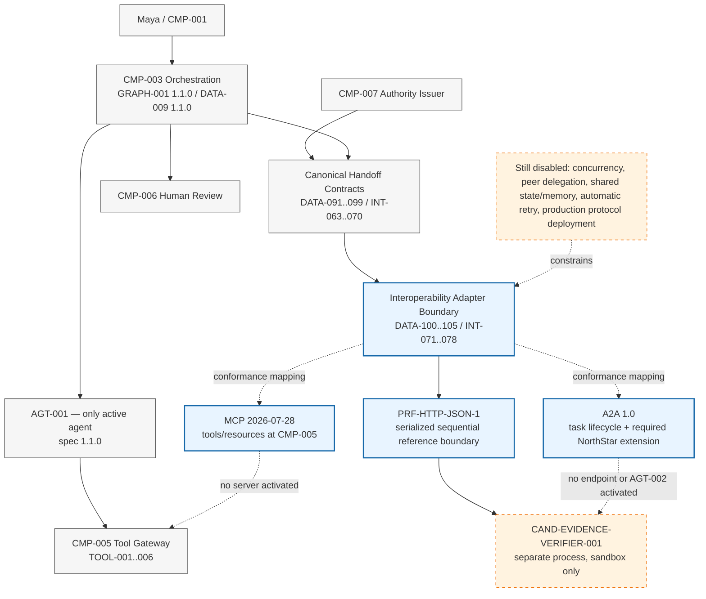
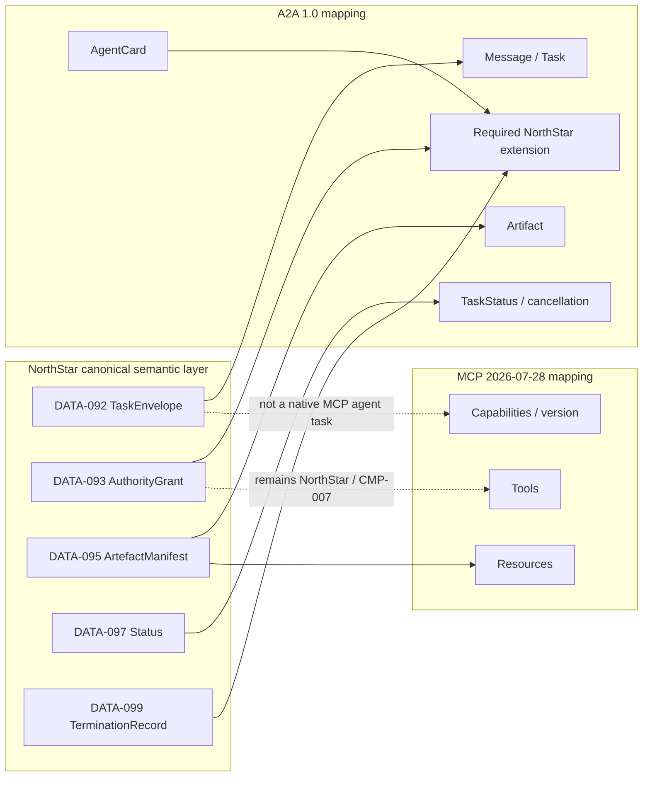

# Stage 6C — MCP, A2A and Interoperability

**Stage identifier:** `S06C`  
**Architecture/repository/handoff version:** `1.5.0`  
**Execution date:** 2026-08-01  
**Verification boundary:** local/offline Python 3.13.5; standard-library runtime; pytest 9.0.2; one active agent; one deterministic candidate endpoint; one serialized, synchronous, loopback HTTP/JSON reference boundary; conformance-only MCP 2026-07-28 and A2A 1.0 mappings. No production MCP or A2A endpoint, second active agent, concurrency, broker, gRPC runtime, production IAM, audit/WORM, deployment or disaster recovery.

## 1. Context Carried Forward

NorthStar enters S06C from the accepted S06B `1.4.0` baseline. `AGT-001 Regulatory Impact Assessment Agent` remains the only active agent and remains bound to `AGT-001-spec 1.1.0`. `CMP-003 Case and Workflow Orchestration Boundary` still owns task creation, routes, protected state mutation, cancellation and system termination. `GRAPH-001 1.1.0` and `DATA-009 AgentRunState 1.1.0` remain unchanged.

`TOOL-001`–`003` remain read-only and `TOOL-004`–`006` remain reversible, unapproved writes. Every invocation remains gateway-only through `CMP-005`; no protocol adapter bypasses validation, authorization, idempotency, budgets, recovery or reconciliation. `CMP-007` remains the only delegated-authority issuer. Human decisions remain external, typed, role- and separation-of-duties-controlled, expiring and single-use. Timeout never approves; a late decision fails closed; approved/rejected are preliminary human-reviewed dispositions rather than final legal or compliance closure.

S06B made handoff semantics explicit through `DATA-091`–`099` and `INT-063`–`070`: endpoint identity, signed task envelope, attenuated authority, immutable artefact manifest, receipt, status, failure and termination evidence. It also established `CAND-EVIDENCE-VERIFIER-001` as a deterministic `candidate_sandbox_only` endpoint with no tools, memory write, routing, delegation, approval, finalization or concurrency. Those facts remain authoritative. (supplied S06B Stage Handoff Pack).

The unresolved problem is that these contracts have only crossed a Python-call seam. NorthStar has not proved that serialization, discovery, protocol versioning, receiver-side enforcement, cancellation, correlation, deadline and artefact integrity survive a real process boundary. It has not separated MCP's tool/resource interoperability domain from an agent-to-agent task lifecycle. It has not defined how an A2A Agent Card or task maps to NorthStar authority and human-accountability invariants. It also has no adapter conformance evidence.

This stage modifies all ten source-of-truth artefacts; adds `ADR-051`–`055`, `DATA-100`–`105`, `INT-071`–`078`, `FR-190`–`208`, `NFR-150`–`165`, `CTL-131`–`148`, `TEST-307`–`360` and `EVAL-070`–`078`; and advances the architecture to `1.5.0`.

## 2. Narrative Development

Elena starts two local processes and sends the same S06B verification task across an HTTP boundary. Maya sees no business change: the result is still a preliminary evidence-verification artefact, not an approval. Marcus, however, can now point to the receiving process as the policy-enforcement point. It rejects a mismatched content digest, an unsupported contract version, an altered authority digest and an unauthorized artefact before the verifier reads the content.

Priya then asks a question that prevents protocol-driven architecture: “Which problem are we standardizing?”

When `AGT-001` needs a controlled NorthStar search or write capability, it is interacting with **tools and resources**. MCP is a natural interoperability candidate for that boundary, but the MCP server must not become the authority issuer or case owner. When a future independent agent accepts a task, reports status, produces artefacts and supports cancellation, the problem is **agent task lifecycle**. A2A is a closer semantic fit, but an Agent Card and Task do not automatically encode NorthStar's exact attenuated grant, causation, deadline, approval boundary and `CMP-003` termination ownership.

The team therefore refuses to choose one protocol as a universal agent bus. It retains NorthStar's canonical contracts above adapters, implements the smallest real serialized boundary, and builds conformance mappings for the current MCP and A2A specifications without activating either protocol in production.

## 3. Problem Being Solved

S06C must establish:

1. a protocol profile registry that states semantic domain, exact version, binding, security target and implementation status;
2. a capability advertisement that is discoverable without becoming authorization;
3. exact protocol-version and approved-binding negotiation with no silent downgrade;
4. a real serialized process boundary that preserves all required S06B fields;
5. receiver-side validation before content load or action;
6. an MCP mapping for tools and resources at `CMP-005`, without treating tool descriptions as authority;
7. an A2A mapping for Agent Card, Task/Message, Artifact, status and cancellation;
8. an explicit extension for NorthStar fields that are not safely represented by the native A2A core;
9. a conformance record that identifies native fields, extension fields, semantic loss and prohibited semantics;
10. security, performance, cost and governance limits for each adapter; and
11. evidence that exactly one active agent and sequential execution remain.

### Explicit non-goals

S06C does **not**:

- allocate `AGT-002` or promote the candidate endpoint;
- enable concurrent user branches, agents or workers;
- introduce peer delegation, dynamic agent creation or shared memory/state;
- deploy an MCP server or client, A2A server or client, gRPC service, queue, event bus or framework runtime;
- create retry, redelivery, ordering, deduplication, dead-letter or backpressure semantics;
- replace `CMP-005`, `CMP-007`, `CMP-003` or `CMP-006` ownership;
- claim production HTTPS, mTLS, OAuth, DPoP, KMS, workload identity, trusted time, non-repudiation or durable replay protection;
- treat a capability advertisement or Agent Card as authorization;
- treat tool annotations, model descriptions or remote metadata as trusted policy; or
- generate Stage 6D concurrency design.

## 4. Requirements Introduced or Updated

### 4.1 Functional requirements

| ID | Requirement |
|---|---|
| `FR-190` | Maintain versioned protocol profiles with semantic domain, binding, security target and implementation status. |
| `FR-191` | Advertise candidate capabilities without allocating an agent or granting authority. |
| `FR-192` | Negotiate exact supported protocol version and approved binding; reject otherwise. |
| `FR-193` | Preserve `DATA-092`/`093`/`095` identity, digest, deadline and scope across serialization. |
| `FR-194` | Validate contract version, content digest, correlation and authority digest at the receiver. |
| `FR-195` | Enforce authorization before artefact content is accepted or processed. |
| `FR-196` | Emit a transport delivery receipt with semantic-loss and warning fields. |
| `FR-197` | Map MCP tools only to `CMP-005`-governed `TOOL-001`–`006`. |
| `FR-198` | Map MCP resources only to immutable, authorized artefact/resource references. |
| `FR-199` | Reject MCP as a complete agent-handoff mapping when task authority/termination semantics are absent. |
| `FR-200` | Map an A2A Agent Card to the candidate endpoint descriptor without changing agent inventory. |
| `FR-201` | Map `DATA-092` to A2A Message/Task identity, context, parts and metadata. |
| `FR-202` | Map `DATA-095` to A2A Artifact semantics without shared mutable state. |
| `FR-203` | Map NorthStar lifecycle to A2A task states while preserving stricter NorthStar terminal rules. |
| `FR-204` | Require a NorthStar A2A extension for authority, deadline, causation, approval and termination ownership. |
| `FR-205` | Record native mappings, extension mappings, lost fields and prohibited semantics in `DATA-104`. |
| `FR-206` | Reject extension stripping, unknown versions, binding substitution and field loss. |
| `FR-207` | Preserve exactly one active agent and sequential, one-attempt execution. |
| `FR-208` | Defer gRPC, broker/event and framework-native activation until topology/SLO/concurrency evidence exists. |

### 4.2 Non-functional requirements

`NFR-150`–`165` require deterministic canonical JSON; exact version/binding agreement; fail-closed validation; stable digest and correlation preservation; receiver-side enforcement; transport-neutral canonical contracts; no silent downgrade; no automatic retry; localhost-only reference serving; bounded payloads; privacy-minimized error responses; deterministic conformance fixtures; explicit experimental/deferred status; standard-library local execution; microbenchmark transparency; and backward compatibility with all `1.4.0` invariants.

### 4.3 Controls

`CTL-131`–`148` implement protocol-profile allowlists; exact negotiation; content and authority digest headers; receiver-side PEP checks; endpoint status validation; one active agent; candidate non-activation; MCP domain separation; A2A required-extension validation; Agent Card metadata/status checks; no tool-gateway bypass; no shared state/memory; no retry/concurrency; semantic-loss rejection; loopback-only reference server; security-target warnings; and a release consistency audit.

**Governance Requirement:** discovery proves that an endpoint claims a capability. It does not prove identity, authority, trustworthiness, data entitlement, production readiness or agent allocation.

## 5. Conceptual Explanation

### 5.1 Interoperability is semantic preservation, not merely connectivity

Two systems can exchange JSON and still be non-interoperable. NorthStar requires both syntactic compatibility and preservation of meaning. A protocol adapter is conformant only when the receiver can reconstruct the same task identity, audience-bound authority, artefact integrity, deadline, cancellation intent, trace/correlation/causation, status and termination ownership that existed before serialization.

`DATA-104 AdapterConformanceRecord` therefore records:

- canonical fields expected;
- fields represented natively by the target protocol;
- fields represented through an approved extension;
- lost fields;
- prohibited semantics observed; and
- a pass/fail result.

An adapter that returns a valid HTTP 200 response but loses authority or deadline semantics fails.

### 5.2 Protocol profile versus endpoint capability advertisement

`DATA-100 InteroperabilityProtocolProfile` is NorthStar's approved interpretation of a protocol/version/binding. It says what semantic problem the profile is allowed to solve and what it must never enable.

`DATA-102 CapabilityAdvertisement` describes an endpoint's claimed skills, tools, resources, protocol profiles and security schemes. It is cacheable only until expiry and must be authenticated in production. The advertisement is not a grant. `CMP-007` still issues `DATA-093`; `CMP-005` still enforces tool access; `CMP-003` still creates tasks.

### 5.3 Version and binding negotiation

A protocol name is insufficient. A2A 1.0 over HTTP+JSON and a different A2A version or binding may have different schema and behavior. MCP 2026-07-28 is materially different from the prior 2025-11-25 revision, including a stateless core and changed versioning/extension model. NorthStar records both sides' supported versions, the exact selected version, the approved binding and the rejection reason in `DATA-103`.

The reference negotiator does not infer compatibility from “newer” or “close enough.” An exact approved pair is accepted; no common version or unapproved binding is rejected. This is intentionally stricter than many general-purpose clients because NorthStar's security and accountability fields cannot be silently discarded.

### 5.4 Direct calls

A direct Python call is the cheapest executable reference and remains useful for unit tests. It does not prove serialization, remote identity, network failure handling or independent receiver enforcement. `PRF-DIRECT-1` is therefore `local_test_only`, not an interoperability boundary.

### 5.5 HTTP/JSON reference boundary

HTTP provides a familiar request/response envelope, status codes, headers, intermediaries and broad tooling. JSON preserves readable typed objects. The S06C implementation uses a separate loopback process and one synchronous POST. It carries:

- `Content-Digest` — hash of the exact artefact bytes;
- `X-NorthStar-Contract-Version` — canonical schema version;
- `X-NorthStar-Correlation-Id` — stable correlation identity; and
- `X-NorthStar-Authority-Digest` — exact grant binding.

The receiver rejects mismatches before verification. It then validates the grant, envelope and artefact. The response contains `DATA-105` receipt fields and explicitly warns that the local transport is not production HTTPS.

This is not a claim that “REST is selected for production.” It is the minimum real boundary necessary to prove serialization and PEP placement.

### 5.6 REST APIs

A resource-oriented REST API is suitable when the boundary is an ordinary enterprise service with stable resources and operations. HTTP methods, status codes, caching and gateways are useful, but REST alone does not define agent task status, artifact history, cancellation acknowledgement, authority attenuation or system termination. Those remain NorthStar application semantics.

### 5.7 gRPC

gRPC offers protobuf contracts, generated clients, HTTP/2, metadata, streaming, deadlines and cancellation. It is attractive for strongly controlled internal services and can reduce serialization overhead. Yet deadlines and cancellation still require application-specific treatment: cancellation does not prove that a side effect did not commit, and a deadline-exceeded response can coexist with ambiguous completion. NorthStar would still need its canonical grant, idempotency, artefact and termination contracts. gRPC is deferred because S06C has no measured performance or streaming need and adding protobuf/runtime dependencies would not improve the current decision evidence.

### 5.8 Queues and event buses

Brokers are useful when work must survive producer/consumer outages, buffer bursts, support asynchronous workers or fan out events. They also introduce at-least-once delivery, ordering scope, duplicate suppression, dead-letter handling, schema registry, consumer lag, backpressure and operational ownership. Those are concurrency/distributed-execution concerns. Selecting a broker in S06C would violate the staged boundary.

### 5.9 Framework-native handoffs

Agent frameworks can transfer control between agents or convert agents into tools. This is productive inside one runtime, but framework objects may hide authority, task and termination semantics or couple the architecture to one SDK. NorthStar may later implement a framework adapter, but the canonical contracts remain above it. A framework handoff cannot allocate a new NorthStar agent or bypass `CMP-003`/`CMP-007`.

### 5.10 MCP concepts and NorthStar boundary

The current MCP 2026-07-28 specification defines a base protocol, versioning/compatibility, transport bindings, authorization for HTTP and server features including resources, prompts and tools. MCP is therefore a strong candidate for making `CMP-005` capabilities portable to AI hosts and clients.

NorthStar maps:

- MCP **tools** → gateway-controlled `TOOL-001`–`006` descriptions and schemas;
- MCP **resources** → authorized immutable references such as `DATA-095` artefacts;
- MCP capability/version declarations → `DATA-100` and `DATA-103`; and
- MCP authorization → a transport/authentication layer that still terminates at NorthStar PEPs.

NorthStar does not map:

- MCP tool name → agent identity;
- MCP tool annotation → authorization decision;
- an MCP session/request → `CMP-003` system termination;
- an MCP prompt → authoritative policy;
- an MCP server → permission to access all NorthStar data; or
- MCP alone → complete independent-agent task lifecycle.

The code deliberately returns a failing conformance record when asked to represent the complete agent handoff through MCP because task acceptance, exact attenuated authority, final-closure ownership and NorthStar termination semantics would be lost.

### 5.11 A2A concepts and NorthStar boundary

A2A 1.0 is designed for interaction among independent agent systems. Its current specification includes Agent Cards/interfaces, Messages, Tasks, Artifacts, task status, cancellation, streaming and push-notification patterns. These concepts are a closer fit for the future independent-agent boundary than MCP tools.

NorthStar maps:

- `DATA-091` candidate descriptor → A2A Agent Card fields and metadata;
- `DATA-092` task envelope → A2A Message/Task identity, `contextId`, parts and metadata;
- `DATA-095` → A2A Artifact/data-part references;
- `DATA-097` → A2A TaskState, while retaining NorthStar's stricter transition rules; and
- cancellation → A2A cancellation operation plus NorthStar's explicit `cancel_requested`/terminal evidence.

A2A native fields do not automatically preserve every NorthStar invariant. The conformance profile therefore requires `https://northstar.example/extensions/handoff-contract/v1` to carry:

- grant digest and authority binding;
- exact deadline;
- causation ID;
- `CMP-003` system-termination ownership; and
- `notAnApproval=true`.

An A2A message without this required extension fails conformance. No A2A server is run, and the Agent Card explicitly says the endpoint is sandbox-only and not an allocated agent.

### 5.12 MCP and A2A are complementary, not competitors for one universal role

| Concern | MCP fit | A2A fit | NorthStar owner |
|---|---|---|---|
| Model/host discovers a tool | Strong | Not primary | `CMP-005` |
| Model/host reads a resource | Strong | Possible as artifact, but not primary | `CMP-004`/`CMP-005` |
| Independent endpoint advertises agent skills | Limited/custom | Strong via Agent Card | `CMP-003` registry governance |
| Long-running task lifecycle | New/extension-dependent; not selected here | Strong native domain | `CMP-003` |
| Attenuated authority | Requires application/security mapping | Requires application/security mapping | `CMP-007` |
| Human approval/final closure | Not protocol-owned | Not protocol-owned | `CMP-006`/human owners |
| System termination | Not protocol-owned | Task terminal state is not NorthStar case termination | `CMP-003` |
| Shared state/memory | Should not be inferred | Should not be inferred | Existing state/memory owners |

### 5.13 Discovery and trust establishment

Discovery can be static configuration, a registry, DNS/well-known metadata, an MCP registry/server configuration, an A2A Agent Card or enterprise service catalogue. NorthStar separates four questions:

1. **Where is the endpoint?** Discovery.
2. **What does it claim to support?** Capability advertisement.
3. **Is the endpoint authenticated and approved?** Trust and registry validation.
4. **May it perform this exact task on this exact resource now?** `DATA-093` and receiver PEP.

A production Agent Card or capability record should be integrity-protected, expiry-bounded, owner-approved and linked to workload identity. S06C records the target but does not implement managed signing or PKI.

### 5.14 Authentication, authorization and identity propagation

The local HMAC fixtures remain a tutorial mechanism. A production reference would normally combine HTTPS, workload identity, mTLS and/or OAuth-based authorization, sender-constrained credentials, short TTLs, resource/audience binding, trusted clocks and durable replay/revocation. The protocol adapter authenticates the channel/peer; `CMP-007` authorizes the delegated action; the receiver enforces before load. Passing Maya's token or `AGT-001`'s unrestricted credential remains prohibited.

### 5.15 Cancellation, deadlines and ambiguous effects

Transport cancellation means the caller no longer wants the result or the channel ended. It does not prove that the recipient stopped before committing a side effect. NorthStar therefore preserves application-level cancellation and commit-state evidence. In S06C the candidate performs a read-only deterministic verification, one attempt, so ambiguity is minimized. Any future write-capable remote endpoint must reuse the accepted idempotency, reconciliation and compensation controls.

## 6. When This Capability Is Required

An interoperability adapter is justified when one or more of these boundaries exist:

- a process, runtime, language, vendor, cloud or organization boundary;
- independent workload identity or policy enforcement;
- independently deployed tools/resources or agents;
- long-running task status and cancellation;
- a marketplace/registry or third-party endpoint;
- stable cross-team schema ownership;
- a need to replace one implementation without rewriting business semantics; or
- protocol conformance required by enterprise/platform strategy.

## 7. When It Is Not Required

Do not add MCP, A2A, REST, gRPC or a broker merely to connect functions in one owned process. A typed direct function is safer when the caller and callee share deployment, authority, state, lifecycle and fault domain. Do not use A2A for a graph node that has no independent identity or operational owner. Do not use MCP to wrap every internal function. Do not adopt a broker before asynchronous durability/backpressure is required.

**Common Anti-pattern:** “protocol laundering”—placing an unsafe action behind a standard protocol and assuming the protocol has made it authorized, governed or auditable.

## 8. Architecture Options

### Option A — Direct in-process adapter

Best latency and simplest debugging. It proves canonical validation but not interoperability. Retained for tests only.

### Option B — HTTP/JSON serialized reference boundary

Broadly understood, dependency-free in Python, easy to inspect and sufficient to prove a separate receiver. Selected as the minimum reference boundary, not final production topology.

### Option C — REST product/service API

Appropriate for ordinary enterprise resources and operations. Deferred until service ownership and resource model are known.

### Option D — gRPC

Strong typed internal RPC, deadlines, cancellation and streaming. Deferred until protobuf/runtime and performance evidence justify it.

### Option E — Queue/event bus

Durable asynchronous delivery and buffering. Deferred to the concurrency/distributed-execution problem because it introduces delivery semantics and operational infrastructure.

### Option F — Framework-native handoff

Fast within a chosen agent SDK but risks coupling and hidden semantics. Deferred as an adapter, never authoritative.

### Option G — MCP

Selected as the **current conformance target for tool/resource interoperability**, not as the complete agent task protocol. No server is activated.

### Option H — A2A

Selected as the **candidate conformance target for future independent-agent task lifecycle**, with a mandatory NorthStar extension. No endpoint or second agent is activated.

### Option I — Shared database/workspace

Rejected as communication mechanism because it creates hidden coupling, mutable shared state, unclear authority and difficult causation.

## 9. Decision Matrix

Scores are 1–5 for the present NorthStar requirement, not universal rankings.

| Option | Semantic fit now | Security visibility | Local proof | Long-task support | Operational burden | Lock-in control | S06C decision |
|---|---:|---:|---:|---:|---:|---:|---|
| Direct call | 4 | 4 | 5 | 1 | 5 | 5 | Test-only |
| HTTP/JSON reference | 5 | 5 | 5 | 2 | 4 | 5 | **Implement** |
| REST service | 4 | 4 | 4 | 2 | 3 | 4 | Defer production design |
| gRPC | 4 | 5 | 3 | 4 | 2 | 4 | Defer |
| Queue/event bus | 2 | 4 | 2 | 5 | 1 | 4 | Defer to concurrency |
| Framework handoff | 3 | 2 | 4 | 3 | 4 | 1 | Defer adapter |
| MCP | 5 for tools/resources; 2 for agent lifecycle | 4 | 3 | 3 | 3 | 4 | Conformance-only at `CMP-005` |
| A2A | 5 for agent lifecycle | 4 with extension | 3 | 5 | 3 | 4 | Conformance-only candidate |
| Shared DB/workspace | 2 | 1 | 3 | 3 | 3 | 2 | Reject |

## 10. Selected Architecture and Rationale

NorthStar selects a **canonical-contract-first interoperability architecture**:

1. `DATA-091`–`099` remain authoritative.
2. Every protocol/version/binding is registered as `DATA-100` with an explicit status.
3. Exact version and approved binding are negotiated through `DATA-103`; silent downgrade fails.
4. `PRF-HTTP-JSON-1` is implemented across a separate local process as the minimum serialized reference boundary.
5. MCP 2026-07-28 is mapped only to tool/resource interoperability at `CMP-005`; no MCP server is activated.
6. A2A 1.0 is mapped to candidate agent discovery/task lifecycle, with a mandatory NorthStar extension; no A2A endpoint or `AGT-002` is activated.
7. `DATA-104` proves whether an adapter preserved semantics and rejects loss.
8. gRPC, queues/event buses and framework-native adapters remain deferred.
9. Execution remains sequential, one-hop and one-attempt.

**Architect’s Decision:** select semantic domains before selecting protocols. MCP and A2A solve related but different interoperability problems; neither overrides NorthStar's application authority and accountability model.

## 11. Architecture Before the Change



Before S06C, the candidate verifier could only be invoked through an in-process contract sandbox. There was no serialized trust boundary, version registry or protocol mapping.

## 12. Architecture After the Change



The new adapter boundary is subordinate to the existing orchestration, authority, gateway, human and state owners. The only executable cross-process path is the sequential loopback HTTP reference. MCP and A2A arrows are conformance mappings, not active network integrations.

### Focused protocol mapping



### Reference request sequence

```mermaid
sequenceDiagram
  participant C3 as CMP-003 Orchestrator
  participant C7 as CMP-007 Authority
  participant AD as HTTP/JSON Adapter
  participant EP as Candidate Endpoint Process
  C3->>C7: obtain DATA-093 one-use attenuated grant
  C7-->>C3: signed grant bound to audience/case/run/task/resource
  C3->>AD: DATA-092 envelope + DATA-095 manifest + content
  AD->>AD: canonicalize; add content/grant/correlation/version headers
  AD->>EP: POST /handoffs/verify (one synchronous request)
  EP->>EP: exact version and header checks
  EP->>EP: verify grant before artefact load
  EP->>EP: verify envelope, case/task/deadline and content hash
  EP-->>AD: typed result + DATA-105 delivery receipt fields
  AD-->>C3: receipt with zero semantic loss
  Note over C3,EP: No retry, concurrency, peer delegation, approval or finalization
```

## 13. Detailed Component Design

### 13.1 Protocol profile registry

`registry.py` defines seven profiles:

- `PRF-DIRECT-1` — local test only;
- `PRF-HTTP-JSON-1` — selected serialized reference boundary;
- `PRF-MCP-2026-07-28` — current MCP conformance profile;
- `PRF-MCP-2025-11-25` — prior compatibility profile;
- `PRF-A2A-1.0` — conformance-only candidate agent-task profile;
- `PRF-GRPC-DEFERRED` — deferred typed service RPC; and
- `PRF-EVENT-DEFERRED` — deferred asynchronous transport.

Each profile has `semantic_domain`, `implementation_status`, `supported_features`, `prohibited_features`, `security_target` and a canonical-contract version. This makes “supported” distinguishable from “implemented,” “active” and “production-approved.”

### 13.2 Exact negotiation

The negotiator preserves local preference order but accepts only a version present on both sides and a binding explicitly approved for that version. It returns `accepted` or `rejected` with a deterministic reason. There is no implicit downgrade or protocol-name fallback.

```python
def negotiate(*, negotiation_id, protocol_name, local_supported,
              remote_supported, binding_by_version):
    local = tuple(local_supported)
    remote = tuple(remote_supported)
    common = [version for version in local if version in remote]
    if not common:
        return VersionNegotiationRecord(
            negotiation_id=negotiation_id,
            protocol_name=protocol_name,
            local_supported=local,
            remote_supported=remote,
            selected_version=None,
            selected_binding=None,
            result="rejected",
            reason="no_exact_compatible_version",
        )
    selected = common[0]
    binding = binding_by_version.get(selected)
    if not binding:
        return VersionNegotiationRecord(..., result="rejected",
                                        reason="binding_not_approved")
    return VersionNegotiationRecord(..., selected_version=selected,
                                    selected_binding=binding,
                                    result="accepted",
                                    reason="exact_version_and_binding_match")
```

### 13.3 HTTP/JSON adapter

The client adapter canonicalizes the fixture, sends the exact content bytes plus canonical envelope/grant/manifest and verifies the response. It does not retry. The server uses Python's single-threaded `HTTPServer`, which structurally prevents the reference endpoint from becoming a concurrency implementation.

The server performs these checks in order:

1. correct path and bounded content length;
2. required contract-version, content-digest, correlation and authority-digest headers;
3. known sender/recipient fixtures and candidate runtime status;
4. grant signature/issuer/audience/time/use/depth/operation;
5. envelope signature/schema/endpoints/purpose/output/attempt/hop/time/grant bindings;
6. artifact case/subject/resource/data-scope/content digest; and
7. deterministic result creation marked `notAnApproval=true`.

A failure returns a minimized typed error; raw secrets or content are not echoed.

### 13.4 MCP mapping adapter

`McpMappingAdapter.build_server_catalog()` creates a conformance artifact with MCP tools and resources. All `TOOL-*` entries remain descriptions of gateway capabilities; they are not direct Python functions exported to an untrusted model. Read-only hints reflect tool classification but are not policy decisions.

`attempt_agent_handoff_mapping()` intentionally returns `fail_for_agent_handoff` and identifies the missing semantics:

- orchestrator-owned task acceptance lifecycle;
- case/run/task-bound attenuated authority;
- system termination ownership; and
- human-approval non-transfer invariant.

This negative test is important: it proves the architecture is not forcing MCP to solve the wrong problem.

### 13.5 A2A mapping adapter

`A2AMappingAdapter.build_agent_card()` emits a candidate card with:

- one HTTP+JSON 1.0 interface;
- streaming and push notifications disabled;
- a single evidence-verification skill;
- production-target OAuth/mTLS declarations clearly marked as not locally implemented;
- endpoint digest and `candidate_sandbox_only` metadata; and
- `northstarNoAgentAllocation=true`.

`map_task_message()` maps correlation to `contextId`, task identity to `taskId`, the goal and artefact references to a data part, and the remaining invariants to extension metadata. `conformance_for_message()` fails when the extension or required fields are absent.

### 13.6 Lifecycle mapping

| NorthStar status | A2A TaskState mapping | NorthStar qualification |
|---|---|---|
| `offered` | `TASK_STATE_SUBMITTED` | Still owned/validated by `CMP-003`. |
| `accepted` | `TASK_STATE_SUBMITTED` | NorthStar separately records acceptance receipt. |
| `running` | `TASK_STATE_WORKING` | No concurrency inferred. |
| `completed` | `TASK_STATE_COMPLETED` | Result is not approval or case closure. |
| `failed` | `TASK_STATE_FAILED` | Typed `DATA-098` retained. |
| `cancelled` | `TASK_STATE_CANCELED` | Must be terminal in NorthStar ledger. |
| `rejected` | `TASK_STATE_REJECTED` | No automatic reroute. |
| `expired` | `TASK_STATE_FAILED` | NorthStar retains the distinct expired reason. |
| `cancel_requested` | `TASK_STATE_WORKING` | A request is not proof of cancellation. |

The mapping is deliberately non-bijective. `DATA-104` records where the native protocol is less specific.

## 14. Data, State and Interface Design

### 14.1 New data objects

| ID | Object | Owner | Purpose |
|---|---|---|---|
| `DATA-100` | InteroperabilityProtocolProfile | `CMP-003`/`CMP-011` | Approved protocol/version/binding semantics and status. |
| `DATA-101` | ProtocolBindingManifest | `CMP-003` | Canonical-field to wire/native/extension mapping. |
| `DATA-102` | CapabilityAdvertisement | Registry governance | Expiring endpoint claims; never authorization. |
| `DATA-103` | VersionNegotiationRecord | Adapter boundary | Exact version/binding selection or rejection evidence. |
| `DATA-104` | AdapterConformanceRecord | `CMP-008` | Native/extension mappings, loss and prohibited semantics. |
| `DATA-105` | TransportDeliveryReceipt | Adapter + `CMP-003` | Delivery, digest, correlation, terminal status, warnings and loss. |

All are immutable/frozen local dataclasses with deterministic SHA-256 digests. JSON Schemas are supplied as Draft 2020-12 artifacts; runtime validation is explicit Python code rather than a third-party JSON Schema engine.

### 14.2 New interfaces

| ID | Interface | Contract |
|---|---|---|
| `INT-071` | Protocol Profile Registry | Read approved profiles; reject unknown/disabled semantics. |
| `INT-072` | Capability Advertisement and Discovery | Load expiring, integrity-bound endpoint claims; no authority grant. |
| `INT-073` | Version and Binding Negotiation | Exact version + approved binding or fail closed. |
| `INT-074` | HTTP/JSON Reference Delivery | Serialized synchronous offer/result with receiver PEP. |
| `INT-075` | MCP Tool/Resource Conformance Mapping | Map tools/resources; prohibit agent authority/termination mapping. |
| `INT-076` | A2A Task-Lifecycle Conformance Mapping | Agent Card/Message/Task/Artifact/status plus required extension. |
| `INT-077` | Adapter Conformance and Semantic-Loss Evaluation | Produce `DATA-104`; any required loss fails. |
| `INT-078` | Protocol Security and Fail-Closed Enforcement | Header/digest/version/status/power checks and minimized errors. |

### 14.3 State and memory

`DATA-009` remains authoritative and is never serialized as shared writable state. The candidate receives one immutable artefact. It returns a result/receipt. `DATA-081` memory is not included. Protocol metadata cannot create memory, route the graph or mutate protected state.

### 14.4 Wire fields

The HTTP reference body contains canonical envelope, grant, manifest and base64 content. It does not carry unrestricted user credentials, prompts, full conversation, raw memory, hidden reasoning or production secrets. The header/body digests make substitution detectable in the reference implementation.

## 15. Implementation

### 15.1 Repository modules

```text
src/northstar_compliance/interoperability/
├── canonical.py
├── models.py
├── validation.py
├── fixtures.py
├── registry.py
├── evaluation.py
├── server.py
└── adapters/
    ├── base.py
    ├── direct.py
    ├── http_json.py
    ├── mcp.py
    └── a2a.py
```

### 15.2 Running the reference boundary

```bash
cd northstar-agentic-compliance-stage6c
python -m compileall -q src scripts
pytest
PYTHONPATH=src python scripts/run_stage6c_demo.py
PYTHONPATH=src python scripts/run_stage6c_evaluation.py
PYTHONPATH=src python scripts/benchmark_stage6c.py
PYTHONPATH=src python scripts/validate_stage6c.py
PYTHONPATH=src python scripts/consistency_audit_stage6c.py
```

The integration suite starts `scripts/run_reference_server.py` as a subprocess on a free loopback port, waits for its readiness line, performs one request and terminates the process. No external network or paid service is required.

### 15.3 Complete A2A extension invariant

```python
NORTHSTAR_EXTENSION =     "https://northstar.example/extensions/handoff-contract/v1"

required = {
    "authority": "northstarGrantDigest",
    "deadline": "northstarDeadlineAt",
    "correlation": "contextId",
    "causation": "northstarCausationId",
    "termination": "northstarTerminationOwner",
    "approval_boundary": "northstarNotApproval",
}
```

If the extension declaration is missing or any required field is absent, the conformance record is `fail`.

## 16. Code and Repository Changes

### Files added

```text
config/architecture/interoperability-policy-v1.json
config/protocols/protocol-profiles-v1.json
config/evaluation/stage6c-cases.json
docs/adr/ADR-051...ADR-055*.md
docs/architecture/diagrams/stage-6c-*.mmd
docs/references/Stage-6C-Technical-Sources.md
docs/stages/Stage-6C-MCP-A2A-and-Interoperability.md
schemas/DATA-100.schema.json ... DATA-105.schema.json
src/northstar_compliance/interoperability/**
scripts/run_reference_server.py
scripts/run_stage6c_demo.py
scripts/run_stage6c_evaluation.py
scripts/benchmark_stage6c.py
scripts/validate_stage6c.py
scripts/consistency_audit_stage6c.py
tests/unit/**
tests/integration/test_direct_and_http.py
tests/security/test_http_and_protocol_security.py
tests/evaluation/test_evaluations_and_invariants.py
```

### Files modified/reconstructed

All ten `docs/source-of-truth/*.md`, `README.md`, `pyproject.toml` and the cumulative architecture diagram.

### Files retired

None.

### Compatibility notes

- Python target `>=3.11,<3.15`; executed on Python 3.13.5.
- Runtime dependencies: standard library only.
- Test dependency: pytest 9.0.2.
- `AGT-001-spec`, `GRAPH-001` and `DATA-009` remain `1.1.0`.
- `DATA-091`–`099` and `INT-063`–`070` remain unchanged in meaning.
- The package is a compatible reconstruction overlay because the complete byte-exact S06B repository and all ten detailed registers were not supplied as individual files.

## 17. Security and Governance Implications

### 17.1 Security gains

- Receiver-side authorization and integrity validation are now executable across a process boundary.
- Version, binding, content digest, correlation and authority binding are explicit.
- Capability claims are separated from authorization.
- MCP tool/resource descriptions remain behind the accepted gateway/PDP ownership.
- A2A task mapping cannot silently strip authority, deadline, causation, approval or termination semantics.
- Protocol profiles explicitly prohibit agent promotion, peer delegation, concurrency and gateway bypass.
- Semantic loss is a test failure rather than undocumented behavior.

### 17.2 Threats introduced

New threats include capability-advertisement spoofing; Agent Card tampering; version downgrade; binding confusion; extension stripping; remote MCP server/tool poisoning; misleading tool annotations; schema substitution; digest/header mismatch; endpoint impersonation; SSRF and unsafe URL discovery; replay; cancellation spoofing; status forgery; cross-tenant routing errors; oversized payloads; error leakage; and adapter supply-chain compromise.

### 17.3 Controls and production targets

The local reference uses HMAC and loopback HTTP. Production requires, at minimum, managed workload identity, HTTPS, mTLS and/or OAuth, sender-constrained credentials where appropriate, KMS-backed keys, signed/verified capability metadata, allowlisted discovery, trusted time, durable replay/revocation, network egress controls, payload limits, schema validation, redaction, trace integrity and production audit records.

**Security Boundary:** the remote protocol endpoint is untrusted until the receiver authenticates it, validates the profile/version/binding and applies `CMP-007` policy. Protocol compliance does not equal trust.

### 17.4 Governance

Sofia's governance gate must distinguish:

- protocol specification conformance;
- NorthStar adapter conformance;
- endpoint registration;
- agent allocation;
- deployment approval; and
- runtime authorization.

Passing one gate does not imply passing the others. `CAND-EVIDENCE-VERIFIER-001` passes local adapter tests but remains absent from the active `AGT-*` inventory.

## 18. Performance, Concurrency and Cost Implications

### 18.1 Performance

The local microbenchmark measures only deterministic Python mapping/validation overhead. It excludes network, TLS, IAM, model, database, object-store and audit latency. Observed local results are recorded in `reports/stage6c-benchmark.json`; representative run results were approximately:

- direct canonical validation: p50 0.27 ms, p95 0.32 ms;
- MCP catalog mapping: p50 0.002 ms, p95 0.002 ms; and
- A2A message mapping: p50 0.06 ms, p95 0.07 ms.

These are not production SLOs or protocol benchmarks. Serialization and security can dominate this small deterministic workload.

### 18.2 Concurrency

The reference server is single-threaded, and tests issue one request. No async code, worker pool, parallel branch, streaming execution or push notification is enabled. A2A capabilities explicitly advertise streaming/push as false. Queue and event profiles remain deferred.

### 18.3 Cost

The main S06C incremental costs are engineering and governance: adapter maintenance, conformance testing, endpoint registry review, identity integration, observability and security operations. Per-task protocol CPU cost is trivial in the local fixture compared with model and human-review cost, but production TLS, gateways, brokers or service meshes can add infrastructure and operational cost. No currency estimate is invented without deployment assumptions.

### 18.4 Trade-offs

- Canonical adapters add code but reduce vendor/protocol lock-in.
- Exact version matching improves safety but can reject usable older endpoints.
- Extension metadata preserves semantics but reduces plug-and-play interoperability.
- HTTP/JSON is inspectable but less compact/typed than protobuf.
- A broker can improve durability but would add duplicates, lag and operational burden.

## 19. Evaluation and Test Cases

### 19.1 Executed tests

`TEST-307`–`360` comprise 54 stable test identifiers and 59 collected pytest cases because parametrized cases expand at runtime. All 59 passed.

| Test range | Coverage |
|---|---|
| `TEST-307`–`312` | Canonical serialization, immutable models and stable digests. |
| `TEST-313`–`321` | Grant/envelope/artifact signature, time, endpoint, scope and subject validation. |
| `TEST-322`–`329` | Protocol profile status, exact negotiation, mismatch and binding rejection. |
| `TEST-330`–`335` | MCP tools/resources mapping and explicit failure for agent-handoff semantics. |
| `TEST-336`–`341` | A2A Agent Card, task, extension, status and semantic-loss mapping. |
| `TEST-342`–`347` | Direct adapter and real subprocess HTTP delivery. |
| `TEST-348`–`355` | Header, digest, version, candidate status, power and protocol security failures. |
| `TEST-356`–`360` | Evaluation IDs, one-agent/no-concurrency invariants and deterministic configuration. |

### 19.2 Evaluations

| ID | Evaluation | Result |
|---|---|---|
| `EVAL-070` | Canonical contract preservation | Passed |
| `EVAL-071` | Exact A2A 1.0 version/binding negotiation | Passed |
| `EVAL-072` | MCP version mismatch fails closed | Passed |
| `EVAL-073` | MCP tool/resource versus agent-lifecycle separation | Passed |
| `EVAL-074` | A2A extension preserves required NorthStar semantics | Passed |
| `EVAL-075` | A2A mapping without extension fails | Passed |
| `EVAL-076` | Exactly one active agent remains | Passed |
| `EVAL-077` | Candidate has no concurrency or peer-delegation power | Passed |
| `EVAL-078` | Every protocol profile has explicit implementation status | Passed |

### 19.3 Validation commands and results

- Python compilation: passed.
- Pytest: **59 passed**.
- Demo: passed and emitted protocol profiles, MCP/A2A mappings and explicit non-activation claims.
- Nine evaluations: passed.
- Local microbenchmark: completed.
- Structural validation: passed after source-of-truth generation.
- Consistency audit: passed with recorded reconstruction and production exceptions.

## 20. Failure Scenarios and Recovery

### Failure 1 — Content changed in transit

The `Content-Digest` header or `DATA-095.content_sha256` no longer matches the bytes. The receiver rejects before verification. No result artifact is emitted. `CMP-003` records a typed integrity failure and does not mark the task complete.

### Failure 2 — Grant substitution

An attacker combines a valid envelope with another grant. The header, envelope grant digest and grant ID/digest binding disagree. The request fails closed before artefact load.

### Failure 3 — Unsupported protocol version

The endpoint advertises MCP 2025-11-25 while the selected profile requires 2026-07-28, or A2A has no exact 1.0 interface. `DATA-103` records `rejected/no_exact_compatible_version`. NorthStar does not silently downgrade.

### Failure 4 — A2A extension stripped

A proxy or endpoint removes the required extension declaration or authority/deadline fields. `DATA-104` lists lost fields and returns `fail`. The endpoint is not invoked.

### Failure 5 — MCP tool description claims write is safe

A remote annotation says a tool is read-only, but NorthStar's registry classifies it as a write. `CMP-005` classification and policy win. Metadata cannot reduce controls or grant permission.

### Failure 6 — Cancellation arrives after completion

Transport cancellation cannot rewrite a terminal NorthStar task. `CMP-003` retains the earlier terminal record and treats the late request as invalid/duplicate evidence.

### Failure 7 — HTTP timeout after a write

Not exercised because the candidate is read-only. For any future write, timeout is ambiguous and must enter the existing idempotency/reconciliation path. Automatic retry remains disabled.

### Failure 8 — Candidate claims active-agent status

Endpoint configuration or Agent Card metadata changes to active. The S06C validation and one-agent inventory tests fail; no request is sent.

### Recovery principles

- fail closed on identity, version, binding, authority or integrity mismatch;
- never convert transport failure to business success;
- do not automatically retry ambiguous actions;
- preserve original correlation/causation and failure evidence;
- require explicit profile/configuration change through ADR and gates; and
- keep human approval and case termination outside protocol endpoints.

## 21. Architecture Decision Records

- `ADR-051`: canonical NorthStar contracts remain authoritative above adapters.
- `ADR-052`: implement a sequential HTTP/JSON reference boundary, not a production topology.
- `ADR-053`: map current MCP 2026-07-28 to tool/resource interoperability at `CMP-005` only.
- `ADR-054`: map A2A 1.0 to candidate agent task lifecycle only with a required NorthStar extension; do not activate an agent.
- `ADR-055`: require exact protocol version and approved binding; defer gRPC, brokers and framework handoffs.

`ADR-001`–`050` remain accepted and are not superseded.

## 22. Requirements Traceability Update

| Requirement group | Components | Data/interfaces | Controls | Tests/evaluations |
|---|---|---|---|---|
| `FR-190`–`193` profiles, discovery, negotiation, serialization | `CMP-003`, `CMP-007`, adapter boundary | `DATA-100`–`103`, `INT-071`–`074` | `CTL-131`–`136` | `TEST-307`–`329`, `EVAL-070`–`072` |
| `FR-194`–`196` receiver enforcement and receipts | `CMP-003`, candidate PEP | `DATA-105`, `INT-074`, `INT-078` | `CTL-133`–`138` | `TEST-313`–`321`, `342`–`355` |
| `FR-197`–`199` MCP domain mapping | `CMP-005`, `CMP-007`, `CMP-008` | `DATA-104`, `INT-075`, `INT-077` | `CTL-139`–`141` | `TEST-330`–`335`, `EVAL-073` |
| `FR-200`–`206` A2A mapping/extension | `CMP-003`, `CMP-007`, `CMP-008` | `DATA-101`–`104`, `INT-072`, `076`–`078` | `CTL-142`–`146` | `TEST-336`–`341`, `EVAL-074`–`075` |
| `FR-207`–`208` one-agent/no-concurrency/deferment | `CMP-003`, `CMP-010`, `CMP-011` | profiles/config | `CTL-147`–`148` | `TEST-348`–`360`, `EVAL-076`–`078` |

## 23. Stage Outcome

NorthStar can now prove that its canonical handoff semantics survive serialization and a separate receiver process. It has an explicit protocol profile/negotiation model, an HTTP/JSON reference transport, a conformance method that detects semantic loss, a current MCP tool/resource mapping and an A2A 1.0 task-lifecycle mapping with a required NorthStar extension.

The architecture remains intentionally bounded. `AGT-001` is still the only active agent. The candidate endpoint remains deterministic and sandbox-only. No MCP/A2A production service or concurrency exists. Human accountability, tool gateway enforcement, state ownership and system termination are unchanged.

## 24. Known Limitations

1. Compatible reconstruction overlay; byte-exact S06B repository/registers were not all mounted individually.
2. The HTTP server is loopback, single-threaded, unauthenticated and unencrypted.
3. Local HMAC fixtures are not production identity, signatures or non-repudiation.
4. No live MCP SDK/server/client conformance execution; only protocol-object mapping.
5. No live A2A server/client or official SDK execution; only schema/concept mapping.
6. MCP 2026-07-28 and A2A 1.0 mappings must be revalidated against implementation SDKs before production.
7. The A2A extension URI is a NorthStar design artifact, not a registered industry standard.
8. Capability advertisements and endpoint configurations are unsigned local files.
9. No production discovery registry, PKI, OAuth, mTLS, sender constraint, KMS, trusted clock or durable replay/revocation store.
10. No distributed traces, audit/WORM, retention, privacy/legal sufficiency or evidence export.
11. No network failure, proxy, load balancer, TLS termination or cross-region test.
12. No gRPC, queue/event bus or framework adapter implementation.
13. No concurrent execution, streaming, push notifications, redelivery, ordering, deduplication, backpressure or dead-letter handling.
14. No live model/tool/connectors or second-agent quality/cost benchmark.
15. Microbenchmarks are local code overhead, not protocol or production SLO evidence.
16. JSON Schemas are generated artifacts; runtime uses explicit dataclass validation.
17. Mermaid files are structurally inspected but not rendered by a Mermaid CLI in the repository tests.
18. Legal, regulatory, records-management and production-security adequacy are not claimed.

## 25. Narrative Bridge to the Next Stage

Priya can now tell the platform team exactly what a protocol must preserve. A serialized request can cross a receiver boundary without losing authority, correlation, deadlines or artefact integrity. MCP has a defined place at the tool/resource seam. A2A has a defined candidate place at an independent-agent task seam. Neither has been allowed to create authority or agents by implication.

Liam's next question is no longer “Can the message cross the boundary?” It is “What happens when several independent work units run at the same time, a worker restarts, a message is delivered twice, cancellation races completion, or backpressure builds?” Answering that requires concurrency, asynchronous delivery and distributed-execution semantics. S06C deliberately stops before introducing them.

## 26. Updated Source-of-Truth Artefacts

All ten cumulative artefacts advance to `1.5.0`:

1. `00-Project-Constitution.md` — protocol-domain, canonical-contract, exact-version and non-activation invariants.
2. `01-Business-and-User-Story-Baseline.md` — serialized-boundary narrative and unchanged human-accountability outcome.
3. `02-Requirements-Register.md` — `FR-190`–`208`, `NFR-150`–`165`, `CTL-131`–`148` and traceability.
4. `03-Architecture-Baseline.md` — adapter boundary, MCP/A2A domain mapping and cumulative Mermaid.
5. `04-Component-and-Agent-Catalogue.md` — unchanged `CMP-001`–`011`, exactly one active `AGT-001`, candidate endpoint and adapter responsibilities.
6. `05-Data-and-Schema-Register.md` — `DATA-100`–`105` and `INT-071`–`078`.
7. `06-ADR-Register.md` — `ADR-051`–`055`.
8. `07-Repository-Manifest.md` — repository `1.5.0`, files, commands and compatibility.
9. `08-Risk-Assumption-and-Issue-Register.md` — `RSK-161`–`179`, `ASM-053`–`057`, `ISS-080`–`087`.
10. `09-Stage-Handoff-Pack.md` — complete reusable reconstruction baseline.

## 27. Stage Handoff Pack

The authoritative handoff is `docs/source-of-truth/09-Stage-Handoff-Pack.md` and is reproduced below in compact form.

# Stage Handoff Pack

## A. Stage completed

- **Stage identifier:** `S06C`
- **Stage title:** MCP, A2A and Interoperability
- **Architecture version:** `1.5.0`
- **Repository version:** `1.5.0`
- **Handoff version:** `1.5.0`
- **Completion date:** 2026-08-01
- **Status:** Completed within local/offline deterministic reference-boundary and conformance-mapping limits.
- **Consistency audit:** Passed with recorded reconstruction and production exceptions.

## B. Capabilities now available

1. All accepted S06B one-agent/profile/graph/harness/gateway/budget/recovery/human/memory/handoff/authority/artefact/lifecycle controls remain.
2. `DATA-100` defines explicit protocol profiles, semantic domains, versions, bindings, statuses, supported/prohibited features and security targets.
3. `DATA-102` defines expiring capability advertisement without granting authority or allocating an agent.
4. `DATA-103` records exact protocol-version and approved-binding negotiation; silent downgrade fails.
5. `PRF-HTTP-JSON-1` carries the canonical handoff across a separate, synchronous, loopback process and validates at the receiver before content use.
6. `DATA-105` records delivery digests, correlation, terminal status, semantic loss and warnings.
7. MCP 2026-07-28 maps to `CMP-005` tools and immutable resources only; full agent-handoff mapping intentionally fails.
8. A2A 1.0 maps Agent Card, Message/Task, Artifact, status and cancellation with a required NorthStar extension for authority/deadline/causation/approval/termination semantics.
9. `DATA-104` provides adapter conformance and semantic-loss evidence.
10. `TEST-307`–`360` and `EVAL-070`–`078` pass locally.

**Not implemented:** `AGT-002`; autonomous recipient model loop; production MCP/A2A endpoint; gRPC; queue/event bus; framework-native handoff; concurrency; streaming/push; retry/redelivery/ordering/dedupe/backpressure; shared state/memory; live IAM/PDP/KMS/mTLS/OAuth/DPoP; live models/connectors; production database/audit/control plane/deployment/DR.

## C. Accepted architecture decisions

`ADR-001`–`050` remain accepted.

- `ADR-051`: keep canonical NorthStar handoff contracts authoritative above protocol adapters.
- `ADR-052`: use a sequential HTTP/JSON boundary only as the minimum serialized reference, not a production topology.
- `ADR-053`: map MCP 2026-07-28 to tool/resource interoperability through `CMP-005`; no agent-task or case-termination authority.
- `ADR-054`: map A2A 1.0 to candidate agent task lifecycle only with a required NorthStar extension; do not activate an agent.
- `ADR-055`: require exact version and approved binding; defer gRPC, brokers and framework handoffs.

## D. Current component inventory

| ID | Name | Current S06C responsibility/status |
|---|---|---|
| `CMP-001` | Analyst Experience Portal | Starts/resumes cases and surfaces preliminary protocol/handoff evidence. |
| `CMP-002` | Regulatory Intake Boundary | Unchanged provenance boundary. |
| `CMP-003` | Case and Workflow Orchestration Boundary | Sole task/route/state/cancellation/aggregation/system-termination owner; owns canonical-to-adapter invocation. |
| `CMP-004` | Knowledge and Evidence Access Boundary | Authorized evidence; may later expose approved immutable resources. |
| `CMP-005` | Enterprise Integration Boundary | Sole gateway for `TOOL-001`–`006`; MCP mapping terminates here and cannot bypass controls. |
| `CMP-006` | Human Review and Approval Boundary | Unchanged external typed human authority. |
| `CMP-007` | Identity, Authorization and Policy Boundary | Sole grant issuer; production protocol identity/security target owner. |
| `CMP-008` | Evaluation and Assurance Boundary | Adapter conformance, semantic loss, version and one-agent evaluations. |
| `CMP-009` | Observability and Audit Boundary | Local delivery receipts only; not production audit/WORM. |
| `CMP-010` | Runtime and Deployment Boundary | Local direct and single-threaded HTTP subprocess reference runtime. |
| `CMP-011` | Source-of-Truth Governance Pack | Governance at `1.5.0`; protocol profiles and disabled flags. |

## E. Current agent inventory

| ID | Name | Authority | Status |
|---|---|---|---|
| `AGT-001` | Regulatory Impact Assessment Agent | Existing exact gateway-only proposal/complete/escalate boundary. Cannot route/mutate protected state, approve/finalize, grant consent, write unrestricted memory, create agents, run concurrent branches or bypass owners. | **Only active agent**; spec `1.1.0`; six profiles. |

### Candidate endpoint

| Endpoint ID | Name | Authority | Status |
|---|---|---|---|
| `CAND-EVIDENCE-VERIFIER-001` | Candidate Evidence Verification Endpoint | Verify one supplied immutable evidence artefact under one-use grant; no tools, memory, route, delegation, approval, finalization or concurrency. | `candidate_sandbox_only`; direct/HTTP reference and A2A mapping only; not `AGT-*`. |

## F. Current data and state objects

- `DATA-001`–`099` retained; `DATA-009` remains `1.1.0`.
- New `DATA-100 InteroperabilityProtocolProfile`.
- New `DATA-101 ProtocolBindingManifest`.
- New `DATA-102 CapabilityAdvertisement`.
- New `DATA-103 VersionNegotiationRecord`.
- New `DATA-104 AdapterConformanceRecord`.
- New `DATA-105 TransportDeliveryReceipt`.
- `DATA-081 case_working` is not transferred.
- No shared mutable state, shared-agent memory or protocol-owned state writer exists.

## G. Current interfaces and tools

- `INT-001`–`070` retained.
- `INT-071` Protocol Profile Registry.
- `INT-072` Capability Advertisement and Discovery.
- `INT-073` Version and Binding Negotiation.
- `INT-074` HTTP/JSON Reference Handoff Delivery.
- `INT-075` MCP Tool/Resource Conformance Mapping.
- `INT-076` A2A Task-Lifecycle Conformance Mapping.
- `INT-077` Adapter Conformance and Semantic-Loss Evaluation.
- `INT-078` Protocol Security and Fail-Closed Enforcement.
- `TOOL-001`–`006` remain unchanged and gateway-only.

## H. Repository state

```text
northstar-agentic-compliance-stage6c/
├── config/{agents,architecture,evaluation,protocols}/
├── docs/{adr,architecture/diagrams,baseline,references,source-of-truth,stages}/
├── reports/
├── schemas/DATA-100...DATA-105.schema.json
├── scripts/{run_reference_server,run_stage6c_demo,run_stage6c_evaluation,benchmark_stage6c,validate_stage6c,consistency_audit_stage6c}.py
├── src/northstar_compliance/interoperability/{canonical,models,validation,fixtures,registry,evaluation,server,adapters/}.py
├── tests/{unit,integration,security,evaluation}/
├── README.md
└── pyproject.toml
```

Primary entry points:

- `scripts/run_stage6c_demo.py`
- `scripts/run_stage6c_evaluation.py`
- `scripts/benchmark_stage6c.py`
- `scripts/validate_stage6c.py`
- `scripts/consistency_audit_stage6c.py`

Python target `>=3.11,<3.15`; executed `3.13.5`; runtime standard library; pytest `9.0.2`.

## I. Tests completed

- `TEST-307`–`312`: canonical models/digests — passed.
- `TEST-313`–`321`: grant/envelope/artefact validation — passed.
- `TEST-322`–`329`: profile and exact negotiation — passed.
- `TEST-330`–`335`: MCP mapping/domain separation — passed.
- `TEST-336`–`341`: A2A card/task/status/extension mapping — passed.
- `TEST-342`–`347`: direct and subprocess HTTP reference delivery — passed.
- `TEST-348`–`355`: protocol/header/digest/version/security denials — passed.
- `TEST-356`–`360`: evaluation IDs and one-agent/no-concurrency invariants — passed.

Executed result: **59 pytest cases passed**.

Evaluations `EVAL-070`–`078`: all passed.

Compilation, demo, nine evaluations, microbenchmark, structural validation and consistency audit passed.

## J. Known limitations

Compatible reconstruction overlay; loopback single-threaded HTTP; no TLS/auth; local HMAC; no SDK-level MCP/A2A execution; no signed discovery/card; no production registry/IAM/replay/audit; no gRPC/broker/framework adapter; no concurrency/stream/push/retry; no live model/connectors; no business/SLO/cost benchmark; no production control plane/deployment/DR/legal sufficiency claim; Mermaid not CLI-rendered.

## K. Open risks, assumptions and issues

- New risks: `RSK-161`–`179`.
- New assumptions: `ASM-053`–`057`.
- New issues: `ISS-080`–`087`.
- All inherited active production gaps remain.

## L. Compatibility constraints

1. Preserve NorthStar, eight personas, `US-001`–`012`, `CMP-001`–`011` and exactly one active `AGT-001` until evidence/ADR-controlled promotion.
2. Preserve `AGT-001-spec 1.1.0`, `GRAPH-001 1.1.0`, `DATA-009 1.1.0`, application-owned routes/state/termination and sequential execution.
3. Preserve gateway-only `TOOL-001`–`006`, access-before-load, budgets/recovery/reconciliation and `TOOL-006` semantics.
4. Preserve external human authority; timeout never approves; final closure remains human/business-owned.
5. Preserve S05B memory boundaries and no automatic transfer/shared-agent memory.
6. Preserve `DATA-091`–`099` and `INT-063`–`070` as canonical handoff semantics above protocols.
7. `CMP-007` remains the only delegated-authority issuer; adapters/cards/metadata cannot grant authority.
8. `CMP-003` remains the sole task lifecycle, route, cancellation and system-termination owner.
9. Capability advertisement is not authorization or agent allocation.
10. Require exact approved version/binding and record `DATA-103`; no silent downgrade.
11. MCP maps to tools/resources through `CMP-005`; it does not own agent task/case termination.
12. A2A mapping requires the NorthStar extension for authority/deadline/causation/approval/termination fields.
13. Protocol conformance does not activate `CAND-EVIDENCE-VERIFIER-001` or create `AGT-002`.
14. No concurrency, automatic retry, redelivery, streaming, push, shared state or peer delegation before a later ADR-backed stage.
15. Do not claim the reference HTTP/HMAC implementation is production HTTPS/OAuth/mTLS/non-repudiation.

## M. Required input for the next stage

Use all ten `1.5.0` artefacts; `ADR-001`–`055`; `AGT-001-spec 1.1.0`; `GRAPH-001 1.1.0`; `DATA-007`, `009`, `041`–`105`; `INT-009`–`078`; `TOOL-001`–`006`; S04C harness contracts; `DATA-077`; `MEM-POL-001`; S05B memory code; S06A profile/evidence gate; S06B handoff contracts; S06C protocol profiles, adapters, mappings, diagrams, reports and tests; active risks/issues.

## N. Next architectural problem

NorthStar can preserve canonical semantics across one serialized sequential boundary, but it cannot yet run independent work concurrently or asynchronously. A later stage must decide where parallelism is justified and design worker admission, backpressure, delivery guarantees, idempotency/deduplication, ordering, cancellation races, fan-out/fan-in, failure containment and resumption without changing the accepted authority, state, memory, human or termination owners.

## O. Exact continuation instruction

> Continue the NorthStar Agentic AI Architecture Playbook by executing only **Stage 6D — Concurrency and Distributed Execution**. Reconstruct the `1.5.0` S06C baseline; preserve exactly one active `AGT-001` unless separately justified by the accepted promotion gate; preserve canonical `DATA-091`–`105` and `INT-063`–`078`; introduce concurrency only for independent work; compare sequential, async, worker-pool and broker options; add bounded concurrency, backpressure, idempotency/deduplication, cancellation and failure tests; update all artefacts, run the consistency audit and stop after the stage.

# Stage Consistency Audit

**Result: Passed with recorded reconstruction and production exceptions.**

Confirmed by executed tests and document/code inspection:

- the narrative begins with the exact S06B missing-transport limitation;
- NorthStar, eight personas, `US-001`–`012`, `CMP-001`–`011`, exactly one active `AGT-001`, `AGT-001-spec 1.1.0`, `GRAPH-001 1.1.0`, `DATA-009 1.1.0` and `TOOL-001`–`006` remain unchanged;
- `DATA-091`–`099` and `INT-063`–`070` remain canonical and protocol-neutral;
- code, schemas, diagrams, requirements, ADRs and handoff align on `DATA-100`–`105`, `INT-071`–`078`, `ADR-051`–`055`, `TEST-307`–`360` and `EVAL-070`–`078`;
- the HTTP path crosses a real subprocess boundary and enforces exact version, correlation, authority and content digests at the receiver;
- MCP is restricted to tool/resource interoperability and cannot grant agent/task/final-closure authority;
- A2A mappings fail when the NorthStar extension is absent;
- capability advertisements do not allocate agents or grant authority;
- exactly one active agent and no concurrency/shared state/shared memory/peer delegation are asserted;
- 59 pytest cases, compilation, demo, nine evaluations and microbenchmark pass; and
- no production protocol, IAM, audit, distributed execution or later-stage capability is falsely claimed.

Recorded exceptions are `ISS-080`–`087` and all inherited production gaps.
