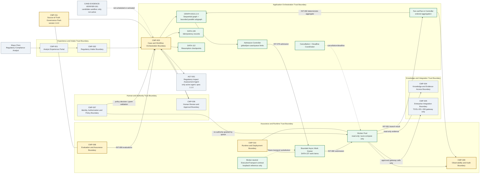

# 03 — Architecture Baseline (Reconstructed 1.6.0 Overlay)

## Retained baseline

All S06C components, one active `AGT-001`, canonical `DATA-091`–`105`, `INT-063`–`078`, gateway-only `TOOL-001`–`006`, human authority, memory boundaries and protocol restrictions remain.

## Versioned change

- `GRAPH-001` advances from `1.1.0` to `1.2.0` through `ADR-056` and `ADR-057`.
- The graph remains sequential by default and adds one bounded parallel subgraph for independent immutable read-only/pure-compute branches.
- `AGT-001-spec 1.1.0` is unchanged.
- `CMP-003`, `008`, `009`, `010` and `011` gain the responsibilities described in the Stage 7A chapter.

## Invariants

- exactly one active `AGT-001`;
- no concurrent protected-state writes;
- no worker-owned route, approval, finalization, authority or system termination;
- `CMP-003` performs one state transition after deterministic fan-in;
- `CMP-007` validates authority;
- `CMP-005` remains the tool gateway;
- sequential fallback remains available.

## Cumulative architecture

