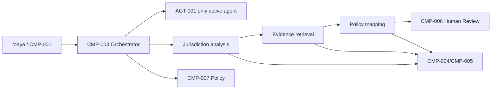
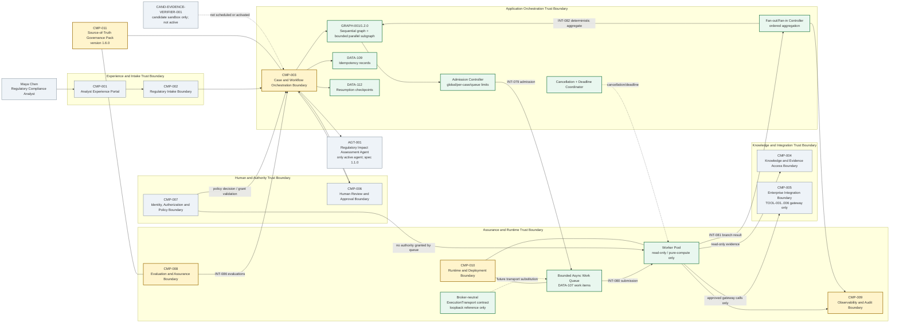
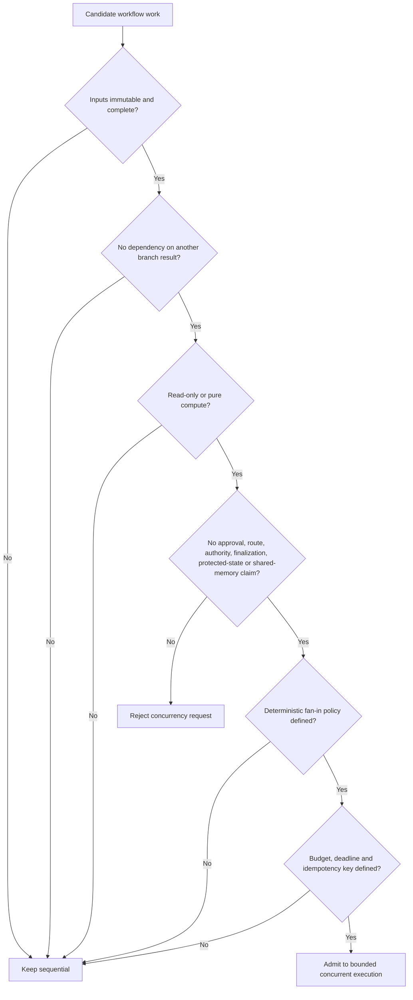
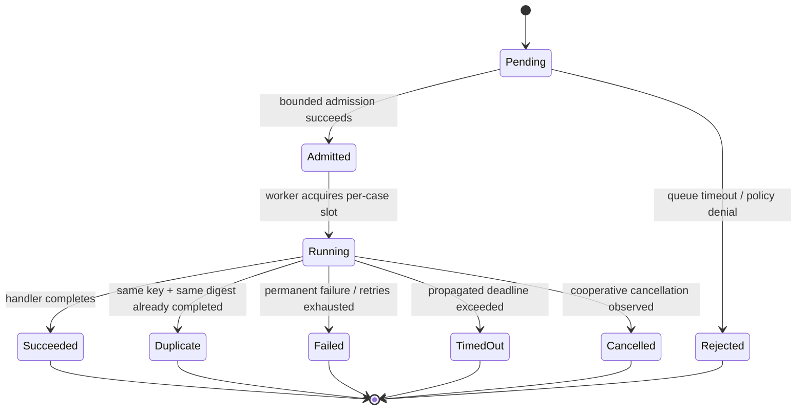

# Stage 7A — Concurrency and Distributed Execution

**Stage identifier:** `S07A`  
**Architecture version:** `1.6.0`  
**Repository version:** `1.6.0`  
**Completion date:** 2026-08-01  
**Scope boundary:** bounded concurrency and distributed-execution contracts only; no later performance, inference, evaluation, security-control-plane or production-deployment stage is generated.

> **Reconstruction note — ISS-088.** The execution used the supplied S06C Stage Handoff Pack, the approved narrative master prompt, the continuation controller and the known mounted project sources. The nine full S06C cumulative registers were not separately attached. This stage therefore creates a compatible `1.6.0` reconstruction overlay: every S06C item explicitly named in the handoff is retained, new identifiers are appended, and omitted historical rows are not invented. A future merge with the complete `1.5.0` registers must verify that the high-range requirements allocated here do not collide.

## 1. Context Carried Forward

NorthStar Financial Services enters this stage with a bounded, one-agent architecture. `AGT-001 Regulatory Impact Assessment Agent` remains the only active agent. It operates through the accepted graph, harness, gateway, budget, recovery, human-approval, memory, handoff, lifecycle and interoperability controls established through S06C. `CMP-003 Case and Workflow Orchestration Boundary` is the sole owner of task lifecycle, routes, state transitions, cancellation, aggregation and system termination. `CMP-007 Identity, Authorization and Policy Boundary` is the sole delegated-authority issuer. `CMP-006 Human Review and Approval Boundary` retains approval and final-accountability authority. `TOOL-001`–`006` remain gateway-only through `CMP-005`.

S06C added canonical protocol profiles, capability advertisement, exact version negotiation, semantic-loss evidence, a synchronous loopback HTTP/JSON handoff, MCP tool/resource mapping and A2A lifecycle mapping. It intentionally did **not** add concurrency, automatic redelivery, ordering, deduplication, backpressure, streaming, shared state or peer delegation. The handoff’s unresolved problem is therefore precise: NorthStar can preserve meaning across one serialized boundary but cannot execute independent work at the same time or recover it as independently scheduled work.

The user’s instruction names this work `Stage 7A`; the S06C handoff’s reusable prompt called the same scope `Stage 6D`. `ISS-089` records the label divergence. The explicit current instruction is authoritative, so the architecture advances as `S07A` without changing the technical scope.

### Artefacts modified

- All ten cumulative source-of-truth artefacts are advanced through reconstructed `1.6.0` overlays.
- `GRAPH-001` advances from `1.1.0` to `1.2.0`; the identifier is preserved.
- `AGT-001-spec 1.1.0` remains unchanged because concurrency is an orchestration/runtime capability, not new agent authority.
- `DATA-106`–`113`, `INT-079`–`086`, `ADR-056`–`061`, `EVAL-079`–`088`, `TEST-361`–`407`, `RSK-180`–`203`, `ASM-058`–`064` and `ISS-088`–`095` are added.

## 2. Narrative Development

Maya Chen opens a regulatory-change case covering a cross-border supervisory publication. The obligations have already been extracted and frozen as an immutable evidence package. Three analyses can now proceed independently: Canadian jurisdiction applicability, United States jurisdiction applicability and retrieval of candidate internal policies. Under S06C, `CMP-003` invokes them one after another even though none consumes another’s output. Each step spends most of its time waiting for a read-only boundary.

Elena Petrov measures the demonstration. Four simulated 50-millisecond I/O waits take approximately 200 milliseconds sequentially. Priya Raman sees an obvious latency opportunity, but Marcus Green rejects “just call `asyncio.gather`” as an architecture decision. Unbounded task creation could flood the evidence store, duplicate tool calls, obscure cancellation, race on state and allow one large case to starve all others. Sofia Alvarez adds a governance concern: parallel branches must not become shadow agents or gain approval, routing or finalization authority.

Priya reframes the requirement. NorthStar does not need “more autonomous agents.” It needs a controlled execution capability beneath the existing graph: prove that work is independent, admit it under hard limits, execute only read-only or pure-compute branches, aggregate results deterministically and commit one authoritative state transition after fan-in.

## 3. Problem Being Solved

The architecture must reduce avoidable wall-clock latency and prepare for independently scheduled work without weakening accepted owners or claiming delivery guarantees it does not possess.

The concrete problems are:

1. **Sequential wait amplification.** Independent I/O waits accumulate unnecessarily.
2. **Unbounded concurrency risk.** Raw task spawning can exhaust connections, rate limits, tokens, memory or cost budgets.
3. **Duplicate execution.** Retries, redelivery or caller repetition may execute the same branch more than once.
4. **Completion-order nondeterminism.** A faster branch may arrive first even when business ordering is fixed.
5. **Cancellation races.** A result may complete while cancellation is propagating.
6. **Partial failure.** One branch may fail while others succeed; the fan-in policy must be explicit.
7. **Resumption.** Completed work should not be repeated after a coordinator restart.
8. **Authority drift.** A queue, worker or protocol adapter must not become a route, approval, state or termination owner.
9. **Fairness and backpressure.** One case must not monopolize the runtime, and overload must produce typed evidence.
10. **Production portability.** The execution contract should migrate to a broker or durable workflow engine later without changing canonical NorthStar semantics.

## 4. Requirements Introduced or Updated

Because the complete S06C Requirements Register was not attached, Stage 7A allocates a high, non-overlapping reconstruction range. `ISS-088` requires collision checking during merge.

| ID | Requirement | Acceptance evidence |
|---|---|---|
| `FR-201` | `CMP-003` shall classify branch independence before concurrent admission. | Eligibility decision tree; `ADR-057`; security tests. |
| `FR-202` | The runtime shall execute eligible branches with bounded global and per-case concurrency. | `DATA-106`; `TEST-378`, `TEST-403`–`405`. |
| `FR-203` | Fan-in shall aggregate by declared ordinal, not completion order. | `DATA-110`; `TEST-379`; `EVAL-080`. |
| `FR-204` | Admission shall enforce finite queue capacity and timeout. | `INT-079`; `ADR-058`; queue-health telemetry. |
| `FR-205` | Every work item shall carry an input digest and idempotency key. | `DATA-107`; `TEST-361`–`374`; `EVAL-081`. |
| `FR-206` | Retry shall apply only to typed transient failures on concurrency-eligible work. | `ADR-059`; `TEST-380`–`382`; `EVAL-082`. |
| `FR-207` | Cancellation shall propagate cooperatively to branch work. | `DATA-111`; `INT-084`; `TEST-387`–`388`. |
| `FR-208` | Branches shall have propagated deadlines and typed timeout results. | `DATA-107`; `TEST-383`. |
| `FR-209` | Terminal branch state shall be checkpointed and incomplete work resumable. | `DATA-112`; `INT-085`; `TEST-375`–`377`, `390`, `407`. |
| `FR-210` | Fan-in shall support all-required, minimum-successes and first-satisfactory policies. | `DATA-110`; `TEST-385`–`387`. |
| `FR-211` | A feature switch shall retain sequential execution as a safe fallback. | `DATA-106`; `TEST-389`. |
| `FR-212` | Queue, worker, duplicate, attempt, timeout and cancellation evidence shall be observable. | `DATA-108`, `113`; `INT-086`; evaluation report. |
| `FR-213` | Execution shall be mediated by a broker-neutral transport contract. | Repository interface boundary and migration notes; no production broker claim. |
| `FR-214` | Concurrent branches shall not approve, finalize, route, grant authority, create agents, mutate protected state, terminate the system or write shared memory. | `ADR-057`; `TEST-393`–`400`; `EVAL-085`, `088`. |

| ID | Non-functional requirement | Stage target |
|---|---|---|
| `NFR-201` | Preserve exactly one active `AGT-001`. | Mandatory invariant. |
| `NFR-202` | Preserve `CMP-003`, `CMP-006` and `CMP-007` ownership. | Mandatory invariant. |
| `NFR-203` | No unbounded work queue or task creation. | Configured finite limits. |
| `NFR-204` | Deterministic outputs for identical branch records. | Canonical sorting and SHA-256 aggregate digest. |
| `NFR-205` | Do not claim exactly-once execution or side effects. | Explicit limitation and ADR. |
| `NFR-206` | Local reference must run on Python `>=3.11,<3.15` with standard-library runtime dependencies. | Tested on Python 3.13.5. |
| `NFR-207` | Concurrency overhead must be measurable and disable-able. | Benchmark script and policy flag. |
| `NFR-208` | Sensitive payloads must not be copied into queue telemetry by default. | Metadata-focused records and redaction requirement. |
| `NFR-209` | Per-case limits shall prevent one case from consuming all workers. | `DATA-106` and pool semaphore. |
| `NFR-210` | Retry delays shall use bounded exponential backoff with jitter. | Runtime implementation and `ADR-059`. |
| `NFR-211` | Checkpoint writes shall be atomic in the local reference. | Temporary-file replace implementation. |
| `NFR-212` | Production transport substitution shall not change canonical `DATA-091`–`105` handoff semantics. | Compatibility constraint. |

## 5. Conceptual Explanation

### 5.1 Concurrency, parallelism and distribution

**Concurrency** means multiple units of work are in progress during overlapping time intervals. An event loop can make progress on many I/O-bound operations in one thread by switching when a task waits. **Parallelism** means work is physically executing at the same instant, for example on multiple CPU cores or workers. **Distributed execution** means work may run in separate processes or hosts and therefore must tolerate network boundaries, redelivery, partial failure and independently failing clocks or workers.

NorthStar’s immediate bottleneck is I/O waiting, so the smallest viable mechanism is asynchronous concurrency. The architecture nevertheless treats each branch as a serialized work item with an idempotency key, deadline and checkpoint so that the same contract can later cross a process or broker boundary.

### 5.2 Three concurrency levels

1. **Concurrent user requests.** Multiple analysts or batch jobs run separate cases. Global admission and per-case fairness are required.
2. **Concurrent branches within one workflow.** Independent jurisdiction, evidence or policy analyses run together and fan in before the next authoritative state transition.
3. **Concurrent agents.** Multiple active agents reason or act at the same time. This stage does **not** add that capability; there is still exactly one active `AGT-001`.

### 5.3 Fan-out and fan-in

Fan-out converts one graph step into several independent branch work items. Fan-in waits according to an explicit policy, normalizes terminal records, orders them by declared ordinal and produces one `DATA-110 FanInAggregationRecord`. Only `CMP-003` uses that aggregate to advance protected workflow state.

### 5.4 Backpressure and admission control

Backpressure prevents producers from creating work faster than the runtime or dependencies can safely consume it. Stage 7A uses three limits:

- a **global worker ceiling**;
- a **per-case worker ceiling**;
- a **finite queue capacity with timed admission**.

When admission times out, the system records a typed `BACKPRESSURE_REJECTION`. It does not silently drop work and does not allocate unlimited memory.

### 5.5 Idempotency and duplicate suppression

An idempotency key identifies the logical work; an input digest proves what canonical input that key represents. Same key plus same digest may reuse a terminal result. Same key plus a different digest is a conflict and fails closed. This is necessary for at-least-once-ready processing, but it is not an exactly-once guarantee. A worker can still execute an external side effect and fail before recording completion. Therefore Stage 7A permits only read-only and pure-compute concurrent branches.

### 5.6 Ordering and consistency

Completion order is operational noise. Business aggregation order is declared in `BranchSpec.ordinal`. Fan-in sorts by ordinal, records missing, failed and cancelled branches and creates an aggregate digest. Shared mutable state is avoided; each branch receives immutable input and returns a typed result. One authoritative state transition occurs after aggregation.

### 5.7 Cancellation and deadlines

Cancellation is cooperative. `CMP-003` sets a cancellation event; handlers check it at safe points and terminate with a typed status. Deadlines are absolute timestamps propagated in `DATA-107`, avoiding a fresh timeout budget at each hop. Cancellation has no approval effect and does not change the system-termination owner.

### 5.8 Resumption

The local reference atomically stores each branch’s running and terminal state. On resumption, completed or duplicate branches are retained and only incomplete branches are resubmitted. Production distributed execution will need leases or heartbeats to distinguish a slow worker from a dead one; Stage 7A records that as a limitation rather than inventing a guarantee.

## 6. When This Capability Is Required

Concurrency is justified when all of the following hold:

- branch inputs are complete and immutable;
- one branch does not consume another’s result;
- branches are read-only or pure computation;
- a deterministic fan-in policy exists;
- each branch has a deadline and idempotency key;
- downstream rate limits and budgets can support overlap;
- wall-clock latency matters enough to justify additional failure states;
- the orchestrator can contain partial failure and cancellation.

NorthStar examples include:

- jurisdiction analysis for Canada, the United States and Europe after obligation extraction is frozen;
- retrieval from independent, access-filtered evidence collections;
- policy mapping across independent business units using immutable snapshots;
- deterministic validation rules over separate artefacts;
- independent candidate retrieval strategies where the first result meeting a deterministic quality threshold can cancel slower alternatives.

## 7. When It Is Not Required

Sequential execution remains preferable when:

- a later step depends on an earlier result;
- work mutates protected case state;
- a tool produces a financial, legal, administrative or irreversible side effect;
- human approval or separation of duties is involved;
- a dependency has a strict low rate limit;
- the workload is tiny and orchestration overhead exceeds the saved wait;
- deterministic ordering cannot be separated from completion order;
- retries cannot be made safe;
- one branch changes the authorization scope needed by another;
- the result must be explained as one coherent reasoning process rather than independently verifiable subtasks.

> **Common anti-pattern:** Parallelizing every tool call because the SDK supports it. Capability is not justification. The independence proof, state boundary and failure policy matter more than syntax.

## 8. Architecture Options

### Option A — Preserve fully sequential execution

The current graph invokes every node serially. This is easiest to reason about and remains the fallback. It is appropriate for dependencies, writes and low-volume workflows, but wastes time when independent operations wait on external systems.

### Option B — Unbounded coroutine fan-out

The orchestrator creates an async task for every branch and waits with a convenience primitive. This is a useful demonstration but not an acceptable architecture: there is no global admission, fairness, queue bound, typed rejection or reusable worker contract.

### Option C — Bounded in-process asynchronous worker pool

A finite queue feeds a fixed number of workers. Per-case semaphores constrain noisy cases. Work items are typed and checkpointed. This is inexpensive, local and suitable for I/O-bound reference workloads, but process loss can still interrupt in-flight work and the idempotency store is not durable across hosts.

### Option D — Thread or process pool

Threads can wrap blocking libraries; processes can use multiple cores and isolate CPU-heavy work. Both add serialization, cancellation and lifecycle complexity. NorthStar does not yet have a CPU-bound bottleneck that justifies making them the default.

### Option E — External task queue and distributed workers

A broker decouples scheduling from execution, enables independent worker scaling and supports durable backlog. It also introduces at-least-once delivery, visibility or acknowledgement semantics, poison messages, dead-letter handling, network identity, operational infrastructure and cross-service tracing.

### Option F — Durable workflow engine

A durable workflow engine records event history and reconstructs workflow state across failures. It is attractive for long-running regulatory cases, but adoption affects programming constraints, deployment, history size, determinism, migration and platform operations. NorthStar already has custom checkpoint semantics; a full engine decision requires production SLO and operating-model evidence.

### Option G — Event bus or streaming platform

An event log supports high-throughput streams and independent consumers. It is not automatically a task queue and does not by itself define request/reply, cancellation, fan-in, idempotency or protected-state ownership. It is unnecessary for the local reference.

## 9. Decision Matrix

Scores are relative for this stage: 1 = weak, 5 = strong. A high score is not a universal recommendation.

| Criterion | Sequential | Unbounded async | Bounded async pool | Thread/process pool | Broker + workers | Durable workflow engine |
|---|---:|---:|---:|---:|---:|---:|
| Local simplicity | 5 | 4 | 4 | 3 | 1 | 1 |
| I/O latency reduction | 1 | 5 | 5 | 4 | 5 | 4 |
| Backpressure | 5 by serialization | 1 | 4 | 3 | 5 | 5 |
| Cross-host durability | 1 | 1 | 1 | 1 | 4 | 5 |
| Deterministic resumption | 2 | 1 | 3 | 2 | 3 | 5 |
| Operational burden | 5 | 4 | 4 | 3 | 2 | 1 |
| Authority-boundary clarity | 5 | 2 | 5 | 4 | 4 | 4 |
| Production scale | 2 | 2 | 3 | 3 | 5 | 5 |
| Fit for current evidence | 3 | 2 | 5 | 2 | 3 | 2 |
| Migration path | 3 | 2 | 5 | 3 | 5 | 4 |

## 10. Selected Architecture and Rationale

NorthStar selects a **phased bounded-execution architecture**:

1. **Default:** keep `GRAPH-001` sequential unless branch independence is proven.
2. **Reference implementation:** use a bounded in-process `asyncio` queue and worker pool under `CMP-003`/`CMP-010`.
3. **Eligibility:** admit only read-only or pure-compute work over immutable inputs.
4. **Control:** apply global, per-case and queue limits, propagated deadlines and typed backpressure rejection.
5. **Reliability:** attach input digests and idempotency keys, retry only typed transient failures, checkpoint branch state and resume incomplete work.
6. **Aggregation:** sort by declared ordinal and apply an explicit all-required, minimum-successes or first-satisfactory policy.
7. **Portability:** keep a broker-neutral execution-transport seam, but do not choose or claim a production broker in this stage.

This design gives NorthStar measurable latency reduction without activating another agent, transferring authority, creating shared mutable state or committing prematurely to a production platform.

## 11. Architecture Before the Change



Every branch passes through the correct boundaries, but independent waiting time accumulates. There is no admission controller, work queue, idempotency store, deterministic fan-in record or branch-level resumption.

## 12. Architecture After the Change



### Architectural changes

- `CMP-003` now contains an eligibility gate, admission controller, fan-out/fan-in controller and cancellation/deadline coordinator.
- `GRAPH-001/1.2.0` adds one bounded parallel subgraph after immutable obligation extraction and before the single protected-state transition.
- `CMP-010` hosts a bounded queue and worker pool.
- `DATA-109` and `DATA-112` provide idempotency and checkpoint evidence.
- `CMP-008` gains concurrency evaluations; `CMP-009` gains queue and branch telemetry.
- No new `AGT-*` identifier is created. The candidate evidence-verification endpoint remains sandbox-only and unscheduled.

## 13. Detailed Component Design

### 13.1 `CMP-003` eligibility gate

The gate answers six questions:

1. Are inputs immutable and complete?
2. Is the branch independent of sibling results?
3. Is the work read-only or pure computation?
4. Does it request no prohibited authority?
5. Is a deterministic fan-in policy defined?
6. Are budget, deadline and idempotency fields present?



Failure to prove eligibility does not fail the case. It keeps the step sequential. A prohibited authority claim fails closed.

### 13.2 Admission controller

`INT-079 Work Admission` validates `DATA-107`, then waits for finite queue capacity for at most the configured admission timeout. The policy’s reference defaults are:

```json
{
  "policy_id": "CONC-POL-001",
  "version": "1.0.0",
  "enabled": true,
  "default_mode": "sequential_unless_independence_proven",
  "global_limit": 8,
  "per_case_limit": 4,
  "queue_capacity": 32,
  "admission_timeout_seconds": 0.25,
  "branch_timeout_seconds": 2.0,
  "max_attempts": 3,
  "base_backoff_seconds": 0.01,
  "max_backoff_seconds": 0.1,
  "jitter_ratio": 0.1,
  "allowed_work_kinds": [
    "read_only",
    "pure_compute"
  ],
  "prohibited_concurrent_claims": [
    "approve",
    "finalize",
    "route_case",
    "mutate_protected_state",
    "grant_authority",
    "create_agent",
    "terminate_system",
    "write_shared_memory"
  ],
  "owners": {
    "orchestration": "CMP-003",
    "runtime": "CMP-010",
    "authority": "CMP-007",
    "evaluation": "CMP-008",
    "telemetry": "CMP-009"
  }
}
```

The limits are configuration, not universal constants. The next workload-engineering stage must derive them from measured arrival rates, service times, token usage, dependency quotas and latency objectives.

### 13.3 Bounded queue and worker pool

The queue’s `maxsize` is the immediate backpressure mechanism. A fixed worker count supplies the global concurrency ceiling. A per-case semaphore prevents one case from consuming every worker. Workers do not own routes or state; they return `DATA-108` records to `CMP-003`.

### 13.4 Idempotency coordinator

The local store synchronizes same-key execution inside one runtime:

- no entry: caller becomes the owner and executes;
- same key, same digest, running: duplicate waits;
- same key, same digest, succeeded: duplicate reuses output;
- same key, different digest: fail closed with `IdempotencyConflict`;
- failed owner: duplicates observe the same failure.

A production store must be durable and transactional. Broker-native deduplication may help but does not replace application idempotency.

### 13.5 Retry controller

Only `TransientBranchError` is retryable. Permanent validation, authorization or business errors are not retried. Backoff is exponential, capped and jittered. The branch’s absolute deadline bounds the total retry time. The reference uses deterministic jitter seeding so tests remain reproducible; production can use cryptographically irrelevant random jitter because the value is operational, not security-sensitive.

### 13.6 Fan-in controller

Three policies are implemented:

- **all-required:** every required branch must succeed or be an accepted duplicate;
- **minimum-successes:** the aggregate can be complete with explicit partial evidence;
- **first-satisfactory:** the first result meeting a deterministic predicate becomes the winner and cooperatively cancels remaining work.

A model-generated confidence score alone is not a sufficient predicate. The predicate must be approved, measurable and auditable.

### 13.7 Cancellation and deadline coordinator



Cancellation is a branch-execution instruction, not a case decision. A late success may race with cancellation; the terminal record and fan-in policy determine how it is treated. `CMP-003` remains the only system-termination owner.

### 13.8 Checkpoint and resumption coordinator

The local JSON store writes through a temporary file and atomic replace. It records running and terminal branch records. Resumption loads the checkpoint, retains successful or duplicate records and schedules only incomplete branch IDs. The aggregate is rebuilt deterministically.

### 13.9 Broker-neutral execution transport

The code separates work-envelope construction, admission, execution and result aggregation. A future transport can serialize `DATA-107` and return `DATA-108` without changing `DATA-091`–`105` canonical handoff semantics. A production transport must additionally define:

- workload identity and proof of possession;
- message authenticity and confidentiality;
- acknowledgement or visibility leases;
- retry and dead-letter policy;
- durable idempotency;
- per-tenant fairness;
- ordering scope;
- worker heartbeat and lease expiry;
- cross-service tracing;
- payload encryption and data residency;
- schema registry and compatibility gates.

Those are designed as requirements but not falsely described as implemented.

## 14. Data, State and Interface Design

### 14.1 New data objects

| ID | Name | Owner | Purpose |
|---|---|---|---|
| `DATA-106` | `ConcurrencyExecutionPolicy` | `CMP-003` with governance in `CMP-011` | Limits, timeouts, retry bounds, allowed work kinds and owner assertions. |
| `DATA-107` | `WorkItemEnvelope` | Created by `CMP-003`; consumed by `CMP-010` | Immutable branch input, identity, digest, key, deadline, work kind and authority claims. |
| `DATA-108` | `BranchExecutionRecord` | `CMP-010`; accepted by `CMP-003` | Attempt, worker, status, output/error and timing evidence. |
| `DATA-109` | `IdempotencyRecord` | `CMP-003` reference store | Logical-work identity, digest and terminal reuse state. |
| `DATA-110` | `FanInAggregationRecord` | `CMP-003` | Ordered branch list, success/failure/cancellation sets, completion and aggregate digest. |
| `DATA-111` | `CancellationRecord` | `CMP-003` | Scope, reason and explicit absence of approval effect. |
| `DATA-112` | `ResumptionCheckpoint` | `CMP-003`/`CMP-010` | Durable local branch records for deterministic resumption. |
| `DATA-113` | `QueueHealthSnapshot` | `CMP-009` | Queue depth, active workers, limits, admissions, rejections, completions and duplicates. |

### 14.2 State ownership

- `DATA-081 case_working` is still not transferred to workers.
- A branch receives only the minimum immutable payload required for its task.
- Branch output is provisional evidence, not protected case state.
- Fan-in creates one aggregate; `CMP-003` performs one authoritative graph transition.
- No shared-agent memory or automatic memory transfer is introduced.
- Cancellation, timeout and retry records do not change human approval state.

### 14.3 New interfaces

| ID | Contract | Key rule |
|---|---|---|
| `INT-079` | Work Admission | Enforce policy, queue capacity and admission deadline. |
| `INT-080` | Branch Submission | Carry valid `DATA-107`; no authority allocation. |
| `INT-081` | Branch Result | Return typed `DATA-108`; result is provisional. |
| `INT-082` | Fan-in Aggregation | Order by ordinal and apply explicit policy. |
| `INT-083` | Idempotency and Deduplication | Same key/digest may reuse; conflict fails closed. |
| `INT-084` | Cancellation and Deadline Propagation | Cooperative branch scope; no approval or termination transfer. |
| `INT-085` | Checkpoint and Resumption | Persist branch states and resubmit incomplete work only. |
| `INT-086` | Concurrency Telemetry and Evaluation | Emit bounded metrics and assurance results. |

### 14.4 Interface sequence

```mermaid
sequenceDiagram
    autonumber
    participant Maya as CMP-001 / Maya
    participant Orch as CMP-003 Orchestrator
    participant Policy as CMP-007 Policy Boundary
    participant Admit as Admission Controller
    participant Queue as Bounded Queue
    participant W1 as CMP-010 Worker 1
    participant W2 as CMP-010 Worker 2
    participant Know as CMP-004/CMP-005 Read Boundaries
    participant Idem as DATA-109 Idempotency Store
    participant CP as DATA-112 Checkpoint Store
    participant FanIn as Fan-in Controller
    participant Audit as CMP-009

    Maya->>Orch: Resume CASE / run GRAPH-001 1.2.0
    Orch->>Orch: Prove branch independence and immutable inputs
    Orch->>Policy: Validate grant, work kind and prohibited claims
    Policy-->>Orch: Allowed: read_only / pure_compute
    Orch->>Admit: Submit DATA-107 work envelopes
    Admit->>Queue: Timed bounded admission
    par Independent branch A
      Queue->>W1: Deliver work item
      W1->>Idem: Reserve idempotency key
      W1->>CP: Record running state
      W1->>Know: Read immutable evidence snapshot
      Know-->>W1: Typed result
      W1->>Idem: Complete result
      W1->>CP: Record terminal state
      W1-->>FanIn: DATA-108 result
    and Independent branch B
      Queue->>W2: Deliver work item
      W2->>Idem: Reserve idempotency key
      W2->>CP: Record running state
      W2->>Know: Read immutable policy/control snapshot
      Know-->>W2: Typed result
      W2->>Idem: Complete result
      W2->>CP: Record terminal state
      W2-->>FanIn: DATA-108 result
    end
    FanIn->>FanIn: Sort by declared ordinal, apply aggregation policy
    FanIn->>Audit: Emit DATA-110 aggregate and queue metrics
    FanIn-->>Orch: Deterministic aggregate; no protected-state mutation
    Orch->>Orch: Single authoritative state transition
    Orch-->>Maya: Preliminary evidence-backed assessment

```

## 15. Implementation

### 15.1 Repository module

The implementation is in `src/northstar_compliance/concurrency/`:

- `models.py` — typed policy, branch, envelope, result, aggregation, cancellation and checkpoint models;
- `errors.py` — typed admission, authority, idempotency, transient and permanent errors;
- `idempotency.py` — duplicate-suppression reference store;
- `checkpoints.py` — atomic local JSON checkpoint store;
- `execution.py` — worker pool, admission, retry, cancellation, fan-out/fan-in and resumption;
- `fixtures.py` — deterministic NorthStar jurisdiction, evidence, mapping and failure handlers;
- `evaluation.py` — `EVAL-079`–`088`.

### 15.2 Framework-independent execution algorithm

```text
receive immutable branch specifications
for each specification:
    prove independence and allowed work kind
    validate prohibited authority claims are absent
    derive canonical input digest and idempotency key
    propagate absolute deadline
    attempt timed admission to bounded queue

workers:
    enforce per-case concurrency limit
    checkpoint running state
    reserve idempotency key
    execute with deadline
    retry typed transient failures with bounded backoff and jitter
    observe cooperative cancellation
    checkpoint terminal result

fan-in:
    wait according to explicit aggregation policy
    sort records by declared ordinal
    record successes, failures, timeouts, rejections and cancellations
    create aggregate digest
    return provisional aggregate to CMP-003

CMP-003:
    validate aggregate
    perform one authoritative state transition
    preserve human approval and finalization boundaries
```

### 15.3 Key Python excerpt

```python
async def run_fanout(...):
    for spec in sorted(specs, key=lambda item: item.ordinal):
        envelope = make_envelope(spec)
        future = await pool.submit(envelope, cancellation_event)
        futures.append(future)

    records = await asyncio.gather(*futures)
    records.sort(key=lambda record: record.ordinal)
    return records, aggregate(records, policy)
```

The repository contains the complete implementation, including validation, retry, duplicate suppression, cancellation and resumption. The excerpt is intentionally smaller than the implementation so that the architecture remains readable.

### 15.4 Run commands

```bash
cd northstar-agentic-compliance-stage7a
python -m venv .venv
. .venv/bin/activate
python -m pip install -e '.[dev]'
pytest -q
PYTHONPATH=src python scripts/run_stage7a_demo.py
PYTHONPATH=src python scripts/run_stage7a_evaluation.py
PYTHONPATH=src python scripts/benchmark_stage7a.py
PYTHONPATH=src python scripts/validate_stage7a.py
PYTHONPATH=src python scripts/consistency_audit_stage7a.py
```

### 15.5 Expected result

- all 47 Stage 7A pytest cases pass;
- all ten Stage 7A evaluations pass;
- the demonstration returns four successful branch records and one complete ordered aggregate;
- the local I/O-wait benchmark shows concurrent execution materially faster than sequential execution, while explicitly disclaiming production significance;
- validation and consistency audit pass with reconstruction and production exceptions.

## 16. Code and Repository Changes

### Files added

```text
config/concurrency/policy.json
schemas/DATA-106.schema.json ... DATA-113.schema.json
src/northstar_compliance/concurrency/
  __init__.py
  errors.py
  models.py
  idempotency.py
  checkpoints.py
  execution.py
  fixtures.py
  evaluation.py
scripts/run_stage7a_demo.py
scripts/run_stage7a_evaluation.py
scripts/benchmark_stage7a.py
scripts/validate_stage7a.py
scripts/consistency_audit_stage7a.py
tests/unit/test_models.py
tests/unit/test_idempotency.py
tests/unit/test_checkpoints.py
tests/integration/test_execution.py
tests/security/test_authority.py
tests/evaluation/test_evaluations.py
tests/performance/test_bounds.py
docs/adr/ADR-056.md ... ADR-061.md
docs/architecture/diagrams/stage7a-*.mmd
docs/source-of-truth/00-Project-Constitution.md ... 09-Stage-Handoff-Pack.md
docs/stages/Stage-7A-Concurrency-and-Distributed-Execution.md
reports/demo-output.json
reports/evaluation-report.json
reports/benchmark-report.json
reports/test-report.txt
reports/consistency-audit-report.json
```

### Files logically modified from the S06C baseline

- `GRAPH-001` definition advances to `1.2.0`.
- `CMP-003`, `CMP-008`, `CMP-009`, `CMP-010` and `CMP-011` responsibilities are extended.
- The cumulative architecture diagram, ADR register, data register, interface catalogue, repository manifest, risk register and handoff pack advance to `1.6.0`.

### Files retired

None.

### Compatibility notes

- `AGT-001-spec 1.1.0` remains unchanged.
- `DATA-009 1.1.0`, `DATA-091`–`105`, `INT-063`–`078` and `TOOL-001`–`006` remain authoritative.
- Runtime dependencies remain standard library; pytest is development-only.
- Python target remains `>=3.11,<3.15`; the package was executed on Python 3.13.5 with pytest 9.0.2.

## 17. Security and Governance Implications

### 17.1 Security boundaries preserved

- Queue messages do not grant authority.
- Worker identity is not a substitute for a `CMP-007` authorization decision.
- `CMP-005` remains the only gateway for tools.
- A worker cannot call `TOOL-001`–`006` outside approved gateway policy.
- Human approval remains external and typed; timeout never approves.
- Protocol capability advertisement remains non-authoritative.
- `CAND-EVIDENCE-VERIFIER-001` is not activated or scheduled.

### 17.2 New threat surface

Concurrency introduces:

- queue flooding and resource exhaustion;
- duplicate or replayed work items;
- stale authorization during long execution;
- cross-case starvation;
- cancellation abuse;
- payload leakage through queue or trace metadata;
- result substitution or branch spoofing;
- retry amplification;
- checkpoint tampering;
- worker impersonation in a future distributed deployment.

### 17.3 Controls

- finite queue, global and per-case limits;
- canonical digest and idempotency conflict detection;
- immutable inputs and no protected-state transfer;
- deny-by-default work kinds and prohibited claims;
- absolute deadlines;
- typed attempts and terminal records;
- atomic local checkpoints;
- deterministic aggregation digest;
- redaction requirement for telemetry;
- production requirement for workload identity, mTLS or proof-of-possession, encryption, signed messages and durable policy checks.

### 17.4 Governance evidence

`CMP-011` stores the concurrency policy, ADRs, data schemas, tests, benchmark disclaimer and consistency audit. A change to limits, allowed work kinds, retry classes or aggregation policies is a governed configuration change and must trigger regression evaluation.

> **Governance requirement:** Adding `reversible_write` to the allowed concurrent work kinds is not a configuration-only change. It requires a new ADR, compensation semantics, transactional idempotency, conflict policy, expanded security testing and human-control review.

## 18. Performance, Concurrency and Cost Implications

### 18.1 Local benchmark

The included deterministic benchmark ran four independent 50-millisecond I/O-wait branches:

| Mode | Observed time |
|---|---:|
| Sequential fallback | 0.206445 s |
| Bounded concurrency | 0.053922 s |
| Observed local speedup | 3.829x |

This result proves only that the implementation overlaps simulated waiting. It is not a production SLO, throughput claim or cost benchmark. Real performance depends on service latency distributions, connection pools, model limits, ISL/OSL, tool quotas, queueing, retries and analyst arrival rates.

### 18.2 Latency model

For independent branches with durations `t1 ... tn`:

- sequential lower bound is approximately `sum(ti)` plus orchestration overhead;
- ideal concurrent lower bound is approximately `max(ti)` plus admission, scheduling and fan-in overhead;
- actual time is constrained by worker count, per-case limit, queue delay and downstream bottlenecks.

### 18.3 Throughput and queueing

Increasing concurrency can reduce one case’s latency while worsening system throughput if dependencies saturate. Queue depth, wait time, rejection rate and dependency latency must be observed together. A full capacity plan is deferred to the next workload-engineering stage.

### 18.4 Cost

Concurrency does not automatically reduce cost. It may:

- increase simultaneous model or tool requests;
- amplify retries;
- require more connections, workers and observability volume;
- reduce analyst waiting and case-cycle time;
- enable cancellation of losing alternatives;
- reduce duplicate work through idempotency.

Cost controls include a worker ceiling, per-case ceiling, queue capacity, retry cap, branch deadline, early cancellation and sequential fallback.

### 18.5 Fairness

The per-case semaphore is a simple fairness control. It prevents one case from using every worker but does not implement weighted priority or tenant-level fair scheduling. Production fairness must consider regulatory urgency, user role, jurisdictional deadlines and starvation risk without allowing a high-priority class to monopolize resources.

## 19. Evaluation and Test Cases

### 19.1 Evaluation suite

| ID | Objective | Result |
|---|---|---|
| `EVAL-079` | Independent branch eligibility | Passed |
| `EVAL-080` | Bounded deterministic fan-in | Passed |
| `EVAL-081` | Idempotent duplicate suppression | Passed |
| `EVAL-082` | Bounded retry and recovery | Passed |
| `EVAL-083` | Explicit partial-result policy | Passed |
| `EVAL-084` | Winner cancellation | Passed |
| `EVAL-085` | Authority and work-kind denial | Passed |
| `EVAL-086` | Durable local checkpoint evidence | Passed |
| `EVAL-087` | Worker and queue ceilings | Passed |
| `EVAL-088` | Exactly one active agent | Passed |

### 19.2 Test coverage

- `TEST-361`–`368`: canonical digests, keys and policy validation.
- `TEST-369`–`374`: idempotency ownership, concurrent duplicate waiting, conflict and failure replay.
- `TEST-375`–`377`: checkpoint round trip, missing run and ordinal ordering.
- `TEST-378`–`392`: fan-out latency, deterministic fan-in, retry, timeout, duplicate suppression, partial completion, cancellation, sequential fallback, resumption and queue health.
- `TEST-393`–`400`: denial of writes, approval, protected state, agent creation, shared memory and termination claims; allowed read-only branch.
- `TEST-401`–`402`: evaluation completeness and ID continuity.
- `TEST-403`–`407`: configured bounds, worker count, metrics and terminal checkpoint evidence.

**Executed result:** 47 pytest cases passed.

### 19.3 Additional production tests required

The local suite does not prove:

- multi-host network partitions;
- broker redelivery and dead-letter behavior;
- durable idempotency under database failover;
- stale grant revocation during execution;
- clock skew;
- worker heartbeat and lease expiry;
- payload encryption and tenant isolation;
- production throughput or queueing SLOs;
- disaster recovery and regional failover.

## 20. Failure Scenarios and Recovery

### Scenario 1 — Queue overload

**Event:** a batch intake submits work faster than workers can drain it.  
**Detection:** queue depth reaches capacity; admission timeout expires.  
**Containment:** reject new branch admission with `BACKPRESSURE_REJECTION`.  
**Recovery:** `CMP-003` keeps the case sequential, defers it or requests operator action according to policy.  
**Evidence:** `DATA-108` rejected record and `DATA-113` snapshot.  
**Residual risk:** repeated producer retries can create an admission storm; caller retry must also be bounded.

### Scenario 2 — Duplicate delivery

**Event:** the same branch is submitted twice with the same key and input.  
**Detection:** `DATA-109` already exists.  
**Containment:** one owner executes; duplicates wait or reuse the terminal result.  
**Recovery:** no second logical execution is needed.  
**Evidence:** duplicate status and key.  
**Residual risk:** exactly-once external side effects are not guaranteed; hence concurrent writes remain prohibited.

### Scenario 3 — Idempotency-key collision

**Event:** a caller reuses a key with different input.  
**Detection:** digest mismatch.  
**Containment:** fail closed with `IdempotencyConflict`; do not choose one payload.  
**Recovery:** correct the producer and issue a new logical key.  
**Governance implication:** collision may indicate a bug or tampering and should be security-visible.

### Scenario 4 — Transient evidence-store failure

**Event:** a read-only evidence request fails temporarily.  
**Detection:** typed `TransientBranchError`.  
**Containment:** retry within the branch deadline using bounded exponential backoff and jitter.  
**Recovery:** success returns one terminal record; exhausted retries return a typed failure.  
**Residual risk:** incorrectly classifying a permanent failure as transient amplifies load.

### Scenario 5 — Permanent schema or policy failure

**Event:** a branch payload is invalid or policy denies the work.  
**Detection:** permanent or authority error.  
**Containment:** no retry.  
**Recovery:** fan-in applies the selected partial/fail policy; human review may be required.  
**Evidence:** terminal error code and aggregate failure set.

### Scenario 6 — Cancellation race

**Event:** a first-satisfactory branch wins while another branch is about to finish.  
**Detection:** cancellation event and terminal records may cross.  
**Containment:** handlers check cancellation cooperatively; fan-in records actual terminal states.  
**Recovery:** the winner is determined by the approved predicate and completion observation, not by last writer.  
**Residual risk:** non-cancellable external calls may complete after cancellation; their result must not be committed automatically.

### Scenario 7 — Worker or coordinator interruption

```mermaid
sequenceDiagram
    autonumber
    participant Orch as CMP-003
    participant Queue as Bounded Queue
    participant Worker as CMP-010 Worker
    participant CP as DATA-112 Checkpoint
    participant Idem as DATA-109 Idempotency
    participant Audit as CMP-009

    Orch->>Queue: Submit branch B with key K
    Queue->>Worker: Deliver B
    Worker->>CP: B = running
    Worker->>Idem: Reserve K
    Worker-xWorker: Simulated crash / lost completion
    Note over Orch,Worker: Reference detects incomplete branch from checkpoint; production requires lease/heartbeat
    Orch->>CP: Load run checkpoint
    CP-->>Orch: A succeeded; B running/incomplete; C succeeded
    Orch->>Queue: Resubmit only B with same key K
    Queue->>Worker: Redeliver B
    Worker->>Idem: K state checked
    Worker->>Worker: Execute or reuse recorded terminal result
    Worker->>CP: B = succeeded / duplicate
    Worker->>Audit: Attempt and recovery evidence
    Worker-->>Orch: Terminal DATA-108
    Orch->>Orch: Deterministic fan-in; one authoritative state transition

```

The local reference can reload checkpoints and resubmit incomplete branch IDs. It cannot prove whether a remote worker is still running because it lacks leases and heartbeats. A production transport must define that ambiguity and rely on idempotency.

### Scenario 8 — Out-of-order completion

**Event:** branch ordinal 3 finishes before ordinal 1.  
**Detection:** completion timestamps differ from ordinals.  
**Containment:** fan-in sorts by declared ordinal.  
**Recovery:** aggregate digest is stable for the same terminal records.  
**Evidence:** ordered branch list in `DATA-110`.

### Scenario 9 — Noisy case starvation

**Event:** one complex case submits many branches.  
**Detection:** per-case active count reaches its limit.  
**Containment:** the case waits while other cases can use remaining workers.  
**Residual risk:** simple semaphore fairness is not a full priority scheduler.

### Scenario 10 — Unauthorized concurrent write

**Event:** a branch declares `irreversible_write` or requests `approve`, `route_case` or `mutate_protected_state`.  
**Detection:** work-kind and authority-claim validation.  
**Containment:** reject before handler use.  
**Recovery:** execute through the existing sequential, authorized, human-controlled path if legitimate.  
**Evidence:** `AUTHORITY_INVARIANT` terminal record.

## 21. Architecture Decision Records

- `ADR-056` — bounded asynchronous execution under existing owners.
- `ADR-057` — concurrency eligibility requires immutable read-only or pure-compute work; no concurrent protected-state writes.
- `ADR-058` — finite admission, queue and per-case backpressure.
- `ADR-059` — at-least-once-ready idempotency and duplicate suppression; no exactly-once claim.
- `ADR-060` — deterministic fan-in and explicit partial-result policies.
- `ADR-061` — cooperative cancellation, propagated deadlines and checkpoint resumption.

All six ADRs are included as standalone repository files and summarized in the cumulative ADR register.

## 22. Requirements Traceability Update

| Requirement | Architecture | Implementation | Controls | Tests/evaluations |
|---|---|---|---|---|
| `FR-201`, `214` | Eligibility gate in `CMP-003` | `_validate_authority`, `WorkKind` | deny-by-default claims | `TEST-393`–`400`, `EVAL-085`, `088` |
| `FR-202`, `204` | Bounded queue and workers in `CMP-010` | `BoundedAsyncWorkerPool` | global/per-case/capacity limits | `TEST-378`, `403`–`406`, `EVAL-087` |
| `FR-203`, `210` | Fan-in controller | `_aggregate` | declared ordinal and explicit policy | `TEST-379`, `385`–`387`, `EVAL-080`, `083`, `084` |
| `FR-205` | `DATA-109` | `InMemoryIdempotencyStore` | digest conflict denial | `TEST-369`–`374`, `384`, `EVAL-081` |
| `FR-206`, `208` | retry/deadline coordinator | producer retry loop | typed transient failures, cap, jitter | `TEST-380`–`383`, `EVAL-082` |
| `FR-207` | cancellation coordinator | cooperative event | no approval effect | `TEST-387`–`388`, `EVAL-084` |
| `FR-209` | `DATA-112` | `JsonCheckpointStore`, `resume_incomplete` | atomic replace, completed-work retention | `TEST-375`–`377`, `390`, `407`, `EVAL-086` |
| `FR-211` | policy switch | sequential fallback path | safe default | `TEST-389` |
| `FR-212` | `CMP-009`, `DATA-108`, `113` | health and reports | metadata minimization | `TEST-391`, `406` |
| `FR-213` | transport seam | envelope/result separation | canonical semantics remain above transport | structural validation and ADR review |

## 23. Stage Outcome

NorthStar can now:

- identify independent work without creating another agent;
- execute approved read-only or pure-compute branches concurrently;
- cap global, per-case and queued work;
- propagate deadlines and cooperative cancellation;
- retry typed transient failures with bounded backoff;
- suppress duplicate same-input work and reject key conflicts;
- aggregate deterministically under explicit policies;
- checkpoint branch states and resume incomplete work;
- preserve exactly one active `AGT-001`, application-owned state and routes, external human authority and gateway-only tools;
- expose a broker-neutral execution contract for later production substitution.

## 24. Known Limitations

- The runtime is an in-process bounded async worker pool, not a production distributed cluster.
- The queue and idempotency store are not durable across hosts.
- Checkpoints are local JSON, not a production transactional database or event history.
- There are no worker leases, heartbeats, visibility timeouts or dead-letter queues.
- There is no live IAM, OAuth, mTLS, DPoP, KMS, signed work item or non-repudiation.
- There is no broker SDK, service mesh, Kubernetes worker deployment or multi-region failover.
- Cancellation is cooperative and cannot force a blocked third-party call to stop.
- Exactly-once execution and side effects are not claimed.
- Concurrent writes, shared mutable state and shared agent memory remain prohibited.
- The reference uses deterministic fixture handlers, not live models or connectors.
- The benchmark is a local I/O-wait simulation, not a business or SLO benchmark.
- Full source-register merge is pending because only the S06C handoff, not all nine predecessor registers, was attached.

## 25. Narrative Bridge to the Next Stage

The bounded worker pool removes obvious sequential waiting, but Liam O’Connor cannot yet answer how many workers NorthStar should configure, whether the system is prefill-, decode-, retrieval- or tool-bound, or how concurrency interacts with long regulatory documents and multi-step agent runs. Four workers were safe in a local simulation; they are not a capacity plan.

NorthStar’s next architectural problem is therefore workload engineering: characterize input and output sequence-length distributions, tool and retrieval latency, number of graph steps, arrival rates, concurrent analysts and batch load; then derive realistic SLOs, benchmark scenarios and capacity limits. That problem belongs to the next stage and is not implemented here.

## 26. Updated Source-of-Truth Artefacts

The package includes reconstructed `1.6.0` overlays for:

1. `00-Project-Constitution.md`
2. `01-Business-and-User-Story-Baseline.md`
3. `02-Requirements-Register.md`
4. `03-Architecture-Baseline.md`
5. `04-Component-and-Agent-Catalogue.md`
6. `05-Data-and-Schema-Register.md`
7. `06-ADR-Register.md`
8. `07-Repository-Manifest.md`
9. `08-Risk-Assumption-and-Issue-Register.md`
10. `09-Stage-Handoff-Pack.md`

These files preserve every S06C item explicitly present in the handoff and append the Stage 7A changes. `ISS-088` prevents the overlay from being mistaken for a byte-for-byte update of unattached predecessor registers.

## 27. Stage Handoff Pack

The complete reusable handoff pack appears in `docs/source-of-truth/09-Stage-Handoff-Pack.md` and is reproduced below.

---

# Stage Handoff Pack

## A. Stage completed

- **Stage identifier:** `S07A`
- **Stage title:** Concurrency and Distributed Execution
- **Architecture version:** `1.6.0`
- **Repository version:** `1.6.0`
- **Handoff version:** `1.6.0`
- **Completion date:** 2026-08-01
- **Status:** Completed within local bounded-async worker-pool, broker-neutral contract and reconstruction-overlay limits.
- **Consistency audit:** Passed with recorded reconstruction and production exceptions.

## B. Capabilities now available

1. All accepted S06C controls and canonical interoperability semantics remain.
2. `GRAPH-001/1.2.0` can fan out proven-independent read-only or pure-compute branches and fan them in before one authoritative state transition.
3. `DATA-106` defines bounded global, per-case, queue, timeout, retry and work-kind policy.
4. `DATA-107` carries immutable work identity, digest, idempotency key, deadline and owner assertions.
5. A finite async queue and worker pool provide local I/O concurrency with backpressure.
6. `DATA-109` suppresses same-input duplicates and rejects key/digest conflicts.
7. Typed transient retry uses bounded exponential backoff and jitter; permanent and authority errors are not retried.
8. `DATA-110` records deterministic all-required, minimum-successes or first-satisfactory fan-in.
9. `DATA-111` and `INT-084` provide cooperative cancellation with no approval or termination transfer.
10. `DATA-112` supports atomic local checkpointing and incomplete-branch resumption.
11. `DATA-113` captures bounded queue/worker telemetry.
12. `TEST-361`–`407` and `EVAL-079`–`088` pass locally.

**Not implemented:** `AGT-002`; concurrent agents; concurrent protected-state or shared-memory writes; production broker/event bus/durable workflow engine; cross-host queue/idempotency/checkpoint database; leases/heartbeats/dead-letter queue; streaming/push; live IAM/PDP/KMS/mTLS/OAuth/DPoP; signed messages; live models/connectors; production load/SLO/cost benchmark; production audit/WORM; deployment/DR.

## C. Accepted architecture decisions

`ADR-001`–`055` remain accepted.

- `ADR-056`: bounded async execution under existing owners; sequential remains default.
- `ADR-057`: concurrency only for immutable read-only or pure-compute work; no concurrent protected-state writes.
- `ADR-058`: finite global, per-case and queue admission limits.
- `ADR-059`: canonical idempotency and bounded transient retry; no exactly-once claim.
- `ADR-060`: deterministic ordinal-based fan-in with explicit partial-result policies.
- `ADR-061`: cooperative cancellation, absolute deadlines and checkpoint resumption; CMP-003 remains termination owner.

## D. Current component inventory

| ID | Name | Current S07A responsibility/status |
|---|---|---|
| `CMP-001` | Analyst Experience Portal | Starts/resumes cases and surfaces branch/queue evidence. |
| `CMP-002` | Regulatory Intake Boundary | Unchanged provenance boundary. |
| `CMP-003` | Case and Workflow Orchestration Boundary | Sole task/route/state/cancellation/aggregation/system-termination owner; eligibility, admission, fan-out/fan-in, idempotency coordination and resumption. |
| `CMP-004` | Knowledge and Evidence Access Boundary | Authorized immutable evidence reads. |
| `CMP-005` | Enterprise Integration Boundary | Sole gateway for `TOOL-001`–`006`; no worker bypass. |
| `CMP-006` | Human Review and Approval Boundary | Unchanged external typed human authority. |
| `CMP-007` | Identity, Authorization and Policy Boundary | Sole grant issuer; queues/workers grant no authority. |
| `CMP-008` | Evaluation and Assurance Boundary | Concurrency, retry, cancellation, idempotency, ordering and invariant evaluation. |
| `CMP-009` | Observability and Audit Boundary | Local branch, queue and aggregate evidence; not production WORM. |
| `CMP-010` | Runtime and Deployment Boundary | Local bounded async queue/worker reference and transport seam. |
| `CMP-011` | Source-of-Truth Governance Pack | Governance at `1.6.0`; reconstruction issue and concurrency flags. |

## E. Current agent inventory

| ID | Name | Authority | Status |
|---|---|---|---|
| `AGT-001` | Regulatory Impact Assessment Agent | Existing exact proposal/complete/escalate boundary. Cannot route/mutate protected state, approve/finalize, grant consent, write unrestricted/shared memory, create agents or bypass owners. | **Only active agent**; spec `1.1.0` unchanged. |

`CAND-EVIDENCE-VERIFIER-001` remains `candidate_sandbox_only`, not active, scheduled or concurrency-enabled.

## F. Current data and state objects

- `DATA-001`–`105` retained; `DATA-009` remains `1.1.0`.
- `DATA-106 ConcurrencyExecutionPolicy`.
- `DATA-107 WorkItemEnvelope`.
- `DATA-108 BranchExecutionRecord`.
- `DATA-109 IdempotencyRecord`.
- `DATA-110 FanInAggregationRecord`.
- `DATA-111 CancellationRecord`.
- `DATA-112 ResumptionCheckpoint`.
- `DATA-113 QueueHealthSnapshot`.
- `DATA-081 case_working` is not transferred.
- No shared mutable state, shared-agent memory or worker-owned state writer exists.

## G. Current interfaces and tools

- `INT-001`–`078` retained.
- `INT-079` Work Admission.
- `INT-080` Branch Submission.
- `INT-081` Branch Result.
- `INT-082` Fan-in Aggregation.
- `INT-083` Idempotency and Deduplication.
- `INT-084` Cancellation and Deadline Propagation.
- `INT-085` Checkpoint and Resumption.
- `INT-086` Concurrency Telemetry and Evaluation.
- `TOOL-001`–`006` remain unchanged and gateway-only.

## H. Repository state

```text
northstar-agentic-compliance-stage7a/
├── config/concurrency/
├── docs/{adr,architecture/diagrams,references,source-of-truth,stages}/
├── reports/
├── schemas/DATA-106...DATA-113.schema.json
├── scripts/{run_stage7a_demo,run_stage7a_evaluation,benchmark_stage7a,validate_stage7a,consistency_audit_stage7a}.py
├── src/northstar_compliance/concurrency/{models,errors,idempotency,checkpoints,execution,fixtures,evaluation}.py
├── tests/{unit,integration,security,evaluation,performance}/
├── README.md
└── pyproject.toml
```

Primary entry points are the five scripts above. Python target `>=3.11,<3.15`; executed `3.13.5`; runtime standard library; pytest `9.0.2`.

## I. Tests completed

- `TEST-361`–`368`: models, digests, keys and policy validation — passed.
- `TEST-369`–`374`: idempotency and conflict behavior — passed.
- `TEST-375`–`377`: checkpoint persistence and ordering — passed.
- `TEST-378`–`392`: fan-out/fan-in, retry, timeout, cancellation, fallback, resumption and health — passed.
- `TEST-393`–`400`: authority and work-kind denials — passed.
- `TEST-401`–`402`: evaluation suite integrity — passed.
- `TEST-403`–`407`: bounds, workers, metrics and terminal checkpoint — passed.

Executed result: **47 pytest cases passed**.

Evaluations `EVAL-079`–`088`: all passed. Demo, evaluation, benchmark, compilation/structural validation and consistency audit passed.

## J. Known limitations

Compatible reconstruction overlay; in-process queue/workers; local idempotency and checkpoint stores; no cross-host durability, leases, heartbeat, dead-letter, live identity, message signing, encryption, production broker, workflow engine, live models/connectors, production capacity/SLO/cost evidence, WORM audit, deployment or DR; cooperative cancellation only; exactly-once not claimed; Mermaid not CLI-rendered.

## K. Open risks, assumptions and issues

- New risks: `RSK-180`–`203`.
- New assumptions: `ASM-058`–`064`.
- New issues: `ISS-088`–`095`.
- All inherited active production gaps remain.

## L. Compatibility constraints

1. Preserve NorthStar, eight personas, `US-001`–`012`, `CMP-001`–`011` and exactly one active `AGT-001`.
2. Preserve `AGT-001-spec 1.1.0`; use `GRAPH-001/1.2.0`; preserve `DATA-009 1.1.0`.
3. Preserve application-owned routes/state/termination and gateway-only `TOOL-001`–`006`.
4. Preserve external human authority; timeout and cancellation never approve.
5. Preserve memory boundaries and no automatic transfer/shared-agent memory.
6. Preserve canonical `DATA-091`–`105` and `INT-063`–`078` above execution transports.
7. `CMP-007` remains the only authority issuer; work envelopes, queues and workers cannot grant authority.
8. `CMP-003` remains the sole task, route, cancellation, aggregation and system-termination owner.
9. Concurrent branches are workflow work items, not agents.
10. Concurrency requires immutable independent read-only or pure-compute work.
11. No concurrent protected-state write, approval, finalization, route mutation, agent creation or shared-memory write.
12. Require finite admission, deadline, idempotency key and digest.
13. Order fan-in by declared ordinal, not completion order.
14. Do not claim exactly-once execution, durable distributed processing or production security from the local reference.
15. Production broker or workflow-engine selection requires later ADR and workload/SLO evidence.
16. Merge `1.6.0` overlays with full `1.5.0` registers and resolve `ISS-088` before claiming a complete historical register.

## M. Required input for the next stage

Use all ten `1.6.0` artefacts; `ADR-001`–`061`; `AGT-001-spec 1.1.0`; `GRAPH-001/1.2.0`; `DATA-007`, `009`, `041`–`113`; `INT-009`–`086`; `TOOL-001`–`006`; S04C harness, S05B memory, S06A profile/evidence gate, S06B handoff, S06C interoperability and S07A concurrency policies/code/tests/reports; active risks/issues; and measured arrival, latency, token and workload data when available.

## N. Next architectural problem

NorthStar has bounded concurrency but no evidence-based capacity model. It must characterize ISL/OSL distributions, model and tool call counts, retrieval/tool/network latency, concurrent users, batch arrival rates, queueing, TTFT, inter-token latency and token throughput before setting production limits or choosing worker/broker/inference scale.

## O. Exact continuation instruction

> Continue the NorthStar Agentic AI Architecture Playbook by executing only **Stage 7B — ISL, OSL and Workload Engineering**. Reconstruct the `1.6.0` S07A baseline; preserve exactly one active `AGT-001`, `GRAPH-001/1.2.0`, `DATA-091`–`113`, `INT-063`–`086`, bounded concurrency, authority/state/human/memory owners and sequential fallback; define realistic NorthStar workload profiles and ISL/OSL distributions; design benchmark and capacity-planning methods; update all artefacts, run the consistency audit and stop after the stage.

Audit assertions: exactly one active `AGT-001`; no concurrent protected-state writes; concurrency bounds remain configured, not universal SLOs.
