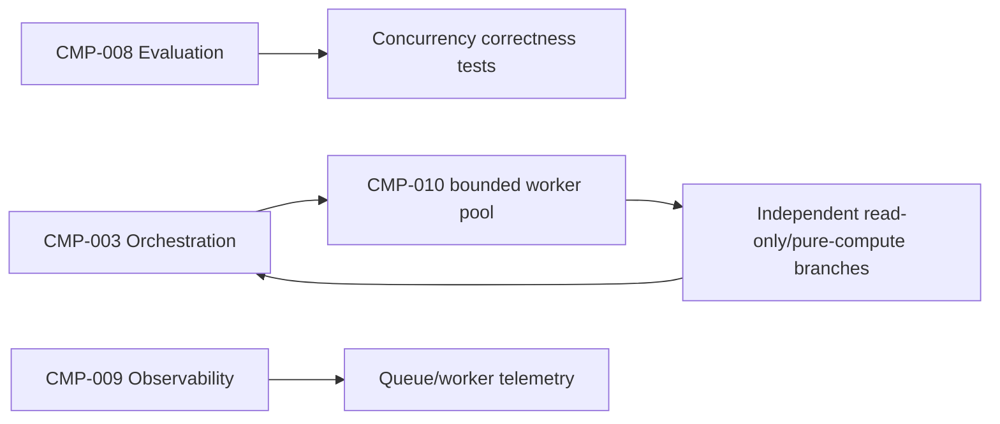
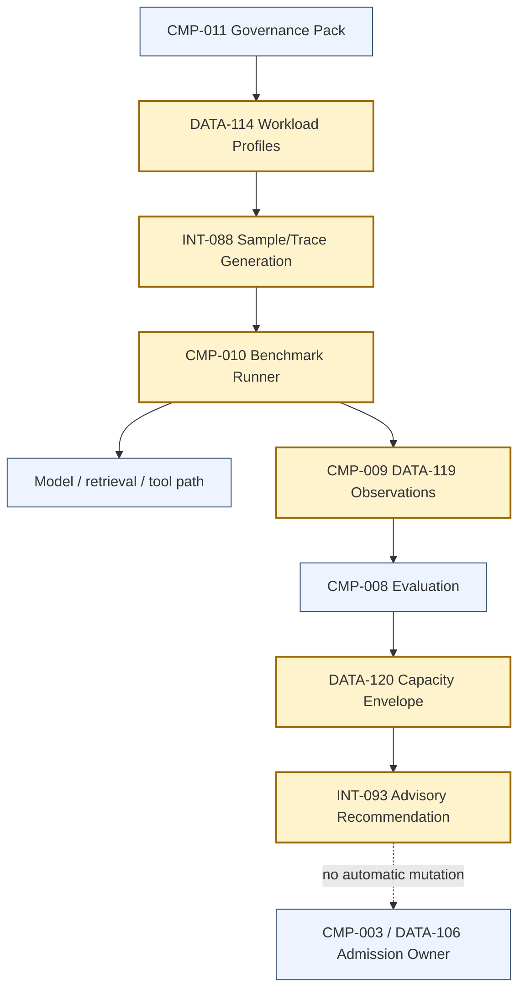

# Stage 7B — ISL, OSL and Workload Modelling

**Stage identifier:** `S07B`  
**Architecture version:** `1.7.0`  
**Repository version:** `1.7.0`  
**Execution date:** 2026-08-01  
**Scope boundary:** Workload definition, benchmark design, local planning simulation, capacity-envelope method and evidence governance only.

---

## 1. Context Carried Forward

Stage 7A left NorthStar with bounded asynchronous fan-out/fan-in under `GRAPH-001/1.2.0`. `CMP-003` remains the sole task, route, state, cancellation, aggregation and system-termination owner. `CMP-007` remains the only authority issuer. Parallel branches are workflow work items—not agents—and are limited to immutable read-only or pure-compute work. There is still exactly one active `AGT-001`; its specification remains `1.1.0`. Human approval remains external and typed. Sequential fallback remains valid.

The new problem is not whether NorthStar *can* execute independent work concurrently. It can. The problem is that NorthStar has no defensible answer to any of the following:

- How long are the inputs actually presented to the model?
- How long are the outputs?
- How many model, retrieval and tool calls occur in one regulatory case?
- How quickly do requests arrive, and how bursty are they?
- How many interactive users and background cases overlap?
- Which latency is being measured: queue delay, time to first token, inter-token latency, one model call, or the complete workflow?
- At what request rate does the queue grow faster than it drains?
- Which workload class is responsible for the saturation?
- What is the cost per successful regulatory case rather than merely per API request?

Without those answers, increasing worker counts, selecting a broker, buying inference capacity or changing admission limits would be guesswork.

The Stage 7A handoff is the authoritative reconstruction basis for this execution. The nine other complete `1.6.0` registers were not included in this turn. Stage 7B therefore produces compatible `1.7.0` overlays and records `ISS-096`; it does not invent missing historical register entries.

**Artefacts modified:** architecture baseline, component catalogue, data/schema register, ADR register, repository manifest, risk/assumption/issue register, cumulative Mermaid architecture and Stage Handoff Pack.

---

## 2. Narrative Development

Elena Petrov presents a simple proposal: increase the worker pool from eight to thirty-two before the next regulatory cycle. Liam O’Connor asks what would saturate first. Elena cannot answer because the local benchmark used one fixed prompt length and one fixed output length. Maya’s short interactive questions, a 100-page regulatory consultation, overnight batch processing and a multi-document impact assessment were all treated as the same request.

Priya Raman stops the capacity discussion. A worker count is not a capacity model. Sofia Alvarez adds a governance concern: if a benchmark does not identify its tokenizer, traffic shape, prompt distribution, cache state, model-call count, tool latency and evidence class, it cannot support an architecture decision.

NorthStar therefore introduces workload engineering now—not as an inference optimization, and not as an autoscaling system, but as the evidence layer required before either can be designed safely.

---

## 3. Problem Being Solved

Stage 7B solves five linked problems.

### 3.1 A request is not a workload

One request can contain a 500-token analyst question or a 120,000-token evidence package. One output can be a 40-token tool call or a 10,000-token structured assessment. The same request count can therefore represent radically different compute, memory and latency demand.

### 3.2 Agentic work amplifies inference demand

A NorthStar case is a trajectory. `AGT-001` may call the model several times, retrieve evidence repeatedly, invoke tools through `CMP-005`, validate intermediate results and continue with a growing context. The workload unit must therefore include call counts, turns and external latency—not only the first prompt.

### 3.3 Arrival patterns determine queue behaviour

A service that handles one request every second under a uniform test may fail under a ten-second regulatory burst even when the average rate is unchanged. Closed-loop analyst sessions, open-loop event arrivals and overnight batches require different load generators and different interpretations.

### 3.4 Latency metrics answer different questions

TTFT describes how long the user waits for the first streamed token. ITL/TPOT describes generation cadence after the first token. End-to-end latency describes completion. Queue latency describes overload and admission delay. Tool and retrieval latency may dominate the workflow even when inference metrics are excellent. NVIDIA’s current benchmarking documentation explicitly separates TTFT, end-to-end latency and ITL/TPOT and notes that TTFT includes queueing, prefill and network effects [R1].

### 3.5 Capacity must be tied to evidence class

A local simulator, a synthetic endpoint test, a trace replay and a production observation are not interchangeable. Stage 7B makes that distinction explicit and prevents simulated results from becoming production limits.

---

## 4. Requirements Introduced or Updated

Stage-scoped requirements `S07B-REQ-001`–`015` are introduced because the full inherited requirement register was unavailable for collision-safe numbering. They require:

1. Versioned joint ISL/OSL distributions.
2. Constant, Poisson, burst, batch and closed-loop arrival patterns.
3. Model-call, tool-call, retrieval-call and turn distributions.
4. Queue, TTFT, ITL/TPOT, end-to-end, request-throughput and token-throughput measurements.
5. Workload-specific SLO hypotheses.
6. Explicit evidence classes.
7. Tokenizer and profile provenance.
8. Payload-minimized telemetry.
9. Reproducible seeds.
10. Advisory capacity envelopes.
11. No automatic mutation of `DATA-106`.
12. Preservation of Stage 7A concurrency and authority invariants.
13. External dependency latency.
14. A local no-GPU execution path.
15. A hard block on inactive multi-agent profiles.

The complete traceability table is in `docs/source-of-truth/02-Requirements-Register.md`.

---

## 5. Conceptual Explanation

### 5.1 Input Sequence Length

**Input Sequence Length (ISL)** is the number of input tokens processed by a model call after the application has assembled system instructions, user input, retrieved evidence, structured state, tool observations and other retained context.

For NorthStar, ISL is not document character count. It is tokenizer-specific. The same document may produce different token counts under different tokenizers or chat templates. Every profile therefore records `tokenizer_id`, and every benchmark records the observed token count returned by the endpoint where available.

In the Stage 7B bootstrap profiles, `isl_tokens` is a representative *per-model-call working-context length*. The service-demand proxy multiplies it by `model_calls` to estimate workflow input-token demand. This is deliberately conservative and must be replaced by per-call trace data when available.

### 5.2 Output Sequence Length

**Output Sequence Length (OSL)** is the number of output tokens generated by a model call. OSL affects decode duration, KV-cache growth, streaming time and output-token cost.

A bounded tool call and a narrative executive summary must not share the same OSL assumption. NorthStar models OSL jointly with ISL because long-context analysis often produces longer structured outputs, while some long prompts produce only short classifications.

### 5.3 Prefill and decode

The model first processes the input sequence to construct the internal state required for generation. This is commonly called **prefill**. It then generates output tokens autoregressively in the **decode** phase. Current MLPerf material similarly separates the prompt phase measured through TTFT from the generation phase measured through TPOT [R8].

Stage 7B does not select a serving engine or optimization. It only preserves enough workload structure to test those choices later.

### 5.4 TTFT

**Time to First Token (TTFT)** is the time from request submission to the first non-empty output token. It can contain:

- upstream admission and queue delay;
- gateway and network delay;
- tokenization;
- prefill;
- inference scheduler delay;
- first-token generation;
- response transport.

A low TTFT matters for interactive work. It may be irrelevant to a non-streaming overnight batch unless first-result latency is itself a requirement.

### 5.5 ITL and TPOT

**Inter-token latency (ITL)** measures the time between generated tokens after the first token. **Time per output token (TPOT)** is often used similarly. Tools differ in exact aggregation, so NorthStar records the formula and excludes TTFT when calculating decode cadence. NVIDIA AIPerf defines ITL as `(end-to-end latency - TTFT) / (output tokens - 1)` [R1].

ITL is meaningful only for streaming generation with more than one output token. It is not a useful metric for a deterministic tool call, retrieval lookup or human review.

### 5.6 End-to-end workflow latency

NorthStar distinguishes at least three clocks:

1. **Inference-call clock:** endpoint submission to final token.
2. **Automated workflow clock:** work admission to automated completion or escalation.
3. **Business elapsed clock:** case opening to approved disposition, including human wait.

Stage 7B implements the first two as benchmark concepts. Human elapsed time remains separately measured until `ISS-100` is resolved.

A simplified automated workflow equation is:

```text
E2E_workflow = queue_workflow
             + Σ(model_network + model_queue + prefill + decode)
             + Σ(retrieval_latency)
             + Σ(tool_latency)
             + deterministic_compute
             + retry_and_backoff
             + checkpoint_overhead
```

### 5.7 Throughput

NorthStar records both:

- **Request throughput:** successful completed requests per second.
- **Token throughput:** input or output tokens processed per second.

Request throughput alone can be misleading because a short classification and a long impact assessment count as one request each. MLCommons uses token throughput for variable-length LLM workloads for this reason [R8].

### 5.8 Concurrency and queueing

Concurrency is the number of in-flight requests or workflow branches. Arrival rate and concurrency are related but not equivalent. vLLM’s benchmark interface separates request rate from maximum concurrency, and NVIDIA AIPerf similarly treats concurrency as a ceiling when request-rate scheduling is used [R3][R4].

For a stable system, a first-order relationship is Little’s Law:

```text
average_in_flight ≈ arrival_rate × average_time_in_system
```

This is a planning identity, not a sizing formula by itself. Service-time variability, heavy tails, batching, retries, priority, cache state and resource contention still matter.

### 5.9 Workload profile

A **workload profile** is a versioned, governed description of a materially distinct demand regime. It contains:

- joint ISL/OSL buckets and weights;
- model/tool/retrieval call counts;
- turn count and context-growth assumptions;
- arrival pattern and maximum concurrency;
- SLO hypothesis;
- tokenizer identity;
- evidence status;
- ownership and intended use.

### 5.10 Capacity envelope

A **capacity envelope** is the range of tested rates and concurrency for one profile under one declared configuration where the required success and latency hypotheses are met. It is not a universal property of a model name. It is invalidated by material changes in model, tokenizer, server, hardware, prompt, graph, caching, network path, tool path or workload distribution.

---

## 6. When This Capability Is Required

Workload modelling is required when NorthStar needs to:

- set or revise admission limits;
- compare managed and self-hosted inference;
- select worker, queue or broker scale;
- assess whether a model route meets interactive or batch objectives;
- estimate cost per case;
- establish SLOs;
- design autoscaling;
- detect latency or token regressions after graph/prompt changes;
- separate inference bottlenecks from retrieval/tool bottlenecks;
- plan a regulatory deadline or high-volume intake event;
- justify infrastructure procurement.

It is also required before claiming that a performance optimization is beneficial. An optimization that helps long decode-heavy outputs may not help short tool calls or retrieval-dominated workflows.

---

## 7. When It Is Not Required

A complete capacity model is unnecessary for:

- a single-user exploratory notebook with no performance claim;
- a deterministic unit test that only validates schema behaviour;
- an offline correctness evaluation where timing is intentionally excluded;
- a one-time manual demonstration with no deployment decision;
- a pure business-process workshop before any technical architecture exists.

Even in those cases, token counts and elapsed time may still be recorded cheaply. The anti-pattern is not “measuring too early”; it is presenting early measurements as production capacity.

---

## 8. Architecture Options

### 8.1 Sequence-length representation

**Option A — One fixed ISL/OSL pair.** Easy to reproduce; useful for a smoke test; hides variance and tails.

**Option B — Independent ISL and OSL marginal distributions.** Better than a fixed pair; may generate unrealistic combinations because correlation is lost.

**Option C — Weighted joint ISL/OSL buckets.** Understandable, versionable and capable of retaining correlation; still synthetic.

**Option D — Direct production trace replay.** Most representative when traces are clean and stable; unavailable before production and can reproduce sensitive data unless sanitized.

**Option E — Fitted statistical or generative workload model.** Can represent complex dependencies; harder to audit and easier to overfit.

### 8.2 Arrival model

- **Constant open-loop:** deterministic regression and repeatability.
- **Poisson open-loop:** independent random arrivals and baseline online-service approximation.
- **Burst:** regulatory-event and deadline stress.
- **Closed-loop:** interactive users who issue the next request after receiving a result.
- **Batch:** all or many requests released together; completion window and fairness dominate.
- **Recorded trace:** preferred for mature capacity decisions.

### 8.3 Benchmark level

- **Model microbenchmark:** isolates inference endpoint.
- **Component benchmark:** includes retrieval or tool gateway.
- **Workflow benchmark:** includes graph, retries and fan-out/fan-in.
- **Shadow benchmark:** replays production-like traffic without side effects.
- **Production observation:** strongest evidence, but must account for uncontrolled changes.

### 8.4 Capacity method

- Static spreadsheet arithmetic.
- Queueing approximation.
- Discrete-event simulation.
- Endpoint load test.
- Production canary or shadow test.

No single method is sufficient. Stage 7B uses a progressive evidence ladder.

---

## 9. Decision Matrix

| Option | Captures tails | Captures ISL/OSL correlation | Requires production data | Reproducible | Auditable | Selected use |
|---|---:|---:|---:|---:|---:|---|
| Fixed pair | No | No | No | High | High | Smoke test only |
| Independent marginals | Partial | No | No | High | Medium | Rejected as primary model |
| Joint weighted buckets | Yes | Yes, discretely | No | High | High | **Bootstrap profile** |
| Sanitized trace replay | Yes | Yes | Yes or representative pre-prod | High with frozen trace | High | **Preferred mature evidence** |
| Learned generator | Potentially | Yes | Usually | Medium | Low/medium | Deferred |

| Capacity method | Hardware fidelity | Workflow fidelity | Local/no-GPU | Best use |
|---|---:|---:|---:|---|
| Spreadsheet | Low | Low | Yes | Back-of-envelope checks |
| Queueing approximation | Low/medium | Medium | Yes | Sensitivity and sanity checks |
| Discrete-event proxy | Medium after calibration | Medium/high | Yes | Early planning and regression |
| Endpoint load test | High for tested endpoint | Medium unless full path | No endpoint required? No | Pre-production decision evidence |
| Production observation | Highest for current system | Highest | No | SLO validation and drift |

---

## 10. Selected Architecture and Rationale

NorthStar selects a hybrid design:

1. **Joint weighted bucket profiles** for bootstrap modelling (`ADR-062`).
2. **An evidence ladder** from simulation through production (`ADR-063`).
3. **Workload-specific SLO hypotheses** rather than one global SLO (`ADR-064`).
4. **Advisory capacity envelopes** with no automatic admission changes (`ADR-065`).
5. **A deterministic local simulator plus external benchmark adapters** (`ADR-066`).

This design meets the immediate need without prematurely selecting vLLM, SGLang, TensorRT-LLM, a managed API, a GPU family, a broker or a workflow engine. It also prevents local synthetic numbers from being mistaken for production proof.

---

## 11. Architecture Before the Change

Before Stage 7B:



This architecture can execute bounded work and record local queue health. It cannot characterize demand distributions, establish workload-specific objectives or derive a capacity envelope.

---

## 12. Architecture After the Change

`GRAPH-001` advances to `1.3.0`. No top-level component or active agent is added. The assurance and runtime boundaries gain a workload-evidence path.



The complete cumulative diagram is `docs/architecture/diagrams/GRAPH-001-v1.3.0.mmd`.

### Architectural changes

- New workload data objects `DATA-114`–`121`.
- New interfaces `INT-087`–`093`.
- New profile registry and benchmark modules inside existing components.
- No new tool authority.
- No new agent.
- No automatic scaling or admission mutation.
- No inference-serving selection.

---

## 13. Detailed Component Design

### 13.1 Workload Profile Registry

**Owner:** `CMP-008`, governed by `CMP-011`  
**Interface:** `INT-087`  
**Data:** `DATA-114`, `DATA-115`, `DATA-116`, `DATA-121`

Responsibilities:

- store versioned profile definitions;
- validate weights and triangular ranges;
- record tokenizer identity and evidence status;
- prohibit raw payload capture;
- mark inactive future profiles non-executable;
- compute a canonical digest for benchmark provenance.

### 13.2 Workload Sample and Trace Generator

**Owner:** `CMP-008`  
**Interface:** `INT-088`

Responsibilities:

- select a weighted joint bucket;
- sample ISL, OSL, call counts and turns;
- generate constant, Poisson, burst, closed-loop or batch arrivals;
- apply declared context-growth assumptions;
- record deterministic seed and profile digest;
- export payload-free request metadata.

### 13.3 Benchmark Scenario Runner

**Owner:** `CMP-010` under `CMP-008` scenario control  
**Interface:** `INT-089`  
**Data:** `DATA-117`, `DATA-118`

The local runner uses a deterministic discrete-event proxy. Future adapters can target an endpoint. A benchmark scenario is rejected if it references `inactive_future` or omits profile provenance.

### 13.4 Measurement Normalizer

**Owner:** `CMP-009`  
**Interface:** `INT-090`  
**Data:** `DATA-119`

It normalizes:

- request and profile identity;
- arrival/start/end timestamps;
- queue delay;
- TTFT;
- ITL/TPOT;
- end-to-end latency;
- observed ISL and OSL;
- model/tool/retrieval call counts;
- success, timeout, rejection and cancellation outcomes;
- evidence kind and benchmark configuration.

### 13.5 Capacity Envelope Analyzer

**Owner:** `CMP-008`  
**Interface:** `INT-091`  
**Data:** `DATA-120`

It performs rate/concurrency sweeps, calculates percentiles and SLO-hypothesis attainment, and identifies the highest *tested* rate that meets the declared gate. It does not extrapolate beyond the test range without a separate model and confidence statement.

### 13.6 Benchmark Evidence Export

**Owner:** `CMP-008` / `CMP-011`  
**Interface:** `INT-092`

Every report includes:

- profile/version/digest;
- tokenizer;
- model and endpoint identity;
- server/runtime version;
- hardware where applicable;
- load pattern and seed;
- warm-up policy;
- cache state;
- sample count and duration;
- success/rejection/cancellation counts;
- percentile metrics;
- evidence kind;
- known limitations.

### 13.7 Admission Recommendation

**Owner:** `CMP-008`; recipient `CMP-003`  
**Interface:** `INT-093`

The recommendation is a typed advisory artefact. It cannot modify `DATA-106`, create a grant, approve a case, change a route or write protected state. Applying it requires the existing governed configuration-change path.

---

## 14. Data, State and Interface Design

### 14.1 New data objects

| ID | Object | Key fields |
|---|---|---|
| `DATA-114` | `WorkloadProfile` | profile ID, version, tokenizer, status, buckets, arrival, SLO hypothesis, digest |
| `DATA-115` | `SequenceLengthDistribution` | weight, ISL/OSL min-mode-max, call counts |
| `DATA-116` | `ArrivalPattern` | kind, rate, concurrency, burst parameters |
| `DATA-117` | `ServiceDemandModel` | prefill/decode rates, fixed overhead, retrieval/tool/network latency, slots |
| `DATA-118` | `BenchmarkScenario` | profile digest, service model, request count, seed, warm-up, evidence kind |
| `DATA-119` | `BenchmarkObservation` | queue, TTFT, ITL, E2E, tokens, calls, turns, result |
| `DATA-120` | `CapacityEnvelope` | tested sustainable rate, concurrency, percentiles, throughput, evidence, recommendation |
| `DATA-121` | `SLOHypothesis` | profile-specific p95 and success hypotheses with rationale |

### 14.2 New interfaces

| ID | Contract | Authority |
|---|---|---|
| `INT-087` | Workload profile registry read/version | Governance and evaluation only |
| `INT-088` | Workload sample/trace generation | No business authority; metadata only |
| `INT-089` | Benchmark execution | Non-production/sanitized; no side-effect tools |
| `INT-090` | Measurement ingestion | Append measurement evidence; no route/state authority |
| `INT-091` | Capacity analysis | Analytical only |
| `INT-092` | Benchmark report export | Governance evidence |
| `INT-093` | Admission recommendation | Advisory; `CMP-003` remains owner |

### 14.3 Bootstrap workload profiles

All ranges below are configurable assumptions, not universal constants and not measured NorthStar production data.

| Profile | Purpose | Bootstrap ISL range | Bootstrap OSL range | Calls/turns | Arrival model | Primary objective |
|---|---|---:|---:|---|---|---|
| `WP-001` | Short regulatory query | 256–8,000 | 64–1,400 | 1–5 model calls; 1–2 turns | Poisson | Interactive responsiveness |
| `WP-002` | Long-document analysis | 8,000–128,000 | 800–14,000 | 3–14 model calls | Low-rate Poisson | Long-case completion and TTFT |
| `WP-003` | Policy comparison | 4,000–120,000 | 500–10,000 | 3–16 model calls | Poisson | Mapping throughput and tail latency |
| `WP-004` | Multi-document impact assessment | 10,000–160,000 | 1,000–18,000 | 6–28 model calls; 1–3 turns | Low-rate Poisson | End-to-end case completion |
| `WP-005` | Tool-heavy bounded `AGT-001` workflow | 1,200–80,000 | 120–5,000 | 4–24 model calls; 2–9 turns | Poisson | Workflow latency and external-call amplification |
| `WP-006` | Batch regulatory processing | 1,000–140,000 | 200–15,000 | Mixed | Batch | Completion window and throughput |
| `WP-007` | Interactive analyst session | 400–48,000 before growth | 50–1,500 | 2–12 turns | Closed loop | Growing-context user experience |
| `WP-008` | Future multi-agent investigation | Disabled | Disabled | None | None | `inactive_future`; cannot execute |

A profile tail may exceed the context limit of a later selected model. That is intentional: the benchmark must expose truncation, chunking or routing requirements rather than silently clipping the profile.

### 14.4 Profile clock policy

Each benchmark must declare:

- when the request clock begins;
- whether application queue and inference queue are separate;
- whether network time is client-side or server-side;
- whether first empty streaming chunks are ignored;
- how tool streaming is treated;
- whether human review pauses the automated SLO clock;
- how cancellation and rejection are reported.

---

## 15. Implementation

### 15.1 Local reference

The reference implementation uses only the Python standard library at runtime. It provides:

- immutable dataclasses with validation;
- canonical profile digests;
- deterministic weighted sampling;
- arrival generation;
- discrete-event queue simulation;
- prefill/decode/external service-demand proxies;
- percentile and throughput calculation;
- advisory capacity sweeps;
- external benchmark command plans;
- evaluation results `EVAL-089`–`100`.

### 15.2 Core profile model

```python
@dataclass(frozen=True, slots=True)
class WorkloadProfile:
    profile_id: str
    name: str
    version: str
    tokenizer_id: str
    status: str
    description: str
    buckets: tuple[DistributionBucket, ...]
    arrival: ArrivalPattern
    slo: SLOHypothesis
    context_growth_per_turn: float = 0.0
    turns_min: int = 1
    turns_mode: int = 1
    turns_max: int = 1
    capture_payloads: bool = False
```

The constructor rejects `capture_payloads=True` and invalid states. `BenchmarkScenario` rejects `inactive_future` profiles.

### 15.3 Sampling

A weighted bucket is selected first. ISL, OSL and call counts are then sampled from triangular ranges inside that bucket. Selecting the bucket first retains a simple form of correlation. A fixed seed makes the trace reproducible.

```python
bucket = choose_weighted_bucket(profile.buckets)
isl = triangular(bucket.isl_min, bucket.isl_mode, bucket.isl_max)
osl = triangular(bucket.osl_min, bucket.osl_mode, bucket.osl_max)
model_calls = triangular(bucket.model_calls_min, ...)
```

### 15.4 Arrival generation

- Constant: fixed inter-arrival interval.
- Poisson: exponential inter-arrival times.
- Burst: alternating base and multiplied rates.
- Batch: same release time.
- Closed-loop: initial user wave; subsequent work is gated by available slots in the proxy.

### 15.5 Service-demand proxy

The local proxy uses:

```text
prefill_time  ≈ model_calls × ISL / prefill_tokens_per_second
              + fixed_model_overhead

decode_time   ≈ model_calls × OSL / decode_tokens_per_second

external_time ≈ retrieval_calls × retrieval_latency
              + tool_calls × tool_latency
              + model_calls × network_latency
```

A configurable contention factor increases service demand when multiple slots are active. This is not a model of GPU kernels, batching or KV-cache eviction. It exists to validate scenario arithmetic and sensitivity before endpoint access.

### 15.6 Endpoint benchmark adapters

The repository generates AIPerf and vLLM command plans. Current AIPerf supports synthetic input/output length configuration, request rate, concurrency and advanced sequence-length distributions [R2][R3]. vLLM exposes request-rate, maximum-concurrency and length controls [R4][R5].

The generated fixed-length command is explicitly labelled a smoke test. A real decision run must use the profile mixture as a generated dataset or trace.

### 15.7 Execution

```bash
cd northstar-agentic-compliance-stage7b
python -m venv .venv
source .venv/bin/activate
pip install -e '.[test]'

python scripts/validate_stage7b.py
python scripts/run_stage7b_demo.py --profile config/workloads/WP-001.json
python scripts/run_stage7b_benchmark.py --profile config/workloads/WP-005.json
python scripts/run_stage7b_capacity_plan.py --profile config/workloads/WP-001.json
python scripts/run_stage7b_evaluation.py --profile config/workloads/WP-001.json
pytest -q
python scripts/consistency_audit_stage7b.py
```

---

## 16. Code and Repository Changes

### Files added

- Eight workload profiles and one local service model.
- Eight JSON Schemas (`DATA-114`–`121`).
- Workload models, sampling, metrics, simulation, adapters, I/O and evaluation modules.
- Six executable scripts.
- Unit, integration, security, evaluation and performance tests.
- Five ADRs.
- Three Mermaid diagrams.
- Ten source-of-truth overlay artefacts.
- Stage reference bibliography.

### Files modified

No inherited repository files were physically available to patch. The repository is therefore a compatible Stage 7B reconstruction overlay rather than a literal merge; see `ISS-096`.

### Files retired

None.

### Compatibility

- Python `>=3.11,<3.15`.
- Runtime standard library only.
- `pytest==9.0.2` for tests.
- No paid service required.
- External endpoint tools are optional and not installed by the project.

---

## 17. Security and Governance Implications

### 17.1 Security boundary

A benchmark runner is not a privileged agent. It receives no authority to:

- approve or finalize a case;
- change a route;
- mutate protected state;
- invoke unrestricted write tools;
- create an agent;
- bypass `CMP-005`;
- issue an authorization grant;
- modify `DATA-106`.

Endpoint benchmarks must use a non-production environment, sanitized corpus, mocked write tools or enforced dry-run mode. If a test must reach a live dependency, it requires a separately scoped workload identity and explicit allowlist.

### 17.2 Data minimization

Stage 7B records lengths, timings, counts, identifiers and outcomes. It does not require prompt text, response text, retrieved passages or tool arguments. `capture_payloads` is fixed to false in the local profile schema.

Where production trace replay is later introduced, raw content should be replaced by:

- tokenizer-preserving synthetic text where possible;
- redacted or hashed identifiers;
- content-class metadata;
- access-controlled trace storage;
- retention limits;
- separate quality datasets when semantic correctness must be tested.

### 17.3 Cache and tenant isolation

Prefix reuse can reduce redundant prefill work; vLLM documents KV-cache block reuse for matching prefixes [R6]. A future implementation must treat cross-tenant cache reuse as a security design question, not merely a performance toggle. Stage 7B records `RSK-216` and does not implement a live cache.

### 17.4 Governance

Every profile requires:

- business owner;
- technical owner;
- tokenizer identity;
- intended workload class;
- evidence status;
- review date;
- change triggers;
- approved data source;
- SLO rationale;
- profile digest.

A profile must be revalidated after changes to model, tokenizer, chat template, system prompt, retrieval assembly, graph version, tool pattern, output schema or material traffic mix.

### 17.5 Benchmark integrity

The report must not omit failures. A benchmark that drops requests can improve latency percentiles while worsening service. NorthStar therefore reports success, rejection, cancellation and timeout rates with latency.

---

## 18. Performance, Concurrency and Cost Implications

### 18.1 ISL drives prefill and memory pressure

Longer input generally increases prefill work and KV-cache allocation. TTFT can therefore rise even when OSL is small. The effect is not purely linear in a real serving system because batching, cache reuse, scheduler policy and hardware matter.

### 18.2 OSL drives decode time and user-perceived generation

Longer OSL increases decode duration and occupies serving capacity longer. For interactive work, ITL affects perceived fluidity. For batch work, aggregate token throughput and completion window may matter more.

### 18.3 Model-call count multiplies demand

For a workflow with `n` model calls:

```text
total_input_tokens  = Σ ISL_call_i
total_output_tokens = Σ OSL_call_i
```

A seemingly modest 4,000-token context becomes expensive if repeated across fifteen calls. Stage 7B therefore makes call count first-class.

### 18.4 External dependencies can dominate

If tool and retrieval latency exceed model latency, changing GPU scale may not improve end-to-end case time. `WP-005` explicitly models tool-heavy work to prevent inference-only optimization.

### 18.5 Queueing is nonlinear near saturation

As utilization approaches effective service capacity, queue delay and tail latency can rise sharply. NorthStar therefore derives a tested envelope with headroom rather than configuring admission at the observed failure point.

A production recommendation should consider:

```text
required_service_capacity
  ≥ peak_arrival_rate × mean_service_demand × safety_factor
```

The safety factor must be justified by burstiness, tail variability, failover and maintenance—not copied from a generic rule.

### 18.6 Cost model

No current price is assumed. The stage defines the structure:

```text
cost_per_case = input_token_cost
              + output_token_cost
              + reasoning_token_cost (if separately billed)
              + retrieval_cost
              + tool/API cost
              + infrastructure_time_cost
              + storage_and_telemetry_cost
              + evaluation_cost
              + human_review_cost
              + failed_and_retried_work_cost
```

The meaningful denominator is successful, accepted business outcomes:

```text
cost_per_successful_case = total_cost / accepted_completed_cases
```

A lower cost per request can still be worse if completion or acceptance falls.

### 18.7 Capacity-planning sequence

1. Collect tokenizer-accurate per-call traces.
2. Segment materially different workloads.
3. Fit and review joint distributions and call counts.
4. Declare open-loop, closed-loop, burst and batch scenarios.
5. Run model microbenchmarks.
6. Run retrieval/tool component benchmarks.
7. Run complete workflow benchmarks.
8. Sweep rate and concurrency.
9. Record saturation signatures and failure modes.
10. Derive a profile-specific envelope with headroom.
11. Validate cost and quality at the same points.
12. Submit any admission change through governance.

---

## 19. Evaluation and Test Cases

### 19.1 Evaluation IDs

- `EVAL-089`: distribution-weight validity.
- `EVAL-090`: positive sampled ISL/OSL.
- `EVAL-091`: end-to-end latency contains TTFT.
- `EVAL-092`: success-rate hypothesis.
- `EVAL-093`: queue-delay hypothesis.
- `EVAL-094`: end-to-end hypothesis.
- `EVAL-095`: TTFT hypothesis where applicable.
- `EVAL-096`: ITL hypothesis where applicable.
- `EVAL-097`: model-call count integrity.
- `EVAL-098`: payload capture disabled.
- `EVAL-099`: only executable profile states run.
- `EVAL-100`: unique request identities.

### 19.2 Test groups

| Tests | Coverage |
|---|---|
| `TEST-408`–`419` | Model validation, digests, SLO and inactive-profile rejection |
| `TEST-420`–`427` | Reproducible weighted sampling, arrivals, bounds and context growth |
| `TEST-428`–`437` | Queue simulation, percentiles, rate/slot sensitivity, capacity envelope and Little’s Law |
| `TEST-438`–`442` | Payload minimization, tokenizer provenance, authority separation and no `DATA-106` mutation |
| `TEST-443`–`446` | Evaluation registry and result integrity |
| `TEST-447`–`449` | Determinism, positive throughput and contention sensitivity |

### 19.3 Required production benchmark gates

A future production or pre-production run should fail the gate when:

- observed tokenizer differs from profile metadata;
- more than the allowed observations lack token counts or timestamps;
- raw payload capture is enabled without approval;
- warm-up and cache policy are absent;
- success/rejection/cancellation counts are incomplete;
- quality or structured-output checks fail at the tested load;
- benchmark traffic bypasses normal policy or gateway paths;
- latency is reported without workload distribution and evidence class;
- the profile digest is not reproducible.

### 19.4 Quality-performance coupling

Performance cannot be accepted independently of task quality. A faster run that truncates evidence, emits invalid structured output or increases escalation error is a failure. Stage 7B does not add new semantic-quality evaluators; it requires later benchmark runs to join existing task evaluations with performance observations through trace/run identifiers.

---

## 20. Failure Scenarios and Recovery

### Failure 1 — Tokenizer drift

**Scenario:** A model endpoint changes tokenizer or chat template. ISL rises by 20% even though documents are unchanged.

**Detection:** Profile tokenizer mismatch; observed token quantiles drift; digest invalidation.

**Containment:** Stop comparing the run with the prior envelope.

**Recovery:** Create a new profile version, retokenize the reference corpus and rerun the benchmark.

**Evidence:** Old/new tokenizer IDs, observed quantiles, profile digests and change record.

### Failure 2 — Long-tail context explosion

**Scenario:** A complex impact assessment assembles 160,000 tokens, exceeding the selected endpoint limit.

**Detection:** Pre-submission context check or endpoint rejection.

**Containment:** Do not silently truncate.

**Recovery:** Route to an approved long-context path, partition the work, summarize with provenance, or escalate. The selected behavior requires a later architecture decision.

**Evidence:** Original planned ISL, model limit, transformation and quality result.

### Failure 3 — Burst queue collapse

**Scenario:** A regulatory deadline creates a tenfold arrival burst. Average daily rate remains low, but queue p95 breaches the hypothesis and deadlines expire.

**Detection:** Queue depth, admission delay, timeout and rejection rates.

**Containment:** Apply existing finite admission and load-shedding behavior; preserve priority and sequential fallback.

**Recovery:** Drain backlog, rerun the burst scenario and submit a capacity or scheduling recommendation.

**Evidence:** Arrival trace, queue profile, rejected work and deadlines.

### Failure 4 — Inference benchmark passes; workflow fails

**Scenario:** TTFT and ITL meet targets, but a policy repository call takes eight seconds and dominates `WP-005`.

**Detection:** Distributed span breakdown and external-call percentiles.

**Containment:** Avoid adding inference capacity as the first response.

**Recovery:** Optimize or cache the dependency, revise timeout/fallback policy, or parallelize only proven-independent reads.

**Evidence:** Per-stage service demand and critical path.

### Failure 5 — Cache-contaminated result

**Scenario:** All benchmark prompts share a large prefix, producing a high cache hit rate that production traffic will not achieve.

**Detection:** Prefix diversity and cache-hit metadata differ from profile assumptions.

**Containment:** Mark run invalid for general capacity.

**Recovery:** Run cold, warm and representative-prefix scenarios separately.

**Evidence:** Cache state, hit rate, prefix distribution and run labels.

### Failure 6 — Benchmark hides dropped requests

**Scenario:** Overload causes 15% rejection, but p95 latency improves because rejected work is excluded.

**Detection:** Success and rejection counts disagree with submitted count.

**Containment:** Fail the benchmark gate.

**Recovery:** Report latency conditional on success alongside overall SLO attainment and rejection rate.

### Failure 7 — Synthetic profile mismatch

**Scenario:** Production has many 40,000-token policy comparisons, but the bootstrap profile assigns only 10% to the tail.

**Detection:** Population-stability comparison or quantile/correlation drift.

**Containment:** Stop using the old envelope for planning.

**Recovery:** Fit a measured profile version and replay a frozen sanitized trace.

### Failure 8 — Inactive multi-agent profile invoked

**Scenario:** An operator attempts to benchmark `WP-008` and later describes the result as multi-agent capacity.

**Detection:** Scenario constructor and benchmark adapter reject `inactive_future`.

**Containment:** No run starts.

**Recovery:** None in Stage 7B. Multi-agent activation requires a later approved architecture change.

---

## 21. Architecture Decision Records

Stage 7B accepts:

- `ADR-062` — Distribution-first, joint ISL/OSL workload modelling.
- `ADR-063` — Benchmark evidence ladder.
- `ADR-064` — Workload-specific SLO hypotheses.
- `ADR-065` — Advisory capacity envelope; admission ownership unchanged.
- `ADR-066` — Local planning simulator and external adapters.

`ADR-001`–`061` remain accepted.

---

## 22. Requirements Traceability Update

| Requirement | Architecture | Implementation | Tests/evaluation |
|---|---|---|---|
| `S07B-REQ-001` | Profile registry | `models.py`, `WP-*.json` | `TEST-408`–`410`, `420`–`427`, `EVAL-089`–`090` |
| `S07B-REQ-002` | Sample generator | `sampling.py` | `TEST-411`–`412`, `424` |
| `S07B-REQ-003` | `DATA-115` | Profiles and simulator | `EVAL-097`, `TEST-434` |
| `S07B-REQ-004` | Measurement normalizer | `metrics.py`, `simulation.py` | `EVAL-091`–`096`, `TEST-428`–`437` |
| `S07B-REQ-005` | `DATA-121` | profile SLO blocks | `EVAL-092`–`096` |
| `S07B-REQ-006` | Evidence ladder | reports/adapters | `ADR-063`, `TEST-435` |
| `S07B-REQ-007` | Profile provenance | digest/tokenizer | `TEST-414`, `439` |
| `S07B-REQ-008` | Privacy boundary | schema constant false | `EVAL-098`, `TEST-438` |
| `S07B-REQ-009` | Scenario seed | sampler | `TEST-420`, `447` |
| `S07B-REQ-010` | Capacity analyzer | `derive_capacity_envelope` | `TEST-435`–`436` |
| `S07B-REQ-011` | `INT-093` advisory | capacity script output only | `TEST-442` |
| `S07B-REQ-012` | `GRAPH-001/1.3.0` | no concurrency-policy mutation | consistency audit |
| `S07B-REQ-013` | `DATA-117` | service-demand model | `TEST-432`–`434` |
| `S07B-REQ-014` | Local reference | standard library | `TEST-447`–`449` |
| `S07B-REQ-015` | `WP-008` inactive | constructor/adapter guard | `TEST-417`, `440`, `EVAL-099` |

---

## 23. Stage Outcome

NorthStar can now:

- define seven executable workload classes and one inactive future placeholder;
- model joint ISL/OSL variation, call counts, turns and arrival patterns;
- distinguish interactive, asynchronous and batch performance objectives;
- generate reproducible payload-free traces;
- simulate queueing and service-demand sensitivity locally;
- produce endpoint benchmark command plans;
- calculate queue, TTFT, ITL, end-to-end and throughput metrics;
- derive an explicitly advisory capacity envelope;
- preserve all authority, state, approval, memory and concurrency boundaries;
- block an inactive multi-agent workload from execution.

It still cannot claim production capacity, select hardware or prove an inference optimization.

---

## 24. Known Limitations

1. The full inherited `1.6.0` registers were unavailable; overlays require merge (`ISS-096`).
2. Profiles are bootstrap assumptions, not measured NorthStar distributions.
3. The tokenizer is a placeholder.
4. The local simulator does not model real kernels, batching, KV-cache allocation, cache eviction, quantization, tensor parallelism or hardware topology.
5. Tool/retrieval/network latencies use simple p50 proxies rather than fitted distributions.
6. No endpoint benchmark was executed.
7. No production model, server, accelerator or managed API is selected.
8. No current provider price data is embedded.
9. No human clock policy is approved.
10. No autoscaling, broker selection or `DATA-106` change is implemented.
11. No live prefix caching or speculative decoding is implemented.
12. Mermaid diagrams were syntax-reviewed but not CLI-rendered.

---

## 25. Narrative Bridge to the Next Stage

The new profiles reveal that NorthStar does not have one performance problem. Some workloads are prefill-heavy, some decode-heavy, some tool-dominated, some batch-oriented and some have growing multi-turn context. A capacity envelope can describe the demand, but it cannot decide how the inference layer should respond.

Elena’s next task is therefore architectural rather than numerical: compare managed and self-hosted inference paths; understand batching, KV-cache behaviour, prompt/prefix caching, quantization and parallelism; determine when streaming matters; and test whether speculative decoding or model routing helps the *measured NorthStar profiles* rather than a generic benchmark.

That problem belongs to the next stage. It is not implemented here.

---

## 26. Updated Source-of-Truth Artefacts

The repository contains updated `1.7.0` overlays for all ten controlled artefacts:

1. `00-Project-Constitution.md`
2. `01-Business-and-User-Story-Baseline.md`
3. `02-Requirements-Register.md`
4. `03-Architecture-Baseline.md`
5. `04-Component-and-Agent-Catalogue.md`
6. `05-Data-and-Schema-Register.md`
7. `06-ADR-Register.md`
8. `07-Repository-Manifest.md`
9. `08-Risk-Assumption-and-Issue-Register.md`
10. `09-Stage-Handoff-Pack.md`

The overlays preserve exactly one active `AGT-001`, no concurrent protected-state writes, configured—not universal—concurrency limits, and advisory-only capacity output.

---

## 27. Stage Consistency Audit

**Result:** Passed with recorded reconstruction exception `ISS-096`.

Checked:

- narrative matches the `1.7.0` architecture;
- diagrams use existing component names and exactly one active `AGT-001`;
- code implements `DATA-114`–`121` and `INT-087`–`093` semantics;
- profile schema and runtime validation agree;
- tests trace to stage requirements;
- ADRs match implemented decisions;
- workload code cannot grant authority or mutate `DATA-106`;
- `WP-008` is inactive and rejected by executable paths;
- no production inference, broker, autoscaling, cache or speculative-decoding capability is falsely claimed;
- repository paths are consistent;
- Stage 7A invariants remain.

---

## References

- `[R1]` NVIDIA, *NIM LLM Benchmarking Metrics*, current documentation verified 2026-08-01.
- `[R2]` NVIDIA, *AIPerf Sequence Length Distributions for Advanced Benchmarking*, verified 2026-08-01.
- `[R3]` NVIDIA, *AIPerf Request Rate with Max Concurrency*, verified 2026-08-01.
- `[R4]` vLLM, *vllm bench serve*, verified 2026-08-01.
- `[R5]` vLLM, *Benchmark CLI load patterns*, verified 2026-08-01.
- `[R6]` vLLM, *Automatic Prefix Caching*, updated 2026-06-23.
- `[R7]` MLCommons, *Agentic Inference for MLPerf Inference*, 2026-07-08.
- `[R8]` MLCommons, *MLPerf Inference 5.1: Benchmarking Small LLMs*, 2025-09-09.
- `[R9]` OpenTelemetry, *Inside the LLM Call: GenAI Observability*, 2026-05-14.
- `[R10]` NVIDIA, *GenAI-Perf*, current page notes migration toward AIPerf; verified 2026-08-01.

Full URLs and annotations are in `docs/references/stage7b-primary-sources.md`.

---

# Stage Handoff Pack

## A. Stage completed

- **Stage identifier:** `S07B`
- **Stage title:** ISL, OSL and Workload Modelling
- **Architecture version:** `1.7.0`
- **Repository version:** `1.7.0`
- **Handoff version:** `1.7.0`
- **Graph version:** `GRAPH-001/1.3.0`
- **Completion date:** 2026-08-01
- **Status:** Completed as a compatible reconstruction overlay with local planning evidence only.
- **Consistency audit:** Passed with recorded reconstruction exception `ISS-096`.

## B. Capabilities now available

1. All accepted S07A bounded-concurrency, idempotency, cancellation, checkpoint, authority, state, human and memory constraints remain.
2. Seven executable workload profiles (`WP-001`–`007`) cover short queries, long documents, policy comparison, multi-document assessment, tool-heavy `AGT-001` work, batch processing and interactive sessions.
3. `WP-008` is `inactive_future` and cannot execute; there is exactly one active `AGT-001`.
4. `DATA-114`–`121` define versioned profiles, joint ISL/OSL buckets, arrival patterns, service-demand assumptions, benchmark scenarios, observations, capacity envelopes and SLO hypotheses.
5. Deterministic weighted sampling supports constant, Poisson, burst, closed-loop and batch load shapes.
6. A local discrete-event proxy measures queue, TTFT, ITL/TPOT, end-to-end latency and token/request throughput without GPU or paid infrastructure.
7. Benchmark adapters generate payload-free traces and command plans for external endpoint tools.
8. Capacity sweeps produce an advisory `DATA-120` envelope; they do not alter `DATA-106`.
9. Profile digests, tokenizer identity, evidence kind and seed provide benchmark provenance.
10. Raw prompt/response capture is disabled in the local reference.

**Not implemented:** production trace collection; live endpoint benchmarking; tokenizer-accurate NorthStar measurements; model/server/hardware selection; dynamic/continuous batching; live KV or prefix caching; quantization; parallelism; speculative decoding; autoscaling; broker selection; automatic admission changes; production cost rates; human clock policy; production telemetry backend.

## C. Accepted architecture decisions

`ADR-001`–`061` remain accepted.

- `ADR-062`: model workloads with versioned joint ISL/OSL mixtures and call/turn distributions.
- `ADR-063`: use an evidence ladder of simulated, synthetic endpoint, trace replay and production results.
- `ADR-064`: define workload-specific SLO hypotheses, not one universal limit.
- `ADR-065`: capacity envelopes are advisory; `CMP-003` and `DATA-106` retain admission ownership.
- `ADR-066`: use a standard-library planning simulator plus external adapters until a production inference stack exists.

## D. Current component inventory

| ID | Name | Current S07B responsibility/status |
|---|---|---|
| `CMP-001` | Analyst Experience Portal | Emits profile labels and interaction timings without raw content capture. |
| `CMP-002` | Regulatory Intake Boundary | Supplies document-size/arrival metadata; provenance boundary unchanged. |
| `CMP-003` | Case and Workflow Orchestration Boundary | Sole task/route/state/cancellation/aggregation/system-termination and admission owner; receives only advisory capacity recommendations. |
| `CMP-004` | Knowledge and Evidence Access Boundary | Exposes authorized retrieval timing/count metadata. |
| `CMP-005` | Enterprise Integration Boundary | Sole gateway for `TOOL-001`–`006`; exposes tool timing/status; no benchmark bypass. |
| `CMP-006` | Human Review and Approval Boundary | Human elapsed time remains separately governed; authority unchanged. |
| `CMP-007` | Identity, Authorization and Policy Boundary | Sole grant issuer; benchmark artefacts grant no authority. |
| `CMP-008` | Evaluation and Assurance Boundary | Owns profiles, benchmark design, SLO-hypothesis evaluation and capacity analysis. |
| `CMP-009` | Observability and Audit Boundary | Normalizes `DATA-119` and benchmark provenance; not production WORM. |
| `CMP-010` | Runtime and Deployment Boundary | Runs bounded local simulator and optional endpoint adapters. |
| `CMP-011` | Source-of-Truth Governance Pack | Governs `1.7.0` overlays, profile versions and reconstruction issue. |

## E. Current agent inventory

| ID | Name | Authority | Status |
|---|---|---|---|
| `AGT-001` | Regulatory Impact Assessment Agent | Existing exact proposal/complete/escalate boundary. Cannot route/mutate protected state, approve/finalize, grant consent, write unrestricted/shared memory, create agents or bypass owners. | **Only active agent**; spec `1.1.0` unchanged. |

No concurrent agents exist. `WP-008` is a disabled workload-profile placeholder, not an agent.

## F. Current data and state objects

- `DATA-001`–`113` retained; `DATA-009` remains `1.1.0`.
- `DATA-114 WorkloadProfile`.
- `DATA-115 SequenceLengthDistribution`.
- `DATA-116 ArrivalPattern`.
- `DATA-117 ServiceDemandModel`.
- `DATA-118 BenchmarkScenario`.
- `DATA-119 BenchmarkObservation`.
- `DATA-120 CapacityEnvelope`.
- `DATA-121 SLOHypothesis`.
- `DATA-081 case_working` is not transferred.
- No new shared mutable state or worker-owned state writer exists.

## G. Current interfaces and tools

- `INT-001`–`086` retained.
- `INT-087` Workload Profile Registry.
- `INT-088` Workload Sample and Trace Generation.
- `INT-089` Benchmark Execution.
- `INT-090` Measurement Ingestion and Normalization.
- `INT-091` Capacity Analysis.
- `INT-092` Benchmark Evidence Export.
- `INT-093` Advisory Admission Recommendation.
- `TOOL-001`–`006` remain unchanged and gateway-only.

## H. Repository state

```text
northstar-agentic-compliance-stage7b/
├── config/workloads/{WP-001...WP-008,service-model-local}.json
├── docs/{adr,architecture/diagrams,references,source-of-truth,stages}/
├── reports/
├── schemas/DATA-114...DATA-121.schema.json
├── scripts/{run_stage7b_demo,run_stage7b_benchmark,run_stage7b_capacity_plan,run_stage7b_evaluation,validate_stage7b,consistency_audit_stage7b}.py
├── src/northstar_compliance/workload/{adapters,evaluation,io,metrics,models,sampling,simulation}.py
├── tests/{unit,integration,security,evaluation,performance}/
├── README.md
└── pyproject.toml
```

Primary entry points are the six scripts above. Python target `>=3.11,<3.15`; executed `3.13.5`; runtime standard library; pytest `9.0.2`.

## I. Tests completed

- `TEST-408`–`419`: models, validation, digest, SLO and inactive-profile guards — passed.
- `TEST-420`–`427`: deterministic sampling, arrivals, bounds and context growth — passed.
- `TEST-428`–`437`: simulation, queueing, percentiles, sensitivity, capacity and Little’s Law — passed.
- `TEST-438`–`442`: payload minimization, tokenizer provenance, authority separation and no admission mutation — passed.
- `TEST-443`–`446`: evaluation registry and integrity — passed.
- `TEST-447`–`449`: determinism, throughput and contention properties — passed.

Executed result: **42 pytest cases passed**.

Evaluations `EVAL-089`–`100`:

- At the derived local simulated envelope of `0.2 requests/s`, all 12 passed.
- At the bootstrap overload probe of `0.8 requests/s`, `EVAL-093` queue, `EVAL-094` end-to-end and `EVAL-095` TTFT failed as expected; the result is retained as saturation evidence, not hidden.
- Local simulated `DATA-120` envelope: `0.2 requests/s`, eight tested workflow slots, evidence kind `simulated`. It is not a production limit.

Structural validation and 42-test suite passed. Consistency audit passed with `ISS-096`.

## J. Known limitations

Compatible reconstruction overlay; bootstrap synthetic profiles; placeholder tokenizer; simple p50 external latency assumptions; conservative per-call token multiplication; no endpoint/hardware/kernel/batching/KV-cache fidelity; no confidence intervals; no production trace; no production model/server/accelerator; no live cache; no pricing; no human clock policy; no autoscaling; no broker selection; no automatic `DATA-106` change; no production telemetry/WORM; Mermaid not CLI-rendered.

## K. Open risks, assumptions and issues

- New risks: `RSK-204`–`223`.
- New assumptions: `ASM-065`–`072`.
- New issues: `ISS-096`–`104`.
- All inherited active production gaps remain.

## L. Compatibility constraints

1. Preserve NorthStar, eight personas, `US-001`–`012`, `CMP-001`–`011` and exactly one active `AGT-001`.
2. Preserve `AGT-001-spec 1.1.0`; use `GRAPH-001/1.3.0`; preserve `DATA-009 1.1.0`.
3. Preserve application-owned routes/state/termination and gateway-only `TOOL-001`–`006`.
4. Preserve external human authority; timeout, benchmark result and capacity recommendation never approve.
5. Preserve memory boundaries and no automatic transfer/shared-agent memory.
6. Preserve canonical `DATA-091`–`113` and `INT-063`–`086` above execution transports.
7. `CMP-007` remains the only authority issuer; workload profiles, traces and benchmark runners cannot grant authority.
8. `CMP-003` remains sole task, route, admission, cancellation, aggregation and system-termination owner.
9. Concurrent branches remain workflow work items, not agents.
10. Concurrency still requires immutable independent read-only or pure-compute work.
11. Preserve no concurrent protected-state writes, approvals, finalization, route mutation, agent creation or shared-memory writes.
12. Preserve finite admission, deadlines, idempotency and deterministic fan-in.
13. Treat all S07B ranges and SLOs as profile-specific bootstrap assumptions until replaced by measured evidence.
14. Record tokenizer, profile version/digest, evidence kind, model/server/hardware and load shape for every benchmark claim.
15. Do not present fixed-length smoke tests or simulated results as production capacity.
16. `DATA-120` and `INT-093` remain advisory and cannot mutate `DATA-106` automatically.
17. `WP-008` remains `inactive_future` until a later explicit architecture decision activates additional agents.
18. Merge `1.7.0` overlays with the complete historical registers and resolve `ISS-096` before claiming a complete historical register.

## M. Required input for the next stage

Use all ten `1.7.0` artefacts after merge; `ADR-001`–`066`; `AGT-001-spec 1.1.0`; `GRAPH-001/1.3.0`; `DATA-007`, `009`, `041`–`121`; `INT-009`–`093`; `TOOL-001`–`006`; S07A concurrency policies and S07B workload profiles, benchmark traces, overload evidence, capacity envelope, active risks/issues and primary-source reference notes. Replace bootstrap profiles with tokenizer-accurate measured traces when available.

## N. Next architectural problem

NorthStar now understands the shape of its demand but has not designed the inference architecture that must serve it. It must compare managed and self-hosted paths; model prefill/decode and KV-cache pressure; evaluate batching, caching, context reduction, quantization, parallelism, streaming and routing; and benchmark speculative decoding only against the relevant NorthStar workload profiles without assuming it always helps.

## O. Exact continuation instruction

> Continue the NorthStar Agentic AI Architecture Playbook by executing only **Stage 7C — Inference architecture, batching, caching and speculative decoding**. Reconstruct the `1.7.0` S07B baseline; preserve exactly one active `AGT-001`, `GRAPH-001/1.3.0`, `DATA-091`–`121`, `INT-063`–`093`, bounded concurrency, authority/state/human/memory owners, sequential fallback and advisory-only capacity evidence; compare inference deployment and optimization options against `WP-001`–`007`; implement only the selected local-compatible design, update all artefacts, run the consistency audit and stop after the stage.

Audit assertions: exactly one active `AGT-001`; no concurrent protected-state writes; `WP-008` remains `inactive_future`; capacity recommendations remain advisory and concurrency bounds remain configured rather than universal SLOs.
