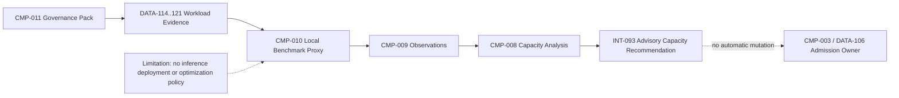
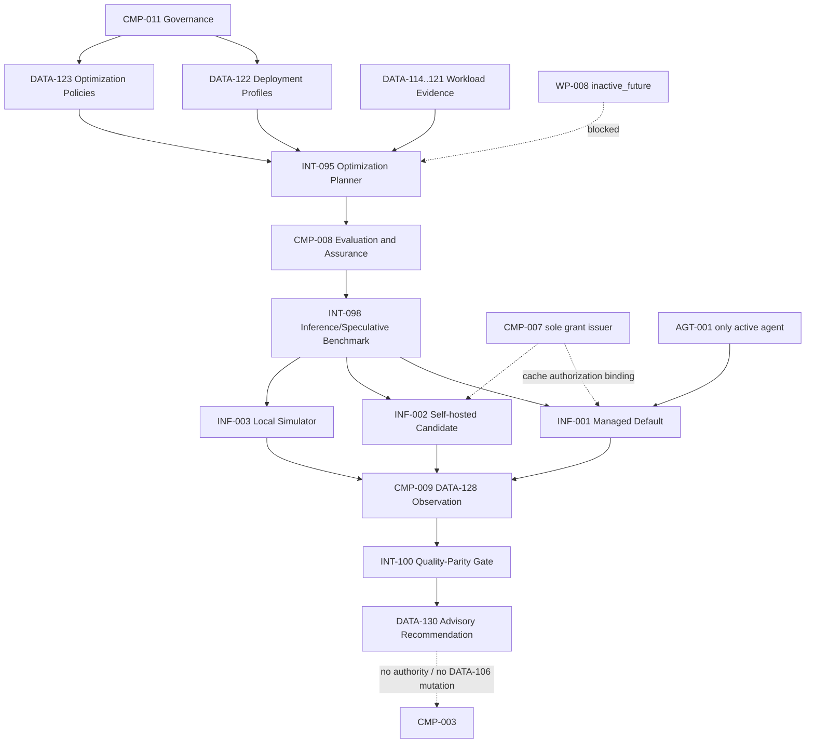

# Stage 7C — Inference Optimization and Speculative Decoding

**Stage identifier:** `S07C`  
**Architecture version:** `1.8.0`  
**Repository version:** `1.8.0`  
**Graph version:** `GRAPH-001/1.4.0`  
**Execution date:** 2026-08-01  
**Scope boundary:** Inference deployment architecture, optimization policy, cache/batching/KV-cache design, local speculative-decoding semantics, benchmark gates and advisory recommendations only.

---

## 1. Context Carried Forward

Stage 7B gave NorthStar a defensible description of demand. `WP-001`–`007` describe short regulatory queries, long-document analysis, policy comparison, multi-document assessment, tool-heavy `AGT-001` trajectories, batch processing and interactive analyst sessions. `WP-008` remains `inactive_future`. `DATA-114`–`121` and `INT-087`–`093` define workload evidence, benchmark observations and an advisory capacity envelope. At the local simulated envelope, the Stage 7B baseline could distinguish a sustainable point from an overload point, but it deliberately did not choose a model, provider, server, accelerator, cache, batching policy or speculative technique.

The architectural constraints are unchanged:

- NorthStar still has exactly one active agent, `AGT-001 Regulatory Impact Assessment Agent`, specification `1.1.0`.
- `CMP-003` remains the sole owner of task, route, protected state, admission, cancellation, deterministic aggregation and system termination.
- `CMP-007` remains the only authority-grant issuer.
- `CMP-005` remains the only gateway for `TOOL-001`–`006`.
- Human approval remains external and cannot be inferred from timeout, benchmark success, cache hit or model output.
- Parallel work remains bounded to independent immutable read-only or pure-compute branches, with sequential fallback.
- `DATA-120` and `INT-093` remain advisory and cannot mutate `DATA-106`.
- The absent full merged historical registers remain recorded as `ISS-096`; this stage adds a compatible `1.8.0` overlay rather than inventing historical rows. The supplied S07B handoff is the immediate reconstruction authority.

The unresolved problem is now concrete: NorthStar knows the shape of demand but has no inference architecture to serve it. It must decide how managed and self-hosted paths fit, where prefill and decode pressure arise, which caching and batching techniques suit which workload, when quantization or parallelism is justified, and whether speculative decoding improves successful end-to-end regulatory work rather than only a decode microbenchmark.

**Artefacts modified:** all ten controlled source-of-truth overlays, `GRAPH-001`, repository manifest, data/interface register, five ADRs, risk/assumption/issue register, code, tests, reference bibliography and handoff pack.

---

## 2. Narrative Development

Elena Petrov arrives at the performance review with an apparently simple plan: use continuous batching, enable a prefix cache, quantize the model and turn on speculative decoding. She expects four switches to reduce latency and infrastructure cost.

Liam O’Connor asks which workload the proposal optimizes. `WP-006` batch processing values throughput and completion window; `WP-001` interactive queries value TTFT; `WP-002` long-document analysis is prefill- and KV-heavy; `WP-005` tool-heavy work may spend almost half its time outside the model. A change that increases batch throughput can worsen interactive queueing. A speculative draft can occupy memory that the target needs for concurrent requests. A prefix cache can show spectacular results when every test repeats one document and no benefit when prefixes differ.

Marcus Green then asks who can read a reused KV prefix. A cache key based only on token hashes is not a complete enterprise isolation policy. It must also bind tenant, authorization scope, model, tokenizer, prompt and graph versions, evidence epoch and expiry. Sofia Alvarez asks a different question: if a quantized or approximate candidate is faster but changes one obligation, is that an optimization or a compliance defect?

Priya Raman reframes the task. NorthStar does not need a bag of optimization features. It needs a governed inference architecture that:

1. separates deployment choices from optimization techniques;
2. applies low-risk reductions before infrastructure complexity;
3. treats cache, batching and KV memory as explicit trust and scheduling concerns;
4. tests speculative decoding only where its assumptions fit;
5. couples performance with quality and successful business outcomes; and
6. produces recommendations that remain advisory.

---

## 3. Problem Being Solved

### 3.1 One endpoint can contain several bottlenecks

A model call has at least two materially different computational phases:

```text
request
  → admission / queue
  → tokenization
  → prefill over the input sequence
  → first token
  → autoregressive decode
  → final structured validation
```

Long ISL increases prefill work and KV-cache allocation. Long OSL occupies decode capacity and extends the period for which KV state remains live. Mixed traffic lets long prefills interfere with short interactive requests. Tool and retrieval calls add a separate critical path. Optimizing only model tokens can therefore leave the business workflow unchanged.

### 3.2 Deployment and optimization are different decisions

A managed API may provide prompt caching, internal batching and optimized kernels without exposing their implementation. A self-hosted runtime may expose continuous batching, paged KV cache, prefix reuse, chunked prefill, quantization, parallelism and speculative algorithms—but NorthStar must then operate the model supply chain, accelerators, schedulers, patching, isolation, telemetry and availability.

NorthStar must not select self-hosting merely because it exposes more tuning knobs, nor remain managed-only without a governed exit path.

### 3.3 Cache reuse has security semantics

Prefix caching reuses prefill work when requests share exact prefixes. vLLM explicitly describes long-document repeated queries and multi-round conversations as suitable examples, and notes that prefix caching reduces prefill rather than decode work [R3]. That makes `WP-002` and `WP-007` plausible candidates. But enterprise reuse must not cross tenant, case, authorization, model, tokenizer, prompt-version or evidence-version boundaries.

A semantic response cache is a different proposition: it reuses an answer because a new request appears similar. For NorthStar, similarity is not sufficient to reuse a regulatory conclusion across jurisdictions, effective dates, users, evidence sets or approval states. Stage 7C therefore prohibits semantic caching of regulated conclusions.

### 3.4 Batching trades latency, throughput and fairness

Dynamic or continuous batching can increase accelerator utilization by combining work from different requests. The same scheduler can delay a short request behind long prefills, increase TTFT through batch wait or cause profile starvation if token budgets are not bounded. Chunked prefill can create more scheduling opportunities for long contexts, but its benefit depends on runtime, workload mix and tuning. Current serving frameworks expose these capabilities, but their presence is not NorthStar evidence [R5][R7].

### 3.5 Speculative decoding has assumptions, not guarantees

Classical speculative decoding uses a fast draft to propose several future tokens and a target model to verify them. Correct rejection-correction algorithms can preserve the target distribution [R1][R2]. Other families include prompt lookup or n-gram speculation, self-speculative execution, multi-token prediction and Medusa-style auxiliary heads [R7][R8][R11][R12].

Benefit depends on several conditions:

- the draft path must be materially cheaper than ordinary target decoding;
- several candidates must be accepted often enough;
- target verification must process candidates efficiently;
- output must be long enough to amortize overhead;
- the deployment must have spare compute or be sufficiently memory-bound;
- extra KV and draft memory must not reduce useful concurrency; and
- the model phase must matter to end-to-end task latency.

vLLM currently frames speculative decoding as a way to reduce inter-token latency under medium-to-low-QPS, memory-bound conditions [R4]. TensorRT-LLM describes the underlying assumptions as efficient parallel validation and successful acceptance of multiple draft tokens [R8]. A 2026 systematic preprint further reports strong dependence on workload and batch size and identifies target verification as a dominant cost in many tested settings [R13]. NorthStar therefore treats speculation as a workload experiment, never a universal improvement.

---

## 4. Requirements Introduced or Updated

Stage-scoped requirements `S07C-REQ-001`–`018` are recorded in the updated requirements register. They require:

1. versioned inference deployment profiles;
2. managed versus self-hosted comparison without unsupported selection claims;
3. profile-specific optimization recommendations for `WP-001`–`007`;
4. a hard block on `WP-008`;
5. evidence-preserving context reduction;
6. fail-closed output controls;
7. non-authoritative streaming;
8. fully bound exact cache reuse;
9. prohibition of semantic regulatory-answer caching;
10. runtime-owned batching and preserved workflow admission ownership;
11. cold, warm and representative cache scenarios;
12. benchmark-only quantization and parallelism;
13. disabled-by-default, profile-gated speculation;
14. normalized latency, throughput, cache, acceptance and memory observations;
15. quality-performance coupling;
16. payload-free adapter plans;
17. advisory-only recommendations; and
18. a runnable local no-GPU implementation.

No production model, provider, server, hardware, cost, capacity or speedup requirement is declared complete.

---

## 5. Conceptual Explanation

### 5.1 Tokenization and model identity

Inference starts with a tokenizer and chat template, not an abstract character stream. Cache identity, ISL, model limits and draft-target compatibility all depend on tokenizer and prompt assembly. An optimization record must therefore pin:

- target model and version;
- tokenizer and chat template;
- system/prompt/graph versions;
- decoding parameters;
- serving runtime and version;
- hardware/topology where self-hosted; and
- workload profile/version/digest.

A result without those bindings is not reproducible enough for architecture governance.

### 5.2 Prefill

Prefill processes the input sequence and constructs the key/value state used by attention during generation. It is commonly compute-intensive and grows with input size. Long-document workloads make prefill a prominent part of TTFT. Exact prefix reuse reduces repeated prefill computation but does not make a long output decode faster [R3].

### 5.3 Decode

Autoregressive decode generates one output token at a time in the baseline path. It is often memory-bandwidth-sensitive because model weights and KV state are repeatedly accessed. Long outputs increase occupancy and can reduce the number of concurrent sequences a runtime supports.

### 5.4 KV cache

For each active sequence, the runtime keeps keys and values for prior tokens so attention does not recompute the full history at every step. A simplified planning estimate is:

```text
KV bytes ≈ active_tokens
         × layers
         × 2                  # key and value
         × KV_heads
         × head_dimension
         × bytes_per_element
```

The exact layout differs by model and runtime. Long contexts, high concurrency, speculative branches and large page sizes can materially change usable capacity. Prefix caching, KV quantization, paging, offload and cache sharding are distinct techniques and must be measured separately.

### 5.5 Dynamic and continuous batching

**Dynamic batching** waits briefly to combine requests into a batch. **Continuous batching** can add and remove sequences as they progress, avoiding a requirement that every sequence in a batch finish together. These techniques mainly affect serving efficiency; they do not change `CMP-003` workflow semantics or its admission ownership.

NorthStar requires token-based rather than request-count-only limits because one 100,000-token prompt and one 500-token prompt are not equivalent scheduler work.

### 5.6 Chunked prefill

Chunked prefill breaks a long prompt into scheduler-sized pieces. This can let decode and short-prefill work interleave with long prompts. It can also add scheduling and kernel overhead. NorthStar records it as a self-hosted benchmark candidate for `WP-002`, `WP-003`, `WP-004` and `WP-007`, not as a default.

### 5.7 Prompt and prefix caching

NorthStar distinguishes:

- **Managed prompt/context caching:** a provider-controlled mechanism with declared cache checkpoints, keys, TTL and billing semantics. Current managed platforms document such capabilities, but details vary by model and service [R14][R15].
- **Self-hosted prefix KV caching:** a runtime reuses exact token prefixes and associated KV blocks [R3][R9].
- **Exact response caching:** acceptable only for immutable deterministic metadata with full authorization/freshness binding.
- **Semantic response caching:** prohibited for regulatory conclusions.

A cache hit is a performance fact, not a correctness, authorization or approval fact.

### 5.8 Context reduction

Context reduction means removing duplication and low-value material before inference, not removing authoritative evidence. Techniques include:

- deduplicating repeated system and policy text;
- sending references to stable structured state rather than serializing it repeatedly;
- retrieval top-k/reranking refinement;
- compacting prior turns while retaining citations and decisions;
- extracting only relevant document sections; and
- separating model context from tool or database state.

Every change must pass citation coverage, required-state retention, groundedness and task-success gates.

### 5.9 Output-length control

A schema-aware output cap reduces decode work and cost. NorthStar uses caps as budgets, not truncation permission. If required findings do not fit, the system must return an explicit partial/incomplete or escalation outcome. It must not mark an incomplete assessment complete.

### 5.10 Quantization

Quantization reduces precision for model weights, activations or KV cache. It can reduce memory and increase throughput on supported hardware, but quality and numerical behaviour depend on model, quantization scheme, calibration and kernels. TensorRT-LLM, for example, documents weight and KV-cache quantization options [R10]. NorthStar therefore treats quantization as a concrete candidate configuration subject to structured-output, groundedness and task-success tests.

### 5.11 Parallelism

- **Tensor parallelism** partitions tensor operations across accelerators and can make a large model fit or reduce single-request latency, at the cost of communication.
- **Pipeline parallelism** partitions layers into stages, adding pipeline bubbles and operational complexity.
- **Data parallelism** replicates the model to serve independent requests, requiring routing, cache locality and failure-domain design.

No parallelism topology is selected without a model, hardware topology and crossover benchmark.

### 5.12 Streaming

Streaming improves perceived responsiveness by returning tokens before completion. It does not reduce total compute. Partial text must be visibly labelled, must not trigger a write or approval, and must be replaced or finalized only after structured validation.

### 5.13 Speculative decoding from first principles

Let the target model define probability distribution `p` for the next token and the draft define `q`. The draft proposes a sequence. The target evaluates the candidate continuation in a parallel verification pass. For stochastic lossless sampling, a proposed token `x` can be accepted with:

```text
accept(x) = min(1, p(x) / q(x))
```

If rejected, the replacement is sampled from the normalized positive residual:

```text
r(x) ∝ max(p(x) - q(x), 0)
```

This correction preserves the target distribution under the algorithmic assumptions [R1][R2]. “Lossless” here means distribution-preserving relative to the target decoding policy; independent runs with different randomness need not emit identical text.

Important families:

| Family | Draft source | Strength | Main dependency/risk |
|---|---|---|---|
| Draft-model speculation | Smaller compatible model | General and well studied | Draft cost, tokenizer compatibility, extra memory |
| Prompt lookup / n-gram | Repeated n-grams from input/history | No second model; useful for input-grounded copying | Low benefit when output does not overlap input |
| Self-speculative | Earlier layers or alternate path in target | Avoids separate model | Model/runtime-specific support |
| Multi-token prediction | Native model heads predict future tokens | Integrated drafting | Requires a model trained with MTP support |
| Medusa-style heads | Auxiliary decoding heads/tree | Parallel candidate tree | Additional heads/training and runtime support |

Hugging Face documents assisted, prompt-lookup and self-speculative generation variants [R11]. TensorRT-LLM documents EAGLE, MTP and n-gram options [R7][R8]. Stage 7C does not select any vendor implementation.

---

## 6. When This Capability Is Required

A governed inference architecture is required when NorthStar must:

- compare managed and self-hosted deployments;
- establish data-residency and operational ownership;
- reduce TTFT or ITL for interactive analysts;
- increase batch throughput or meet a regulatory completion window;
- support long contexts without uncontrolled OOM or starvation;
- estimate cache benefit from repeated documents or sessions;
- evaluate quantization or parallelism;
- test speculative decoding;
- control model serving cost; or
- detect performance regression after prompt, graph or model changes.

Speculative decoding is worth testing when output is sufficiently long, model decode is a meaningful fraction of task latency, concurrency is low or moderate relative to available capacity, and the draft or prompt-lookup source is likely to have high acceptance.

---

## 7. When It Is Not Required

Advanced serving optimization is unnecessary or harmful when:

- the current bottleneck is retrieval, tools, network or human review;
- output is very short;
- traffic is too low to justify self-hosted operational complexity;
- managed provider latency/cost already meets approved objectives;
- no representative workload or quality dataset exists;
- a cache cannot be safely isolated and invalidated;
- quantization cannot meet quality gates;
- speculation reduces useful concurrency or fails end-to-end improvement; or
- the team is still validating business correctness.

A small POC should first measure and remove duplicated context rather than introduce a multi-GPU serving topology.

---

## 8. Architecture Options

### 8.1 Deployment options

**Option A — Direct managed API.** Provider operates inference. NorthStar retains the gateway, policy, evaluation and audit layers.

**Option B — Cloud-managed model platform.** Adds enterprise networking, regional controls, model catalogues and managed endpoints; operational details remain partly opaque.

**Option C — Self-hosted open-weight serving.** Maximum tuning and residency control; NorthStar owns model, runtime, accelerator, scaling, security and reliability.

**Option D — Hybrid managed-default with self-hosted evidence lane.** Managed is the default class; a self-hosted candidate is tested through the same contracts.

**Option E — Immediate multi-provider/model router.** Routes by workload, latency, cost or risk. This belongs to the next model-selection stage and is not implemented here.

### 8.2 Optimization options

| Technique | Solves | Suitable profiles | Unsuitable/limited cases | Quality/security concern |
|---|---|---|---|---|
| Context reduction | Repeated prefill and context-window pressure | `WP-002`–`005`, `WP-007` | Required evidence cannot be removed | Citation and required-state loss |
| Output control | Long decode and cost | `WP-002`–`006` | Schema cannot fit cap | Silent truncation |
| Streaming | Perceived response latency | `WP-001`, `WP-007` | Background batch | Partial output misuse |
| Exact prefix cache | Repeated long prefixes | `WP-002`, `WP-003`, `WP-007` | Diverse prefixes; decode-heavy output | Cross-tenant/stale reuse |
| Exact response cache | Immutable deterministic metadata | Narrow read-only results | Regulated conclusions | Freshness/authorization |
| Semantic response cache | Approximate repeated questions | General consumer FAQ | NorthStar conclusions | **Prohibited** |
| Continuous batching | Accelerator utilization | `WP-006`, higher concurrency | Low traffic or strict TTFT | Fairness/queue delay |
| Chunked prefill | Long-context scheduling | `WP-002`–`004`, `WP-007` | Short prompts | Scheduler overhead |
| Quantization | Model/KV memory and throughput | Concrete self-host candidate | No validated kernels/model | Quality regression |
| Tensor parallelism | Model fit/single-request speed | Large concrete model | Small model or slow interconnect | Communication overhead |
| Data parallelism | Independent request scale | `WP-006`, sustained traffic | Very low traffic | Cache locality/routing |
| Prompt-lookup speculation | Input-grounded decode | `WP-002`, possibly `WP-003/004` | Short/tool-heavy outputs | Low acceptance |
| Draft-model speculation | Decode seriality | Long OSL, low/moderate concurrency | High concurrency/tool dominated | Extra compute/memory |
| MTP/Medusa/self-spec | Native or auxiliary drafting | Supported model/runtime | Unselected model | Compatibility/training |

---

## 9. Decision Matrix

### 9.1 Deployment path

Scores use 1 (weak) to 5 (strong) for NorthStar's present maturity.

| Criterion | Managed API | Cloud-managed endpoint | Self-hosted now | Managed default + self-host lane |
|---|---:|---:|---:|---:|
| Fastest safe operational start | **5** | 4 | 1 | 4 |
| Optimization transparency | 1 | 2 | **5** | 4 |
| Data-residency control | 3 | 4 | **5** | 4 |
| Operational burden | **5** | 4 | 1 | 3 |
| Vendor portability | 2 | 2 | 4 | **5** |
| Local/offline evidence | 1 | 2 | 4 | **5** |
| Current evidence readiness | **4** | 3 | 1 | **5** |
| Future sovereign option | 1 | 3 | **5** | **5** |
| Selected | No | No | No | **Yes** |

### 9.2 Speculative method ordering

| Method | Additional model | Model training/change | Input-grounded benefit | Runtime dependency | S07C decision |
|---|---:|---:|---:|---:|---|
| Prompt lookup | No | No | High | Moderate | **First candidate benchmark** |
| Draft model | Yes | No target change | Medium | High | Benchmark after compatible target/draft selection |
| Self-speculative | No separate model | Often no retraining, model-specific | Medium | High | Deferred |
| MTP | No separate drafter | Native trained heads | Medium | High | Deferred |
| Medusa-style | Auxiliary heads | Fine-tuning/heads | Medium | High | Deferred |

### 9.3 Promotion gates

A speculative candidate is eligible only when all relevant gates pass:

```text
quality parity                    = pass
lossless distribution claim      = verified, when claimed
acceptance rate                   ≥ configured profile threshold
decode improvement               ≥ configured threshold
end-to-end improvement           ≥ configured threshold
candidate memory overhead        ≤ configured threshold
success/rejection/timeout rate    = within SLO hypothesis
cache state and concurrency       = representative
cost per successful task         = not worse beyond approved tolerance
```

A microbenchmark win does not override an end-to-end or quality failure.

---

## 10. Selected Architecture and Rationale

NorthStar selects five linked decisions:

1. **Managed-default deployment with a self-hosted benchmark lane (`ADR-067`).** `INF-001` is the provider-neutral default class. `INF-002` is a candidate, not production. `INF-003` is the local simulator.
2. **Low-risk optimization first (`ADR-068`).** Context deduplication, output controls, streaming and exact prefix reuse precede quantization, parallelism or speculative complexity.
3. **Runtime-owned batching and KV policies (`ADR-069`).** `CMP-010` owns serving scheduling; `CMP-003` keeps workflow admission.
4. **Speculation disabled by default (`ADR-070`).** Prompt lookup is the first plausible experiment for long, input-grounded, non-tool-dominated, low/moderate-concurrency profiles. All methods remain profile-gated.
5. **Local executable evidence without production claims (`ADR-071`).** A standard-library planner, analytical proxy and tiny lossless speculative-sampling lab test architecture semantics.

This is the smallest architecture that makes the inference decision governed and executable without selecting a vendor, model or accelerator prematurely.

---

## 11. Architecture Before the Change



Stage 7B can explain demand and saturation but cannot select or govern an inference response.

---

## 12. Architecture After the Change

`GRAPH-001` advances to `1.4.0`.



The complete cumulative source is `docs/architecture/diagrams/GRAPH-001-v1.4.0.mmd`.

### Change summary

- No top-level component is added.
- No agent is added or activated.
- `DATA-122`–`130` and `INT-094`–`102` are added inside existing boundaries.
- Three deployment profiles describe classes/candidates, not production selections.
- Cache and speculative policy become explicit, validated objects.
- Quality parity becomes a mandatory performance gate.
- Recommendations remain advisory.

---

## 13. Detailed Component Design

### 13.1 Inference Deployment Profile Registry

**Owner:** `CMP-010`, governed by `CMP-011`  
**Data/interface:** `DATA-122`, `INT-094`

Each profile records:

- deployment kind;
- provider/runtime and version;
- target model and tokenizer;
- hardware and location;
- data residency;
- support for streaming, prefix cache, batching, chunked prefill, quantization, speculation and parallelism; and
- raw-payload capture prohibition.

A capability flag means “the candidate can expose this feature,” not “NorthStar should use it.”

### 13.2 Workload-to-Optimization Planner

**Owner:** `CMP-008`  
**Data/interface:** `DATA-123`, `INT-095`

The planner converts Stage 7B signals into assessments. It considers:

- median and p95 ISL/OSL;
- expected concurrency and batch mode;
- repeated-prefix ratio;
- input/output overlap;
- external-latency fraction;
- interactivity; and
- context growth.

Each technique receives a suitability score, decision (`select`, `benchmark`, `defer`, `prohibit`, `not_applicable`), rationale and required gates.

### 13.3 Cache Eligibility and Key Binding

**Owner:** policy from `CMP-007`; enforcement by `CMP-010`  
**Data/interface:** `DATA-124`, `INT-096`

An enabled cache requires all bindings:

```text
cache_key = hash(
    tenant_or_case_scope,
    authorization_scope_digest,
    model_id,
    tokenizer_id,
    prompt_version,
    graph_version,
    evidence_invalidation_epoch,
    exact_prefix_tokens
)
```

Missing binding becomes a cache miss, not a fallback to a wider cache. Cached prefill work never carries approval, route or authority state.

### 13.4 Batching and Scheduling Policy

**Owner:** `CMP-010`  
**Data/interface:** `DATA-125`, `INT-097`

The policy defines mode, maximum batch tokens, maximum concurrent requests, maximum wait, chunked-prefill flag and priority awareness. These are endpoint constraints. They do not replace `DATA-106` or permit unbounded work.

### 13.5 Speculative Decoding Plan

**Owner:** `CMP-008` plan; `CMP-010` execution  
**Data/interface:** `DATA-126`, `INT-098`

The plan records:

- method;
- enabled state;
- optional draft identity;
- speculative token count/lookahead;
- minimum acceptance;
- minimum decode and end-to-end improvement;
- maximum memory overhead;
- lossless claim requirement; and
- workload allowlist.

`WP-008` cannot be allowlisted. Disabled plans must use method `disabled`.

### 13.6 Benchmark Scenario and Observation

**Owner:** `CMP-008` / `CMP-009`  
**Data/interfaces:** `DATA-127`, `DATA-128`, `INT-099`

A scenario binds workload, deployment, policy, evidence kind, request count, seed, cache state and quality dataset. An observation records baseline and candidate TTFT, ITL, E2E, output throughput, acceptance, accepted tokens, KV memory, cache hit, quality record and outcome.

### 13.7 Quality-Parity Gate

**Owner:** `CMP-008`  
**Data/interface:** `DATA-129`, `INT-100`

The gate joins existing evaluation dimensions with inference evidence:

- exact-match or deterministic equivalence where relevant;
- structured-output validity;
- groundedness delta;
- task-success delta;
- lossless-distribution verification when claimed; and
- explicit pass/fail.

It does not require hidden chain-of-thought.

### 13.8 Optimization Evidence and Recommendation

**Owner:** `CMP-008`, governed by `CMP-011`  
**Data/interfaces:** `DATA-130`, `INT-101`, `INT-102`

A recommendation lists all assessed techniques and points to the selected policy. Its constructor requires `advisory_only=True`, `may_mutate_admission=False` and `may_grant_authority=False`.

---

## 14. Data, State and Interface Design

### 14.1 Data objects

| ID | Name | Security/quality invariant |
|---|---|---|
| `DATA-122` | InferenceDeploymentProfile | Complete model/tokenizer/runtime/residency metadata; no raw payload capture |
| `DATA-123` | InferenceOptimizationPolicy | No semantic response cache, automatic routing or automatic admission mutation |
| `DATA-124` | CachePolicy | All isolation/version bindings mandatory |
| `DATA-125` | BatchingPolicy | Finite token, concurrency and wait bounds |
| `DATA-126` | SpeculativeDecodingPlan | Disabled by default; profile allowlist and promotion thresholds |
| `DATA-127` | InferenceBenchmarkScenario | Active profile, declared cache state and mandatory quality dataset |
| `DATA-128` | InferenceBenchmarkObservation | Non-negative metrics, bounded acceptance/cache rates, no raw payload |
| `DATA-129` | QualityParityRecord | Quality and lossless-claim evidence |
| `DATA-130` | OptimizationRecommendation | Advisory only; no authority/admission mutation |

### 14.2 Interfaces

| ID | Contract | Fails closed when |
|---|---|---|
| `INT-094` | Deployment profile registry | Required provenance missing |
| `INT-095` | Optimization planning | Profile inactive or unsupported |
| `INT-096` | Cache eligibility/key binding | Any scope/version binding missing |
| `INT-097` | Batching policy | Limits invalid or ownership crossed |
| `INT-098` | Inference/speculation benchmark | Profile not allowlisted, raw payload enabled or quality dataset absent |
| `INT-099` | Observation normalization | Metrics invalid, evidence kind absent or raw payload captured |
| `INT-100` | Quality-parity gate | Structured/grounded/task/distribution criteria fail |
| `INT-101` | Evidence export | Provenance or outcome counts incomplete |
| `INT-102` | Advisory recommendation | Attempt to grant authority or mutate admission |

### 14.3 Stage 7C inference profiles

| ID | Role | Production status |
|---|---|---|
| `INF-001` | Provider-neutral managed inference default class | Default architecture class; provider/model unselected |
| `INF-002` | Version-pinned self-hosted serving candidate | Benchmark lane only |
| `INF-003` | Local standard-library simulator | Implemented local evidence; not an inference server |

---

## 15. Implementation

### 15.1 Repository modules

The implementation is a standard-library package under `src/northstar_compliance/inference/`:

- `models.py` — immutable validated contracts and digests;
- `planner.py` — technique assessment and selected-policy construction;
- `simulation.py` — transparent analytical baseline/candidate proxy;
- `speculative.py` — tiny target/draft probability models and lossless rejection correction;
- `evaluation.py` — `EVAL-101`–`115` gates;
- `adapters.py` — version-neutral payload-free external capability plan;
- `io.py` — JSON loading and evidence writing.

### 15.2 Selected-policy logic

The planner does not declare a universal winner. Representative logic is:

```python
long_context = workload.median_isl_tokens >= 8_000 or workload.context_growth
long_output = workload.median_osl_tokens >= 700 or workload.p95_osl_tokens >= 3_000
high_concurrency = workload.expected_concurrency >= 16 or workload.batch
prompt_lookup_candidate = (
    deployment.supports_speculative_decoding
    and workload.input_output_overlap >= 0.35
    and long_output
    and workload.external_latency_fraction < 0.45
    and not high_concurrency
)
```

The resulting `SpeculativeDecodingPlan` remains disabled for workloads that do not meet those structural criteria. Even an enabled candidate is only a benchmark plan; the evaluation gate decides whether it is recommendable.

### 15.3 Cache model

The constructor rejects an enabled cache unless all NorthStar bindings are true. It also rejects `allow_regulatory_answer_cache=True`.

```python
if enabled and not all((tenant_isolated, model_bound, tokenizer_bound,
                        prompt_version_bound, authorization_scope_bound)):
    raise ValueError("enabled caches require all NorthStar binding controls")
```

### 15.4 Analytical inference proxy

The local proxy separates baseline prefill, decode, external latency and KV memory. Candidate calculations apply declared context reduction, cache hit, output cap, quantization sensitivity, parallelism sensitivity, batching, chunked prefill and speculative acceptance.

This proxy is intentionally transparent and deliberately incomplete. It does not model real kernels, GPU occupancy, network collectives, scheduler implementation, cache eviction or model quality.

### 15.5 Toy lossless speculative lab

`speculative.py` implements a tiny Markov target and draft. It:

1. samples draft tokens;
2. evaluates target and draft probabilities;
3. accepts with `min(1, p/q)`;
4. samples from the positive residual after rejection;
5. emits an extra target token after an all-accepted block; and
6. compares empirical first-token distributions with a baseline sampler.

This proves that the code follows the intended distribution-preserving mechanics for the toy model. It does not prove GPU acceleration.

### 15.6 Commands

```bash
cd northstar-agentic-compliance-stage7c
python -m venv .venv
source .venv/bin/activate
pip install -e '.[test]'

python -m compileall -q src tests scripts
pytest -q
python scripts/run_stage7c_inference_plan.py
python scripts/run_stage7c_demo.py
python scripts/run_stage7c_speculative_benchmark.py --trials 20000
python scripts/run_stage7c_evaluation.py
python scripts/validate_stage7c.py
python scripts/consistency_audit_stage7c.py
```

---

## 16. Code and Repository Changes

### Files added

- `config/inference/INF-001.json`–`INF-003.json` and local service-rate assumptions.
- `config/workloads/WP-001.json`–`WP-008.json` signal overlays.
- Nine schemas `DATA-122`–`130`.
- Seven inference modules.
- Six executable scripts.
- Five ADRs.
- Four Mermaid diagrams.
- Unit, integration, security, evaluation and performance tests.
- Ten `1.8.0` source-of-truth overlays.
- Primary-source reference notes.

### Files modified

No byte-exact prior repository was mounted. Stage 7C therefore extends a compatible reconstruction and retains `ISS-096`.

### Files retired

None.

### Compatibility

- Python `>=3.11,<3.15`.
- Tested on Python `3.13.5`.
- Runtime standard library only.
- `pytest==9.0.2` for test execution.
- No paid API, GPU, model weight or vendor SDK required.

---

## 17. Security and Governance Implications

### 17.1 Endpoint trust

A managed endpoint requires verified region, retention, training-use, logging, encryption, private-network and prompt-cache behaviour. A self-hosted endpoint requires workload identity, mTLS or equivalent service authentication, image/model provenance, secrets isolation, network policy, patching and accelerator tenancy controls. Stage 7C records these as production gaps rather than claiming implementation.

### 17.2 Cache isolation

The cache trust boundary is explicit. A reusable prefix cannot be found solely by content hash. The authorization-scope and tenant/case bindings prevent a token-identical but unauthorized request from reusing another scope's state. Version and evidence epoch bindings prevent stale reuse after a policy or prompt changes.

### 17.3 Prompt injection and cached state

Prefix caching can preserve computational results for untrusted document text. It does not make that text trusted. All prior ingestion, authorization, context-as-data framing, tool-gateway and output-validation controls remain active. Cache reuse cannot bypass them.

### 17.4 Streaming safety

Streaming output is provisional. It cannot trigger `TOOL-*` writes, approvals or closure before the complete structured response passes validation and the normal graph path executes.

### 17.5 Benchmark identity and permissions

The benchmark runner is not `AGT-001` and receives no business authority. It may use a sanitized endpoint identity with no production write tools. It cannot call `CMP-007` to issue grants, modify `DATA-106`, change a route or finalize a case.

### 17.6 Model and runtime supply chain

Self-hosted promotion will require model-license review, checksum/signature verification, SBOM, container scanning, dependency pinning, vulnerability response and reproducible engine build evidence. These are not implemented by the local simulator.

### 17.7 Governance evidence

Every optimization claim requires:

- workload/version/digest;
- deployment/model/tokenizer/runtime/hardware identity;
- policy digest;
- cache state and hit distribution;
- concurrency/load shape;
- baseline and candidate metrics;
- success/rejection/timeout/cancellation counts;
- quality record;
- evidence kind; and
- limitations.

---

## 18. Performance, Concurrency and Cost Implications

### 18.1 Workload-specific interpretation

- `WP-001` short query: streaming and low queue delay matter; speculation usually has too little OSL to amortize.
- `WP-002` long-document analysis: context reduction, exact prefix reuse and chunked prefill are plausible; prompt lookup may help input-grounded long outputs.
- `WP-003` policy comparison: repeated policy prefixes and output structure make cache/context control important; concurrency and evidence variation must be measured.
- `WP-004` multi-document assessment: long context and multiple calls raise KV and workflow costs; retrieval/tool time can dilute decode gains.
- `WP-005` tool-heavy agent workflow: external latency dominates enough that inference-only changes may not improve the case; speculation is normally disabled.
- `WP-006` batch: throughput, completion window and fairness dominate; continuous/offline batching and data parallelism are stronger candidates than speculation.
- `WP-007` interactive session: prefix reuse and context growth controls can lower later-turn TTFT; streaming helps perceived responsiveness.

### 18.2 Simulated local evidence

The local `WP-002` / `INF-003` scenario used transparent sensitivity assumptions. With a declared representative cache hit of `0.70` and speculative acceptance of `0.85`, the proxy reported:

| Metric | Baseline | Candidate |
|---|---:|---:|
| TTFT | 5,403.33 ms | 2,604.13 ms |
| ITL | 11.11 ms | 5.18 ms |
| End-to-end | 49,934.50 ms | 28,146.50 ms |
| Candidate memory overhead | — | 0.16 ratio |

All `EVAL-101`–`115` gates passed for that synthetic scenario. These numbers are **simulated sensitivity output**, not an endpoint benchmark, production speedup or capacity claim. Their purpose is to show that the gate arithmetic and evidence flow work.

### 18.3 Toy speculative evidence

At 20,000 empirical trials, the tiny Markov lab reported:

- distribution parity: passed;
- total variation distance between baseline and speculative first-token samples: `0.00625`;
- trace acceptance rate: approximately `0.885`; and
- mean generated tokens per target verification step: approximately `4.41`.

This is an algorithmic unit laboratory. It does not include a GPU, transformer, kernel, batch scheduler or NorthStar text.

### 18.4 Cost structure

A complete comparison must include:

```text
managed cost per successful task =
    input token charges
  + output/reasoning token charges
  + cache write/read charges
  + network/private endpoint charges
  + retries and failed tasks
  + evaluation and telemetry
  + human review

self-hosted cost per successful task =
    accelerator amortization or rental
  + idle and warm-pool capacity
  + CPU/memory/storage/network
  + model serving and platform operations
  + observability/security/compliance
  + failed capacity and incident cost
  + evaluation and human review
```

A lower per-token rate is not sufficient if quality, success rate, availability or operational burden is worse.

### 18.5 Concurrency and speculation

Speculation can reduce serial decode steps while increasing per-request work and memory. At high concurrency, ordinary batching may already use accelerator parallelism effectively, leaving less idle capacity for draft and verification. NorthStar therefore requires the same candidate to be tested at low, representative and high concurrency, including a non-speculative baseline.

---

## 19. Evaluation and Test Cases

### 19.1 Evaluation gates

| ID | Gate |
|---|---|
| `EVAL-101` | Raw payload capture disabled |
| `EVAL-102` | Quality parity record passes |
| `EVAL-103` | Structured validity at least 0.99 |
| `EVAL-104` | Groundedness regression no worse than -0.01 |
| `EVAL-105` | Task-success regression no worse than -0.01 |
| `EVAL-106` | Acceptance meets profile threshold |
| `EVAL-107` | Decode improvement meets threshold |
| `EVAL-108` | End-to-end improvement meets threshold |
| `EVAL-109` | Candidate memory overhead within threshold |
| `EVAL-110` | Lossless distribution verified when required |
| `EVAL-111` | TTFT present and non-negative |
| `EVAL-112` | ITL present and non-negative |
| `EVAL-113` | End-to-end contains TTFT |
| `EVAL-114` | Cache hit bounded and declared |
| `EVAL-115` | Overall candidate gate |

### 19.2 Test coverage

`TEST-450`–`507` provide 58 pytest cases:

- `TEST-450`–`463`: profile, cache, batching, speculation and policy model validation;
- `TEST-464`–`473`: workload-specific planner decisions and inactive-profile blocking;
- `TEST-474`–`485`: categorical sampling, residual correction, acceptance probability, deterministic traces and empirical lossless parity;
- `TEST-486`–`493`: baseline/candidate metrics, cache state, batching, acceptance and memory sensitivity;
- `TEST-494`–`496`: end-to-end plan/simulate/evaluate and external capability evidence;
- `TEST-497`–`501`: cache isolation, semantic-cache prohibition, `WP-008`, no authority and no admission mutation;
- `TEST-502`–`504`: positive, low-acceptance and quality-failure evaluation paths;
- `TEST-505`–`507`: deterministic performance properties and bounded local runtime.

**Executed result:** 58 passed.

### 19.3 Required future endpoint matrix

For every eligible workload:

1. baseline with cache disabled;
2. cold-cache candidate;
3. warm but realistic-prefix candidate;
4. representative mixed-prefix candidate;
5. speculation off/on;
6. low, expected and overload concurrency;
7. short, median and p95 OSL;
8. quantized/unquantized when relevant;
9. quality dataset and tool/retrieval path unchanged; and
10. cost per successful task.

A run is invalid when rejected requests, cache state, model version or quality failures are omitted.

---

## 20. Failure Scenarios and Recovery

### Failure 1 — Cross-scope prefix hit

**Scenario:** Two cases contain the same public regulation text, but one prompt also includes restricted internal policy context. A cache implementation keys only on prefix tokens.

**Detection:** `INT-096` cannot produce a fully bound key or an integration test observes a tenant/auth mismatch.

**Containment:** Fail closed to a cache miss; invalidate the affected cache namespace.

**Recovery:** Rebuild keys with tenant, authorization, model, tokenizer, prompt/graph and evidence epoch. Review telemetry for unauthorized reuse.

**Evidence:** Cache key metadata, access decision and invalidation event; never raw restricted text.

### Failure 2 — Stale cached policy prefix

**Scenario:** An internal policy is updated, but a long-lived KV prefix represents the old text.

**Detection:** Evidence-version or invalidation epoch differs.

**Containment:** Reject the hit.

**Recovery:** Invalidate dependent keys and re-prefill from the current authorized source.

### Failure 3 — Continuous batching improves throughput but breaks analyst TTFT

**Scenario:** `WP-006` batch traffic fills the runtime while `WP-001` requests queue.

**Detection:** Profile-segmented p95 TTFT and starvation/fairness metrics fail.

**Containment:** Disable the candidate configuration; preserve workflow admission limits.

**Recovery:** Apply priority-aware token budgets, separate pools or a different batch wait, then rerun mixed traffic.

### Failure 4 — KV-cache exhaustion

**Scenario:** Long contexts plus speculation allocate more pages than expected and the endpoint rejects or crashes.

**Detection:** KV utilization, allocation failures, OOM events and rejection counts.

**Containment:** Stop admission to the candidate lane; no silent retry loop.

**Recovery:** Reduce concurrency/lookahead, revise context limits, test KV quantization or add capacity only after evidence.

### Failure 5 — Quantized candidate emits invalid structured output

**Scenario:** Throughput improves, but schema validity drops to 0.97.

**Detection:** `EVAL-103` fails.

**Containment:** Candidate is not promoted regardless of latency.

**Recovery:** Change quantization scheme/calibration or return to baseline; rerun the complete quality dataset.

### Failure 6 — Low speculative acceptance

**Scenario:** A draft model diverges on jurisdiction-specific legal language; acceptance falls below the configured threshold.

**Detection:** `EVAL-106` fails and acceptance distribution has a long low tail.

**Containment:** Disable speculation for the profile.

**Recovery:** Reduce lookahead, choose a more compatible drafter or use baseline decoding. Do not lower the threshold solely to claim success.

### Failure 7 — Decode improves but task E2E does not

**Scenario:** `WP-005` gains 25% decode speed but tools and retrieval dominate, so E2E improves only 2% against a 5% gate.

**Detection:** `EVAL-108` fails.

**Containment:** No promotion.

**Recovery:** Optimize the actual external critical path or preserve the simpler baseline.

### Failure 8 — Draft model steals target capacity

**Scenario:** Under high concurrency, draft execution and extra KV reduce target batching efficiency.

**Detection:** candidate output throughput and success rate regress despite good single-request ITL.

**Containment:** Disable speculation at that concurrency/profile.

**Recovery:** Isolate draft resources, use prompt lookup or baseline, and test capacity/cost again.

### Failure 9 — Approximate decoding mislabeled as lossless

**Scenario:** An implementation uses a heuristic acceptance rule but records `lossless_distribution_verified=True`.

**Detection:** algorithm/version evidence does not match an approved lossless method, or distribution tests fail.

**Containment:** Reject `DATA-129` and the benchmark package.

**Recovery:** Correct the claim and rerun deterministic and statistical tests.

### Failure 10 — Streaming partial response triggers action

**Scenario:** A client treats an early generated remediation sentence as final and calls a write path.

**Detection:** absence of final schema/termination token or attempted tool call outside the graph path.

**Containment:** `CMP-005` and `CMP-003` deny the action.

**Recovery:** Fix client state machine; label partial output and require final validated envelope.

### Failure 11 — Benchmark hides rejections

**Scenario:** A high-throughput run reports latency only for successful requests.

**Detection:** submitted count differs from success + rejection + timeout + cancellation.

**Containment:** Fail the evidence package.

**Recovery:** Report full outcomes and conditional latency, then rerun.

### Failure 12 — Inactive profile invoked

**Scenario:** An operator supplies `WP-008` to imply multi-agent inference capacity.

**Detection:** workload and scenario constructors reject `inactive_future`.

**Containment:** No plan or run is produced.

**Recovery:** None in S07C. Activation requires an explicit future architecture decision.

---

## 21. Architecture Decision Records

Stage 7C accepts:

- `ADR-067` — Managed default with governed self-hosted benchmark lane.
- `ADR-068` — Context/output/streaming/exact-prefix optimization order and cache boundaries.
- `ADR-069` — Runtime-owned batching, KV-cache and concrete quantization/parallelism evidence.
- `ADR-070` — Disabled-by-default, profile-gated speculative decoding.
- `ADR-071` — Local standard-library planner and toy lossless speculative lab.

`ADR-001`–`066` remain accepted and are not superseded.

---

## 22. Requirements Traceability Update

| Requirement group | Architecture | Implementation | Tests/evaluations |
|---|---|---|---|
| Deployment profiles and comparison | `CMP-010`, `DATA-122`, `INT-094`, `ADR-067` | `models.py`, `INF-*.json` | `TEST-450`–`456` |
| Workload-specific planning | `CMP-008`, `DATA-123`, `INT-095` | `planner.py` | `TEST-464`–`473` |
| Cache security | `CMP-007`, `CMP-010`, `DATA-124`, `INT-096`, `ADR-068` | constructors and planner | `TEST-452`–`455`, `497`–`499` |
| Batching/KV/parallelism | `CMP-010`, `DATA-125`, `INT-097`, `ADR-069` | planner, simulator | `TEST-469`, `486`–`493` |
| Speculative decoding | `CMP-008`, `CMP-010`, `DATA-126`, `INT-098`, `ADR-070` | `speculative.py`, `simulation.py` | `TEST-459`–`485`, `EVAL-106`–`110` |
| Observation and parity | `CMP-008`, `CMP-009`, `DATA-127`–`129`, `INT-099`–`101` | `evaluation.py`, adapters | `TEST-494`–`507`, `EVAL-101`–`115` |
| Advisory recommendation | `CMP-003`, `CMP-007`, `DATA-130`, `INT-102`, `ADR-071` | `build_recommendation` | `TEST-471`, `472`, `501` |

---

## 23. Stage Outcome

NorthStar can now:

- represent managed, self-hosted candidate and local-simulated inference classes;
- compare inference techniques against `WP-001`–`007`;
- block `WP-008`;
- generate a versioned optimization policy and full technique assessment;
- enforce cache isolation and prohibit semantic regulatory-answer reuse;
- distinguish workflow admission from runtime batching;
- model context, output, cache, batching, quantization, parallelism and speculation sensitivity;
- execute a tiny distribution-preserving speculative-sampling laboratory;
- require quality, acceptance, decode, E2E and memory gates;
- export payload-free external benchmark plans; and
- emit an advisory recommendation that cannot grant authority or change admission.

It still cannot claim that any provider, model, server, hardware or speculative method is production-selected or beneficial in production.

---

## 24. Known Limitations

1. Compatible overlay; full historical merge remains unavailable (`ISS-096`).
2. S07B workload signals are bootstrap assumptions, not tokenizer-accurate production traces.
3. No managed provider or target model is selected.
4. No self-hosted model, runtime or accelerator is selected or deployed.
5. No live endpoint benchmark was run.
6. Local service rates and improvements are transparent sensitivity parameters, not measurements.
7. The Markov speculative lab validates toy distribution mechanics, not transformer speed.
8. No kernel, scheduler, cache eviction, GPU occupancy, collectives or OOM fidelity.
9. No live prompt/prefix cache or invalidation service.
10. No quantized model quality evaluation.
11. No production quality-performance join backend.
12. No production cost rates.
13. No autoscaling or routing policy.
14. No prefill/decode disaggregation design.
15. No human clock policy.
16. No production telemetry/WORM backend.
17. Mermaid was syntax-reviewed but not CLI-rendered (`ISS-112`).

---

## 25. Narrative Bridge to the Next Stage

Elena now has a disciplined answer to “how should NorthStar optimize inference?”: begin with the workload, preserve evidence and authority, use exact cache boundaries, keep serving scheduling within the runtime, and enable speculative methods only after profile-specific gates. Yet every recommendation still refers to placeholders such as “managed target” or “unselected open-weight target.”

That is now the limiting architecture problem. A cache, batching or speculative policy cannot be finalized without knowing which model family, tokenizer, context window, structured-output behaviour, tool-use reliability, residency option, license and deployment path will serve each task. NorthStar must compare LLMs, SLMs, reasoning models, embeddings, rerankers and classifiers; decide whether one model or a governed cascade is justified; define fallback and judge separation; and prove that routing does not weaken risk, data-residency or quality controls.

That unresolved problem belongs to **Stage 7D — Model Selection and Routing**. It is not implemented here.

---

## 26. Updated Source-of-Truth Artefacts

All ten `1.8.0` overlays are present:

1. `00-Project-Constitution.md`
2. `01-Business-and-User-Story-Baseline.md`
3. `02-Requirements-Register.md`
4. `03-Architecture-Baseline.md`
5. `04-Component-and-Agent-Catalogue.md`
6. `05-Data-and-Schema-Register.md`
7. `06-ADR-Register.md`
8. `07-Repository-Manifest.md`
9. `08-Risk-Assumption-and-Issue-Register.md`
10. `09-Stage-Handoff-Pack.md`

They preserve exactly one active `AGT-001`, external human authority, gateway-only tools, bounded concurrency, advisory-only capacity/optimization evidence and the `WP-008` block.

---

## 27. Stage Handoff Pack

The complete reusable handoff is maintained in `docs/source-of-truth/09-Stage-Handoff-Pack.md` and exported as `NorthStar-Stage-7C-Handoff-Pack.md`.

---

## Stage Consistency Audit

**Result:** Passed with recorded reconstruction and production-evidence exceptions.

Validated:

- narrative starts from the S07B inference-architecture limitation;
- `CMP-001`–`011`, eight personas and accepted business scope are preserved;
- exactly one active `AGT-001` remains, spec `1.1.0`;
- `GRAPH-001` advances only from `1.3.0` to `1.4.0`;
- `DATA-009` remains `1.1.0`; no protected-state or shared-memory writer is added;
- `DATA-122`–`130`, `INT-094`–`102`, code, schemas, ADRs, tests and diagrams align;
- `CMP-003` retains admission/route/state/termination ownership;
- `CMP-007` remains the sole authority issuer;
- `TOOL-001`–`006` remain gateway-only;
- `WP-008` is blocked;
- semantic caching of regulatory conclusions is prohibited;
- speculative decoding is disabled by default and profile-gated;
- recommendations cannot grant authority or mutate `DATA-106`;
- 58 pytest cases, compilation, demo, planner, toy speculation and 15 evaluation gates pass; and
- no local simulated result is described as production capacity or speedup.

Recorded exceptions: inherited `ISS-096`, new `ISS-105`–`113`, and all inherited production gaps.

---

## References

Use `docs/references/stage7c-primary-sources.md` for full URLs and annotations. Principal sources are original speculative-decoding papers [R1][R2], current vLLM cache/speculation documentation [R3][R4], SGLang and TensorRT-LLM serving documentation [R5]–[R10], Hugging Face generation documentation [R11], Medusa [R12], the 2026 workload-dependent speculative-decoding study [R13], and managed cache documentation [R14][R15].
