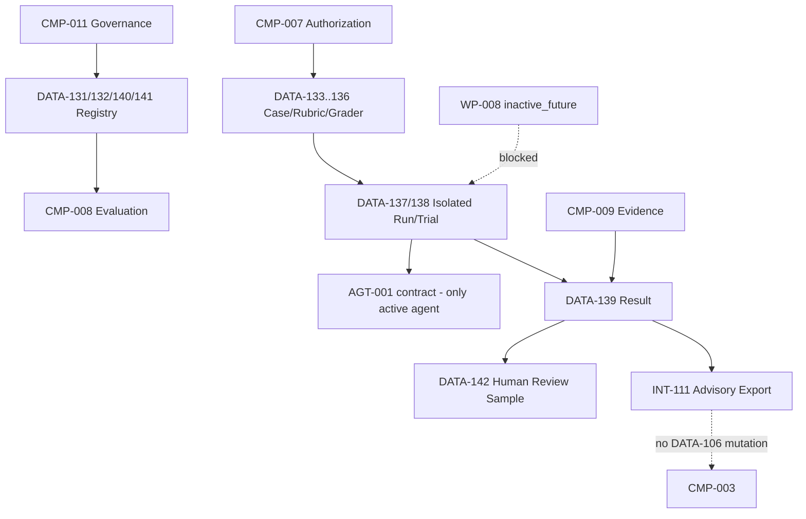

# 03 — Architecture Baseline (1.9.0 Overlay)

## Preserved baseline

`CMP-001`–`011`, exactly one active `AGT-001`, `AGT-001-spec 1.1.0`, `DATA-009 1.1.0`, `TOOL-001`–`006`, S07A bounded concurrency, S07B workloads and S07C inference/cache/speculation boundaries remain.

## Stage 8A change

`CMP-008` owns canonical evaluation suites, datasets, graders, isolated runs and advisory aggregation. `CMP-011` governs versions. `CMP-007` authorizes case materialization. `CMP-009` records evidence. `CMP-006` receives human-review assignments. `CMP-003` production ownership is unchanged.

## Cumulative architecture

Graph source: `docs/architecture/diagrams/GRAPH-001-v1.5.0.mmd`.
