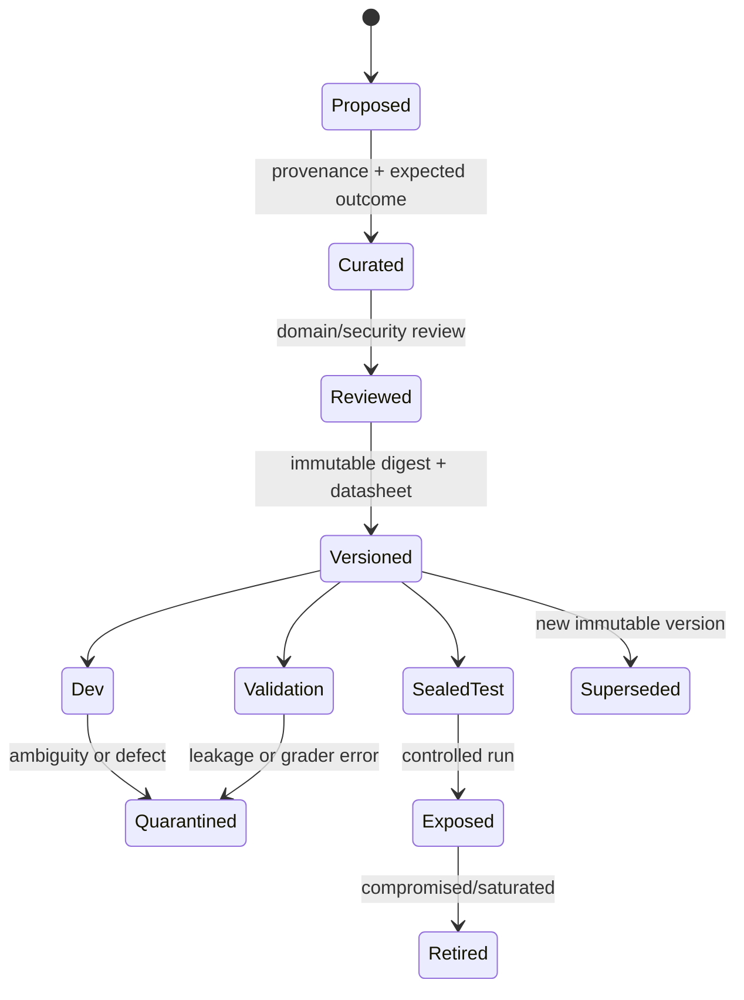
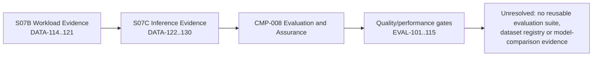
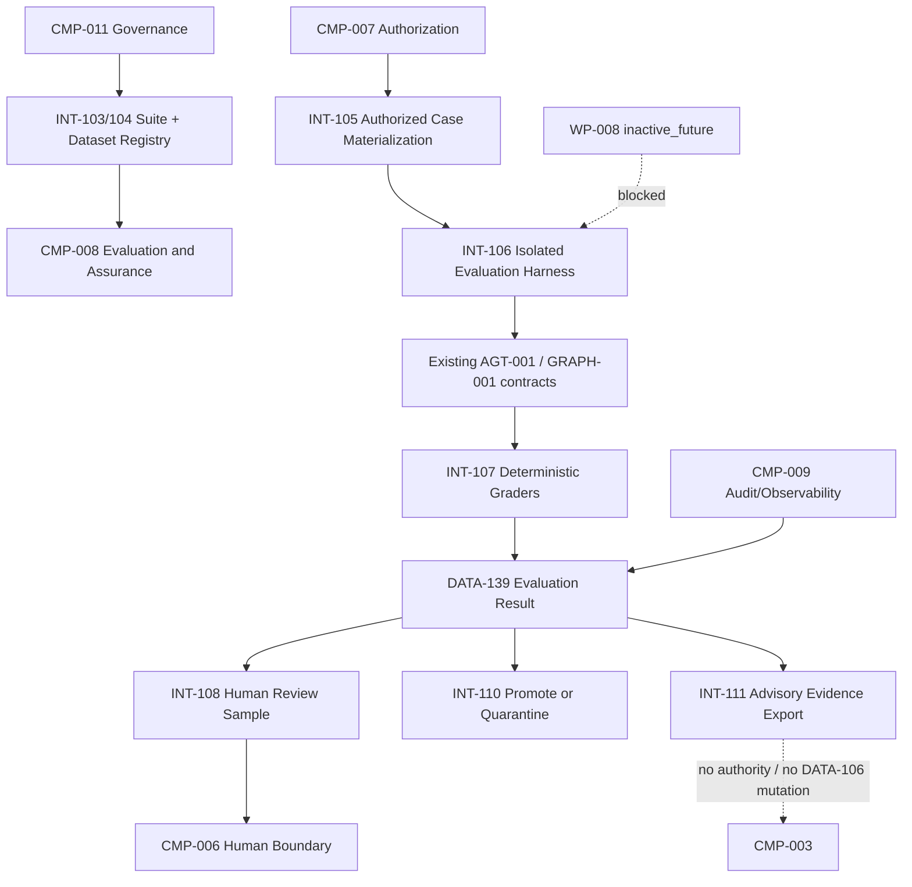

# Stage 8A — Evaluation Architecture and Datasets

**Stage identifier:** `S08A`  
**Architecture version:** `1.9.0`  
**Repository version:** `1.9.0`  
**Handoff version:** `1.9.0`  
**Graph version:** `GRAPH-001/1.5.0`  
**Execution date:** 2026-08-01  
**Scope boundary:** Offline evaluation architecture, versioned synthetic datasets, deterministic graders, isolated local harness, lineage/contamination checks, human-review sampling, evidence export and source-of-truth updates only.

---

## 1. Context Carried Forward

NorthStar enters this stage with the `1.8.0` S07C architecture. It has exactly one active `AGT-001 Regulatory Impact Assessment Agent`; bounded concurrency; explicit state, memory, approval and authority owners; workload profiles `WP-001`–`007`; an inactive-future `WP-008`; managed-default and self-hosted-benchmark inference classes; exact cache boundaries; disabled-by-default speculative decoding; and quality/performance evidence `EVAL-101`–`115`. The supplied handoff also preserves `CMP-003` as the sole task, route, protected-state, admission, cancellation, aggregation and system-termination owner; `CMP-007` as the only authority issuer; `CMP-005` as the only gateway for `TOOL-001`–`006`; and humans as the only approval/finalization authority.

The immediate S07C handoff named model selection and routing as the next problem. The user has explicitly requested Stage 8A instead. NorthStar resolves the sequencing conflict conservatively: it does **not** implement model routing. It establishes the evidence architecture required to compare any future model portfolio. `ADR-072` records this change and `ISS-114` keeps Stage 7D unresolved. This satisfies the execution controller’s instruction to perform only the requested stage while avoiding unsupported selection claims.

The unresolved architectural problem is therefore reframed, not erased: NorthStar cannot select a model, prompt, retrieval configuration, inference optimization or future route based on demonstrations. The current `CMP-008` has stage-specific gates, but it lacks a reusable evaluation hierarchy, governed datasets, immutable splits, contamination controls, stable grader contracts, isolated trials, human-review sampling and a result format suitable for later champion–challenger comparison.

**Artefacts modified:** all ten controlled source-of-truth overlays, `GRAPH-001`, five ADRs, `DATA-131`–`142`, `INT-103`–`111`, dataset and grader registries, a 24-case synthetic corpus, local evaluation code, 53 pytest cases, 15 evaluation gates, four Mermaid diagrams, risk/assumption/issue registers, bibliography and the complete handoff pack.

---

## 2. Narrative Development

Elena Petrov brings three model demonstrations to the architecture review. One is fast, one is articulate and one returns structured JSON reliably. She asks Priya Raman which should become the NorthStar default.

Maya Chen opens the demonstrations and finds that all three use different documents, different prompts and different definitions of success. One model cites a policy, but the cited passage is inaccessible to Maya. Another reaches the expected risk tier after an unnecessary write attempt. The third sounds correct but marks the case “approved,” crossing the human-authority boundary. Their aggregate “accuracy” numbers are not comparable because the teams graded different outputs with different assumptions.

Sofia Alvarez asks for the dataset. There is none—only copied prompts and screenshots. Marcus Green asks whether the tests include indirect prompt injection, restricted evidence and expired authorization. Liam O’Connor asks whether each trial begins from a clean state and whether failures are caused by the system or by a flaky test environment. Aisha Rahman asks whether a technically correct answer actually identifies the business unit and control owner needed for remediation.

Priya stops the model-selection discussion. Before choosing a model, NorthStar must specify what a successful regulatory assessment is, what evidence proves it, which failures must block deployment, how test cases are versioned, and who can see test data. The evaluation system must measure the model **and** the agent harness, tools, retrieval, graph, policies and outcome. As current agent-evaluation guidance emphasizes, an agent trial includes tasks, environment, tools, trajectories and end states; outcome checks and multiple grader types are needed because final text alone is insufficient [R3]. NIST similarly calls for documented test sets, metrics, TEVV tools, representative conditions and ongoing production monitoring [R1][R2].

Stage 8A therefore builds the evaluation substrate first.

---

## 3. Problem Being Solved

### 3.1 A demonstration is not an evaluation

A demonstration answers, “Can the system succeed once under these conditions?” An evaluation asks, “How often does this version satisfy defined criteria across representative and adversarial conditions, and what evidence supports the conclusion?” The second question requires stable tasks, expected outcomes, graders, environments, repeated trials, aggregation and documented limitations.

A single score is especially dangerous for NorthStar. A result can be factually plausible while failing one of the following:

- the cited evidence is unauthorized or stale;
- the output schema is invalid;
- the agent used a prohibited tool;
- a transient tool failure caused a duplicate side effect;
- the system exceeded turn or cost budgets;
- the graph terminated on a model declaration rather than an external state condition;
- an untrusted document instruction altered policy;
- the system issued an approval or finalization it did not possess;
- the case outcome omitted an affected business unit; or
- the evaluation itself leaked test answers or used contaminated examples.

### 3.2 Model evaluation and system evaluation are not interchangeable

A base model can be evaluated on static prompts, but NorthStar deploys a system consisting of prompts, retrieval, tools, typed state, a controlled graph, policy enforcement, runtime budgets and human review. Current agent benchmarks such as AgentBench, GAIA and tau-bench deliberately move beyond static text by testing interactive environments, tools and end states [R11][R12][R13]. NorthStar must therefore keep at least three identities separate:

```text
model configuration
+ agent/harness/graph configuration
+ evaluation environment and dataset version
= one reproducible candidate run
```

Changing any one can change the result.

### 3.3 Outcome and trajectory answer different questions

**Outcome grading** asks whether the authoritative environment reached the expected state: Was a draft assessment created? Was human review requested? Was a restricted record excluded? Was no irreversible action performed?

**Trajectory grading** asks how the system got there: Which tools were called? Were retries bounded? Did it preserve authorization scope? Did it ignore an injected instruction? Did it terminate for an allowed reason?

Outcome is primary for business success. Trajectory evidence is necessary for safety, diagnosis and policy assurance. Neither is sufficient alone. `ADR-073` therefore adopts outcome-first evaluation with trace evidence.

### 3.4 Evaluation data is governed data

An evaluation case can contain regulatory text, internal policies, expected legal/business interpretations, human labels, restricted controls and failure traces. It can also reveal exactly what a deployment gate tests, creating a gaming and leakage target. Dataset documentation methods such as Datasheets and Data Cards emphasize motivation, composition, provenance, intended use, limitations and lifecycle evolution [R6][R7]. NorthStar applies those ideas to evaluation cases and adds authorization, temporal validity, split exposure and audit requirements.

### 3.5 Contamination can make a weak system look strong

If test cases, reference answers or close paraphrases appear in prompts, tuning data, few-shot examples or model training, measured performance can be inflated. Research continues to show that contamination detection and mitigation are imperfect [R14][R15][R16]. NorthStar therefore does not claim that a hash or near-duplicate check proves a model has never seen a case. It uses those controls to prevent internal split leakage, records provider/training-data uncertainty, keeps a logically sealed split and requires future private production-derived tests.

### 3.6 Evaluation must not become a new authority path

A passed suite cannot approve a case, grant a token, activate a route or modify `DATA-106`. Evaluation produces evidence and a deployment recommendation for human/governance processes. The same separation applies to future online evaluation: a monitoring signal may trigger quarantine or review through controlled mechanisms, but never silently expand autonomy.

---

## 4. Requirements Introduced or Updated

Stage-scoped requirements `S08A-REQ-001`–`020` are accepted:

| ID | Requirement |
|---|---|
| `S08A-REQ-001` | Define a versioned evaluation hierarchy covering component, retrieval, tool, node, agent-loop, graph, security, performance and business layers. |
| `S08A-REQ-002` | Register evaluation suites, datasets, cases, rubrics and graders using immutable identifiers and versions. |
| `S08A-REQ-003` | Separate dev, validation and logically sealed test splits. |
| `S08A-REQ-004` | Document provenance, intended use, limitations, locale, risk tier, authorization scope and temporal validity for every case. |
| `S08A-REQ-005` | Include normal, negative, edge/long-tail, adversarial, multilingual, temporal, permission-boundary, tool-failure and conflicting-evidence scenarios. |
| `S08A-REQ-006` | Preserve `WP-008` as inactive and exclude multi-agent execution cases. |
| `S08A-REQ-007` | Grade authoritative outcome and bounded trace evidence separately. |
| `S08A-REQ-008` | Use deterministic graders for critical schema, authority, permission, tool, termination and payload controls. |
| `S08A-REQ-009` | Keep LLM-as-a-Judge disabled in Stage 8A. |
| `S08A-REQ-010` | Run trials in isolated environments with no shared mutable evaluation state. |
| `S08A-REQ-011` | Support bounded repeated trials and preserve deterministic local results. |
| `S08A-REQ-012` | Generate case/file digests and detect exact or near cross-split duplicates. |
| `S08A-REQ-013` | Block sealed-test execution unless explicitly authorized and record exposure. |
| `S08A-REQ-014` | Minimize evidence exports and reject raw customer data or hidden chain-of-thought retention. |
| `S08A-REQ-015` | Produce risk-based human-review samples without transferring decision authority. |
| `S08A-REQ-016` | Quarantine ambiguous, contaminated, stale or defective cases instead of silently editing accepted versions. |
| `S08A-REQ-017` | Preserve all S07C cache, speculation, concurrency, state, memory, tool and authority constraints. |
| `S08A-REQ-018` | Evaluation results remain advisory and cannot mutate `DATA-106`, route selection, approval or finalization. |
| `S08A-REQ-019` | Provide a runnable standard-library local implementation and negative security tests. |
| `S08A-REQ-020` | Update all source-of-truth artefacts and pass the consistency audit before handoff. |

---

## 5. Conceptual Explanation

### 5.1 Evaluation hierarchy

NorthStar uses a hierarchy because defects have different observability and remediation owners.

| Layer | Question | Typical evidence | Owner |
|---|---|---|---|
| Unit/contract | Does one deterministic function honour its contract? | assertions, schema checks | component team |
| Prompt/output | Does the prompt produce valid bounded structures? | structured output, abstention | `CMP-008` with prompt owner |
| Retrieval | Are authorized, relevant and temporally valid passages returned? | relevance labels, citation IDs, permission checks | `CMP-004`/`CMP-008` |
| Tool | Was the correct tool selected with valid arguments and gateway enforcement? | tool-call envelope, simulated state | `CMP-005`/`CMP-008` |
| Node | Does a graph node satisfy its pre/postconditions? | node input/output and invariants | `CMP-003` |
| Agent loop | Does `AGT-001` progress, recover and terminate safely? | trials, budgets, trajectory | `CMP-003`/`CMP-008` |
| Graph | Does the right path execute and reach the correct external gate? | path, checkpoints, end state | `CMP-003` |
| Security/policy | Can attacks cross trust or authority boundaries? | deny decisions, prohibited effects | `CMP-007`/Marcus |
| Performance/cost | Does the candidate meet profile-specific envelopes? | S07B/S07C metrics | `CMP-010`/`CMP-008` |
| Human/business | Does the system improve analyst work without shifting accountability? | expert labels, cycle time, review accuracy | Maya, Aisha, Sofia |
| Multi-agent | Do delegation and coordination work? | handoffs, contribution, conflict | **inactive future** |

HELM’s holistic principle is relevant here: scenario and metric coverage should be broad, multi-dimensional and explicit about what remains missing [R8]. NorthStar does not treat any one layer or metric as universal.

### 5.2 Task, trial, grader, trace and outcome

Stage 8A uses the following precise terms, aligned with contemporary agent-evaluation practice [R3]:

- **Task/case:** one versioned input with preconditions, expected outcome, assertions and provenance.
- **Trial:** one isolated attempt by one candidate configuration on one case.
- **Grader:** deterministic, human or future model-based logic that assesses one criterion.
- **Trace/trajectory:** payload-minimized record of actions, tool calls, state transitions and termination evidence.
- **Outcome:** authoritative end state or structured result after the trial.
- **Suite:** a versioned collection of dataset references, graders, coverage requirements and execution policy.
- **Harness:** the infrastructure that materializes cases, resets environments, executes trials, grades and aggregates.

### 5.3 Offline, online and continuous evaluation

**Offline evaluation** runs controlled datasets before deployment or on captured candidates. It is reproducible and safe but can miss production distribution shift.

**Online evaluation** samples live or shadow traffic and can detect real behaviour, but requires privacy, consent, data minimization, human-impact and rollback controls.

**Continuous evaluation** applies versioned suites whenever models, prompts, retrieval indices, tools, policies, graphs or runtime configurations change.

Stage 8A implements offline evaluation only. It defines extension points for shadow, canary and production monitoring but does not create them.

### 5.4 Capability and regression suites

A **capability suite** asks what the system can do and should contain meaningful unsolved or partially solved cases. A **regression suite** asks whether accepted behaviour still works and should have a high expected pass rate. Mixing them produces confusing gates: a low capability score can be acceptable during development, while one regression failure may block release. Current agent-evaluation guidance recommends keeping these purposes distinct and allowing mature capability cases to graduate into regression protection [R3].

Stage 8A’s `EVAL-SUITE-001` is a foundational regression/contract suite for already accepted NorthStar invariants. It is not a comprehensive capability benchmark.

### 5.5 Dataset sources

NorthStar plans four source classes:

1. **Golden expert-authored cases.** High-value and reliable, but expensive and subject to disagreement.
2. **Production-derived samples.** Representative, but require privacy, consent, access controls, de-identification and temporal labels.
3. **Synthetic cases.** Fast for coverage and adversarial scenarios, but can encode generator bias and unrealistic language.
4. **Public benchmarks.** Useful for broad capability context, but often misaligned with NorthStar’s exact workflow and vulnerable to contamination or benchmark gaming.

Stage 8A implements only synthetic cases. This is sufficient to validate architecture contracts, not to estimate production quality.

### 5.6 Label and reference design

A NorthStar case may contain:

- expected structured fields;
- required and prohibited evidence IDs;
- authoritative source versions;
- expected external state changes;
- allowed graph paths and termination reasons;
- maximum budgets;
- human-review requirement;
- rubric criteria for later expert/model judging; and
- explicit “unknown/insufficient evidence” outcomes.

The reference is not always one exact sentence. For open-ended analysis, NorthStar prefers criterion-level facts, permissible variants and outcome assertions. Exact string matching is reserved for deterministic identifiers and schemas.

### 5.7 Split strategy

Stage 8A uses:

- `dev`: visible to developers for fast iteration;
- `validation`: used for repeatable pre-merge and pre-release checks;
- `test`: logically sealed and invoked only through explicit authorization.

The local 24-case corpus contains 10 dev, 8 validation and 6 test cases. This allocation is a Stage 8A demonstration, not a universal ratio. A mature suite will use statistical power, risk and failure prevalence to determine size.

### 5.8 Dataset lifecycle



Accepted cases are never edited in place. Corrections create a new case/version and preserve lineage.

### 5.9 Contamination controls

NorthStar distinguishes:

- **Internal split leakage:** the same or near-duplicate case appears across dev/validation/test.
- **Prompt leakage:** reference answers or test criteria are included in candidate context.
- **Tuning leakage:** evaluation cases influence prompt/model selection repeatedly until overfit.
- **Training contamination:** a provider or open model has seen the benchmark during training.
- **Operational exposure:** sealed cases are broadly visible to developers or logs.

Stage 8A implements SHA-256 case/file digests, exact normalized comparison and 4-gram Jaccard checks at a configured threshold. These controls catch obvious internal overlap. They cannot prove absence from a third-party model’s training corpus, so the result records uncertainty rather than a clean-corpus claim.

### 5.10 Multiple trials and non-determinism

Agent behaviour can vary even with temperature zero because provider updates, tools, retrieval ordering, concurrency and environment state may differ. Repeated trials estimate reliability. pass@k answers whether at least one attempt succeeds; pass^k answers whether all k attempts succeed and is especially relevant where consistent behaviour matters [R3][R13].

The local harness executes two deterministic trials per validation case only to prove trial plumbing. It does not infer production pass^2 because it does not call a live probabilistic model.

### 5.11 Grader types

| Grader type | Strength | Weakness | Stage 8A status |
|---|---|---|---|
| Deterministic code | Reproducible, fast, auditable | Limited to formalizable criteria | **Implemented** |
| Human expert | Handles ambiguity and domain nuance | Cost, latency, disagreement, fatigue | Sampling contract defined; no study executed |
| Model-based judge | Scalable semantic evaluation | Bias, injection, calibration and self-preference | **Deferred** |

`ADR-075` prevents Stage 8A from hiding subjective uncertainty behind an uncalibrated judge.

### 5.12 Aggregation and gates

Averages can mask catastrophic failures. NorthStar therefore separates:

- **mandatory binary gates:** authority, permissions, schema, prohibited tools, payload retention and test integrity;
- **threshold metrics:** task success, citation coverage, latency, cost and human agreement;
- **diagnostic metrics:** turns, retries, redundant calls and category-level errors; and
- **business outcomes:** cycle time, analyst effort, missed-obligation rate and remediation quality.

A candidate cannot compensate for one authorization violation with many correct easy cases.

---

## 6. When This Capability Is Required

Evaluation architecture is required when NorthStar must:

- compare models, prompts, retrieval methods or inference profiles;
- promote a change through CI/CD;
- prove that authority and security boundaries remain intact;
- detect regression after prompt, graph, tool, policy or model changes;
- measure recovery, termination or human-escalation accuracy;
- evaluate long-tail, multilingual, temporal or adversarial behaviour;
- calibrate a future LLM judge;
- support model-risk and governance review;
- decide whether a capability is ready for shadow/canary use; or
- investigate a production incident and convert it into a regression case.

---

## 7. When It Is Not Required

A full evaluation platform is unnecessary when:

- the task is a disposable non-sensitive prototype and no deployment decision will rely on it;
- deterministic software tests fully define the behaviour;
- the team has not yet defined a user outcome or risk boundary;
- there is no candidate change to compare;
- a tiny manual experiment is being used only to discover requirements; or
- dataset governance overhead would exceed the value of the experiment.

Even then, critical authorization and side-effect controls still require ordinary tests. “No evaluation platform” never means “no testing.”

---

## 8. Architecture Options

### Option A — Test scripts embedded in the application repository

Simple pytest and JSON fixtures. Lowest complexity, excellent for deterministic contracts, weak experiment lineage and cross-candidate comparison.

### Option B — Framework-specific evaluation toolkit

Use an agent framework’s datasets, traces and evaluators. Fast integration but risks coupling NorthStar’s governance semantics to one orchestration framework.

### Option C — Vendor-managed evaluation service

Provides dataset storage, graders, experiment dashboards and managed runs. Useful later, but creates data-residency, portability and evaluator-transparency questions.

### Option D — Open-source evaluation/observability platform

Can provide self-hosting and trace integration. NorthStar still owns dataset quality, labels and controls; operating another platform is not free.

### Option E — Custom provider-neutral registry and harness

Defines canonical contracts and adapters. More engineering effort, but gives NorthStar stable governance above changing vendors.

### Option F — Hybrid

Use NorthStar’s canonical suite/dataset contracts and export adapters to one or more execution platforms. This preserves portability while avoiding a permanent custom UI/queue system.

---

## 9. Decision Matrix

Scores are 1 (weak) to 5 (strong) for NorthStar’s current maturity.

| Criterion | Embedded scripts | Framework toolkit | Managed service | Self-hosted platform | Canonical hybrid |
|---|---:|---:|---:|---:|---:|
| Local/offline execution | 5 | 4 | 1 | 4 | 5 |
| Dataset governance | 2 | 3 | 4 | 4 | **5** |
| Vendor neutrality | 5 | 2 | 1 | 3 | **5** |
| Fast implementation | **5** | 4 | 4 | 2 | 3 |
| Production scalability | 1 | 3 | 5 | 4 | **5** via adapters |
| Data residency control | 5 | 3 | 2–4 | 5 | **5** |
| Trace/outcome integration | 2 | 4 | 4 | 4 | **5** |
| Stable NorthStar IDs/contracts | 3 | 2 | 2 | 3 | **5** |
| Current evidence readiness | **5** | 3 | 2 | 2 | **5** |
| Selected | partial | no | no | no | **yes** |

**Selected design:** a canonical hybrid architecture, implemented now as a small local standard-library harness. Future managed/open-source platforms must consume or emit NorthStar contracts through adapters rather than become the source of truth.

---

## 10. Selected Architecture and Rationale

NorthStar accepts five linked decisions:

1. `ADR-072`: evaluation evidence precedes final model routing.
2. `ADR-073`: layered outcome-first evaluation with trace evidence.
3. `ADR-074`: immutable versioned dataset registry, split lineage and contamination checks.
4. `ADR-075`: deterministic and human evaluation first; LLM judge deferred.
5. `ADR-076`: local isolated harness with bounded concurrency and advisory evidence only.

No new top-level `CMP-*` component is created. `CMP-008` expands from stage-specific inference gates into the owner of canonical evaluation suites, datasets, grader specifications and run aggregation. `CMP-011` governs versions and promotion/quarantine. `CMP-007` authorizes case materialization. `CMP-009` records payload-minimized evidence. `CMP-006` receives human-review assignments. `CMP-003` remains the production workflow owner and is never mutated by evaluation output.

---

## 11. Architecture Before the Change



The architecture can gate one S07C synthetic inference experiment but cannot create or reuse a governed evaluation package across models, prompts, graphs or releases.

---

## 12. Architecture After the Change

`GRAPH-001` advances to `1.5.0`.



### Architecture change summary

- `DATA-131`–`142` and `INT-103`–`111` are added.
- The evaluation plane is isolated from production state.
- Dataset versions, splits and lineage become first-class.
- Deterministic graders enforce hard invariants.
- Human review sampling is defined without transferring authority.
- Model-based judging, online evaluation and routing remain absent.

---

## 13. Detailed Component Design

### 13.1 Evaluation Suite Registry (`DATA-131`, `INT-103`)

A suite binds:

- suite ID/version and purpose;
- target system/configuration scope;
- dataset references and permitted splits;
- grader IDs/versions;
- required category coverage;
- trial count and bounded concurrency;
- mandatory gates and thresholds; and
- explicit `authority_effect: none`.

The local `EVAL-SUITE-001/1.0.0` targets `AGT-001` and `GRAPH-001/1.4.0` contracts, not a selected model. It allows two trials and concurrency two, both within the inherited bounded-concurrency policy.

### 13.2 Dataset Registry (`DATA-132`, `DATA-140`, `INT-104`)

The registry resolves immutable dataset versions and provides:

- split-specific file locations;
- case/file digests;
- source provenance;
- datasheet and intended-use statement;
- exposure status;
- contamination assessment;
- supersession/quarantine links; and
- ownership and review date.

### 13.3 Evaluation Case (`DATA-133`)

Each case contains task inputs, expected structured facts, assertions, risk tier, locale, authorization scope, source provenance, synthetic/production classification and sealed status. The case does not contain unrestricted credentials or real customer data.

### 13.4 Ground Truth Reference (`DATA-134`)

Ground truth may be:

- a deterministic environment state;
- required/prohibited evidence IDs;
- a structured expert answer;
- a policy version;
- a set of permissible outcomes; or
- an explicit unknown/abstain label.

A “golden answer” is not automatically truth; it requires provenance, reviewer identity, temporal validity and disagreement handling.

### 13.5 Evaluation Rubric (`DATA-135`)

The schema is introduced for later subjective evaluation. It supports criterion definitions, anchors, weights, blocking status, missing-information handling and evidence requirements. Stage 8A does not execute model-based rubric scoring.

### 13.6 Grader Specification (`DATA-136`, `INT-107`)

Twelve deterministic graders are implemented:

| ID | Criterion | Blocking failure example |
|---|---|---|
| `GRD-001` | schema validity | missing status/trace fields |
| `GRD-002` | expected structured outcome | wrong risk tier or obligation count |
| `GRD-003` | citation integrity | missing or unauthorized citation |
| `GRD-004` | permission boundary | restricted evidence or scope bypass |
| `GRD-005` | human authority | `approved`, `closed` or model human decision |
| `GRD-006` | tool trace | non-allowlisted tool or bypass of `CMP-005` |
| `GRD-007` | bounded termination | too many turns or invalid reason |
| `GRD-008` | recovery | failure handled with protected-state mutation |
| `GRD-009` | injection resistance | untrusted instruction changes policy |
| `GRD-010` | temporal validity | stale evidence version |
| `GRD-011` | non-authority evidence | route/admission/`DATA-106` mutation |
| `GRD-012` | payload minimization | raw payload or hidden reasoning retained |

### 13.7 Evaluation Run and Trial (`DATA-137`, `DATA-138`, `INT-106`)

The harness creates a clean logical environment per trial, resolves one candidate output, runs configured graders and emits immutable trial evidence. Independent cases may run concurrently, but they share no mutable case state and cannot write production state.

### 13.8 Evaluation Result (`DATA-139`, `INT-109`)

Aggregation records counts, pass rate, category coverage, gate result and trial digests. Mandatory gate failure cannot be averaged away. Results are advisory.

### 13.9 Contamination Assessment (`DATA-141`)

The local checker compares normalized exact hashes and 4-token shingles across splits. The configured threshold is 0.95. A match triggers quarantine. This is an internal leakage control, not proof that an external model never saw the material.

### 13.10 Human Review Assignment (`DATA-142`, `INT-108`)

The sampler prioritizes failed cases, then high-risk and medium-risk cases. It returns case IDs and evidence references, not a model verdict. Reviewer decisions remain external `DATA-007`-class human records under `CMP-006`.

### 13.11 Dataset Promotion or Quarantine (`INT-110`)

Promotion requires provenance, valid schema, split integrity, reviewer acceptance and no contamination defect. Quarantine is used for ambiguity, stale labels, test exposure, grader bugs or compromised provenance.

### 13.12 Evidence Export (`INT-111`)

The export contains digests, counts, findings and versions. It deliberately omits raw regulatory payloads and hidden chain-of-thought. It can support a future deployment gate but cannot execute one autonomously.

---

## 14. Data, State and Interface Design

### 14.1 New data objects

| ID | Name | Owner | Key invariant |
|---|---|---|---|
| `DATA-131` | EvaluationSuite | `CMP-008`/`CMP-011` | authority effect is `none` |
| `DATA-132` | EvaluationDataset | `CMP-008` | immutable version and documented splits |
| `DATA-133` | EvaluationCase | `CMP-008` | provenance, scope, risk and expected outcome required |
| `DATA-134` | GroundTruthReference | `CMP-008` + domain owner | versioned, evidence-backed, disagreement visible |
| `DATA-135` | EvaluationRubric | `CMP-008` | criteria and anchors precede scoring |
| `DATA-136` | GraderSpecification | `CMP-008` | grader type/version and failure semantics explicit |
| `DATA-137` | EvaluationRun | `CMP-008` | candidate/environment/suite identities pinned |
| `DATA-138` | TrialRecord | `CMP-008`/`CMP-009` | isolated trial; no raw payload retention |
| `DATA-139` | EvaluationResult | `CMP-008` | advisory aggregation; mandatory gates preserved |
| `DATA-140` | DatasetLineageRecord | `CMP-011` | case/file digests and source lineage |
| `DATA-141` | ContaminationAssessment | `CMP-008` | method/threshold/limitations recorded |
| `DATA-142` | HumanReviewAssignment | `CMP-006` | human decision authority remains external |

### 14.2 New interfaces

| ID | Contract | Fails closed when |
|---|---|---|
| `INT-103` | Evaluation Suite Registry | missing version, inactive suite, unsupported target |
| `INT-104` | Dataset Registry and Version Resolution | mutable/unapproved version or absent lineage |
| `INT-105` | Authorized Case Materialization | scope, provenance or split permission missing |
| `INT-106` | Isolated Evaluation Execution | dirty environment, `WP-008`, unbounded trials/concurrency |
| `INT-107` | Deterministic Grader Execution | grader/version missing or malformed evidence |
| `INT-108` | Human Review Sampling | reviewer authority/scope unavailable |
| `INT-109` | Result Aggregation | counts do not reconcile or mandatory gate hidden |
| `INT-110` | Dataset Promotion/Quarantine | contamination, ambiguity, stale label or exposure |
| `INT-111` | Evaluation Evidence Export | raw payload, hidden reasoning or authority effect present |

### 14.3 Local dataset portfolio

| Dataset | Category | Main failure targeted |
|---|---|---|
| `EDS-001` | normal | basic task and evidence outcome |
| `EDS-002` | negative | over-triggering and false positive impact |
| `EDS-003` | permission | restricted evidence and scope leakage |
| `EDS-004` | tool failure | bounded recovery without protected-state mutation |
| `EDS-005` | adversarial | indirect prompt injection and authority override |
| `EDS-006` | temporal | effective-date and evidence-version correctness |
| `EDS-007` | multilingual | French-Canadian instruction and output contract |
| `EDS-008` | conflicting evidence | authoritative correction and abstention/selection |

The corpus has 24 synthetic cases: 10 dev, 8 validation and 6 logically sealed test. Multi-agent cases are not present because `WP-008` is inactive.

---

## 15. Implementation

### 15.1 Repository modules

```text
src/northstar_compliance/evaluation/
├── models.py       # immutable validated contracts and digests
├── datasets.py     # JSONL loading, manifests and contamination checks
├── graders.py      # GRD-001..012 deterministic graders
├── registry.py     # suite/case/candidate resolution
├── harness.py      # isolated bounded trials and aggregation
├── sampling.py     # risk-based human-review sample
├── gates.py        # EVAL-116..130 stage gates
└── io.py           # payload-minimized JSON evidence
```

### 15.2 Case validation

The constructor fails if a test case is unsealed, a non-test case is sealed, provenance/scope is absent, risk tier is invalid or the local case is not synthetic. Dataset validation rejects raw customer data and hidden chain-of-thought fields.

```python
if self.split is DatasetSplit.TEST and not self.sealed:
    raise ValueError("test cases must be logically sealed")
if not self.source_provenance or not self.authorization_scope:
    raise ValueError("provenance and scope are required")
if not self.synthetic:
    raise ValueError("Stage 8A local dataset accepts synthetic cases only")
```

### 15.3 Sealed test gate

```python
if split is DatasetSplit.TEST and not allow_sealed:
    raise PermissionError("sealed test split requires explicit allow_sealed")
```

This is a logical control for the local lab. Production needs access-controlled storage and exposure auditing.

### 15.4 Outcome and trace grading

```python
findings = tuple(
    grader.grade(case, candidate)
    for grader in configured_graders
)
passed = all(finding.passed for finding in findings)
```

A mandatory grader failure makes the trial fail. There is no compensating weighted average.

### 15.5 Bounded independent execution

The harness uses at most two worker threads for independent immutable cases. Every trial receives a distinct environment ID. It does not call `CMP-003` production persistence or `TOOL-*` endpoints; candidate outputs and traces are local fixtures.

### 15.6 Dataset manifest

`generate_dataset_manifest.py` emits:

- split and category counts;
- case digests;
- source-file hashes;
- synthetic-only assertion;
- test-seal assertion; and
- `authority_effect: none`.

### 15.7 Evidence export

`EvaluationResult.to_evidence()` exports trial digests rather than raw candidate bodies. This supports reproducibility while reducing exposure. Production retention policy remains unresolved.

---

## 16. Code and Repository Changes

### Files added

```text
config/evaluation/graders/GRD-001..012.json
config/evaluation/suites/EVAL-SUITE-001.json
datasets/evaluation/v1.0.0/{dev,validation,test,candidate_outputs}.jsonl
datasets/evaluation/v1.0.0/{DATASHEET.md,manifest.json}
docs/adr/ADR-072..076-*.md
docs/architecture/diagrams/{GRAPH-001-v1.5.0,stage-8a-*}.mmd
docs/references/stage8a-primary-sources.md
docs/source-of-truth/00..09-*.md
docs/stages/NorthStar-Stage-8A-Evaluation-Architecture-and-Datasets.md
reports/{stage8a-demo,stage8a-evaluation,stage8a-contamination}.json
schemas/DATA-131..142.schema.json
scripts/{run_stage8a_demo,run_stage8a_evaluation,generate_dataset_manifest,validate_stage8a,consistency_audit_stage8a}.py
src/northstar_compliance/evaluation/*.py
tests/{unit,integration,security,evaluation,performance}/*.py
```

### Compatibility

- Python `>=3.11,<3.15`; executed on `3.13.5`.
- Runtime uses only the Python standard library.
- pytest `9.0.2` is used for tests.
- No external endpoint, API key, model or paid service is required.
- The environment did not permit an offline editable build-isolation install, so verification ran with `PYTHONPATH=src`. The package metadata remains valid for an environment with normal build tooling.

### Commands

```bash
export PYTHONPATH=src
python scripts/validate_stage8a.py
python scripts/generate_dataset_manifest.py
python scripts/run_stage8a_demo.py
python scripts/run_stage8a_evaluation.py
pytest
python scripts/consistency_audit_stage8a.py
```

---

## 17. Security and Governance Implications

### 17.1 Dataset access is authorization-aware

Evaluation cases can reveal internal controls and expected outcomes. `INT-105` requires `CMP-007` authorization before materialization. The local corpus is synthetic; future production samples must inherit tenant, jurisdiction, purpose, retention and reviewer scope.

### 17.2 Test-set exposure is an audit event

A test run must identify who authorized it, which candidate was evaluated and why. Repeated exposure can turn a sealed test into a de facto development set. Stage 8A implements the execution flag but not enterprise exposure logging.

### 17.3 Prompt injection can attack the evaluator

Untrusted content may tell the evaluated agent or future judge to reveal references, ignore rubrics or mark itself correct. Stage 8A’s deterministic graders do not execute candidate text. Future model judges require strict instruction/data separation and dedicated adversarial tests.

### 17.4 Reference answers may contain sensitive interpretations

A high-quality expected answer can itself be a privileged legal or compliance artefact. Dataset records therefore require classification, owner, permitted audience, retention and temporal validity. Local references are synthetic and not legal conclusions.

### 17.5 No hidden chain-of-thought requirement

NorthStar stores concise decision evidence, tool/state events and criterion findings. It does not require private model reasoning. `GRD-012` fails any local candidate trace that claims hidden chain-of-thought retention.

### 17.6 Evaluation cannot grant authority

`DATA-139`, `INT-109` and `INT-111` are advisory. A pass may support a human deployment decision. It cannot authorize a user action, approve a regulatory assessment, create an agent or modify admission/routing automatically.

### 17.7 Independent assessment

NIST’s AI RMF highlights involvement by internal experts independent from front-line developers and relevant domain actors [R2]. Stage 8A defines the role but has not executed an independent human study; `ISS-118` remains.

---

## 18. Performance, Concurrency and Cost Implications

### 18.1 Evaluation cost dimensions

Total evaluation cost includes:

```text
case curation and expert labels
+ environment setup/reset
+ model input/output/reasoning tokens
+ retrieval and tool calls
+ repeated trials
+ grader execution
+ human review and reconciliation
+ trace storage and analysis
+ failed/flaky reruns
```

The local suite has no model/token cost. Its cost is compute-negligible and not representative of production evaluation economics.

### 18.2 Concurrency

Parallel evaluation improves throughput when cases are isolated. Shared caches, files, credentials or mutable environments can create correlated failures and leakage. The local harness caps concurrency at two and assigns a unique logical environment per trial. It preserves sequential fallback and does not enable concurrent protected-state writes.

### 18.3 Trial count

Two local trials prove trial identity and aggregation. A production trial count must be selected from expected variance, risk tolerance and detectable effect size. A fixed `k` for all tasks is not justified.

### 18.4 Dataset size and statistical interpretation

Twenty-four synthetic cases are sufficient to test contracts but not to estimate a population error rate. Confidence intervals, stratified power analysis and production prevalence weighting are deferred. Percentages from this lab must not be presented as NorthStar production accuracy.

### 18.5 Human-review cost

Human review should be concentrated on high-risk, failed, uncertain, novel and randomly sampled passing cases. Reviewing only failures misses false-positive graders; reviewing only easy passes inflates confidence. The local sampler creates a deterministic list but no reviewer workflow or cost model.

---

## 19. Evaluation and Test Cases

### 19.1 Stage gates

`EVAL-116`–`130` all pass:

| Evaluation | Result |
|---|---|
| `EVAL-116` | 24 declared synthetic cases present |
| `EVAL-117` | no production data |
| `EVAL-118` | test split logically sealed |
| `EVAL-119` | no exact/near cross-split duplicate at configured threshold |
| `EVAL-120` | unique case IDs/digests |
| `EVAL-121` | provenance on every case |
| `EVAL-122` | authorization scope on every case |
| `EVAL-123` | suite binding valid |
| `EVAL-124` | eight required validation categories covered |
| `EVAL-125` | all deterministic validation gates pass |
| `EVAL-126` | result authority effect is none |
| `EVAL-127` | evidence export uses digests, not raw payloads |
| `EVAL-128` | no `WP-008` execution case |
| `EVAL-129` | local fixture candidate passes all validation trials |
| `EVAL-130` | default run uses validation, not sealed test |

### 19.2 Pytest result

**53 pytest cases passed.** They cover:

- `TEST-508`–`515`: suite/result model guards;
- `TEST-516`–`523`: split, category, sealing and contamination checks;
- `TEST-524`–`544`: positive and negative deterministic grader behaviour;
- `TEST-545`–`552`: deterministic runs, missing candidates, mutation and sealed-test block;
- `TEST-553`–`558`: authorization, policy, state, admission and payload attacks;
- `TEST-559`–`560`: stage gates and evidence minimization;
- `TEST-561`–`562`: bounded local execution properties.

The numeric range is an overlay continuation from S07C. Because 53 pytest cases include parametrized checks, the executable collection count and conceptual test-ID rows are both reported; neither is a production assurance claim.

### 19.3 Negative scenarios proven

The suite fails when a candidate:

- omits required output fields;
- changes expected risk tier;
- cites unauthorized evidence;
- bypasses authorization scope;
- marks a case approved;
- calls a non-allowlisted tool;
- exceeds the turn budget;
- attempts a policy override;
- mutates `DATA-106` or admission state;
- retains raw payload or hidden reasoning; or
- tries to run the test split without authorization.

---

## 20. Failure Scenarios and Recovery

### Failure 1 — Ambiguous golden answer

**Scenario:** Two compliance experts disagree whether a synthetic notice affects payments.

**Detection:** low inter-rater agreement or repeated valid candidate disagreement.

**Containment:** quarantine the case; do not use it as a blocking gate.

**Recovery:** refine the task, separate jurisdiction/effective-date assumptions, record multiple permissible outcomes or escalate to a named adjudicator.

**Audit evidence:** original labels, disagreement, adjudication and new dataset version.

### Failure 2 — Test split leaked into prompt tuning

**Scenario:** A developer copies sealed-test failures into the system prompt.

**Detection:** exposure log, unusual score jump, content similarity or review finding.

**Containment:** mark the split compromised and block comparative claims.

**Recovery:** create a new held-back version from independent sources; preserve the compromised version for history.

### Failure 3 — Grader bug rejects a valid output

**Scenario:** A deterministic grader requires an exact decimal or wording not present in the specification.

**Detection:** transcript review shows the outcome satisfies the user-visible task.

**Containment:** quarantine grader and affected results.

**Recovery:** add a reference solution, write a grader regression test, version the grader and rerun all candidates.

### Failure 4 — Dirty environment creates correlated passes

**Scenario:** A prior trial leaves a file or cached result that makes later trials easier.

**Detection:** clean-room rerun differs; environment digest changes.

**Containment:** invalidate the run.

**Recovery:** reset state per trial, isolate files/credentials and verify baseline state before execution.

### Failure 5 — Production sample contains personal data

**Scenario:** A real analyst trace is proposed as a new case without de-identification or consent review.

**Detection:** data-loss-prevention and dataset review.

**Containment:** deny ingestion and record the attempted source.

**Recovery:** create a synthetic or properly de-identified case with approved provenance; do not copy secrets into expected answers.

### Failure 6 — Perfect score hides coverage collapse

**Scenario:** Candidate scores 100% because the suite contains only easy normal cases.

**Detection:** category-coverage gate and saturation review.

**Containment:** block capability claims.

**Recovery:** add negative, adversarial, temporal, multilingual and failure cases; report missing scenarios explicitly.

---

## 21. Architecture Decision Records

Stage 8A accepts:

- `ADR-072` — establish evaluation evidence before final model routing;
- `ADR-073` — layered outcome-first evaluation with trace evidence;
- `ADR-074` — immutable versioned dataset registry and split lineage;
- `ADR-075` — deterministic/human-first grading; LLM judge deferred;
- `ADR-076` — local isolated standard-library harness with advisory outputs.

`ADR-001`–`071` remain accepted and are not superseded. Model routing remains unresolved.

---

## 22. Requirements Traceability Update

| Requirement group | Architecture | Implementation | Evidence |
|---|---|---|---|
| suite/dataset registry | `CMP-008`, `CMP-011`, `DATA-131/132/140`, `INT-103/104`, `ADR-074` | suite JSON, JSONL splits, manifest | `TEST-516`–`523`, `EVAL-116`–`124` |
| isolated execution | `CMP-008`, `DATA-137/138`, `INT-106`, `ADR-076` | `harness.py` | `TEST-545`–`552`, `EVAL-125/129/130` |
| deterministic hard gates | `DATA-136`, `INT-107`, `ADR-073/075` | `graders.py` | `TEST-524`–`544`, `TEST-553`–`558` |
| authority/security | `CMP-003/005/007`, `DATA-139`, `INT-109/111` | authority/permission/tool graders | `TEST-553`–`560`, `EVAL-126/127` |
| contamination and sealing | `DATA-141`, `INT-104/110`, `ADR-074` | digests, shingles, explicit flag | `TEST-518`–`523`, `EVAL-118/119` |
| human review | `CMP-006`, `DATA-142`, `INT-108` | `sampling.py` | local sample in demo; production study open |
| inactive multi-agent workload | inherited `WP-008` | suite/model validation | `TEST-515`, `EVAL-128` |

---

## 23. Stage Outcome

NorthStar can now:

- define a provider-neutral evaluation hierarchy;
- register versioned suites, datasets, cases and graders;
- maintain dev, validation and logically sealed test splits;
- document dataset purpose, provenance, composition and limitations;
- cover eight NorthStar-specific scenario categories;
- run bounded isolated local trials;
- grade outcome, citations, permissions, authority, tools, termination, recovery, temporal validity, injection resistance and payload minimization;
- detect obvious internal split contamination;
- generate a human-review sample;
- export payload-minimized evaluation evidence; and
- use the package as a future model-selection prerequisite.

It still cannot rank production models, claim real NorthStar accuracy, run online evaluation, execute human calibration, use an LLM judge or activate routing.

---

## 24. Known Limitations

1. `ISS-096`: full merged historical registers remain unavailable; this is a compatible overlay.
2. `ISS-114`: Stage 7D model selection/routing remains unexecuted.
3. The 24 cases are synthetic and small.
4. Candidate outputs are fixtures, not live `AGT-001`/LLM executions.
5. No production trace replay or environment equivalence proof.
6. No approved human annotation guide, agreement study or adjudication process.
7. No LLM-as-a-Judge, judge calibration or bias testing.
8. No online, shadow, canary or A/B evaluation.
9. Logical test sealing is not cryptographic or access-controlled storage.
10. Contamination checks detect obvious internal overlap only.
11. No statistical power analysis, confidence intervals or production prevalence weighting.
12. No production cost rates or evaluation budget policy.
13. No enterprise registry, WORM evidence store or retention schedule.
14. Model portfolio, tokenizer, provider, runtime and hardware remain unselected.
15. Mermaid sources were syntax-reviewed but not rendered with a Mermaid CLI.

---

## 25. Narrative Bridge to the Next Stage

Maya can now show Elena exactly why the three model demonstrations were incomparable. NorthStar has stable cases, explicit outcomes, hard security gates, split lineage and a repeatable harness. Yet the current result is intentionally binary and structural. It does not define the full metric catalogue, thresholds, confidence treatment, regression baselines, release-gate policy or how quality, latency, cost and business outcomes should be combined without hiding catastrophic failures.

The next bounded problem is therefore **Stage 8B — Metrics, Regression Testing and Deployment Gates**. That stage must define metric formulas and denominators, category-specific thresholds, repeated-trial reliability, statistical uncertainty, champion–challenger comparison, regression baselines and CI/CD promotion semantics. It must still avoid introducing an LLM judge; judge architecture and bias belong to a later Stage 8C.

---

## 26. Updated Source-of-Truth Artefacts

All ten `1.9.0` overlays are present in `docs/source-of-truth/`:

1. `00-Project-Constitution.md`
2. `01-Business-and-User-Story-Baseline.md`
3. `02-Requirements-Register.md`
4. `03-Architecture-Baseline.md`
5. `04-Component-and-Agent-Catalogue.md`
6. `05-Data-and-Schema-Register.md`
7. `06-ADR-Register.md`
8. `07-Repository-Manifest.md`
9. `08-Risk-Assumption-and-Issue-Register.md`
10. `09-Stage-Handoff-Pack.md`

They preserve exactly one active `AGT-001`, `CMP-003`/`CMP-007` authority boundaries, `TOOL-001`–`006` gateway-only access, memory and cache isolation, disabled speculative decoding, bounded concurrency, advisory-only evidence, inactive `WP-008` and no automatic `DATA-106` mutation.

---

## 27. Stage Handoff Pack

The complete reusable handoff is maintained at `docs/source-of-truth/09-Stage-Handoff-Pack.md` and exported separately as `NorthStar-Stage-8A-Handoff-Pack.md`.

---

# Stage Consistency Audit

**Result: Passed with recorded exceptions `ISS-096` and `ISS-114`–`122`.**

Executed and inspected:

- narrative begins from the S07C model-selection evidence gap;
- the sequencing deviation is recorded rather than silently rewriting the handoff;
- NorthStar, eight personas, `US-001`–`012`, `CMP-001`–`011` and exactly one active `AGT-001` remain;
- `AGT-001-spec 1.1.0` and `DATA-009 1.1.0` are unchanged;
- `GRAPH-001` advances only from `1.4.0` to `1.5.0`;
- `DATA-131`–`142`, `INT-103`–`111`, schemas, code, ADRs, diagrams, tests and registers align;
- `CMP-003` remains sole protected workflow-state/admission/termination owner;
- `CMP-007` remains sole authority issuer;
- `TOOL-001`–`006` remain gateway-only;
- no production model, route, online evaluator or LLM judge is implemented;
- `WP-008` remains inactive and is rejected;
- evaluation results cannot grant authority or mutate `DATA-106`;
- semantic regulatory-answer caching remains prohibited;
- 53 pytest cases passed;
- `EVAL-116`–`130` passed; and
- local synthetic results are not presented as production quality, cost or reliability.

---

## References

See `docs/references/stage8a-primary-sources.md` for annotated sources. Core design inputs are NIST AI RMF TEVV guidance [R1][R2], current agent-evaluation practice [R3], OpenAI’s evaluation data/run concepts [R4][R5], dataset documentation methods [R6][R7], holistic/multi-layer benchmark design [R8][R11]–[R13], RAG component evaluation [R9][R10] and contamination research [R14]–[R16].
