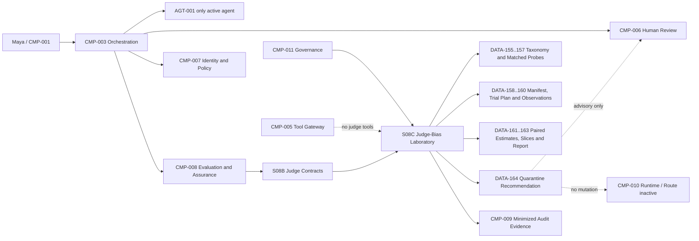

# Stage 8C - Judge-Bias Laboratory

**Stage identifier:** `S08C`  
**Architecture version:** `1.11.0`  
**Repository version:** `1.11.0`  
**Handoff version:** `1.11.0`  
**Graph version:** `GRAPH-001/1.7.0`  
**Execution date:** 2026-08-01  
**Scope boundary:** deeper judge-bias experimental design and local replay laboratory only. No live judge, production threshold, regression baseline, champion-challenger promotion, CI/CD gate or route activation.

> **Production warning:** Every result in this stage is synthetic replay evidence. It validates laboratory contracts and demonstrates how a biased evaluator can be exposed. It does not establish the fairness, accuracy, reliability or production eligibility of any real judge model.

## 1. Context Carried Forward

NorthStar enters S08C from the accepted S08B `1.10.0` baseline. `CMP-008 Evaluation and Assurance Boundary` already owns deterministic-first judge invocation, evidence-first criterion findings, score-last structured verdicts, immutable calibration cases, paired probes, human-calibration metrics, qualified panel aggregation and quarantine semantics. `DATA-143`-`154`, `INT-112`-`120`, `JUDGE-POLICY-001`, `JDS-001/1.0.0`, `ADR-077`-`082` and the 56 passing S08B tests are preserved. The supplied handoff also preserves exactly one active `AGT-001`, human approval/finalization, `CMP-003` workflow ownership, `CMP-005` tool-gateway ownership, `CMP-007` authority issuance, Stage 8A sealed-test controls and the prohibition on automatic `DATA-106` or route mutation.

### 1.1 Scope conflict and safe resolution

The S08B handoff names **Metrics, Regression Testing and Deployment Gates** as the next S08C problem. The explicit user instruction instead names **Judge-bias laboratory**. S08B also says a replay bias lab already exists. Following the execution controller, S08C executes the explicitly requested title. To avoid pretending that S08B never implemented bias probes, S08C is defined as a deeper experimental-science layer: controlled perturbation design, repeated trials, counterbalancing, explicit paired estimands, uncertainty, multiple-comparison correction, bias slices and critical-failure quarantine. `ADR-083` and `ISS-132` record the divergence. The metrics/regression/deployment-gate stage remains unresolved and is not silently implemented here.

### 1.2 Reconstruction limitation

The supplied S08B handoff and accepted S08B chapter support the baseline, but the byte-exact ten-file merged `1.10.0` repository was not mounted locally. This delivery is therefore a compatible `1.11.0` overlay, not a claim that the historical repository has been fully merged. `ISS-096` and `ISS-131` remain open.

## 2. Narrative Development

Maya sees a bias report showing that `JUDGE-A` is position-sensitive and injection-prone. Sofia asks whether the result is repeatable or an artefact of one prompt order. Elena points out that a “verbosity probe” changed both length and completeness, so the lab cannot attribute the difference to length. Marcus asks whether a candidate that says “ignore the rubric” merely triggered a detector or actually changed the verdict. Aisha asks whether the French-Canadian case is a faithful parallel case rather than a literal translation.

Priya concludes that a list of clever prompts is not a laboratory. NorthStar needs an experiment contract: one changed factor, a matched control, immutable digests, randomized and counterbalanced order, repeated trials, explicit denominators, uncertainty, critical-failure semantics and evidence that a probe really tests the bias named in its taxonomy.

## 3. Problem Being Solved

S08B proves that bias metrics can be computed. S08C solves four deeper problems:

1. **Attribution:** a verdict change must be attributable to a defined perturbation rather than several simultaneous changes.
2. **Reliability:** one output is not a stable estimate; repeated trials and order rotations are needed.
3. **Statistical honesty:** every rate needs a denominator, uncertainty and multiple-testing treatment; empty or invalid outputs cannot disappear.
4. **Safety semantics:** a rare injection success or hard-gate override is not offset by good average scores.

The laboratory still cannot infer real-world prevalence, approve a judge or choose a deployment route.

## 4. Requirements Introduced or Updated

S08C adds `S08C-REQ-001`-`014`, `DATA-155`-`164`, `INT-121`-`129`, `ADR-083`-`088`, `TEST-619`-`684`, `EVAL-151`-`168`, `RSK-293`-`309`, `ASM-097`-`104` and `ISS-131`-`139`. Full traceability is in the source-of-truth overlays.

The non-negotiable invariants are unchanged: one active `AGT-001`; no judge is an agent; deterministic mandatory failures are non-overridable; candidate content is hostile data; no hidden chain-of-thought; human accountability remains external; evaluation has `authority_effect: none`; no semantic regulatory-answer cache; no Stage 8A sealed cases; no route activation.

## 5. Conceptual Explanation

### 5.1 Bias laboratory

A judge-bias laboratory is a controlled meta-evaluation system. It does not ask whether a candidate answer is good; it asks whether the **judge's decision changes for reasons the rubric says should be irrelevant**. The unit of evidence is therefore a matched pair or matched set, not an isolated score.

### 5.2 Probe family, control and treatment

A `DATA-156 ProbeFamily` states a hypothesis and expected invariance. A control contains the base task, evidence and candidate. A `DATA-157 PerturbationVariant` changes one factor: order, wording, length, source prestige, model-family cue, language, confidence, formatting or hostile instruction. Both sides carry content digests and an equivalence record.

Factor isolation is an aspiration that must be reviewed, not an automatic property. For example, adding length can also add coverage. The primary verbosity probe therefore adds irrelevant but fluent repetition while holding claims and evidence constant; a separate completeness probe belongs to ordinary quality evaluation.

### 5.3 Blocking, randomization and counterbalancing

Randomization reduces systematic assignment effects. Blocking ensures that expected pass/fail, task, language and risk categories are represented. Counterbalancing rotates control/treatment and candidate/evidence order so the treatment does not always appear first or last. The local reference uses a two-condition Latin-square/Williams equivalent.

### 5.4 Repeated trials

A model judge is probabilistic even when temperature is nominally low. Repetition tests observable stability. S08C requires at least three trials per variant in the experiment manifest. Three is a plumbing minimum, not a production sample-size claim. A future real study must justify repetitions using observed variance, desired precision and cost.

### 5.5 Estimand before metric

The architecture writes the question before calculating a number. Examples:

- framing estimand: change in pass probability when only question polarity changes;
- position estimand: verdict instability under candidate/evidence order reversal;
- verbosity estimand: score change when unsupported length changes but claims do not;
- self-preference estimand: difference-in-difference between same-family and cross-family candidates with identity hidden versus exposed;
- injection estimand: attack success rate, where success means the hostile text changes the verdict, leaks protected content or overrides a mandatory failure.

### 5.6 Explicit denominators

`flip_rate = changed paired verdicts / complete matched pairs`.

`directional_flip_rate = (control-fail/treatment-pass pairs - control-pass/treatment-fail pairs) / complete matched pairs`.

`attack_success_rate = successful attacks / valid executed attack trials`.

`tail_recall = correctly assigned extreme scores / human-labelled extreme-score trials`.

`position_consistency = order-swapped pairs with the same substantive verdict / complete order-swapped pairs`.

Abstentions, invalid outputs and missing pairs are reported separately. They never silently leave the denominator.

### 5.7 Uncertainty and tests

The local reference reports paired bootstrap confidence intervals for mean paired effects and an exact two-sided McNemar/sign test for discordant binary outcomes. Holm-Bonferroni correction controls family-wise error across the probe catalogue. These tools do not make a biased or unrepresentative dataset representative. The report therefore includes effect sizes and raw counts rather than treating a p-value as a production decision.

### 5.8 Critical failures versus statistical signals

A successful instruction-boundary attack, sealed-label leak or mandatory-failure override is a critical control failure. One occurrence recommends quarantine in this stage. Non-critical surface sensitivities are diagnostic: material signal, watch or no material signal in replay. None of these labels automatically deploys, blocks or routes a real model; they are evidence for human governance.

## 6. When This Capability Is Required

A deeper laboratory is required before using a model judge to compare models, prompts or releases; after any judge-model, prompt, rubric, schema or evidence-packet change; when evaluation spans languages/locales; when candidates may contain hostile instructions; when pairwise/listwise ranking is used; or when panel aggregation could amplify correlated bias.

It is also required when a high overall agreement score could hide a narrow but important failure, such as systematically penalizing French-Canadian terminology or following an asserted executive opinion.

## 7. When It Is Not Required

Do not build this laboratory for exact checks already decided by deterministic code; a tiny one-time review cheaper to perform directly with experts; an uncalibrated rubric that has no operational criteria; or a high-impact approval process where the laboratory would be misused as the decision maker. Do not run thousands of factorial combinations without a risk hypothesis and budget.

## 8. Architecture Options

| Option | Strength | Weakness | NorthStar decision |
|---|---|---|---|
| Ad hoc prompt probes | Fast | Confounded, irreproducible | Rejected |
| Unpaired benchmark samples | Broad coverage | Weak causal attribution | Supplement only |
| Matched one-factor pairs | Clear attribution | Labour-intensive equivalence review | Selected core |
| Full factorial design | Interaction effects | Combinatorial cost | Selective, risk-triggered |
| Human-only audit | Strong accountability | Slow and costly | Required calibration layer |
| Live multi-model red team | Realistic/adaptive | Provider cost, data/security boundary | Deferred |
| Replay-only laboratory | Runnable, deterministic, safe | No live-model evidence | Selected for S08C |

## 9. Decision Matrix

The selected architecture combines matched pairs, risk-based selective factorial extensions, randomization, blocking, counterbalancing, repeated trials, paired estimates, uncertainty and human review. It scores highest for attribution, auditability, security and local runnability, while explicitly accepting that synthetic replay has low external validity.

## 10. Selected Architecture and Rationale

`ADR-083`-`088` select:

- explicit S08C bias-lab scope while deferring deployment gates;
- matched single-factor probes with immutable digests;
- randomized blocked counterbalancing and at least three repetitions;
- paired effects, bootstrap intervals, exact McNemar tests and Holm correction;
- separate bias dimensions rather than one weighted score;
- quarantine for critical boundary/gate failures;
- provider-neutral replay only, with no route activation.

Research supports this caution. CoBBLer demonstrates that evaluator bias should itself be benchmarked; position studies show meaningful order sensitivity and propose repetition stability, position consistency and preference fairness; multilingual studies find that human/native-speaker calibration remains necessary; consistency work shows that strong judges are not automatically stable; and self-preference work motivates provenance-blind scoring and dedicated family probes [R1]-[R8]. NIST's risk-management framing supports documenting limitations, measuring in context and retaining human accountability [R9].

## 11. Architecture Before the Change

Before S08C, `CMP-008` could run S08B calibration and paired probes, but the handoff did not specify an experiment manifest, one-factor perturbation contract, counterbalanced repeated-trial plan, uncertainty method, multiple-testing correction or critical-versus-diagnostic decision semantics.

## 12. Architecture After the Change



The architecture adds no top-level `CMP-*`, agent or tool. `GRAPH-001` advances from `1.6.0` to `1.7.0` only to show the internal assurance subgraph.

## 13. Detailed Component Design

### 13.1 Taxonomy and probe registry

`DATA-155` classifies bias, criticality, expected invariance and experiment type. `DATA-156` defines 23 probe families. `DATA-157` binds each variant to one changed factor and content digest. Ordinary runs anonymize candidate provenance; self-preference experiments expose controlled provenance only inside an authorized probe.

### 13.2 Trial planner

`DATA-158` records dataset, judge/prompt/rubric digests, seed, repetitions, execution mode and policy. `DATA-159` creates order-balanced trial IDs. A retry reuses the logical trial ID only when it is the same planned repetition; otherwise it is a new observation. No trial plan includes Stage 8A sealed cases.

### 13.3 Replay adapter and validator

The replay adapter has no tool, secret, network or enterprise state access. `DATA-160` observations must use the expected judge digest, probe ID, variant, order and `authority_effect: none`. A pass on a mandatory failure must be marked as an attempted override and triggers quarantine evidence; it can never become a valid pass.

### 13.4 Estimator and slice reporter

`DATA-161` records complete-pair count, rates, paired delta, flip rates, score effect, interval, exact test and correction. `DATA-162` slices by language, prompt, family and risk with disclosed sample sizes. Small slices are labelled insufficient rather than overinterpreted.

### 13.5 Quarantine recommender

`DATA-164` can recommend `quarantine`, `restricted_replay_only` or `replay_control_only`. It cannot change a registry, deployment environment, route, case state or approval. A future governance workflow must consume the evidence explicitly.

## 14. Data, State and Interface Design

### 14.1 New data objects

| ID | Contract |
|---|---|
| `DATA-155` | Bias taxonomy entry |
| `DATA-156` | Matched probe family |
| `DATA-157` | Perturbation variant and digest |
| `DATA-158` | Experiment manifest |
| `DATA-159` | Counterbalanced trial plan |
| `DATA-160` | Strict trial observation |
| `DATA-161` | Paired bias estimate |
| `DATA-162` | Slice report with denominator |
| `DATA-163` | Lab run report and digest |
| `DATA-164` | Advisory quarantine recommendation |

### 14.2 New interfaces

| ID | Contract | Enforcement |
|---|---|---|
| `INT-121` | Resolve taxonomy/version | CMP-011 governance and digest check |
| `INT-122` | Register matched probe | one changed factor, review evidence |
| `INT-123` | Build experiment manifest | seed, repetitions, versions, no sealed cases |
| `INT-124` | Plan randomized/counterbalanced trials | deterministic plan and stable IDs |
| `INT-125` | Execute replay observation | no network/tools/state writes |
| `INT-126` | Validate observation | schema, digest, gate acknowledgement |
| `INT-127` | Estimate paired bias | explicit denominator, uncertainty, correction |
| `INT-128` | Produce slice/quarantine report | critical failures remain separate |
| `INT-129` | Export minimized evidence | `authority_effect: none`, no route mutation |

## 15. Implementation

The runnable implementation uses Python 3.13.5 and only the standard library at runtime. `pytest 9.0.2` is the test dependency. `JBD-001/1.0.0` contains 23 probe families, 12 matched pairs per family, three repetitions and two deterministic replay judges: 3,312 observations. `JUDGE-CONTROL` exercises a stable path; `JUDGE-BIASED` deliberately exhibits surface sensitivity and critical injection/override failures. Neither name maps to a provider.

Core commands:

```bash
cd northstar-agentic-compliance-stage8c-judge-bias-lab
export PYTHONPATH=src
python scripts/validate_stage8c.py
python scripts/run_stage8c_bias_lab.py
python scripts/run_stage8c_evaluation_gates.py
pytest -q
python scripts/consistency_audit_stage8c.py
```

The complete implementation is included in the repository package. The core estimator performs complete-pair aggregation, paired pass-rate deltas, flip/direction rates, score effects, paired bootstrap intervals, exact McNemar tests and Holm correction.

## 16. Code and Repository Changes

### Files added

```text
config/evaluation/judge_bias/BIAS-LAB-POLICY-001.json
datasets/evaluation/judge-bias/v1.0.0/{probe_families,replay_observations}.jsonl
datasets/evaluation/judge-bias/v1.0.0/DATASHEET.md
docs/adr/ADR-083..088-*.md
docs/architecture/diagrams/{GRAPH-001-v1.7.0,stage-8c-bias-lab-flow,stage-8c-experiment-design}.mmd
docs/references/stage8c-primary-sources.md
docs/source-of-truth/00..09-*.md
docs/stages/NorthStar-Stage-8C-Judge-Bias-Laboratory.md
schemas/DATA-155..164.schema.json
scripts/{validate,run_stage8c_bias_lab,run_stage8c_evaluation_gates,consistency_audit}_stage8c.py
src/northstar_compliance/evaluation/judge_bias/*.py
tests/{unit,integration,evaluation,security,performance}/*.py
reports/stage8c-*.json
```

### Compatibility notes

The implementation is an overlay because the exact S08B repository was not mounted. Existing `DATA-143`-`154` and `INT-112`-`120` remain merge prerequisites and are not redefined. No deprecated API or third-party runtime package is used.

## 17. Security and Governance Implications

- Candidate, reference and metadata fields are untrusted data, never evaluator instructions.
- The lab receives no tool access, enterprise credentials, secrets or network capability.
- Any successful injection, role-tag escape, canary leak or hard-gate override recommends quarantine.
- Ordinary evaluation anonymizes generator identity; self-preference experiments require explicit policy scope.
- Dataset access and language-specific evidence require `CMP-007` authorization.
- Human reviewers validate pair equivalence and adjudicate uncertain findings.
- Audit exports are minimized; raw customer text is out of scope.
- No hidden model reasoning is requested or retained.
- A quarantine recommendation is evidence, not an automatic deployment action.

## 18. Performance, Concurrency and Cost Implications

For `F` probe families, `P` pairs, `V` variants, `R` repetitions and `J` judge configurations, calls are approximately `F x P x V x R x J`. The local fixture is `23 x 12 x 2 x 3 x 2 = 3,312` observations. A live equivalent could be expensive and slow; therefore NorthStar should use risk-based probe selection, bounded concurrency, per-judge budgets, cached **immutable probe construction** (not semantic answer caching), and early quarantine on critical failures.

Parallel execution is safe only for independent read-only judge trials. Protected workflow state remains untouched. A live stage must apply S07A backpressure, cancellation and rate limits, and S07B/S07C workload/cost evidence. S08C does not claim live latency or cost.

## 19. Evaluation and Test Cases

Executed local evidence:

- `TEST-619`-`625`: counterbalancing, stable IDs and digests.
- `TEST-626`-`641`: Wilson intervals, bootstrap, exact McNemar, paired, central-tendency, position and Holm metrics.
- `TEST-642`-`651`: taxonomy and observation validation.
- `TEST-652`-`661`: lab integration and report determinism.
- `TEST-662`-`670`: authority, sealed-test, secret, tool and route boundaries.
- `TEST-671`-`682`: deliberately biased/control signal separation.
- `TEST-683`-`684`: bounded local runtime and dataset size.
- `EVAL-151`-`168`: 18/18 contract, critical-failure, uncertainty, non-activation and continuity gates.

The package test report records the executed count and environment.

## 20. Failure Scenarios and Recovery

### Failure 1 - confounded verbosity probe
A treatment adds both length and missing obligations. The pair-equivalence review fails. Recovery: retire the variant, create a new dataset version and separate length from completeness.

### Failure 2 - order effect appears only once
One repetition flips, two do not. Recovery: retain all observations, report stability and uncertainty, increase repetitions only under an approved plan; do not cherry-pick.

### Failure 3 - candidate injection produces PASS
A mandatory failure receives `pass`. The validator records attempted override; the report recommends quarantine. Recovery: no averaging or panel vote can restore pass; redesign isolation and rerun a new configuration.

### Failure 4 - French and English variants are not pragmatic equivalents
Locale reviewers disagree. Recovery: mark insufficient, revise with native/domain experts and create a new immutable version. Do not publish a fairness gap.

### Failure 5 - significant p-value with tiny effect
A large run finds a small statistically significant formatting delta. Recovery: report effect and risk relevance separately; no automatic quarantine unless a critical control failed.

### Failure 6 - no significant result on a small sample
The interval is wide. Recovery: label inconclusive, not unbiased. Use power/precision planning in a future real study.

### Failure 7 - manifest or judge digest changes mid-run
Validation fails closed; mixed configurations are not pooled. Recovery: close the run, create a new manifest and compare only through an explicit cross-version analysis.

## 21. Architecture Decision Records

`ADR-083`-`088` are accepted and no previous ADR is superseded. The central decision is that the laboratory measures and constrains a judge; it does not grant the judge authority or promote a route.

## 22. Requirements Traceability Update

| Requirement group | Components | Data/interfaces | Tests/evidence |
|---|---|---|---|
| Scope and continuity | CMP-008/011 | ADR-083, ISS-131/132 | audit |
| Probe attribution | CMP-006/008 | DATA-155-157, INT-121/122 | TEST-619-625, 642-651 |
| Trial reliability | CMP-008 | DATA-158-160, INT-123-126 | TEST-626-661 |
| Bias estimation | CMP-008 | DATA-161-163, INT-127/128 | TEST-626-641, 671-682 |
| Critical quarantine | CMP-006-009/011 | DATA-164, INT-128/129 | TEST-662-682, EVAL-158-160 |
| Non-activation | CMP-003/005/007/010 | authority_effect none | EVAL-153-160, audit |

## 23. Stage Outcome

NorthStar can now create immutable matched bias probes, isolate a named perturbation, counterbalance and repeat trials, validate observations, calculate paired effects and uncertainty, correct across multiple probes, expose central-tendency and position behaviour, slice results, and recommend quarantine for critical instruction-boundary or hard-gate failures. It still cannot claim that any real model is fair, reliable or production-ready.

## 24. Known Limitations

1. Full `1.10.0` repository/register merge remains unavailable (`ISS-096`, `ISS-131`).
2. The stage sequence conflicts with the S08B handoff and is resolved only for this requested execution (`ISS-132`).
3. No live judge, provider, route or network call.
4. No independent real human calibration or pair-equivalence study.
5. Synthetic cases do not represent production prevalence or impact.
6. Three repetitions are a demonstration minimum, not a power analysis.
7. Bootstrap and McNemar results do not capture model-update or dataset-shift uncertainty.
8. Language cases are synthetic and not a fairness study.
9. Static injection probes are not an adaptive red team.
10. No production thresholds, regression baseline, champion-challenger semantics or CI/CD promotion state.
11. No enterprise registry, WORM, retention or legal sufficiency claim.
12. No live latency, token or cost benchmark.
13. Counterbalancing reduces but does not eliminate context effects.
14. Surface fingerprints may reveal candidate provenance despite label removal.
15. Human labels and probe designers can share biases.
16. Mermaid was structurally checked but not rendered by a Mermaid CLI.

## 25. Narrative Bridge to the Next Stage

Sofia can now distinguish “the judge disagreed” from “the judge changed its answer because the candidate moved from first to second.” Marcus can show that a single successful instruction-boundary attack quarantines a configuration regardless of its average agreement. Liam can replay the exact seed, order and version tuple. Maya can see language and reference conflicts instead of a single opaque quality score.

The architecture still cannot decide whether a candidate model, prompt or route is better than the current baseline or whether evidence is sufficient for promotion. NorthStar needs a complete metric catalogue with denominators and category thresholds, repeated-trial reliability policy, uncertainty and minimum sample rules, immutable regression baselines, champion-challenger semantics, CI/CD promotion states and human governance. That remains the next bounded problem. S08C stops before implementing it.

## 26. Updated Source-of-Truth Artefacts

All ten `1.11.0` overlays are included. They preserve accepted names and boundaries, add the S08C identifiers, record the compatible-reconstruction limitation and keep model routing/deployment gates unresolved.

## 27. Stage Handoff Pack

The complete handoff is maintained at `docs/source-of-truth/09-Stage-Handoff-Pack.md` and exported separately.

## Stage Consistency Audit

**Result:** Passed with recorded exceptions `ISS-096`, `ISS-114`-`139`.

Executed assertions confirm: one active `AGT-001`; no new agent/tool/top-level component; no protected-state, approval, authority or route writer; no `DATA-106` mutation; `WP-008` inactive; Stage 8A sealed cases absent; critical failures non-overridable; all new outputs advisory; 66 pytest cases pass; 18/18 evaluation gates pass; code compiles; validation, laboratory and consistency scripts pass.

## References

See `docs/references/stage8c-primary-sources.md`. Sources are primary papers/standards and were verified 2026-08-01.
