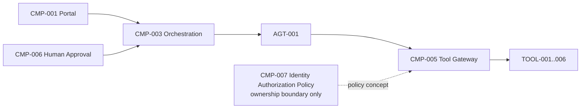
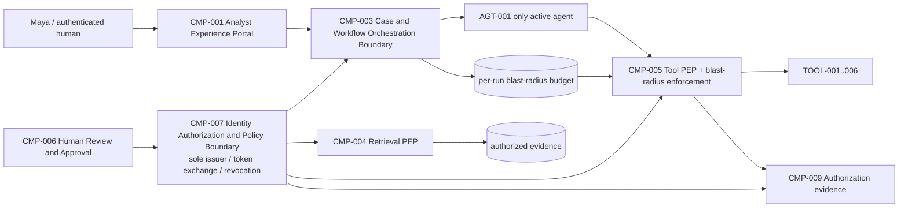

# Stage 9B - Identity, Authorization and Blast-Radius Controls

**Stage identifier:** `S09B`  
**Architecture version:** `1.13.0`  
**Repository version:** `1.13.0`  
**Handoff version:** `1.13.0`  
**Graph version:** `GRAPH-001/1.9.0`  
**Threat-model version:** `TM-001/1.1.0`  
**Authorization-model version:** `AUTH-001/1.0.0`  
**Blast-radius-model version:** `BR-001/1.0.0`  
**Execution date:** 2026-08-01  
**Verification boundary:** local/offline Python 3.13.5; `cryptography 46.0.4`; `pytest 9.0.2`; `jsonschema 4.26.0`; deterministic local Ed25519-signed grant envelopes; in-memory replay, use, revocation and budget ledgers. No production IdP, OAuth authorization server, SPIFFE/SPIRE deployment, enterprise KMS/HSM, mTLS mesh, DPoP-conformant HTTP profile, distributed policy store, production route, model route, Stage 8D deployment gate, broader guardrail architecture or control-plane implementation.

> **Production Warning:** The executable code proves local contract semantics and negative authorization behavior. It is not an OAuth, OIDC, DPoP, mTLS, SPIFFE or regulatory certification. The local signed envelope is deliberately labelled a teaching implementation rather than a standards-conformant access token.

## 1. Context Carried Forward

NorthStar enters S09B from the accepted S09A `1.12.0` baseline. The S09A threat model contains 8 trust boundaries, 12 assets, 20 data flows, 8 actor classes and 36 threat scenarios. It identifies authority confusion, token replay, audience mismatch, confused-deputy behavior, workload impersonation, approval forgery and cross-tenant disclosure as high-consequence paths. S09A also preserved the core architecture invariants: exactly one active `AGT-001 Regulatory Impact Assessment Agent`; `CMP-003` as the sole task, route, protected-state, admission, cancellation, aggregation and system-termination owner; `CMP-005` as the only gateway to `TOOL-001`-`006`; `CMP-007` as the sole authority issuer; and humans as approval and finalization owners. The S09A handoff is the authoritative reconstruction basis for this compatible overlay. [R-S09A]

The current graph remains `GRAPH-001/1.8.0` at entry. `AGT-001-spec 1.1.0`, `DATA-009 1.1.0`, `DATA-091`-`176`, `INT-063`-`139`, `ADR-001`-`094`, the sealed S08A evaluation controls, S08B judge contracts, S08C bias laboratory and `TM-001/1.0.0` remain accepted. `WP-008`, MCP, A2A and additional-agent routes remain `inactive_future`. Stage 8D metrics, regression baselines and deployment gates remain unresolved and are not implied by this security work.

### 1.1 Scope conflict and controlled resolution

The S09A exact continuation instruction stopped before blast-radius controls. The current user instruction explicitly requests **Stage 9B - Identity, authorization and blast-radius controls**. The execution controller says to execute the explicitly named stage and to resolve conflicts through an ADR. `ADR-095` therefore accepts the current combined scope while imposing a hard boundary:

- implement identity and delegated authorization;
- implement blast-radius tiers and bounded budgets;
- do not implement the broader input/context/retrieval/planning/output/state/memory guardrail architecture;
- do not implement the agent control plane;
- do not activate production identity infrastructure, any model route, MCP/A2A or another agent; and
- preserve unresolved S08D promotion work.

This is a user-authorized scope change, not a silent contradiction.

### 1.2 Reconstruction exception

The uploaded S09A handoff and the prior stage chapter support the architecture and identifier ranges, but the byte-exact historical repository and all ten full `1.12.0` registers were not mounted as one mergeable tree. S09B is therefore a compatible `1.13.0` overlay. `ISS-096`, `ISS-131`, `ISS-141` and new `ISS-147` remain open. No claim of a byte-exact historical merge is made.

### 1.3 Artefacts modified

This stage updates all ten source-of-truth artefacts; adds `DATA-177`-`192`, `INT-140`-`154`, `ADR-095`-`103`, `RSK-346`-`371`, `ASM-111`-`118`, `ISS-147`-`157`, `TEST-737`-`792` and `EVAL-185`-`204`; advances `GRAPH-001` to `1.9.0` and `TM-001` to `1.1.0`; and adds the local `AUTH-001/1.0.0` and `BR-001/1.0.0` reference implementations.

## 2. Narrative Development

Marcus Green does not begin with a token format. He begins with a failure path from S09A.

Maya Chen has authenticated to the Analyst Experience Portal and opened `CASE-2026-0001`. `AGT-001` proposes a call to `TOOL-004` to create an unapproved draft impact assessment. The request appears harmless. Marcus changes only one field: the audience. A broad bearer credential accepted by the gateway could be replayed at another service. He changes a second field: the resource. A service with stronger backend rights might retrieve another tenant's record and become a confused deputy. He then copies the token from the agent process and replays it. Nothing in the existing architecture states how the receiver must bind the credential to the human, workload, agent execution, tool, operation, case, data scope, proof key, nonce or use count.

Sofia Alvarez adds a governance case. A token may say that an approval exists, but it cannot create the approval. The approval must already exist in `CMP-006`, be linked to the exact action, remain unexpired, satisfy role and separation-of-duties policy, and be independently verified. A model-generated string such as `approval_status=approved` has no authority.

Liam O'Connor adds an operational case. Even a correctly scoped grant may permit too many calls, too much data, too many external messages or too much spending before revocation propagates. Identity answers **who** is acting. Authorization answers **what this request may do**. Blast-radius control answers **how much damage is possible even when the identity and authorization are valid**.

Priya Raman therefore separates five questions:

1. Who is the human subject?
2. Which workload is executing?
3. Which logical agent specification and exact run is bound to that workload?
4. Which operation on which tool, resource and data scope is delegated?
5. What quantitative and qualitative limits contain the action?

NorthStar implements these as distinct, deterministic layers. The model may propose a tool call, but it cannot authenticate itself, issue a grant, expand a grant, prove possession of a key it does not hold, manufacture an approval, consume a budget outside the gateway or override a denial.

## 3. Problem Being Solved

### 3.1 Authentication is not authorization

Authentication establishes the identity of a human or workload. Authorization decides whether a particular subject may perform a particular action on a particular resource under the current context. OpenID Connect is appropriate for human sign-in and identity claims; OAuth is an authorization framework for delegated API access. NorthStar does not send Maya's ID token to a tool and does not treat an ID token as an API authorization grant. [R10]

### 3.2 An agent is not a new category of cryptographic principal

`AGT-001` is a governed software role and specification. The running process must still be authenticated as a workload. S09B creates `DATA-178 AgentExecutionIdentity`, which binds:

- `AGT-001` and `AGT-001-spec 1.1.0`;
- the authenticated human subject;
- the attested workload principal;
- tenant, case, run and task;
- start time and execution identifier.

This avoids two unsafe extremes: pretending the model is a human identity, or allowing the workload identity alone to imply every action that any agent could perform.

### 3.3 Delegation must reduce authority

A token exchange or security token service can derive a new credential for a target resource and delegation context. RFC 8693 defines token exchange semantics, including delegation and impersonation, but it does not automatically define NorthStar's business policy. NorthStar uses token exchange as the architectural pattern and requires every derived grant to be no broader than its parent. [R2]

### 3.4 A signed token is not sufficient receiver-side authorization

A receiver must validate more than a signature. It must verify issuer, audience, time, subject/actor/workload bindings, intended tool, operation, resource/data scope, tenant/case/run/task, proof-key binding, revocation state, nonce uniqueness, remaining use count, approval binding and blast-radius budget. A valid signature proves that an issuer signed the claims; it does not prove that the current request matches them or that the grant is still acceptable.

### 3.5 Bearer-token theft must not automatically transfer authority

DPoP and mTLS are two standards-based ways to sender-constrain OAuth tokens. DPoP operates at the application layer by requiring proof of possession of a key for each request; mTLS can bind a token to a client certificate. NorthStar selects mTLS for controlled service-to-service production channels and DPoP-style proof for HTTP clients where mTLS is impractical. The local implementation uses an Ed25519 request proof to test the semantics but does not claim DPoP conformance. [R3][R4]

### 3.6 Valid authority still needs containment

A valid grant could permit repeated or high-volume use. Blast-radius controls therefore remain independent of the token. A per-run budget can stop a valid grant after one external message, a configured number of calls, a byte or record threshold, a cost ceiling, an authority-tier ceiling or an emergency-stop signal.

## 4. Requirements Introduced or Updated

| Requirement | Statement | Primary implementation | Verification |
|---|---|---|---|
| `S09B-REQ-001` | Resolve the S09A scope conflict and bound S09B before broader guardrails/control plane. | ADR-095, ISS-147 | TEST-787, EVAL-185 |
| `S09B-REQ-002` | Distinguish human, workload, agent, service and tool identity. | DATA-177-178, INT-140-142 | TEST-737-744, EVAL-186 |
| `S09B-REQ-003` | Bind `AGT-001` execution to human, workload, tenant, case, run and task. | DATA-178 | TEST-753-759, EVAL-187 |
| `S09B-REQ-004` | Prohibit unrestricted user credential/token passthrough. | ADR-097, schema/config scans | TEST-743, TEST-788, EVAL-188 |
| `S09B-REQ-005` | Exchange authority into short-lived tool-specific grants. | DATA-179-180, INT-143 | TEST-737-746, EVAL-189 |
| `S09B-REQ-006` | Bind grants to audience, tool, operation, resource, data, region, risk and limits. | DATA-180, INT-144-148 | TEST-753-771, EVAL-190 |
| `S09B-REQ-007` | Require monotonic attenuation during delegation. | GrantIssuer.attenuate, ADR-097 | TEST-745-747, EVAL-191 |
| `S09B-REQ-008` | Bind grants to a proof key and verify per-request proof. | DATA-181, INT-145 | TEST-748-752, TEST-772-775, EVAL-192 |
| `S09B-REQ-009` | Enforce request nonce, expiry and use-count replay controls. | DATA-184, INT-149 | TEST-772-779, EVAL-193 |
| `S09B-REQ-010` | Support revocation and receiver-side current-state checks. | DATA-183, INT-150 | TEST-776, EVAL-194 |
| `S09B-REQ-011` | Bind higher-risk authority to an independent human approval record. | DATA-182, INT-151 | TEST-781-782, EVAL-195 |
| `S09B-REQ-012` | Keep humans as approval/finalization owners; timeout never approves. | Existing CMP-006 ownership | TEST-781-782, TEST-790, EVAL-196 |
| `S09B-REQ-013` | Enforce authorization at receivers before retrieval/tool execution. | CMP-004/CMP-005 PEP design, INT-146-148 | TEST-753-782, EVAL-197 |
| `S09B-REQ-014` | Define authority/autonomy tiers 0-5. | BR-001, DATA-187 | TEST-783-786, EVAL-198 |
| `S09B-REQ-015` | Enforce tool allowlists and resource/data/region limits. | DATA-187-188, INT-152 | TEST-753-771, TEST-783-790, EVAL-199 |
| `S09B-REQ-016` | Enforce call, record, byte, cost, message and concurrent-write budgets. | BlastRadiusController | TEST-783-792, EVAL-200 |
| `S09B-REQ-017` | Provide emergency stop and fail-closed behavior. | BR-001, gateway | TEST-784, EVAL-201 |
| `S09B-REQ-018` | Preserve exactly one active `AGT-001` and inactive future routes. | configuration and audit | TEST-787, EVAL-202 |
| `S09B-REQ-019` | Prevent authorization/evaluation from mutating `DATA-106`. | component boundary and code scan | TEST-789, EVAL-203 |
| `S09B-REQ-020` | Update the threat model for identity and blast-radius controls. | DATA-191, TM-001/1.1.0 | EVAL-204 |
| `S09B-REQ-021` | Keep Stage 8D unresolved. | handoff and audit | TEST-789 |
| `S09B-REQ-022` | Preserve gateway-only tool invocation. | CMP-005 PEP | TEST-787-790 |
| `S09B-REQ-023` | Emit minimized authorization evidence with `authority_effect:none`. | DATA-189, INT-153 | policy decision schema/tests |
| `S09B-REQ-024` | Provide reproducible local code and negative tests without claiming production IAM. | repository and scripts | all tests and audit |

## 5. Conceptual Explanation

### 5.1 Identity taxonomy

| Identity | Meaning in NorthStar | Source of trust | May authorize? |
|---|---|---|---|
| Human identity | Maya or another authenticated user | Enterprise IdP/OIDC in production | No; supplies authenticated subject and attributes to policy |
| Workload identity | The process/pod/VM executing the runtime | Attestation and short-lived workload credentials; SPIFFE/SPIRE is a candidate | No; proves which workload presents the request |
| Agent identity | Governed logical software role `AGT-001` and specification version | Registry and execution binding | No; contributes agent-specific policy attributes |
| Agent execution identity | Human + workload + agent + tenant/case/run/task binding | `CMP-003` and `CMP-007` | No; is the subject of a derived grant |
| Service identity | `CMP-003`, `CMP-005`, `CMP-007` or another service boundary | Workload identity and service configuration | No; used for authenticated service calls and policy |
| Tool identity | Exact capability endpoint `TOOL-001`-`006` | Tool registry/gateway contract | No; is an audience and policy object |

The key design rule is that an identity is evidence about a principal, not permission to act. Permission is created only by a policy decision and a bounded grant issued by `CMP-007`.

### 5.2 Human authentication

NorthStar's production mapping uses OIDC for interactive human authentication. The portal retains the session and stable subject. The unrestricted user token is not forwarded to `AGT-001` or tools. `CMP-003` passes only the normalized subject and required claims into a token-exchange request. This reduces credential leakage and prevents a tool from using a human token outside the intended resource. OIDC's `iss` and `sub` semantics provide the basis for stable subject identification at the relying party. [R10]

### 5.3 Workload identity

A service cannot safely identify itself using a static API key embedded in a container. NorthStar's production design uses attested, short-lived workload identity. SPIFFE defines a framework for workload identity and SVIDs; SPIRE is one implementation that performs node/workload attestation and issues identities. S09B does not deploy it, but models a workload principal such as `spiffe://northstar.ca/workload/agt-001`. [R14][R15]

### 5.4 Agent execution identity

An agent execution identity is a composite security context rather than a new cryptographic credential. It prevents a grant issued for one run from being reused in another. The binding includes:

```text
AGT-001 + spec 1.1.0
+ human subject
+ attested workload principal
+ tenant + case + run + task
+ execution start and execution ID
```

The agent name alone is insufficient because multiple workloads, users or cases could execute the same specification.

### 5.5 On-behalf-of delegation and token exchange

NorthStar uses the following conceptual flow:

1. Maya authenticates to the portal.
2. `CMP-003` creates the exact agent execution identity.
3. `CMP-003` asks `CMP-007` to exchange the human/workload context for a derived grant.
4. `CMP-007` applies policy and issues a short-lived grant for one audience/tool/operation/resource scope.
5. `AGT-001` presents the grant and a proof from the bound workload key to `CMP-005`.
6. `CMP-005` independently validates and authorizes.

RFC 8693 is the standards mapping for the exchange/STS pattern. NorthStar does not use token exchange as a way to preserve all parent authority. The derived token must be narrower. [R2]

### 5.6 Tokenized authorization claim set

`DATA-180` contains the minimum set needed for this architecture:

- issuer and grant identifier;
- subject execution, human actor and workload principal;
- tenant, case, run, task and purpose;
- audience and intended tool;
- permitted operation;
- resource and data scopes;
- region allowlist;
- maximum authority tier;
- maximum uses, tool calls, records, bytes and external messages;
- monetary limit in CAD;
- reversible-only flag;
- delegation depth and maximum depth;
- approval binding;
- proof-key thumbprint;
- issue, not-before and expiry times;
- nonce, parent grant and revocation reference.

The production token may use a JWT profile, an opaque token with introspection or another approved format. RFC 9068 is useful when resource servers need interoperable signed JWT access tokens. Opaque tokens plus introspection may be preferable when immediate state and minimized disclosure are more important. [R5][R7]

### 5.7 Audience and resource binding

Audience prevents a token issued for one receiver from being accepted by another. Resource scope prevents the intended receiver from applying its own stronger backend authority to an unrelated object. RFC 8707 provides an OAuth resource-indicator mechanism; NorthStar additionally carries exact tool, operation and resource/data constraints because one gateway fronts several enterprise tools. [R8]

### 5.8 Capability and attenuation models

A capability token directly embodies authority and can support attenuation. Macaroons show how contextual caveats can be added while delegating. NorthStar adopts the **monotonic attenuation principle**, not the macaroon wire format: a child may reduce operations, resources, data, regions, limits, duration and uses, but may not expand them. [R16]

### 5.9 RBAC, ABAC, PBAC and ReBAC

No single access-control model is sufficient.

- **RBAC** is used for coarse human roles such as regulatory analyst, compliance approver and business control owner.
- **ABAC** evaluates subject, object, action and environment attributes: tenant, case, data classification, region, risk tier, device/workload, time and purpose. NIST SP 800-162 provides the formal basis. [R13]
- **Policy-based access control (PBAC)** is the operational form: deterministic rules combine role and attributes and return an allow/deny decision with obligations.
- **ReBAC** answers relationship questions such as whether Maya is assigned to this case or an approver owns the affected control. Zanzibar is a primary reference for relationship-oriented authorization, although NorthStar does not implement a Zanzibar-scale service here. [R17]

The selected policy is hybrid: RBAC gates eligibility; ABAC/PBAC gates the current transaction; ReBAC resolves case/ownership relationships when needed.

### 5.10 Proof of possession

A bearer token is usable by whoever possesses it. Sender-constrained tokens reduce this risk. DPoP defines an application-layer proof that binds a token to a public key and a request; mTLS can certificate-bind tokens. NorthStar's production preference is:

- mTLS/X.509 workload channels for stable service-to-service communication;
- DPoP for OAuth HTTP clients where application-layer sender constraint is needed and mTLS is impractical;
- never treat DPoP itself as client authentication; and
- still validate request-specific audience, method, target, nonce and time. [R3][R4]

The local `ProofOfPossession` signs grant ID, method, audience, operation, resource, request nonce, body digest and issued time. This demonstrates the receiver semantics but is not a DPoP JWT.

### 5.11 Revocation, introspection and short lifetimes

Short lifetimes reduce exposure but do not remove the need for revocation. RFC 7009 defines a revocation endpoint; RFC 7662 defines introspection of token activity and metadata. NorthStar uses a stateful revocation ledger and receiver checks in the local reference. A production design may combine short-lived JWTs with a high-priority revocation cache, or use opaque tokens/introspection for sensitive actions. The correct choice depends on latency, availability and revocation objectives. [R6][R7]

### 5.12 Receiver-side policy enforcement

NIST zero trust guidance removes implicit trust based on network location and emphasizes identity- and resource-centered access. SP 800-207A specifically discusses application/service identities and enforcement through gateways, proxies and identity infrastructure. NorthStar therefore enforces at both data receivers:

- `CMP-004` before access-aware retrieval/context assembly;
- `CMP-005` before any tool invocation.

The issuer cannot replace the receiver. The receiver knows the concrete request and can verify local resource, operation, data and budget context. [R11][R12]

### 5.13 Blast radius

Blast radius is the maximum credible impact that can occur before containment. It includes more than privilege. NorthStar controls:

- tool set;
- authority tier;
- resource/data/region scope;
- call count and per-tool count;
- records and bytes;
- cost in CAD;
- external messages;
- concurrent writes;
- reversibility;
- approval level; and
- emergency stop.

A compromised agent with a valid read token can still exfiltrate too much data if byte/record limits are absent. A valid external-action grant can still spam reviewers if message limits are absent.

### 5.14 Autonomy and authority tiers

| Tier | NorthStar meaning | Current tools | Mandatory controls |
|---|---|---|---|
| 0 | Informational only | none | no tools; no state changes |
| 1 | Read-only | `TOOL-001`-`003` | exact resource/data access, response minimization, record/byte limits |
| 2 | Reversible internal change | `TOOL-004`-`005` | idempotency, one concurrent protected write, rollback/reconciliation, unapproved state only |
| 3 | Controlled external action | `TOOL-006` | exact recipient/purpose, one-message default, rate limit, no approval implication |
| 4 | High-impact regulated action | none | explicit dual human approval, separation of duties, transaction binding, no autonomous execution |
| 5 | Prohibited autonomous action | none | deny under all agent grants; only policy/architecture change can alter classification |

`TOOL-006` sends a review request. It is an external action but does not approve or finalize a case. Its tier-3 classification preserves the existing reversible/unapproved semantics while adding recipient and message limits.

## 6. When This Capability Is Required

Identity and tokenized authorization are required when any of these conditions exist:

- the agent acts on behalf of a human;
- one gateway fronts multiple tools or resources;
- tenant, case, jurisdiction or data classification matters;
- a service has stronger backend rights than the caller;
- credentials might cross process, network or administrative boundaries;
- actions have side effects;
- a grant may be replayed, delegated or revoked;
- human approval must be linked to an exact transaction;
- a workload can run multiple agent specifications or tenants; or
- audit must show not only what happened but why the receiver allowed it.

Blast-radius controls are required whenever a valid but compromised or misbehaving principal could cause material harm through volume, velocity, scope, cost or concurrency.

## 7. When It Is Not Required

A full token-exchange and distributed policy architecture may be unnecessary for a single-process, offline, read-only prototype using synthetic data and no external services. Even there, function boundaries and explicit allowlists remain useful. It is harmful to add OAuth, SPIFFE, a service mesh or a distributed authorization store merely to make a prototype look enterprise-grade. The architecture should adopt them only when there are real principal, trust, deployment or scale boundaries.

Per-request proof of possession may be unnecessary inside a single protected process where no token crosses a boundary. It becomes important when a bearer credential could be copied or replayed.

ReBAC is unnecessary when ownership relationships are trivial and can be represented directly as attributes. A global relationship service would add consistency, latency and operating cost without value in that case.

## 8. Architecture Options

### 8.1 Human and workload identity options

| Option | Strengths | Weaknesses | NorthStar use |
|---|---|---|---|
| Shared static API keys | simple | poor rotation, attribution and compromise containment | rejected |
| OIDC for every principal | strong for humans | not a workload-attestation framework | human authentication only |
| Cloud-provider workload identity | managed and practical | cloud-specific | valid deployment mapping |
| SPIFFE/SPIRE | vendor-neutral workload identity across heterogeneous environments | operational platform and trust-domain design required | selected reference mapping |
| mTLS certificates without attestation | mutual authentication | certificate issuance may not prove workload provenance | useful transport control, insufficient alone |

### 8.2 Authorization token options

| Option | Strengths | Weaknesses | Selected role |
|---|---|---|---|
| Forward user's access token | easy | overbroad, leakage, confused deputy, wrong audience | prohibited |
| Long-lived service token | low exchange overhead | large replay window and poor user/action binding | rejected |
| Short-lived JWT access token | local validation, scalable | revocation/state propagation and claim disclosure | production option for lower-latency paths |
| Opaque token + introspection | current server state, minimized token content | network dependency and latency | production option for high-risk paths |
| Macaroon/capability token | strong attenuation model | ecosystem and verifier complexity | conceptual influence, not selected wire format |
| Custom signed envelope | transparent local teaching code | nonstandard, not interoperable | local reference only |

### 8.3 Sender constraint options

| Option | Strengths | Weaknesses | Selection |
|---|---|---|---|
| Bearer token only | broad support | theft transfers authority | not sufficient for sensitive actions |
| mTLS-bound token | strong service binding | certificate/mesh complexity; less suitable for browser clients | selected for service-to-service production paths |
| DPoP-bound token | application-layer sender constraint | proof validation and key storage complexity | selected for HTTP clients where appropriate |
| Request signing without token binding | protects request integrity | can drift into proprietary protocol | local demonstration only |

### 8.4 Authorization decision options

| Option | Strengths | Weaknesses | NorthStar decision |
|---|---|---|---|
| RBAC only | understandable and efficient | role explosion and weak transaction context | coarse eligibility only |
| ABAC | rich context | policy complexity and attribute quality | core transaction policy |
| ReBAC | ownership/delegation relationships | consistency and query complexity | targeted case/ownership checks |
| Embedded policy code | low latency | duplicated policy and change control | limited local reference |
| External PDP | consistent policy and independent lifecycle | network dependency and availability | production design, with local/cache strategy |

### 8.5 Blast-radius enforcement options

| Option | Strengths | Weaknesses | Selection |
|---|---|---|---|
| Limits only inside token | portable | stale, difficult atomic consumption, token size | claims set ceilings only |
| Central budget service | consistent global counters | latency and single-point risks | required for cross-instance production budgets |
| Gateway-local counters | fast | instance-local and failover inconsistency | local reference and low-risk caches |
| Workflow-engine budgets | aligns to run ownership | tool receiver still needs local checks | selected jointly with gateway |

## 9. Decision Matrix

Scores are qualitative: 1 weak, 5 strong. They compare fit for NorthStar, not universal product quality.

| Design | Least privilege | Replay resistance | Revocation | Multi-cloud fit | Receiver independence | Local demonstrability | Complexity |
|---|---:|---:|---:|---:|---:|---:|---:|
| Forward user bearer token | 1 | 1 | 3 | 3 | 1 | 5 | 1 |
| Static service credential + RBAC | 2 | 1 | 2 | 3 | 2 | 5 | 2 |
| Short-lived audience JWT only | 4 | 2 | 3 | 4 | 4 | 4 | 3 |
| Token exchange + PoP + hybrid policy + stateful ledgers | 5 | 5 | 5 | 5 | 5 | 4 | 5 |
| Capability-only decentralized tokens | 5 | 4 | 3 | 4 | 5 | 3 | 5 |

The selected architecture is the fourth option. Its complexity is justified by the actual S09A threats and by NorthStar's regulated, multi-jurisdiction, gateway-mediated workflow.

## 10. Selected Architecture and Rationale

NorthStar selects a layered, provider-neutral design:

1. **Human authentication:** enterprise OIDC at `CMP-001`; retain the session/token at the portal boundary.
2. **Workload authentication:** attested short-lived workload identity, with SPIFFE/SPIRE as the vendor-neutral reference mapping.
3. **Agent execution identity:** bind `AGT-001`, spec version, human, workload, tenant, case, run and task.
4. **Token exchange:** `CMP-007` derives a short-lived, audience/tool-specific attenuated grant; no user-token passthrough.
5. **Sender constraint:** mTLS for stable service channels and DPoP for appropriate HTTP clients in production; local Ed25519 request proof in the tutorial.
6. **Hybrid policy:** RBAC + ABAC/PBAC + targeted ReBAC.
7. **Receiver PEPs:** `CMP-004` and `CMP-005` independently validate the request before data/tool access.
8. **Stateful safeguards:** nonce replay ledger, use ledger, revocation state and approval verification.
9. **Blast-radius budgets:** `CMP-003` owns the run budget; `CMP-005` atomically reserves tool/action consumption before execution.
10. **Audit evidence:** minimized decision and reason codes flow to `CMP-009`; no hidden chain-of-thought.

This design follows zero-trust principles: no implicit trust based on network position, explicit authentication and authorization before resource access, and enforcement near the resource. [R11][R12]

## 11. Architecture Before the Change

Before S09B, `CMP-007` was only an accepted ownership boundary. The architecture knew it was the sole authority issuer but had no executable grant, proof, revocation, use or blast-radius semantics. `CMP-005` could validate typed tool arguments and existing policy constraints, but there was no cryptographically and semantically bound delegated grant for each request.



## 12. Architecture After the Change



The architecture adds no new top-level component. It makes the already accepted `CMP-007`, `CMP-004`, `CMP-005` and `CMP-003` responsibilities executable and explicit.

## 13. Detailed Component Design

### 13.1 `CMP-001 Analyst Experience Portal`

- Authenticates the human through enterprise OIDC in production.
- Retains human tokens; tools never receive them.
- Passes normalized `iss`/`sub`, tenant and required assurance attributes to `CMP-003`.
- Does not issue a tool grant.

### 13.2 `CMP-003 Case and Workflow Orchestration Boundary`

- Creates `DATA-178 AgentExecutionIdentity`.
- Requests a grant for a specific proposed action.
- Owns the authoritative run budget and system-level emergency stop.
- Preserves sole task, route, protected-state, cancellation, aggregation and termination ownership.
- Does not let the model choose or increase its authority tier.

### 13.3 `CMP-007 Identity, Authorization and Policy Boundary`

- Resolves identity claims and workload attestation.
- Applies policy and performs token exchange.
- Issues and signs grants.
- Verifies approval references before including an approval binding.
- Maintains revocation/introspection semantics.
- Cannot approve/finalize a regulatory case and cannot mutate `DATA-106`.

### 13.4 `CMP-004 Knowledge and Evidence Access Boundary`

- Enforces tenant, case, user/workload/agent, resource, data classification and purpose before retrieval.
- Applies record/byte and query limits.
- Prevents a valid tool grant from being reused for retrieval.

### 13.5 `CMP-005 Enterprise Integration Boundary`

Validation order is security-significant:

1. parse a bounded envelope;
2. verify issuer/key and exact payload;
3. verify time and revocation;
4. verify human/workload/agent/case/run/task bindings;
5. verify audience/tool/operation/resource/data/region;
6. verify proof signature and request bindings;
7. reject replayed proof nonce;
8. atomically consume a grant use;
9. verify approval obligations;
10. reserve blast-radius budget;
11. invoke the typed tool;
12. reconcile completion, result limits and audit evidence.

Malformed requests do not consume valid grant uses. A request that passes authorization but fails budget reservation is denied.

### 13.6 `CMP-006 Human Review and Approval Boundary`

- Creates authoritative approval records outside the agent.
- Binds approval to an exact action/resource/digest.
- Enforces approver role, separation of duties, expiry and use.
- Returns typed status to `CMP-007`.
- Timeout, missing record or ambiguous linkage fails closed.

### 13.7 `CMP-009 Observability and Audit Boundary`

Records minimized evidence:

- decision ID and time;
- subject, workload and grant references/digests;
- tool/operation/resource digest;
- allow/deny and reason codes;
- approval and budget references;
- use/nonce result;
- policy and configuration versions;
- no unrestricted token, private key, secret tool argument or hidden chain-of-thought.

No WORM claim is made.

## 14. Data, State and Interface Design

### 14.1 New data objects

| ID | Object | Owner | Authority effect |
|---|---|---|---|
| `DATA-177` | PrincipalIdentity | CMP-007 | none |
| `DATA-178` | AgentExecutionIdentity | CMP-003/CMP-007 | none |
| `DATA-179` | DelegationRequest | CMP-003 | none |
| `DATA-180` | AttenuatedAuthorizationGrant | CMP-007 | bounded tool authorization only |
| `DATA-181` | ProofOfPossessionBinding | presenting workload | none by itself |
| `DATA-182` | ApprovalAuthorizationBinding | CMP-006/CMP-007 | references existing human decision only |
| `DATA-183` | RevocationRecord | CMP-007 | deny-only |
| `DATA-184` | GrantUseRecord | receiver PEP | deny/consume only |
| `DATA-185` | PolicyDecision | CMP-004/CMP-005 | allow/deny current request; no case disposition |
| `DATA-186` | ToolInvocationAuthorizationContext | CMP-003/CMP-005 | none |
| `DATA-187` | BlastRadiusBudget | CMP-003 | bounded runtime constraint |
| `DATA-188` | BlastRadiusDecision | CMP-005 | allow/deny/reserve only |
| `DATA-189` | AuthorizationAuditEvidence | CMP-009 | none |
| `DATA-190` | IdentityAuthorizationSnapshot | CMP-011 | none |
| `DATA-191` | ThreatModelDelta | CMP-008 | none |
| `DATA-192` | Stage9BReport | CMP-008/CMP-011 | none |

### 14.2 New interfaces

| ID | Interface | Enforcement |
|---|---|---|
| `INT-140` | Resolve human identity claims | trusted issuer, stable subject, tenant and assurance checks |
| `INT-141` | Attest workload identity | short-lived workload identity and trust-domain validation |
| `INT-142` | Bind agent execution identity | exact AGT/spec/human/workload/case/run/task |
| `INT-143` | Exchange context for attenuated grant | CMP-007 only; deny by default |
| `INT-144` | Verify grant signature and claims | receiver-side |
| `INT-145` | Verify proof of possession | request-bound key proof and replay window |
| `INT-146` | Evaluate authorization policy | RBAC + ABAC/PBAC + ReBAC inputs |
| `INT-147` | Authorize retrieval/context access | CMP-004 PEP |
| `INT-148` | Authorize tool invocation | CMP-005 PEP |
| `INT-149` | Consume grant use and proof nonce | atomic stateful receiver operation |
| `INT-150` | Revoke/check/introspect grant | CMP-007 and receiver cache |
| `INT-151` | Verify approval binding | CMP-006 source; transaction-specific |
| `INT-152` | Evaluate/reserve blast-radius budget | CMP-003/CMP-005 |
| `INT-153` | Emit authorization evidence | minimized, no secrets |
| `INT-154` | Validate/export S09B snapshot/report | CMP-008/CMP-011; authority_effect none |

### 14.3 State consistency

Three pieces of state require atomic semantics:

- proof nonce consumption;
- grant use consumption; and
- blast-radius budget reservation.

The local implementation uses locks in one process. Production requires a durable, partition-aware design. A fail-open cache is not acceptable for high-impact actions. The system must define whether a failed state check denies, retries or routes to human review; it must never silently permit additional use.

## 15. Implementation

### 15.1 Local reference format

The local grant is canonical JSON signed with Ed25519. It demonstrates:

- asymmetric issuer signature;
- exact claim binding;
- deterministic canonicalization;
- proof-key thumbprint;
- separate request proof;
- stateful nonce/use/revocation checks.

It intentionally avoids inventing a claim of JWT or OAuth conformance. Production adapters would map `DATA-180` into an approved profile and preserve every semantic field or policy obligation.

### 15.2 Grant issuance

`GrantIssuer.issue` rejects a human or workload that does not match the execution identity, restricts the lifetime to five minutes, creates exact scopes and signs the resulting payload. The demo uses 120 seconds.

### 15.3 Attenuation invariant

For child grant `C` and parent `P`:

```text
C.operations         subset P.operations
C.resources          subset P.resources
C.data_scopes        subset P.data_scopes
C.regions            subset P.regions
C.expiry              <= P.expiry
C.max_uses            <= P.max_uses
C.max_records         <= P.max_records
C.max_bytes           <= P.max_bytes
C.max_cost            <= P.max_cost
C.authority_tier      <= P.authority_tier
C.delegation_depth     = P.delegation_depth + 1
```

The current topology sets `max_delegation_depth=0`; no sub-agent delegation is permitted. The attenuation function exists to make the invariant testable without activating another agent.

### 15.4 Request proof

The local proof signs:

```json
{
  "grant_id": "...",
  "method": "POST",
  "audience": "CMP-005",
  "operation": "create_draft_impact_assessment",
  "resource": "case://CASE-2026-0001/drafts/v1",
  "request_nonce": "...",
  "body_digest": "...",
  "issued_at": "..."
}
```

A proof for another audience, operation, resource, body or time window is rejected. Reusing the nonce is rejected even when the signature remains valid.

### 15.5 Receiver PEP

`ToolAuthorizationGateway.authorize` is the central local security path. It does not execute the tool or write `DATA-106`; it returns a typed decision. `allowed=true` only after all deterministic checks and a budget reservation succeed.

### 15.6 Blast-radius controller

The controller atomically reserves:

- one total call and one per-tool call;
- record/byte/message/cost consumption; and
- a concurrent-write slot for tier 2 or higher.

Completion releases the write slot. Production must add timeout recovery and reconciliation for ambiguous tool outcomes; S09B retains the existing idempotency and reconciliation controls from earlier stages.

### 15.7 Demonstrated flow

The demo issues one grant for `TOOL-004`, creates a request proof, authorizes the first call and rejects replay. It writes `reports/stage9b-demo.json`.

## 16. Code and Repository Changes

### Files added

```text
config/identity/
  authorization_policy.json
  blast_radius_policy.json
  principal_registry.json
  tool_authority_tiers.json
schemas/DATA-177..192.schema.json
src/northstar_compliance/security/identity/
  canonical.py
  crypto.py
  models.py
  issuer.py
  proof.py
  ledgers.py
  policy.py
  blast_radius.py
  gateway.py
  demo.py
tests/unit/
tests/integration/
tests/security/
scripts/run_stage9b_demo.py
scripts/run_stage9b_evaluation_gates.py
scripts/validate_stage9b.py
scripts/consistency_audit_stage9b.py
docs/architecture/diagrams/*.mmd
docs/adr/ADR-095..103-*.md
docs/references/stage9b-primary-sources.md
docs/stages/NorthStar-Stage-9B-Identity-Authorization-and-Blast-Radius-Controls.md
docs/source-of-truth/00..09-*.md
```

### Files modified conceptually

The historical `northstar-agentic-compliance` tree is not mounted, so this package provides stage-compatible replacement/overlay files rather than a byte-exact patch. A future merge must preserve all prior modules and add the new `security/identity` package.

### Compatibility baseline

- Python `3.13.5` executed.
- `cryptography 46.0.4` executed.
- `pytest 9.0.2` executed.
- `jsonschema 4.26.0` used for environment verification and schema compatibility.
- No network or paid service is required.

## 17. Security and Governance Implications

### 17.1 Threats mitigated

S09B materially reduces:

- `RSK-317` authority confusion;
- `RSK-318` confused-deputy behavior;
- `RSK-319` privilege escalation through broad tool credentials;
- `RSK-320` cross-tenant disclosure through resource mismatch;
- `RSK-323` token audience misuse;
- `RSK-324` token replay;
- `RSK-337` workload impersonation;
- `RSK-338` approval forgery; and
- related resource/cost amplification paths.

The exact historical mapping must be reconciled with the full S09A risk register during merge.

### 17.2 New risks

- issuer signing-key compromise;
- proof-key compromise in the workload;
- stale or partitioned revocation state;
- policy misconfiguration;
- wrong attribute or relationship data;
- budget-state races across instances;
- clock skew;
- approval record/digest mismatch;
- authorization service outage;
- log leakage of grants or proof material;
- token format/adaptor semantic loss;
- emergency-stop propagation delay;
- denial-of-service against token exchange or policy decision points.

### 17.3 Governance requirements

- `CMP-007` keys, policies and grant profiles require independent change control.
- Tool tier changes require an ADR, threat-model delta and test update.
- A tier-4 tool cannot be added by configuration alone.
- Approval bindings require a governed transaction schema and separation of duties.
- All policy decisions must record versions and reason codes.
- Security teams must test deny paths; a successful happy path is insufficient.
- No token or approval claim can transfer legal/compliance accountability to `AGT-001`.

## 18. Performance, Concurrency and Cost Implications

### 18.1 Latency path

A request can include:

1. grant exchange;
2. signature verification;
3. policy evaluation;
4. proof verification;
5. revocation/use/nonce lookup;
6. budget reservation;
7. tool call.

Local signature and policy checks are small compared with model/tool latency, but remote introspection and centralized budgets can affect P95/P99. Production should measure each stage separately rather than hiding authorization under tool latency.

### 18.2 Avoiding a policy bottleneck

- cache public keys and immutable policy bundles with version checks;
- evaluate low-risk stable policy locally at the PEP;
- use short-lived grants to reduce repeated exchange;
- keep revocation and budget state close to the receiver;
- use bulkheads for token exchange and policy services;
- fail closed for protected operations when current state is unavailable;
- preserve emergency-stop propagation as a higher-priority channel.

This is not the Stage V control-plane design. It is the minimum runtime enforcement topology.

### 18.3 Concurrency

The authorization ledger is not `DATA-106` and does not alter the rule that `CMP-003` owns protected state. The blast-radius controller enforces one concurrent write for tier-2/3 NorthStar tools. Production multi-instance enforcement requires atomic distributed reservation. Local in-memory locking proves semantics only.

### 18.4 Cost

Costs include IdP/workload identity, token exchange, policy decisions, revocation/budget storage, certificates/keys, audit telemetry and human approval. The added control cost must be compared with reduced incident exposure. No universal dollar savings are claimed. The demo uses CAD limits because NorthStar's primary deployment context is Canada.

## 19. Evaluation and Test Cases

### 19.1 Test groups

- `TEST-737`-`747`: canonical signing, key identity, issuer validation and attenuation.
- `TEST-748`-`752`: proof generation/signature/key binding.
- `TEST-753`-`771`: subject, workload, tenant, case, run, task, audience, tool, operation, resource, data and region negative tests.
- `TEST-772`-`782`: proof replay, expiry, revocation, use limits, tampering and approval requirements.
- `TEST-783`-`792`: blast-radius tool/tier/call/record/byte/cost/message/concurrent-write/emergency-stop and architecture invariants.

### 19.2 Evaluation gates

`EVAL-185`-`204` cover scope resolution, identity separation, execution binding, no token passthrough, token exchange, attenuation, proof of possession, replay/use/revocation, approval binding, receiver enforcement, tier mapping, budget enforcement, emergency stop, one-agent preservation, no `DATA-106` mutation, threat-model delta and reproducibility.

### 19.3 Mandatory negative cases

A release candidate must deny:

- wrong issuer or signature;
- wrong audience or tool;
- wrong tenant/case/run/task;
- wrong human/workload/execution;
- ungranted operation;
- out-of-scope resource/data/region;
- expired/not-yet-valid/revoked grant;
- mismatched or stale proof;
- proof nonce replay;
- use limit exceeded;
- missing/forged/expired approval;
- budget exhaustion;
- concurrent protected write beyond one;
- tier 5 autonomous request.

A test system that exercises only allowed requests provides false assurance.

## 20. Failure Scenarios and Recovery

### Failure 1 - Stolen grant without proof key

**Scenario:** an attacker copies a signed grant from process memory but not the workload private key.  
**Detection:** invalid/missing proof; proof-key thumbprint mismatch.  
**Containment:** deny at `CMP-005`; record reason; optionally revoke the grant and rotate workload identity.  
**Residual:** if both token and key are stolen, PoP alone is insufficient; workload isolation and attestation remain essential.

### Failure 2 - Wrong audience/confused deputy

**Scenario:** a token for `CMP-005`/`TOOL-004` is presented to another service or altered to target another tool.  
**Detection:** audience/tool and signature/payload mismatch.  
**Containment:** deny before any backend credential is used.  
**Recovery:** investigate token leakage; rotate/revoke as appropriate.

### Failure 3 - Replay before expiry

**Scenario:** a valid request/proof is captured and replayed within 30 seconds.  
**Detection:** proof nonce already consumed.  
**Containment:** deny; preserve evidence.  
**Recovery:** assess whether the first request succeeded; use existing idempotency/reconciliation controls.

### Failure 4 - Revocation-store outage

**Scenario:** the receiver cannot establish current revocation state.  
**Decision:** tier-2/3 actions fail closed or route to human recovery; low-risk reads may use a tightly bounded cached status only if an accepted policy permits it.  
**Recovery:** restore state, reconcile denied requests, do not replay writes automatically without idempotency evidence.

### Failure 5 - Approval forgery

**Scenario:** the model places `approved=true` in tool arguments.  
**Detection:** no matching `CMP-006` approval record/digest or insufficient independent approvers.  
**Containment:** deny; do not create approval from request content.  
**Governance:** record attempted policy bypass and review prompt/injection path.

### Failure 6 - Valid grant exceeds blast-radius budget

**Scenario:** a valid `TOOL-006` grant attempts a second external review message.  
**Detection:** external-message or per-tool limit exceeded.  
**Containment:** deny despite valid identity and grant.  
**Recovery:** require a new, justified grant/budget or human action.

### Failure 7 - Concurrent protected writes

**Scenario:** two valid tier-2 writes begin for the same run.  
**Detection:** active write slot already reserved.  
**Containment:** second request denied/deferred; no concurrent `DATA-106` mutation.  
**Recovery:** complete/reconcile the first write, then re-evaluate.

### Failure 8 - Emergency stop

**Scenario:** Marcus activates an emergency stop after suspicious authorization denials.  
**Detection:** budget policy marks emergency stop.  
**Containment:** new tool reservations deny; `CMP-003` cancels in-flight work under existing cancellation rules.  
**Limit:** the local flag is not a production kill-switch distribution system.

## 21. Architecture Decision Records

| ADR | Decision |
|---|---|
| `ADR-095` | Execute the current combined identity/authorization/blast-radius scope and stop before broader guardrails/control plane. |
| `ADR-096` | Separate human, workload, agent, service and tool identity; bind agent execution rather than treating a model as a human principal. |
| `ADR-097` | Use token exchange to create short-lived, audience/tool-specific attenuated grants; prohibit user-token passthrough. |
| `ADR-098` | Sender-constrain production grants with mTLS or DPoP as appropriate; use local Ed25519 proof only as a semantic reference. |
| `ADR-099` | Use hybrid RBAC, ABAC/PBAC and targeted ReBAC, enforced at receivers. |
| `ADR-100` | Require stateful nonce, use, revocation and approval checks in addition to signed claims. |
| `ADR-101` | Keep blast-radius budgets orthogonal to grants and atomically enforced at orchestration/gateway boundaries. |
| `ADR-102` | Adopt authority tiers 0-5; tier 5 is never autonomously delegable and tier 4 has no current tools. |
| `ADR-103` | Label the local signed envelope as nonstandard teaching code; production protocol adapters must preserve semantics and pass conformance/security review. |

## 22. Requirements Traceability Update

Every S09B requirement maps to:

- a component owner (`CMP-003`, `004`, `005`, `006`, `007`, `008`, `009`, `011`);
- one or more data/interface contracts;
- executable code/configuration where locally demonstrable;
- negative tests;
- an ADR when the design choice is material; and
- a threat-model/risk update.

`AGT-001` receives no new authority. It may present a grant, but cannot issue, enlarge, revoke, approve, change a tier, change a budget or override a receiver.

## 23. Stage Outcome

NorthStar can now represent and locally test:

- a human-authenticated, workload-attested, agent-bound execution;
- delegated on-behalf-of authority without forwarding a human credential;
- short-lived audience/tool/operation/resource/data/region grants;
- proof-key binding and request proofs;
- expiry, nonce, use, delegation-depth and revocation semantics;
- independent approval binding;
- receiver-side deny-by-default enforcement;
- authority tiers and bounded calls, records, bytes, cost, messages and concurrent writes;
- deterministic denial evidence; and
- threat-model treatment deltas.

It still cannot claim production identity or security certification.

## 24. Known Limitations

1. Compatible overlay, not byte-exact historical merge.
2. Local signed envelope is not OAuth/JWT/DPoP conformance.
3. Human OIDC and SPIFFE/SPIRE workload identity are production designs only.
4. Keys are process memory, not KMS/HSM-backed, rotated or attested.
5. Revocation, use, nonce and budget ledgers are in-memory and single-process.
6. No distributed atomicity, partition model or multi-region consistency.
7. No production mTLS/service mesh or certificate lifecycle.
8. No relationship service or external policy engine is deployed.
9. Approval binding is modelled but no live `CMP-006` service is connected.
10. `CMP-004` receiver enforcement is designed but the local executable focuses on `CMP-005`.
11. No WORM/tamper-evident audit ledger.
12. No secrets manager, production telemetry, adaptive red team or independent assessment.
13. No tier-4 tool exists; dual-control code paths are negative tests only.
14. No broader guardrail architecture or control-plane implementation.
15. Stage 8D remains unresolved; this stage does not establish deployment eligibility.
16. Mermaid sources were structurally reviewed; renderer validation remains open.
17. No legal or regulatory conclusion is provided.

## 25. Narrative Bridge to the Next Stage

Marcus can now show that a copied grant is useless without the proof key, a wrong audience is denied, a forged approval has no authority, a valid grant can still be stopped by a one-message or one-write budget, and a tier-5 action cannot be delegated. Priya can also show what is still missing.

The controls are currently embedded in a local reference and configuration. NorthStar has not yet designed the broader guardrail lifecycle across input, context, retrieval, planning, tool execution, output, state, memory and human approval. It also lacks a governed policy administration model, policy distribution, exception workflow, control ownership, evidence retention and integration with the future agent control plane. The next bounded problem is therefore **Stage 9C - Guardrail Architecture and Human Accountability**. It must preserve `AUTH-001`, `BR-001`, exactly one active `AGT-001`, receiver-side enforcement and all human authority boundaries, and must stop before the full control-plane implementation.

## 26. Updated Source-of-Truth Artefacts

All ten controlled artefacts advance to `1.13.0` as compatible overlays:

1. `00-Project-Constitution.md` - S09B identity/authorization/blast-radius invariants and scope boundary.
2. `01-Business-and-User-Story-Baseline.md` - Marcus/Priya identity and containment narrative.
3. `02-Requirements-Register.md` - `S09B-REQ-001`-`024` and traceability.
4. `03-Architecture-Baseline.md` - `GRAPH-001/1.9.0`, `AUTH-001`, `BR-001`, receiver PEPs and diagrams.
5. `04-Component-and-Agent-Catalogue.md` - unchanged component IDs and exactly one active `AGT-001`; responsibilities extended.
6. `05-Data-and-Schema-Register.md` - `DATA-177`-`192`, `INT-140`-`154`.
7. `06-ADR-Register.md` - `ADR-095`-`103`.
8. `07-Repository-Manifest.md` - repository `1.13.0`, files, dependencies and commands.
9. `08-Risk-Assumption-and-Issue-Register.md` - `RSK-346`-`371`, `ASM-111`-`118`, `ISS-147`-`157`.
10. `09-Stage-Handoff-Pack.md` - complete reconstruction baseline and exact S09C instruction.

## 27. Stage Handoff Pack

The complete reusable handoff is reproduced in `docs/source-of-truth/09-Stage-Handoff-Pack.md` and at the end of this document.

## 28. Stage Consistency Audit

**Result: Passed with recorded exceptions.**

Validated after implementation:

- narrative begins with the S09A authority/replay/confused-deputy problem;
- the explicit combined scope change is recorded in `ADR-095`;
- NorthStar, all eight personas, `US-001`-`012`, `CMP-001`-`011`, `AGT-001-spec 1.1.0`, `DATA-009 1.1.0` and `TOOL-001`-`006` remain;
- exactly one active `AGT-001` is configured;
- `CMP-003`, `CMP-005`, `CMP-006` and `CMP-007` ownership boundaries remain;
- no unrestricted user token/credential field exists in the local grant;
- grants bind the required human, workload, agent execution, tool, operation, resource/data, tier, approval, audience, nonce, expiry, use and delegation fields;
- receiver checks reject mismatches, replay, expiry, revocation and budget exhaustion;
- authorization code contains no `DATA-106` writer;
- humans remain approval/finalization owners and timeout never approves;
- `WP-008`, MCP/A2A and multiple agents remain inactive;
- broader guardrails and control-plane implementation are not claimed;
- Stage 8D remains unresolved;
- tests, demo, validation, evaluation wrapper, compilation and consistency audit execute successfully; and
- repository paths, versions, schemas, ADRs and diagrams are internally consistent.

Recorded exceptions: `ISS-096`, `ISS-131`, `ISS-141`, `ISS-147`-`157`, including no byte-exact merge, no production IAM/KMS/ledger, no distributed-state proof and no Mermaid CLI rendering.

## References

See `docs/references/stage9b-primary-sources.md`. The key architecture is grounded in the current OAuth security BCP, token exchange, DPoP, mTLS-bound tokens, JWT access-token profiles, revocation/introspection/resource indicators, OIDC, NIST zero trust/ABAC, SPIFFE/SPIRE and primary research on attenuated and relationship-based authorization. [R1]-[R18]

---

# Stage Handoff Pack

## A. Stage completed

- Stage identifier: `S09B`
- Stage title: Identity, Authorization and Blast-Radius Controls
- Architecture version: `1.13.0`
- Repository version: `1.13.0`
- Handoff version: `1.13.0`
- Graph version: `GRAPH-001/1.9.0`
- Threat-model version: `TM-001/1.1.0`
- Authorization-model version: `AUTH-001/1.0.0`
- Blast-radius-model version: `BR-001/1.0.0`
- Completion date: 2026-08-01
- Status: completed as a provider-neutral architecture and executable local reference; no production IAM, route, certification, broader guardrail architecture, control plane or Stage 8D promotion eligibility.
- Consistency audit: passed with recorded exceptions.

## B. Capabilities now available

1. Human, workload, logical agent, agent-execution, service and tool identity are distinguished.
2. `AGT-001` execution is bound to human, workload, tenant, case, run and task.
3. `CMP-007` can issue local short-lived audience/tool-specific attenuated grants without user-token passthrough.
4. Grants include tool, operation, resource/data, region, authority tier, limits, approval, audience, nonce, expiry, use and delegation fields.
5. Local request proofs bind the grant to a workload key and exact request.
6. Receiver-side PEP logic checks signature, bindings, proof, replay, use, revocation, approval and budget.
7. `BR-001` defines tiers 0-5 and budgets for tools, calls, records, bytes, CAD cost, external messages and concurrent writes.
8. Tier 4 has no current tools and requires dual human control; tier 5 is prohibited autonomously.
9. Authorization and blast-radius results cannot approve/finalize, change routes, mutate `DATA-106`, create agents or deploy controls.
10. Exactly one active `AGT-001` remains; future protocol/multi-agent surfaces remain inactive.
11. Stage 8D remains unresolved.

## C. Accepted architecture decisions

`ADR-001`-`094` remain. Add `ADR-095`-`103` as summarized in section 21.

## D. Current component inventory

`CMP-001`-`011` remain unchanged in name. S09B extends `CMP-003` with run-budget ownership, `CMP-004` with retrieval PEP responsibilities, `CMP-005` with tool PEP/budget reservation, `CMP-006` with transaction-bound approval evidence, `CMP-007` with identity/token/revocation policy, `CMP-008` with S09B evaluation/threat delta, `CMP-009` with minimized authorization evidence and `CMP-011` with version governance.

## E. Current agent inventory

- `AGT-001 Regulatory Impact Assessment Agent`, spec `1.1.0`, is the **only active agent**.
- It can propose a tool call and present a grant/proof.
- It cannot issue/enlarge/revoke grants, change budgets/tiers, approve/finalize, mutate protected state, activate routes or create agents.
- `WP-008`, MCP/A2A peers and additional agents remain `inactive_future`.

## F. Current data and state objects

- Preserve `DATA-001`-`176`; `DATA-009` remains `1.1.0`.
- Add `DATA-177`-`192`.
- Authorization-use, replay, revocation and budget state are security-control state, not protected regulatory-case state.
- `DATA-185`, `188`, `189`, `191`, `192` have `authority_effect: none` beyond current-request allow/deny or bounded reservation.

## G. Current interfaces and tools

- Preserve `INT-001`-`139` and `TOOL-001`-`006`.
- Add `INT-140`-`154`.
- `CMP-005` remains the only tool gateway; all tools retain prior contracts.
- Tool tiers: `TOOL-001`-`003` tier 1, `TOOL-004`-`005` tier 2, `TOOL-006` tier 3.

## H. Repository state

```text
northstar-agentic-compliance-stage9b-identity-blast-radius/
├── config/identity/
├── docs/adr/
├── docs/architecture/diagrams/
├── docs/references/
├── docs/source-of-truth/
├── docs/stages/
├── reports/
├── schemas/DATA-177..192.schema.json
├── scripts/
├── src/northstar_compliance/security/identity/
├── tests/{unit,integration,security}/
├── README.md
└── pyproject.toml
```

Entry points: `run_stage9b_demo.py`, `run_stage9b_evaluation_gates.py`, `validate_stage9b.py`, `consistency_audit_stage9b.py`.

## I. Tests completed

- `TEST-737`-`747`: signing, issuer and attenuation.
- `TEST-748`-`752`: proof-key/request proof.
- `TEST-753`-`771`: full identity/scope negative matrix.
- `TEST-772`-`782`: replay, expiry, revocation, use, tampering and approval.
- `TEST-783`-`792`: blast-radius and architecture invariants.
- `EVAL-185`-`204`: passed through the test/evaluation wrapper.
- Executed locally: **56 pytest cases passed**; `EVAL-185`-`204` passed; demo, validation, compilation and consistency audit passed.

## J. Known limitations

Preserve all limitations in section 24. Most importantly: no production IdP/STS/SPIFFE/KMS/mTLS/DPoP, no distributed ledgers/budgets, no WORM audit, no live approval service, no broader guardrails/control plane and no Stage 8D gates.

## K. Open risks, assumptions and issues

- Preserve inherited risks/issues where applicable.
- Add `RSK-346`-`371`, `ASM-111`-`118`, `ISS-147`-`157`.
- Highest residual concerns: issuer/proof-key compromise, stale revocation, policy/attribute error, distributed budget races, approval integrity, clock skew and enforcement outage.

## L. Compatibility constraints

1. Preserve NorthStar, eight personas, `US-001`-`012`, `CMP-001`-`011` and exactly one active `AGT-001`.
2. Preserve `AGT-001-spec 1.1.0`, `DATA-009 1.1.0`, `GRAPH-001/1.9.0`, `TM-001/1.1.0`, `AUTH-001/1.0.0`, `BR-001/1.0.0`.
3. Preserve `DATA-091`-`192`, `INT-063`-`154`, `TOOL-001`-`006`.
4. `CMP-003` remains sole route/protected-state/admission/cancellation/aggregation/termination owner.
5. `CMP-005` remains only tool gateway; `CMP-007` remains sole issuer.
6. Human tokens/credentials are never passed unrestricted to agents/tools.
7. Every tool request is receiver-authorized; signature alone is insufficient.
8. Humans own approval/finalization; timeout never approves.
9. Tier 4 has no current tools; tier 5 cannot be autonomously granted.
10. One concurrent protected write remains the maximum.
11. Authorization/evaluation cannot mutate `DATA-106` or activate a route.
12. `WP-008`, MCP/A2A and additional agents remain inactive.
13. Stage 8D remains unresolved.
14. Broader guardrail architecture and the agent control plane are not implemented.
15. Any material identity, token, policy, tier, tool, protocol or deployment change requires snapshot/threat-model/ADR/test updates.
16. Resolve historical merge issues before claiming byte-exact completeness.

## M. Required input for the next stage

Use the merged `1.13.0` overlays; `ADR-001`-`103`; `GRAPH-001/1.9.0`; `TM-001/1.1.0`; `AUTH-001/1.0.0`; `BR-001/1.0.0`; `DATA-131`-`192`; `INT-103`-`154`; the S08A-S08C assurance controls; S09A threats; S09B negative authorization tests; and all active risks/issues. Preserve unresolved S08D explicitly.

## N. Next architectural problem

NorthStar can now authenticate and bind principals, delegate constrained rights, verify requests at receivers and cap action volume/scope. It still lacks a complete guardrail architecture across input, context, retrieval, planning, tools, output, state, memory and human approval, plus governed policy lifecycle, exceptions, ownership and evidence. Those controls must be designed without duplicating or weakening `AUTH-001` and `BR-001` and without prematurely implementing the full control plane.

## O. Exact continuation instruction

> Continue the NorthStar Agentic AI Architecture Playbook by executing only **Stage 9C - Guardrail Architecture and Human Accountability**. Reconstruct the `1.13.0` S09B baseline; preserve exactly one active `AGT-001`, `GRAPH-001/1.9.0`, `TM-001/1.1.0`, `AUTH-001/1.0.0`, `BR-001/1.0.0`, all current authority owners, receiver-side authorization, gateway-only tools, human approval/finalization, one concurrent protected write, sealed evaluation controls, inactive `WP-008`/MCP/A2A/multi-agent routes and unresolved Stage 8D gates. Design deterministic and model-assisted guardrails across input, context, retrieval, planning, tool execution, output, state, memory and human review; define synchronous/asynchronous placement, policy ownership, exceptions, evidence and negative tests; update all artefacts, run the consistency audit and stop before the full Agentic AI control-plane implementation.
