# Complete Agentic AI Solution Architect Tutorial and Practitioner Playbook

## Stage 1 — Foundations, Reference Architecture, Loop Engineering, Graph Engineering and Harness Engineering

**Verification date:** 28 July 2026  
**Audience:** experienced software, cloud, enterprise and solution architects moving into production Agentic AI architecture  
**Stage status:** implementation-oriented learning package; vendor-neutral concepts first, framework mappings second

> **Scope discipline:** This stage covers the executive overview, tutorial map, enterprise reference architecture, Chapters 1–5, diagrams, initial laboratories and a glossary. Topics assigned to later stages—such as full model routing, MCP/A2A, concurrency benchmarking, complete security architecture and production evaluation engineering—are introduced only where necessary to define interfaces and avoid architectural gaps.

---

# Executive overview

Agentic AI is not a synonym for “an LLM with a system prompt.” An operational agentic system is a goal-directed software system in which a probabilistic model participates in selecting or sequencing actions, while deterministic software constrains authority, validates inputs, executes tools, records state, enforces budgets and produces evidence. The model may propose. The harness and surrounding control mechanisms decide what is permitted and what actually occurs.

A useful architectural distinction is between **workflows**, where code fixes the control path, and **agents**, where a model dynamically directs some portion of the process or tool usage. Anthropic uses this distinction and recommends starting with the simplest solution because additional agency usually increases latency and cost as well as potential task performance [S1]. This playbook adopts the same principle but makes it more operational:

1. Put stable policy, authorization, financial limits, data boundaries and irreversible-action controls outside the model.
2. Expose only bounded capabilities through typed tools.
3. Treat state transitions, retries, termination and human escalation as architecture—not prompt wording.
4. Evaluate the full trajectory and business outcome, not only the final natural-language answer.
5. Increase autonomy only after evidence shows that simpler deterministic or retrieval-based designs are insufficient.

The Stage 1 implementation demonstrates these principles through an offline enterprise policy-review example. A deterministic planner stands in for an LLM so that the loop, tool contracts, policy gates, approval, idempotency, budgets and audit events can be tested without confusing model quality with control-system correctness. Equivalent mappings are then provided for LangGraph and the OpenAI Agents SDK.

## What a production-grade agent contains

A production agent should be understood as a set of cooperating subsystems:

- **Goal and specification:** what must be achieved, what is forbidden, completion semantics and escalation rules.
- **Cognition:** interpretation, planning, selection, verification and replanning.
- **Harness:** context assembly, tool registry, validators, permissions, budgets, checkpoints, approvals, error handling, tracing and audit.
- **Runtime:** model calls, graph or loop execution, tool gateway, queues, state stores and sandboxes.
- **Control plane:** registries, policy administration, identity, deployment controls, runtime budgets, evaluation gates and kill switches.
- **Data plane:** the request-specific flow of prompts, retrieved context, state, model outputs, tool calls and results.
- **Management and assurance plane:** ownership, risk, change, monitoring, incident handling, evidence and retirement.

The model is one component inside this system. A stronger model may reduce some scaffolding, but it does not remove the need for deterministic authorization, auditability, failure containment or operational SLOs. Anthropic’s 2026 harness work also cautions that harness elements can become stale assumptions and should be removed only through controlled ablation and measurement, not intuition [S13].

## Stage 1 learning outcomes

After completing this stage, the reader should be able to:

- distinguish automation, RAG, tool-using assistants, bounded agents, graph workflows and multi-agent systems;
- assign autonomy and authority separately;
- create a layered enterprise reference architecture with explicit trust boundaries;
- design a bounded agent loop with budgets, validation, retries, approval and termination;
- model an agent as a typed execution graph rather than a sequence of opaque prompts;
- design a harness that makes model behaviour testable, observable, resumable and governable;
- run and test the supplied offline code;
- map the same conceptual design to LangGraph 1.2.10 and OpenAI Agents SDK 0.19.0 without treating either framework as the architecture itself.

## Evidence and terminology policy

This stage labels claims as follows:

- **Established practice:** supported by mature distributed-systems, security or software-engineering principles.
- **Published technique:** supported by an original paper, but not necessarily proven for every production workload.
- **Vendor capability:** supported by current official documentation and subject to version change.
- **Architectural inference:** a design recommendation derived from the preceding evidence and explicitly identified as such.

No hidden chain-of-thought is required or stored. “Reasoning” in this playbook means externally observable planning artefacts, decision summaries, selected actions, evidence references, policy decisions and state transitions.

---

# Tutorial map

| Stage | Chapters | Primary capability developed | Principal artefacts |
|---|---:|---|---|
| **1** | 1–5 | Foundations, reference architecture, loops, graphs and harnesses | Layered architecture, loop pseudocode, runnable offline agent, LangGraph and SDK mappings, initial labs |
| 2 | 6–12 | Context, specifications, prompts, models, tools, interoperability and multi-agent architecture | Agent specification, model/tool decision matrices, MCP/A2A patterns, multi-agent decision framework |
| 3 | 13–18 | Concurrency, inference workloads, speculative decoding, memory and retrieval | Async labs, ISL/OSL benchmarks, inference tests, memory and RAG architecture |
| 4 | 19–21 | Evaluation engineering and LLM judges | Dataset design, trajectory evaluators, judge prompt, bias test suite |
| 5 | 22–27 | Security, authorization, blast radius, guardrails, control plane and governance | Threat models, capability-token design, control catalogue, governance mapping |
| 6 | 28–33 | Observability, audit, AgentOps, resilience, FinOps and deployment | OpenTelemetry design, black-box ledger, CI/CD gates, failure and deployment patterns |
| 7 | 34–35 | Complete single-agent and multi-agent implementations | Production-oriented code, test suites, execution and migration instructions |
| 8 | 36 + synthesis | Capstone, ADRs, readiness, learning plan and certification | Full regulated-enterprise architecture, ADR set, rubric and final bibliography |

## Recommended learning sequence inside Stage 1

1. Read Chapter 1 and classify three real use cases using the maturity model.
2. Study Chapter 2 and draw the trust boundaries for one selected use case.
3. Run the offline example before reading Chapter 3; inspect its audit events.
4. Read Chapter 3 and map each loop step to the code.
5. Read Chapter 4 and convert the selected use case into typed nodes and edges.
6. Read Chapter 5 and identify which reliability requirements belong in the harness rather than the prompt.
7. Complete Labs 1–5 and the architecture review questions.

---

# Part I — Foundations of Agentic AI Architecture

# Chapter 1 — What makes a system agentic?

## 1.1 Plain-language definition

An **agentic system** receives a goal or event, decides what to do next from a bounded set of possibilities, acts through tools or other services, observes the result and repeats until it completes, fails, exhausts a budget or asks a human for help.

The defining feature is not conversational language. It is the coupling of **goal-directed selection** with **environment-changing or information-gathering actions** inside a feedback loop.

## 1.2 Formal definition

For architectural purposes, represent an agent as:

\[
A = (G, S, O, \Pi, C, T, P, V, \tau)
\]

where:

- \(G\): goals and acceptance criteria;
- \(S\): explicit state;
- \(O\): observations from users, tools, memory and the environment;
- \(\Pi\): a policy for selecting the next proposed action, often model-assisted;
- \(C\): context assembled for the policy;
- \(T\): available tools or delegated capabilities;
- \(P\): deterministic policies, permissions and budgets;
- \(V\): validators and verification mechanisms;
- \(\tau\): termination and escalation rules.

A run evolves through state transitions:

\[
s_{t+1} = F(s_t, o_t, a_t, p_t)
\]

The LLM may help choose \(a_t\), but the transition function \(F\), policy decision \(p_t\), persistence and side effects should remain controlled software boundaries.

> **Architect’s Decision:** Decide separately whether the model has **decision influence**, **action autonomy** and **business authority**. These are not one setting.

## 1.3 Model versus application versus assistant versus agent

| Term | Primary responsibility | Owns a loop? | Uses tools? | Maintains operational state? | Can change environment? |
|---|---|---:|---:|---:|---:|
| **Model** | Maps input tokens or modalities to outputs | No | Not by itself | No | No |
| **AI application** | Wraps model calls with business logic | Optional | Optional | Optional | Optional |
| **Assistant** | Interacts with a user, usually turn by turn | Usually user-driven | May | Session-level | Usually bounded |
| **Agent** | Pursues a goal through observation and action | Yes | Usually | Yes | Potentially |
| **Agentic workflow** | Combines model decisions with predefined control flow | Yes, code-directed | Usually | Yes | Bounded by workflow |
| **Autonomous agent** | Selects a larger portion of its route and actions | Yes, model-directed within limits | Yes | Yes, often durable | Yes, subject to authority |

A tool-calling chat response is not automatically an autonomous agent. If the application selects exactly one predetermined tool after a classifier result, it is better described as a deterministic workflow with a probabilistic component.

## 1.4 Agent as a goal-directed software system

A useful goal is more than “help the user.” It contains:

- desired outcome;
- completion criteria;
- constraints and invariants;
- permitted actions;
- prohibited actions;
- budgets;
- evidence requirements;
- escalation rules;
- final output schema.

A weak goal causes wandering loops, premature completion or reward hacking. A strong goal can be converted into runtime assertions and tests.

**Example**

Weak: “Review this change.”  
Operational: “Using only approved policy sources, determine whether change CHG-104 affects a governed control; identify the owner; create no ticket unless a human approves; terminate after one grounded recommendation or escalation; complete within five tool calls and 20 seconds.”

## 1.5 Agency, autonomy and authority

- **Agency:** the capacity to select actions in pursuit of a goal.
- **Autonomy:** how much of the action sequence can proceed without human intervention.
- **Authority:** the permission and business power attached to an action.

These must be designed independently.

| Example | Agency | Autonomy | Authority |
|---|---:|---:|---:|
| Search and summarise policy | Medium | High | Read-only |
| Draft a payment instruction for approval | Medium | Medium | No execution authority |
| Submit a pre-approved low-value refund | Medium | High within bounds | Limited financial authority |
| Change production IAM policies | Potentially high | Should be low | Privileged administrative authority |

> **Security Boundary:** Never infer authority from model confidence, politeness, role wording or chain-of-thought. Authority comes from authenticated identities, policy decisions, scoped credentials and explicit approvals.

## 1.6 Reasoning versus acting

**Reasoning** produces candidate interpretations, plans, decompositions or checks. **Acting** invokes a capability that reads from or changes an external environment.

The architecture should separate them because they have different risk profiles:

- reasoning may be wrong but contained;
- a read tool may leak data;
- a write tool may create an operational obligation;
- an irreversible tool may create legal, financial or safety consequences.

ReAct is a published technique that interleaves reasoning-like textual traces and actions [S5]. Its key architectural lesson is the feedback loop, not a requirement to store private reasoning. Production systems can retain concise action rationales and evidence summaries instead.

## 1.7 Tool use

A tool is a controlled capability exposed through a contract. A production tool requires:

- unique name and version;
- purpose and side-effect classification;
- typed arguments and output;
- authenticated execution identity;
- authorization policy;
- timeouts and rate limits;
- idempotency or compensation strategy;
- error taxonomy;
- telemetry and audit fields.

**Common mistake:** treating a Python function decorated for model use as the whole tool architecture. The decorator exposes a schema; it does not provide least privilege, tenant isolation, approval, idempotency or operational ownership.

## 1.8 Observation–action loops

A minimal loop is:

```text
observe → decide → validate → act → observe → verify → continue or stop
```

A production loop adds context assembly, state retrieval, model routing, authorization, budgets, retries, checkpoints, approval, audit and escalation.

Loop quality depends on progress measurement. A loop without a measurable notion of “closer to done” can cycle while appearing active.

## 1.9 State and memory

**State** is the authoritative, structured snapshot required to continue a run. **Memory** is retained information that may improve future decisions.

State examples:

- current workflow node;
- completed tool calls;
- pending approval;
- retry counters;
- selected control identifier;
- remaining budget.

Memory examples:

- user preference;
- prior similar case;
- learned procedural hint;
- conversation summary.

> **Implementation Note:** Store correctness-critical facts as typed state with provenance. Do not rely on a model-generated conversational summary as the sole record of money, permissions, approvals or completed side effects.

## 1.10 Environment interaction

The environment includes databases, APIs, files, queues, browsers, code sandboxes, SaaS systems, physical devices and humans. Each boundary introduces:

- authentication and authorization;
- latency and availability;
- schema compatibility;
- side effects;
- consistency and retry semantics;
- observability;
- data classification.

An architect should model each environment interaction as a distributed-systems call, not as a continuation of a prompt.

## 1.11 Planning and replanning

Planning converts a goal into candidate steps. Replanning reacts to observations, failures or changed constraints.

Planning may be:

- deterministic templates;
- model-generated task lists;
- graph routing;
- search over alternatives;
- hierarchical decomposition;
- event-driven continuation.

Planning is useful when steps are not known in advance. It is unnecessary overhead when the correct path is fixed and well understood.

## 1.12 Reflection and verification

Reflection is a model-assisted critique or revision step. Reflexion is a published approach that stores linguistic feedback for later attempts without updating model weights [S6]. It may improve some tasks, but it is not a substitute for independent validation.

Verification should preferentially use:

1. deterministic schema and rule checks;
2. source and citation checks;
3. executable tests;
4. independent models or judges where deterministic checks are insufficient;
5. human review for high-impact ambiguity.

> **Evaluation Risk:** A model critic can repeat the generator’s error, especially when it shares the same context, model family and framing.

## 1.13 Human supervision

Human involvement can occur:

- before the run: approve scope and authority;
- during planning: select or edit the plan;
- before a sensitive tool call: approve, reject or modify arguments;
- after partial completion: resolve an exception;
- before final disposition: approve a recommendation;
- after the run: review samples, incidents and drift.

Human-in-the-loop must be an executable state transition, not a phrase in a prompt. Current LangGraph documentation supports persistence-backed interrupts for pause and resume [S4], and the OpenAI Agents SDK documents resumable approval for sensitive tool calls [S2]. These are vendor capabilities; the business approval policy still belongs to the application.

## 1.14 Deterministic workflow versus probabilistic agent

| Dimension | Deterministic workflow | Probabilistic agent |
|---|---|---|
| Route | Coded in advance | Partly selected at runtime |
| Repeatability | High given same inputs | Variable unless constrained |
| Testability | Path and rule coverage | Requires trajectory and stochastic testing |
| Latency/cost | Usually lower | Usually higher due to additional model turns |
| Handling ambiguity | Limited unless explicitly programmed | Stronger for open-ended interpretation |
| Failure modes | Coding and dependency errors | Plus hallucination, misrouting, looping and goal drift |
| Best fit | Stable process, clear rules, high control | Open-ended tasks where path cannot be fully specified |

## 1.15 Agentic workflow versus autonomous agent

An **agentic workflow** uses LLMs inside predefined nodes and routes. A **bounded autonomous agent** may decide which tools and steps to use within a strict capability and budget envelope.

The first is often the correct enterprise starting point because it provides:

- visible control flow;
- predictable approval placement;
- easier path testing;
- bounded retries;
- simpler audit;
- safer rollout.

Anthropic’s published guidance similarly separates workflows with predefined code paths from agents that dynamically direct their process [S1].

## 1.16 Single-agent versus multi-agent systems

A single agent can use many tools, prompts and deterministic subroutines. Multiple model calls do not automatically imply multiple agents.

Add another agent only when there is a clear architectural boundary such as:

- independent authority or permissions;
- isolated private context;
- separately scalable workload;
- different failure containment;
- specialised model/runtime requirement;
- independent verification role;
- organisational ownership boundary.

Otherwise, another agent often adds latency, token cost, coordination failure and observability burden without increasing capability.

## 1.17 Why enterprises should not begin with unrestricted autonomy

Unrestricted autonomy combines uncertain planning with broad capability and weak stopping conditions. This magnifies:

- excessive agency;
- privilege misuse;
- prompt and tool injection;
- cascading errors;
- unbounded cost;
- untraceable side effects;
- inability to reconstruct intent and evidence.

OWASP’s agentic guidance treats agent goal hijacking, tool misuse, identity abuse, memory poisoning and cascading failures as distinct threat areas [S10]. NIST AI RMF guidance emphasises risk management aligned to organisational context rather than assuming a technology is safe by default [S9].

> **Production Warning:** “Autonomous” should never mean “outside accountability.” Every production agent needs an owner, authority boundary, budget, observable state, termination condition, incident path and retirement mechanism.

## 1.18 Agentic maturity model

### Level 1 — Prompt–response system

**Description:** One or a small number of model calls produce an answer.  
**Benefits:** low complexity, low latency, easy to prototype.  
**Risks:** hallucination, prompt injection, unstructured output.  
**Controls:** input/output validation, model configuration, content and privacy controls, logging.  
**Suitable use cases:** drafting, classification with review, explanation.  
**Do not use when:** an action must be reliably executed or stateful recovery is required.

### Level 2 — RAG assistant

**Description:** Retrieves approved knowledge and generates an answer with grounding.  
**Benefits:** fresher domain context, citations, reduced unsupported claims.  
**Risks:** retrieval leakage, stale index, poisoned documents, citation mismatch.  
**Controls:** access-aware retrieval, provenance, reranking, citation verification, freshness rules.  
**Suitable use cases:** policy Q&A, knowledge support, document research.  
**Do not use when:** the process requires multi-step actions or durable state.

### Level 3 — Tool-using assistant

**Description:** A user-led assistant can call bounded tools within a turn.  
**Benefits:** obtains live data and performs controlled functions.  
**Risks:** wrong tool, wrong arguments, data leakage, side effects.  
**Controls:** typed schemas, allowlists, authorization, approval for writes, tool-result validation.  
**Suitable use cases:** lookups, calculations, ticket drafts, user-confirmed actions.  
**Do not use when:** the system must continue independently across failures or long time spans.

### Level 4 — Deterministic agentic workflow

**Description:** A coded graph controls the process; models perform bounded nodes.  
**Benefits:** explicit paths, easier testing, durable checkpoints, predictable approvals.  
**Risks:** hidden probabilistic failure inside nodes, graph complexity, non-idempotent retries.  
**Controls:** typed state, path tests, node contracts, checkpoints, retries, compensation and telemetry.  
**Suitable use cases:** regulated document review, claims triage, compliance impact assessment.  
**Do not use when:** the task path genuinely cannot be anticipated and graph maintenance exceeds value.

### Level 5 — Bounded autonomous agent

**Description:** A model chooses tools and route inside a strict capability, cost and time envelope.  
**Benefits:** handles open-ended tasks and exceptions.  
**Risks:** loops, goal drift, excessive action, difficult evaluation.  
**Controls:** turn/tool/time/cost budgets, progress checks, scoped tokens, sandboxes, approval, trajectory evaluation.  
**Suitable use cases:** research, coding in an isolated workspace, investigation with read-only sources.  
**Do not use when:** failure impact is high and reliable deterministic controls cannot contain it.

### Level 6 — Multi-agent system

**Description:** Multiple agents coordinate through handoffs, messages, shared state or delegation.  
**Benefits:** isolation, specialisation, parallelism and independent verification.  
**Risks:** duplicate work, message storms, deadlock, cascading hallucinations, trust abuse.  
**Controls:** explicit roles, handoff contracts, private/shared context rules, distributed tracing, team termination and contribution evaluation.  
**Suitable use cases:** independently governed specialist roles or large decomposable workloads.  
**Do not use when:** a single agent with tools or deterministic nodes provides the same outcome.

### Level 7 — Adaptive, long-running agent ecosystem

**Description:** Durable agents operate over extended periods, events and changing environments.  
**Benefits:** continuous operations and complex lifecycle management.  
**Risks:** stale context, version drift, credential accumulation, orphaned tasks, emergent behaviour.  
**Controls:** durable workflow engine, versioned state, migration plans, lease-based authority, periodic re-authorization, task ledger, kill switch and retirement.  
**Suitable use cases:** carefully governed long-running operations with clear economic value.  
**Do not use when:** the organisation lacks mature identity, platform engineering, observability, governance and incident response.

## 1.19 Use-case selection decision tree

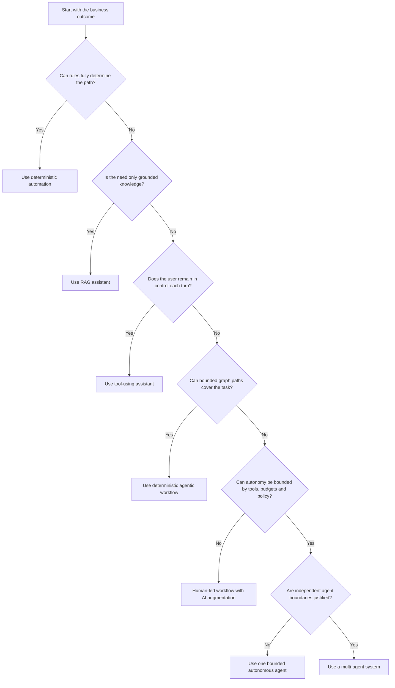

## 1.20 Chapter review

### Key lessons

- Agency, autonomy and authority are separate architecture decisions.
- Models propose; deterministic controls authorize and execute.
- Begin with the simplest architecture that meets the outcome.
- State is authoritative; memory is supplemental.
- Another model call is not automatically another agent.

### Architecture checklist

- [ ] Business goal has measurable acceptance criteria.
- [ ] Non-goals and prohibited actions are explicit.
- [ ] Authority is represented outside the prompt.
- [ ] Every tool has impact classification and typed contracts.
- [ ] State, memory and knowledge stores are distinguished.
- [ ] Human intervention is a real runtime state.
- [ ] Termination and budgets are defined.
- [ ] The chosen maturity level is justified against simpler alternatives.

### Common mistakes

- Calling any chat application an agent.
- Giving a model broad credentials because the user already has them.
- Using reflection as proof of correctness.
- Adding multiple agents to mirror an organisation chart.
- Treating confidence scores as authorization.

### Review questions

1. What is the difference between autonomy and authority?
2. Which facts in your use case must be structured state rather than model memory?
3. What evidence would justify moving from a deterministic workflow to a bounded agent?
4. Which side effects require human approval?
5. How would you prove the agent terminated for the correct reason?

### Practical exercise

Choose one enterprise process. Write one sentence each for its goal, non-goal, maximum authority, five permitted actions, five prohibited actions, completion condition and escalation condition. Classify it on the maturity model and write why the previous level is insufficient.

### Further reading

[S1], [S5], [S6], [S9], [S10].

---

# Chapter 2 — Agentic AI reference architecture

## 2.1 Architectural principle

A reference architecture must separate **what the system does for one request** from **how the organisation governs all agents**.

- The **data plane** executes request-specific model, retrieval, state and tool interactions.
- The **control plane** defines agents, tools, prompts, models, policies, identities, budgets and deployment rules.
- The **management and assurance plane** manages ownership, risk, evaluation evidence, change, incidents, cost and retirement.

This separation prevents the agent runtime from becoming both the actor and its own regulator.

## 2.2 Conceptual layered architecture

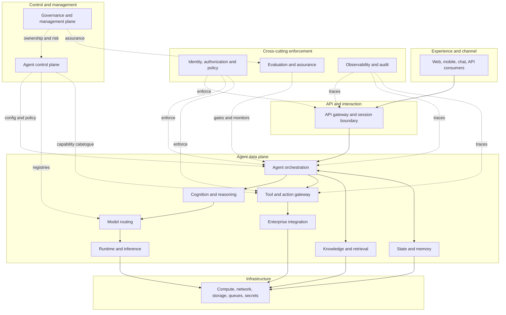

## 2.3 Layer responsibility catalogue

The following table is deliberately dense: it is intended as an architecture review checklist rather than a product shopping list.

| # | Layer | Responsibilities | Inputs / outputs and interfaces | Data and security boundary | Scaling characteristics | Failure modes | Required telemetry |
|---:|---|---|---|---|---|---|---|
| 1 | Experience and channel | Present interaction, collect user intent, display approval and evidence | UI events, chat messages, files; HTTP/WebSocket/event interfaces | User content, identity context; untrusted input boundary | Session and regional traffic | spoofed user, malformed uploads, lost approval context | user/session ID, channel, consent, request size, response status |
| 2 | API and interaction | Authentication, request validation, rate limiting, session binding, streaming | REST/gRPC/WebSocket/events | First enterprise trust boundary | Horizontal stateless scale; sticky streams only if needed | auth failure, overload, replay, schema mismatch | request/trace IDs, auth result, rate-limit decision, latency |
| 3 | Agent orchestration | Run loop/graph, dispatch nodes, maintain lifecycle, cancellation, checkpoints | Typed run request; state updates and final disposition | Holds control flow but should not own broad credentials | Scale by run/tenant; durable workers for long runs | loops, lost state, duplicate execution, orphan run | run/node/edge, transition reason, retries, termination |
| 4 | Cognition and reasoning | Interpret, plan, select candidate actions, critique and verify | Context package; structured plan/action proposals | Probabilistic boundary; outputs are untrusted proposals | Model-call dependent; cache reusable instructions | hallucination, goal drift, premature completion | model/prompt version, structured validity, action rationale summary |
| 5 | Model-routing | Select provider/model based on task, risk, modality, cost, residency | Task metadata, policy and budgets; model endpoint | Provider and residency boundary | Per-model quotas and failover pools | wrong model, unavailable region, unsupported features | route decision, model ID/version, fallback, tokens, cost |
| 6 | Tool and action | Register capabilities, validate args, enforce policy, execute and validate results | Typed tool call/result; function, MCP or service interface | Critical side-effect boundary | Bulkheads by tool/tenant/impact | wrong arguments, privilege abuse, duplicate write | tool/version, principal, policy result, latency, idempotency key |
| 7 | Integration | Adapt enterprise APIs, DBs, queues, SaaS, files and legacy systems | Service APIs, events, data contracts | Cross-system identity and data boundary | Scale per dependency; queue buffering | downstream outage, schema drift, partial commit | dependency, operation, status, retry, correlation ID |
| 8 | Knowledge and retrieval | Ingest, index, search, rerank, cite, enforce document ACLs | Query, filters; passages and provenance | Sensitive enterprise knowledge boundary | Index and query scaling; freshness pipeline | stale/poisoned data, permission leakage, poor recall | query, filters, source IDs, scores, index version, latency |
| 9 | State and memory | Persist authoritative run state and approved retained memory | State snapshots, events, memory records | Tenant/user isolation and retention boundary | Strong consistency for critical state; separate memory tiers | corruption, stale state, cross-user leakage | state version, checkpoint, writer, schema version, retention |
| 10 | Identity, authorization and policy | Human/workload identity, delegated authority, policy decisions, scoped tokens | Claims, requested action, resource and context; permit/deny | Primary enforcement boundary | Low-latency cache with centrally managed policy | confused deputy, stale policy, overbroad token | subject, agent, tool, resource, decision, policy version |
| 11 | Evaluation and assurance | Offline tests, runtime validators, sampling, deployment gates, incident analysis | Traces, datasets, rubrics; scores and verdicts | Evaluation data may contain sensitive production samples | Batch plus near-real-time monitors | biased judge, data contamination, proxy optimisation | evaluator/version, dataset/version, criterion results, confidence |
| 12 | Observability and audit | Logs, metrics, traces, event evidence, redaction, forensic package | Signals from every layer | Telemetry can leak prompts/secrets; redaction boundary | High-volume stream and tiered retention | missing correlation, tampering, excessive sensitive capture | trace/run/session/task/tool IDs, timestamps, hashes, retention |
| 13 | Runtime and inference | Execute model requests, batching, streaming, caches and local models | Tokenised requests; outputs and usage | Model endpoint or self-hosted inference boundary | GPU/CPU/endpoint capacity and queueing | saturation, timeout, cold start, quota | TTFT, ITL, tokens, batch, queue, cache hit, GPU/endpoint status |
| 14 | Infrastructure | Compute, containers, network, storage, queues, secrets, service mesh | Workloads and platform APIs | Network, cluster, account and region boundaries | Autoscaling, quotas and failover | outage, resource exhaustion, secret compromise | resource, network flow, deployment, health, capacity |
| 15 | Agent control plane | Registries, policy administration, deployment, budgets, routing and kill switch | Versioned definitions and signed configuration | Administrative boundary separated from runtime identities | Read-heavy distribution; avoid runtime synchronous dependency where possible | stale config, central bottleneck, unauthorised change | config/version, approver, deployment, propagation, rollback |
| 16 | Governance and management | Ownership, risk, compliance, vendor/change/incident/cost management | Inventory, evidence, metrics, risk decisions | Organisational accountability boundary | Process scale across portfolio | orphan agents, undocumented changes, unresolved risk | owner, risk tier, approvals, exceptions, incidents, retirement |

## 2.4 Representative technology categories

This stage is vendor-neutral. Representative mappings are illustrative:

- **Graph/orchestration:** LangGraph, Semantic Kernel, AutoGen, CrewAI, LlamaIndex workflows, Haystack pipelines, Temporal for durable workflows.
- **SDK-based agent runtime:** OpenAI Agents SDK, Anthropic Agent SDK, cloud-specific agent SDKs.
- **Inference/runtime:** managed model APIs, vLLM, SGLang, NVIDIA inference stacks, hyperscaler endpoints.
- **State:** relational databases, document stores, event stores, graph checkpoints.
- **Retrieval:** search engines, vector stores, hybrid retrieval, knowledge graphs.
- **Policy:** external policy engines, gateway rules, custom authorization services.
- **Observability:** OpenTelemetry plus vendor or open-source backends. OpenTelemetry’s GenAI conventions are evolving, so pin semantic-convention versions and record extensions [S12].
- **Durability:** workflow engines such as Temporal use event history and replay to recover workflow progress; application-level side effects still need correct activity and idempotency design [S11].

> **Architect’s Decision:** Select a category because of a required capability, not because a framework advertises “agents.”

## 2.5 Deployment architecture

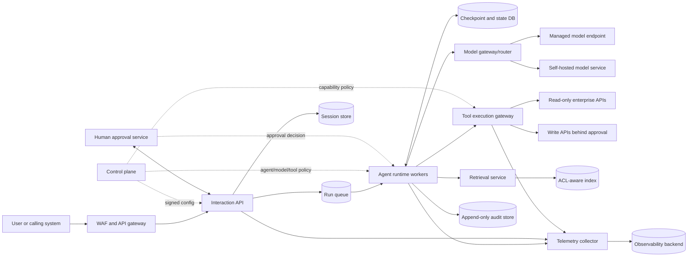

### Deployment notes

- The request API should enqueue long-running work instead of holding a synchronous connection indefinitely.
- Agent workers should not receive unrestricted user credentials. They should request short-lived, action-scoped authority from an identity/policy service.
- The tool gateway is a separate policy enforcement point and bulkhead.
- Audit storage is logically separate from mutable operational state.
- Control-plane configuration should be cached and signed so that every runtime action does not depend on a remote central service.

## 2.6 Trust-boundary diagram

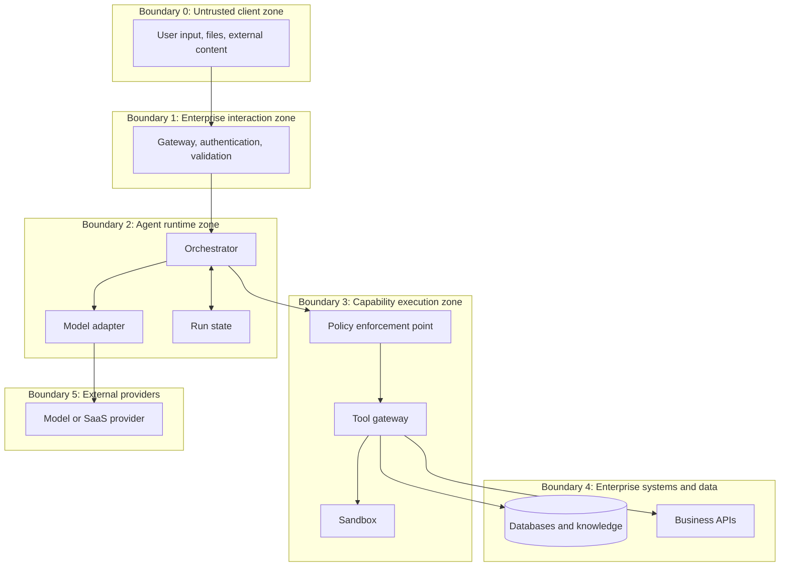

**Required controls at each crossing**

1. T0→T1: authenticate, validate size/type, malware scanning, content classification and rate limits.
2. T1→T2: bind identity and purpose; remove unsupported client claims; create run and trace IDs.
3. T2→T3: validate typed tool arguments; authorize agent-on-behalf-of-user; apply approval and budgets.
4. T3→T4: use scoped workload identity, idempotency, downstream rate limits and result validation.
5. T2→T5: enforce data residency, redaction, provider policy, model allowlist and telemetry controls.

## 2.7 Request sequence diagram

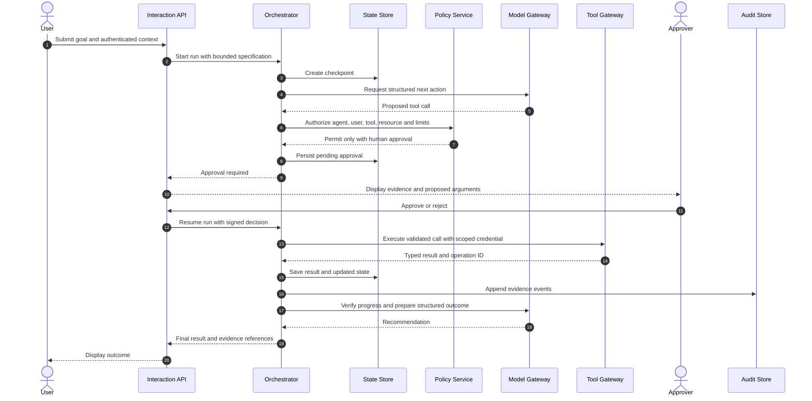

## 2.8 Control-plane and data-plane diagram

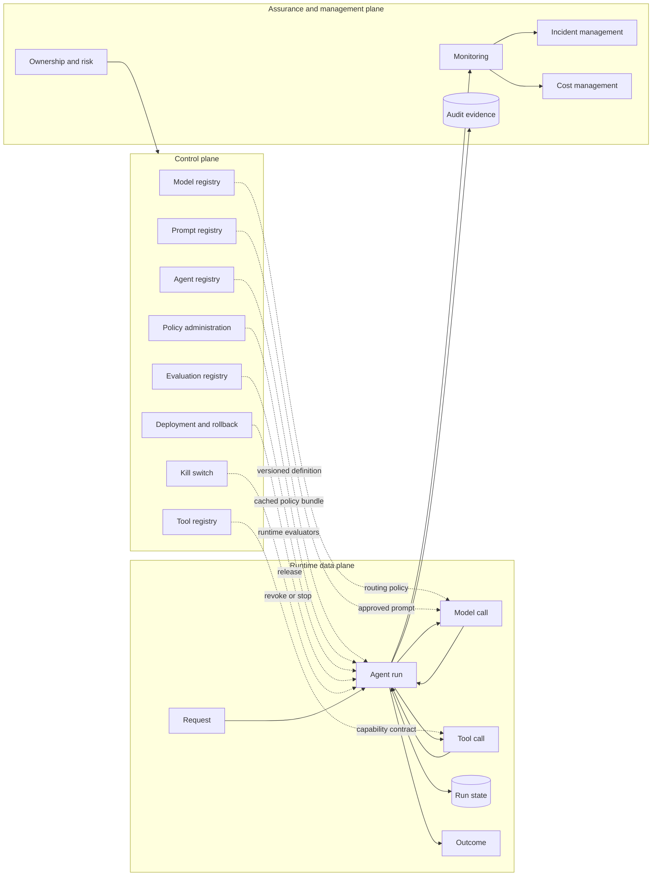

## 2.9 Component responsibility matrix

Legend: **A** accountable, **R** responsible, **C** consulted, **I** informed.

| Capability | Product owner | Agent architect | Platform team | Security/IAM | Data/knowledge team | Risk/governance | Operations |
|---|---|---|---|---|---|---|---|
| Business goal and acceptance criteria | A/R | C | I | I | C | C | I |
| Agent/graph design | C | A/R | C | C | C | C | C |
| Tool contract and side-effect class | A | R | C | C | C | C | C |
| Identity and authorization | C | C | R | A/R | I | C | C |
| Retrieval quality and ACLs | C | C | C | C | A/R | C | C |
| Model and routing policy | C | A/R | R | C | C | C | C |
| Evaluation and deployment gates | A | R | C | C | C | A/R | C |
| Runtime SLOs and incident response | C | C | R | C | C | I | A/R |
| Audit, retention and evidence | I | C | R | C | C | A | R |
| Retirement | A | R | R | C | C | A | R |

## 2.10 Scaling and bottleneck principles

1. **Keep control-plane reads off the critical path where safe.** Distribute signed, versioned policy and registry snapshots; use central services for administration and revocation, not every low-risk read.
2. **Bulkhead tools by impact.** A slow document search should not exhaust the worker pool used for privileged writes.
3. **Separate model concurrency from run concurrency.** A run may wait on a tool or human approval without consuming an inference slot.
4. **Persist before external side effects.** Record intended action and idempotency key before execution; record operation result afterward.
5. **Design for at-least-once delivery.** Exactly-once behaviour is usually achieved through idempotent business operations, not magical transport guarantees.
6. **Use queues for load shaping.** Apply admission control, priority and backpressure before model and tool dependencies collapse.
7. **Trace across boundaries.** A final answer is insufficient evidence when the run includes retrieval, sub-agents and side effects.

## 2.11 Reference architecture failure scenarios

| Scenario | Architectural cause | Required response |
|---|---|---|
| Model proposes a forbidden write | Missing separation of proposal and execution | Tool gateway denies; audit policy decision; agent replans or escalates |
| Worker crashes after downstream write | Side effect not idempotent or operation ID not recorded | Reconcile by idempotency key; resume from checkpoint |
| Retrieval returns another tenant’s document | Retrieval ACL filter not bound to authenticated principal | Block response, incident, purge contaminated traces, test boundary |
| Human approves stale arguments | Approval artefact not bound to exact tool-call hash/version | Reject and request new approval |
| Control plane unavailable | Runtime synchronously depends on every registry read | Use last-known valid signed config within expiry; deny high-risk actions if stale |
| Model provider deprecates feature | Unpinned provider capability and no compatibility test | Route to compatible model; deployment gate; update adapter |
| Telemetry captures secrets | No redaction/classification before export | Stop export, rotate secret, delete where possible, add field-level policy |

## 2.12 Chapter review

### Key lessons

- Separate request execution, platform control and organisational assurance.
- Treat model outputs as untrusted proposals at a probabilistic boundary.
- Place tool execution behind an independent policy enforcement point.
- Persist authoritative state and audit evidence separately.
- Design control-plane distribution so governance does not become a runtime bottleneck.

### Architecture checklist

- [ ] All 16 layers have an owner or explicit non-applicability rationale.
- [ ] Trust boundaries and data classifications are drawn.
- [ ] Tool execution is isolated from model routing.
- [ ] Runtime uses scoped workload identity.
- [ ] State supports recovery and approval resumption.
- [ ] Model provider and retrieval boundaries are governed.
- [ ] Trace identifiers cross all services.
- [ ] Control-plane version and policy decisions are recorded per run.

### Common mistakes

- Combining orchestration, policy and tools in one privileged service.
- Making every control-plane query synchronous in the hot path.
- Treating vector retrieval as inherently access controlled.
- Using logs as the sole state store.
- Recording prompts but not state transitions and tool operation IDs.

### Review questions

1. Which components must remain available when the model provider is down?
2. Where is the final enforcement point for a write?
3. How does a resumed run prove an approval is still valid?
4. Which control-plane artefacts must be immutable or signed?
5. What is the recovery strategy after a duplicate event delivery?

### Practical exercise

Draw the six required diagrams for your selected use case. Mark every location where user identity, agent identity, tool identity, sensitive data and approval state cross a boundary.

### Further reading

[S2], [S3], [S4], [S9], [S10], [S11], [S12].

---

# Part II — Agent Loop Engineering

# Chapter 3 — Anatomy of the agent loop

## 3.1 Why loop engineering is an architectural discipline

A model call is a bounded inference operation. An agent run is a potentially long-lived distributed process that may call models, retrieve data, invoke tools, wait for humans, retry failures and resume after infrastructure restarts. **Loop engineering** is the deliberate design of that process so that each step has explicit inputs, outputs, budgets, policies, evidence and termination semantics.

The loop must answer six questions at every transition:

1. **What is known?** Authoritative state, observations and evidence.
2. **What remains?** Unmet acceptance criteria and unresolved risks.
3. **What may happen next?** Allowed actions under the current policy and budget.
4. **What actually happened?** Validated tool or model result, not an assumed result.
5. **Did the run make progress?** A measurable change toward a postcondition.
6. **Should execution continue?** Continue, retry, compensate, degrade, escalate, cancel or terminate.

> **Production Warning:** An LLM instruction such as “do not loop” is not a loop-control mechanism. Turn limits, deadlines, repetition detection and termination assertions belong in deterministic runtime code.

## 3.2 The complete 18-step production loop

The following sequence is logical rather than necessarily synchronous. A graph may split steps into nodes, and a durable workflow may pause between any two steps.

| Step | Operation | Required artefact | Typical failure | Deterministic control |
|---:|---|---|---|---|
| 1 | Receive goal or event | Authenticated request, event ID | Ambiguous or duplicated request | Input schema, deduplication key |
| 2 | Establish context | Tenant, user, task and environment context | Wrong tenant or stale configuration | Identity binding, configuration version |
| 3 | Interpret intent | Structured intent and confidence/evidence | Misclassification | Schema validation, fallback or human clarification |
| 4 | Retrieve state and memory | Current checkpoint and relevant memories | Stale, poisoned or cross-user memory | Versioning, ACLs, provenance, expiry |
| 5 | Plan | Bounded plan or next-action proposal | Impossible, unsafe or wandering plan | Allowed-action set, plan validator |
| 6 | Select model | Routing decision | Wrong capability, residency or cost tier | Model registry and routing policy |
| 7 | Select tool or sub-agent | Capability reference and version | Hallucinated or excessive capability | Registry allowlist and capability discovery |
| 8 | Validate arguments | Typed, canonical arguments | Missing, malformed or injected fields | Strict schema, semantic checks |
| 9 | Check authorization and policy | Permit/deny/approval decision | Confused deputy or excess privilege | PDP/PEP, scoped workload identity |
| 10 | Execute | Operation ID and deadline | Timeout, duplicate write, dependency failure | Idempotency, retries, circuit breaker |
| 11 | Observe result | Typed result and provenance | Model assumes success | Tool-result schema and status |
| 12 | Update state | New checkpoint and event | Lost update or hidden mutation | Transaction/version check, event record |
| 13 | Verify progress | Criterion-level progress assessment | Cosmetic progress, false completion | Runtime assertions, verifier |
| 14 | Replan or continue | Revised next step | Repeating same failed action | Retry budget, dead-end/backtracking rules |
| 15 | Request human intervention | Approval/escalation package | Approval detached from exact action | Content hash, expiry, approver authority |
| 16 | Determine termination | Terminal status and reason | Premature finish or endless loop | Explicit postconditions and stop predicates |
| 17 | Produce final response | Structured answer/evidence package | Unsupported claim | Grounding/citation/output validation |
| 18 | Record evidence and audit | Append-only run events | Missing or sensitive telemetry | Redaction, integrity, retention policy |

### Sequence view

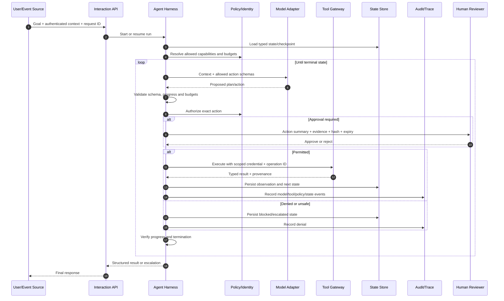

## 3.3 Framework-independent production pseudocode

```text
function run_agent(request, resume_token=None):
    identity = authenticate(request)
    run = load_or_create_run(request.idempotency_key, resume_token)
    policy_snapshot = load_signed_policy_snapshot(identity, run.agent_version)
    deadline = now() + run.time_budget

    while run.status == RUNNING:
        assert now() < deadline
        assert run.turns < run.max_turns
        assert run.tool_calls < run.max_tool_calls
        assert run.remaining_cost >= 0

        state = state_store.read(run.id, expected_schema=run.state_schema)
        context = context_builder.build(
            goal=run.goal,
            state=state,
            allowed_capabilities=policy_snapshot.capabilities,
            evidence=select_relevant_evidence(state),
            token_budget=run.context_budget,
        )

        proposal = planner.propose_next_action(context)
        proposal = action_schema.validate(proposal)
        reject_if_repeated_or_no_progress(proposal, state)

        if proposal.kind == FINISH:
            assert acceptance_criteria_satisfied(state, proposal)
            result = output_schema.validate(proposal.output)
            state_store.complete(run.id, result)
            audit.append(FINISHED, evidence_summary(result))
            return result

        if proposal.kind == ESCALATE:
            package = build_human_evidence_package(state, proposal)
            state_store.pause(run.id, package)
            audit.append(ESCALATED, package.metadata)
            return package

        capability = tool_registry.resolve_exact(proposal.tool, proposal.version)
        arguments = capability.input_schema.validate(proposal.arguments)
        decision = policy_engine.decide(
            principal=identity,
            agent=run.agent_identity,
            capability=capability,
            arguments=arguments,
            state=state,
            budgets=run.budgets,
        )

        if decision.requires_approval:
            approval = approvals.obtain_or_pause(
                bind_to=hash(capability, arguments, state.version),
                expires_at=decision.expiry,
            )
            if approval.rejected:
                state_store.block(run.id, approval.reason)
                return blocked_result(approval.reason)

        operation_id = derive_idempotency_key(run.id, state.step, proposal)
        audit.append(ACTION_AUTHORIZED, redacted(proposal), decision.id)

        try:
            result = execute_with_timeout_retry_and_circuit_breaker(
                capability,
                arguments,
                scoped_credential=decision.credential,
                operation_id=operation_id,
                cancellation=run.cancellation_token,
            )
        except Cancellation:
            compensate_if_required(state)
            state_store.cancel(run.id)
            return cancelled_result()

        observation = capability.output_schema.validate(result)
        new_state = transition(state, proposal, observation)
        progress = verifier.measure_progress(state, new_state, run.acceptance_criteria)

        if progress.dead_end:
            new_state = recovery_policy.backtrack_or_escalate(new_state)

        state_store.compare_and_swap(state.version, new_state)
        audit.append(OBSERVED, redacted(observation), progress.summary)

    raise InvalidTerminalState
```

The pseudocode intentionally does not ask the model to enforce security policy or remember whether a side effect occurred. Those are runtime responsibilities.

## 3.4 Loop pattern comparison

| Pattern | Control idea | Appropriate when | Avoid when | Main failure mode | Evaluation focus |
|---|---|---|---|---|---|
| **ReAct** [S5] | Interleave observations and action selection | Uncertain sequence, useful tool feedback | Strictly fixed process | Repetition, brittle textual traces | Tool selection, argument accuracy, loop efficiency |
| **Plan-and-execute** | Produce plan, then execute steps | Decomposition is valuable and plan is moderately stable | Environment changes rapidly | Stale plan, plan overcommitment | Plan feasibility and execution recovery |
| **Planner–executor** | Separate planning from execution boundary | Privilege separation or different model tiers | Tiny tasks | Coordination overhead | Plan quality, executor compliance |
| **Router–specialist** | Route request to one bounded specialist | Distinct domains/tools | Heavy cross-domain dependencies | Misrouting, loss of context | Routing accuracy, specialist task success |
| **Reflexion** [S6] | Use feedback retained across attempts | Repeated tasks with meaningful feedback | Memory cannot be trusted or task is one-shot | Self-reinforced false lessons | Improvement over attempts, memory correctness |
| **Critic–reviser** | Critic identifies defects; reviser updates | Quality can be checked against a rubric | Critic shares the same blind spot | Endless polishing, style bias | Defect detection and correction rate |
| **Generate–verify** | Generate candidate then run independent checks | Structured, factual or executable outputs | No reliable verifier exists | False acceptance by weak verifier | Verifier precision/recall |
| **Search-based reasoning** | Explore candidate action sequences | Small bounded state/action spaces | Branching is unbounded or tools are costly | Combinatorial explosion | Search efficiency, best-path success |
| **Tree of Thoughts** [S7] | Branch, score and prune intermediate candidates | Deliberative puzzles/planning with useful value estimates | Real-time low-latency work | Judge error and token explosion | Search budget vs task success |
| **Graph of Thoughts** [S8] | Allow candidate merging/reuse in a graph | Sub-results can be combined or refined | Simple linear task | Complex state bookkeeping | Contribution of graph operations |
| **Event-driven loop** | Events awaken handlers or agents | Long-running, asynchronous integrations | Ordering and idempotency are undefined | Message storms, duplicates | Event lag, duplicate handling, completion |
| **Durable loop** | Persist event history/checkpoints and replay | Waits, outages, approvals, multi-day tasks | Short stateless request | Non-deterministic replay, incompatible changes | Recovery and replay correctness |

**Published-technique caveat:** ReAct, Reflexion, Tree of Thoughts and Graph of Thoughts are research approaches. Their publication does not make them universal production defaults. The architect must measure whether they improve task outcomes enough to justify added calls, latency and evaluation complexity.

## 3.5 Budgets and bounded execution

A budget is an enforceable resource ceiling, not a prompt preference.

### Required budget dimensions

- **Maximum turns:** upper bound on planner iterations.
- **Token budget:** input, output and any provider-specific reasoning-token ceilings.
- **Time budget:** wall-clock deadline and per-call timeout.
- **Cost budget:** estimated and actual spend guard.
- **Tool-call budget:** global and per-capability limits.
- **Recursion/delegation depth:** prevents recursive sub-agent creation.
- **Concurrency budget:** maximum active branches and external calls.
- **Side-effect budget:** count/value/risk-class limits for writes.
- **Human-review budget:** optional operational constraint, never a reason to bypass mandatory review.

A practical budget policy can be represented as typed state:

```python
from pydantic import BaseModel, Field

class RunBudget(BaseModel):
    max_turns: int = Field(ge=1, le=50)
    max_tool_calls: int = Field(ge=0, le=100)
    deadline_epoch_ms: int
    max_estimated_cost_gbp: float = Field(ge=0)
    max_parallel_branches: int = Field(ge=1, le=16)
    max_delegation_depth: int = Field(ge=0, le=5)
```

> **Performance Trade-off:** A large budget is not merely expensive; it expands the space in which the system can repeat, drift, expose data or compound errors.

## 3.6 Repetition, stall and progress detection

### Repetition detection

Create a canonical fingerprint from the action name, version and normalized arguments. Stop, replan or escalate when the same fingerprint recurs beyond a policy threshold without a materially different observation.

### Stall detection

A loop is stalled when activity occurs but acceptance criteria do not advance. Signals include:

- identical or semantically equivalent tool calls;
- repeated retrieval of the same evidence;
- unchanged unresolved-criteria set;
- plan revisions that rename rather than alter steps;
- repeated verifier failures;
- oscillation between two states.

### Progress measurement

Define progress as a vector rather than a vague scalar:

```text
progress = {
  grounded_requirements_resolved: 4 / 5,
  mandatory_approvals_obtained: 1 / 2,
  validation_errors_remaining: 0,
  side_effects_reconciled: true,
  unresolved_risk_severity: "medium"
}
```

A model can assist with semantic assessments, but deterministic facts—completed steps, successful operations, approvals and budgets—must come from authoritative state.

## 3.7 Termination semantics

Every run needs mutually exclusive terminal states such as:

- `COMPLETED`: all postconditions satisfied;
- `PARTIAL`: bounded useful output with declared unmet criteria;
- `WAITING_FOR_APPROVAL`: resumable pause;
- `BLOCKED`: policy, missing evidence or dependency prevents continuation;
- `FAILED`: unrecoverable technical failure;
- `CANCELLED`: requester or control plane cancelled the run;
- `BUDGET_EXHAUSTED`: resource ceiling reached;
- `COMPENSATION_REQUIRED`: prior side effect needs remediation.

A final natural-language answer does not itself prove completion. The runtime should evaluate postconditions before accepting a `finish` proposal.

## 3.8 Failure and recovery mechanics

### Dead-end recovery and backtracking

A dead end occurs when no permitted action can satisfy the remaining criteria. Recovery order should be explicit:

1. reconsider an earlier reversible decision;
2. obtain a different approved evidence source;
3. use a compatible fallback tool or model;
4. return partial results with limitations;
5. escalate to a human;
6. fail safely.

Backtracking must not silently erase completed writes. State should distinguish logical planning choices from irreversible environmental history.

### Checkpointing and state recovery

Checkpoint before:

- external writes;
- human waits;
- expensive branches;
- handoffs;
- model/provider migration boundaries;
- operations that cannot be cheaply reproduced.

A checkpoint should include state schema version, graph/agent version, completed operation IDs, pending action hash, policy/config version and provenance references. LangGraph’s documented persistence model saves graph state checkpoints and its interrupt mechanism can pause and resume work [S3][S4]. Durable workflow systems such as Temporal reconstruct logical workflow state from event history and separate workflow decisions from I/O activities [S12].

### Idempotency

Idempotency means retrying the same logical operation produces no additional unintended effect. Use a stable key derived from the business operation, not a random key regenerated on every retry.

```text
idempotency_key = hash(tenant_id, business_object_id, operation_type, intended_version)
```

The downstream service—not only the agent—must persist and enforce the key.

### Retry policies

Retry only errors classified as transient. A recommended policy includes:

- maximum attempts;
- exponential backoff;
- randomized jitter;
- total retry deadline;
- retryable error allowlist;
- circuit breaker;
- idempotency requirement for side effects.

Do not retry validation failures, authorization denials, unknown business objects or non-idempotent writes unless a compensation/reconciliation protocol exists.

### Compensation actions

A compensation is a business operation that counteracts a completed side effect; it is not database rollback across arbitrary services. Record the original and compensating operation IDs and accept that compensation may be partial or fail.

### Cancellation and timeout propagation

Cancellation should flow from run → branch → model/tool call. The runtime must know whether a timed-out operation may still complete downstream. For writes, query by operation ID before retrying.

### Partial completion

Partial results are valid only when:

- completed and incomplete criteria are explicit;
- no unsafe assumption is hidden;
- side effects are reconciled;
- downstream consumers can distinguish partial from complete;
- policy permits partial delivery.

### Model and tool fallback

Fallback must preserve or tighten policy. A cheaper or different model must not silently gain broader tools, data residency or output authority. Tool fallback requires semantic equivalence or an explicit degradation contract.

### Graceful degradation

Examples:

- return source excerpts without synthesis when the model is unavailable;
- draft a ticket but do not submit when approval service is unavailable;
- use cached read-only data within a declared freshness limit;
- route to manual processing for high-risk actions;
- disable optional reflection/revision passes when latency budget is tight.

## 3.9 Human escalation design

A high-quality escalation package contains:

- run, task and correlation IDs;
- exact question or action requiring judgment;
- evidence and provenance;
- model-generated recommendation clearly labelled as such;
- policy reason for escalation;
- exact proposed arguments and side effects;
- approval hash bound to arguments, state version and tool version;
- expiry and revocation state;
- available choices and consequences.

> **Governance Requirement:** “Human in the loop” is not effective if the reviewer receives no evidence, cannot alter the outcome, is overloaded, or approves a different action than the one later executed.

## 3.10 Plain Python implementation mapping

The supplied `src/stage1_agent/core.py` implements an offline loop with:

- strict Pydantic argument schemas (`extra="forbid"`);
- read-only and reversible-write impact classes;
- turn, tool-call and wall-clock budgets;
- repeated-action fingerprint detection;
- deterministic approval for non-read tools;
- stable idempotency key for ticket creation;
- typed tool results and error codes;
- bounded retries;
- append-only JSONL audit events;
- explicit completed, blocked, waiting and exhausted statuses.

Key execution boundary:

```python
if spec.impact != ToolImpact.READ_ONLY:
    decision = (
        approval_callback(action, spec)
        if approval_callback is not None
        else ApprovalDecision.REJECT
    )
    if decision != ApprovalDecision.APPROVE:
        state.status = AgentStatus.WAITING_FOR_APPROVAL
        state.final_response = (
            f"Approval is required before executing {spec.name}."
        )
        break

observation = self._execute_tool(state, action, spec)
state.observations.append(observation)
```

The planner can propose a write, but only the harness can authorize and execute it.

### Run it

```bash
cd agentic-ai-architect-stage1
PYTHONPATH=src python examples/plain_python_agent.py --approve-write
```

Expected semantic result:

```text
status: completed
turns: 4
policy: POL-017
control: CTRL-101
owner: Privacy Office
review ticket: REV-0001
```

Identifiers may differ if the example is modified. The test suite checks behaviour rather than brittle console formatting.

## 3.11 Graph-based implementation mapping

The supplied `examples/langgraph_agent.py` maps the same logic to a typed `StateGraph`:

```python
builder = StateGraph(GraphState)
builder.add_node("retrieve_policy", retrieve_policy)
builder.add_node("resolve_owner", resolve_owner)
builder.add_node("approval_gate", approval_gate)
builder.add_node("create_ticket", create_ticket)
builder.add_node("finish", finish)

builder.add_edge(START, "retrieve_policy")
builder.add_conditional_edges(
    "approval_gate",
    route_after_approval,
    {"create_ticket": "create_ticket", "end": END},
)
return builder.compile(checkpointer=InMemorySaver())
```

This uses the current documented LangGraph concepts of shared state, nodes, edges, conditional routing, compilation and checkpointing [S2][S3]. `InMemorySaver` is appropriate only for the lab; production requires a durable checkpointer and lifecycle controls.

## 3.12 SDK-based implementation mapping

The supplied `examples/openai_agents_sdk_agent.py` illustrates the current OpenAI Agents SDK concepts of an `Agent`, `Runner`, function tools, model settings and a Pydantic structured output [S14]. It deliberately limits the model to a **recommendation**:

```python
agent = Agent(
    name="Policy Analysis Agent",
    instructions=(
        "Analyse the proposed change using only tool evidence. Never invent a "
        "policy or owner. Return a recommendation, not an authorization decision. "
        "Critical writes require an external deterministic approval gate."
    ),
    tools=[lookup_policy, lookup_control_owner],
    output_type=ReviewRecommendation,
    model=os.getenv("OPENAI_MODEL", "gpt-5.4-mini"),
    model_settings=ModelSettings(temperature=0.0),
)
result = Runner.run_sync(agent, user_request, max_turns=6)
```

The example disables provider tracing by default to avoid accidental export of tutorial data. In production, enable governed tracing with redaction and retention controls, or integrate the SDK trace with the enterprise observability design.

> **Implementation Note:** Framework turn limits and structured outputs are useful, but they do not replace a policy engine, scoped credential, idempotent downstream API or approval binding.

## 3.13 Production-readiness checklist

- [ ] All terminal states and postconditions are explicit.
- [ ] Turn, token, time, cost, tool, concurrency and delegation budgets are enforced.
- [ ] Every tool has typed schemas, impact class, timeout, retry and operation-ID semantics.
- [ ] Repeated actions and progress stalls are detected.
- [ ] Model proposals are validated before execution.
- [ ] Authorization is external to the model.
- [ ] Human approval is bound to exact action content and expires.
- [ ] Checkpoints precede waits and high-impact side effects.
- [ ] Writes are idempotent or have compensation/reconciliation.
- [ ] Cancellation propagates and uncertain downstream completion is reconciled.
- [ ] Fallbacks preserve policy and data constraints.
- [ ] Audit events contain evidence summaries, not hidden chain-of-thought.

## 3.14 Chapter review

### Key lessons

- The agent loop is a controlled state-transition system, not an unbounded conversation.
- Progress, termination, recovery and authorization must be deterministic runtime concepts.
- Published reasoning patterns are options to benchmark, not default architecture.
- Durable state and idempotency are prerequisites for long-running or side-effecting agents.

### Architecture checklist

- [ ] Draw the exact loop and identify every probabilistic boundary.
- [ ] Define a progress vector and terminal-state schema.
- [ ] Write the retry matrix by error class.
- [ ] Define checkpoint and idempotency strategy.
- [ ] Specify human escalation evidence.

### Common mistakes

- Retrying every failure.
- Regenerating an idempotency key for each attempt.
- Accepting a model’s “done” statement without postcondition checks.
- Storing only chat history, not authoritative state.
- Allowing a fallback model to bypass original constraints.
- Treating a timeout as proof that a write did not occur.

### Review questions

1. Which facts in your loop are authoritative and which are model interpretations?
2. How is progress measured after each action?
3. What happens if the worker crashes after a successful write but before saving state?
4. What exact data is bound to a human approval?
5. Which failures are retryable, and why?

### Practical exercise

Add a simulated transient error to `search_policy`, allow one retry, and verify through the JSONL audit that only retryable errors are retried. Then make `create_review_ticket` return a timeout after persisting the ticket and design a reconciliation step using its idempotency key.

### Further reading

[S1], [S2], [S3], [S4], [S5], [S6], [S7], [S8], [S12], [S14].

---

# Part III — Graph Engineering

# Chapter 4 — Designing agent execution graphs

## 4.1 Definition

**Graph engineering** is the intentional design of nodes, edges, shared or private state, transition predicates, branches, cycles, checkpoints, recovery routes and terminal conditions for agent execution.

A graph is valuable when it makes control flow, state ownership and failure handling explicit. A graph is harmful when it merely hides a monolithic agent behind boxes.

Formally, a graph can be represented as:


a directed structure \(G=(V,E)\), with state \(S\), transition function \(\delta\), node contracts \(C_v\), edge predicates \(P_e\), start set \(V_0\) and terminal set \(V_T\).

Each node should implement a bounded transformation:


a node reads an allowed projection of state, performs one coherent responsibility, and returns a typed update or event.

## 4.2 Graph families

| Graph family | Control characteristics | Best fit | Principal risk |
|---|---|---|---|
| **Directed acyclic graph (DAG)** | No cycles; fixed dependency order | Batch transformations, fixed analysis pipelines | Poor fit for correction/retry loops |
| **Cyclic state graph** | Explicit bounded loops | Tool-use, revise/verify, iterative retrieval | Unbounded cycles without counters |
| **Finite state machine** | Enumerated states/events | Approval, lifecycle and protocol logic | State explosion |
| **Behaviour tree** | Selector/sequence/decorator semantics | Robotics, game-like reactive control, fallback hierarchies | Hidden shared-state coupling |
| **Workflow graph** | Business tasks, timers, waits, compensations | Long-running enterprise processes | Mixing non-deterministic workflow code with replay |
| **Dynamic graph** | Nodes/edges selected or created at runtime | Variable decomposition with bounded templates | Unbounded topology and weak governance |
| **Hierarchical graph** | Subgraphs encapsulate domains | Large systems with composable teams | Cross-level state confusion |
| **Event-driven graph** | Events trigger transitions/handlers | Integrations, streams and asynchronous agents | Ordering, duplicate and message-storm risks |
| **Graph of agents** | Nodes represent autonomous/specialist agents | Clearly separable responsibilities and authority | Coordination overhead and cascading errors |

### Dataflow versus control flow

- **Dataflow:** an edge exists because node B requires data produced by A.
- **Control flow:** an edge exists because the process should transfer authority from A to B.

Conflating them can leak data to nodes that are not authorized to see it or make a node run merely because data exists.

### Static versus model-selected routing

- **Static routing:** code/policy chooses the next edge from known predicates.
- **Model-selected routing:** a model proposes the next node or specialist.

Use model-selected routing only over a registry allowlist, validate the choice, and provide an abstain/escalation route. Never accept an arbitrary node/tool name generated as free text.

## 4.3 Node design

A well-designed node has:

- one coherent responsibility;
- typed input projection and typed output update;
- explicit side-effect class;
- timeout and retry semantics;
- owner and version;
- policy and identity requirements;
- telemetry fields;
- test oracle or acceptance criteria.

### Node categories

| Node type | Purpose | Should be probabilistic? | Key control |
|---|---|---:|---|
| Reasoning node | Interpret, decompose or propose | Often | Output schema and evidence requirement |
| Retrieval node | Obtain governed evidence | Query rewrite may be | ACL filter, provenance and freshness |
| Tool node | Invoke external capability | Selection may be; execution no | Typed gateway and scoped credential |
| Validation node | Check schema/invariants | Prefer deterministic | Fail closed for critical controls |
| Policy node | Decide permit/deny/approval | Deterministic policy engine | Versioned decision evidence |
| Human-approval node | Suspend and collect decision | Human judgment | Exact action binding and expiry |
| Transformation node | Convert deterministic data | Usually no | Contract and idempotency |
| Critic node | Identify defects | May be model-based | Independent rubric, no authority |
| Aggregation node | Merge branch results | Usually deterministic structure | Missing/duplicate branch handling |
| Recovery node | Retry, fallback, compensate or escalate | Mostly deterministic | Error-class matrix |
| Audit node | Emit evidence event | No | Redaction and append-only sink |

> **Common Anti-pattern:** Putting retrieval, reasoning, policy, external write and final answer generation into one LLM node makes state, authorization and failure semantics unreviewable.

## 4.4 Edge design

| Edge type | Predicate source | Example | Risk control |
|---|---|---|---|
| Deterministic | State field or exact result | `status == owner_found` | Exhaustive route tests |
| Conditional | Boolean/multiway predicate | approved/rejected/expired | Default fail-safe edge |
| Confidence-based | Calibrated model/classifier score | route low-confidence to human | Calibration and abstention |
| Policy-based | Policy decision | permitted → execute; denied → block | Decision ID and policy version |
| Semantic routing | Model/embedding classification | finance vs HR specialist | Allowlist and confusion matrix |
| Error | Error class | timeout → retry node | Retryability taxonomy |
| Timeout | Deadline/timer | approval expired | Explicit timeout outcome |
| Escalation | Risk/uncertainty condition | missing control owner | Evidence package |
| Retry | Attempt count and error | transient 503 | Bounded backoff and idempotency |
| Compensation | Prior side-effect status | cancel ticket after downstream failure | Business reconciliation |

Every conditional node should have a defined route for unknown, malformed or missing values. “No route matched” is a designed failure state, not an uncaught exception.

## 4.5 Typed state and ownership

Typed state reduces accidental coupling and gives migration, test and telemetry boundaries.

```python
from typing import Literal
from typing_extensions import TypedDict

class ReviewState(TypedDict, total=False):
    schema_version: Literal["1.0"]
    run_id: str
    goal: str
    policy_id: str
    control_id: str
    owner: str
    approval_status: Literal["not_required", "pending", "approved", "rejected"]
    ticket_id: str
    completed_operations: list[str]
    status: str
    final_response: str
```

### State ownership

Assign one authoritative writer for each field or define a reducer for concurrent updates. For example:

- retrieval node owns `policy_id` and `control_id`;
- owner-resolution node owns `owner`;
- approval service owns `approval_status`;
- tool gateway owns `ticket_id` and completed operation IDs;
- orchestrator owns `status` and transition metadata.

A model may propose values, but authoritative identifiers should be copied from validated tool results.

### Mutable versus immutable state

- **Mutable snapshot:** easy to read; requires concurrency control and audit diffs.
- **Immutable events:** preserves history and supports replay; requires projection logic and schema governance.
- **Hybrid:** append events as evidence and maintain a versioned materialized snapshot for efficient execution.

For regulated or long-running workflows, the hybrid is usually the strongest default.

## 4.6 Event sourcing, checkpointing, replay and resumption

### Event sourcing

Record facts such as `PolicyFound`, `ApprovalGranted`, `TicketCreated` rather than only storing the current screen state. Events should be immutable, ordered per run, versioned and linked to operation IDs.

### Checkpointing

A checkpoint captures the executable state at a point in the graph. It should not replace the audit trail. A checkpoint can be mutable/compact; audit events should preserve historical evidence.

### Replay

Replay reconstructs state from history or re-executes deterministic workflow logic against recorded events. Never replay non-deterministic calls or external side effects directly. Record their outputs as history and treat them as activities/results.

### Resumption

On resume, verify:

- graph and state-schema compatibility;
- pending action/approval hash;
- policy/config freshness;
- credentials and delegated authority;
- whether external operations completed during the outage;
- remaining budgets and deadline.

## 4.7 Schema evolution and graph versioning

### State schema evolution

Use explicit versions and migration functions. Additive optional fields are easier than renaming or changing meaning. Validate historical checkpoints against the version that created them before migration.

```python
def migrate_v1_to_v2(v1: dict) -> dict:
    return {
        **v1,
        "schema_version": "2.0",
        "approval": {
            "status": v1.pop("approval_status", "pending"),
            "bound_action_hash": None,
        },
    }
```

### Graph versioning strategies

1. **Complete old runs on old graph workers.** Safest when duration is bounded.
2. **Migrate at designated safe points.** Only when state and semantics are compatible.
3. **Continue-as-new.** Create a new run linked to the prior history after a stable milestone.
4. **Cancel and restart with reconciliation.** Necessary when a security defect invalidates the old path.

### Migrating running workflows

A migration plan must answer:

- which nodes already executed;
- whether their side effects remain valid;
- how pending approvals are handled;
- how changed tool contracts are mapped;
- whether new policy applies retroactively;
- how audit continuity is preserved.

> **Governance Requirement:** Deploying a new graph definition is not automatically equivalent to migrating in-flight instances.

## 4.8 Delivery semantics and idempotent tools

### At-least-once

Messages or activities may execute more than once. This is common and practical. Handle it through stable operation IDs, deduplication and idempotent business APIs.

### At-most-once

A system avoids retries, reducing duplicate risk but allowing lost work. Suitable only when the loss is acceptable or manually reconciled.

### Exactly-once limitations

“Exactly once” across multiple independent services is usually a business effect assembled from transaction scopes, deduplication and reconciliation. Do not infer exactly-once behaviour merely because a queue or framework uses the phrase.

### Idempotent tool contract

```json
{
  "operation_id": "tenant-A:CHG-104:create-review:v1",
  "expected_resource_version": 7,
  "request": {
    "control_id": "CTRL-101",
    "owner": "Privacy Office"
  }
}
```

The response should disclose whether it created a new result or returned the prior result for the same operation ID.

## 4.9 Core graph patterns

### Sequential workflow

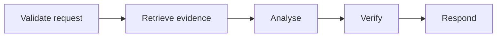

Use when order is stable and each step depends on the prior result.

### Parallel fan-out/fan-in

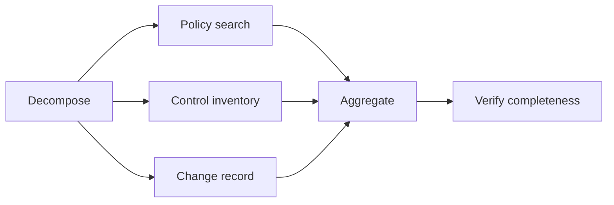

Use for independent reads. Define partial-branch and timeout semantics.

### Map-reduce agents

Map a bounded item collection to homogeneous workers, then deterministically aggregate. Avoid model-created unbounded item lists.

### Supervisor–worker

A supervisor assigns bounded work and validates contracts. It should not become a single opaque mega-agent.

### Debate and consensus

Multiple candidates critique or vote. Use only when diversity improves a measurable outcome. Correlated model errors and social-style persuasion can produce false consensus.

### Planner–executor

The planner emits a typed plan; executor nodes perform permitted operations. Replan on environmental changes or failed assumptions.

### Critic–reviser

The critic emits criterion-level defects, not a replacement answer; the reviser addresses those defects; a stop rule bounds revisions.

### Hierarchical teams

Subgraphs own domains. Expose narrow contracts and keep private state private. Use hierarchical tracing and delegation-depth limits.

### Blackboard architecture

Agents publish typed facts or hypotheses to a shared workspace. A deterministic controller controls task claiming, conflict and completion. Do not let arbitrary text become authoritative shared memory.

### Auction or market-based allocation

Workers bid using estimated suitability/cost. Useful experimentally for heterogeneous resources, but bids can be poorly calibrated or strategically distorted. Apply deterministic eligibility and budget constraints.

### Dynamic delegation

A node selects from registered specialists based on current state. Limit topology, delegation depth and total agent count.

### Exception and recovery subgraph

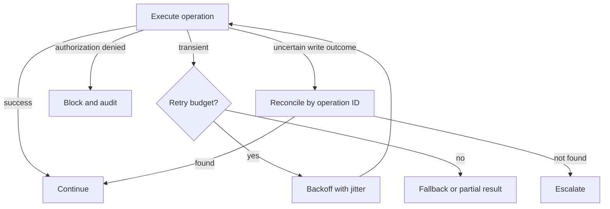

## 4.10 Complete example graph: governed policy review

### Graph

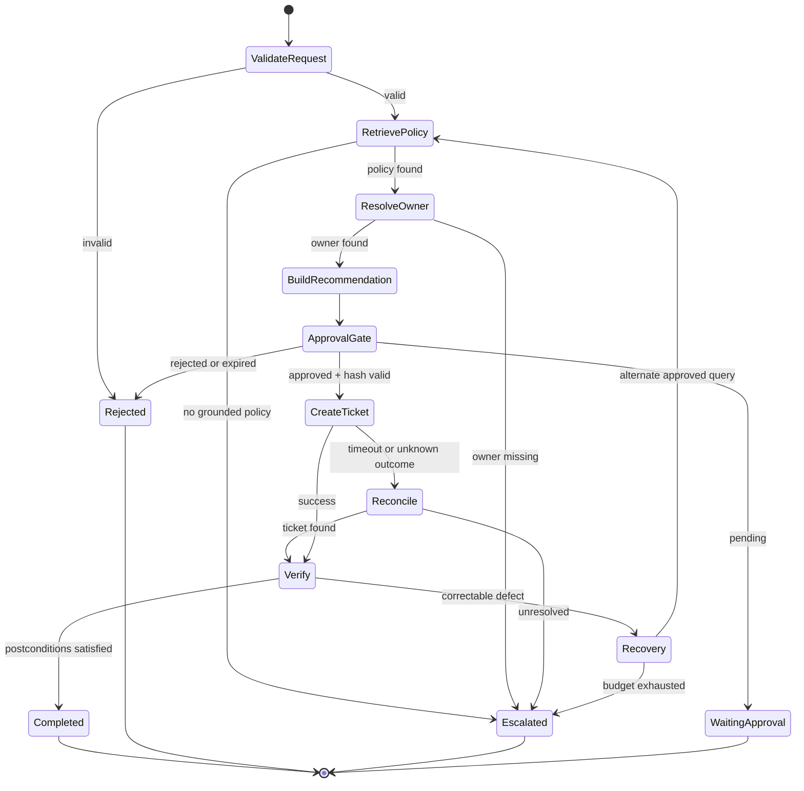

### Node-by-node contract

| Node | Reads | Writes | Side effect | Failure route | Key test |
|---|---|---|---|---|---|
| ValidateRequest | raw request, identity | canonical goal, tenant | None | Rejected | malformed/cross-tenant input denied |
| RetrievePolicy | goal, principal | policy ID, control ID, provenance | Read | Escalated | no invented policy on no match |
| ResolveOwner | control ID | owner | Read | Escalated | exact control-owner mapping |
| BuildRecommendation | policy, change, owner | evidence summary, proposed action | None | Escalated | every claim linked to evidence |
| ApprovalGate | proposed action hash, risk | approval record | Human wait | Waiting/Rejected | changed arguments invalidate approval |
| CreateTicket | approved action, operation ID | ticket result | Reversible write | Reconcile | duplicate execution produces one ticket |
| Reconcile | operation ID | known operation outcome | Read | Escalated | timeout-after-write detected |
| Verify | ticket, policy, owner | postcondition status | None | Recovery | cannot complete without ticket ID |
| Recovery | error history, budget | alternate route | Optional | Escalated | no unbounded cycles |

### Why this is a graph rather than one agent prompt

- approval can suspend and resume independently;
- write and reconciliation have different identities and retry semantics;
- missing evidence has a deliberate escalation route;
- the graph exposes postconditions and recovery;
- each node can be evaluated and versioned;
- the model cannot bypass the approval edge by writing persuasive prose.

## 4.11 Graph anti-patterns

| Anti-pattern | Why it fails | Correction |
|---|---|---|
| Every activity is an LLM node | Cost, nondeterminism and weak testability | Use deterministic transformations and validators |
| Unlimited graph cycles | Cost and liveness risk | Counters, progress and terminal predicates |
| Hidden state mutation | Non-reproducible paths and race conditions | Typed updates, ownership and version checks |
| Policy mixed with business reasoning | Model can rationalize unsafe route | External policy node/PEP |
| Non-idempotent retries | Duplicate side effects | Stable operation ID and reconciliation |
| Unbounded dynamic agent creation | Exploding cost, topology and permissions | Registered templates, depth/count budget |
| Routing solely by model confidence | Confidence may be uncalibrated | Calibration, deterministic signals and abstention |
| No graph-level observability | Final answer hides failed/retried path | Node/edge spans and state-transition events |
| Shared giant state object | Data leakage and accidental coupling | State projections/private namespaces |
| Checkpoint equals audit log | History can be overwritten or lacks evidence | Separate execution snapshot and append-only evidence |

## 4.12 Graph-level observability

Capture per node and edge:

- graph name/version and state-schema version;
- run, trace, task and node-execution IDs;
- start/end timestamps and queue time;
- input/output schema versions and redacted hashes;
- selected edge and predicate evidence;
- retry/attempt count;
- checkpoint ID;
- model/tool/policy references;
- token/cost/latency metrics where applicable;
- terminal status and error taxonomy.

OpenTelemetry defines shared semantic conventions and includes current areas for generative AI and agent spans [S11]. Treat conventions as evolving and pin the version used by your telemetry schema.

## 4.13 Production-readiness checklist

- [ ] Graph family matches workflow semantics.
- [ ] Every node has a single responsibility and owner.
- [ ] All state fields have authoritative writers or reducers.
- [ ] Every conditional route has a safe default.
- [ ] Cycles have counters, progress checks and stop conditions.
- [ ] Side-effect nodes have operation IDs and reconciliation.
- [ ] Checkpoint, replay and resume semantics are documented.
- [ ] State/graph schema versions and migration paths exist.
- [ ] In-flight migration policy is explicit.
- [ ] Node/edge telemetry supports full path reconstruction.
- [ ] Dynamic nodes/agents are registry-constrained.
- [ ] Approval and policy nodes cannot be bypassed by model routing.

## 4.14 Chapter review

### Key lessons

- Graph engineering makes state, authority, recovery and termination visible.
- Typed state and explicit edge predicates are more important than framework syntax.
- Durable execution requires careful separation of replayable decisions and external side effects.
- Dynamic routing must remain bounded by registries, policy and topology budgets.

### Architecture checklist

- [ ] Draw the happy path, every error edge and every pause.
- [ ] Identify node ownership and state projections.
- [ ] Mark all cycles and prove boundedness.
- [ ] Define event, checkpoint and migration strategy.
- [ ] Test duplicate delivery and uncertain write outcomes.

### Common mistakes

- Drawing only the happy path.
- Treating a graph visualizer as an architecture specification.
- Replaying tool calls during state reconstruction.
- Migrating in-flight workflows without semantic compatibility analysis.
- Passing all shared context to every agent node.

### Review questions

1. Which edge predicates are deterministic and which are probabilistic?
2. What happens when no conditional edge matches?
3. Which node is authoritative for each state field?
4. Can the graph recover after a worker crash at every side-effect boundary?
5. How are old checkpoints handled after a graph deployment?

### Practical exercise

Extend the LangGraph example with a `reconcile_ticket` node. Simulate a timeout after ticket persistence, query the mock service by idempotency key, and demonstrate that resumption reaches `finish` without creating a duplicate ticket.

### Further reading

[S2], [S3], [S4], [S8], [S11], [S12].

---

# Part IV — Agent Harness Engineering

# Chapter 5 — Building the agent harness

## 5.1 Definition

The **agent harness** is the software environment surrounding a model that makes agent behaviour bounded, repeatable, secure, observable and recoverable. It converts an untrusted model proposal into a governed application action.

The harness is not synonymous with a framework. A framework may provide orchestration primitives, but the harness includes application-specific context policy, permissions, schemas, state, tools, approvals, budgets, telemetry, audit and operational integration.

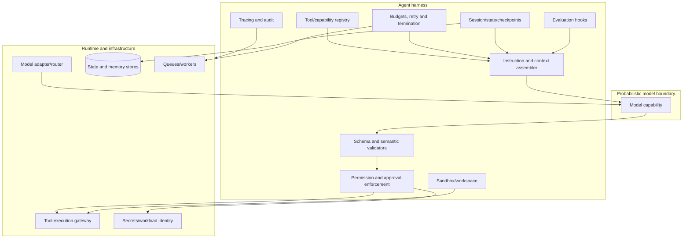

## 5.2 Model capability, policy, harness, runtime, framework and control plane

| Concept | What it is | Example responsibility | What it is not |
|---|---|---|---|
| **Model capability** | Statistical ability of a model | Generate plan, classify intent, produce structured candidate | Permission to act |
| **Agent policy** | Rules defining allowed behaviour | Allowed tools, risk tier, evidence and escalation rules | Merely a system prompt |
| **Agent harness** | Application layer enforcing reliable behaviour | Context, registry, validation, state, approval, budgets, audit | A model or one SDK |
| **Agent runtime** | Execution environment | Workers, queues, model calls, tool gateway, sandbox | Design-time governance |
| **Orchestration framework** | Library/platform primitives | Graph, handoff, checkpoint, tool decorator | Full production architecture |
| **Agent control plane** | Fleet-wide administration and governance | Registries, policy, identity, deployment/evaluation gates, kill switch | Request-specific reasoning path |

> **Architect’s Decision:** Select a framework only after defining the harness contracts. Otherwise framework defaults silently become architecture decisions.

## 5.3 Harness components

### System instructions

Instructions define role, objective, evidence rules, uncertainty behaviour and tool-use guidance. They are versioned application artefacts. They should not carry secrets or enforce critical authorization.

### Context assembly

The assembler selects and labels:

- trusted system/developer instructions;
- authenticated user request;
- permitted state projection;
- retrieved evidence and provenance;
- tool schemas and current capability set;
- budget/termination summary;
- prior concise decisions necessary for continuity.

It must handle priority, token limits, stale data, conflicting context and untrusted content. Full context engineering appears in Stage 2.

### Tool registry

A registry stores capability name, version, owner, schema, impact, permissions, environment, timeout, retry policy and status. The model receives only the currently permitted subset.

### Tool schemas

Use closed schemas, bounded strings/enums, canonical identifiers and explicit error outputs. Validate syntax and business semantics independently.

### Tool execution gateway

The gateway is the policy enforcement and operational boundary. It:

- authenticates agent/workload identity;
- applies authorization and approvals;
- obtains short-lived scoped credentials;
- validates arguments;
- adds operation IDs and deadlines;
- applies rate limits/circuit breakers;
- normalizes results and errors;
- emits audit and trace events.

### Session management

Separate user session, agent run, task and conversation IDs. A user session can contain multiple runs; a run can survive the original HTTP connection.

### State persistence

Persist typed state with optimistic versioning or event history. Store pending approvals and completed operation IDs. Do not rely on process memory for resumable work.

### Memory management

Memory is a governed read/write subsystem with extraction, consent, provenance, expiry and deletion. Stage 3 covers it fully. In Stage 1, keep it separate from correctness-critical state.

### Sandbox management

Code, browser and file tools should run in isolated environments with CPU/memory/time/network/file limits, ephemeral credentials and controlled egress. Tool output remains untrusted input.

### File and workspace management

A long task needs a structured workspace rather than an ever-growing prompt. Use:

- task manifest;
- source/evidence directory;
- draft/output directory;
- progress ledger;
- validation results;
- immutable operation references;
- cleanup/retention policy.

### Context compaction

Compact context by retaining structured state and evidence references, then regenerating a concise prompt projection. Never compact away unresolved risks, approvals, errors or side-effect history.

### Error handling and retry management

Normalize provider and tool errors into stable application classes. Apply retries outside the model, and expose concise failure information for replanning only when useful.

### Checkpointing

Checkpoint state and workspace metadata at safe boundaries. A framework checkpointer may be one component; production also requires backups, encryption, retention, tenancy and migrations.

### Permission enforcement

Permissions are evaluated against user, agent, tool, resource, operation, purpose, risk and current state. The model should not receive reusable unrestricted user credentials.

### Evaluation hooks

Record evaluation-ready traces and allow deterministic assertions at each node. Hooks may run synchronously for blocking safety checks or asynchronously for quality monitoring. Full evaluation design appears in Stage 4.

### Tracing and audit logging

Tracing explains timing and dependency paths; audit logging records accountable events and decisions. They overlap but serve different retention, access and integrity needs.

### Human approvals

The harness pauses, binds the exact action, verifies approver identity, handles expiry and resumes from durable state. A chat message saying “approved” is insufficient unless securely linked to the pending operation.

### Cost and token budgets

Track planned and actual consumption by run, model, branch and tool. Enforce ceilings before calls and stop optional quality passes when budgets require it.

### Runtime isolation

Separate tenants and risk tiers through worker pools, namespaces, credentials, network policies and sandboxes. A low-trust browser task should not share a privileged runtime with administrative tools.

## 5.4 How a strong harness reduces prompt complexity

Weak design puts every rule in the prompt:

```text
Do not call dangerous tools. Do not repeat. Ask before writing. Stay within budget.
Do not reveal secrets. Use the correct tenant. Retry transient errors only.
```

Strong design gives the model a smaller problem:

- only permitted tools are exposed;
- write tools cannot execute without policy/approval;
- schemas reject extra fields;
- credentials are scoped and short-lived;
- the loop stops at deterministic budgets;
- retries are error-class driven;
- state identifies tenant and completed operations;
- audit/redaction occurs outside the model.

Prompts still matter for task quality, but they cease to be the security perimeter.

> **Security Boundary:** A model that never sees a forbidden capability is safer than a model that sees it and is told not to use it; a gateway that denies it is safer than either.

## 5.5 Long-running agent harnesses

A long-running agent must survive context-window limits, process termination, dependency changes and model upgrades.

### Persistent workspace

Store durable artefacts outside the prompt. Every artefact needs an owner, type, version, provenance and validation status.

### Task ledger

A ledger records work units:

```json
{
  "task_id": "TASK-018",
  "goal": "Validate policy evidence",
  "status": "blocked",
  "depends_on": ["TASK-011"],
  "artefacts": ["evidence/POL-017.json"],
  "validation": "failed: owner missing",
  "next_action": "resolve CTRL-101 owner",
  "attempts": 1
}
```

### Progress file

Keep a human-readable concise progress record in addition to machine state. It should summarize completed work, unresolved decisions, next safe step and known limitations—without hidden chain-of-thought.

### Version-controlled artefacts

Code, prompts, schemas, graph definitions and generated deliverables should be versioned. A run should record the exact versions used.

### Resumable sessions

On resume:

1. authenticate and authorize again;
2. load state and workspace manifest;
3. verify checksums and schema versions;
4. reconcile pending side effects;
5. revalidate approvals and policy freshness;
6. reconstruct only the context needed for the next step;
7. continue from an explicit checkpoint.

### Context regeneration

Regenerate context from authoritative state and artefacts rather than feeding an old transcript. This reduces stale assumptions and prompt growth.

### Verification at session start

Check that:

- expected files exist and hashes match;
- dependencies and model/tool versions remain compatible;
- previously successful tests still pass where practical;
- no pending cancellation or kill switch exists;
- credentials and data access are still valid.

### Work-unit decomposition

Decompose into independently verifiable units small enough to complete or checkpoint. Avoid tasks whose only output after hours is one final prose response.

### Intermediate artefact validation

Validate schemas, compile code, run tests, lint diagrams and compare results to acceptance criteria before declaring a work unit complete.

### Crash recovery

Use write-ahead intent or operation records for side effects. On restart, reconcile by operation ID before retrying.

### Safe continuation after model or deployment changes

Do not assume a new model interprets prompts or tool schemas identically. Run compatibility and regression tests; consider completing old runs on the prior version. Anthropic’s long-running harness guidance emphasizes explicit progress artefacts and controlled ablation of scaffolding rather than assuming old harness rules remain useful [S13].

## 5.6 Recommended production repository structure

```text
agent-project/
├── README.md
├── pyproject.toml
├── requirements.lock
├── .env.example
├── architecture/
│   ├── context.md
│   ├── diagrams/
│   ├── threat-model.md
│   └── adrs/
├── specs/
│   ├── agent.yaml
│   ├── tools/
│   ├── state/
│   ├── policies/
│   └── outputs/
├── src/
│   └── product_agent/
│       ├── api/
│       ├── orchestration/
│       ├── nodes/
│       ├── harness/
│       │   ├── context.py
│       │   ├── budgets.py
│       │   ├── approvals.py
│       │   ├── validation.py
│       │   └── termination.py
│       ├── tools/
│       ├── policy/
│       ├── identity/
│       ├── state/
│       ├── memory/
│       ├── model_adapters/
│       ├── observability/
│       └── audit/
├── prompts/
│   ├── registry.yaml
│   └── versions/
├── evals/
│   ├── datasets/
│   ├── rubrics/
│   ├── evaluators/
│   └── baselines/
├── tests/
│   ├── unit/
│   ├── contracts/
│   ├── graph_paths/
│   ├── integration/
│   ├── security/
│   ├── performance/
│   └── recovery/
├── deployment/
│   ├── containers/
│   ├── kubernetes/
│   ├── policies/
│   └── observability/
├── runbooks/
│   ├── incident.md
│   ├── rollback.md
│   ├── kill-switch.md
│   └── recovery.md
└── scripts/
    ├── check_compatibility.py
    ├── migrate_state.py
    └── validate_artifacts.py
```

The Stage 1 repository is intentionally smaller but preserves the same separation of core loop, examples, tests, scripts and generated evidence.

## 5.7 Harness technology selection criteria

| Capability | Questions to ask | Evidence required before selection |
|---|---|---|
| Orchestration | Are cycles, waits, subgraphs and durable resumption needed? | Recovery and path tests |
| State | Snapshot, events or both? What consistency? | Crash and concurrent-update tests |
| Tool gateway | Can it enforce scoped identity, policy, timeout and operation IDs? | Contract and security tests |
| Approval | Can it bind exact action and resume safely? | Tampering/expiry tests |
| Model adapter | Can providers be swapped without semantic drift? | Cross-provider regression set |
| Sandbox | What filesystem/network/process isolation exists? | Escape and egress tests |
| Observability | Can traces correlate models, tools, nodes and policy? | Full-run trace reconstruction |
| Evaluation hooks | Can trajectories and artefacts be sampled safely? | Evaluation data/privacy review |
| Control plane | How are versions, budgets and kill switches distributed? | Failure-mode and stale-config tests |

Avoid selecting solely from demo ergonomics. The decisive properties emerge during failure, migration, policy enforcement and operations.

## 5.8 Harness failure modes

| Failure | Cause | Mitigation |
|---|---|---|
| Prompt becomes policy engine | Critical rules only in instructions | Deterministic PEP and capability filtering |
| Context grows without bound | Transcript accumulation | Structured state + evidence references + compaction |
| Duplicate write after restart | No durable operation ID | Intent record and downstream idempotency |
| Approval reuse | Approval not action-bound | Hash arguments/tool/state/version + expiry |
| Tool output injects instructions | Output treated as trusted context | Label untrusted data, isolate instructions, sanitize/validate |
| Stale harness rule degrades new model | Scaffolding never retested | Ablation and regression evaluation |
| Trace leaks sensitive data | Raw prompts/tool args exported | Classification, redaction, access and retention |
| Shared worker leaks tenant data | Inadequate isolation/cache clearing | Tenant-scoped state and runtime isolation |
| Framework upgrade changes semantics | Unpinned dependencies | Lock files, compatibility matrix, canary tests |

## 5.9 Performance implications

Harness controls add overhead, but some reduce total cost and latency:

- strict tool schemas reduce failed calls;
- compact structured state reduces context size;
- caching registry/policy snapshots avoids hot-path control-plane calls;
- parallel safe reads reduce wall time;
- circuit breakers prevent dependency collapse;
- bounded retries prevent tail-latency explosions;
- optional critic/reflection passes can be budget-aware;
- durable waits free workers instead of holding connections.

Measure harness overhead separately from model and tool latency. Do not remove a safety control because it appears in total latency without testing a lower-latency implementation.

## 5.10 Evaluation mechanism

Evaluate the harness independently of model quality:

- schema rejection tests;
- unknown-tool denial;
- approval tampering and expiry;
- budget exhaustion;
- repetition/stall detection;
- retry classification;
- timeout-after-write reconciliation;
- checkpoint/resume;
- state migration;
- cross-tenant isolation;
- audit completeness and redaction;
- kill switch and cancellation;
- dependency/version compatibility.

The Stage 1 tests exercise core schema, approval, idempotency and budget behaviour. Later stages add full security, trajectory and performance suites.

## 5.11 Production-readiness checklist

- [ ] Harness responsibilities are distinguished from model and framework capabilities.
- [ ] Context is assembled from governed sources with labels and precedence.
- [ ] Tool registry and execution gateway are separate from model output.
- [ ] State, memory and transcript are separate concepts.
- [ ] Sessions and runs can resume from durable checkpoints.
- [ ] Workspaces are isolated, versioned and retained appropriately.
- [ ] Critical permissions are deterministic and credential scope is narrow.
- [ ] Budgets, retries, cancellation and termination are runtime-enforced.
- [ ] Human approvals are tamper-evident and resumable.
- [ ] Tracing and audit have privacy/redaction controls.
- [ ] Dependency/model/framework compatibility is tested before promotion.
- [ ] Long-running work produces validated intermediate artefacts.

## 5.12 Chapter review

### Key lessons

- The harness is the reliability and governance envelope around the model.
- A framework supplies primitives; it does not own your business controls.
- Strong deterministic boundaries simplify prompts and reduce model dependence.
- Long-running agents need workspaces, ledgers, checkpoints and restart verification.

### Architecture checklist

- [ ] Mark every harness component in the reference architecture.
- [ ] Identify controls currently implemented only in prompts.
- [ ] Define tool gateway, state and approval contracts.
- [ ] Create a compatibility and restart checklist.
- [ ] Separate trace, audit and evaluation data policies.

### Common mistakes

- Equating an SDK with a production harness.
- Sending every available tool to the model.
- Persisting raw transcripts as authoritative state.
- Holding a web request open during human approval.
- Upgrading models/frameworks without replay and regression tests.
- Capturing secrets in traces for debugging convenience.

### Review questions

1. Which harness controls remain valid if the model is replaced tomorrow?
2. What data is required to resume safely after a week?
3. How does the tool gateway obtain and constrain credentials?
4. Which harness functions are on the latency-critical path?
5. How is stale scaffolding detected and removed?

### Practical exercise

Take the plain Python example and add a `RunManifest` containing agent version, policy version, state-schema version and dependency compatibility result. Include it in the first audit event and refuse to resume when the state schema is unsupported.

### Further reading

[S1], [S2], [S3], [S4], [S11], [S12], [S13], [S14].

---

# Initial hands-on laboratories

The laboratories use the repository distributed with this playbook. The core lab runs offline. Optional framework labs require installation of the pinned extras.

## Lab 1 — Implement and inspect a minimal bounded agent loop

### Objective

Run a complete observe–plan–validate–authorize–act–verify–terminate loop and identify the responsibilities that belong outside a model.

### Prerequisites

- Python 3.11, 3.12 or 3.13;
- repository files;
- core dependencies from `requirements-pinned.txt`.

### Architecture

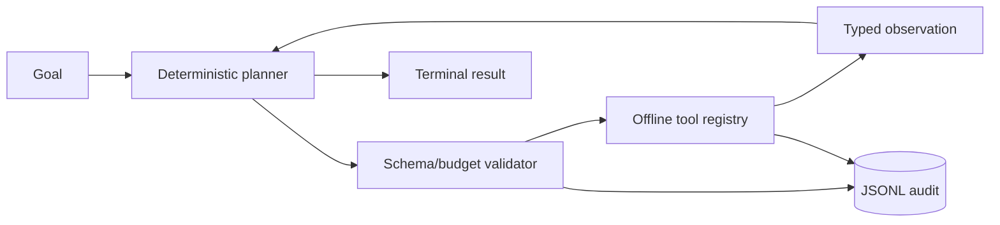

### Steps

```bash
cd agentic-ai-architect-stage1
python -m venv .venv
source .venv/bin/activate          # Windows PowerShell: .venv\Scripts\Activate.ps1
python -m pip install --upgrade pip
python -m pip install -r requirements-core-pinned.txt
PYTHONPATH=src python scripts/check_compatibility.py
PYTHONPATH=src python examples/plain_python_agent.py --approve-write
```

### Expected result

The run retrieves a policy, resolves its control owner, requests deterministic approval, creates one idempotent review ticket and terminates as completed.

### Validation

```bash
PYTHONPATH=src pytest -q tests/test_core.py
```

For JSONL validation use:

```bash
python - <<'PY'
import json
from pathlib import Path
for line in Path('artifacts/plain-python-audit.jsonl').read_text().splitlines():
    json.loads(line)
print('valid JSONL')
PY
```

### Common errors

- `ModuleNotFoundError: stage1_agent`: set `PYTHONPATH=src` or install the project without build isolation in a prepared environment.
- Version mismatch: create a clean virtual environment and install pinned requirements.
- No ticket created: run with `--approve-write`; denial is the safe default.

### Extension exercise

Change the goal to an unknown topic and verify that the run escalates rather than inventing a policy.

## Lab 2 — Add structured tools and impact classes

### Objective

Create a new read-only tool and one reversible-write tool with strict schemas and different approval requirements.

### Prerequisites

Lab 1 completed.

### Architecture

Model/planner proposals pass through registry resolution, Pydantic validation, impact classification and approval before a handler executes.

### Steps

1. Create `GetChangeArgs` with a constrained change ID pattern.
2. Implement `get_change` as read-only.
3. Create `AddReviewCommentArgs` with bounded text and idempotency key.
4. Implement `add_review_comment` as reversible write.
5. Register both tools.
6. Extend the planner to retrieve the change before recommending review.
7. Add tests for extra fields, invalid IDs, rejected approval and duplicate idempotency key.

### Expected result

Malformed arguments are returned as `ARGUMENT_VALIDATION_FAILED`; no handler executes. Read calls proceed without approval; writes pause unless approved.

### Validation

Assert handler invocation counts and inspect `tool_arguments_rejected` and `approval_decision` events.

### Common errors

- Using `dict` without a closed schema.
- Classifying all tools as read-only because they are “only API calls.”
- Performing side effects during argument validation.

### Extension exercise

Add an irreversible-write class that is always blocked in the lab, even when the generic approval callback returns approved.

## Lab 3 — Add typed state, budgets and recovery

### Objective

Demonstrate bounded execution and explicit terminal states.

### Prerequisites

Labs 1–2.

### Architecture

A run-state object owns counters, observations, pending action, status and deadline; the harness evaluates it before each turn.

### Steps

1. Set `max_tool_calls=1`; verify `BUDGET_EXHAUSTED` before the second tool.
2. Create a planner that repeats the same action; verify the repetition guard.
3. Add a transient error with `retryable=True`; verify bounded retry.
4. Add a non-retryable validation/business error; verify no retry.
5. Persist a simple checkpoint after each observation.
6. Restart from the checkpoint and reconcile completed operations.

### Expected result

No scenario loops indefinitely. Every stop has a machine-readable status and audit reason.

### Validation

Tests should assert status, turn count, tool count, retry count and completed operation IDs.

### Common errors

- Counting model calls but not tool retry attempts.
- Resetting counters when resuming.
- Treating every exception as retryable.

### Extension exercise

Add a total deadline that includes approval wait separately from active execution time, and document which SLO each represents.

## Lab 4 — Convert the loop into a graph

### Objective

Represent control flow as typed nodes and conditional edges using LangGraph.

### Prerequisites

- Labs 1–3;
- pinned graph extra installed:

```bash
python -m pip install 'langgraph==1.2.10'
```

### Architecture

`retrieve_policy → resolve_owner → approval_gate → create_ticket → finish`, with safe terminal edges from failures or missing approval.

### Steps

```bash
PYTHONPATH=src python examples/langgraph_agent.py
```

Then:

1. inspect `GraphState`;
2. set `approved=False` and verify the graph ends without a write;
3. add a `reconcile_ticket` node;
4. replace `InMemorySaver` with a production-capable checkpointer in your own environment;
5. add path tests for policy missing, owner missing, approval missing and successful completion.

### Expected result

The graph follows only declared nodes/edges and ends with a typed state.

### Validation

Use a fixed `thread_id`, inspect checkpoints, and assert no ticket exists for the unapproved path.

### Common errors

- Treating in-memory checkpointing as durable.
- Mutating global state from nodes.
- Omitting a route for missing/unknown status.
- Retrying write nodes without operation IDs.

### Extension exercise

Insert a human interrupt using the framework’s current interrupt/resume mechanism, bind approval to a hash, and test that changed arguments invalidate it [S4].

## Lab 5 — Map the design to an SDK-based agent

### Objective

Use a model-backed SDK for planning/tool selection while retaining deterministic execution controls.

### Prerequisites

- Core labs completed;
- `openai-agents==0.19.0` installed;
- valid provider credentials for the selected model;
- enterprise policy permitting the external call.

```bash
python -m pip install 'openai-agents==0.19.0'
export OPENAI_API_KEY='...'
export OPENAI_MODEL='gpt-5.4-mini'  # change only to a compatible model you have verified
PYTHONPATH=src python examples/openai_agents_sdk_agent.py
```

### Architecture

The SDK agent can retrieve policy and owner data and returns a Pydantic `ReviewRecommendation`. It has no write tool and no authorization authority.

### Steps

1. Run the example with governed credentials.
2. Confirm structured-output validation.
3. Give an unknown policy topic and verify that the output does not invent a control.
4. Add an external deterministic gate that receives the recommendation and decides whether a ticket may be proposed.
5. Keep the actual write behind the same idempotent gateway used in the offline lab.

### Expected result

The model returns a recommendation grounded in tool outputs. It cannot create a ticket directly.

### Validation

Test:

- missing key fails fast;
- unknown topic yields no fabricated policy;
- malformed structured output is rejected;
- `max_turns` prevents unbounded SDK execution;
- tracing remains disabled unless explicitly governed.

### Common errors

- Giving the SDK agent a privileged write tool during the first experiment.
- Using the model’s boolean as the authorization decision.
- Assuming temperature zero guarantees determinism or correctness.
- Sending sensitive data to provider tracing without review.

### Extension exercise

Create a provider adapter interface and run the same golden cases across two model families. Compare tool selection, structured validity, groundedness, latency and cost without changing the policy gateway.

---

# Compatibility and validation guide

## Supported baseline

| Component | Stage 1 target | Compatibility rationale | Validation status in supplied environment |
|---|---:|---|---|
| Python | `>=3.11,<3.14` | Current dependencies support modern Python; source tested on 3.13.5 | **Passed** |
| Pydantic | `2.13.4` | Strict typed validation used by core and SDK output | **Passed on 2.13.4** |
| typing-extensions | `4.16.0` | Provides current `TypedDict` support across target interpreters | Installed env had 4.15.0; checker correctly reported mismatch |
| python-dotenv | `1.2.2` | Optional local configuration support | **Passed** |
| pytest | `9.0.2` | Test runner | **Passed** |
| LangGraph | `1.2.10` | Current graph example target, Python ≥3.10 [S2] | Not installed in isolated runtime; import test skipped |
| OpenAI Agents SDK | `0.19.0` | Current SDK example target, Python 3.10–3.14 [S14] | Not installed in isolated runtime; import test skipped |

The exact target versions were verified against official project pages on 28 July 2026 [S2][S14][S15][S16]. Rapidly changing dependencies must be rechecked before later execution.

## Compatibility checker

```bash
PYTHONPATH=src python scripts/check_compatibility.py
```

The checker:

- verifies the Python range;
- reads installed package metadata;
- compares exact target versions;
- distinguishes core, optional graph, optional SDK and development dependencies;
- exits non-zero on required incompatibility.

## Test commands

```bash
PYTHONPATH=src python -m compileall -q src examples tests scripts
PYTHONPATH=src pytest -q
```

Validated result in the supplied environment:

```text
8 passed, 2 skipped
```

The two skips are optional-framework import tests because LangGraph and OpenAI Agents SDK were not installed. The offline core and tests were executed, not merely reviewed.

## Packaging limitation observed

An editable-install attempt with PEP 517 build isolation could not fetch the requested build backend from the isolated package index. This was an environment/index limitation, not represented as a successful install. Source-tree execution with `PYTHONPATH=src` was therefore used for validation. In a connected environment, create a clean virtual environment and install the pinned requirements or use an approved internal package mirror.

> **Production Warning:** “Code example matches documentation” and “code executed in this environment” are different claims. This package states both separately.

---

# Glossary for Stage 1

| Term | Definition |
|---|---|
| **Action** | A proposed or executed operation selected to advance a goal. |
| **Agent** | Goal-directed software system that uses observations and bounded actions in a feedback loop. |
| **Agent control plane** | Fleet-wide administration for registries, policy, identity, budgets, deployment, evaluation and emergency control. |
| **Agent harness** | Software envelope that assembles context, validates proposals, enforces controls, manages state and exposes tools. |
| **Agent policy** | Versioned rules governing goals, capabilities, constraints, approvals, budgets and escalation. |
| **Agent runtime** | Processes and infrastructure that execute runs, models, tools, queues and sandboxes. |
| **Agentic workflow** | Workflow combining probabilistic decisions with code-defined control flow. |
| **Agency** | Capacity to select actions toward a goal. |
| **Approval binding** | Cryptographic or canonical link between a human decision and the exact action, arguments, state and version approved. |
| **Authority** | Permission and business power to perform an action. |
| **Autonomy** | Degree to which execution proceeds without human intervention. |
| **Backtracking** | Returning to an earlier reversible decision after a dead end. |
| **Blackboard architecture** | Multiple workers coordinate through a shared typed workspace. |
| **Budget** | Enforced resource or risk ceiling for turns, tokens, time, cost, tools, concurrency or authority. |
| **Capability** | A bounded function or service the agent may invoke under policy. |
| **Checkpoint** | Persisted execution state used to resume a run. |
| **Compensation** | Business action intended to counteract an earlier completed side effect. |
| **Context** | Selected information and instructions presented to a model or decision component. |
| **Control flow** | Rules determining which node or operation executes next. |
| **Control plane** | Administrative plane that configures and governs runtime behaviour. |
| **Data plane** | Request-specific movement of prompts, state, evidence, model calls and tool results. |
| **Dead end** | State in which no permitted action can satisfy remaining criteria. |
| **Delegation depth** | Number of nested sub-agent or worker handoffs permitted. |
| **Deterministic workflow** | Process whose control path is selected by code/rules rather than a model. |
| **Durable execution** | Execution that persists history/state and can continue after worker/process failure. |
| **Edge** | Graph transition between nodes, often controlled by a predicate. |
| **Event sourcing** | Persisting immutable domain events and deriving current state from them. |
| **Exactly-once business effect** | One intended external outcome achieved through transaction scope, idempotency, deduplication and reconciliation; not assumed from transport alone. |
| **Graph engineering** | Deliberate design of nodes, edges, state, cycles, checkpoints, recovery and termination. |
| **Graceful degradation** | Delivering a safer reduced capability when dependencies or budgets prevent full operation. |
| **Human escalation** | Transfer of a bounded decision or unresolved task to an authorized person with evidence. |
| **Idempotency key** | Stable identifier enabling duplicate requests to return/reconcile the same logical operation. |
| **Impact class** | Classification of a tool by read/write, reversibility, privilege, financial or safety consequence. |
| **Loop stall** | Repeated activity without measurable progress toward completion. |
| **Management/assurance plane** | Organisational ownership, risk, change, monitoring, audit and incident functions. |
| **Memory** | Retained information intended to improve future decisions; distinct from authoritative run state. |
| **Node** | Bounded graph operation with typed inputs, outputs and execution semantics. |
| **Observation** | Validated result from a tool, user, environment, memory or model. |
| **Operation ID** | Identifier used to trace and reconcile a specific external side effect. |
| **Orchestration framework** | Library or platform providing loop, graph, handoff, tool or persistence primitives. |
| **Policy decision point (PDP)** | Component that evaluates policy and returns permit, deny or obligations. |
| **Policy enforcement point (PEP)** | Component that blocks or allows the actual operation based on the decision. |
| **Postcondition** | Fact that must hold for successful completion. |
| **Progress vector** | Structured measure of completed criteria, remaining work and unresolved risk. |
| **Proposal** | Model/planner output suggesting a plan, action or final answer before validation/authorization. |
| **Reconciliation** | Determining the actual external outcome after an uncertain result or failure. |
| **Replay** | Reconstructing state or deterministic decisions from persisted history without repeating external side effects. |
| **Replanning** | Revising the route after new observations, failed assumptions or changed constraints. |
| **Run** | One execution instance pursuing a goal under a versioned specification and budget. |
| **Sandbox** | Isolated execution environment with constrained resources and access. |
| **Side effect** | Change outside the local computation, such as creating a ticket or modifying a record. |
| **State** | Authoritative structured data needed to continue and verify a run. |
| **State graph** | Graph whose nodes transform shared typed state and whose edges route based on state. |
| **Termination condition** | Deterministic rule for completion, failure, pause, cancellation, escalation or exhaustion. |
| **Tool** | Controlled capability exposed through a typed contract and execution boundary. |
| **Tool gateway** | Service that validates, authorizes, executes and observes tool calls using scoped identity. |
| **Trace** | Correlated telemetry describing the path and timing of a run across components. |
| **Trust boundary** | Point where identity, data trust, privilege or administrative control changes. |
| **Typed state** | State governed by an explicit schema and validation rules. |
| **Workload identity** | Non-human identity assigned to an agent, service or worker. |

---

# Stage 1 completion report

## Completed

- Executive overview and learning outcomes.
- Eight-stage tutorial map.
- Chapter 1: complete foundations, terminology, maturity model and use-case selection logic.
- Chapter 2: 16-layer reference architecture, component matrix and all six required diagram types.
- Chapter 3: complete 18-step loop, loop-pattern comparison, budgets, liveness, recovery, pseudocode and three implementation mappings.
- Chapter 4: graph families, node/edge engineering, typed state, durability/versioning, patterns, anti-patterns and a complete governed graph.
- Chapter 5: full harness architecture, long-running harness design and repository structure.
- Five progressive initial laboratories.
- Runnable offline implementation, graph and SDK examples.
- Pinned dependency definitions, compatibility checker and tests.
- Stage 1 glossary.

## Artefacts produced

1. `STAGE_1_PLAYBOOK.md` — this tutorial.
2. `src/stage1_agent/core.py` — offline bounded agent loop and harness.
3. `examples/plain_python_agent.py` — runnable demonstration.
4. `examples/langgraph_agent.py` — graph-based mapping.
5. `examples/openai_agents_sdk_agent.py` — SDK-based mapping.
6. `tests/test_core.py` — executed offline behavioural tests.
7. `tests/test_optional_examples.py` — optional dependency/import checks.
8. `scripts/check_compatibility.py` — dependency and interpreter compatibility check.
9. `requirements-pinned.txt` and `pyproject.toml` — reproducible dependency declarations.
10. `artifacts/plain-python-audit.jsonl` — sample audit events from an executed run.

## Assumptions

- The tutorial use case is an educational enterprise policy-review flow, not a legal or compliance determination.
- Local mock catalogues are explicitly simulated data; they are not represented as real enterprise policies.
- Python 3.11–3.13 is the supported teaching range for this package.
- A production deployment would replace local JSONL, in-memory services and development checkpointers with governed durable services.
- External model execution requires the reader’s approved credentials, provider agreement, privacy assessment and network access.
- Currency examples in later cost chapters will use pounds sterling unless the deployment region or user supplies another currency.

## Unresolved technical choices for later stages

- Final model/provider and model-routing policy.
- Production state/checkpoint/event store.
- Enterprise policy engine and authorization-token profile.
- Retrieval index, embedding/reranking stack and data-residency pattern.
- MCP/A2A versus direct API interfaces.
- OpenTelemetry exporter, backend and privacy policy.
- Durable workflow technology for long-running production use.
- LLM-evaluation models, human calibration process and acceptance thresholds.
- Deployment environment, sovereignty and GPU/managed-inference decisions.

These are deliberately unresolved because their selection depends on Chapters 6–33 requirements and benchmark evidence. The architecture has defined interfaces so that later choices do not require redesigning the fundamental control boundaries.

## Consistency verification

- The reference architecture’s orchestration, policy, state, tool, evaluation and audit layers map directly to the loop and harness.
- The complete example graph implements the same policy-review use case as the plain Python loop.
- The write action remains approval-gated and idempotent in every implementation mapping.
- No model is treated as an authorization authority.
- State and memory remain distinct.
- Hidden chain-of-thought is neither requested nor required; concise evidence and action rationale are used.
- Stage 2 topics are referenced only at interfaces and are not falsely presented as completed.

## Exact continuation heading

# Stage 2 — Context, Specification, Prompt, Model, Tool, MCP/A2A and Multi-Agent Architecture

---

# Annotated source register for Stage 1

**Verification date for web sources: 28 July 2026.** Versions and preview status can change; reverify before implementation.

- **[S1] Anthropic, “Building Effective Agents,” 19 December 2024.** Primary engineering article distinguishing workflows from agents and recommending simple composable patterns before added autonomy. https://www.anthropic.com/engineering/building-effective-agents
- **[S2] LangGraph 1.2.10 project page and official Graph API documentation, verified 28 July 2026.** Primary sources for current package version, Python requirement, state, nodes, edges, conditional routing and compilation. https://pypi.org/project/langgraph/ and https://docs.langchain.com/oss/python/langgraph/graph-api
- **[S3] LangGraph official persistence documentation, verified 28 July 2026.** Primary source for checkpoints, threads and state persistence concepts. https://docs.langchain.com/oss/python/langgraph/persistence
- **[S4] LangGraph official interrupts documentation, verified 28 July 2026.** Primary source for pausing execution and resuming with external input/human decisions. https://docs.langchain.com/oss/python/langgraph/interrupts
- **[S5] Yao et al., “ReAct: Synergizing Reasoning and Acting in Language Models,” ICLR 2023.** Original paper for interleaving reasoning-oriented traces and actions. https://arxiv.org/abs/2210.03629
- **[S6] Shinn et al., “Reflexion: Language Agents with Verbal Reinforcement Learning,” NeurIPS 2023.** Original paper for feedback/reflection memory across attempts. https://arxiv.org/abs/2303.11366
- **[S7] Yao et al., “Tree of Thoughts: Deliberate Problem Solving with Large Language Models,” NeurIPS 2023.** Original paper for bounded tree search over intermediate candidates. https://arxiv.org/abs/2305.10601
- **[S8] Besta et al., “Graph of Thoughts: Solving Elaborate Problems with Large Language Models,” AAAI 2024.** Original paper for graph transformations over thought units. https://arxiv.org/abs/2308.09687
- **[S9] NIST AI Risk Management Framework page, verified 28 July 2026.** NIST states AI RMF 1.0 is under revision and lists the July 2024 GenAI Profile; used as a governance context, not a legal standard. https://www.nist.gov/itl/ai-risk-management-framework
- **[S10] OWASP Agentic AI — Threats and Mitigations, 17 February 2025, with 2026 initiative updates visible at verification.** Threat-model-oriented reference; later security stages will use the current detailed guides and validate edition/status. https://genai.owasp.org/resource/agentic-ai-threats-and-mitigations/
- **[S11] OpenTelemetry Semantic Conventions 1.43.0, verified 28 July 2026.** Primary source for common telemetry naming and current GenAI/agent semantic-convention areas. https://opentelemetry.io/docs/specs/semconv/
- **[S12] Temporal, “How Temporal works,” verified 28 July 2026.** Primary documentation explaining event history, workers, replay and durable continuation. https://docs.temporal.io/encyclopedia/architecture/how-temporal-works
- **[S13] Anthropic, “Harness design for long-running application development,” 24 March 2026, verified 28 July 2026.** Primary engineering guidance on persistent progress artefacts, fresh-context continuation and controlled harness ablation. https://www.anthropic.com/engineering/harness-design-long-running-apps
- **[S14] OpenAI Agents SDK 0.19.0 project page and official documentation, released 27 July 2026 and verified 28 July 2026.** Primary sources for Python compatibility and current Agent, Runner, function-tool, structured-output, human-approval and tracing concepts. https://pypi.org/project/openai-agents/ and https://openai.github.io/openai-agents-python/
- **[S15] Pydantic 2.13.4 project page, verified 28 July 2026.** Primary package metadata for the pinned validation dependency. https://pypi.org/project/pydantic/
- **[S16] typing-extensions 4.16.0 project page, released 2 July 2026 and verified 28 July 2026.** Primary package metadata for the pinned compatibility dependency. https://pypi.org/project/typing-extensions/

