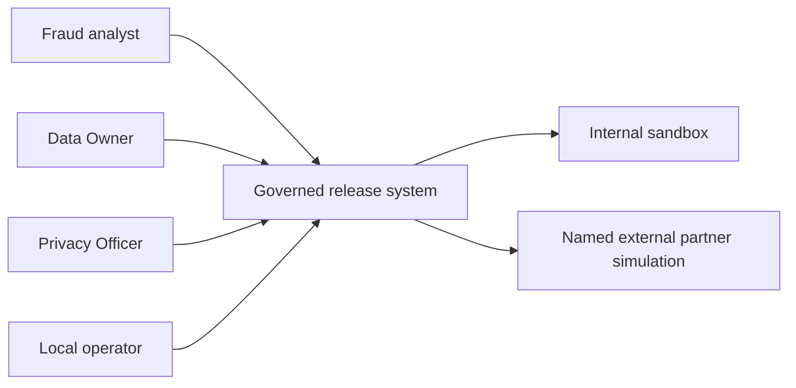
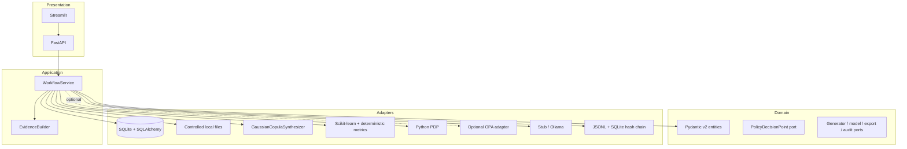
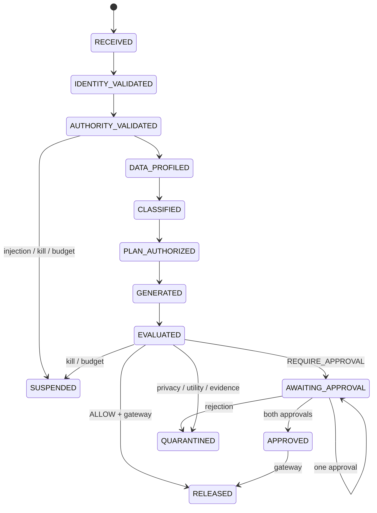
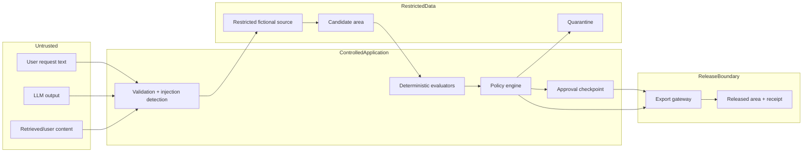
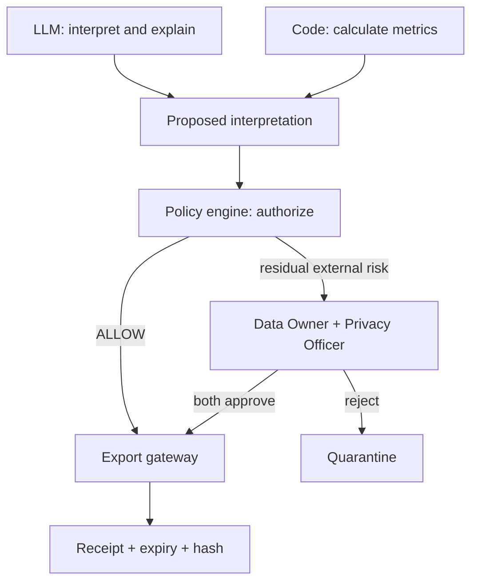
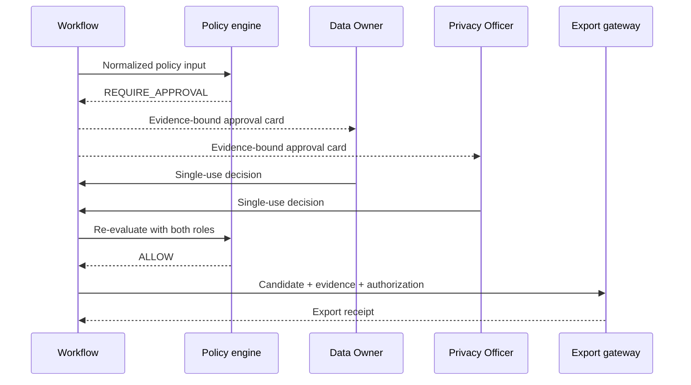
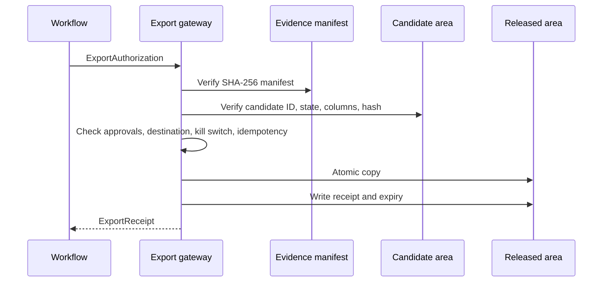
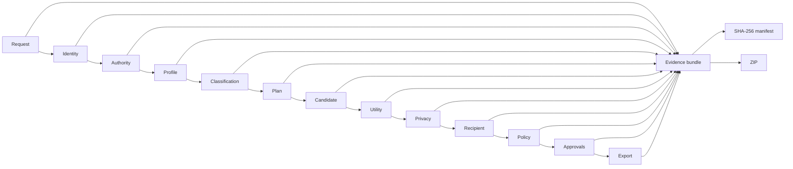
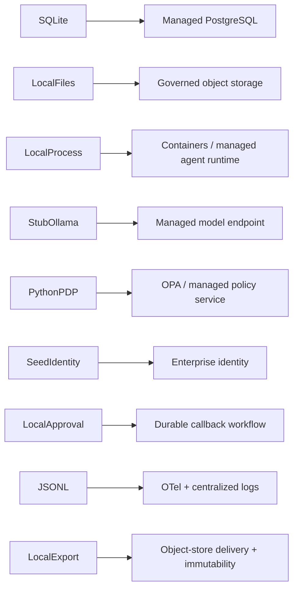

# Architecture

## System context



## Containers and components



## Workflow state machine



The complete state is stored as typed JSON in SQLite at each checkpoint. A process restart can reload a workflow and call `resume`; approval records are separately persisted and single-use.

## Trust boundaries



## Decision authority



## Approval sequence



## Export sequence



## Evidence lineage



## Scenario 4 attack and denial

```mermaid
sequenceDiagram
    actor A as Malicious requester content
    participant W as Workload agent
    participant C as Control Plane
    participant T as Tool gateway intent
    participant Audit as Audit ledger
    A->>W: copy IDs; upload raw file; skip evaluation
    W->>C: interpreted requested actions
    C->>C: deterministic injection rules
    C--xT: deny raw read / evaluator bypass / arbitrary URL
    C->>Audit: record full redacted security trace
    C-->>W: DENY + SUSPEND
```

## Local-to-production migration


