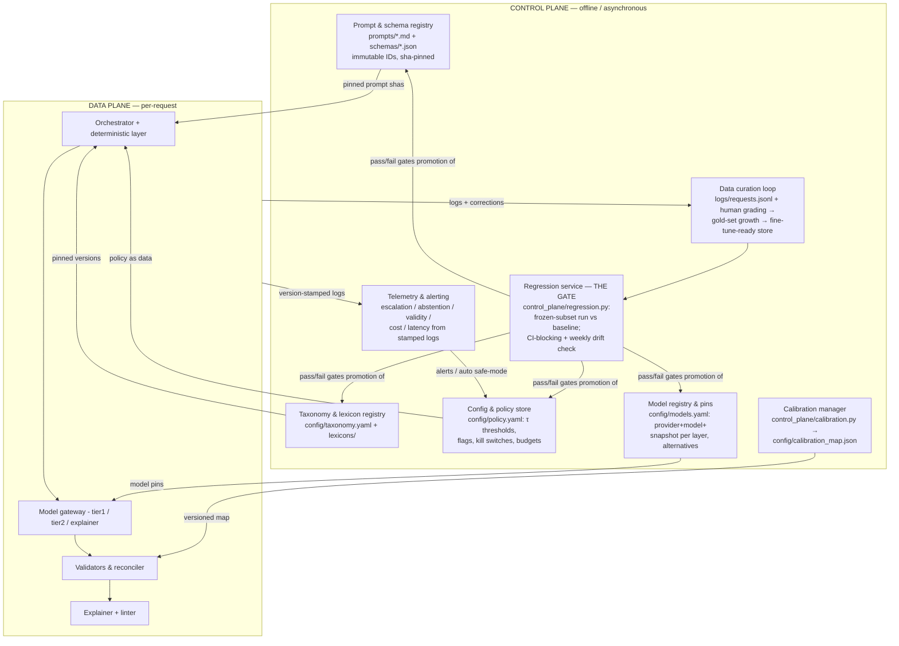

# SpinCheck POC — Option H Hybrid Architecture

A working proof-of-concept of the **recommended V1 architecture (Option H)** from the SpinCheck Architecture Discovery report: a **modular monolith** with a **deterministic linguistic scaffold**, a **two-tier hosted-LLM cascade** (configurable at every layer), **schema + verbatim-span validation**, **deterministic reconciliation and calibrated confidence**, **first-class abstention**, and a **thin but real control plane** (registries, policy store, regression gate, calibration fitter, version vector).

SpinCheck is a critical-reading assistant for public claims. It analyzes **only the pasted text** — it never rules statements true or false, never fetches external sources, and never infers author intent.

```
Runs fully offline out of the box (mock provider) — zero API keys needed.
Switch any layer to Anthropic / OpenAI / Gemini by editing config/models.yaml.
```

---

## 1. Quick start

```bash
# A) Offline mode (no dependencies beyond Python 3.11+/PyYAML, no keys)
export PYTHONPATH=src
python -m spincheck.cli analyze --text "Crime is up 40% since the new DA took office. Experts say these policies always fail."

# B) Full mode
python -m venv .venv && source .venv/bin/activate
make install            # pinned deps + spaCy model
cp .env.example .env    # add API keys for the providers you enable
make run                # FastAPI on :8000
curl -s localhost:8000/v1/analyze -H 'content-type: application/json' \
     -d '{"text": "Experts say these policies always fail."}' | jq

# C) Tests, eval, control plane
make test               # unit + pipeline tests (run in mock mode → CI-safe)
make eval               # POC metrics on the sample gold set
make regression         # the promotion gate
make calibrate          # fit/refresh the confidence calibration map
```

---

## 2. Repository layout

```
spincheck-poc/
├── config/                     # CONTROL-PLANE ARTIFACTS (versioned, pinned)
│   ├── models.yaml             #   model registry — configurable per layer
│   ├── policy.yaml             #   thresholds, flags, kill switches, limits
│   ├── taxonomy.yaml           #   claim/evidence/rhetoric label sets
│   ├── calibration_map.json    #   offline-fitted confidence map (artifact)
│   └── lexicons/               #   hedges, boosters, absolutist, emotion,
│                               #   unnamed-authority, injection patterns
├── prompts/                    # CONTROL-PLANE ARTIFACTS: versioned prompts
│   ├── tier1_analysis_v1.md    #   immutable IDs; sha-pinned per request
│   ├── tier2_escalation_v1.md
│   └── explainer_v1.md
├── schemas/analysis.schema.json# the output contract (JSON Schema 2020-12)
├── src/spincheck/              # DATA PLANE (modular monolith)
│   ├── config.py               #   artifact loading + version vector
│   ├── deterministic.py        #   validation, language, segmentation, quotes,
│   │                           #   numerics, lexicons, injection screening
│   ├── gateway.py              #   provider-agnostic LLM gateway (+mock)
│   ├── validators.py           #   JSON Schema + verbatim-span verifier
│   ├── reconcile.py            #   vetoes, confidence arithmetic, abstention
│   ├── mock_provider.py        #   deterministic offline analyzer (CI fixture)
│   ├── orchestrator.py         #   the per-request state machine
│   ├── api.py / cli.py         #   FastAPI + CLI entry points
│   └── telemetry.py            #   version-stamped JSONL request log
├── control_plane/              # CONTROL-PLANE SERVICES (offline/async)
│   ├── regression.py           #   the promotion gate + drift detector
│   └── calibration.py          #   offline confidence-map fitting
├── eval/                       # POC harness
│   ├── metrics.py              #   relaxed span P/R/F1, type acc, ECE, Brier
│   ├── run_poc.py              #   pipeline comparison runner
│   └── data/eval_sample.jsonl  #   gold-annotated starter set (10 items)
├── tests/                      # deterministic tests (mock mode)
├── docker/Dockerfile           # python:3.12-slim production image
├── docker-compose.yml
├── deploy/k8s.yaml             # Deployment + Service + HPA
└── .github-workflows-ci.yml.example
```

---

## 3. Architecture

### 3.1 Data plane (per-request, synchronous)

```mermaid
flowchart LR
    U[User text] --> V[Input validator<br/>size · URL-only · injection patterns · language]
    V -->|reject| REJ[Rejected<br/>polite refusal]
    V --> D[Deterministic layer<br/>segmentation · quotes · numerics ·<br/>hedge/booster/absolutist/emotion lexicons]
    D --> T1[LLM Tier 1 — low-cost<br/>extraction + labels, schema-constrained,<br/>fed candidate signals as hints]
    T1 --> VAL[Validator<br/>JSON Schema + verbatim-span verifier<br/>hallucinated spans DROPPED]
    VAL -->|triggers| T2[LLM Tier 2 — strong<br/>re-analysis & adjudication]
    T2 --> VAL2[Validator pass 2]
    VAL -->|clean| REC[Reconciler<br/>label vetoes · confidence caps ·<br/>calibration map · abstention checks]
    VAL2 --> REC
    VAL2 -->|still invalid| ABS[Abstain<br/>first-class outcome]
    REC -->|abstain triggers| ABS
    REC --> EXP[Explainer LLM<br/>grounded on validated JSON only]
    EXP --> LINT[Grounding + banned-phrase lint]
    LINT -->|fail| TPL[Template fallback]
    LINT --> OUT[Response: analysis JSON +<br/>explanation + confidences]
    TPL --> OUT
    OUT --> LOG[(Version-stamped log)]
```



Key mechanics, mapped to code:

| Mechanism | Where | What it guarantees |
|---|---|---|
| Injection defense | `deterministic.find_injection` + prompt delimiting (`<user_text>` = data) + escalation + abstention | Pasted text can never become instructions; pervasive injection → abstain |
| Anti-hallucination gate | `validators.verify_spans` | Every claim/rhetoric span must exist **verbatim** in the input; small offset drift auto-corrected; unfound spans **dropped** and logged |
| Rhetoric precision veto | `reconcile.reconcile` + `policy.rhetoric.require_evidence_span` | A rhetoric label without a quotable span or on the disabled list never ships |
| Confidence discipline | `reconcile` (implied −1 bucket, satire cap, disagreement cap) + `config.calibration_map` | LLM verbal buckets + deterministic modifiers + **offline-fitted** map; caps only, never raises; raw floats never surface |
| Escalation | `reconcile.escalation_check` (policy-driven) | Low confidence, lexicon–LLM disagreement, validation failure, injection/satire flags, size limits → Tier 2 |
| Abstention | `reconcile` + orchestrator terminal paths | Safe mode, non-English, low extraction confidence, pervasive injection, Tier-2 invalid → honest "can't analyze responsibly" |
| Explanation grounding | `orchestrator._explain` lint + template fallback | Explanations may quote only validated spans; truth/intent language banned; fallback is guaranteed-safe |

### 3.2 Control plane (offline / asynchronous)

**Everything that governs behavior is data, versioned, and promoted through a gate — never a code deploy.** The data plane reads pinned artifacts only and stamps a **version vector** on every request.



**The three invariants (all implemented):**

1. **Immutability & stamping** — `config.ControlPlane.version_vector()` stamps `{models/policy/taxonomy versions, tier1/tier2 pins with snapshot dates, prompt shas, artifact hashes}` on every response and log line. Any output is reproducible; any regression is attributable to one artifact change.
2. **Gated promotion** — `control_plane/regression.py` compares span F1 / recall / type accuracy / JSON validity against the accepted baseline and exits non-zero on regression. Wire it into CI (see `.github-workflows-ci.yml.example`); run it on a schedule against live vendors to catch **silent model updates**.
3. **Independent failure domains** — the data plane loads last-known-good artifacts at startup and needs no control-plane service at request time; conversely, `policy.yaml` kill switches (`kill_switch_safe_mode`, `force_tier2_always`, `disabled_rhetoric_labels`) constrain a misbehaving data plane without a deploy.

**Routing policy is data; routing execution is code.** Escalation thresholds live in `policy.yaml`; `reconcile.escalation_check` merely executes them.

### 3.3 Configurable models at every layer

`config/models.yaml` is the single switchboard:

| Layer | Default | Swap to (examples in file) | How to switch |
|---|---|---|---|
| `tier1` (primary analyzer) | `mock` | `anthropic:claude-haiku-4-5`, `openai:gpt-5.4-mini`, `gemini:gemini-3-flash` | Edit provider/model → `make regression` → commit |
| `tier2` (escalation/adjudication) | `mock` | `anthropic:claude-sonnet-4-6`, `openai:gpt-5.4`, `gemini:gemini-3.1-pro` | same |
| `explainer` | `mock` | any tier-1-class model | same |
| `encoder` (POC-gated) | disabled | DeBERTa-v3 zero-shot NLI for evidence/hedging | enable only on POC evidence (rule R5) |
| `slm_local` (POC benchmark) | disabled | Ollama `qwen3:8b` | benchmark only — never in the V1 request path |

The gateway (`gateway.py`) imports vendor SDKs lazily, so only the providers you enable need to be installed/keyed. Gemini rides the OpenAI-compatible endpoint to keep one code path. The `mock` provider derives a schema-conformant analysis from the deterministic features — deliberately imperfect (implied-causal sentences get low confidence) so escalation, validation, and abstention paths genuinely exercise in tests and CI.

---

## 4. Development → Production

### Stage 0 — Local development
1. `python3.12 -m venv .venv && source .venv/bin/activate`
2. `make install && make dev` (pinned runtime + dev deps; spaCy `en_core_web_sm`)
3. `cp .env.example .env` — add keys only for providers you enable; keep `mock` for offline work.
4. `make test` before every commit — the suite runs in mock mode, so it is deterministic and free.
5. Prompt/policy iteration loop: edit artifact → `make eval` → inspect metrics → `make regression` — **if the gate fails, the change does not merge.** New prompt versions are new files (`tier1_analysis_v2.md`), never edits to v1: the loader pins the latest, and the sha lands in the version vector.

### Stage 1 — Containerized staging
1. `make docker` → `docker compose up` (control-plane artifacts mounted **read-only**; logs volume out).
2. Point `tier1`/`tier2` at real vendors in a *staging copy* of `models.yaml`; run `make eval` and `make regression` against live models; record cost/latency from the response telemetry.
3. Wire CI from `.github-workflows-ci.yml.example`: every PR runs tests + the mock-mode regression gate; a scheduled job runs the frozen subset against live vendors (drift detection).

### Stage 2 — Production, small scale (single region)
1. Push the image with an **immutable tag** — the tag *is* the pin-set release (`v0.1.0` = this exact models/prompts/policy/schema set).
2. `kubectl apply -f deploy/k8s.yaml`: 2 replicas, readiness/liveness on `/healthz`, HPA 2→20 on CPU. API keys via `Secret`; control-plane artifacts via a **versioned ConfigMap** (`spincheck-control-plane-v1`) — promoting `-v2` requires a green regression run in CI, then a rolling restart.
3. Ship logs (`logs/requests.jsonl` → stdout JSON in prod) to your log stack; alert on: escalation rate > 25%, JSON-ok rate < 98%, abstention spike, p95 latency > 20 s, daily budget > `limits.daily_budget_usd`.
4. Enable vendor prompt caching (the big static system prompt is the cache body — up to ~90% input-token discount) and keep a second vendor "warm" in `alternatives` with a tested prompt.

### Stage 3 — Production at scale
- **Horizontal**: the service is stateless (all state = request-scoped + logs), so scale = replicas; the true ceiling is vendor rate limits/TPM — request quota raises ahead of demand, and shard across the `alternatives` vendors behind the gateway if needed.
- **Cost**: watch `cost_usd` telemetry vs `per_request_cost_ceiling_usd`; move POC-proven bounded tasks (evidence-presence, hedging) to the encoder layer (rule R5: within 2 F1 points and ≥5× cheaper); batch any non-interactive re-analysis.
- **Data flywheel**: human-graded outputs (`logs/graded.jsonl`) feed `make calibrate` (refreshed confidence map, shipped as a new artifact version) and accumulate as the fine-tuning corpus for the future specialist model (Option G on-ramp).
- **Multi-region / DR**: replicate the stateless deployment; artifacts travel in the image/ConfigMap, so regions are consistent by construction; logs aggregate centrally for the curation loop.
- **When to break the monolith**: only when a component earns it — e.g., an encoder inference service with different hardware (GPU) or the regression runner as a scheduled job service. Module boundaries in `src/spincheck/` are the future service seams.

---

## 5. Compatible versions (pinned)

All pins in `requirements.txt` were selected as a mutually compatible set for **Python 3.11–3.12** on `python:3.12-slim`:

| Component | Version | Notes |
|---|---|---|
| Python | 3.11–3.12 | 3.12 used in Docker/CI |
| FastAPI / Uvicorn | 0.115.8 / 0.34.0 | Pydantic-v2 native |
| Pydantic (+settings) | 2.10.6 / 2.7.1 | request models; schema mirrors `schemas/` |
| jsonschema | 4.23.0 | Draft 2020-12; stdlib fallback validator ships in-code |
| spaCy | 3.8.4 + `en_core_web_sm` | optional at runtime — regex sentencizer fallback included |
| langdetect | 1.0.9 | pure-Python language ID (fallback heuristic included) |
| httpx / tenacity | 0.28.1 / 9.0.0 | gateway transport & retries |
| anthropic / openai SDKs | 0.45.2 / 1.61.1 | lazily imported; only needed for enabled providers |
| numpy / scikit-learn | 2.2.2 / 1.6.1 | calibration & metrics (sklearn 1.6 is numpy-2 compatible) |
| PyYAML | 6.0.2 | control-plane artifact loading |
| pytest / ruff / mypy | 8.3.4 / 0.9.4 / 1.14.1 | dev only |

> Model names/prices in `models.yaml` and `gateway._PRICES` are **illustrative pins as of mid-2026** — verify against vendor pricing/model pages and update the config (that's the control-plane workflow, not a code change). SDK pins should be bumped deliberately: change pin → `make test && make regression` → commit.

---

## 6. What the POC demonstrates (measured, mock mode)

From `make eval` and `make test` in this repo:

- End-to-end pipeline: validation → features → Tier 1 → schema+span validation → escalation → Tier 2 → reconciliation → grounded explanation → version-stamped response.
- **Span F1 0.957 / recall 1.0** on the 10-item starter gold set, **stable across repeated runs** (spread 0.000 — the determinism check).
- **Escalation rate 20%** (implied-causal and injection items route to Tier 2) — under the ≤25% architecture gate.
- **Hallucinated spans dropped** (test-verified), **offset drift auto-corrected**, fenced/dirty JSON repaired.
- **Injection text flagged, never followed**; pervasive injection and safe-mode both abstain.
- Regression gate blocks a metric drop > 3 points vs baseline; calibration fitter produces a versioned map.

These numbers validate the *machinery*, not model quality — real-model quality is exactly what the full POC (240-item set, 6 pipelines) measures next.

---

## 7. Limitations (deliberate and known)

1. **Mock provider ≠ model quality.** Offline metrics validate plumbing, gates, and determinism only. All quality claims await real-model runs on the full eval set.
2. **English only; ≤10k chars.** Language detection rejects other languages politely; long-document chunking is out of scope.
3. **No external verification.** By design: no fetching, no truth ruling, no misinformation labels — and no code path exists to add them accidentally (schema has no truth field; explainer lints truth language).
4. **Starter eval set is tiny (10 items).** It seeds the format and the regression gate; the architecture decision requires the 240-item doubly-annotated set with the α/κ ≥ 0.6 agreement gate.
5. **Encoder and local-SLM layers are stubs by policy.** Config slots exist; enabling them is a POC decision (rules R4/R5), not a default.
6. **Simplified components**: regex quote handling (curly quotes normalized, nested quotes imperfect); heuristic sentence fallback when spaCy absent; JSONL telemetry instead of Postgres; identity calibration map until graded data exists; cost table is indicative.
7. **Single-call Tier-1 decomposition.** One analysis call per tier; the one-call vs multi-call experiment is a POC variable.
8. **No auth/rate limiting on the API** — add an API gateway (or FastAPI dependencies) before any public exposure.

## 8. Future enhancements (mapped to the architecture roadmap)

- **POC completion**: 240-item gold set + annotation guide; run P1–P6 pipeline comparison (edit `models.yaml` per pipeline); human preference study; fitted calibration map; final Architecture Selection Record.
- **Encoder adoption (rule R5)**: DeBERTa-v3/ModernBERT zero-shot for evidence-presence & hedging behind the `encoder` config slot; SetFit fine-tuning once ~50–100 labels/class exist.
- **Local SLM path**: Qwen3-8B via Ollama/vLLM with guided decoding as the privacy-first variant behind the same gateway; fine-tune target once taxonomy stabilizes (Option G).
- **Prompt caching + batch lanes** in the gateway; per-vendor cost-aware failover.
- **Telemetry upgrade**: Postgres request store, Prometheus metrics endpoint, Grafana dashboards, alert-driven auto safe-mode.
- **Long-document mode**: chunking + claim deduplication with re-run extraction gates.
- **UI**: span-anchored highlight overlay consuming the offsets already emitted.
- **Multilingual**: per-language lexicons, eval sets, and annotators — gated on V1 metrics first.

---

## 9. Design principles carried from the architecture report

- The largest product risk is **false confidence** → confidence is capped, calibrated offline, and abstention is a first-class outcome.
- **Precision over recall for rhetoric** → labels without verbatim spans are vetoed; the assertive set is the 12 observable labels only.
- **Every decision reversible** → vendors, prompts, thresholds, taxonomies are pinned data behind the regression gate; the version vector makes every output attributable.
- **Pasted text is data, never instructions** → screened, delimited, escalated, and abstained on.
